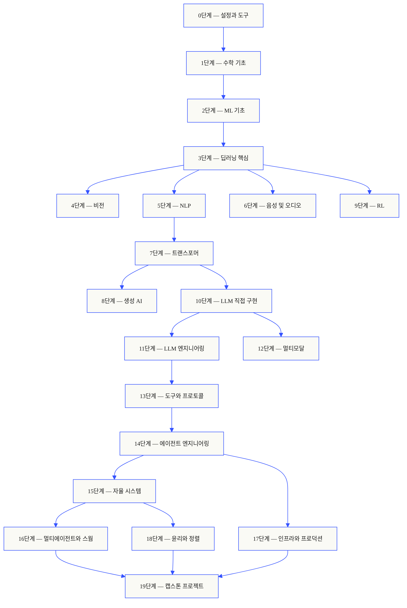
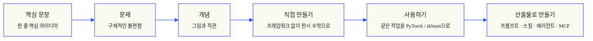

<p align="center">
  
</p>

<p align="center">
  <a href="LICENSE"></a>
  <a href="ROADMAP.md"></a>
  <a href="#contents"></a>
  <a href="https://github.com/rohitg00/ai-engineering-from-scratch/stargazers"></a>
  <a href="https://aiengineeringfromscratch.com"></a>
</p>

## [Agent Memory - #1 지속 메모리 ⭐](https://github.com/rohitg00/agentmemory)를 만든 제작자의 커리큘럼 <a href="https://github.com/rohitg00/agentmemory/stargazers"></a>

```text
░░░▒▒▒░░░▒▒▒░░░▒▒▒░░░▒▒▒░░░▒▒▒░░░▒▒▒░░░▒▒▒░░░▒▒▒░░░▒▒▒░░░▒▒▒░░░▒▒▒░░░▒▒▒░░░▒▒▒░░░▒▒▒░░░▒▒▒
```

> **학생의 84%는 이미 AI 도구를 사용하지만, 전문적으로 사용할 준비가 됐다고 느끼는 비율은 18%뿐입니다.** 이 커리큘럼은 그 간극을 메웁니다.
>
> 503개 레슨, 20개 단계, 약 320시간 분량입니다. Python, TypeScript, Rust, Julia로 배우며, 모든 레슨은 프롬프트, 스킬, 에이전트, MCP 서버 같은 재사용 가능한 산출물을 남깁니다. 무료 오픈소스이며 MIT 라이선스입니다.
>
> AI를 단순히 배우는 데서 끝나지 않습니다. 처음부터 끝까지, 손으로 직접 만듭니다.

> [!NOTE]
> 이 저장소는 원본 [rohitg00/ai-engineering-from-scratch](https://github.com/rohitg00/ai-engineering-from-scratch)를 한국어 학습용으로 번역한 버전입니다. 원저작권과 라이선스는 원본 프로젝트를 따르며, 한국어 사용자가 레슨, 퀴즈, 산출물을 더 쉽게 따라갈 수 있도록 문서를 한국어로 옮겼습니다.

<!-- STATS:START (generated from site/stats.json by build.js — do not edit by hand) -->
<p align="center"><sub>최근 30일 기준 <b>150,639</b>명 독자 &nbsp;·&nbsp; <b>241,669</b>회 페이지 조회 &nbsp;·&nbsp; 기준일 2026-06-07</sub></p>
<!-- STATS:END -->

## 이 커리큘럼의 방식

대부분의 AI 학습 자료는 조각나 있습니다. 어느 날은 논문 하나, 다음 날은 fine-tuning 글 하나, 또 다른 곳에서는 화려한 에이전트 데모를 봅니다. 하지만 그 조각들은 잘 이어지지 않습니다. 챗봇은 배포했지만 loss curve를 설명하지 못하고, 에이전트에 함수를 연결했지만 그 함수를 호출하는 모델 내부의 attention은 설명하지 못하는 일이 흔합니다.

이 커리큘럼은 그 조각들을 하나의 척추로 엮습니다. 20개 단계, 503개 레슨, 네 가지 언어(Python, TypeScript, Rust, Julia)로 구성되어 있습니다. 한쪽 끝에는 선형대수가 있고, 다른 끝에는 자율 swarm이 있습니다. 모든 알고리즘은 먼저 원시 수학에서 출발해 직접 구현합니다. Backprop, tokenizer, attention, 에이전트 루프까지 직접 만들고 나면 PyTorch가 등장했을 때 내부에서 무슨 일을 하는지 이미 알고 있습니다.

각 레슨은 같은 루프를 따릅니다. 문제를 읽고, 수학을 유도하고, 코드를 작성하고, 테스트를 실행하고, 산출물을 남깁니다. 5분짜리 영상이나 복사-붙여넣기 배포가 아니라, 내 노트북에서 직접 실행되는 무료 오픈소스 커리큘럼입니다.

```text
░░░▒▒▒░░░▒▒▒░░░▒▒▒░░░▒▒▒░░░▒▒▒░░░▒▒▒░░░▒▒▒░░░▒▒▒░░░▒▒▒░░░▒▒▒░░░▒▒▒░░░▒▒▒░░░▒▒▒░░░▒▒▒░░░▒▒▒
```

## 커리큘럼 구조

20개 단계는 서로 위에 쌓입니다. 수학이 바닥이고, agent와 production이 지붕입니다. 아래 계층을 이미 알고 있다면 건너뛰어도 되지만, 기초를 건너뛴 뒤 위쪽에서 무언가 깨지는 이유를 모른 채 헤매지는 마세요.



```text
░░░▒▒▒░░░▒▒▒░░░▒▒▒░░░▒▒▒░░░▒▒▒░░░▒▒▒░░░▒▒▒░░░▒▒▒░░░▒▒▒░░░▒▒▒░░░▒▒▒░░░▒▒▒░░░▒▒▒░░░▒▒▒░░░▒▒▒
```

## 레슨 하나의 구조

각 레슨은 독립된 폴더에 있으며, 전체 커리큘럼에서 같은 구조를 사용합니다:

```text
phases/<NN>-<phase-name>/<NN>-<lesson-name>/
├── code/      실행 가능한 구현(Python, TypeScript, Rust, Julia)
├── docs/
│   └── en.md  레슨 설명
└── outputs/   이 레슨이 만드는 프롬프트, 스킬, 에이전트 또는 MCP 서버
```

모든 레슨은 여섯 흐름을 따릅니다. *직접 만들기 / 사용하기* 구조가 핵심입니다. 먼저 알고리즘을 처음부터 구현한 뒤, 같은 작업을 프로덕션 라이브러리로 실행합니다. 작은 버전을 직접 작성했기 때문에 프레임워크가 내부에서 무엇을 하는지 이해하게 됩니다.



## 시작하기

시작하는 방법은 세 가지입니다. 하나를 고르세요.

**옵션 A — 읽기.** [aiengineeringfromscratch.com](https://aiengineeringfromscratch.com)에서 완료된 레슨을 열거나 [목차](#contents)에서 단계를 펼쳐 읽으세요. 설치도 clone도 필요 없습니다.

**옵션 B — clone해서 실행하기.**

```bash
git clone https://github.com/rohitg00/ai-engineering-from-scratch.git
cd ai-engineering-from-scratch
python phases/01-math-foundations/01-linear-algebra-intuition/code/vectors.py
```

**옵션 C — 내 수준 찾기 *(추천)*.** 무작정 건너뛰지 말고, 현재 수준에 맞는 시작점을 찾으세요. Claude, Cursor, Codex, OpenClaw, Hermes 또는 이 커리큘럼 스킬이 설치된 에이전트 안에서 실행합니다:

```bash
/find-your-level
```

10개 질문으로 지식을 진단하고 시작 단계를 추천하며, 예상 시간이 포함된 개인화 경로를 만듭니다. 각 단계를 마친 뒤에는:

```bash
/check-understanding 3        # 3단계 내용을 스스로 점검
ls phases/03-deep-learning-core/05-loss-functions/outputs/
# ├── prompt-loss-function-selector.md
# └── prompt-loss-debugger.md
```

### 준비 사항

- 코드를 작성할 수 있어야 합니다. 언어는 무엇이든 괜찮지만 Python을 알면 좋습니다.
- API 호출만이 아니라 AI가 **실제로 어떻게 작동하는지** 이해하고 싶어야 합니다.

### 내장 에이전트 스킬(Claude, Cursor, Codex, OpenClaw, Hermes)

| 스킬 | 하는 일 |
|---|---|
| [`/find-your-level`](.claude/skills/find-your-level/SKILL.md) | 10문항 배치 퀴즈입니다. 현재 지식을 시작 단계에 매핑하고 예상 시간이 포함된 개인화 경로를 만듭니다. |
| [`/check-understanding <phase>`](.claude/skills/check-understanding/SKILL.md) | 단계별 8문항 퀴즈입니다. 피드백과 복습할 특정 레슨을 알려 줍니다. |

```text
░░░▒▒▒░░░▒▒▒░░░▒▒▒░░░▒▒▒░░░▒▒▒░░░▒▒▒░░░▒▒▒░░░▒▒▒░░░▒▒▒░░░▒▒▒░░░▒▒▒░░░▒▒▒░░░▒▒▒░░░▒▒▒░░░▒▒▒
```

## 모든 레슨은 산출물을 남깁니다

다른 커리큘럼은 보통 *"축하합니다, X를 배웠습니다"*에서 끝납니다. 이 커리큘럼의 각 레슨은 일상 workflow에 설치하거나 붙여 넣어 쓸 수 있는 **재사용 가능한 도구**로 끝납니다.

<table>
<tr>
<th align="left" width="25%"><br/><sub>FIG_001 · A</sub><br/><b>프롬프트</b></th>
<th align="left" width="25%"><br/><sub>FIG_001 · B</sub><br/><b>스킬</b></th>
<th align="left" width="25%"><br/><sub>FIG_001 · C</sub><br/><b>에이전트</b></th>
<th align="left" width="25%"><br/><sub>FIG_001 · D</sub><br/><b>MCP 서버</b></th>
</tr>
<tr>
<td valign="top">좁은 작업에 대한 전문가 수준 도움을 받기 위해 어떤 AI 어시스턴트에든 붙여 넣을 수 있습니다.</td>
<td valign="top">Claude, Cursor, Codex, OpenClaw, Hermes 또는 <code>SKILL.md</code>를 읽는 에이전트에 넣어 사용할 수 있습니다.</td>
<td valign="top">자율 작업자로 배포할 수 있습니다. 14단계에서 루프를 직접 작성합니다.</td>
<td valign="top">MCP 호환 클라이언트에 연결할 수 있습니다. 13단계에서 end-to-end로 만듭니다.</td>
</tr>
</table>

> `python3 scripts/install_skills.py`로 한 번에 설치할 수 있습니다. 숙제가 아니라 실제 도구입니다.
> 커리큘럼을 끝내면 503개의 산출물 포트폴리오가 생깁니다. 직접 만들었기 때문에 실제로 이해하고 있는 도구들입니다.

### FIG_002 · 작동 예시

14단계 1번 레슨: 에이전트 루프입니다. 의존성 없는 순수 Python 약 120줄입니다.

<table>
<tr>
<td valign="top" width="50%">

**`code/agent_loop.py`** &nbsp; <sub><i>직접 만들기</i></sub>

```python
def run(query, tools):
    history = [user(query)]
    for step in range(MAX_STEPS):
        msg = llm(history)
        if msg.tool_calls:
            for call in msg.tool_calls:
                result = tools[call.name](**call.args)
                history.append(tool_result(call.id, result))
            continue
        return msg.content
    raise StepLimitExceeded
```

</td>
<td valign="top" width="50%">

**`outputs/skill-agent-loop.md`** &nbsp; <sub><i>산출물로 만들기</i></sub>

```markdown
---
name: agent-loop
description: ReAct-style loop for any tool list
phase: 14
lesson: 01
---

Implement a minimal agent loop that...
```

**`outputs/prompt-debug-agent.md`**

```markdown
You are an agent debugger. Given the trace
of an agent run, identify the step where
the agent went wrong and explain why...
```

</td>
</tr>
</table>

```text
░░░▒▒▒░░░▒▒▒░░░▒▒▒░░░▒▒▒░░░▒▒▒░░░▒▒▒░░░▒▒▒░░░▒▒▒░░░▒▒▒░░░▒▒▒░░░▒▒▒░░░▒▒▒░░░▒▒▒░░░▒▒▒░░░▒▒▒
```

<a id="contents"></a>

## 목차

20개 단계로 구성되어 있습니다. 각 단계를 펼치면 레슨 목록을 볼 수 있습니다.

<a id="phase-0"></a>
### 0단계: 설정과 도구 `12개 레슨`
> 이후 모든 학습을 위한 환경을 준비합니다.

| # | 레슨 | 유형 | 언어 |
|:---:|--------|:----:|------|
| 01 | [개발 환경](phases/00-setup-and-tooling/01-dev-environment) | 실습 | Python |
| 02 | [Git과 협업](phases/00-setup-and-tooling/02-git-and-collaboration) | 학습 | — |
| 03 | [GPU 설정과 Cloud](phases/00-setup-and-tooling/03-gpu-setup-and-cloud) | 실습 | Python |
| 04 | [API와 키](phases/00-setup-and-tooling/04-apis-and-keys) | 실습 | Python |
| 05 | [Jupyter Notebook](phases/00-setup-and-tooling/05-jupyter-notebooks) | 실습 | Python |
| 06 | [Python Environment](phases/00-setup-and-tooling/06-python-environments) | 실습 | Shell |
| 07 | [AI를 위한 Docker](phases/00-setup-and-tooling/07-docker-for-ai) | 실습 | Docker |
| 08 | [에디터 설정](phases/00-setup-and-tooling/08-editor-setup) | 실습 | — |
| 09 | [데이터 관리](phases/00-setup-and-tooling/09-data-management) | 실습 | Python |
| 10 | [터미널과 셸](phases/00-setup-and-tooling/10-terminal-and-shell) | 학습 | — |
| 11 | [AI를 위한 Linux](phases/00-setup-and-tooling/11-linux-for-ai) | 학습 | — |
| 12 | [디버깅과 프로파일링](phases/00-setup-and-tooling/12-debugging-and-profiling) | 실습 | Python |

<details id="phase-1">
<summary><b>1단계 — 수학 기초</b> &nbsp;<code>22개 레슨</code>&nbsp; <em>모든 AI 알고리즘 뒤의 직관을 코드로 익힙니다.</em></summary>
<br/>

| # | 레슨 | 유형 | 언어 |
|:---:|--------|:----:|------|
| 01 | [선형대수 직관](phases/01-math-foundations/01-linear-algebra-intuition) | 학습 | Python, Julia |
| 02 | [벡터, 행렬, 연산](phases/01-math-foundations/02-vectors-matrices-operations) | 실습 | Python, Julia |
| 03 | [행렬 변환](phases/01-math-foundations/03-matrix-transformations) | 실습 | Python, Julia |
| 04 | [머신러닝을 위한 미적분](phases/01-math-foundations/04-calculus-for-ml) | 학습 | Python |
| 05 | [연쇄 법칙과 자동 미분](phases/01-math-foundations/05-chain-rule-and-autodiff) | 실습 | Python |
| 06 | [확률과 분포](phases/01-math-foundations/06-probability-and-distributions) | 학습 | Python |
| 07 | [베이즈 정리](phases/01-math-foundations/07-bayes-theorem) | 실습 | Python |
| 08 | [최적화](phases/01-math-foundations/08-optimization) | 실습 | Python |
| 09 | [정보 이론](phases/01-math-foundations/09-information-theory) | 학습 | Python |
| 10 | [차원 축소](phases/01-math-foundations/10-dimensionality-reduction) | 실습 | Python |
| 11 | [특이값 분해](phases/01-math-foundations/11-singular-value-decomposition) | 실습 | Python, Julia |
| 12 | [텐서 연산](phases/01-math-foundations/12-tensor-operations) | 실습 | Python |
| 13 | [수치 안정성](phases/01-math-foundations/13-numerical-stability) | 실습 | Python |
| 14 | [노름과 거리](phases/01-math-foundations/14-norms-and-distances) | 실습 | Python |
| 15 | [머신러닝을 위한 통계](phases/01-math-foundations/15-statistics-for-ml) | 실습 | Python |
| 16 | [샘플링 방법](phases/01-math-foundations/16-sampling-methods) | 실습 | Python |
| 17 | [선형 시스템](phases/01-math-foundations/17-linear-systems) | 실습 | Python |
| 18 | [볼록 최적화](phases/01-math-foundations/18-convex-optimization) | 실습 | Python |
| 19 | [AI를 위한 복소수](phases/01-math-foundations/19-complex-numbers) | 학습 | Python |
| 20 | [푸리에 변환](phases/01-math-foundations/20-fourier-transform) | 실습 | Python |
| 21 | [머신러닝을 위한 그래프 이론](phases/01-math-foundations/21-graph-theory) | 실습 | Python |
| 22 | [확률 과정](phases/01-math-foundations/22-stochastic-processes) | 학습 | Python |

</details>

<details id="phase-2">
<summary><b>2단계 — ML 기초</b> &nbsp;<code>18개 레슨</code>&nbsp; <em>고전 ML은 여전히 대부분의 프로덕션 AI를 떠받치는 기반입니다.</em></summary>
<br/>

| # | 레슨 | 유형 | 언어 |
|:---:|--------|:----:|------|
| 01 | [머신러닝이란 무엇인가](phases/02-ml-fundamentals/01-what-is-machine-learning) | 학습 | Python |
| 02 | [선형 회귀](phases/02-ml-fundamentals/02-linear-regression) | 실습 | Python |
| 03 | [로지스틱 회귀](phases/02-ml-fundamentals/03-logistic-regression) | 실습 | Python |
| 04 | [의사결정 트리와 랜덤 포레스트](phases/02-ml-fundamentals/04-decision-trees) | 실습 | Python |
| 05 | [서포트 벡터 머신](phases/02-ml-fundamentals/05-support-vector-machines) | 실습 | Python |
| 06 | [K-최근접 이웃과 거리](phases/02-ml-fundamentals/06-knn-and-distances) | 실습 | Python |
| 07 | [비지도 학습](phases/02-ml-fundamentals/07-unsupervised-learning) | 실습 | Python |
| 08 | [피처 엔지니어링과 피처 선택](phases/02-ml-fundamentals/08-feature-engineering) | 실습 | Python |
| 09 | [모델 평가](phases/02-ml-fundamentals/09-model-evaluation) | 실습 | Python |
| 10 | [편향-분산 트레이드오프](phases/02-ml-fundamentals/10-bias-variance) | 학습 | Python |
| 11 | [앙상블 방법](phases/02-ml-fundamentals/11-ensemble-methods) | 실습 | Python |
| 12 | [하이퍼파라미터 튜닝](phases/02-ml-fundamentals/12-hyperparameter-tuning) | 실습 | Python |
| 13 | [ML Pipeline](phases/02-ml-fundamentals/13-ml-pipelines) | 실습 | Python |
| 14 | [Naive Bayes](phases/02-ml-fundamentals/14-naive-bayes) | 실습 | Python |
| 15 | [시계열 기초](phases/02-ml-fundamentals/15-time-series) | 실습 | Python |
| 16 | [이상 탐지](phases/02-ml-fundamentals/16-anomaly-detection) | 실습 | Python |
| 17 | [불균형 데이터 다루기](phases/02-ml-fundamentals/17-imbalanced-data) | 실습 | Python |
| 18 | [특성 선택](phases/02-ml-fundamentals/18-feature-selection) | 실습 | Python |

</details>

<details id="phase-3">
<summary><b>3단계 — 딥러닝 핵심</b> &nbsp;<code>13개 레슨</code>&nbsp; <em>신경망을 first principles에서 배웁니다. 직접 만들기 전에는 프레임워크를 쓰지 않습니다.</em></summary>
<br/>

| # | 레슨 | 유형 | 언어 |
|:---:|--------|:----:|------|
| 01 | [퍼셉트론](phases/03-deep-learning-core/01-the-perceptron) | 실습 | Python |
| 02 | [다층 네트워크와 순전파](phases/03-deep-learning-core/02-multi-layer-networks) | 실습 | Python |
| 03 | [백프로퍼게이션 직접 구현하기](phases/03-deep-learning-core/03-backpropagation) | 실습 | Python |
| 04 | [활성화 함수](phases/03-deep-learning-core/04-activation-functions) | 실습 | Python |
| 05 | [손실 함수](phases/03-deep-learning-core/05-loss-functions) | 실습 | Python |
| 06 | [옵티마이저](phases/03-deep-learning-core/06-optimizers) | 실습 | Python |
| 07 | [정규화](phases/03-deep-learning-core/07-regularization) | 실습 | Python |
| 08 | [가중치 초기화와 훈련 안정성](phases/03-deep-learning-core/08-weight-initialization) | 실습 | Python |
| 09 | [학습률 스케줄과 워밍업](phases/03-deep-learning-core/09-learning-rate-schedules) | 실습 | Python |
| 10 | [나만의 미니 프레임워크 만들기](phases/03-deep-learning-core/10-mini-framework) | 실습 | Python |
| 11 | [PyTorch 소개](phases/03-deep-learning-core/11-intro-to-pytorch) | 실습 | Python |
| 12 | [JAX 소개](phases/03-deep-learning-core/12-intro-to-jax) | 실습 | Python |
| 13 | [신경망 디버깅](phases/03-deep-learning-core/13-debugging-neural-networks) | 실습 | Python |

</details>

<details id="phase-4">
<summary><b>4단계 — 컴퓨터 비전</b> &nbsp;<code>28개 레슨</code>&nbsp; <em>pixel에서 이해까지, image, video, 3D, VLM, world model을 다룹니다.</em></summary>
<br/>

| # | 레슨 | 유형 | 언어 |
|:---:|--------|:----:|------|
| 01 | [이미지 기초 - 픽셀, 채널, 색 공간](phases/04-computer-vision/01-image-fundamentals) | 학습 | Python |
| 02 | [합성곱 처음부터 만들기](phases/04-computer-vision/02-convolutions-from-scratch) | 실습 | Python |
| 03 | [CNN — LeNet에서 ResNet까지](phases/04-computer-vision/03-cnns-lenet-to-resnet) | 실습 | Python |
| 04 | [이미지 분류](phases/04-computer-vision/04-image-classification) | 실습 | Python |
| 05 | [전이 학습과 파인튜닝](phases/04-computer-vision/05-transfer-learning) | 실습 | Python |
| 06 | [객체 탐지 — YOLO를 scratch로 만들기](phases/04-computer-vision/06-object-detection-yolo) | 실습 | Python |
| 07 | [시맨틱 세그멘테이션 — U-Net](phases/04-computer-vision/07-semantic-segmentation-unet) | 실습 | Python |
| 08 | [인스턴스 세그멘테이션 — Mask R-CNN](phases/04-computer-vision/08-instance-segmentation-mask-rcnn) | 실습 | Python |
| 09 | [이미지 생성 — GAN](phases/04-computer-vision/09-image-generation-gans) | 실습 | Python |
| 10 | [이미지 생성 — Diffusion Models](phases/04-computer-vision/10-image-generation-diffusion) | 실습 | Python |
| 11 | [Stable Diffusion — 아키텍처와 파인튜닝](phases/04-computer-vision/11-stable-diffusion) | 실습 | Python |
| 12 | [비디오 이해 — 시간 모델링](phases/04-computer-vision/12-video-understanding) | 실습 | Python |
| 13 | [3D 비전 — 포인트 클라우드와 NeRF](phases/04-computer-vision/13-3d-vision-nerf) | 실습 | Python |
| 14 | [Vision Transformers (ViT)](phases/04-computer-vision/14-vision-transformers) | 실습 | Python |
| 15 | [실시간 비전 - 엣지 배포](phases/04-computer-vision/15-real-time-edge) | 실습 | Python |
| 16 | [완전한 비전 파이프라인 만들기 - 캡스톤](phases/04-computer-vision/16-vision-pipeline-capstone) | 실습 | Python |
| 17 | [자기지도 비전 — SimCLR, DINO, MAE](phases/04-computer-vision/17-self-supervised-vision) | 실습 | Python |
| 18 | [오픈 어휘 비전 — CLIP](phases/04-computer-vision/18-open-vocab-clip) | 실습 | Python |
| 19 | [OCR & 문서 이해](phases/04-computer-vision/19-ocr-document-understanding) | 실습 | Python |
| 20 | [이미지 검색 & Metric Learning](phases/04-computer-vision/20-image-retrieval-metric) | 실습 | Python |
| 21 | [키포인트 탐지와 포즈 추정](phases/04-computer-vision/21-keypoint-pose) | 실습 | Python |
| 22 | [처음부터 만드는 3D Gaussian Splatting](phases/04-computer-vision/22-3d-gaussian-splatting) | 실습 | Python |
| 23 | [디퓨전 트랜스포머와 Rectified Flow](phases/04-computer-vision/23-diffusion-transformers-rectified-flow) | 실습 | Python |
| 24 | [SAM 3와 Open-Vocabulary Segmentation](phases/04-computer-vision/24-sam3-open-vocab-segmentation) | 실습 | Python |
| 25 | [비전-언어 모델 - ViT-MLP-LLM 패턴](phases/04-computer-vision/25-vision-language-models) | 실습 | Python |
| 26 | [단안 깊이 및 기하 추정](phases/04-computer-vision/26-monocular-depth) | 실습 | Python |
| 27 | [다중 객체 추적과 비디오 메모리](phases/04-computer-vision/27-multi-object-tracking) | 실습 | Python |
| 28 | [월드 모델과 비디오 디퓨전](phases/04-computer-vision/28-world-models-video-diffusion) | 실습 | Python |

</details>

<details id="phase-5">
<summary><b>5단계 — NLP: 기초부터 고급까지</b> &nbsp;<code>29개 레슨</code>&nbsp; <em>언어는 지능과 상호작용하는 인터페이스입니다.</em></summary>
<br/>

| # | 레슨 | 유형 | 언어 |
|:---:|--------|:----:|------|
| 01 | [텍스트 처리 - 토큰화, 스테밍, 표제어 추출](phases/05-nlp-foundations-to-advanced/01-text-processing) | 실습 | Python |
| 02 | [Bag of Words, TF-IDF, 텍스트 표현](phases/05-nlp-foundations-to-advanced/02-bag-of-words-tfidf) | 실습 | Python |
| 03 | [Word Embeddings — Word2Vec 직접 구현](phases/05-nlp-foundations-to-advanced/03-word-embeddings-word2vec) | 실습 | Python |
| 04 | [GloVe, FastText, Subword Embeddings](phases/05-nlp-foundations-to-advanced/04-glove-fasttext-subword) | 실습 | Python |
| 05 | [감성 분석 (Sentiment Analysis)](phases/05-nlp-foundations-to-advanced/05-sentiment-analysis) | 실습 | Python |
| 06 | [개체명 인식 (Named Entity Recognition)](phases/05-nlp-foundations-to-advanced/06-named-entity-recognition) | 실습 | Python |
| 07 | [POS 태깅과 구문 파싱](phases/05-nlp-foundations-to-advanced/07-pos-tagging-parsing) | 실습 | Python |
| 08 | [텍스트용 CNN과 RNN](phases/05-nlp-foundations-to-advanced/08-cnns-rnns-for-text) | 실습 | Python |
| 09 | [Sequence-to-Sequence 모델](phases/05-nlp-foundations-to-advanced/09-sequence-to-sequence) | 실습 | Python |
| 10 | [Attention Mechanism — 돌파구](phases/05-nlp-foundations-to-advanced/10-attention-mechanism) | 실습 | Python |
| 11 | [기계 번역](phases/05-nlp-foundations-to-advanced/11-machine-translation) | 실습 | Python |
| 12 | [텍스트 요약](phases/05-nlp-foundations-to-advanced/12-text-summarization) | 실습 | Python |
| 13 | [질의응답 시스템](phases/05-nlp-foundations-to-advanced/13-question-answering) | 실습 | Python |
| 14 | [정보 검색과 Search](phases/05-nlp-foundations-to-advanced/14-information-retrieval-search) | 실습 | Python |
| 15 | [토픽 모델링 — LDA와 BERTopic](phases/05-nlp-foundations-to-advanced/15-topic-modeling) | 실습 | Python |
| 16 | [Transformers 이전의 Text Generation — N-gram Language Models](phases/05-nlp-foundations-to-advanced/16-text-generation-pre-transformer) | 실습 | Python |
| 17 | [챗봇 — Rule-Based에서 Neural, LLM Agent까지](phases/05-nlp-foundations-to-advanced/17-chatbots-rule-to-neural) | 실습 | Python |
| 18 | [다국어 NLP](phases/05-nlp-foundations-to-advanced/18-multilingual-nlp) | 실습 | Python |
| 19 | [서브워드 토큰화 — BPE, WordPiece, Unigram, SentencePiece](phases/05-nlp-foundations-to-advanced/19-subword-tokenization) | 학습 | Python |
| 20 | [구조화 출력과 Constrained Decoding](phases/05-nlp-foundations-to-advanced/20-structured-outputs-constrained-decoding) | 실습 | Python |
| 21 | [자연어 추론 — 텍스트 함의](phases/05-nlp-foundations-to-advanced/21-nli-textual-entailment) | 학습 | Python |
| 22 | [Embedding Models — 2026년 심층 분석](phases/05-nlp-foundations-to-advanced/22-embedding-models-deep-dive) | 학습 | Python |
| 23 | [RAG를 위한 청킹 전략](phases/05-nlp-foundations-to-advanced/23-chunking-strategies-rag) | 실습 | Python |
| 24 | [Coreference Resolution](phases/05-nlp-foundations-to-advanced/24-coreference-resolution) | 학습 | Python |
| 25 | [Entity Linking & Disambiguation](phases/05-nlp-foundations-to-advanced/25-entity-linking) | 실습 | Python |
| 26 | [Relation Extraction & Knowledge Graph Construction](phases/05-nlp-foundations-to-advanced/26-relation-extraction-kg) | 실습 | Python |
| 27 | [LLM 평가 — RAGAS, DeepEval, G-Eval](phases/05-nlp-foundations-to-advanced/27-llm-evaluation-frameworks) | 실습 | Python |
| 28 | [Long-Context 평가 — NIAH, RULER, LongBench, MRCR](phases/05-nlp-foundations-to-advanced/28-long-context-evaluation) | 학습 | Python |
| 29 | [Dialogue State Tracking](phases/05-nlp-foundations-to-advanced/29-dialogue-state-tracking) | 실습 | Python |

</details>

<details id="phase-6">
<summary><b>6단계 — 음성 및 오디오</b> &nbsp;<code>17개 레슨</code>&nbsp; <em>듣고, 이해하고, 말하는 모델을 다룹니다.</em></summary>
<br/>

| # | 레슨 | 유형 | 언어 |
|:---:|--------|:----:|------|
| 01 | [오디오 기초 — 파형, 샘플링, 푸리에 변환](phases/06-speech-and-audio/01-audio-fundamentals) | 학습 | Python |
| 02 | [스펙트로그램, Mel 스케일 및 오디오 특징](phases/06-speech-and-audio/02-spectrograms-mel-features) | 실습 | Python |
| 03 | [오디오 분류 — MFCC 기반 k-NN부터 AST와 BEATs까지](phases/06-speech-and-audio/03-audio-classification) | 실습 | Python |
| 04 | [음성 인식(ASR) — CTC, RNN-T, Attention](phases/06-speech-and-audio/04-speech-recognition-asr) | 실습 | Python |
| 05 | [Whisper — 아키텍처와 파인튜닝](phases/06-speech-and-audio/05-whisper-architecture-finetuning) | 실습 | Python |
| 06 | [화자 인식과 검증](phases/06-speech-and-audio/06-speaker-recognition-verification) | 실습 | Python |
| 07 | [텍스트 음성 변환(TTS) — Tacotron에서 F5와 Kokoro까지](phases/06-speech-and-audio/07-text-to-speech) | 실습 | Python |
| 08 | [음성 클로닝과 음성 변환](phases/06-speech-and-audio/08-voice-cloning-conversion) | 실습 | Python |
| 09 | [음악 생성: MusicGen, Stable Audio, Suno, 그리고 라이선스 지각변동](phases/06-speech-and-audio/09-music-generation) | 실습 | Python |
| 10 | [오디오-언어 모델: Qwen2.5-Omni, Audio Flamingo, GPT-4o Audio](phases/06-speech-and-audio/10-audio-language-models) | 실습 | Python |
| 11 | [실시간 오디오 처리](phases/06-speech-and-audio/11-real-time-audio-processing) | 실습 | Python |
| 12 | [음성 어시스턴트 파이프라인 만들기: Phase 6 Capstone](phases/06-speech-and-audio/12-voice-assistant-pipeline) | 실습 | Python |
| 13 | [신경 오디오 코덱: EnCodec, SNAC, Mimi, DAC와 Semantic-Acoustic Split](phases/06-speech-and-audio/13-neural-audio-codecs) | 학습 | Python |
| 14 | [음성 활동 감지와 턴 처리 — Silero, Cobra, 그리고 Flush Trick](phases/06-speech-and-audio/14-voice-activity-detection-turn-taking) | 실습 | Python |
| 15 | [스트리밍 Speech-to-Speech — Moshi, Hibiki, 그리고 Full-Duplex 대화](phases/06-speech-and-audio/15-streaming-speech-to-speech-moshi-hibiki) | 학습 | Python |
| 16 | [음성 anti-spoofing과 오디오 watermarking — ASVspoof 5, AudioSeal, WaveVerify](phases/06-speech-and-audio/16-anti-spoofing-audio-watermarking) | 실습 | Python |
| 17 | [오디오 평가 — WER, MOS, UTMOS, MMAU, FAD, 그리고 공개 리더보드](phases/06-speech-and-audio/17-audio-evaluation-metrics) | 학습 | Python |

</details>

<details id="phase-7">
<summary><b>7단계 — 트랜스포머 심층 탐구</b> &nbsp;<code>14개 레슨</code>&nbsp; <em>모든 것을 바꾼 아키텍처를 이해합니다.</em></summary>
<br/>

| # | 레슨 | 유형 | 언어 |
|:---:|--------|:----:|------|
| 01 | [왜 Transformer인가 — RNN의 문제들](phases/07-transformers-deep-dive/01-why-transformers) | 학습 | Python |
| 02 | [Self-Attention 처음부터 구현하기](phases/07-transformers-deep-dive/02-self-attention-from-scratch) | 실습 | Python |
| 03 | [Multi-Head Attention](phases/07-transformers-deep-dive/03-multi-head-attention) | 실습 | Python |
| 04 | [Positional Encoding — Sinusoidal, RoPE, ALiBi](phases/07-transformers-deep-dive/04-positional-encoding) | 실습 | Python |
| 05 | [전체 Transformer — 인코더 + 디코더](phases/07-transformers-deep-dive/05-full-transformer) | 실습 | Python |
| 06 | [BERT — Masked Language Modeling](phases/07-transformers-deep-dive/06-bert-masked-language-modeling) | 실습 | Python |
| 07 | [GPT — Causal Language Modeling](phases/07-transformers-deep-dive/07-gpt-causal-language-modeling) | 실습 | Python |
| 08 | [T5, BART — Encoder-Decoder 모델](phases/07-transformers-deep-dive/08-t5-bart-encoder-decoder) | 학습 | Python |
| 09 | [Vision Transformer (ViT)](phases/07-transformers-deep-dive/09-vision-transformers) | 실습 | Python |
| 10 | [Audio Transformer — Whisper 아키텍처](phases/07-transformers-deep-dive/10-audio-transformers-whisper) | 학습 | Python |
| 11 | [Mixture of Experts (MoE)](phases/07-transformers-deep-dive/11-mixture-of-experts) | 실습 | Python |
| 12 | [KV Cache, Flash Attention & Inference Optimization](phases/07-transformers-deep-dive/12-kv-cache-flash-attention) | 실습 | Python |
| 13 | [스케일링 법칙](phases/07-transformers-deep-dive/13-scaling-laws) | 학습 | Python |
| 14 | [트랜스포머를 처음부터 만들기 — 캡스톤](phases/07-transformers-deep-dive/14-build-a-transformer-capstone) | 실습 | Python |
| 15 | [Attention 변형 — Sliding Window, Sparse, Differential](phases/07-transformers-deep-dive/15-attention-variants) | 실습 | Python |
| 16 | [Speculative Decoding — draft하고 검증하고 반복하기](phases/07-transformers-deep-dive/16-speculative-decoding) | 실습 | Python |

</details>

<details id="phase-8">
<summary><b>8단계 — 생성 AI</b> &nbsp;<code>14개 레슨</code>&nbsp; <em>image, video, audio, 3D 등을 생성하는 모델을 배웁니다.</em></summary>
<br/>

| # | 레슨 | 유형 | 언어 |
|:---:|--------|:----:|------|
| 01 | [생성 모델 — 분류 체계와 역사](phases/08-generative-ai/01-generative-models-taxonomy-history) | 학습 | Python |
| 02 | [오토인코더와 변분 오토인코더(VAE)](phases/08-generative-ai/02-autoencoders-vae) | 실습 | Python |
| 03 | [GAN — Generator 대 Discriminator](phases/08-generative-ai/03-gans-generator-discriminator) | 실습 | Python |
| 04 | [조건부 GAN과 Pix2Pix](phases/08-generative-ai/04-conditional-gans-pix2pix) | 실습 | Python |
| 05 | [StyleGAN](phases/08-generative-ai/05-stylegan) | 실습 | Python |
| 06 | [Diffusion 모델 — DDPM을 처음부터 만들기](phases/08-generative-ai/06-diffusion-ddpm-from-scratch) | 실습 | Python |
| 07 | [Latent Diffusion과 Stable Diffusion](phases/08-generative-ai/07-latent-diffusion-stable-diffusion) | 실습 | Python |
| 08 | [ControlNet, LoRA와 Conditioning](phases/08-generative-ai/08-controlnet-lora-conditioning) | 실습 | Python |
| 09 | [인페인팅, 아웃페인팅 및 이미지 편집](phases/08-generative-ai/09-inpainting-outpainting-editing) | 실습 | Python |
| 10 | [비디오 생성](phases/08-generative-ai/10-video-generation) | 실습 | Python |
| 11 | [오디오 생성](phases/08-generative-ai/11-audio-generation) | 실습 | Python |
| 12 | [3D 생성](phases/08-generative-ai/12-3d-generation) | 실습 | Python |
| 13 | [Flow Matching과 Rectified Flow](phases/08-generative-ai/13-flow-matching-rectified-flows) | 실습 | Python |
| 14 | [평가 - FID, CLIP Score, Human Preference](phases/08-generative-ai/14-evaluation-fid-clip-score) | 실습 | Python |
| 19 | [Visual Autoregressive Modeling(VAR): Next-Scale Prediction](phases/08-generative-ai/19-visual-autoregressive-var) | 실습 | Python |

</details>

<details id="phase-9">
<summary><b>9단계 — 강화학습</b> &nbsp;<code>12개 레슨</code>&nbsp; <em>RLHF와 game-playing AI의 기반입니다.</em></summary>
<br/>

| # | 레슨 | 유형 | 언어 |
|:---:|--------|:----:|------|
| 01 | [MDP, 상태, 행동, 보상](phases/09-reinforcement-learning/01-mdps-states-actions-rewards) | 학습 | Python |
| 02 | [Dynamic Programming — Policy Iteration과 Value Iteration](phases/09-reinforcement-learning/02-dynamic-programming) | 실습 | Python |
| 03 | [Monte Carlo Methods — 완전한 Episode로부터 학습하기](phases/09-reinforcement-learning/03-monte-carlo-methods) | 실습 | Python |
| 04 | [Temporal Difference — Q-Learning과 SARSA](phases/09-reinforcement-learning/04-q-learning-sarsa) | 실습 | Python |
| 05 | [Deep Q-Networks (DQN)](phases/09-reinforcement-learning/05-dqn) | 실습 | Python |
| 06 | [Policy Gradient — REINFORCE를 처음부터 만들기](phases/09-reinforcement-learning/06-policy-gradients-reinforce) | 실습 | Python |
| 07 | [Actor-Critic — A2C와 A3C](phases/09-reinforcement-learning/07-actor-critic-a2c-a3c) | 실습 | Python |
| 08 | [Proximal Policy Optimization (PPO)](phases/09-reinforcement-learning/08-ppo) | 실습 | Python |
| 09 | [Reward Modeling과 RLHF](phases/09-reinforcement-learning/09-reward-modeling-rlhf) | 실습 | Python |
| 10 | [Multi-Agent RL](phases/09-reinforcement-learning/10-multi-agent-rl) | 실습 | Python |
| 11 | [Sim-to-Real Transfer](phases/09-reinforcement-learning/11-sim-to-real-transfer) | 실습 | Python |
| 12 | [게임을 위한 RL — AlphaZero, MuZero, 그리고 LLM-Reasoning 시대](phases/09-reinforcement-learning/12-rl-for-games) | 실습 | Python |

</details>

<details id="phase-10">
<summary><b>10단계 — LLM 직접 구현</b> &nbsp;<code>22개 레슨</code>&nbsp; <em>대규모 언어 모델을 만들고, 학습시키고, 이해합니다.</em></summary>
<br/>

| # | 레슨 | 유형 | 언어 |
|:---:|--------|:----:|------|
| 01 | [Tokenizers: BPE, WordPiece, SentencePiece](phases/10-llms-from-scratch/01-tokenizers) | 실습 | Python, Rust |
| 02 | [처음부터 Tokenizer 만들기](phases/10-llms-from-scratch/02-building-a-tokenizer) | 실습 | Python |
| 03 | [Pre-Training을 위한 Data Pipeline](phases/10-llms-from-scratch/03-data-pipelines) | 실습 | Python |
| 04 | [Mini GPT 사전학습(124M 파라미터)](phases/10-llms-from-scratch/04-pre-training-mini-gpt) | 실습 | Python |
| 05 | [스케일링: 분산 학습, FSDP, DeepSpeed](phases/10-llms-from-scratch/05-scaling-distributed) | 실습 | Python |
| 06 | [지시 튜닝(SFT)](phases/10-llms-from-scratch/06-instruction-tuning-sft) | 실습 | Python |
| 07 | [RLHF: Reward Model + PPO](phases/10-llms-from-scratch/07-rlhf) | 실습 | Python |
| 08 | [DPO: Direct Preference Optimization](phases/10-llms-from-scratch/08-dpo) | 실습 | Python |
| 09 | [Constitutional AI와 Self-Improvement](phases/10-llms-from-scratch/09-constitutional-ai-self-improvement) | 실습 | Python |
| 10 | [평가: Benchmarks, Evals, LM Harness](phases/10-llms-from-scratch/10-evaluation) | 실습 | Python |
| 11 | [양자화: 모델을 메모리에 맞추기](phases/10-llms-from-scratch/11-quantization) | 실습 | Python |
| 12 | [Inference 최적화](phases/10-llms-from-scratch/12-inference-optimization) | 실습 | Python |
| 13 | [완전한 LLM Pipeline 구축](phases/10-llms-from-scratch/13-building-complete-llm-pipeline) | 실습 | Python |
| 14 | [Open Model 아키텍처 해설](phases/10-llms-from-scratch/14-open-models-architecture-walkthroughs) | 학습 | Python |
| 15 | [Speculative Decoding과 EAGLE-3](phases/10-llms-from-scratch/15-speculative-decoding-eagle3) | 실습 | Python |
| 16 | [Differential Attention (V2)](phases/10-llms-from-scratch/16-differential-attention-v2) | 실습 | Python |
| 17 | [Native Sparse Attention(DeepSeek NSA)](phases/10-llms-from-scratch/17-native-sparse-attention) | 실습 | Python |
| 18 | [Multi-Token Prediction (MTP)](phases/10-llms-from-scratch/18-multi-token-prediction) | 실습 | Python |
| 19 | [DualPipe 병렬화](phases/10-llms-from-scratch/19-dualpipe-parallelism) | 학습 | Python |
| 20 | [DeepSeek-V3 아키텍처 해설](phases/10-llms-from-scratch/20-deepseek-v3-walkthrough) | 학습 | Python |
| 21 | [Jamba — Hybrid SSM-Transformer](phases/10-llms-from-scratch/21-jamba-hybrid-ssm-transformer) | 학습 | Python |
| 22 | [Async와 Hogwild! Inference](phases/10-llms-from-scratch/22-async-hogwild-inference) | 실습 | Python |
| 25 | [Speculative Decoding과 EAGLE](phases/10-llms-from-scratch/25-speculative-decoding) | 실습 | Python |
| 34 | [Gradient Checkpointing과 Activation Recomputation](phases/10-llms-from-scratch/34-gradient-checkpointing) | 실습 | Python |

</details>

<details id="phase-11">
<summary><b>11단계 — LLM 엔지니어링</b> &nbsp;<code>17개 레슨</code>&nbsp; <em>LLM을 프로덕션 애플리케이션에서 활용합니다.</em></summary>
<br/>

| # | 레슨 | 유형 | 언어 |
|:---:|--------|:----:|------|
| 01 | [프롬프트 엔지니어링: 기법과 패턴](phases/11-llm-engineering/01-prompt-engineering) | 실습 | Python |
| 02 | [Few-Shot, Chain-of-Thought, Tree-of-Thought](phases/11-llm-engineering/02-few-shot-cot) | 실습 | Python |
| 03 | [구조화 출력: JSON, 스키마 검증, constrained decoding](phases/11-llm-engineering/03-structured-outputs) | 실습 | Python |
| 04 | [임베딩과 벡터 표현](phases/11-llm-engineering/04-embeddings) | 실습 | Python |
| 05 | [컨텍스트 엔지니어링: 창, 예산, 메모리, 검색](phases/11-llm-engineering/05-context-engineering) | 실습 | Python |
| 06 | [RAG (Retrieval-Augmented Generation)](phases/11-llm-engineering/06-rag) | 실습 | Python |
| 07 | [고급 RAG(청킹, Reranking, Hybrid Search)](phases/11-llm-engineering/07-advanced-rag) | 실습 | Python |
| 08 | [LoRA & QLoRA로 Fine-Tuning하기](phases/11-llm-engineering/08-fine-tuning-lora) | 실습 | Python |
| 09 | [함수 호출과 도구 사용](phases/11-llm-engineering/09-function-calling) | 실습 | Python |
| 10 | [LLM 애플리케이션 평가와 테스트](phases/11-llm-engineering/10-evaluation) | 실습 | Python |
| 11 | [캐싱, 레이트 리미팅과 비용 최적화](phases/11-llm-engineering/11-caching-cost) | 실습 | Python |
| 12 | [가드레일, 안전 및 콘텐츠 필터링](phases/11-llm-engineering/12-guardrails) | 실습 | Python |
| 13 | [프로덕션 LLM 애플리케이션 구축](phases/11-llm-engineering/13-production-app) | 실습 | Python |
| 14 | [Model Context Protocol (MCP)](phases/11-llm-engineering/14-model-context-protocol) | 실습 | Python |
| 15 | [프롬프트 캐싱과 컨텍스트 캐싱](phases/11-llm-engineering/15-prompt-caching) | 실습 | Python |
| 16 | [LangGraph — State Machines for Agents](phases/11-llm-engineering/16-langgraph-state-machines) | 실습 | Python |
| 17 | [에이전트 프레임워크 트레이드오프 — LangGraph vs CrewAI vs AutoGen vs Agno](phases/11-llm-engineering/17-agent-framework-tradeoffs) | 학습 | Python |

</details>

<details id="phase-12">
<summary><b>12단계 — 멀티모달 AI</b> &nbsp;<code>25개 레슨</code>&nbsp; <em>ViT 패치부터 computer-use 에이전트까지, 보고 듣고 읽고 여러 modality를 넘나들며 추론합니다.</em></summary>
<br/>

| # | 레슨 | 유형 | 언어 |
|:---:|--------|:----:|------|
| 01 | [Vision Transformer와 패치 토큰 기본형](phases/12-multimodal-ai/01-vision-transformer-patch-tokens) | 학습 | Python |
| 02 | [CLIP과 대조적 비전-언어 사전학습](phases/12-multimodal-ai/02-clip-contrastive-pretraining) | 실습 | Python |
| 03 | [CLIP에서 BLIP-2까지 - 모달리티 브리지로서의 Q-Former](phases/12-multimodal-ai/03-blip2-qformer-bridge) | 실습 | Python |
| 04 | [Flamingo와 퓨샷 VLM을 위한 게이트형 교차 어텐션](phases/12-multimodal-ai/04-flamingo-gated-cross-attention) | 학습 | Python |
| 05 | [LLaVA와 시각 지시 튜닝](phases/12-multimodal-ai/05-llava-visual-instruction-tuning) | 실습 | Python |
| 06 | [임의 해상도 비전: Patch-n'-Pack과 NaFlex](phases/12-multimodal-ai/06-any-resolution-patch-n-pack) | 실습 | Python |
| 07 | [오픈 가중치 VLM 레시피: 실제로 중요한 것](phases/12-multimodal-ai/07-open-weight-vlm-recipes) | 학습 | Python |
| 08 | [LLaVA-OneVision: 하나의 모델로 단일 이미지, 다중 이미지, 비디오 처리](phases/12-multimodal-ai/08-llava-onevision-single-multi-video) | 실습 | Python |
| 09 | [Qwen-VL 계열과 Dynamic-FPS 비디오](phases/12-multimodal-ai/09-qwen-vl-family-dynamic-fps) | 학습 | Python |
| 10 | [InternVL3: 네이티브 멀티모달 사전학습](phases/12-multimodal-ai/10-internvl3-native-multimodal) | 학습 | Python |
| 11 | [Chameleon과 초기 융합 토큰 전용 멀티모달 모델](phases/12-multimodal-ai/11-chameleon-early-fusion-tokens) | 실습 | Python |
| 12 | [Emu3: 이미지와 비디오 생성을 위한 다음 토큰 예측](phases/12-multimodal-ai/12-emu3-next-token-for-generation) | 학습 | Python |
| 13 | [Transfusion: 하나의 Transformer 안의 자기회귀 텍스트와 확산 이미지](phases/12-multimodal-ai/13-transfusion-autoregressive-diffusion) | 실습 | Python |
| 14 | [Show-o와 이산 확산 통합 모델](phases/12-multimodal-ai/14-show-o-discrete-diffusion-unified) | 학습 | Python |
| 15 | [Janus-Pro: 통합 멀티모달 모델을 위한 분리형 인코더](phases/12-multimodal-ai/15-janus-pro-decoupled-encoders) | 실습 | Python |
| 16 | [MIO와 Any-to-Any 스트리밍 멀티모달 모델](phases/12-multimodal-ai/16-mio-any-to-any-streaming) | 학습 | Python |
| 17 | [비디오-언어 모델: 시간 토큰과 그라운딩](phases/12-multimodal-ai/17-video-language-temporal-grounding) | 실습 | Python |
| 18 | [백만 토큰 컨텍스트에서의 장시간 비디오 이해](phases/12-multimodal-ai/18-long-video-million-token) | 실습 | Python |
| 19 | [오디오-언어 모델: Whisper에서 Audio Flamingo 3까지의 흐름](phases/12-multimodal-ai/19-audio-language-whisper-to-af3) | 실습 | Python |
| 20 | [옴니 모델: Qwen2.5-Omni와 Thinker-Talker 분리](phases/12-multimodal-ai/20-omni-models-thinker-talker) | 실습 | Python |
| 21 | [체화형 VLA: RT-2, OpenVLA, π0, GR00T](phases/12-multimodal-ai/21-embodied-vlas-openvla-pi0-groot) | 학습 | Python |
| 22 | [문서와 다이어그램 이해](phases/12-multimodal-ai/22-document-diagram-understanding) | 실습 | Python |
| 23 | [ColPali와 비전 네이티브 문서 RAG](phases/12-multimodal-ai/23-colpali-vision-native-rag) | 실습 | Python |
| 24 | [멀티모달 RAG와 크로스모달 검색](phases/12-multimodal-ai/24-multimodal-rag-cross-modal) | 실습 | Python |
| 25 | [멀티모달 에이전트와 컴퓨터 사용(캡스톤)](phases/12-multimodal-ai/25-multimodal-agents-computer-use) | 실습 | Python |

</details>

<details id="phase-13">
<summary><b>13단계 — 도구와 프로토콜</b> &nbsp;<code>23개 레슨</code>&nbsp; <em>AI와 현실 세계를 잇는 interface를 다룹니다.</em></summary>
<br/>

| # | 레슨 | 유형 | 언어 |
|:---:|--------|:----:|------|
| 01 | [Tool Interface - 에이전트에 구조화된 I/O가 필요한 이유](phases/13-tools-and-protocols/01-the-tool-interface) | 학습 | Python |
| 02 | [Function Calling 심층 분석 - OpenAI, Anthropic, Gemini](phases/13-tools-and-protocols/02-function-calling-deep-dive) | 실습 | Python |
| 03 | [Parallel Tool Calls와 Tool Streaming](phases/13-tools-and-protocols/03-parallel-and-streaming-tool-calls) | 실습 | Python |
| 04 | [Structured Output - JSON Schema, Pydantic, Zod, Constrained Decoding](phases/13-tools-and-protocols/04-structured-output) | 실습 | Python |
| 05 | [Tool Schema Design - 이름, 설명, 파라미터 제약](phases/13-tools-and-protocols/05-tool-schema-design) | 학습 | Python |
| 06 | [MCP 기초 — 프리미티브, 생명주기, JSON-RPC 기반](phases/13-tools-and-protocols/06-mcp-fundamentals) | 학습 | Python |
| 07 | [MCP Server 만들기 — Python + TypeScript SDK](phases/13-tools-and-protocols/07-building-an-mcp-server) | 실습 | Python |
| 08 | [MCP Client 만들기 — Discovery, Invocation, Session 관리](phases/13-tools-and-protocols/08-building-an-mcp-client) | 실습 | Python |
| 09 | [MCP Transports — stdio, Streamable HTTP, SSE 마이그레이션](phases/13-tools-and-protocols/09-mcp-transports) | 학습 | Python |
| 10 | [MCP Resources와 Prompts — Tools 너머의 Context 노출](phases/13-tools-and-protocols/10-mcp-resources-and-prompts) | 실습 | Python |
| 11 | [MCP Sampling — 서버가 요청하는 LLM 완성과 에이전트 루프](phases/13-tools-and-protocols/11-mcp-sampling) | 실습 | Python |
| 12 | [Roots와 Elicitation — 범위 지정과 실행 중 사용자 입력](phases/13-tools-and-protocols/12-mcp-roots-and-elicitation) | 실습 | Python |
| 13 | [Async Tasks(SEP-1686) — 긴 작업을 지금 호출하고 나중에 가져오기](phases/13-tools-and-protocols/13-mcp-async-tasks) | 실습 | Python |
| 14 | [MCP Apps — `ui://`를 통한 인터랙티브 UI 리소스](phases/13-tools-and-protocols/14-mcp-apps) | 실습 | Python |
| 15 | [MCP Security I — Tool Poisoning, Rug Pull, Cross-Server Shadowing](phases/13-tools-and-protocols/15-mcp-security-tool-poisoning) | 학습 | Python |
| 16 | [MCP Security II — OAuth 2.1, Resource Indicator, Incremental Scope](phases/13-tools-and-protocols/16-mcp-security-oauth-2-1) | 실습 | Python |
| 17 | [MCP Gateways와 Registries — 엔터프라이즈 Control Plane](phases/13-tools-and-protocols/17-mcp-gateways-and-registries) | 학습 | Python |
| 18 | [Production MCP Auth — Enrollment, JWKS Refresh, Audience-Pinned Token](phases/13-tools-and-protocols/18-mcp-auth-production) | 실습 | Python |
| 19 | [A2A — Agent-to-Agent Protocol](phases/13-tools-and-protocols/19-a2a-protocol) | 실습 | Python |
| 20 | [OpenTelemetry GenAI — Tool Call End-to-End 추적](phases/13-tools-and-protocols/20-opentelemetry-genai) | 실습 | Python |
| 21 | [LLM Routing Layer — LiteLLM, OpenRouter, Portkey](phases/13-tools-and-protocols/21-llm-routing-layer) | 학습 | Python |
| 22 | [Skills와 Agent SDKs — Anthropic Skills, AGENTS.md, OpenAI Apps SDK](phases/13-tools-and-protocols/22-skills-and-agent-sdks) | 학습 | Python |
| 23 | [Capstone — 완전한 Tool Ecosystem 만들기](phases/13-tools-and-protocols/23-capstone-tool-ecosystem) | 실습 | Python |

</details>

<details id="phase-14">
<summary><b>14단계 — 에이전트 엔지니어링</b> &nbsp;<code>42개 레슨</code>&nbsp; <em>loop, memory, planning, 프레임워크, benchmark, 프로덕션, workbench까지 에이전트를 first principles에서 만듭니다.</em></summary>
<br/>

| # | 레슨 | 유형 | 언어 |
|:---:|--------|:----:|------|
| 01 | [The Agent Loop: Observe, Think, Act](phases/14-agent-engineering/01-the-agent-loop) | 실습 | Python |
| 02 | [ReWOO and Plan-and-Execute: Decoupled Planning](phases/14-agent-engineering/02-rewoo-plan-and-execute) | 실습 | Python |
| 03 | [Reflexion: Verbal Reinforcement Learning](phases/14-agent-engineering/03-reflexion-verbal-rl) | 실습 | Python |
| 04 | [Tree of Thoughts and LATS: Deliberate Search](phases/14-agent-engineering/04-tree-of-thoughts-lats) | 실습 | Python |
| 05 | [Self-Refine and CRITIC: Iterative Output Improvement](phases/14-agent-engineering/05-self-refine-and-critic) | 실습 | Python |
| 06 | [Tool Use and Function Calling](phases/14-agent-engineering/06-tool-use-and-function-calling) | 실습 | Python |
| 07 | [Memory: Virtual Context and MemGPT](phases/14-agent-engineering/07-memory-virtual-context-memgpt) | 실습 | Python |
| 08 | [Memory Blocks와 Sleep-Time Compute (Letta)](phases/14-agent-engineering/08-memory-blocks-sleep-time-compute) | 실습 | Python |
| 09 | [Hybrid Memory: Vector + Graph + KV (Mem0)](phases/14-agent-engineering/09-hybrid-memory-mem0) | 실습 | Python |
| 10 | [Skill Library와 Lifelong Learning (Voyager)](phases/14-agent-engineering/10-skill-libraries-voyager) | 실습 | Python |
| 11 | [HTN과 Evolutionary Search로 Planning하기](phases/14-agent-engineering/11-planning-htn-and-evolutionary) | 실습 | Python |
| 12 | [Anthropic의 Workflow Patterns: 복잡함보다 단순함](phases/14-agent-engineering/12-anthropic-workflow-patterns) | 실습 | Python |
| 13 | [LangGraph: Stateful Graph와 Durable Execution](phases/14-agent-engineering/13-langgraph-stateful-graphs) | 실습 | Python |
| 14 | [AutoGen v0.4: Actor Model과 Agent Framework](phases/14-agent-engineering/14-autogen-actor-model) | 실습 | Python |
| 15 | [CrewAI: 역할 기반 Crew와 Flow](phases/14-agent-engineering/15-crewai-role-based-crews) | 실습 | Python |
| 16 | [OpenAI Agents SDK: 핸드오프, 가드레일, 트레이싱](phases/14-agent-engineering/16-openai-agents-sdk) | 실습 | Python |
| 17 | [Claude Agent SDK: Subagent와 Session Store](phases/14-agent-engineering/17-claude-agent-sdk) | 실습 | Python |
| 18 | [Agno와 Mastra: 프로덕션 런타임](phases/14-agent-engineering/18-agno-and-mastra-runtimes) | 학습 | Python |
| 19 | [Benchmark: SWE-bench, GAIA, AgentBench](phases/14-agent-engineering/19-benchmarks-swebench-gaia) | 학습 | Python |
| 20 | [Benchmark: WebArena와 OSWorld](phases/14-agent-engineering/20-benchmarks-webarena-osworld) | 학습 | Python |
| 21 | [Computer Use: Claude, OpenAI CUA, Gemini](phases/14-agent-engineering/21-computer-use-agents) | 실습 | Python |
| 22 | [음성 에이전트: Pipecat과 LiveKit](phases/14-agent-engineering/22-voice-agents-pipecat-livekit) | 실습 | Python |
| 23 | [OpenTelemetry GenAI Semantic Conventions](phases/14-agent-engineering/23-otel-genai-conventions) | 실습 | Python |
| 24 | [에이전트 Observability: Langfuse, Phoenix, Opik](phases/14-agent-engineering/24-agent-observability-platforms) | 학습 | Python |
| 25 | [Multi-Agent Debate와 Collaboration](phases/14-agent-engineering/25-multi-agent-debate) | 실습 | Python |
| 26 | [Failure Modes: 에이전트가 깨지는 이유](phases/14-agent-engineering/26-failure-modes-agentic) | 실습 | Python |
| 27 | [Prompt Injection과 PVE Defense](phases/14-agent-engineering/27-prompt-injection-defense) | 실습 | Python |
| 28 | [Orchestration Patterns: Supervisor, Swarm, Hierarchical](phases/14-agent-engineering/28-orchestration-patterns) | 실습 | Python |
| 29 | [Production Runtimes: Queue, Event, Cron](phases/14-agent-engineering/29-production-runtimes) | 학습 | Python |
| 30 | [Eval-Driven Agent Development](phases/14-agent-engineering/30-eval-driven-agent-development) | 실습 | Python |
| 31 | [Agent Workbench Engineering: Why Capable Models Still Fail](phases/14-agent-engineering/31-agent-workbench-why-models-fail) | 학습 | Python |
| 32 | [The Minimal Agent Workbench](phases/14-agent-engineering/32-minimal-agent-workbench) | 실습 | Python |
| 33 | [Agent Instructions as Executable Constraints](phases/14-agent-engineering/33-instructions-as-executable-constraints) | 실습 | Python |
| 34 | [Repo Memory and Durable State](phases/14-agent-engineering/34-repo-memory-and-state) | 실습 | Python |
| 35 | [Initialization Scripts for Agents](phases/14-agent-engineering/35-initialization-scripts) | 실습 | Python |
| 36 | [Scope Contracts and Task Boundaries](phases/14-agent-engineering/36-scope-contracts) | 실습 | Python |
| 37 | [Runtime Feedback Loops](phases/14-agent-engineering/37-runtime-feedback-loops) | 실습 | Python |
| 38 | [Verification Gates](phases/14-agent-engineering/38-verification-gates) | 실습 | Python |
| 39 | [Reviewer Agent: Separate Builder from Marker](phases/14-agent-engineering/39-reviewer-agent) | 실습 | Python |
| 40 | [Multi-Session Handoff](phases/14-agent-engineering/40-multi-session-handoff) | 실습 | Python |
| 41 | [The Workbench on a Real Repo](phases/14-agent-engineering/41-workbench-for-real-repos) | 실습 | Python |
| 42 | [Capstone: Ship a Reusable Agent Workbench Pack](phases/14-agent-engineering/42-agent-workbench-capstone) | 실습 | Python |

Each Phase 14 workbench lesson (31-42) ships a `mission.md` briefing the agent before it opens the full lesson docs.

</details>

<details id="phase-15">
<summary><b>15단계 — 자율 시스템</b> &nbsp;<code>22개 레슨</code>&nbsp; <em>long-horizon 에이전트, self-improvement, 2026 safety stack을 다룹니다.</em></summary>
<br/>

| # | 레슨 | 유형 | 언어 |
|:---:|--------|:----:|------|
| 01 | [The Shift from Chatbots to Long-Horizon Agents](phases/15-autonomous-systems/01-long-horizon-agents) | 학습 | Python |
| 02 | [STaR, V-STaR, Quiet-STaR — Self-Taught Reasoning](phases/15-autonomous-systems/02-star-family-reasoning) | 학습 | Python |
| 03 | [AlphaEvolve — Evolutionary Coding Agents](phases/15-autonomous-systems/03-alphaevolve-evolutionary-coding) | 학습 | Python |
| 04 | [Darwin Godel Machine — Open-Ended Self-Modifying Agents](phases/15-autonomous-systems/04-darwin-godel-machine) | 학습 | Python |
| 05 | [AI Scientist v2 — Workshop-Level Autonomous Research](phases/15-autonomous-systems/05-ai-scientist-v2) | 학습 | Python |
| 06 | [Automated Alignment Research (Anthropic AAR)](phases/15-autonomous-systems/06-automated-alignment-research) | 학습 | Python |
| 07 | [Recursive Self-Improvement — Capability vs Alignment](phases/15-autonomous-systems/07-recursive-self-improvement) | 학습 | Python |
| 08 | [Bounded Self-Improvement Designs](phases/15-autonomous-systems/08-bounded-self-improvement) | 학습 | Python |
| 09 | [The Autonomous Coding Agent Landscape (2026)](phases/15-autonomous-systems/09-coding-agent-landscape) | 학습 | Python |
| 10 | [Claude Code as an Autonomous Agent: Permission Modes and Auto Mode](phases/15-autonomous-systems/10-claude-code-permission-modes) | 학습 | Python |
| 11 | [Browser Agents and Long-Horizon Web Tasks](phases/15-autonomous-systems/11-browser-agents) | 학습 | Python |
| 12 | [Long-Running Background Agents: Durable Execution](phases/15-autonomous-systems/12-durable-execution) | 학습 | Python |
| 13 | [Action Budgets, Iteration Caps, and Cost Governors](phases/15-autonomous-systems/13-cost-governors) | 학습 | Python |
| 14 | [Kill Switches, Circuit Breakers, and Canary Tokens](phases/15-autonomous-systems/14-kill-switches-canaries) | 학습 | Python |
| 15 | [Human-in-the-Loop: Propose-Then-Commit](phases/15-autonomous-systems/15-propose-then-commit) | 학습 | Python |
| 16 | [Checkpoints and Rollback](phases/15-autonomous-systems/16-checkpoints-rollback) | 학습 | Python |
| 17 | [Constitutional AI and Rule Overrides](phases/15-autonomous-systems/17-constitutional-ai) | 학습 | Python |
| 18 | [Llama Guard and Input/Output Classification](phases/15-autonomous-systems/18-llama-guard) | 학습 | Python |
| 19 | [Anthropic Responsible Scaling Policy v3.0](phases/15-autonomous-systems/19-anthropic-rsp) | 학습 | Python |
| 20 | [OpenAI Preparedness Framework and DeepMind Frontier Safety Framework](phases/15-autonomous-systems/20-openai-preparedness-deepmind-fsf) | 학습 | Python |
| 21 | [METR Time Horizons and External Capability Evaluation](phases/15-autonomous-systems/21-metr-external-evaluation) | 학습 | Python |
| 22 | [CAIS, CAISI, and Societal-Scale Risk](phases/15-autonomous-systems/22-cais-caisi-societal-risk) | 학습 | Python |

</details>

<details id="phase-16">
<summary><b>16단계 — 멀티에이전트와 스웜</b> &nbsp;<code>25개 레슨</code>&nbsp; <em>Coordination, emergence, collective intelligence를 다룹니다.</em></summary>
<br/>

| # | 레슨 | 유형 | 언어 |
|:---:|--------|:----:|------|
| 01 | [Why Multi-Agent?](phases/16-multi-agent-and-swarms/01-why-multi-agent) | 학습 | TypeScript |
| 02 | [Heritage of FIPA-ACL and Speech Acts](phases/16-multi-agent-and-swarms/02-fipa-acl-heritage) | 학습 | Python |
| 03 | [Communication Protocols](phases/16-multi-agent-and-swarms/03-communication-protocols) | 실습 | TypeScript |
| 04 | [The Multi-Agent Primitive Model](phases/16-multi-agent-and-swarms/04-primitive-model) | 학습 | Python |
| 05 | [Supervisor / Orchestrator-Worker Pattern](phases/16-multi-agent-and-swarms/05-supervisor-orchestrator-pattern) | 실습 | Python |
| 06 | [Hierarchical Architecture and Its Failure Mode](phases/16-multi-agent-and-swarms/06-hierarchical-architecture) | 학습 | Python |
| 07 | [Society of Mind and Multi-Agent Debate](phases/16-multi-agent-and-swarms/07-society-of-mind-debate) | 실습 | Python |
| 08 | [Role Specialization — Planner, Critic, Executor, Verifier](phases/16-multi-agent-and-swarms/08-role-specialization) | 실습 | Python |
| 09 | [Parallel / Swarm / Networked Architectures](phases/16-multi-agent-and-swarms/09-parallel-swarm-networks) | 실습 | Python |
| 10 | [Group Chat and Speaker Selection](phases/16-multi-agent-and-swarms/10-group-chat-speaker-selection) | 실습 | Python |
| 11 | [Handoffs and Routines — Stateless Orchestration](phases/16-multi-agent-and-swarms/11-handoffs-and-routines) | 실습 | Python |
| 12 | [A2A — The Agent-to-Agent Protocol](phases/16-multi-agent-and-swarms/12-a2a-protocol) | 실습 | Python |
| 13 | [Shared Memory and Blackboard Patterns](phases/16-multi-agent-and-swarms/13-shared-memory-blackboard) | 실습 | Python |
| 14 | [Consensus and Byzantine Fault Tolerance for Agents](phases/16-multi-agent-and-swarms/14-consensus-and-bft) | 실습 | Python |
| 15 | [Voting, Self-Consistency, and Debate Topology](phases/16-multi-agent-and-swarms/15-voting-debate-topology) | 실습 | Python |
| 16 | [Negotiation and Bargaining](phases/16-multi-agent-and-swarms/16-negotiation-bargaining) | 실습 | Python |
| 17 | [Generative Agents and Emergent Simulation](phases/16-multi-agent-and-swarms/17-generative-agents-simulation) | 실습 | Python |
| 18 | [Theory of Mind and Emergent Coordination](phases/16-multi-agent-and-swarms/18-theory-of-mind-coordination) | 실습 | Python |
| 19 | [Swarm Optimization for LLMs (PSO, ACO)](phases/16-multi-agent-and-swarms/19-swarm-optimization-pso-aco) | 실습 | Python |
| 20 | [MARL — MADDPG, QMIX, MAPPO](phases/16-multi-agent-and-swarms/20-marl-maddpg-qmix-mappo) | 학습 | Python |
| 21 | [Agent Economies, Token Incentives, Reputation](phases/16-multi-agent-and-swarms/21-agent-economies) | 학습 | Python |
| 22 | [Production Scaling — Queues, Checkpoints, Durability](phases/16-multi-agent-and-swarms/22-production-scaling-queues-checkpoints) | 실습 | Python |
| 23 | [Failure Modes — MAST, Groupthink, Monoculture, Cascading Errors](phases/16-multi-agent-and-swarms/23-failure-modes-mast-groupthink) | 학습 | Python |
| 24 | [Evaluation and Coordination Benchmarks](phases/16-multi-agent-and-swarms/24-evaluation-coordination-benchmarks) | 학습 | Python |
| 25 | [Case Studies and the 2026 State of the Art](phases/16-multi-agent-and-swarms/25-case-studies-2026-sota) | 학습 | Python |

</details>

<details id="phase-17">
<summary><b>17단계 — 인프라와 프로덕션</b> &nbsp;<code>28개 레슨</code>&nbsp; <em>AI를 현실 세계에 배포합니다.</em></summary>
<br/>

| # | 레슨 | 유형 | 언어 |
|:---:|--------|:----:|------|
| 01 | [Managed LLM Platforms — Bedrock, Vertex AI, Azure OpenAI](phases/17-infrastructure-and-production/01-managed-llm-platforms) | 학습 | Python |
| 02 | [Inference Platform Economics — Fireworks, Together, Baseten, Modal, Replicate, Anyscale](phases/17-infrastructure-and-production/02-inference-platform-economics) | 학습 | Python |
| 03 | [GPU Autoscaling on Kubernetes — Karpenter, KAI Scheduler, Gang Scheduling](phases/17-infrastructure-and-production/03-gpu-autoscaling-kubernetes) | 학습 | Python |
| 04 | [vLLM Serving Internals: PagedAttention, Continuous Batching, Chunked Prefill](phases/17-infrastructure-and-production/04-vllm-serving-internals) | 학습 | Python |
| 05 | [EAGLE-3 Speculative Decoding in Production](phases/17-infrastructure-and-production/05-eagle3-speculative-decoding) | 학습 | Python |
| 06 | [SGLang and RadixAttention for Prefix-Heavy Workloads](phases/17-infrastructure-and-production/06-sglang-radixattention) | 학습 | Python |
| 07 | [TensorRT-LLM on Blackwell with FP8 and NVFP4](phases/17-infrastructure-and-production/07-tensorrt-llm-blackwell) | 학습 | Python |
| 08 | [Inference Metrics — TTFT, TPOT, ITL, Goodput, P99](phases/17-infrastructure-and-production/08-inference-metrics-goodput) | 학습 | Python |
| 09 | [Production Quantization — AWQ, GPTQ, GGUF K-quants, FP8, MXFP4/NVFP4](phases/17-infrastructure-and-production/09-production-quantization) | 학습 | Python |
| 10 | [Cold Start Mitigation for Serverless LLMs](phases/17-infrastructure-and-production/10-cold-start-mitigation) | 학습 | Python |
| 11 | [Multi-Region LLM Serving and KV Cache Locality](phases/17-infrastructure-and-production/11-multi-region-kv-locality) | 학습 | Python |
| 12 | [Edge Inference — Apple Neural Engine, Qualcomm Hexagon, WebGPU/WebLLM, Jetson](phases/17-infrastructure-and-production/12-edge-inference) | 학습 | Python |
| 13 | [LLM Observability Stack Selection](phases/17-infrastructure-and-production/13-llm-observability) | 학습 | Python |
| 14 | [Prompt Caching and Semantic Caching Economics](phases/17-infrastructure-and-production/14-prompt-semantic-caching) | 학습 | Python |
| 15 | [Batch APIs — the 50% Discount as Industry Standard](phases/17-infrastructure-and-production/15-batch-apis) | 학습 | Python |
| 16 | [Model Routing as a Cost-Reduction Primitive](phases/17-infrastructure-and-production/16-model-routing) | 학습 | Python |
| 17 | [Disaggregated Prefill/Decode — NVIDIA Dynamo and llm-d](phases/17-infrastructure-and-production/17-disaggregated-prefill-decode) | 학습 | Python |
| 18 | [vLLM Production Stack with LMCache KV Offloading](phases/17-infrastructure-and-production/18-vllm-production-stack-lmcache) | 학습 | Python |
| 19 | [AI Gateways — LiteLLM, Portkey, Kong AI Gateway, Bifrost](phases/17-infrastructure-and-production/19-ai-gateways) | 학습 | Python |
| 20 | [Shadow Traffic, Canary Rollout, and Progressive Deployment for LLMs](phases/17-infrastructure-and-production/20-shadow-canary-progressive) | 학습 | Python |
| 21 | [A/B Testing LLM Features — GrowthBook, Statsig, and the Vibes Problem](phases/17-infrastructure-and-production/21-ab-testing-llm-features) | 학습 | Python |
| 22 | [Load Testing LLM APIs — Why k6 and Locust Lie](phases/17-infrastructure-and-production/22-load-testing-llm-apis) | 실습 | Python |
| 23 | [SRE for AI — Multi-Agent Incident Response, Runbooks, Predictive Detection](phases/17-infrastructure-and-production/23-sre-for-ai) | 학습 | Python |
| 24 | [Chaos Engineering for LLM Production](phases/17-infrastructure-and-production/24-chaos-engineering-llm) | 학습 | Python |
| 25 | [Security — Secrets, API Key Rotation, Audit Logs, Guardrails](phases/17-infrastructure-and-production/25-security-secrets-audit) | 학습 | Python |
| 26 | [Compliance — SOC 2, HIPAA, GDPR, PCI-DSS, EU AI Act, ISO 42001](phases/17-infrastructure-and-production/26-compliance-frameworks) | 학습 | Python |
| 27 | [FinOps for LLMs — Unit Economics and Multi-Tenant Attribution](phases/17-infrastructure-and-production/27-finops-llms) | 학습 | Python |
| 28 | [Self-Hosted Serving Selection — llama.cpp, Ollama, TGI, vLLM, SGLang](phases/17-infrastructure-and-production/28-self-hosted-serving-selection) | 학습 | Python |

</details>

<details id="phase-18">
<summary><b>18단계 — 윤리, 안전, 정렬</b> &nbsp;<code>30개 레슨</code>&nbsp; <em>인류에게 도움이 되는 AI를 만들기 위한 필수 단계입니다.</em></summary>
<br/>

| # | 레슨 | 유형 | 언어 |
|:---:|--------|:----:|------|
| 01 | [Instruction-Following as Alignment Signal](phases/18-ethics-safety-alignment/01-instruction-following-alignment-signal) | 학습 | Python |
| 02 | [Reward Hacking and Goodhart's Law](phases/18-ethics-safety-alignment/02-reward-hacking-goodhart) | 학습 | Python |
| 03 | [The Direct Preference Optimization Family](phases/18-ethics-safety-alignment/03-direct-preference-optimization-family) | 학습 | Python |
| 04 | [Sycophancy as RLHF Amplification](phases/18-ethics-safety-alignment/04-sycophancy-rlhf-amplification) | 학습 | Python |
| 05 | [Constitutional AI and RLAIF](phases/18-ethics-safety-alignment/05-constitutional-ai-rlaif) | 학습 | Python |
| 06 | [Mesa-Optimization and Deceptive Alignment](phases/18-ethics-safety-alignment/06-mesa-optimization-deceptive-alignment) | 학습 | Python |
| 07 | [Sleeper Agents — Persistent Deception](phases/18-ethics-safety-alignment/07-sleeper-agents-persistent-deception) | 학습 | Python |
| 08 | [In-Context Scheming in Frontier Models](phases/18-ethics-safety-alignment/08-in-context-scheming-frontier-models) | 학습 | Python |
| 09 | [Alignment Faking](phases/18-ethics-safety-alignment/09-alignment-faking) | 학습 | Python |
| 10 | [AI Control — Safety Despite Subversion](phases/18-ethics-safety-alignment/10-ai-control-subversion) | 학습 | Python |
| 11 | [Scalable Oversight and Weak-to-Strong Generalization](phases/18-ethics-safety-alignment/11-scalable-oversight-weak-to-strong) | 학습 | Python |
| 12 | [Red-Teaming: PAIR and Automated Attacks](phases/18-ethics-safety-alignment/12-red-teaming-pair-automated-attacks) | 실습 | Python |
| 13 | [Many-Shot Jailbreaking](phases/18-ethics-safety-alignment/13-many-shot-jailbreaking) | 학습 | Python |
| 14 | [ASCII Art and Visual Jailbreaks](phases/18-ethics-safety-alignment/14-ascii-art-visual-jailbreaks) | 실습 | Python |
| 15 | [Indirect Prompt Injection — Production Attack Surface](phases/18-ethics-safety-alignment/15-indirect-prompt-injection) | 실습 | Python |
| 16 | [Red-Team Tooling — Garak, Llama Guard, PyRIT](phases/18-ethics-safety-alignment/16-red-team-tooling-garak-llamaguard-pyrit) | 실습 | Python |
| 17 | [WMDP and Dual-Use Capability Evaluation](phases/18-ethics-safety-alignment/17-wmdp-dual-use-evaluation) | 학습 | Python |
| 18 | [Frontier Safety Frameworks — RSP, PF, FSF](phases/18-ethics-safety-alignment/18-frontier-safety-frameworks-rsp-pf-fsf) | 학습 | Python |
| 19 | [Anthropic's Model Welfare Program](phases/18-ethics-safety-alignment/19-model-welfare-research) | 학습 | Python |
| 20 | [Bias and Representational Harm in LLMs](phases/18-ethics-safety-alignment/20-bias-representational-harm) | 실습 | Python |
| 21 | [Fairness Criteria — Group, Individual, Counterfactual](phases/18-ethics-safety-alignment/21-fairness-criteria-group-individual-counterfactual) | 학습 | Python |
| 22 | [Differential Privacy for LLMs](phases/18-ethics-safety-alignment/22-differential-privacy-for-llms) | 실습 | Python |
| 23 | [Watermarking — SynthID, Stable Signature, C2PA](phases/18-ethics-safety-alignment/23-watermarking-synthid-stable-signature-c2pa) | 실습 | Python |
| 24 | [Regulatory Frameworks — EU, US, UK, Korea](phases/18-ethics-safety-alignment/24-regulatory-frameworks-eu-us-uk-korea) | 학습 | Python |
| 25 | [EchoLeak and the Emergence of CVEs for AI](phases/18-ethics-safety-alignment/25-echoleak-cves-for-ai) | 학습 | Python |
| 26 | [Model, System, and Dataset Cards](phases/18-ethics-safety-alignment/26-model-system-dataset-cards) | 실습 | Python |
| 27 | [Data Provenance and Training-Data Governance](phases/18-ethics-safety-alignment/27-data-provenance-training-governance) | 학습 | Python |
| 28 | [Alignment Research Ecosystem — MATS, Redwood, Apollo, METR](phases/18-ethics-safety-alignment/28-alignment-research-ecosystem) | 학습 | Python |
| 29 | [Moderation Systems — OpenAI, Perspective, Llama Guard](phases/18-ethics-safety-alignment/29-moderation-systems-openai-perspective-llamaguard) | 실습 | Python |
| 30 | [Dual-Use Risk — Cyber, Bio, Chem, Nuclear Uplift](phases/18-ethics-safety-alignment/30-dual-use-risk-cyber-bio-chem-nuclear) | 학습 | Python |

</details>

<details id="phase-19">
<summary><b>19단계 — 캡스톤 프로젝트</b> &nbsp;<code>85개 레슨</code>&nbsp; <em>17개 end-to-end product와 9개 deep-build track입니다. 프로젝트당 20-40시간, track당 4-12개 레슨입니다.</em></summary>
<br/>

| # | 프로젝트 | 결합 단계 | 언어 |
|:---:|---------|----------|------|
| 01 | [Capstone 01 — Terminal-Native Coding Agent](phases/19-capstone-projects/01-terminal-native-coding-agent) | P0 P5 P7 P10 P11 P13 P14 P15 P17 P18 | Python |
| 02 | [Capstone 02 — RAG over Codebase (Cross-Repo Semantic Search)](phases/19-capstone-projects/02-rag-over-codebase) | P5 P7 P11 P13 P17 | Python |
| 03 | [Capstone 03 — Real-Time Voice Assistant (ASR to LLM to TTS)](phases/19-capstone-projects/03-realtime-voice-assistant) | P6 P7 P11 P13 P14 P17 | Python |
| 04 | [Capstone 04 — Multimodal Document QA (Vision-First PDF, Tables, Charts)](phases/19-capstone-projects/04-multimodal-document-qa) | P4 P5 P7 P11 P12 P17 | Python |
| 05 | [Capstone 05 — Autonomous Research Agent (AI-Scientist Class)](phases/19-capstone-projects/05-autonomous-research-agent) | P0 P2 P3 P7 P10 P14 P15 P16 P18 | Python |
| 06 | [Capstone 06 — DevOps Troubleshooting Agent for Kubernetes](phases/19-capstone-projects/06-devops-troubleshooting-agent) | P11 P13 P14 P15 P17 P18 | Python |
| 07 | [Capstone 07 — End-to-End Fine-Tuning Pipeline (Data to SFT to DPO to Serve)](phases/19-capstone-projects/07-end-to-end-fine-tuning-pipeline) | P2 P3 P7 P10 P11 P17 P18 | Python |
| 08 | [Capstone 08 — Production RAG Chatbot for a Regulated Vertical](phases/19-capstone-projects/08-production-rag-chatbot) | P5 P7 P11 P12 P17 P18 | Python |
| 09 | [Capstone 09 — Code Migration Agent (Repo-Level Language / Runtime Upgrade)](phases/19-capstone-projects/09-code-migration-agent) | P5 P7 P11 P13 P14 P15 P17 | Python |
| 10 | [Capstone 10 — Multi-Agent Software Engineering Team](phases/19-capstone-projects/10-multi-agent-software-team) | P11 P13 P14 P15 P16 P17 | Python |
| 11 | [Capstone 11 — LLM Observability & Eval Dashboard](phases/19-capstone-projects/11-llm-observability-dashboard) | P11 P13 P17 P18 | Python |
| 12 | [Capstone 12 — Video Understanding Pipeline (Scene, QA, Search)](phases/19-capstone-projects/12-video-understanding-pipeline) | P4 P6 P7 P11 P12 P17 | Python |
| 13 | [Capstone 13 — MCP Server with Registry and Governance](phases/19-capstone-projects/13-mcp-server-with-registry) | P11 P13 P14 P17 P18 | Python |
| 14 | [Capstone 14 — Speculative-Decoding Inference Server](phases/19-capstone-projects/14-speculative-decoding-server) | P3 P7 P10 P17 | Python |
| 15 | [Capstone 15 — Constitutional Safety Harness + Red-Team Range](phases/19-capstone-projects/15-constitutional-safety-harness) | P10 P11 P13 P14 P18 | Python |
| 16 | [Capstone 16 — GitHub Issue-to-PR Autonomous Agent](phases/19-capstone-projects/16-github-issue-to-pr-agent) | P11 P13 P14 P15 P17 | Python |
| 17 | [Capstone 17 — Personal AI Tutor (Adaptive, Multimodal, with Memory)](phases/19-capstone-projects/17-personal-ai-tutor) | P5 P6 P11 P12 P14 P17 P18 | Python |

**Deep-build tracks** — multi-lesson series that build a complete subsystem from scratch.

| # | 프로젝트 | 결합 단계 | 언어 |
|:---:|---------|----------|------|
| 20 | [Agent Harness Loop Contract](phases/19-capstone-projects/20-agent-harness-loop-contract) | A. Agent harness | Python |
| 21 | [Tool Registry with Schema Validation](phases/19-capstone-projects/21-tool-registry-schema-validation) | A. Agent harness | Python |
| 22 | [JSON-RPC 2.0 Over Newline-Delimited Stdio](phases/19-capstone-projects/22-jsonrpc-stdio-transport) | A. Agent harness | Python |
| 23 | [Function Call Dispatcher](phases/19-capstone-projects/23-function-call-dispatcher) | A. Agent harness | Python |
| 24 | [Plan-Execute Control Flow](phases/19-capstone-projects/24-plan-execute-control-flow) | A. Agent harness | Python |
| 25 | [Capstone Lesson 25: Verification Gates and the Observation Budget](phases/19-capstone-projects/25-verification-gates-observation-budget) | A. Agent harness | Python |
| 26 | [Capstone Lesson 26: Sandbox Runner with Denylist and Path Jail](phases/19-capstone-projects/26-sandbox-runner-denylist) | A. Agent harness | Python |
| 27 | [Capstone Lesson 27: Eval Harness with Fixture Tasks](phases/19-capstone-projects/27-eval-harness-fixture-tasks) | A. Agent harness | Python |
| 28 | [Capstone Lesson 28: Observability with OTel GenAI Spans and Prometheus Metrics](phases/19-capstone-projects/28-observability-otel-traces) | A. Agent harness | Python |
| 29 | [Capstone Lesson 29: End-to-End Coding Agent on the Harness](phases/19-capstone-projects/29-end-to-end-coding-task-demo) | A. Agent harness | Python |
| 30 | [BPE Tokenizer From Scratch](phases/19-capstone-projects/30-bpe-tokenizer-from-scratch) | B. NLP LLM | Python |
| 31 | [Tokenized Dataset with Sliding Window](phases/19-capstone-projects/31-tokenized-dataset-sliding-window) | B. NLP LLM | Python |
| 32 | [Token and Positional Embeddings](phases/19-capstone-projects/32-token-positional-embeddings) | B. NLP LLM | Python |
| 33 | [Multi-Head Self-Attention](phases/19-capstone-projects/33-multihead-self-attention) | B. NLP LLM | Python |
| 34 | [Transformer Block from Scratch](phases/19-capstone-projects/34-transformer-block) | B. NLP LLM | Python |
| 35 | [GPT Model Assembly](phases/19-capstone-projects/35-gpt-model-assembly) | B. NLP LLM | Python |
| 36 | [Training Loop and Evaluation](phases/19-capstone-projects/36-training-loop-eval) | B. NLP LLM | Python |
| 37 | [Loading Pretrained Weights](phases/19-capstone-projects/37-loading-pretrained-weights) | B. NLP LLM | Python |
| 38 | [Capstone Lesson 38: Classifier Fine-Tuning by Head Swap](phases/19-capstone-projects/38-classifier-finetuning) | B. NLP LLM | Python |
| 39 | [Capstone Lesson 39: Instruction Tuning by Supervised Fine-Tuning](phases/19-capstone-projects/39-instruction-tuning-sft) | B. NLP LLM | Python |
| 40 | [Capstone Lesson 40: Direct Preference Optimization from Scratch](phases/19-capstone-projects/40-dpo-from-scratch) | B. NLP LLM | Python |
| 41 | [Capstone Lesson 41: Full Evaluation Pipeline](phases/19-capstone-projects/41-eval-pipeline) | B. NLP LLM | Python |
| 42 | [Large Corpus Downloader](phases/19-capstone-projects/42-large-corpus-downloader) | C. Train end-to-end | Python |
| 43 | [HDF5 Tokenized Corpus](phases/19-capstone-projects/43-hdf5-tokenized-corpus) | C. Train end-to-end | Python |
| 44 | [Cosine LR with Linear Warmup](phases/19-capstone-projects/44-cosine-lr-warmup) | C. Train end-to-end | Python |
| 45 | [Gradient Clipping and Mixed Precision](phases/19-capstone-projects/45-gradient-clipping-amp) | C. Train end-to-end | Python |
| 46 | [Gradient Accumulation](phases/19-capstone-projects/46-gradient-accumulation) | C. Train end-to-end | Python |
| 47 | [Checkpoint Save and Resume](phases/19-capstone-projects/47-checkpoint-save-resume) | C. Train end-to-end | Python |
| 48 | [Distributed Data Parallel and FSDP from Scratch](phases/19-capstone-projects/48-distributed-fsdp-ddp) | C. Train end-to-end | Python |
| 49 | [Language Model Evaluation Harness](phases/19-capstone-projects/49-lm-eval-harness) | C. Train end-to-end | Python |
| 50 | [Hypothesis Generator](phases/19-capstone-projects/50-hypothesis-generator) | D. Auto research | Python |
| 51 | [Literature Retrieval](phases/19-capstone-projects/51-literature-retrieval) | D. Auto research | Python |
| 52 | [Experiment Runner](phases/19-capstone-projects/52-experiment-runner) | D. Auto research | Python |
| 53 | [Result Evaluator](phases/19-capstone-projects/53-result-evaluator) | D. Auto research | Python |
| 54 | [Paper Writer](phases/19-capstone-projects/54-paper-writer) | D. Auto research | Python |
| 55 | [Critic Loop](phases/19-capstone-projects/55-critic-loop) | D. Auto research | Python |
| 56 | [Iteration Scheduler](phases/19-capstone-projects/56-iteration-scheduler) | D. Auto research | Python |
| 57 | [End-to-End Research Demo](phases/19-capstone-projects/57-end-to-end-research-demo) | D. Auto research | Python |
| 58 | [Vision Encoder Patches](phases/19-capstone-projects/58-vision-encoder-patches) | E. Multimodal VLM | Python |
| 59 | [Vision Transformer Encoder](phases/19-capstone-projects/59-vit-transformer) | E. Multimodal VLM | Python |
| 60 | [Projection Layer for Modality Alignment](phases/19-capstone-projects/60-projection-layer-modality-align) | E. Multimodal VLM | Python |
| 61 | [Cross-Attention Fusion](phases/19-capstone-projects/61-cross-attention-fusion) | E. Multimodal VLM | Python |
| 62 | [Vision-Language Pretraining](phases/19-capstone-projects/62-vision-language-pretraining) | E. Multimodal VLM | Python |
| 63 | [Multimodal Evaluation](phases/19-capstone-projects/63-multimodal-eval) | E. Multimodal VLM | Python |
| 64 | [Chunking Strategies, Compared](phases/19-capstone-projects/64-chunking-strategies-advanced) | F. Advanced RAG | Python |
| 65 | [Hybrid Retrieval with BM25 and Dense Embeddings](phases/19-capstone-projects/65-hybrid-retrieval-bm25-dense) | F. Advanced RAG | Python |
| 66 | [Cross-Encoder Reranker](phases/19-capstone-projects/66-reranker-cross-encoder) | F. Advanced RAG | Python |
| 67 | [Query Rewriting: HyDE, Multi-Query, and Decomposition](phases/19-capstone-projects/67-query-rewriting-hyde) | F. Advanced RAG | Python |
| 68 | [RAG Evaluation: Precision, Recall, MRR, nDCG, Faithfulness, Answer Relevance](phases/19-capstone-projects/68-rag-eval-precision-recall) | F. Advanced RAG | Python |
| 69 | [End-to-End RAG System](phases/19-capstone-projects/69-end-to-end-rag-system) | F. Advanced RAG | Python |
| 70 | [Task Spec Format](phases/19-capstone-projects/70-task-spec-format) | G. Eval framework | Python |
| 71 | [Classical Metrics](phases/19-capstone-projects/71-classical-metrics) | G. Eval framework | Python |
| 72 | [Code Exec Metric](phases/19-capstone-projects/72-code-exec-metric) | G. Eval framework | Python |
| 73 | [Perplexity and Calibration](phases/19-capstone-projects/73-perplexity-calibration) | G. Eval framework | Python |
| 74 | [Leaderboard Aggregation](phases/19-capstone-projects/74-leaderboard-aggregation) | G. Eval framework | Python |
| 75 | [End-to-End Eval Runner](phases/19-capstone-projects/75-end-to-end-eval-runner) | G. Eval framework | Python |
| 76 | [Collective Ops From Scratch](phases/19-capstone-projects/76-collective-ops-from-scratch) | H. Distributed train | Python |
| 77 | [Data Parallel DDP From Scratch](phases/19-capstone-projects/77-data-parallel-ddp) | H. Distributed train | Python |
| 78 | [ZeRO Optimizer State Sharding](phases/19-capstone-projects/78-zero-parameter-sharding) | H. Distributed train | Python |
| 79 | [Pipeline Parallel and Bubble Analysis](phases/19-capstone-projects/79-pipeline-parallel) | H. Distributed train | Python |
| 80 | [Sharded Checkpoint and Atomic Resume](phases/19-capstone-projects/80-checkpoint-sharded-resume) | H. Distributed train | Python |
| 81 | [End-to-End Distributed Training](phases/19-capstone-projects/81-end-to-end-distributed-train) | H. Distributed train | Python |
| 82 | [Capstone 82 — Jailbreak Taxonomy](phases/19-capstone-projects/82-jailbreak-taxonomy) | I. Safety harness | Python |
| 83 | [Capstone 83 — Prompt Injection Detector](phases/19-capstone-projects/83-prompt-injection-detector) | I. Safety harness | Python |
| 84 | [Capstone 84 — Refusal Evaluation](phases/19-capstone-projects/84-refusal-evaluation) | I. Safety harness | Python |
| 85 | [Capstone 85 — Content Classifier Integration](phases/19-capstone-projects/85-content-classifier-integration) | I. Safety harness | Python |
| 86 | [Capstone 86 — Constitutional Rules Engine](phases/19-capstone-projects/86-constitutional-rules-engine) | I. Safety harness | Python, YAML |
| 87 | [Capstone 87 — End-to-End Safety Gate](phases/19-capstone-projects/87-end-to-end-safety-gate) | I. Safety harness | Python |

</details>

```text
░░░▒▒▒░░░▒▒▒░░░▒▒▒░░░▒▒▒░░░▒▒▒░░░▒▒▒░░░▒▒▒░░░▒▒▒░░░▒▒▒░░░▒▒▒░░░▒▒▒░░░▒▒▒░░░▒▒▒░░░▒▒▒░░░▒▒▒
```

## 도구 모음

모든 레슨은 재사용 가능한 산출물을 만듭니다. 끝까지 진행하면 다음을 갖게 됩니다:

```text
outputs/
├── prompts/      모든 AI 작업을 위한 프롬프트 템플릿
└── skills/       AI 코딩 에이전트를 위한 SKILL.md 파일
```

`npx skills add`로 설치하세요. Claude, Cursor, Codex, OpenClaw, Hermes 또는 SKILL.md / AGENTS.md 디렉터리를 읽는 에이전트에 연결할 수 있습니다. 숙제가 아니라 실제 도구입니다.

### 모든 코스 스킬을 에이전트에 설치하기

이 저장소는 `phases/**/outputs/` 아래에 388개 스킬과 99개 프롬프트를 포함합니다.

**추천: [skills.sh](https://skills.sh)로 설치.** clone이나 Python 없이 에이전트의 스킬 디렉터리를 자동으로 찾습니다:

```bash
npx skills add rohitg00/ai-engineering-from-scratch                       # 모든 스킬
npx skills add rohitg00/ai-engineering-from-scratch --skill agent-loop    # 스킬 하나
npx skills add rohitg00/ai-engineering-from-scratch --phase 14            # 특정 단계
```

`skills`는 에이전트가 읽는 디렉터리(`.claude/skills/`, `.cursor/skills/`, `.codex/skills/`, OpenClaw skills folder, Hermes bundle path 또는 SKILL.md를 인식하는 도구의 경로)에 파일을 씁니다. 한 명령으로 모든 에이전트에 적용할 수 있습니다.

**고급: `scripts/install_skills.py`로 오프라인 / 맞춤 layout 설치.** repo를 clone해야 합니다. tag filter, dry-run, non-default layout이 필요할 때 유용합니다:

```bash
python3 scripts/install_skills.py <target>                                 # 모든 스킬, 기본값 --layout skills (nested)
python3 scripts/install_skills.py <target> --layout skills                 # 위와 동일하지만 명시적으로 지정
python3 scripts/install_skills.py <target> --type all                      # 스킬 + 프롬프트 + 에이전트
python3 scripts/install_skills.py <target> --phase 14                      # 특정 단계만
python3 scripts/install_skills.py <target> --tag rag                       # tag로 필터링
python3 scripts/install_skills.py <target> --layout flat                   # flat 파일 구조
python3 scripts/install_skills.py <target> --dry-run                       # 쓰지 않고 미리보기
python3 scripts/install_skills.py <target> --force                         # 기존 파일 덮어쓰기
```

`<target>`은 에이전트가 읽는 skills directory입니다. 예: `~/.claude/skills/`, `~/.cursor/skills/`, `~/.config/openclaw/skills/`, `.skills/` 또는 에이전트가 읽는 임의의 경로. 기본적으로 script는 기존 대상 덮어쓰기를 거부하고 충돌 경로를 나열한 뒤 code 1로 종료합니다. `--dry-run`으로 충돌을 미리 보고, `--force`로 덮어쓸 수 있습니다. dry-run이 아닌 실행은 type과 phase별 전체 inventory가 담긴 `manifest.json`을 target에 씁니다. 에이전트가 읽는 layout을 고르세요:

| `--layout` | 쓰는 경로 |
|---|---|
| `skills`    | `<target>/<name>/SKILL.md` (nested 관례, Claude / Cursor / Codex / OpenClaw / Hermes 지원) |
| `by-phase`  | `<target>/phase-NN/<name>.md` |
| `flat`      | `<target>/<name>.md` |

### 내 저장소에 Agent Workbench 넣기

14단계 capstone은 재사용 가능한 Agent Workbench pack(AGENTS.md, schema, init / verify / handoff script)을 제공합니다. 다음 명령으로 어떤 repo에든 scaffold할 수 있습니다:

```bash
python3 scripts/scaffold_workbench.py path/to/your-repo            # 전체 pack + seed
python3 scripts/scaffold_workbench.py path/to/your-repo --minimal  # docs/ 제외
python3 scripts/scaffold_workbench.py path/to/your-repo --dry-run  # 미리보기만
python3 scripts/scaffold_workbench.py path/to/your-repo --force    # 덮어쓰기
```

7개 workbench surface, starter `task_board.json`, `schema_version: 1`의 새 `agent_state.json`이 준비됩니다. 이후 task와 `AGENTS.md`를 수정하고 `scripts/init_agent.py`를 실행한 다음, contract를 에이전트에 넘기면 됩니다. pack 원본은 `phases/14-agent-engineering/42-agent-workbench-capstone/outputs/agent-workbench-pack/`에 있습니다.

### 전체 course를 JSON으로 살펴보기

`scripts/build_catalog.py`는 disk의 모든 phase, lesson, artifact를 훑어 repo root에 `catalog.json`을 씁니다. 하나의 파일에 코스 전체 정보가 담깁니다.

```bash
python3 scripts/build_catalog.py               # <repo>/catalog.json에 기록
python3 scripts/build_catalog.py --stdout      # stdout으로 출력, repo는 건드리지 않음
python3 scripts/build_catalog.py --out path/to/file.json
```

Catalog는 README가 아니라 filesystem에서 만들어지므로 실제 disk 상태와 count가 맞습니다. site build, downstream tooling, README count drift 확인에 사용할 수 있습니다. schema는 script 상단에 문서화되어 있습니다. GitHub Action(`.github/workflows/curriculum.yml`)은 PR마다 `catalog.json`을 다시 만들고, commit된 파일이 stale이면 build를 실패시킵니다. lesson을 수정한 뒤에는 `python3 scripts/build_catalog.py`를 실행하고 결과를 commit하세요. 같은 workflow는 `audit_lessons.py`를 warn-only mode로 실행해 기존 drift가 contributor를 막지 않게 합니다.

### 모든 레슨의 Python 코드 빠르게 점검하기

`scripts/lesson_run.py`는 각 lesson의 `code/` 아래 모든 `.py` 파일을 byte-compile합니다. 기본 mode는 syntax check만 수행합니다. 실행하지 않고, API key나 무거운 ML dependency도 필요 없습니다. contributor가 자주 만드는 regression(잘못된 indentation, 깨진 f-string, 실수로 들어간 수정)을 잡습니다.

```bash
python3 scripts/lesson_run.py                  # 전체 커리큘럼 syntax check
python3 scripts/lesson_run.py --phase 14       # 특정 phase만
python3 scripts/lesson_run.py --json           # stdout에 JSON report
python3 scripts/lesson_run.py --strict         # 실패가 있으면 exit 1
python3 scripts/lesson_run.py --execute        # 실제 실행, lesson당 10초 timeout
```

`--execute`는 각 lesson의 `code/main.py` 또는 첫 번째 `.py` 파일을 10초 timeout으로 실행합니다. entry file이 `# requires: pkg1, pkg2` 주석으로 non-stdlib dependency를 선언하면 `needs <deps>` 이유로 skip합니다. 이 script는 opt-in이며 CI에 연결되어 있지 않습니다.

Stdlib only, Python 3.10+. 자동 HEAD/GET을 강하게 막는 domain(`twitter.com`, `x.com`, `linkedin.com`, `instagram.com`, `medium.com`)의 기본 skip-list를 바꾸려면 `LINK_CHECK_SKIP=domain1,domain2`를 설정하세요.

## 어디서 시작할까

| 배경 | 시작 지점 | 예상 시간 |
|---|---|---|
| 프로그래밍과 AI가 처음인 경우 | 0단계 — 설정 | ~306시간 |
| Python은 알지만 ML은 처음인 경우 | 1단계 — 수학 기초 | ~270시간 |
| ML은 알지만 deep learning은 처음인 경우 | 3단계 — 딥러닝 핵심 | ~200시간 |
| Deep learning을 알고 LLM/agent를 배우고 싶은 경우 | 10단계 — LLM 직접 구현 | ~100시간 |
| 시니어 엔지니어이고 에이전트 엔지니어링만 원하는 경우 | 14단계 — 에이전트 엔지니어링 | ~60시간 |

```text
░░░▒▒▒░░░▒▒▒░░░▒▒▒░░░▒▒▒░░░▒▒▒░░░▒▒▒░░░▒▒▒░░░▒▒▒░░░▒▒▒░░░▒▒▒░░░▒▒▒░░░▒▒▒░░░▒▒▒░░░▒▒▒░░░▒▒▒
```

## 지금 이 커리큘럼이 중요한 이유

<table>
<tr>
<th align="left" width="50%"><sub>FIG_003 · A</sub><br/><b>산업계 신호</b></th>
<th align="left" width="50%"><sub>FIG_003 · B</sub><br/><b>다루는 핵심 논문</b></th>
</tr>
<tr>
<td valign="top">

> *"가장 뜨거운 새 프로그래밍 언어는 영어입니다."*<br/>
> — **Andrej Karpathy** ([tweet](https://x.com/karpathy/status/1617979122625712128))

> *"소프트웨어 엔지니어링은 우리 눈앞에서 다시 만들어지고 있습니다."*<br/>
> — **Boris Cherny**, Claude Code 제작자

> *"모델은 계속 좋아질 것입니다. 복리로 쌓이는 역량은 **무엇을 만들지 아는 것**입니다."*<br/>
> — 2026년 업계의 공통된 인식

</td>
<td valign="top">

- *Attention Is All You Need* — Vaswani et al., 2017 → [Phase 7](#phase-7)
- *Language Models are Few-Shot Learners* (GPT-3) → [Phase 10](#phase-10)
- *Denoising Diffusion Probabilistic Models* → [Phase 8](#phase-8)
- *InstructGPT / RLHF* → [Phase 10](#phase-10)
- *Direct Preference Optimization* → [Phase 10](#phase-10)
- *Chain-of-Thought Prompting* → [Phase 11](#phase-11)
- *ReAct: Reasoning + Acting in LLMs* → [Phase 14](#phase-14)
- *Model Context Protocol* — Anthropic → [Phase 13](#phase-13)

</td>
</tr>
</table>

```text
░░░▒▒▒░░░▒▒▒░░░▒▒▒░░░▒▒▒░░░▒▒▒░░░▒▒▒░░░▒▒▒░░░▒▒▒░░░▒▒▒░░░▒▒▒░░░▒▒▒░░░▒▒▒░░░▒▒▒░░░▒▒▒░░░▒▒▒
```

## 기여하기

| 목적 | 읽을 문서 |
|---|---|
| 레슨 추가 또는 수정 | [CONTRIBUTING.md](CONTRIBUTING.md) |
| 팀이나 학교용으로 fork | [FORKING.md](FORKING.md) |
| 레슨 템플릿 | [LESSON_TEMPLATE.md](LESSON_TEMPLATE.md) |
| 진행 상황 추적 | [ROADMAP.md](ROADMAP.md) |
| 용어집 | [glossary/terms.md](glossary/terms.md) |
| 행동 강령 | [CODE_OF_CONDUCT.md](CODE_OF_CONDUCT.md) |

레슨을 제출하기 전에 invariant check를 실행하세요:

```bash
python3 scripts/audit_lessons.py           # 전체 커리큘럼
python3 scripts/audit_lessons.py --phase 14  # 특정 단계
python3 scripts/audit_lessons.py --json    # CI 친화적 출력
```

규칙이 하나라도 실패하면 exit code는 non-zero입니다. L001-L010 규칙은 directory shape, `docs/en.md` 존재와 H1, `code/` 비어 있지 않음, `quiz.json` schema(issue #102를 일으킨 legacy `q/choices/answer` key 거부), lesson docs 내부 relative link를 검증합니다.

```text
░░░▒▒▒░░░▒▒▒░░░▒▒▒░░░▒▒▒░░░▒▒▒░░░▒▒▒░░░▒▒▒░░░▒▒▒░░░▒▒▒░░░▒▒▒░░░▒▒▒░░░▒▒▒░░░▒▒▒░░░▒▒▒░░░▒▒▒
```

## 후원하기

무료, MIT 라이선스, 503개 레슨입니다. 이 커리큘럼은 후원만으로 유지됩니다. 현금 후원만 받습니다.

**도달 범위(2026-05-14 검증):** 월 방문자 55,593명 · 페이지 조회 90,709회 · 7.5K stars · Twitter/X가 1위 유입 채널입니다.

**현재 후원사:** [CodeRabbit](https://coderabbit.link/rohit-ghumare) · [iii](https://iii.dev?utm_source=ai-engineering-from-scratch&utm_medium=readme&utm_campaign=sponsor)

| 등급 | 월 비용 | 제공 내용 |
|------|------|---|
| Backer | $25 | BACKERS.md에 이름 표시 |
| Bronze | $250 | README 후원 블록에 텍스트 전용 행 + 출시일 트윗 |
| Silver | $750 | README에 작은 로고 + API 레슨에서 지원 제공자로 표시 |
| Gold | $2,000 | README에 중간 로고 + 후원사 페이지 + 분기별 X / LinkedIn 공동 소개 |
| Platinum | $5,000 | 첫 화면 hero 로고 + 전용 integration 레슨 1개, 최대 1개 partner |

전체 요금표, hard rules, pricing anchor, reach data: [SPONSORS.md](SPONSORS.md).
신청: [GitHub Sponsors](https://github.com/sponsors/rohitg00).

```text
░░░▒▒▒░░░▒▒▒░░░▒▒▒░░░▒▒▒░░░▒▒▒░░░▒▒▒░░░▒▒▒░░░▒▒▒░░░▒▒▒░░░▒▒▒░░░▒▒▒░░░▒▒▒░░░▒▒▒░░░▒▒▒░░░▒▒▒
```

## 스타 히스토리

<a href="https://star-history.com/#rohitg00/ai-engineering-from-scratch&Date">
  <picture>
    <source media="(prefers-color-scheme: dark)" srcset="https://api.star-history.com/svg?repos=rohitg00/ai-engineering-from-scratch&type=Date&theme=dark">
    
  </picture>
</a>

이 매뉴얼이 도움이 되었다면 repo에 star를 눌러 주세요. 프로젝트를 계속 유지하는 데 도움이 됩니다.

## 라이선스

MIT 라이선스입니다. 원하는 방식으로 사용하세요. fork하고, 가르치고, 판매하고, 배포해도 됩니다. 출처 표기는 감사하지만 필수는 아닙니다.

원본 프로젝트는 [Rohit Ghumare](https://github.com/rohitg00)와 community가 유지합니다. 이 저장소는 한국어 학습을 위해 번역한 버전입니다.

<sub>
  <a href="https://x.com/ghumare64">@ghumare64</a> &nbsp;·&nbsp;
  <a href="https://aiengineeringfromscratch.com">aiengineeringfromscratch.com</a> &nbsp;·&nbsp;
  <a href="https://github.com/rohitg00/ai-engineering-from-scratch/issues/new/choose">제보 / 제안</a>
</sub>
