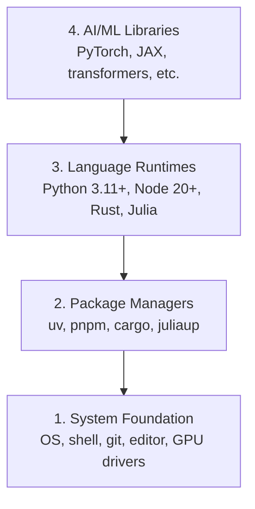

# 개발 환경

> 도구는 사고방식을 만든다. 한 번 제대로 설정해 두자.

**Type:** Build
**Languages:** Python, Node.js, Rust
**Prerequisites:** None
**Time:** ~45 minutes

## 학습 목표

- Python 3.11+, Node.js 20+, Rust toolchain을 처음부터 설정한다
- 재현 가능한 빌드를 위해 virtual environment와 package manager를 구성한다
- CUDA/MPS로 GPU 접근을 확인하고 테스트 tensor 연산을 실행한다
- system, packages, runtimes, AI libraries로 이루어진 4계층 stack을 이해한다

## 문제

이제 Python, TypeScript, Rust, Julia를 사용해 200개가 넘는 lesson에서 AI engineering을 배울 것이다. 환경이 망가져 있으면 모든 lesson이 학습이 아니라 tooling과의 싸움이 된다.

대부분의 사람은 환경 설정을 건너뛴다. 그러고 나서 import error, version conflict, 누락된 CUDA driver를 디버깅하느라 몇 시간을 쓴다. 우리는 이 작업을 한 번, 제대로 할 것이다.

## 개념

AI engineering 환경에는 네 개의 계층이 있다:



아래에서 위로 설치한다. 각 계층은 그 아래 계층에 의존한다.

## 직접 만들기

### 단계 1: System Foundation

시스템을 확인하고 기본 도구를 설치한다.

```bash
# macOS
xcode-select --install
brew install git curl wget

# Ubuntu/Debian
sudo apt update && sudo apt install -y build-essential git curl wget

# Windows (use WSL2)
wsl --install -d Ubuntu-24.04
```

### 단계 2: uv로 Python 설정하기

우리는 `uv`를 사용한다. pip보다 10-100배 빠르고 virtual environment를 자동으로 처리한다.

```bash
curl -LsSf https://astral.sh/uv/install.sh | sh

uv python install 3.12

uv venv
source .venv/bin/activate  # or .venv\Scripts\activate on Windows

uv pip install numpy matplotlib jupyter
```

확인:

```python
import sys
print(f"Python {sys.version}")

import numpy as np
print(f"NumPy {np.__version__}")
a = np.array([1, 2, 3])
print(f"Vector: {a}, dot product with itself: {np.dot(a, a)}")
```

### 단계 3: pnpm으로 Node.js 설정하기

TypeScript lesson(agent, MCP server, web app)에 사용한다.

```bash
curl -fsSL https://fnm.vercel.app/install | bash
fnm install 22
fnm use 22

npm install -g pnpm

node -e "console.log('Node', process.version)"
```

### 단계 4: Rust

성능이 중요한 lesson(inference, systems)에 사용한다.

```bash
curl --proto '=https' --tlsv1.2 -sSf https://sh.rustup.rs | sh

rustc --version
cargo --version
```

### 단계 5: Julia (Optional)

Julia가 강점을 보이는 수학 중심 lesson에 사용한다.

```bash
curl -fsSL https://install.julialang.org | sh

julia -e 'println("Julia ", VERSION)'
```

### 단계 6: GPU 설정(있는 경우)

```bash
# NVIDIA
nvidia-smi

# Install PyTorch with CUDA
uv pip install torch torchvision torchaudio --index-url https://download.pytorch.org/whl/cu124
```

```python
import torch
print(f"CUDA available: {torch.cuda.is_available()}")
if torch.cuda.is_available():
    print(f"GPU: {torch.cuda.get_device_name(0)}")
```

GPU가 없어도 괜찮다. 대부분의 lesson은 CPU에서 동작한다. training이 많은 lesson에서는 Google Colab이나 cloud GPU를 사용한다.

### 단계 7: 전체 확인

검증 script를 실행한다:

```bash
python phases/00-setup-and-tooling/01-dev-environment/code/verify.py
```

## 활용하기

이제 이 course의 모든 lesson을 진행할 환경이 준비되었다. 어디에서 무엇을 쓰는지는 다음과 같다:

| Language | 사용 위치 | Package Manager |
|----------|---------|-----------------|
| Python | Phases 1-12 (ML, DL, NLP, Vision, Audio, LLMs) | uv |
| TypeScript | Phases 13-17 (Tools, Agents, Swarms, Infra) | pnpm |
| Rust | Phases 12, 15-17 (성능이 중요한 systems) | cargo |
| Julia | Phase 1 (수학 기초) | Pkg |

## 결과물

이 lesson은 누구나 자신의 설정을 확인하기 위해 실행할 수 있는 검증 script를 만든다.

AI assistant가 environment issue를 진단하도록 돕는 prompt는 `outputs/prompt-env-check.md`를 참고한다.

## 연습 문제

1. 검증 script를 실행하고 실패가 있으면 수정한다
2. 이 course를 위한 Python virtual environment를 만들고 PyTorch를 설치한다
3. 네 가지 language 모두에서 "hello world"를 작성하고 각각 실행한다
