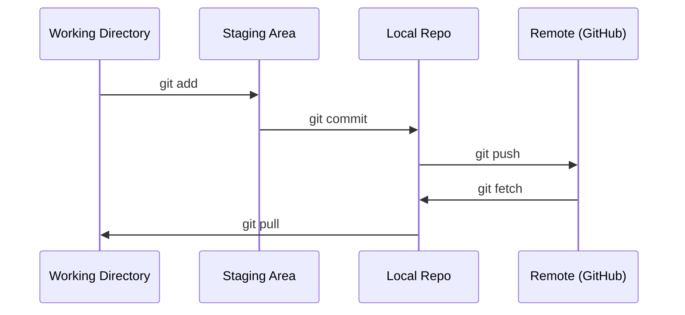

# Git과 협업

> Version control은 선택 사항이 아니다. 여기서 만드는 모든 experiment, model, lesson은 추적된다.

**Type:** Learn
**Languages:** --
**Prerequisites:** Phase 0, Lesson 01
**Time:** ~30 minutes

## 학습 목표

- git identity를 설정하고 add, commit, push로 이루어진 daily workflow를 사용한다
- main을 깨뜨리지 않고 격리된 experiment를 위해 branch를 만들고 merge한다
- model checkpoint와 큰 binary file을 제외하는 `.gitignore`를 작성한다
- `git log`로 commit history를 탐색해 project가 어떻게 발전했는지 이해한다

## 문제

20개 phase에 걸쳐 수백 개의 code file을 작성하게 될 것이다. version control이 없으면 작업물을 잃고, 되돌릴 수 없는 방식으로 무언가를 망가뜨리고, 다른 사람과 협업할 방법도 없게 된다.

Git은 도구다. GitHub는 code가 저장되는 곳이다. 이 lesson은 이 course에 필요한 것만 다루며, 그 이상은 다루지 않는다.

## 개념



기억할 세 가지:
1. 자주 저장한다(`git commit`)
2. remote에 push한다(`git push`)
3. experiment를 위해 branch를 만든다(`git checkout -b experiment`)

## 직접 만들기

### 단계 1: git 설정하기

```bash
git config --global user.name "Your Name"
git config --global user.email "you@example.com"
```

### 단계 2: daily workflow

```bash
git status
git add file.py
git commit -m "Add perceptron implementation"
git push origin main
```

### 단계 3: experiment를 위한 branching

```bash
git checkout -b experiment/new-optimizer

# ... make changes, commit ...

git checkout main
git merge experiment/new-optimizer
```

### 단계 4: 이 course repo로 작업하기

```bash
git clone https://github.com/rohitg00/ai-engineering-from-scratch.git
cd ai-engineering-from-scratch

git checkout -b my-progress
# work through lessons, commit your code
git push origin my-progress
```

## 활용하기

이 course에는 정확히 다음 command만 필요하다:

| Command | 사용 시점 |
|---------|------|
| `git clone` | course repo를 가져올 때 |
| `git add` + `git commit` | 작업물을 저장할 때 |
| `git push` | GitHub에 backup할 때 |
| `git checkout -b` | main을 깨뜨리지 않고 무언가를 시도할 때 |
| `git log --oneline` | 내가 한 일을 확인할 때 |

이게 전부다. 이 course에서는 rebase, cherry-pick, submodule이 필요하지 않다.

## 연습 문제

1. 이 repo를 clone하고, `my-progress`라는 branch를 만들고, file을 만들고, commit한 뒤 push한다
2. model checkpoint file(`.pt`, `.pth`, `.safetensors`)을 제외하는 `.gitignore`를 만든다
3. `git log --oneline`으로 이 repo의 commit history를 보고 lesson이 어떻게 추가되었는지 읽는다

## 핵심 용어

| 용어 | 사람들이 흔히 하는 말 | 실제 의미 |
|------|----------------|----------------------|
| Commit | "저장" | 특정 시점의 전체 project snapshot |
| Branch | "복사본" | 작업하면서 앞으로 이동하는 commit pointer |
| Merge | "code 합치기" | 한 branch의 변경 사항을 가져와 다른 branch에 적용하는 것 |
| Remote | "cloud" | 다른 곳(GitHub, GitLab)에 hosted된 repo 사본 |
