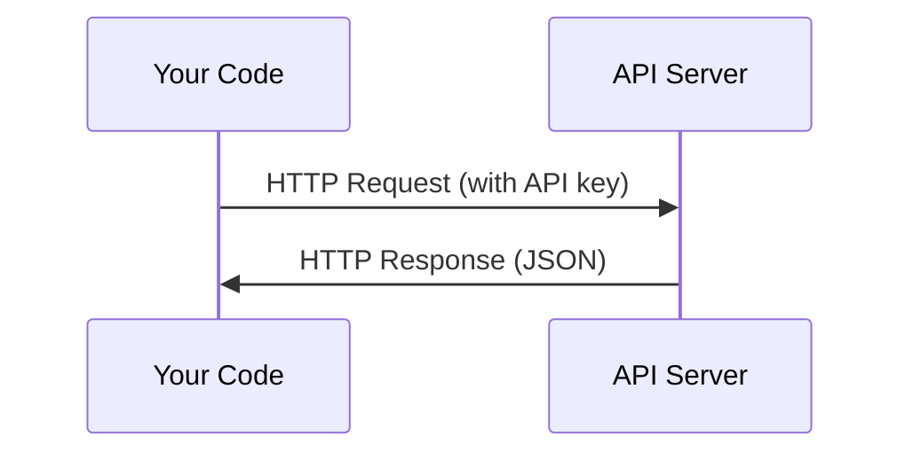

# API와 키

> 모든 AI API는 같은 방식으로 동작합니다. 요청을 보내고, 응답을 받습니다. 세부 사항은 달라져도 패턴은 변하지 않습니다.

**Type:** Build
**Languages:** Python, TypeScript
**Prerequisites:** Phase 0, Lesson 01
**Time:** ~30 minutes

## 학습 목표

- 환경 변수와 `.env` 파일을 사용해 API 키를 안전하게 저장하기
- Anthropic Python SDK와 raw HTTP를 모두 사용해 LLM API 호출하기
- 디버깅을 위해 SDK 기반 요청/응답 형식과 raw HTTP 요청/응답 형식 비교하기
- 인증과 rate limit을 포함한 일반적인 API 오류를 식별하고 처리하기

## 문제

Phase 11부터는 LLM API(Anthropic, OpenAI, Google)를 호출합니다. Phase 13-16에서는 이 API들을 루프 안에서 사용하는 agent를 만들게 됩니다. API 키가 어떻게 동작하는지, 안전하게 저장하는 방법, 첫 API 호출을 만드는 방법을 알아야 합니다.

## 개념



모든 API 호출에는 다음이 있습니다.
1. endpoint(URL)
2. API 키(인증)
3. 요청 body(원하는 것)
4. 응답 body(돌아오는 것)

## 직접 만들기

### Step 1: API 키를 안전하게 저장하기

API 키를 코드에 절대 넣지 마세요. 환경 변수를 사용하세요.

```bash
export ANTHROPIC_API_KEY="sk-ant-..."
export OPENAI_API_KEY="sk-..."
```

또는 `.env` 파일을 사용하세요(`.gitignore`에 추가하세요).

```
ANTHROPIC_API_KEY=sk-ant-...
OPENAI_API_KEY=sk-...
```

### Step 2: 첫 API 호출(Python)

```python
import anthropic

client = anthropic.Anthropic()

response = client.messages.create(
    model="claude-sonnet-4-20250514",
    max_tokens=256,
    messages=[{"role": "user", "content": "What is a neural network in one sentence?"}]
)

print(response.content[0].text)
```

### Step 3: 첫 API 호출(TypeScript)

```typescript
import Anthropic from "@anthropic-ai/sdk";

const client = new Anthropic();

const response = await client.messages.create({
  model: "claude-sonnet-4-20250514",
  max_tokens: 256,
  messages: [{ role: "user", content: "What is a neural network in one sentence?" }],
});

console.log(response.content[0].text);
```

### Step 4: Raw HTTP(SDK 없음)

```python
import os
import urllib.request
import json

url = "https://api.anthropic.com/v1/messages"
headers = {
    "Content-Type": "application/json",
    "x-api-key": os.environ["ANTHROPIC_API_KEY"],
    "anthropic-version": "2023-06-01",
}
body = json.dumps({
    "model": "claude-sonnet-4-20250514",
    "max_tokens": 256,
    "messages": [{"role": "user", "content": "What is a neural network in one sentence?"}],
}).encode()

req = urllib.request.Request(url, data=body, headers=headers, method="POST")
with urllib.request.urlopen(req) as resp:
    result = json.loads(resp.read())
    print(result["content"][0]["text"])
```

SDK가 내부에서 하는 일이 바로 이것입니다. raw HTTP 호출을 이해하면 디버깅할 때 도움이 됩니다.

## 활용하기

이 과정에서는 다음을 사용합니다.

| API | 필요한 시점 | 무료 티어 |
|-----|-----------------|-----------|
| Anthropic (Claude) | Phases 11-16 (agents, tools) | 가입 시 $5 credit |
| OpenAI | Phase 11 (comparison) | 가입 시 $5 credit |
| Hugging Face | Phases 4-10 (models, datasets) | 무료 |

지금 당장 모두 필요하지는 않습니다. lesson에서 필요할 때 설정하세요.

## 결과물

이 lesson의 결과물:
- `outputs/prompt-api-troubleshooter.md` - 일반적인 API 오류 진단

## 연습 문제

1. Anthropic API 키를 받아 첫 API 호출을 만드세요
2. raw HTTP 버전을 시도하고 응답 형식을 SDK 버전과 비교하세요
3. 일부러 잘못된 API 키를 사용하고 오류 메시지를 읽어보세요

## 핵심 용어

| 용어 | 사람들이 하는 말 | 실제 의미 |
|------|----------------|----------------------|
| API key | "API 비밀번호" | 계정을 식별하고 요청을 승인하는 고유 문자열 |
| Rate limit | "요청이 제한되고 있어요" | 남용을 막고 공정한 사용을 보장하기 위한 분/시간당 최대 요청 수 |
| Token | "단어 하나"(API 맥락에서) | 과금 단위: 입력 token과 출력 token이 따로 계산되고 청구됩니다 |
| Streaming | "실시간 응답" | 전체 응답을 기다리지 않고 단어 단위로 응답을 받는 방식 |
