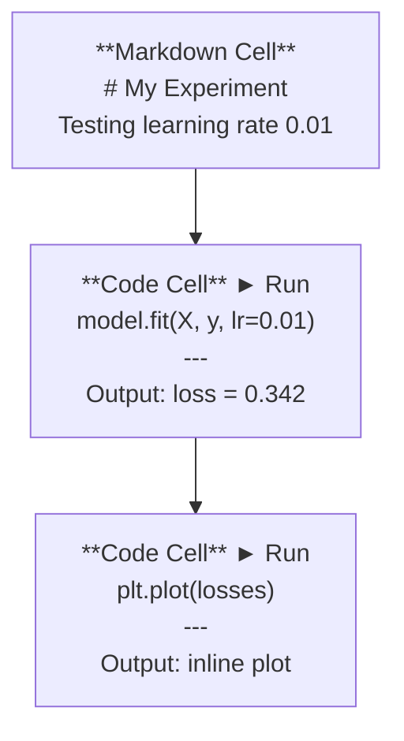
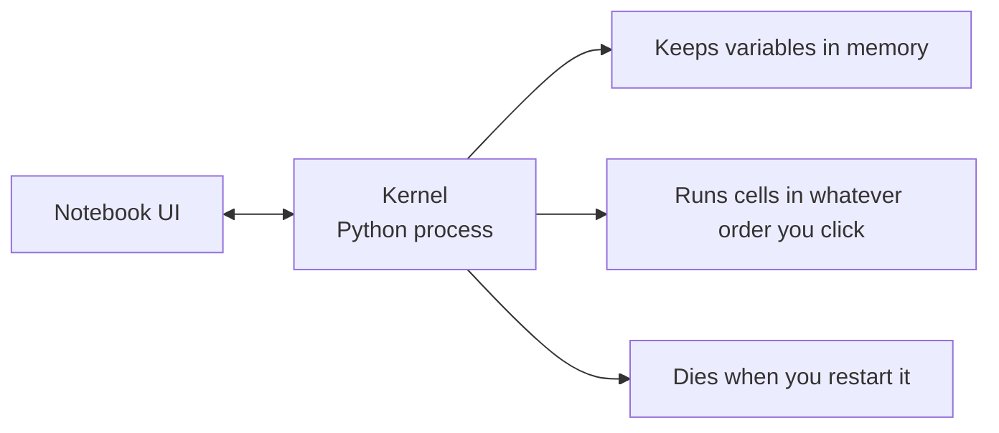

# Jupyter Notebook

> Notebook은 AI engineering의 실험대입니다. 여기서 prototype을 만들고, 잘 동작하는 것을 production으로 옮깁니다.

**Type:** Build
**Languages:** Python
**Prerequisites:** Phase 0, Lesson 01
**Time:** ~30 minutes

## 학습 목표

- Jupyter extension이 있는 JupyterLab, Jupyter Notebook 또는 VS Code를 설치하고 실행하기
- magic command(`%timeit`, `%%time`, `%matplotlib inline`)를 사용해 benchmark하고 inline으로 시각화하기
- notebook과 script를 언제 사용할지 구분하고 "notebook에서 탐색하고, script로 배포한다" workflow 적용하기
- 순서가 뒤섞인 실행, hidden state, memory leak 같은 일반적인 notebook 함정을 식별하고 피하기

## 문제

모든 AI paper, tutorial, Kaggle competition은 Jupyter notebook을 사용합니다. Notebook을 사용하면 코드를 조각별로 실행하고, output을 inline으로 보고, 코드와 설명을 섞고, 빠르게 반복할 수 있습니다. Notebook 없이 AI를 배우려는 것은 연습장 없이 수학 숙제를 하는 것과 같습니다.

하지만 notebook에는 실제 함정이 있습니다. 사람들은 notebook이 잘 맞지 않는 일까지 포함해 모든 것에 notebook을 사용합니다. 언제 notebook을 쓰고 언제 script를 써야 하는지 알면 나중에 디버깅 문제를 피할 수 있습니다.

## 개념

Notebook은 cell의 목록입니다. 각 cell은 code이거나 text입니다.



kernel은 background에서 실행되는 Python process입니다. cell을 실행하면 code가 kernel로 보내지고, kernel은 이를 실행한 뒤 result를 돌려줍니다. 모든 cell은 같은 kernel을 공유하므로 variable이 cell 사이에 유지됩니다.



이 "클릭한 어떤 순서로든" 실행되는 특성이 notebook의 강력함이자 위험한 함정입니다.

## 직접 만들기

### Step 1: interface 고르기

선택지는 세 가지이고, format은 하나입니다.

| Interface | Install | 적합한 용도 |
|-----------|---------|----------|
| JupyterLab | `pip install jupyterlab` then `jupyter lab` | 완전한 IDE 경험, 여러 tab, file browser, terminal |
| Jupyter Notebook | `pip install notebook` then `jupyter notebook` | 단순하고 가벼우며, 한 번에 notebook 하나 |
| VS Code | Install "Jupyter" extension | 이미 쓰는 editor 안에서 사용, git integration, debugging |

세 도구 모두 같은 `.ipynb` 파일을 읽고 씁니다. 원하는 것을 고르세요. AI 작업에서는 JupyterLab이 가장 흔합니다.

```bash
pip install jupyterlab
jupyter lab
```

### Step 2: 중요한 keyboard shortcut

두 가지 mode로 작업합니다. command mode(왼쪽 파란 bar)는 `Escape`, edit mode(초록 bar)는 `Enter`를 누릅니다.

**Command mode(가장 자주 사용):**

| Key | 동작 |
|-----|--------|
| `Shift+Enter` | cell 실행, 다음 cell로 이동 |
| `A` | 위에 cell 삽입 |
| `B` | 아래에 cell 삽입 |
| `DD` | cell 삭제 |
| `M` | markdown으로 변환 |
| `Y` | code로 변환 |
| `Z` | cell 작업 실행 취소 |
| `Ctrl+Shift+H` | 모든 shortcut 표시 |

**Edit mode:**

| Key | 동작 |
|-----|--------|
| `Tab` | Autocomplete |
| `Shift+Tab` | function signature 표시 |
| `Ctrl+/` | comment toggle |

`Shift+Enter`는 하루에도 수천 번 쓰게 될 shortcut입니다. 이것부터 익히세요.

### Step 3: Cell type

**Code cell**은 Python을 실행하고 output을 보여줍니다.

```python
import numpy as np
data = np.random.randn(1000)
data.mean(), data.std()
```

Output: `(0.0032, 0.9987)`

**Markdown cell**은 format이 적용된 text를 rendering합니다. 무엇을 하고 있는지와 왜 하는지를 문서화하는 데 사용하세요. header, bold, italic, LaTeX math(`$E = mc^2$`), table, image를 지원합니다.

### Step 4: Magic command

이것들은 Python이 아닙니다. `%`(line magic) 또는 `%%`(cell magic)로 시작하는 Jupyter 전용 command입니다.

**코드 시간 측정:**

```python
%timeit np.random.randn(10000)
```

Output: `45.2 us +/- 1.3 us per loop`

```python
%%time
model.fit(X_train, y_train, epochs=10)
```

Output: `Wall time: 2.34 s`

`%timeit`은 코드를 여러 번 실행해 평균을 냅니다. `%%time`은 한 번 실행합니다. microbenchmark에는 `%timeit`, training run에는 `%%time`을 사용하세요.

**inline plot 활성화:**

```python
%matplotlib inline
```

이제 모든 `plt.plot()` 또는 `plt.show()`가 notebook 안에 바로 rendering됩니다.

**notebook을 떠나지 않고 package 설치:**

```python
!pip install scikit-learn
```

`!` prefix는 shell command를 실행합니다.

**환경 변수 확인:**

```python
%env CUDA_VISIBLE_DEVICES
```

### Step 5: rich output을 inline으로 표시하기

Notebook은 cell의 마지막 expression을 자동으로 표시합니다. 하지만 직접 제어할 수도 있습니다.

```python
import pandas as pd

df = pd.DataFrame({
    "model": ["Linear", "Random Forest", "Neural Net"],
    "accuracy": [0.72, 0.89, 0.94],
    "training_time": [0.1, 2.3, 45.6]
})
df
```

이것은 text dump가 아니라 format이 적용된 HTML table로 rendering됩니다. plot도 마찬가지입니다.

```python
import matplotlib.pyplot as plt

plt.figure(figsize=(8, 4))
plt.plot([1, 2, 3, 4], [1, 4, 2, 3])
plt.title("Inline Plot")
plt.show()
```

plot은 cell 바로 아래에 나타납니다. 이것이 notebook이 AI 작업을 지배하는 이유입니다. data, plot, code를 함께 볼 수 있습니다.

image의 경우:

```python
from IPython.display import Image, display
display(Image(filename="architecture.png"))
```

### Step 6: Google Colab

Colab은 cloud에서 제공되는 무료 Jupyter notebook입니다. GPU, 사전 설치된 library, Google Drive integration을 제공합니다. 설정이 필요 없습니다.

1. [colab.research.google.com](https://colab.research.google.com)으로 이동하세요
2. 이 과정의 `.ipynb` 파일을 아무거나 upload하세요
3. Runtime > Change runtime type > T4 GPU (free)

local Jupyter와 Colab의 차이:
- file은 session 사이에 유지되지 않습니다(Drive에 저장하거나 download하세요)
- 사전 설치: numpy, pandas, matplotlib, torch, tensorflow, sklearn
- file upload/download에는 `from google.colab import files`
- persistent storage에는 `from google.colab import drive; drive.mount('/content/drive')`
- 90분 동안 비활성 상태이면 session이 time out됩니다(free tier)

## 활용하기

### Notebook vs Script: 언제 무엇을 쓸까

| notebook을 사용할 때 | script를 사용할 때 |
|-------------------|-----------------|
| dataset 탐색 | training pipeline |
| model prototype 만들기 | 재사용 가능한 utility |
| result 시각화 | `if __name__`가 있는 모든 것 |
| 작업 설명 | schedule에 따라 실행되는 code |
| 빠른 experiment | production code |
| course exercise | package와 library |

규칙: **notebook에서 탐색하고, script로 배포하세요**.

AI에서 흔한 workflow:
1. notebook에서 data를 탐색합니다
2. notebook에서 model을 prototype합니다
3. 동작하면 code를 `.py` 파일로 옮깁니다
4. 추가 experiment를 위해 그 `.py` 파일을 다시 notebook으로 import합니다

### 일반적인 함정

**순서가 뒤섞인 실행.** cell 5를 실행한 다음 cell 2, 그다음 cell 7을 실행합니다. 내 machine에서는 notebook이 동작하지만, 다른 사람이 위에서 아래로 실행하면 깨집니다. 수정: 공유하기 전에 Kernel > Restart & Run All을 실행하세요.

**Hidden state.** cell을 삭제했지만 그 cell이 만든 variable은 여전히 memory에 있습니다. notebook은 깔끔해 보이지만 사라진 cell에 의존합니다. 수정: kernel을 주기적으로 restart하세요.

**Memory leak.** 4GB dataset을 load하고, model을 train하고, 또 다른 dataset을 load합니다. 아무것도 해제되지 않습니다. 수정: `del variable_name`과 `gc.collect()`를 사용하거나 kernel을 restart하세요.

## 결과물

이 lesson의 결과물:
- notebook 문제를 debugging하기 위한 `outputs/prompt-notebook-helper.md`

## 연습 문제

1. JupyterLab을 열고 notebook을 만든 다음 `%timeit`을 사용해 100,000개의 random number array를 만들 때 list comprehension과 numpy를 비교하세요
2. markdown cell과 code cell이 모두 있는 notebook을 만들어 CSV를 load하고, dataframe을 표시하고, chart를 그리세요. 그런 다음 Kernel > Restart & Run All을 실행해 위에서 아래로 동작하는지 확인하세요
3. `code/notebook_tips.py`의 code를 Colab notebook에 붙여넣고 무료 GPU로 실행하세요

## 핵심 용어

| 용어 | 사람들이 하는 말 | 실제 의미 |
|------|----------------|----------------------|
| Kernel | "내 code를 실행하는 것" | cell을 실행하고 variable을 memory에 유지하는 별도의 Python process |
| Cell | "code block" | notebook 안에서 독립적으로 실행할 수 있는 단위이며, code 또는 markdown입니다 |
| Magic command | "Jupyter trick" | notebook environment를 제어하는 `%` 또는 `%%` prefix가 붙은 특수 command |
| `.ipynb` | "Notebook file" | cell, output, metadata를 담은 JSON file입니다. IPython Notebook의 약자입니다 |

## 더 읽을거리

- 전체 feature set은 [JupyterLab Docs](https://jupyterlab.readthedocs.io/)를 참고하세요
- Colab-specific limit과 feature는 [Google Colab FAQ](https://research.google.com/colaboratory/faq.html)를 참고하세요
- power-user shortcut은 [28 Jupyter Notebook Tips](https://www.dataquest.io/blog/jupyter-notebook-tips-tricks-shortcuts/)를 참고하세요
