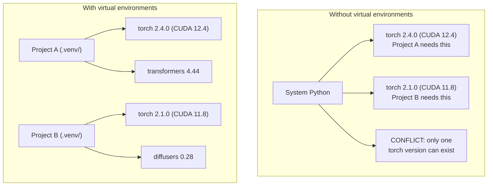

# Python Environment

> Dependency hell은 실제입니다. Virtual environment가 치료제입니다.

**Type:** Build
**Languages:** Shell
**Prerequisites:** Phase 0, Lesson 01
**Time:** ~30 minutes

## 학습 목표

- `uv`, `venv`, `conda`를 사용해 격리된 virtual environment 만들기
- optional dependency group이 있는 `pyproject.toml`을 작성하고 재현성을 위한 lockfile 생성하기
- global install, pip/conda mixing, CUDA version mismatch 같은 일반적인 함정을 진단하고 수정하기
- 충돌하는 dependency가 있는 project를 위해 phase별 environment strategy 구현하기

## 문제

fine-tuning project를 위해 PyTorch 2.4를 설치했습니다. 다음 주에는 다른 project가 CUDA build가 고정되어 있어 PyTorch 2.1을 필요로 합니다. global로 upgrade하면 첫 번째 project가 깨집니다. downgrade하면 두 번째 project가 깨집니다.

이것이 dependency hell입니다. AI/ML 작업에서는 다음 이유로 자주 발생합니다.

- PyTorch, JAX, TensorFlow가 각각 자체 CUDA binding을 제공합니다
- model library가 특정 framework version을 고정합니다
- global `pip install`이 기존에 있던 것을 덮어씁니다
- CUDA 11.8 build는 CUDA 12.x driver와 동작하지 않습니다(반대도 마찬가지)

해결책: 모든 project가 자체 package를 가진 격리된 environment를 갖게 합니다.

## 개념



## 직접 만들기

### Option 1: uv venv(권장)

`uv`는 가장 빠른 Python package manager입니다(pip보다 10-100배 빠름). virtual environment, Python version, dependency resolution을 하나의 tool에서 처리합니다.

```bash
curl -LsSf https://astral.sh/uv/install.sh | sh

uv python install 3.12

cd your-project
uv venv
source .venv/bin/activate
```

package 설치:

```bash
uv pip install torch numpy
```

한 단계로 `pyproject.toml`이 있는 project 만들기:

```bash
uv init my-ai-project
cd my-ai-project
uv add torch numpy matplotlib
```

### Option 2: venv(내장)

`uv`를 설치할 수 없다면 Python에 포함된 `venv`를 사용하세요.

```bash
python3 -m venv .venv
source .venv/bin/activate  # Linux/macOS
.venv\Scripts\activate     # Windows

pip install torch numpy
```

`uv`보다 느리지만 Python이 설치된 곳이면 어디서나 동작합니다.

### Option 3: conda(필요할 때)

Conda는 CUDA toolkit, cuDNN, C library 같은 non-Python dependency를 관리합니다. 다음 경우에 사용하세요.

- system-wide로 설치하지 않고 특정 CUDA toolkit version이 필요할 때
- system package를 설치할 수 없는 shared cluster를 사용할 때
- library 설치 안내가 "use conda"라고 말할 때

```bash
# Install miniconda (not the full Anaconda)
curl -LsSf https://repo.anaconda.com/miniconda/Miniconda3-latest-Linux-x86_64.sh -o miniconda.sh
bash miniconda.sh -b

conda create -n myproject python=3.12
conda activate myproject

conda install pytorch torchvision torchaudio pytorch-cuda=12.4 -c pytorch -c nvidia
```

규칙 하나: 어떤 environment에 conda를 사용한다면, 그 environment의 모든 package에 conda를 사용하세요. conda env 안에서 `pip install`을 섞으면 디버깅하기 고통스러운 dependency conflict가 생깁니다.

### 이 과정을 위한 phase별 strategy

전체 과정에 하나의 environment를 만들 수도 있습니다. 그러지 마세요. phase마다 서로 다른, 때로는 충돌하는 dependency가 필요합니다.

Strategy:

```
ai-engineering-from-scratch/
├── .venv/                    <-- shared lightweight env for phases 0-3
├── phases/
│   ├── 04-neural-networks/
│   │   └── .venv/            <-- PyTorch env
│   ├── 05-cnns/
│   │   └── .venv/            <-- same PyTorch env (symlink or shared)
│   ├── 08-transformers/
│   │   └── .venv/            <-- might need different transformer versions
│   └── 11-llm-apis/
│       └── .venv/            <-- API SDKs, no torch needed
```

`code/env_setup.sh`의 script는 이 과정을 위한 base environment를 만듭니다.

## pyproject.toml 기본

모든 Python project에는 `pyproject.toml`이 있어야 합니다. 이 파일 하나가 `setup.py`, `setup.cfg`, `requirements.txt`를 대체합니다.

```toml
[project]
name = "ai-engineering-from-scratch"
version = "0.1.0"
requires-python = ">=3.11"
dependencies = [
    "numpy>=1.26",
    "matplotlib>=3.8",
    "jupyter>=1.0",
    "scikit-learn>=1.4",
]

[project.optional-dependencies]
torch = ["torch>=2.3", "torchvision>=0.18"]
llm = ["anthropic>=0.39", "openai>=1.50"]
```

그다음 설치합니다.

```bash
uv pip install -e ".[torch]"    # base + PyTorch
uv pip install -e ".[llm]"     # base + LLM SDKs
uv pip install -e ".[torch,llm]" # everything
```

## Lockfile

lockfile은 모든 dependency(transitive dependency 포함)를 정확한 version으로 고정합니다. 이는 재현성을 보장합니다. lockfile에서 설치하는 사람은 누구나 정확히 같은 package를 받습니다.

```bash
# uv generates uv.lock automatically when using uv add
uv add numpy

# pip-tools approach
uv pip compile pyproject.toml -o requirements.lock
uv pip install -r requirements.lock
```

lockfile을 git에 commit하세요. 누군가 repo를 clone하면 lockfile에서 설치해 동일한 version을 얻습니다.

## 흔한 실수

### 1. global로 설치하기

```bash
pip install torch  # BAD: installs to system Python

source .venv/bin/activate
pip install torch  # GOOD: installs to virtual environment
```

package가 어디로 가는지 확인하세요.

```bash
which python       # should show .venv/bin/python, not /usr/bin/python
which pip           # should show .venv/bin/pip
```

### 2. pip와 conda 섞기

```bash
conda create -n myenv python=3.12
conda activate myenv
conda install pytorch -c pytorch
pip install some-other-package   # BAD: can break conda's dependency tracking
conda install some-other-package # GOOD: let conda manage everything
```

conda 안에서 pip를 반드시 사용해야 한다면(일부 package는 pip-only), conda package를 모두 먼저 설치한 다음 pip package를 마지막에 설치하세요.

### 3. activate를 잊기

```bash
python train.py           # uses system Python, missing packages
source .venv/bin/activate
python train.py           # uses project Python, packages found
```

shell prompt에 environment name이 표시되어야 합니다.

```
(.venv) $ python train.py
```

### 4. .venv를 git에 commit하기

```bash
echo ".venv/" >> .gitignore
```

Virtual environment는 200MB-2GB입니다. local용이며 machine 간에 portable하지 않습니다. 대신 `pyproject.toml`과 lockfile을 commit하세요.

### 5. CUDA version mismatch

```bash
nvidia-smi                # shows driver CUDA version (e.g., 12.4)
python -c "import torch; print(torch.version.cuda)"  # shows PyTorch CUDA version

# These must be compatible.
# PyTorch CUDA version must be <= driver CUDA version.
```

## 활용하기

setup script를 실행해 course environment를 만드세요.

```bash
bash phases/00-setup-and-tooling/06-python-environments/code/env_setup.sh
```

이 명령은 repo root에 `.venv`를 만들고 core dependency를 설치한 뒤 검증합니다.

## 연습 문제

1. `env_setup.sh`를 실행하고 모든 check가 통과하는지 확인하세요
2. 두 번째 virtual environment를 만들고 그 안에 다른 version의 numpy를 설치한 다음 두 environment가 격리되어 있는지 확인하세요
3. PyTorch와 Anthropic SDK가 모두 필요한 project를 위한 `pyproject.toml`을 작성하세요
4. 일부러 package를 global로 설치하고(venv를 activate하지 않고), 어디에 설치되는지 확인한 다음 uninstall하세요

## 핵심 용어

| 용어 | 사람들이 하는 말 | 실제 의미 |
|------|----------------|----------------------|
| Virtual environment | "venv" | system Python과 분리된 Python interpreter와 package를 담은 격리된 directory |
| Lockfile | "고정된 dependency" | 모든 package와 정확한 version을 나열해 machine 간 동일한 install을 보장하는 file |
| pyproject.toml | "새 setup.py" | setup.py/setup.cfg/requirements.txt를 대체하는 표준 Python project configuration file |
| Transitive dependency | "dependency의 dependency" | package B가 C에 의존합니다. B에 의존하는 A를 설치하면 C는 A의 transitive dependency입니다 |
| CUDA mismatch | "GPU가 동작하지 않아요" | PyTorch가 GPU driver가 지원하는 것과 다른 CUDA version용으로 compile되었습니다 |
