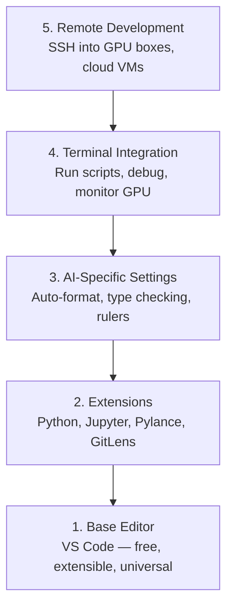

# 에디터 설정

> 에디터는 당신의 co-pilot이다. 한 번만 설정해 두면 방해가 줄고 제 역할을 하기 시작한다.

**Type:** Build
**Languages:** --
**Prerequisites:** Phase 0, Lesson 01
**Time:** ~20 minutes

## 학습 목표

- Python, Jupyter, linting, remote SSH에 필요한 핵심 확장과 함께 VS Code를 설치한다
- AI 워크플로에 맞게 저장 시 포맷팅, 타입 검사, notebook 출력 스크롤을 구성한다
- Remote SSH를 설정해 원격 GPU 머신의 코드를 로컬처럼 편집하고 디버깅한다
- 에디터 대안(Cursor, Windsurf, Neovim)과 AI 작업에서의 tradeoff를 평가한다

## 문제

당신은 에디터 안에서 Python을 작성하고, notebook을 실행하고, training loop를 디버깅하고, GPU 박스에 SSH로 접속하며 수천 시간을 보내게 된다. 잘못 설정된 에디터는 모든 세션을 마찰로 바꾼다. 자동 완성 없음, 타입 힌트 없음, inline 오류 없음, 수동 포맷팅, 불편한 터미널 워크플로가 계속된다.

올바른 설정에는 20분이 걸린다. 건너뛰면 매일 20분씩 잃는다.

## 개념

AI 엔지니어링 에디터 설정에는 다섯 가지가 필요하다:



## 직접 만들기

### Step 1: VS Code 설치

권장 에디터는 VS Code다. 무료이고, 모든 OS에서 실행되며, Jupyter notebook 지원이 뛰어나고, AI 작업에 필요한 거의 모든 것을 확장 생태계가 제공한다.

[code.visualstudio.com](https://code.visualstudio.com/)에서 다운로드한다.

터미널에서 확인한다:

```bash
code --version
```

macOS에서 `code`를 찾을 수 없다면 VS Code를 열고 `Cmd+Shift+P`를 누른 뒤 "Shell Command"를 입력하고 "Install 'code' command in PATH"를 선택한다.

### Step 2: 핵심 확장 설치

VS Code의 통합 터미널(`Ctrl+`` ` 또는 `` Cmd+` ``)을 열고 AI 작업에 중요한 확장을 설치한다:

```bash
code --install-extension ms-python.python
code --install-extension ms-python.vscode-pylance
code --install-extension ms-toolsai.jupyter
code --install-extension eamodio.gitlens
code --install-extension ms-vscode-remote.remote-ssh
code --install-extension ms-python.debugpy
code --install-extension ms-python.black-formatter
code --install-extension charliermarsh.ruff
```

각 확장이 하는 일:

| Extension | 이유 |
|-----------|------|
| Python | 언어 지원, virtual env 감지, 실행/디버그 |
| Pylance | 빠른 타입 검사, 자동 완성, import 해석 |
| Jupyter | VS Code 안에서 notebook 실행, variable explorer |
| GitLens | 누가 무엇을 바꿨는지 확인, inline git blame |
| Remote SSH | 원격 GPU 박스의 폴더를 로컬처럼 열기 |
| Debugpy | Python step-through 디버깅 |
| Black Formatter | 저장 시 자동 포맷팅, 일관된 스타일 |
| Ruff | 빠른 linting, 흔한 실수 포착 |

이 lesson의 `code/.vscode/extensions.json` 파일에는 전체 추천 목록이 들어 있다. 프로젝트 폴더를 열면 VS Code가 설치를 제안한다.

### Step 3: 설정 구성

이 lesson의 `code/.vscode/settings.json`에서 설정을 복사하거나 `Settings > Open Settings (JSON)`을 통해 수동으로 적용한다.

AI 작업에 중요한 설정:

```jsonc
{
    "python.analysis.typeCheckingMode": "basic",
    "editor.formatOnSave": true,
    "editor.rulers": [88, 120],
    "notebook.output.scrolling": true,
    "files.autoSave": "afterDelay"
}
```

이 설정들이 중요한 이유:

- **Type checking on basic**: 실행 전에 잘못된 인자 타입을 잡는다. tensor shape 불일치와 잘못된 API 파라미터를 디버깅하는 시간을 줄인다.
- **Format on save**: 다시는 포맷팅을 신경 쓰지 않는다. Black이 처리한다.
- **Rulers at 88 and 120**: Black은 88에서 줄을 감싼다. 120 표시선은 docstring과 주석이 너무 길어질 때 알려 준다.
- **Notebook output scrolling**: Training loop는 수천 줄을 출력한다. 스크롤이 없으면 출력 패널이 끝없이 커진다.
- **Auto-save**: 저장을 잊을 수 있다. 그러면 training script가 오래된 코드를 실행한다. Auto-save가 이를 막는다.

### Step 4: 터미널 통합

VS Code의 통합 터미널은 training script를 실행하고, GPU를 모니터링하고, 환경을 관리하는 곳이다.

제대로 설정한다:

```jsonc
{
    "terminal.integrated.defaultProfile.osx": "zsh",
    "terminal.integrated.defaultProfile.linux": "bash",
    "terminal.integrated.fontSize": 13,
    "terminal.integrated.scrollback": 10000
}
```

유용한 단축키:

| Action | macOS | Linux/Windows |
|--------|-------|---------------|
| Toggle terminal | `` Ctrl+` `` | `` Ctrl+` `` |
| New terminal | `Ctrl+Shift+`` ` | `Ctrl+Shift+`` ` |
| Split terminal | `Cmd+\` | `Ctrl+\` |

분할 터미널은 유용하다. 하나는 스크립트 실행용, 하나는 `nvidia-smi -l 1` 또는 `watch -n 1 nvidia-smi`로 GPU를 모니터링하는 용도로 쓴다.

### Step 5: 원격 개발(GPU 박스에 SSH 접속)

AI 작업에서 가장 중요한 확장이다. 학습은 원격 머신(cloud VM, lab server, Lambda, Vast.ai)에서 실행하게 된다. Remote SSH를 사용하면 원격 파일시스템을 열고, 파일을 편집하고, 터미널을 실행하고, 모든 것이 로컬인 것처럼 디버깅할 수 있다.

설정:

1. Remote SSH 확장을 설치한다(Step 2에서 완료).
2. `Ctrl+Shift+P`(또는 `Cmd+Shift+P`)를 누르고 "Remote-SSH: Connect to Host"를 입력한다.
3. `user@your-gpu-box-ip`를 입력한다.
4. VS Code가 원격 머신에 서버 컴포넌트를 자동으로 설치한다.

비밀번호 없는 접근을 위해 SSH 키를 설정한다:

```bash
ssh-keygen -t ed25519 -C "your-email@example.com"
ssh-copy-id user@your-gpu-box-ip
```

편의를 위해 `~/.ssh/config`에 host를 추가한다:

```
Host gpu-box
    HostName 203.0.113.50
    User ubuntu
    IdentityFile ~/.ssh/id_ed25519
    ForwardAgent yes
```

이제 `Remote-SSH: Connect to Host > gpu-box`가 즉시 연결된다.

## 대안

### Cursor

[cursor.com](https://cursor.com)은 AI 코드 생성이 내장된 VS Code fork다. 같은 확장 생태계와 설정 형식을 사용한다. Cursor를 사용한다면 이 lesson의 내용이 그대로 적용된다. 같은 `settings.json`과 `extensions.json`을 가져오면 된다.

### Windsurf

[windsurf.com](https://windsurf.com)은 또 다른 AI-first VS Code fork다. 이야기는 같다. 같은 확장, 같은 설정 형식, 같은 Remote SSH 지원을 사용한다.

### Vim/Neovim

이미 Vim 또는 Neovim을 사용하고 있고 생산적이라면 그대로 쓰면 된다. AI Python 작업을 위한 최소 설정:

- 타입 검사용 **pyright** 또는 **pylsp**(Mason 또는 수동 설치)
- language server 통합용 **nvim-lspconfig**
- notebook 같은 실행을 위한 **jupyter-vim** 또는 **molten-nvim**
- 파일/심볼 검색용 **telescope.nvim**
- formatting/linting을 위한 black 및 ruff와 함께 **none-ls.nvim**

아직 Vim을 쓰고 있지 않다면 지금 시작하지 말라. 학습 곡선이 AI 엔지니어링 학습과 경쟁하게 된다. VS Code를 사용하라.

## 사용하기

이 설정을 마치면 일상 워크플로는 다음과 같다:

1. VS Code에서 프로젝트 폴더를 연다(또는 Remote SSH로 GPU 박스에 연결한다).
2. 자동 완성, 타입 힌트, inline 오류와 함께 에디터에서 Python을 작성한다.
3. Jupyter 확장으로 Jupyter notebook을 inline 실행한다.
4. 통합 터미널을 training script, `uv pip install`, GPU 모니터링에 사용한다.
5. 커밋하기 전에 GitLens로 변경 사항을 검토한다.

## 연습 문제

1. VS Code와 Step 2에 나열된 모든 확장을 설치한다
2. 이 lesson의 `settings.json`을 VS Code config에 복사한다
3. Python 파일을 열고 Pylance가 타입 힌트를 표시하며 Black이 저장 시 포맷팅하는지 확인한다
4. 원격 머신에 접근할 수 있다면 Remote SSH를 설정하고 그 안의 폴더를 연다

## 핵심 용어

| 용어 | 사람들이 하는 말 | 실제 의미 |
|------|------------------|-----------|
| LSP | "자동 완성 엔진" | Language Server Protocol: 에디터가 언어별 서버에서 타입 정보, completion, 진단 정보를 받기 위한 표준 |
| Pylance | "Python 플러그인" | 타입 검사와 IntelliSense에 Pyright를 사용하는 Microsoft의 Python language server |
| Remote SSH | "서버에서 작업하기" | 원격 머신에서 가벼운 서버를 실행하고 UI를 로컬 에디터로 스트리밍하는 VS Code 확장 |
| Format on save | "자동 prettier" | 저장할 때마다 에디터가 formatter(Black, Ruff)를 실행해 코드 스타일을 항상 일관되게 유지하는 것 |
