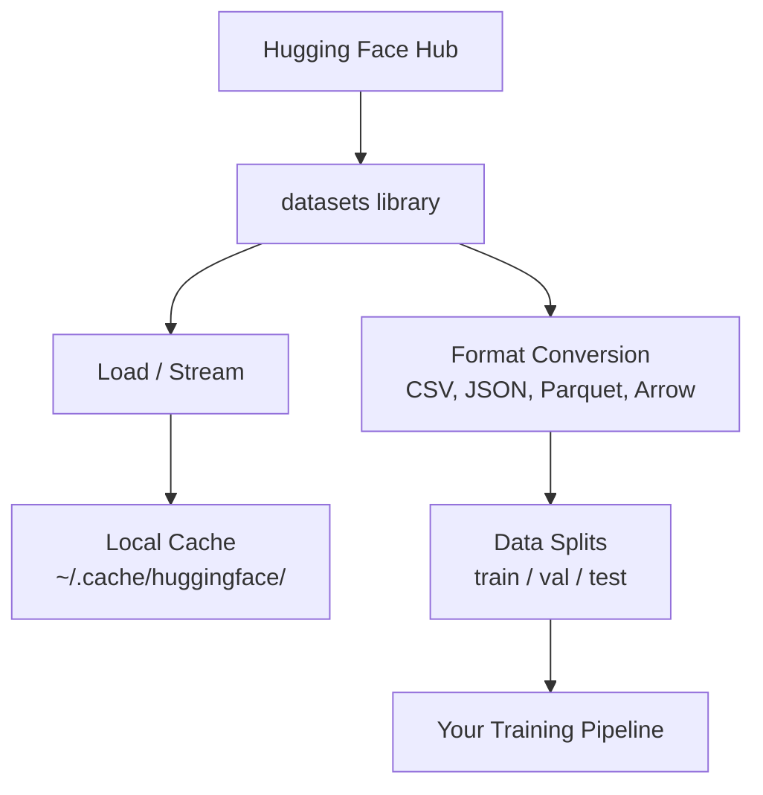

# 데이터 관리

> 데이터는 연료다. 데이터를 어떻게 관리하느냐가 얼마나 빠르게 나아갈 수 있는지를 결정한다.

**Type:** Build
**Language:** Python
**Prerequisites:** Phase 0, Lesson 01
**Time:** ~45 minutes

## 학습 목표

- Hugging Face `datasets` 라이브러리를 사용해 데이터셋을 load, stream, cache한다
- CSV, JSON, Parquet, Arrow 형식 사이를 변환하고 각각의 tradeoff를 설명한다
- 고정 random seed로 재현 가능한 train/validation/test split을 만든다
- `.gitignore`, Git LFS, DVC를 사용해 큰 모델 파일과 데이터셋 파일을 관리한다

## 문제

모든 AI 프로젝트는 데이터에서 시작한다. 데이터셋을 찾고, 다운로드하고, 형식 사이를 변환하고, 학습과 평가를 위해 나누고, 실험을 재현할 수 있도록 버전 관리해야 한다. 매번 수동으로 처리하는 것은 느리고 오류가 생기기 쉽다. 반복 가능한 워크플로가 필요하다.

## 개념



Hugging Face `datasets` 라이브러리는 AI 작업에서 데이터를 로드하는 표준적인 방법이다. 다운로드, 캐싱, 형식 변환, 스트리밍을 기본으로 처리한다.

## 직접 만들기

### Step 1: datasets 라이브러리 설치

```bash
pip install datasets huggingface_hub
```

### Step 2: 데이터셋 로드

```python
from datasets import load_dataset

dataset = load_dataset("imdb")
print(dataset)
print(dataset["train"][0])
```

이 코드는 IMDB 영화 리뷰 데이터셋을 다운로드한다. 첫 다운로드 후에는 `~/.cache/huggingface/datasets/`의 cache에서 로드된다.

### Step 3: 큰 데이터셋 스트리밍

일부 데이터셋은 디스크에 담기에는 너무 크다. 스트리밍은 전체를 다운로드하지 않고 행 단위로 로드한다.

```python
dataset = load_dataset("wikimedia/wikipedia", "20220301.en", split="train", streaming=True)

for i, example in enumerate(dataset):
    print(example["title"])
    if i >= 4:
        break
```

스트리밍은 `IterableDataset`을 제공한다. 도착하는 행을 처리하면 된다. 데이터셋 크기와 관계없이 메모리 사용량은 일정하게 유지된다.

### Step 4: 데이터셋 형식

`datasets` 라이브러리는 내부적으로 Apache Arrow를 사용한다. pipeline이 필요로 하는 것에 따라 다른 형식으로 변환할 수 있다.

```python
dataset = load_dataset("imdb", split="train")

dataset.to_csv("imdb_train.csv")
dataset.to_json("imdb_train.json")
dataset.to_parquet("imdb_train.parquet")
```

형식 비교:

| 형식 | 크기 | 읽기 속도 | 적합한 용도 |
|------|------|-----------|-------------|
| CSV | 큼 | 느림 | 사람이 읽기 쉬움, spreadsheet |
| JSON | 큼 | 느림 | API, 중첩 데이터 |
| Parquet | 작음 | 빠름 | 분석, columnar query |
| Arrow | 작음 | 가장 빠름 | 메모리 내 처리(`datasets`가 내부적으로 사용하는 것) |

AI 작업에는 Parquet이 가장 좋은 저장 형식이다. Arrow는 메모리에서 작업할 때 쓰는 형식이다. CSV와 JSON은 교환용이다.

### Step 5: 데이터 split

모든 ML 프로젝트에는 세 가지 split이 필요하다:

- **Train**: 모델이 여기서 학습한다(일반적으로 80%)
- **Validation**: 학습 중 진행 상황을 확인한다(일반적으로 10%)
- **Test**: 학습이 끝난 뒤 최종 평가에 사용한다(일반적으로 10%)

일부 데이터셋은 미리 split되어 있다. 그렇지 않다면 직접 나눈다:

```python
dataset = load_dataset("imdb", split="train")

split = dataset.train_test_split(test_size=0.2, seed=42)
train_val = split["train"].train_test_split(test_size=0.125, seed=42)

train_ds = train_val["train"]
val_ds = train_val["test"]
test_ds = split["test"]

print(f"Train: {len(train_ds)}, Val: {len(val_ds)}, Test: {len(test_ds)}")
```

재현성을 위해 항상 seed를 설정한다. 같은 seed는 매번 같은 split을 만든다.

### Step 6: 모델 다운로드와 cache

모델은 큰 파일이다. `huggingface_hub` 라이브러리가 다운로드와 캐싱을 처리한다.

```python
from huggingface_hub import hf_hub_download, snapshot_download

model_path = hf_hub_download(
    repo_id="sentence-transformers/all-MiniLM-L6-v2",
    filename="config.json"
)
print(f"Cached at: {model_path}")

model_dir = snapshot_download("sentence-transformers/all-MiniLM-L6-v2")
print(f"Full model at: {model_dir}")
```

모델은 `~/.cache/huggingface/hub/`에 캐시된다. 한 번 다운로드하면 이후 실행에서는 즉시 로드된다.

### Step 7: 큰 파일 처리

모델 가중치와 큰 데이터셋은 git에 넣지 않아야 한다. 세 가지 선택지가 있다:

**Option A: .gitignore(가장 단순함)**

```
*.bin
*.safetensors
*.pt
*.onnx
data/*.parquet
data/*.csv
models/
```

**Option B: Git LFS(git에서 큰 파일 추적)**

```bash
git lfs install
git lfs track "*.bin"
git lfs track "*.safetensors"
git add .gitattributes
```

Git LFS는 repo에는 pointer를 저장하고 실제 파일은 별도 서버에 저장한다. GitHub는 1 GB를 무료로 제공한다.

**Option C: DVC(data version control)**

```bash
pip install dvc
dvc init
dvc add data/training_set.parquet
git add data/training_set.parquet.dvc data/.gitignore
git commit -m "Track training data with DVC"
```

DVC는 데이터를 가리키는 작은 `.dvc` 파일을 만든다. 데이터 자체는 S3, GCS 또는 다른 remote storage backend에 저장된다.

| 접근 방식 | 복잡도 | 적합한 용도 |
|-----------|--------|-------------|
| .gitignore | 낮음 | 개인 프로젝트, 다시 가져올 수 있는 다운로드 데이터 |
| Git LFS | 중간 | git을 통해 모델 가중치를 공유하는 팀 |
| DVC | 높음 | 재현 가능한 실험, 큰 데이터셋, 팀 |

이 과정에서는 `.gitignore`면 충분하다. 여러 머신에서 정확한 실험을 재현해야 할 때 DVC를 사용한다.

### Step 8: 스토리지 패턴

**Local storage**는 10 GB 미만 데이터셋에 적합하다. HF cache가 이를 자동으로 처리한다.

**Cloud storage**는 더 크거나 여러 머신에서 공유되는 데이터에 적합하다:

```python
import os

local_path = os.path.expanduser("~/.cache/huggingface/datasets/")

# s3_path = "s3://my-bucket/datasets/"
# gcs_path = "gs://my-bucket/datasets/"
```

DVC는 S3와 GCS에 직접 통합된다:

```bash
dvc remote add -d myremote s3://my-bucket/dvc-store
dvc push
```

이 과정에서는 local storage로 충분하다. Cloud storage는 원격 GPU instance에서 fine-tune할 때 관련성이 커진다.

## 이 과정에서 사용하는 데이터셋

| 데이터셋 | Lessons | 크기 | 배우는 내용 |
|----------|---------|------|-------------|
| IMDB | Tokenization, classification | 84 MB | Text classification 기본 |
| WikiText | Language modeling | 181 MB | Next-token prediction |
| SQuAD | QA systems | 35 MB | Question answering, span |
| Common Crawl (subset) | Embeddings | Varies | 대규모 text processing |
| MNIST | Vision basics | 21 MB | Image classification 기초 |
| COCO (subset) | Multimodal | Varies | Image-text pair |

지금 이 모든 것을 다운로드할 필요는 없다. 각 lesson이 필요한 것을 명시한다.

## 사용하기

모든 것이 동작하는지 확인하려면 utility script를 실행한다:

```bash
python code/data_utils.py
```

이 스크립트는 작은 데이터셋을 다운로드하고, 변환하고, split하고, 요약을 출력한다.

## 결과물

이 lesson은 다음을 만든다:
- `code/data_utils.py` - 재사용 가능한 데이터 로딩 및 캐싱 utility
- `outputs/prompt-data-helper.md` - 작업에 맞는 데이터셋을 찾기 위한 prompt

## 연습 문제

1. `glue` 데이터셋을 `mrpc` config로 로드하고 처음 5개 예시를 살펴본다
2. `c4` 데이터셋을 스트리밍하고 10초 동안 처리할 수 있는 예시 수를 센다
3. 데이터셋을 Parquet으로 변환하고 파일 크기를 CSV와 비교한다
4. 고정 seed로 70/15/15 train/val/test split을 만들고 크기를 확인한다

## 핵심 용어

| 용어 | 사람들이 하는 말 | 실제 의미 |
|------|------------------|-----------|
| Dataset split | "Training data" | ML lifecycle의 여러 단계에서 사용하는 이름 붙은 subset(train/val/test) |
| Streaming | "게으르게 로드하기" | 전체 데이터셋을 다운로드하지 않고 remote source에서 행 단위로 데이터를 처리하는 것 |
| Parquet | "압축된 CSV" | 분석 query와 저장 효율에 최적화된 columnar 파일 형식 |
| Arrow | "빠른 dataframe" | zero-copy read를 위해 datasets 라이브러리가 내부적으로 사용하는 메모리 내 columnar 형식 |
| Git LFS | "큰 파일용 Git" | version control에 pointer를 남기면서 큰 파일을 git repo 밖에 저장하는 확장 |
| DVC | "데이터용 Git" | cloud storage와 통합되는 데이터셋 및 모델용 version control system |
| Cache | "이미 다운로드됨" | 이전에 가져온 데이터의 local copy이며 기본적으로 ~/.cache/huggingface/에 저장된다 |
