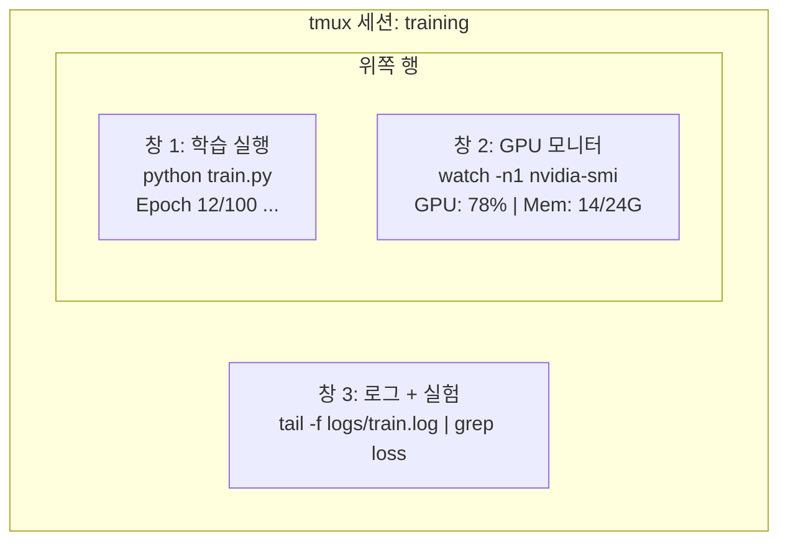

# 터미널과 셸

> 터미널은 AI 엔지니어가 머무는 곳입니다. 여기에서 편해져야 합니다.

**Type:** Learn
**Languages:** --
**Prerequisites:** Phase 0, Lesson 01
**Time:** ~35 minutes

## 학습 목표

- 명령줄에서 파이프, 리다이렉트, `grep`을 사용해 학습 로그를 필터링하고 처리하기
- 동시 학습과 GPU 모니터링을 위해 여러 창이 있는 지속적인 tmux 세션 만들기
- `htop`, `nvtop`, `nvidia-smi`로 시스템과 GPU 리소스 모니터링하기
- SSH, `scp`, `rsync`를 사용해 로컬 머신과 원격 머신 사이에서 파일 전송하기

## 문제

어떤 에디터보다 터미널에서 더 많은 시간을 보내게 됩니다. 학습 실행, GPU 모니터링, 로그 tail, 원격 SSH 세션, 환경 관리까지 모든 AI 워크플로는 셸을 거칩니다. 여기에서 느리면 모든 곳에서 느립니다.

이 lesson은 AI 작업에 필요한 터미널 기술을 다룹니다. Unix 역사도, Bash 스크립팅 심화도 없습니다. 필요한 것만 다룹니다.

## 개념



세 가지가 동시에 실행됩니다. 터미널은 하나입니다. 세션에서 분리하고, 집에 갔다가, 다시 SSH로 접속해 재연결할 수 있습니다. 학습은 계속 실행됩니다.

## 직접 만들기

### Step 1: 자신의 셸 알기

어떤 셸을 실행 중인지 확인합니다.

```bash
echo $SHELL
```

대부분의 시스템은 `bash` 또는 `zsh`를 사용합니다. 둘 다 괜찮습니다. 이 course의 명령은 둘 중 어느 쪽에서도 동작합니다.

알아야 할 핵심은 다음과 같습니다.

```bash
# Move around
cd ~/projects/ai-engineering-from-scratch
pwd
ls -la

# History search (most useful shortcut you'll learn)
# Ctrl+R then type part of a previous command
# Press Ctrl+R again to cycle through matches

# Clear terminal
clear   # or Ctrl+L

# Cancel a running command
# Ctrl+C

# Suspend a running command (resume with fg)
# Ctrl+Z
```

### Step 2: 파이프와 리다이렉트

파이프는 명령들을 서로 연결합니다. 로그를 처리하고, 출력을 필터링하고, 도구를 이어 붙이는 방식입니다. 계속 사용하게 됩니다.

```bash
# Count how many times "loss" appears in a log
cat train.log | grep "loss" | wc -l

# Extract just the loss values from training output
grep "loss:" train.log | awk '{print $NF}' > losses.txt

# Watch a log file update in real time, filtering for errors
tail -f train.log | grep --line-buffered "ERROR"

# Sort experiments by final accuracy
grep "final_accuracy" results/*.log | sort -t= -k2 -n -r

# Redirect stdout and stderr to separate files
python train.py > output.log 2> errors.log

# Redirect both to the same file
python train.py > train_full.log 2>&1
```

알아야 할 리다이렉션 기호는 다음과 같습니다.

| 기호 | 하는 일 |
|--------|-------------|
| `>` | stdout을 파일에 씁니다(덮어쓰기) |
| `>>` | stdout을 파일에 덧붙입니다 |
| `2>` | stderr를 파일에 씁니다 |
| `2>&1` | stderr를 stdout과 같은 위치로 보냅니다 |
| `\|` | 한 명령의 stdout을 다음 명령의 stdin으로 보냅니다 |

### Step 3: 백그라운드 프로세스

학습 실행은 몇 시간이 걸립니다. 터미널을 계속 열어 두고 싶지는 않을 것입니다.

```bash
# Run in background (output still goes to terminal)
python train.py &

# Run in background, immune to hangup (closing terminal won't kill it)
nohup python train.py > train.log 2>&1 &

# Check what's running in background
jobs
ps aux | grep train.py

# Bring a background job to foreground
fg %1

# Kill a background process
kill %1
# or find its PID and kill that
kill $(pgrep -f "train.py")
```

`&`, `nohup`, `screen`/`tmux`의 차이:

| 방식 | 터미널을 닫아도 살아남나요? | 다시 연결할 수 있나요? |
|--------|-------------------------|---------------|
| `command &` | 아니요 | 아니요 |
| `nohup command &` | 예 | 아니요(로그 파일 확인) |
| `screen` / `tmux` | 예 | 예 |

몇 분보다 오래 걸리는 작업에는 tmux를 사용하세요.

### Step 4: tmux

tmux를 사용하면 여러 창이 있는 지속적인 터미널 세션을 만들 수 있습니다. 학습 실행을 관리하는 데 가장 유용한 단일 도구입니다.

```bash
# Install
# macOS
brew install tmux
# Ubuntu
sudo apt install tmux

# Start a named session
tmux new -s training

# Split horizontally
# Ctrl+B then "

# Split vertically
# Ctrl+B then %

# Navigate between panes
# Ctrl+B then arrow keys

# Detach (session keeps running)
# Ctrl+B then d

# Reattach
tmux attach -t training

# List sessions
tmux ls

# Kill a session
tmux kill-session -t training
```

전형적인 AI 워크플로 세션은 다음과 같습니다.

```bash
tmux new -s train

# Pane 1: start training
python train.py --epochs 100 --lr 1e-4

# Ctrl+B, " to split, then run GPU monitor
watch -n1 nvidia-smi

# Ctrl+B, % to split vertically, tail the logs
tail -f logs/experiment.log

# Now detach with Ctrl+B, d
# SSH out, go get coffee, come back
# tmux attach -t train
```

### Step 5: htop과 nvtop으로 모니터링하기

```bash
# System processes (better than top)
htop

# GPU processes (if you have NVIDIA GPU)
# Install: sudo apt install nvtop (Ubuntu) or brew install nvtop (macOS)
nvtop

# Quick GPU check without nvtop
nvidia-smi

# Watch GPU usage update every second
watch -n1 nvidia-smi

# See which processes are using the GPU
nvidia-smi --query-compute-apps=pid,name,used_memory --format=csv
```

사용하게 될 `htop` 키 바인딩:
- `F6` 또는 `>`: 열 기준 정렬(메모리 누수를 찾으려면 메모리 기준 정렬)
- `F5`: 트리 보기 전환(자식 프로세스 확인)
- `F9`: 프로세스 종료
- `/`: 프로세스 이름 검색

### Step 6: 원격 GPU 박스용 SSH

클라우드 GPU(Lambda, RunPod, Vast.ai)를 빌리면 SSH로 접속합니다.

```bash
# Basic connection
ssh user@gpu-box-ip

# With a specific key
ssh -i ~/.ssh/my_gpu_key user@gpu-box-ip

# Copy files to remote
scp model.pt user@gpu-box-ip:~/models/

# Copy files from remote
scp user@gpu-box-ip:~/results/metrics.json ./

# Sync a whole directory (faster for many files)
rsync -avz ./data/ user@gpu-box-ip:~/data/

# Port forward (access remote Jupyter/TensorBoard locally)
ssh -L 8888:localhost:8888 user@gpu-box-ip
# Now open localhost:8888 in your browser

# SSH config for convenience
# Add to ~/.ssh/config:
# Host gpu
#     HostName 192.168.1.100
#     User ubuntu
#     IdentityFile ~/.ssh/gpu_key
#
# Then just:
# ssh gpu
```

### Step 7: AI 작업에 유용한 alias

다음을 `~/.bashrc` 또는 `~/.zshrc`에 추가합니다.

```bash
source phases/00-setup-and-tooling/10-terminal-and-shell/code/shell_aliases.sh
```

또는 원하는 것만 복사하세요. 핵심 alias는 다음과 같습니다.

```bash
# GPU status at a glance
alias gpu='nvidia-smi --query-gpu=index,name,utilization.gpu,memory.used,memory.total,temperature.gpu --format=csv,noheader'

# Kill all Python training processes
alias killtraining='pkill -f "python.*train"'

# Quick virtual environment activate
alias ae='source .venv/bin/activate'

# Watch training loss
alias watchloss='tail -f logs/*.log | grep --line-buffered "loss"'
```

전체 목록은 `code/shell_aliases.sh`를 보세요.

### Step 8: 자주 쓰는 AI 터미널 패턴

실무에서 반복해서 등장합니다.

```bash
# Run training, log everything, notify when done
python train.py 2>&1 | tee train.log; echo "DONE" | mail -s "Training complete" you@email.com

# Compare two experiment logs side by side
diff <(grep "accuracy" exp1.log) <(grep "accuracy" exp2.log)

# Find the largest model files (clean up disk space)
find . -name "*.pt" -o -name "*.safetensors" | xargs du -h | sort -rh | head -20

# Download a model from Hugging Face
wget https://huggingface.co/model/resolve/main/model.safetensors

# Untar a dataset
tar xzf dataset.tar.gz -C ./data/

# Count lines in all Python files (see how big your project is)
find . -name "*.py" | xargs wc -l | tail -1

# Check disk space (training data fills disks fast)
df -h
du -sh ./data/*

# Environment variable check before training
env | grep -i cuda
env | grep -i torch
```

## 사용하기

이 course에서 각 도구가 쓰이는 시점은 다음과 같습니다.

| 도구 | 언제 사용하는가 |
|------|----------------|
| tmux | 모든 학습 실행(Phases 3+) |
| `tail -f` + `grep` | 학습 로그 모니터링 |
| `nohup` / `&` | 빠른 백그라운드 작업 |
| `htop` / `nvtop` | 느린 학습, OOM 오류 디버깅 |
| SSH + `rsync` | 클라우드 GPU에서 작업 |
| 파이프 + 리다이렉트 | 실험 결과 처리 |
| Alias | 반복 명령 시간 절약 |

## 연습 문제

1. tmux를 설치하고 세 개의 창이 있는 세션을 만든 뒤, 한 창에서는 `htop`, 다른 창에서는 `watch -n1 date`, 세 번째 창에서는 Python 스크립트를 실행하세요. 분리한 다음 다시 연결하세요.
2. `code/shell_aliases.sh`의 alias를 셸 설정에 추가하고 `source ~/.zshrc`(또는 `~/.bashrc`)로 다시 로드하세요.
3. `for i in $(seq 1 100); do echo "epoch $i loss: $(echo "scale=4; 1/$i" | bc)"; sleep 0.1; done > fake_train.log`로 가짜 학습 로그를 만든 다음 `grep`, `tail`, `awk`를 사용해 loss 값만 추출하세요.
4. 접근 권한이 있는 서버에 대한 SSH config 항목을 설정하세요(또는 문법 연습용으로 `localhost`를 사용하세요).

## 핵심 용어

| 용어 | 사람들이 말하는 것 | 실제 의미 |
|------|----------------|----------------------|
| Shell | "터미널" | 명령을 해석하는 프로그램(bash, zsh, fish) |
| tmux | "Terminal multiplexer" | 하나의 창 안에서 여러 터미널 세션을 실행하고 분리/재연결할 수 있게 해주는 프로그램 |
| Pipe | "막대 기호" | 한 명령의 출력을 다른 명령의 입력으로 보내는 `\|` 연산자 |
| PID | "Process ID" | 실행 중인 모든 프로세스에 부여되는 고유 번호로, 모니터링하거나 종료할 때 사용 |
| nohup | "No hangup" | hangup 신호의 영향을 받지 않게 명령을 실행해 터미널을 닫아도 종료되지 않게 함 |
| SSH | "서버에 접속하기" | 원격 머신에서 명령을 실행하기 위한 암호화 프로토콜인 Secure Shell |
