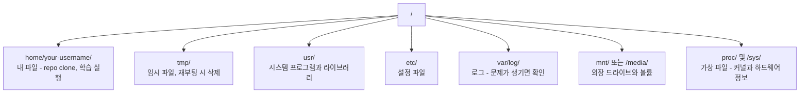

# AI를 위한 Linux

> 대부분의 AI는 Linux에서 실행됩니다. 막히지 않을 만큼은 알아야 합니다.

**Type:** Learn
**Languages:** --
**Prerequisites:** Phase 0, Lesson 01
**Time:** ~30 minutes

## 학습 목표

- Linux 파일 시스템을 탐색하고 명령줄에서 필수 파일 작업 수행하기
- `chmod`와 `chown`으로 파일 권한을 관리해 "Permission denied" 오류 해결하기
- `apt`로 시스템 패키지를 설치하고 AI 작업용 새 GPU 박스 설정하기
- 원격 머신에서 작업하는 개발자가 자주 헷갈리는 macOS와 Linux의 차이 파악하기

## 문제

macOS나 Windows에서 개발하더라도, 클라우드 GPU 박스에 SSH로 접속하거나 Lambda 인스턴스를 빌리거나 EC2 머신을 띄우는 순간 Ubuntu에 도착합니다. 터미널이 유일한 인터페이스입니다. Finder도, Explorer도, GUI도 없습니다. 명령줄에서 파일 시스템을 탐색하고, 패키지를 설치하고, 프로세스를 관리할 수 없다면 "Linux에서 파일 압축 푸는 법"을 검색하는 동안 유휴 GPU 비용을 내게 됩니다.

이것은 생존 가이드입니다. AI 작업을 위해 원격 Linux 머신을 다루는 데 필요한 것만 정확히 다룹니다. 그 이상은 다루지 않습니다.

## 파일 시스템 구조

Linux는 모든 것을 하나의 루트 `/` 아래에 구성합니다. `C:\`나 `/Volumes`는 없습니다. 실제로 만지게 될 디렉터리는 다음과 같습니다.



홈 디렉터리는 `~` 또는 `/home/your-username`입니다. 거의 모든 작업은 여기에서 이루어집니다.

## 필수 명령

원격 GPU 박스에서 하는 일의 95%를 커버하는 15개 명령입니다.

### 이동하기

```bash
pwd                         # Where am I?
ls                          # What's here?
ls -la                      # What's here, including hidden files with details?
cd /path/to/dir             # Go there
cd ~                        # Go home
cd ..                       # Go up one level
```

### 파일과 디렉터리

```bash
mkdir my-project            # Create a directory
mkdir -p a/b/c              # Create nested directories in one shot

cp file.txt backup.txt      # Copy a file
cp -r src/ src-backup/      # Copy a directory (recursive)

mv old.txt new.txt          # Rename a file
mv file.txt /tmp/           # Move a file

rm file.txt                 # Delete a file (no trash, it's gone)
rm -rf my-dir/              # Delete a directory and everything inside
```

`rm -rf`는 영구적입니다. 되돌리기가 없습니다. enter를 누르기 전에 경로를 다시 확인하세요.

### 파일 읽기

```bash
cat file.txt                # Print entire file
head -20 file.txt           # First 20 lines
tail -20 file.txt           # Last 20 lines
tail -f log.txt             # Follow a log file in real time (Ctrl+C to stop)
less file.txt               # Scroll through a file (q to quit)
```

### 검색하기

```bash
grep "error" training.log           # Find lines containing "error"
grep -r "learning_rate" .           # Search all files in current directory
grep -i "cuda" config.yaml          # Case-insensitive search

find . -name "*.py"                 # Find all Python files under current dir
find . -name "*.ckpt" -size +1G     # Find checkpoint files larger than 1GB
```

## 권한

Linux의 모든 파일에는 소유자와 권한 비트가 있습니다. 스크립트가 실행되지 않거나 디렉터리에 쓸 수 없을 때 마주치게 됩니다.

```bash
ls -l train.py
# -rwxr-xr-- 1 user group 2048 Mar 19 10:00 train.py
#  ^^^             owner permissions: read, write, execute
#     ^^^          group permissions: read, execute
#        ^^        everyone else: read only
```

자주 쓰는 해결책:

```bash
chmod +x train.sh           # Make a script executable
chmod 755 deploy.sh         # Owner: full, others: read+execute
chmod 644 config.yaml       # Owner: read+write, others: read only

chown user:group file.txt   # Change who owns a file (needs sudo)
```

"Permission denied"가 보이면 거의 항상 권한 문제입니다. 대부분은 `chmod +x` 또는 `sudo`로 해결됩니다.

## 패키지 관리(apt)

Ubuntu는 `apt`를 사용합니다. 시스템 수준 소프트웨어를 설치하는 방법입니다.

```bash
sudo apt update             # Refresh the package list (always do this first)
sudo apt install -y htop    # Install a package (-y skips confirmation)
sudo apt install -y build-essential  # C compiler, make, etc. Needed by many Python packages
sudo apt install -y tmux    # Terminal multiplexer (keep sessions alive after disconnect)

apt list --installed        # What's installed?
sudo apt remove htop        # Uninstall
```

새 GPU 박스에 흔히 설치하는 패키지:

```bash
sudo apt update && sudo apt install -y \
    build-essential \
    git \
    curl \
    wget \
    tmux \
    htop \
    unzip \
    python3-venv
```

## 사용자와 sudo

보통 일반 사용자로 로그인합니다. 일부 작업에는 root(관리자) 접근 권한이 필요합니다.

```bash
whoami                      # What user am I?
sudo command                # Run a single command as root
sudo su                     # Become root (exit to go back, use sparingly)
```

클라우드 GPU 인스턴스에서는 보통 사용자가 혼자이며 이미 sudo 접근 권한이 있습니다. 모든 것을 root로 실행하지 마세요. 필요할 때만 sudo를 사용하세요.

## 프로세스와 systemd

학습이 멈춘 것 같거나 무엇이 실행 중인지 확인해야 할 때:

```bash
htop                        # Interactive process viewer (q to quit)
ps aux | grep python        # Find running Python processes
kill 12345                  # Gracefully stop process with PID 12345
kill -9 12345               # Force kill (use when graceful doesn't work)
nvidia-smi                  # GPU processes and memory usage
```

systemd는 서비스(백그라운드 데몬)를 관리합니다. 추론 서버를 실행할 때 사용하게 됩니다.

```bash
sudo systemctl start nginx          # Start a service
sudo systemctl stop nginx           # Stop it
sudo systemctl restart nginx        # Restart it
sudo systemctl status nginx         # Check if it's running
sudo systemctl enable nginx         # Start automatically on boot
```

## 디스크 공간

GPU 박스는 디스크 공간이 제한적인 경우가 많습니다. 모델과 데이터셋은 금방 디스크를 채웁니다.

```bash
df -h                       # Disk usage for all mounted drives
df -h /home                 # Disk usage for /home specifically

du -sh *                    # Size of each item in current directory
du -sh ~/.cache             # Size of your cache (pip, huggingface models land here)
du -sh /data/checkpoints/   # Check how big your checkpoints are

# Find the biggest space hogs
du -h --max-depth=1 / 2>/dev/null | sort -hr | head -20
```

흔한 공간 절약 방법:

```bash
# Clear pip cache
pip cache purge

# Clear apt cache
sudo apt clean

# Remove old checkpoints you don't need
rm -rf checkpoints/epoch_01/ checkpoints/epoch_02/
```

## 네트워킹

명령줄에서 모델을 다운로드하고, 파일을 전송하고, API를 호출하게 됩니다.

```bash
# Download files
wget https://example.com/model.bin                   # Download a file
curl -O https://example.com/data.tar.gz              # Same thing with curl
curl -s https://api.example.com/health | python3 -m json.tool  # Hit an API, pretty-print JSON

# Transfer files between machines
scp model.bin user@remote:/data/                     # Copy file to remote machine
scp user@remote:/data/results.csv .                  # Copy file from remote to local
scp -r user@remote:/data/checkpoints/ ./local-dir/   # Copy directory

# Sync directories (faster than scp for large transfers, resumes on failure)
rsync -avz --progress ./data/ user@remote:/data/
rsync -avz --progress user@remote:/results/ ./results/
```

큰 파일에는 `scp`보다 `rsync`를 사용하세요. 변경된 바이트만 전송하고 끊어진 연결도 이어받습니다.

## tmux: 세션 살려 두기

원격 박스에 SSH로 접속했을 때 노트북을 닫으면 학습 실행이 죽습니다. tmux는 이를 막아 줍니다.

```bash
tmux new -s train           # Start a new session named "train"
# ... start your training, then:
# Ctrl+B, then D            # Detach (training keeps running)

tmux ls                     # List sessions
tmux attach -t train        # Reattach to session

# Inside tmux:
# Ctrl+B, then %            # Split pane vertically
# Ctrl+B, then "            # Split pane horizontally
# Ctrl+B, then arrow keys   # Switch between panes
```

긴 학습 작업은 항상 tmux 안에서 실행하세요. 항상.

## Windows 사용자를 위한 WSL2

Windows를 사용한다면 WSL2로 듀얼 부팅 없이 실제 Linux 환경을 얻을 수 있습니다.

```bash
# In PowerShell (admin)
wsl --install -d Ubuntu-24.04

# After restart, open Ubuntu from Start menu
sudo apt update && sudo apt upgrade -y
```

WSL2는 실제 Linux 커널을 실행합니다. 이 lesson의 모든 내용은 그 안에서 동작합니다. WSL 내부에서 Windows 파일은 `/mnt/c/Users/YourName/`에 있습니다.

GPU passthrough는 Windows 쪽에 NVIDIA 드라이버가 설치되어 있으면 동작합니다. Linux용이 아니라 Windows NVIDIA 드라이버를 설치하면 WSL2 안에서 CUDA를 사용할 수 있습니다.

## 주의할 점: macOS에서 Linux로

macOS에서 왔다면 헷갈릴 수 있는 것들입니다.

| macOS | Linux | 메모 |
|-------|-------|-------|
| `brew install` | `sudo apt install` | 패키지 이름이 다를 때가 있습니다. `brew install htop`과 `sudo apt install htop`은 같은 식으로 동작하지만, `brew install readline`과 `sudo apt install libreadline-dev`는 그렇지 않습니다. |
| `open file.txt` | `xdg-open file.txt` | 하지만 원격 박스에는 GUI가 없을 것입니다. `cat`이나 `less`를 사용하세요. |
| `pbcopy` / `pbpaste` | 사용할 수 없음 | SSH에서는 클립보드로 pipe를 주고받을 수 없습니다. |
| `~/.zshrc` | `~/.bashrc` | macOS 기본값은 zsh입니다. 대부분의 Linux 서버는 bash를 사용합니다. |
| `/opt/homebrew/` | `/usr/bin/`, `/usr/local/bin/` | 바이너리가 다른 위치에 있습니다. |
| `sed -i '' 's/a/b/' file` | `sed -i 's/a/b/' file` | macOS sed는 `-i` 뒤에 빈 문자열이 필요합니다. Linux는 필요 없습니다. |
| 대소문자를 구분하지 않는 파일 시스템 | 대소문자를 구분하는 파일 시스템 | Linux에서 `Model.py`와 `model.py`는 서로 다른 파일입니다. |
| 줄 끝 `\n` | 줄 끝 `\n` | 같습니다. 하지만 Windows는 `\r\n`을 사용하고, 이는 bash 스크립트를 깨뜨립니다. `dos2unix`를 실행해 고치세요. |

## 빠른 참조 카드

```
Navigation:     pwd, ls, cd, find
Files:          cp, mv, rm, mkdir, cat, head, tail, less
Search:         grep, find
Permissions:    chmod, chown, sudo
Packages:       apt update, apt install
Processes:      htop, ps, kill, nvidia-smi
Services:       systemctl start/stop/restart/status
Disk:           df -h, du -sh
Network:        curl, wget, scp, rsync
Sessions:       tmux new/attach/detach
```

## 연습 문제

1. 아무 Linux 머신에 SSH로 접속하거나 WSL2를 열고 홈 디렉터리로 이동하세요. 프로젝트 폴더를 만들고 그 안에 `touch`로 빈 파일 세 개를 만든 다음 `ls -la`로 나열하세요.
2. apt로 `htop`을 설치하고 실행한 뒤, 어떤 프로세스가 가장 많은 메모리를 사용하는지 확인하세요.
3. tmux 세션을 시작하고 그 안에서 `sleep 300`을 실행한 뒤 분리하고, 세션 목록을 확인하고, 다시 연결하세요.
4. `df -h`로 사용 가능한 디스크 공간을 확인한 다음 `du -sh ~/.cache/*`로 캐시에서 공간을 차지하는 항목을 찾으세요.
5. `scp`로 로컬 머신에서 원격 머신으로 파일을 전송한 다음, 같은 전송을 `rsync`로 수행하고 경험을 비교하세요.
