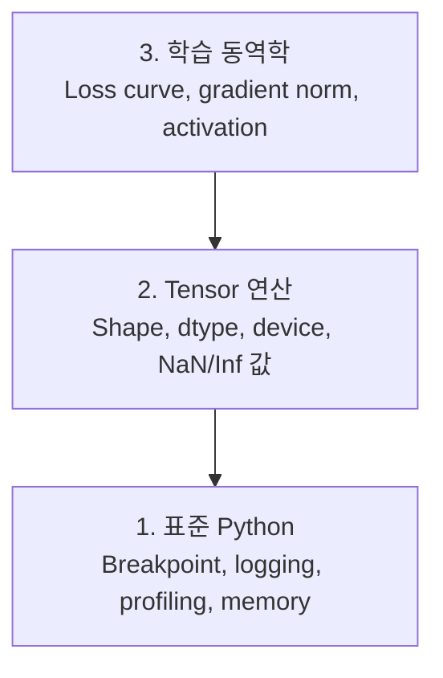

# 디버깅과 프로파일링

> 최악의 AI 버그는 크래시를 내지 않습니다. 조용히 쓰레기 데이터로 학습하고 멋진 loss 곡선을 보고합니다.

**Type:** Build
**Language:** Python
**Prerequisites:** Lesson 1 (개발 환경), 기본 PyTorch 친숙도
**Time:** ~60 minutes

## 학습 목표

- 조건부 `breakpoint()`와 `debug_print`를 사용해 학습 중간의 tensor shape, dtype, NaN 값을 검사하기
- `cProfile`, `line_profiler`, `tracemalloc`으로 학습 루프를 프로파일링해 병목 찾기
- shape mismatch, NaN loss, data leakage, wrong-device tensor 같은 흔한 AI 버그 감지하기
- TensorBoard를 설정해 loss curve, weight histogram, gradient distribution 시각화하기

## 문제

AI 코드는 일반 코드와 다르게 실패합니다. 웹 앱은 stack trace와 함께 크래시가 납니다. 잘못 설정된 학습 루프는 8시간 동안 실행되고, GPU 비용 200달러를 태우고, 모든 입력의 평균을 예측하는 모델을 만들어 냅니다. 코드는 오류를 내지 않았습니다. 버그는 잘못된 device의 tensor, 잊어버린 `.detach()`, 또는 feature에 새어 들어간 label이었습니다.

시간과 compute를 낭비하기 전에 이런 조용한 실패를 잡아내는 디버깅 도구가 필요합니다.

## 개념

AI 디버깅은 세 단계에서 작동합니다.



대부분의 사람은 곧바로 level 3(TensorBoard를 들여다보기)로 갑니다. 하지만 AI 버그의 80%는 level 1과 2에 있습니다.

## 직접 만들기

### Part 1: Print 디버깅(네, 동작합니다)

Print 디버깅은 과소평가됩니다. 그래서는 안 됩니다. tensor 코드에서는 targeted print statement가 debugger를 한 단계씩 따라가는 것보다 낫습니다. shape, dtype, 값 범위를 한 번에 봐야 하기 때문입니다.

```python
def debug_print(name, tensor):
    print(f"{name}: shape={tensor.shape}, dtype={tensor.dtype}, "
          f"device={tensor.device}, "
          f"min={tensor.min().item():.4f}, max={tensor.max().item():.4f}, "
          f"mean={tensor.mean().item():.4f}, "
          f"has_nan={tensor.isnan().any().item()}")
```

의심스러운 연산 뒤마다 이것을 호출하세요. 버그를 찾으면 print를 제거합니다. 단순합니다.

### Part 2: Python Debugger(pdb와 breakpoint)

내장 debugger는 AI 작업에서 저평가되어 있습니다. 학습 루프에 `breakpoint()`를 넣고 tensor를 상호작용식으로 검사하세요.

```python
def training_step(model, batch, criterion, optimizer):
    inputs, labels = batch
    outputs = model(inputs)
    loss = criterion(outputs, labels)

    if loss.item() > 100 or torch.isnan(loss):
        breakpoint()

    loss.backward()
    optimizer.step()
```

debugger가 멈추면 유용한 명령:

- `p outputs.shape`: shape 확인
- `p loss.item()`: loss 값 확인
- `p torch.isnan(outputs).sum()`: NaN 개수 세기
- `p model.fc1.weight.grad`: gradient 확인
- `c`: 계속 실행, `q`: 종료

이것이 조건부 디버깅입니다. 무언가 잘못되어 보일 때만 멈춥니다. 10,000-step 학습 실행에서는 이 차이가 큽니다.

### Part 3: Python Logging

디버깅이 빠른 확인을 넘어가면 print statement를 logging으로 바꾸세요.

```python
import logging

logging.basicConfig(
    level=logging.INFO,
    format="%(asctime)s [%(levelname)s] %(message)s",
    handlers=[
        logging.FileHandler("training.log"),
        logging.StreamHandler()
    ]
)
logger = logging.getLogger(__name__)

logger.info("Starting training: lr=%.4f, batch_size=%d", lr, batch_size)
logger.warning("Loss spike detected: %.4f at step %d", loss.item(), step)
logger.error("NaN loss at step %d, stopping", step)
```

Logging은 timestamp, severity level, file output을 제공합니다. 학습 실행이 새벽 3시에 실패하면 화면 밖으로 밀려난 터미널 출력이 아니라 로그 파일이 필요합니다.

### Part 4: 코드 구간 시간 측정

시간이 어디에 쓰이는지 아는 것이 최적화의 첫 단계입니다.

```python
import time

class Timer:
    def __init__(self, name=""):
        self.name = name

    def __enter__(self):
        self.start = time.perf_counter()
        return self

    def __exit__(self, *args):
        elapsed = time.perf_counter() - self.start
        print(f"[{self.name}] {elapsed:.4f}s")

with Timer("data loading"):
    batch = next(dataloader_iter)

with Timer("forward pass"):
    outputs = model(batch)

with Timer("backward pass"):
    loss.backward()
```

흔한 발견: data loading이 학습 시간의 60%를 차지합니다. 해결책은 더 빠른 GPU가 아니라 DataLoader의 `num_workers > 0`입니다.

### Part 5: cProfile과 line_profiler

수동 timer보다 더 많은 정보가 필요할 때:

```bash
python -m cProfile -s cumtime train.py
```

이 명령은 누적 시간순으로 정렬된 모든 함수 호출을 보여 줍니다. line-by-line profiling을 하려면:

```bash
pip install line_profiler
```

```python
@profile
def train_step(model, data, target):
    output = model(data)
    loss = F.cross_entropy(output, target)
    loss.backward()
    return loss

# Run with: kernprof -l -v train.py
```

### Part 6: 메모리 프로파일링

#### tracemalloc으로 CPU 메모리 확인

```python
import tracemalloc

tracemalloc.start()

# your code here
model = build_model()
data = load_dataset()

snapshot = tracemalloc.take_snapshot()
top_stats = snapshot.statistics("lineno")
for stat in top_stats[:10]:
    print(stat)
```

#### memory_profiler로 CPU 메모리 확인

```bash
pip install memory_profiler
```

```python
from memory_profiler import profile

@profile
def load_data():
    raw = read_csv("data.csv")       # watch memory jump here
    processed = preprocess(raw)       # and here
    return processed
```

`python -m memory_profiler your_script.py`로 실행하면 line-by-line memory usage를 볼 수 있습니다.

#### PyTorch로 GPU 메모리 확인

```python
import torch

if torch.cuda.is_available():
    print(torch.cuda.memory_summary())

    print(f"Allocated: {torch.cuda.memory_allocated() / 1e9:.2f} GB")
    print(f"Cached: {torch.cuda.memory_reserved() / 1e9:.2f} GB")
```

OOM(Out of Memory)이 발생하면:

1. batch size 줄이기(항상 가장 먼저 시도)
2. `torch.cuda.empty_cache()`로 cached memory 해제하기
3. 큰 intermediate에는 `del tensor` 다음 `torch.cuda.empty_cache()` 사용하기
4. mixed precision(`torch.cuda.amp`)으로 메모리 사용량 절반으로 줄이기
5. 아주 깊은 모델에는 gradient checkpointing 사용하기

### Part 7: 흔한 AI 버그와 잡는 법

#### Shape Mismatch

가장 흔한 버그입니다. 모델은 `[batch, channels, height, width]`를 기대하는데 tensor shape가 `[batch, features]`입니다.

```python
def check_shapes(model, sample_input):
    print(f"Input: {sample_input.shape}")
    hooks = []

    def make_hook(name):
        def hook(module, inp, out):
            in_shape = inp[0].shape if isinstance(inp, tuple) else inp.shape
            out_shape = out.shape if hasattr(out, "shape") else type(out)
            print(f"  {name}: {in_shape} -> {out_shape}")
        return hook

    for name, module in model.named_modules():
        hooks.append(module.register_forward_hook(make_hook(name)))

    with torch.no_grad():
        model(sample_input)

    for h in hooks:
        h.remove()
```

sample batch로 한 번 실행하세요. 모델의 모든 shape transformation을 매핑합니다.

#### NaN Loss

NaN loss는 무언가 폭발했다는 뜻입니다. 흔한 원인:

- Learning rate가 너무 높음
- Custom loss에서 0으로 나눔
- 0 또는 음수에 log 적용
- RNN의 exploding gradient

```python
def detect_nan(model, loss, step):
    if torch.isnan(loss):
        print(f"NaN loss at step {step}")
        for name, param in model.named_parameters():
            if param.grad is not None:
                if torch.isnan(param.grad).any():
                    print(f"  NaN gradient in {name}")
                if torch.isinf(param.grad).any():
                    print(f"  Inf gradient in {name}")
        return True
    return False
```

#### Data Leakage

모델이 test set에서 99% accuracy를 냅니다. 좋아 보입니다. 하지만 버그입니다.

```python
def check_data_leakage(train_set, test_set, id_column="id"):
    train_ids = set(train_set[id_column].tolist())
    test_ids = set(test_set[id_column].tolist())
    overlap = train_ids & test_ids
    if overlap:
        print(f"DATA LEAKAGE: {len(overlap)} samples in both train and test")
        return True
    return False
```

Temporal leakage도 확인하세요. 미래 데이터를 사용해 과거를 예측하는 경우입니다. split 전에 timestamp 기준으로 정렬하세요.

#### Wrong Device

서로 다른 device(CPU vs GPU)에 있는 tensor는 runtime error를 일으킵니다. 하지만 때로는 tensor 하나가 조용히 CPU에 남아 있고 나머지는 GPU에 있어, 학습이 그냥 느리게 실행됩니다.

```python
def check_devices(model, *tensors):
    model_device = next(model.parameters()).device
    print(f"Model device: {model_device}")
    for i, t in enumerate(tensors):
        if t.device != model_device:
            print(f"  WARNING: tensor {i} on {t.device}, model on {model_device}")
```

### Part 8: TensorBoard 기초

TensorBoard는 시간에 따라 학습 내부에서 무슨 일이 일어나는지 보여 줍니다.

```bash
pip install tensorboard
```

```python
from torch.utils.tensorboard import SummaryWriter

writer = SummaryWriter("runs/experiment_1")

for step in range(num_steps):
    loss = train_step(model, batch)

    writer.add_scalar("loss/train", loss.item(), step)
    writer.add_scalar("lr", optimizer.param_groups[0]["lr"], step)

    if step % 100 == 0:
        for name, param in model.named_parameters():
            writer.add_histogram(f"weights/{name}", param, step)
            if param.grad is not None:
                writer.add_histogram(f"grads/{name}", param.grad, step)

writer.close()
```

실행:

```bash
tensorboard --logdir=runs
```

확인할 것:

- **Loss가 감소하지 않음**: Learning rate가 너무 낮거나 model architecture 문제
- **Loss가 심하게 출렁임**: Learning rate가 너무 높음
- **Loss가 NaN으로 감**: Numerical instability(위 NaN 섹션 참고)
- **Train loss는 감소하지만 val loss는 증가함**: Overfitting
- **Weight histogram이 0으로 붕괴함**: Vanishing gradient
- **Gradient histogram이 폭발함**: Gradient clipping 필요

### Part 9: VS Code Debugger

상호작용식 디버깅을 위해 VS Code에 `launch.json`을 설정합니다.

```json
{
    "version": "0.2.0",
    "configurations": [
        {
            "name": "Debug Training",
            "type": "debugpy",
            "request": "launch",
            "program": "${file}",
            "console": "integratedTerminal",
            "justMyCode": false
        }
    ]
}
```

gutter를 클릭해 breakpoint를 설정하세요. Variables pane으로 tensor property를 검사합니다. Debug Console에서는 실행 중간에 임의의 Python expression을 실행할 수 있습니다.

각 transformation을 보고 싶은 data preprocessing pipeline을 단계별로 따라갈 때 유용합니다.

## 사용하기

대부분의 AI 버그를 잡는 디버깅 워크플로는 다음과 같습니다.

1. **학습 전**: sample batch로 `check_shapes`를 실행하세요. input과 output dimension이 기대와 맞는지 확인합니다.
2. **처음 10 step**: loss, output, gradient에 `debug_print`를 사용하세요. NaN이 없고 값이 합리적인 범위에 있는지 확인합니다.
3. **학습 중**: loss, learning rate, gradient norm을 log로 남기세요. 시각화에는 TensorBoard를 사용합니다.
4. **문제가 생겼을 때**: 실패 지점에 `breakpoint()`를 넣으세요. tensor를 상호작용식으로 검사합니다.
5. **성능 문제**: data loading, forward pass, backward pass 시간을 비교하세요. OOM에 가깝다면 memory를 profile하세요.

## 출시하기

디버깅 toolkit script를 실행합니다.

```bash
python phases/00-setup-and-tooling/12-debugging-and-profiling/code/debug_tools.py
```

AI-specific bug 진단을 돕는 prompt는 `outputs/prompt-debug-ai-code.md`를 보세요.

## 연습 문제

1. `debug_tools.py`를 실행하고 각 섹션의 출력을 읽어 보세요. dummy model을 수정해 NaN을 만들고(힌트: forward pass에서 0으로 나누기) detector가 이를 잡는지 확인하세요.
2. `cProfile`로 training loop를 profile하고 가장 느린 함수를 찾으세요.
3. `tracemalloc`을 사용해 data loading pipeline의 어느 줄이 가장 많은 메모리를 할당하는지 찾으세요.
4. 간단한 학습 실행에 TensorBoard를 설정하고 model이 overfitting 중인지 확인하세요.
5. training loop 안에서 `breakpoint()`를 사용하세요. debugger prompt에서 tensor shape, device, gradient 값을 검사하는 연습을 하세요.
