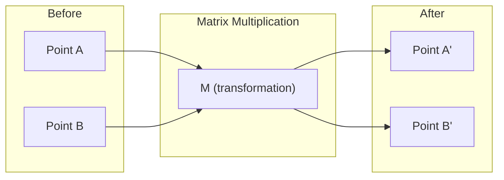
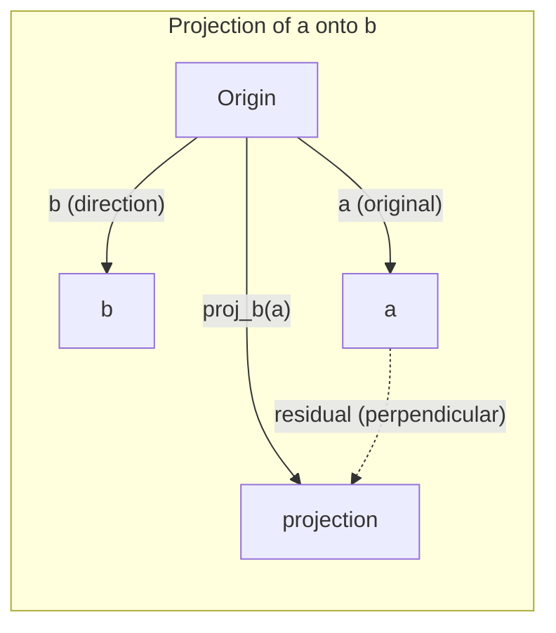

# 선형대수 직관

> 모든 AI 모델은 멋진 모자를 쓴 행렬 수학일 뿐입니다.

**Type:** Learn
**Languages:** Python, Julia
**Prerequisites:** Phase 0
**Time:** ~60 minutes

## 학습 목표

- Python에서 벡터와 행렬 연산(덧셈, 내적, 행렬 곱셈)을 처음부터 구현합니다.
- 내적, 사영, Gram-Schmidt 과정이 무엇을 하는지 기하학적으로 설명합니다.
- 행 사다리꼴 변환을 사용해 벡터 집합의 선형 독립성, 랭크, 기저를 판별합니다.
- 선형대수 개념을 embeddings, attention scores, LoRA 같은 AI 응용과 연결합니다.

## 문제

아무 ML 논문이나 열어 보세요. 첫 페이지 안에서 벡터, 행렬, 내적, 변환을 보게 됩니다. 선형대수 직관이 없으면 이것들은 그저 기호일 뿐입니다. 직관이 있으면 신경망이 실제로 무엇을 하는지, 즉 공간에서 점들을 어떻게 움직이는지 볼 수 있습니다.

수학자가 될 필요는 없습니다. 이 연산들이 기하학적으로 무엇을 뜻하는지 보고, 직접 코드로 구현하면 됩니다.

## 개념

### 벡터는 점이자 방향입니다

벡터는 숫자 목록일 뿐입니다. 하지만 그 숫자에는 의미가 있습니다. 공간 속 좌표입니다.

**2D 벡터 [3, 2]:**

| x | y | 점 |
|---|---|-------|
| 3 | 2 | 이 벡터는 평면에서 원점 (0,0)에서 (3, 2)를 가리킵니다 |

이 벡터의 크기는 sqrt(3^2 + 2^2) = sqrt(13)이고 오른쪽 위를 가리킵니다.

AI에서 벡터는 모든 것을 표현합니다:
- 단어 → 768개 숫자로 된 벡터(embedding space에서의 "의미")
- 이미지 → 수백만 개 픽셀값으로 된 벡터
- 사용자 → 선호도를 나타내는 벡터

### 행렬은 변환입니다

행렬은 한 벡터를 다른 벡터로 변환합니다. 회전, 스케일링, 늘이기, 사영을 할 수 있습니다.



AI에서 행렬은 곧 모델입니다:
- 신경망 가중치 → 입력을 출력으로 변환하는 행렬
- Attention scores → 무엇에 집중할지 결정하는 행렬
- Embeddings → 단어를 벡터로 매핑하는 행렬

### 내적은 유사도를 측정합니다

두 벡터의 내적은 이들이 얼마나 비슷한지 알려 줍니다.

```text
a · b = a₁×b₁ + a₂×b₂ + ... + aₙ×bₙ

Same direction:      a · b > 0  (similar)
Perpendicular:       a · b = 0  (unrelated)
Opposite direction:  a · b < 0  (dissimilar)
```

검색 엔진, 추천 시스템, RAG가 실제로 이렇게 작동합니다. 내적이 큰 벡터를 찾는 것입니다.

### 선형 독립

집합 안의 어떤 벡터도 다른 벡터들의 결합으로 쓸 수 없다면 그 벡터들은 선형 독립입니다. v1, v2, v3가 독립이면 3D 공간을 span합니다. 하나가 다른 벡터들의 결합이면 평면만 span합니다.

AI에서 중요한 이유: 특징 행렬의 열은 선형 독립이어야 합니다. 두 특징이 완벽히 상관되어 있으면(선형 종속이면) 모델은 둘의 효과를 구분할 수 없습니다. 이는 회귀에서 다중공선성을 일으킵니다. 가중치 행렬이 불안정해지고, 작은 입력 변화가 큰 출력 흔들림을 만듭니다.

**구체적인 예:**

```text
v1 = [1, 0, 0]
v2 = [0, 1, 0]
v3 = [2, 1, 0]   # v3 = 2*v1 + v2
```

v1과 v2는 독립입니다. 어느 쪽도 다른 쪽의 스칼라배나 결합이 아닙니다. 하지만 v3 = 2*v1 + v2이므로 {v1, v2, v3}는 종속 집합입니다. 이 세 벡터는 모두 xy-평면 위에 있습니다. 어떻게 결합해도 [0, 0, 1]에는 도달할 수 없습니다. 벡터는 세 개지만 자유도는 두 차원뿐입니다.

데이터셋에서는 feature_3 = 2*feature_1 + feature_2라면 feature_3를 추가해도 모델에 새로운 정보가 전혀 생기지 않습니다. 더 나쁘게는 정규방정식을 특이하게 만들어 가중치의 유일한 해가 없어집니다.

### 기저와 랭크

기저는 전체 공간을 span하는 선형 독립 벡터들의 최소 집합입니다. 기저 벡터의 수가 공간의 차원입니다.

3D 공간의 표준 기저는 {[1,0,0], [0,1,0], [0,0,1]}입니다. 하지만 3D에서 독립인 세 벡터라면 어떤 것이든 유효한 기저를 이룹니다. 기저를 고른다는 것은 좌표계를 고르는 것입니다.

행렬의 랭크 = 선형 독립인 열의 수 = 선형 독립인 행의 수입니다. rank < min(rows, cols)이면 행렬은 랭크가 부족합니다. 이는 다음을 뜻합니다:
- 시스템에 무한히 많은 해가 있거나 해가 없습니다.
- 변환에서 정보가 손실됩니다.
- 행렬을 역변환할 수 없습니다.

| 상황 | Rank | ML에서의 의미 |
|-----------|------|---------------------|
| Full rank (rank = min(m, n)) | 가능한 최댓값 | 유일한 최소제곱 해가 존재합니다. 모델이 well-conditioned입니다. |
| Rank deficient (rank < min(m, n)) | 최댓값보다 낮음 | 특징이 중복됩니다. 가중치 해가 무한히 많습니다. 정규화가 필요합니다. |
| Rank 1 | 1 | 모든 열이 하나의 벡터를 스케일한 복사본입니다. 모든 데이터가 한 선 위에 있습니다. |
| Near rank-deficient (small singular values) | 수치적으로 낮음 | 행렬이 ill-conditioned입니다. 아주 작은 입력 노이즈가 큰 출력 변화를 일으킵니다. SVD truncation 또는 ridge regression을 사용하세요. |

### 사영

벡터 **a**를 벡터 **b** 위로 사영하면 **b** 방향에 놓인 **a**의 성분을 얻습니다:

```text
proj_b(a) = (a dot b / b dot b) * b
```

잔차(a - proj_b(a))는 b에 수직입니다. 이 직교 분해가 최소제곱 fitting의 기반입니다.

사영은 ML 곳곳에 있습니다:
- 선형 회귀는 관측값에서 열 공간까지의 거리를 최소화합니다. 해 자체가 사영입니다.
- PCA는 데이터를 분산이 최대인 방향으로 사영합니다.
- transformers의 attention은 queries를 keys 위로 사영합니다.



**예:** a = [3, 4], b = [1, 0]

proj_b(a) = (3*1 + 4*0) / (1*1 + 0*0) * [1, 0] = 3 * [1, 0] = [3, 0]

이 사영은 y-성분을 버립니다. 이것이 가장 단순한 형태의 차원 축소입니다. 관심 없는 방향을 버리는 것입니다.

### Gram-Schmidt 과정

독립 벡터 집합을 직교정규 기저로 바꾸는 과정입니다. 직교정규란 모든 벡터의 길이가 1이고 모든 쌍이 서로 수직이라는 뜻입니다.

알고리즘:
1. 첫 번째 벡터를 가져와 정규화합니다.
2. 두 번째 벡터를 가져와 첫 번째 벡터 위의 사영을 빼고 정규화합니다.
3. 세 번째 벡터를 가져와 앞선 모든 벡터 위의 사영을 빼고 정규화합니다.
4. 남은 벡터에 대해 반복합니다.

```text
Input:  v1, v2, v3, ... (linearly independent)

u1 = v1 / |v1|

w2 = v2 - (v2 dot u1) * u1
u2 = w2 / |w2|

w3 = v3 - (v3 dot u1) * u1 - (v3 dot u2) * u2
u3 = w3 / |w3|

Output: u1, u2, u3, ... (orthonormal basis)
```

QR decomposition은 내부적으로 이렇게 작동합니다. Q는 직교정규 기저이고, R은 사영 계수를 담습니다. QR decomposition은 다음에 사용됩니다:
- 선형 시스템 풀기(Gaussian elimination보다 안정적)
- 고유값 계산(QR algorithm)
- 최소제곱 회귀(표준 수치 방법)

```figure
eigen-directions
```

## 직접 만들기

### Step 1: 벡터를 처음부터 만들기 (Python)

```python
class Vector:
    def __init__(self, components):
        self.components = list(components)
        self.dim = len(self.components)

    def __add__(self, other):
        return Vector([a + b for a, b in zip(self.components, other.components)])

    def __sub__(self, other):
        return Vector([a - b for a, b in zip(self.components, other.components)])

    def dot(self, other):
        return sum(a * b for a, b in zip(self.components, other.components))

    def magnitude(self):
        return sum(x**2 for x in self.components) ** 0.5

    def normalize(self):
        mag = self.magnitude()
        return Vector([x / mag for x in self.components])

    def cosine_similarity(self, other):
        return self.dot(other) / (self.magnitude() * other.magnitude())

    def __repr__(self):
        return f"Vector({self.components})"


a = Vector([1, 2, 3])
b = Vector([4, 5, 6])

print(f"a + b = {a + b}")
print(f"a · b = {a.dot(b)}")
print(f"|a| = {a.magnitude():.4f}")
print(f"cosine similarity = {a.cosine_similarity(b):.4f}")
```

### Step 2: 행렬을 처음부터 만들기 (Python)

```python
class Matrix:
    def __init__(self, rows):
        self.rows = [list(row) for row in rows]
        self.shape = (len(self.rows), len(self.rows[0]))

    def __matmul__(self, other):
        if isinstance(other, Vector):
            return Vector([
                sum(self.rows[i][j] * other.components[j] for j in range(self.shape[1]))
                for i in range(self.shape[0])
            ])
        rows = []
        for i in range(self.shape[0]):
            row = []
            for j in range(other.shape[1]):
                row.append(sum(
                    self.rows[i][k] * other.rows[k][j]
                    for k in range(self.shape[1])
                ))
            rows.append(row)
        return Matrix(rows)

    def transpose(self):
        return Matrix([
            [self.rows[j][i] for j in range(self.shape[0])]
            for i in range(self.shape[1])
        ])

    def __repr__(self):
        return f"Matrix({self.rows})"


rotation_90 = Matrix([[0, -1], [1, 0]])
point = Vector([3, 1])

rotated = rotation_90 @ point
print(f"Original: {point}")
print(f"Rotated 90°: {rotated}")
```

### Step 3: 이것이 AI에서 중요한 이유

```python
import random

random.seed(42)
weights = Matrix([[random.gauss(0, 0.1) for _ in range(3)] for _ in range(2)])
input_vector = Vector([1.0, 0.5, -0.3])

output = weights @ input_vector
print(f"Input (3D): {input_vector}")
print(f"Output (2D): {output}")
print("This is what a neural network layer does -- matrix multiplication.")
```

### Step 4: Julia 버전

```julia
a = [1.0, 2.0, 3.0]
b = [4.0, 5.0, 6.0]

println("a + b = ", a + b)
println("a · b = ", a ⋅ b)       # Julia supports unicode operators
println("|a| = ", √(a ⋅ a))
println("cosine = ", (a ⋅ b) / (√(a ⋅ a) * √(b ⋅ b)))

# Matrix-vector multiplication
W = [0.1 -0.2 0.3; 0.4 0.5 -0.1]
x = [1.0, 0.5, -0.3]
println("Wx = ", W * x)
println("This is a neural network layer.")
```

### Step 5: 선형 독립과 사영을 처음부터 만들기 (Python)

```python
def is_linearly_independent(vectors):
    n = len(vectors)
    dim = len(vectors[0].components)
    mat = Matrix([v.components[:] for v in vectors])
    rows = [row[:] for row in mat.rows]
    rank = 0
    for col in range(dim):
        pivot = None
        for row in range(rank, len(rows)):
            if abs(rows[row][col]) > 1e-10:
                pivot = row
                break
        if pivot is None:
            continue
        rows[rank], rows[pivot] = rows[pivot], rows[rank]
        scale = rows[rank][col]
        rows[rank] = [x / scale for x in rows[rank]]
        for row in range(len(rows)):
            if row != rank and abs(rows[row][col]) > 1e-10:
                factor = rows[row][col]
                rows[row] = [rows[row][j] - factor * rows[rank][j] for j in range(dim)]
        rank += 1
    return rank == n


def project(a, b):
    scalar = a.dot(b) / b.dot(b)
    return Vector([scalar * x for x in b.components])


def gram_schmidt(vectors):
    orthonormal = []
    for v in vectors:
        w = v
        for u in orthonormal:
            proj = project(w, u)
            w = w - proj
        if w.magnitude() < 1e-10:
            continue
        orthonormal.append(w.normalize())
    return orthonormal


v1 = Vector([1, 0, 0])
v2 = Vector([1, 1, 0])
v3 = Vector([1, 1, 1])
basis = gram_schmidt([v1, v2, v3])
for i, u in enumerate(basis):
    print(f"u{i+1} = {u}")
    print(f"  |u{i+1}| = {u.magnitude():.6f}")

print(f"u1 · u2 = {basis[0].dot(basis[1]):.6f}")
print(f"u1 · u3 = {basis[0].dot(basis[2]):.6f}")
print(f"u2 · u3 = {basis[1].dot(basis[2]):.6f}")
```

## 활용하기

이제 NumPy로 같은 일을 해 봅니다. 실전에서 실제로 사용할 방식입니다:

```python
import numpy as np

a = np.array([1, 2, 3], dtype=float)
b = np.array([4, 5, 6], dtype=float)

print(f"a + b = {a + b}")
print(f"a · b = {np.dot(a, b)}")
print(f"|a| = {np.linalg.norm(a):.4f}")
print(f"cosine = {np.dot(a, b) / (np.linalg.norm(a) * np.linalg.norm(b)):.4f}")

W = np.random.randn(2, 3) * 0.1
x = np.array([1.0, 0.5, -0.3])
print(f"Wx = {W @ x}")
```

### NumPy로 랭크, 사영, QR 다루기

```python
import numpy as np

A = np.array([[1, 2], [2, 4]])
print(f"Rank: {np.linalg.matrix_rank(A)}")

a = np.array([3, 4])
b = np.array([1, 0])
proj = (np.dot(a, b) / np.dot(b, b)) * b
print(f"Projection of {a} onto {b}: {proj}")

Q, R = np.linalg.qr(np.random.randn(3, 3))
print(f"Q is orthogonal: {np.allclose(Q @ Q.T, np.eye(3))}")
print(f"R is upper triangular: {np.allclose(R, np.triu(R))}")
```

### PyTorch -- 텐서는 autodiff가 붙은 벡터입니다

```python
import torch

x = torch.randn(3, requires_grad=True)
y = torch.tensor([1.0, 0.0, 0.0])

similarity = torch.dot(x, y)
similarity.backward()

print(f"x = {x.data}")
print(f"y = {y.data}")
print(f"dot product = {similarity.item():.4f}")
print(f"d(dot)/dx = {x.grad}")
```

x에 대한 내적의 그래디언트는 그냥 y입니다. PyTorch가 이를 자동으로 계산했습니다. 신경망의 모든 연산은 이런 연산, 즉 행렬 곱셈, 내적, 사영으로 만들어지고 autodiff는 그 전체를 따라 그래디언트를 추적합니다.

NumPy가 한 줄로 하는 일을 방금 처음부터 만들었습니다. 이제 내부에서 무슨 일이 일어나는지 알게 되었습니다.

## 결과물

이 레슨의 결과물:
- `outputs/prompt-linear-algebra-tutor.md` -- AI assistants가 기하학적 직관으로 선형대수를 가르치도록 돕는 prompt

## 연결

이 레슨의 모든 내용은 현대 AI의 구체적인 부분과 연결됩니다:

| 개념 | 나타나는 곳 |
|---------|------------------|
| Dot product | transformers의 attention scores, RAG의 cosine similarity |
| Matrix multiply | 모든 신경망 layer, 모든 선형 변환 |
| Linear independence | Feature selection, multicollinearity 회피 |
| Rank | 시스템이 풀 수 있는지 판별, LoRA (low-rank adaptation) |
| Projection | Linear regression(열 공간으로 사영), PCA |
| Gram-Schmidt / QR | Numerical solvers, eigenvalue computation |
| Orthonormal basis | 안정적인 수치 계산, whitening transforms |

LoRA는 따로 언급할 가치가 있습니다. LoRA는 가중치 업데이트를 저랭크 행렬로 분해해 대형 언어 모델을 파인튜닝합니다. 4096x4096 가중치 행렬(16M parameters)을 업데이트하는 대신 4096x16과 16x4096 크기의 두 행렬(131K parameters)을 업데이트합니다. rank-16 제약은 LoRA가 가중치 업데이트가 전체 4096차원 공간의 16차원 부분공간에 있다고 가정한다는 뜻입니다. 이것이 실제로 일을 하는 선형대수입니다.

## 연습 문제

1. 두 벡터 사이의 각도를 도 단위로 반환하는 `Vector.angle_between(other)`를 구현하세요.
2. x-좌표를 두 배, y-좌표를 세 배로 만드는 2D scaling matrix를 만들고 벡터 [1, 1]에 적용하세요.
3. 무작위 단어 같은 벡터 5개(차원 50)가 주어졌을 때 cosine similarity를 사용해 가장 비슷한 두 벡터를 찾으세요.
4. Gram-Schmidt 출력이 정말 직교정규인지 확인하세요. 모든 쌍의 내적이 0이고 모든 벡터의 크기가 1인지 검사하세요.
5. rank 2인 3x3 행렬을 만드세요. `rank()` 메서드로 검증한 뒤 열들이 어떤 기하학적 대상을 span하는지 설명하세요.
6. 벡터 [1, 2, 3]을 [1, 1, 1] 위로 사영하세요. 결과는 기하학적으로 무엇을 나타내나요?

## 핵심 용어

| 용어 | 흔히 하는 말 | 실제 의미 |
|------|----------------|----------------------|
| Vector | "화살표" | n차원 공간의 점 또는 방향을 나타내는 숫자 목록 |
| Matrix | "숫자 표" | 한 공간의 벡터를 다른 공간으로 매핑하는 변환 |
| Dot product | "곱해서 더하기" | 두 벡터가 얼마나 정렬되어 있는지 나타내는 척도이며 유사도 검색의 핵심 |
| Embedding | "어떤 AI 마법" | 무언가(단어, 이미지, 사용자)의 의미를 나타내는 벡터 |
| Linear independence | "겹치지 않는다" | 집합 안의 어떤 벡터도 다른 벡터들의 결합으로 쓸 수 없음 |
| Rank | "차원이 몇 개인가" | 행렬에서 선형 독립인 열(또는 행)의 수 |
| Projection | "그림자" | 한 벡터가 다른 벡터 방향으로 가진 성분 |
| Basis | "좌표축" | 공간을 span하는 독립 벡터들의 최소 집합 |
| Orthonormal | "수직인 단위 벡터" | 서로 수직이고 각각 길이가 1인 벡터들 |
