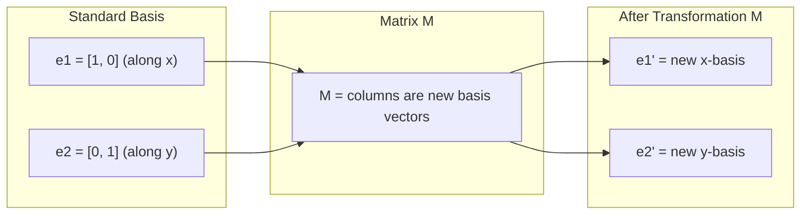
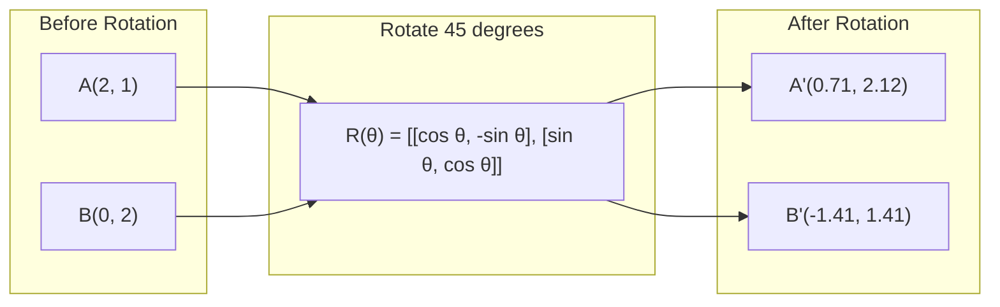
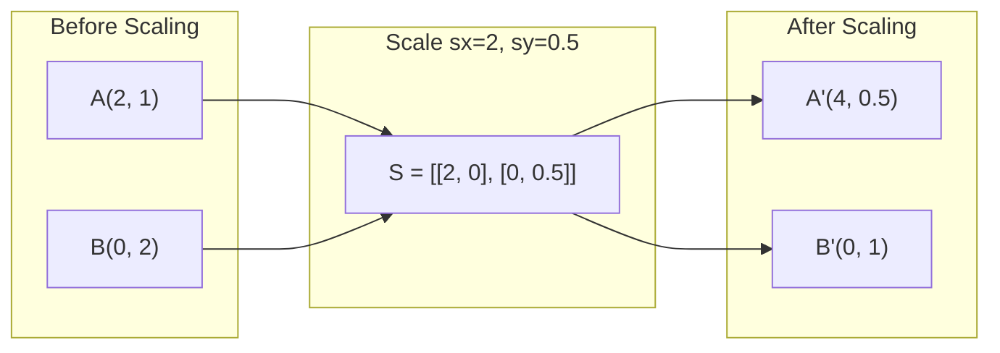
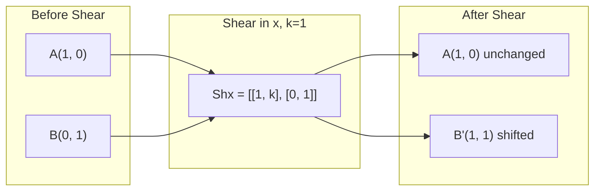
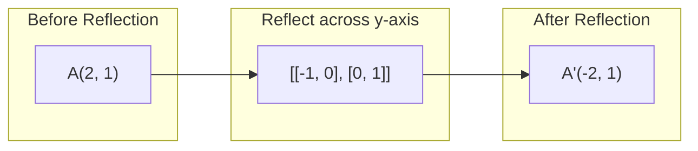
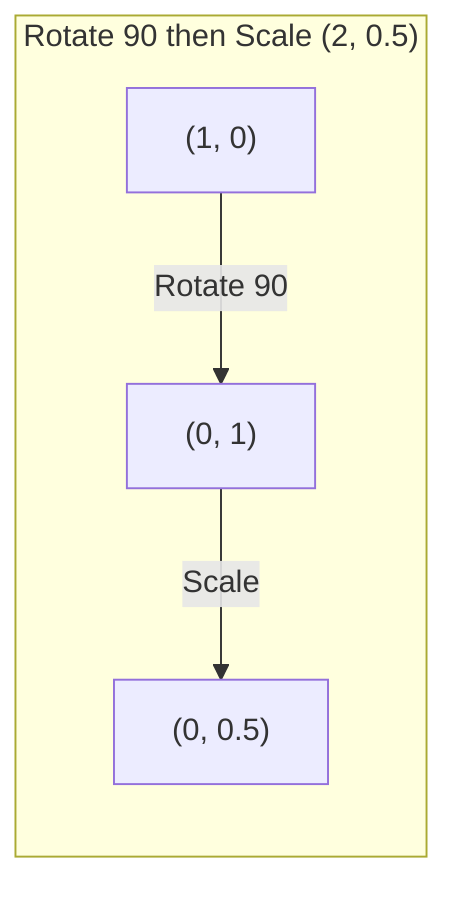
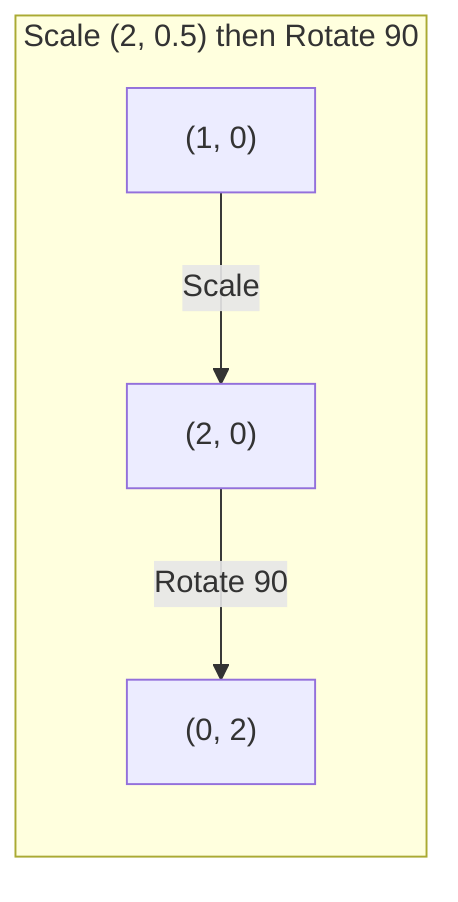

# 행렬 변환

> 행렬은 공간의 모양을 바꾸는 기계입니다. 모든 점에 무엇을 하는지 알면 전체 변환을 이해할 수 있습니다.

**Type:** Build
**Languages:** Python, Julia
**Prerequisites:** Phase 1, Lessons 01-02 (Linear Algebra Intuition, Vectors & Matrices Operations)
**Time:** ~75 minutes

## 학습 목표

- rotation, scaling, shearing, reflection 행렬을 구성하고 2D와 3D 점에 적용합니다.
- 행렬 곱셈으로 여러 변환을 합성하고 순서가 중요하다는 점을 검증합니다.
- characteristic equation으로 2x2 행렬의 eigenvalues와 eigenvectors를 계산합니다.
- eigenvalues가 PCA 방향, RNN 안정성, spectral clustering 동작을 결정하는 이유를 설명합니다.

## 문제

PCA를 읽다 보면 "공분산 행렬의 eigenvectors를 찾으라"는 말을 봅니다. 모델 안정성을 읽다 보면 "모든 eigenvalues의 크기가 1보다 작은지 확인하라"는 말을 봅니다. 데이터 증강을 읽다 보면 "무작위 rotation을 적용하라"는 말을 봅니다. 행렬이 공간에 기하학적으로 무엇을 하는지 이해하기 전까지는 이 말들이 이해되지 않습니다.

행렬은 단순한 숫자 격자가 아닙니다. 공간을 다루는 기계입니다. rotation matrix는 점을 회전시킵니다. scaling matrix는 점을 늘립니다. shearing matrix는 점을 기울입니다. 신경망이 데이터에 적용하는 모든 변환은 이런 연산 중 하나이거나 그 합성입니다. 이 레슨은 그 연산들을 구체적으로 만듭니다.

## 개념

### 행렬로 보는 변환

2D의 모든 선형 변환은 2x2 행렬로 쓸 수 있습니다. 행렬은 기저 벡터 [1, 0]과 [0, 1]이 정확히 어디로 가는지 알려 줍니다. 나머지는 모두 거기서 따라옵니다.



### 회전

각도 theta만큼의 2D 회전은 거리와 각도를 그대로 유지합니다. 모든 점을 원호를 따라 이동시킵니다.



3D에서는 어떤 축을 중심으로 회전합니다. 각 축에는 고유한 회전 행렬이 있습니다:

```text
Rz(theta) = | cos  -sin  0 |     Rotate around z-axis
            | sin   cos  0 |     (x-y plane spins, z stays)
            |  0     0   1 |

Rx(theta) = | 1   0     0    |   Rotate around x-axis
            | 0  cos  -sin   |   (y-z plane spins, x stays)
            | 0  sin   cos   |

Ry(theta) = |  cos  0  sin |     Rotate around y-axis
            |   0   1   0  |     (x-z plane spins, y stays)
            | -sin  0  cos |
```

### 스케일링

스케일링은 각 축 방향으로 독립적으로 늘리거나 압축합니다.



### 전단

전단은 한 축을 고정한 채 다른 축을 기울입니다. 직사각형을 평행사변형으로 바꿉니다.



전단 행렬:
- `Shx = [[1, k], [0, 1]]`는 x를 k * y만큼 이동합니다.
- `Shy = [[1, 0], [k, 1]]`는 y를 k * x만큼 이동합니다.

### 반사

반사는 점을 축이나 선을 기준으로 거울처럼 뒤집습니다.



반사 행렬:
- y-axis 기준 반사: `[[-1, 0], [0, 1]]`
- x-axis 기준 반사: `[[1, 0], [0, -1]]`

### 합성: 변환 연결하기

변환 A를 적용한 뒤 B를 적용하는 것은 행렬을 곱하는 것과 같습니다: `result = B @ A @ point`. 순서가 중요합니다. 회전 후 스케일링은 스케일링 후 회전과 다른 결과를 냅니다.



합성 결과: `S @ R = [[0, -2], [0.5, 0]]`



합성 결과: `R @ S = [[0, -0.5], [2, 0]]`

결과가 다릅니다. 행렬 곱셈은 교환법칙을 만족하지 않습니다.

### 고유값과 고유벡터

대부분의 벡터는 행렬이 곱해지면 방향이 바뀝니다. 고유벡터는 특별합니다. 행렬이 방향은 회전시키지 않고 스케일만 바꿉니다. 그 스케일 배율이 고유값입니다.

```text
A @ v = lambda * v

v is the eigenvector (direction that survives)
lambda is the eigenvalue (how much it stretches)

Example: A = | 2  1 |
             | 1  2 |

Eigenvector [1, 1] with eigenvalue 3:
  A @ [1,1] = [3, 3] = 3 * [1, 1]     (same direction, scaled by 3)

Eigenvector [1, -1] with eigenvalue 1:
  A @ [1,-1] = [1, -1] = 1 * [1, -1]  (same direction, unchanged)
```

이 행렬은 [1, 1] 방향으로 공간을 3배 늘리고 [1, -1] 방향은 그대로 둡니다. 다른 모든 방향은 이 둘의 혼합입니다.

### 고유분해

행렬이 n개의 선형 독립 eigenvectors를 가지면 다음처럼 분해할 수 있습니다:

```text
A = V @ D @ V^(-1)

V = matrix whose columns are eigenvectors
D = diagonal matrix of eigenvalues
V^(-1) = inverse of V

This says: rotate into eigenvector coordinates, scale along each axis, rotate back.
```

### 고유값이 중요한 이유

**PCA.** 공분산 행렬의 eigenvectors가 principal components입니다. eigenvalues는 각 성분이 얼마나 많은 분산을 포착하는지 알려 줍니다. eigenvalue 기준으로 정렬해 상위 k개를 유지하면 차원 축소가 됩니다.

**안정성.** recurrent networks와 dynamical systems에서 크기가 1보다 큰 eigenvalues는 출력 폭주를 일으킵니다. 크기가 1보다 작으면 사라지게 만듭니다. 이것이 vanishing/exploding gradient 문제를 한 문장으로 말한 것입니다.

**Spectral methods.** Graph neural networks는 adjacency matrix의 eigenvalues를 사용합니다. Spectral clustering은 Laplacian의 eigenvalues를 사용합니다. eigenvectors는 그래프 구조를 드러냅니다.

### 부피 스케일링 계수로서의 행렬식

변환 행렬의 행렬식은 면적(2D) 또는 부피(3D)를 얼마나 스케일하는지 알려 줍니다.

```text
det = 1:   area preserved (rotation)
det = 2:   area doubled
det = 0:   space crushed to lower dimension (singular)
det = -1:  area preserved but orientation flipped (reflection)

| det(Rotation) | = 1        (always)
| det(Scale sx, sy) | = sx * sy
| det(Shear) | = 1           (area preserved)
| det(Reflection) | = -1     (orientation flipped)
```

```figure
matrix-transform
```

## 직접 만들기

### Step 1: 변환 행렬을 처음부터 만들기 (Python)

```python
import math

def rotation_2d(theta):
    c, s = math.cos(theta), math.sin(theta)
    return [[c, -s], [s, c]]

def scaling_2d(sx, sy):
    return [[sx, 0], [0, sy]]

def shearing_2d(kx, ky):
    return [[1, kx], [ky, 1]]

def reflection_x():
    return [[1, 0], [0, -1]]

def reflection_y():
    return [[-1, 0], [0, 1]]

def mat_vec_mul(matrix, vector):
    return [
        sum(matrix[i][j] * vector[j] for j in range(len(vector)))
        for i in range(len(matrix))
    ]

def mat_mul(a, b):
    rows_a, cols_b = len(a), len(b[0])
    cols_a = len(a[0])
    return [
        [sum(a[i][k] * b[k][j] for k in range(cols_a)) for j in range(cols_b)]
        for i in range(rows_a)
    ]

point = [1.0, 0.0]
angle = math.pi / 4

rotated = mat_vec_mul(rotation_2d(angle), point)
print(f"Rotate (1,0) by 45 deg: ({rotated[0]:.4f}, {rotated[1]:.4f})")

scaled = mat_vec_mul(scaling_2d(2, 3), [1.0, 1.0])
print(f"Scale (1,1) by (2,3): ({scaled[0]:.1f}, {scaled[1]:.1f})")

sheared = mat_vec_mul(shearing_2d(1, 0), [1.0, 1.0])
print(f"Shear (1,1) kx=1: ({sheared[0]:.1f}, {sheared[1]:.1f})")

reflected = mat_vec_mul(reflection_y(), [2.0, 1.0])
print(f"Reflect (2,1) across y: ({reflected[0]:.1f}, {reflected[1]:.1f})")
```

### Step 2: 변환의 합성

```python
R = rotation_2d(math.pi / 2)
S = scaling_2d(2, 0.5)

rotate_then_scale = mat_mul(S, R)
scale_then_rotate = mat_mul(R, S)

point = [1.0, 0.0]
result1 = mat_vec_mul(rotate_then_scale, point)
result2 = mat_vec_mul(scale_then_rotate, point)

print(f"Rotate 90 then scale: ({result1[0]:.2f}, {result1[1]:.2f})")
print(f"Scale then rotate 90: ({result2[0]:.2f}, {result2[1]:.2f})")
print(f"Same? {result1 == result2}")
```

### Step 3: 고유값을 처음부터 계산하기 (2x2)

2x2 행렬 `[[a, b], [c, d]]`의 eigenvalues는 characteristic equation `lambda^2 - (a+d)*lambda + (ad - bc) = 0`의 해입니다.

```python
def eigenvalues_2x2(matrix):
    a, b = matrix[0]
    c, d = matrix[1]
    trace = a + d
    det = a * d - b * c
    discriminant = trace ** 2 - 4 * det
    if discriminant < 0:
        real = trace / 2
        imag = (-discriminant) ** 0.5 / 2
        return (complex(real, imag), complex(real, -imag))
    sqrt_disc = discriminant ** 0.5
    return ((trace + sqrt_disc) / 2, (trace - sqrt_disc) / 2)

def eigenvector_2x2(matrix, eigenvalue):
    a, b = matrix[0]
    c, d = matrix[1]
    if abs(b) > 1e-10:
        v = [b, eigenvalue - a]
    elif abs(c) > 1e-10:
        v = [eigenvalue - d, c]
    else:
        if abs(a - eigenvalue) < 1e-10:
            v = [1, 0]
        else:
            v = [0, 1]
    mag = (v[0] ** 2 + v[1] ** 2) ** 0.5
    return [v[0] / mag, v[1] / mag]

A = [[2, 1], [1, 2]]
vals = eigenvalues_2x2(A)
print(f"Matrix: {A}")
print(f"Eigenvalues: {vals[0]:.4f}, {vals[1]:.4f}")

for val in vals:
    vec = eigenvector_2x2(A, val)
    result = mat_vec_mul(A, vec)
    scaled = [val * vec[0], val * vec[1]]
    print(f"  lambda={val:.1f}, v={[round(x,4) for x in vec]}")
    print(f"    A@v = {[round(x,4) for x in result]}")
    print(f"    l*v = {[round(x,4) for x in scaled]}")
```

### Step 4: 부피 스케일링 계수로서의 행렬식

```python
def det_2x2(matrix):
    return matrix[0][0] * matrix[1][1] - matrix[0][1] * matrix[1][0]

print(f"det(rotation 45) = {det_2x2(rotation_2d(math.pi/4)):.4f}")
print(f"det(scale 2,3)   = {det_2x2(scaling_2d(2, 3)):.1f}")
print(f"det(shear kx=1)  = {det_2x2(shearing_2d(1, 0)):.1f}")
print(f"det(reflect y)   = {det_2x2(reflection_y()):.1f}")

singular = [[1, 2], [2, 4]]
print(f"det(singular)     = {det_2x2(singular):.1f}")
print("Singular: columns are proportional, space collapses to a line.")
```

## 활용하기

NumPy는 이 모든 것을 최적화된 루틴으로 처리합니다.

```python
import numpy as np

theta = np.pi / 4
R = np.array([[np.cos(theta), -np.sin(theta)],
              [np.sin(theta),  np.cos(theta)]])

point = np.array([1.0, 0.0])
print(f"Rotate (1,0) by 45 deg: {R @ point}")

S = np.diag([2.0, 3.0])
composed = S @ R
print(f"Scale(2,3) after Rotate(45): {composed @ point}")

A = np.array([[2, 1], [1, 2]], dtype=float)
eigenvalues, eigenvectors = np.linalg.eig(A)
print(f"\nEigenvalues: {eigenvalues}")
print(f"Eigenvectors (columns):\n{eigenvectors}")

for i in range(len(eigenvalues)):
    v = eigenvectors[:, i]
    lam = eigenvalues[i]
    print(f"  A @ v{i} = {A @ v}, lambda * v{i} = {lam * v}")

print(f"\ndet(R) = {np.linalg.det(R):.4f}")
print(f"det(S) = {np.linalg.det(S):.1f}")

B = np.array([[3, 1], [0, 2]], dtype=float)
vals, vecs = np.linalg.eig(B)
D = np.diag(vals)
V = vecs
reconstructed = V @ D @ np.linalg.inv(V)
print(f"\nEigendecomposition A = V @ D @ V^-1:")
print(f"Original:\n{B}")
print(f"Reconstructed:\n{reconstructed}")
```

### NumPy로 3D 회전 다루기

```python
def rotation_3d_z(theta):
    c, s = np.cos(theta), np.sin(theta)
    return np.array([[c, -s, 0], [s, c, 0], [0, 0, 1]])

def rotation_3d_x(theta):
    c, s = np.cos(theta), np.sin(theta)
    return np.array([[1, 0, 0], [0, c, -s], [0, s, c]])

point_3d = np.array([1.0, 0.0, 0.0])
rotated_z = rotation_3d_z(np.pi / 2) @ point_3d
rotated_x = rotation_3d_x(np.pi / 2) @ point_3d

print(f"\n3D point: {point_3d}")
print(f"Rotate 90 around z: {np.round(rotated_z, 4)}")
print(f"Rotate 90 around x: {np.round(rotated_x, 4)}")
```

## 결과물

이 레슨은 PCA(Phase 2)와 신경망 가중치 분석을 위한 기하학적 기반을 만듭니다. 여기서 만든 eigenvalue/eigenvector 코드는 production ML 시스템의 차원 축소, spectral clustering, 안정성 분석을 가능하게 하는 것과 같은 알고리즘입니다.

## 연습 문제

1. 단위 정사각형(꼭짓점 [0,0], [1,0], [1,1], [0,1])에 rotation, scaling, shearing을 적용하세요. 각각에 대해 변환된 꼭짓점을 출력하세요. rotation이 꼭짓점 사이의 거리를 보존하는지 검증하세요.

2. characteristic equation을 사용해 행렬 [[4, 2], [1, 3]]의 eigenvalues를 손으로 구하세요. 그런 다음 직접 만든 함수와 NumPy로 검증하세요.

3. 세 변환(30도 회전, [1.5, 0.8] 스케일링, kx=0.3 전단)을 합성하고 원 위에 배치된 8개 점에 적용하세요. 변환 전후 좌표를 출력하세요. 합성 행렬의 행렬식을 계산하고 개별 행렬식의 곱과 같은지 검증하세요.

## 핵심 용어

| 용어 | 흔히 하는 말 | 실제 의미 |
|------|----------------|----------------------|
| Rotation matrix | "회전시키는 것" | 거리와 각도를 보존하면서 점을 원호를 따라 이동시키는 직교 행렬입니다. 행렬식은 항상 1입니다. |
| Scaling matrix | "크게 만드는 것" | 각 축 방향으로 독립적으로 늘리거나 압축하는 대각 행렬입니다. 행렬식은 scale factors의 곱입니다. |
| Shearing matrix | "기울이는 것" | 한 좌표를 다른 좌표에 비례해 이동시켜 직사각형을 평행사변형으로 만드는 행렬입니다. 행렬식은 1입니다. |
| Reflection | "거울처럼 뒤집기" | 공간을 축이나 평면을 기준으로 뒤집는 행렬입니다. 행렬식은 -1입니다. |
| Composition | "두 가지 하기" | 변환 행렬을 곱해 연산을 연결하는 것입니다. 순서가 중요합니다. B @ A는 A를 먼저 적용한 뒤 B를 적용한다는 뜻입니다. |
| Eigenvector | "특별한 방향" | 행렬이 회전시키지 않고 스케일만 바꾸는 방향입니다. 변환의 지문입니다. |
| Eigenvalue | "얼마나 늘리는가" | 행렬이 eigenvector를 스케일하는 스칼라 계수입니다. 음수(뒤집기)나 복소수(회전)일 수 있습니다. |
| Eigendecomposition | "행렬을 쪼개기" | 행렬을 V @ D @ V^(-1)로 써서 근본적인 스케일 방향과 크기로 분리하는 것입니다. |
| Determinant | "행렬에서 나온 단일 숫자" | 변환이 면적(2D) 또는 부피(3D)를 스케일하는 계수입니다. 0이면 변환을 되돌릴 수 없습니다. |
| Characteristic equation | "고유값이 나오는 곳" | det(A - lambda * I) = 0. 근이 eigenvalues인 다항식입니다. |

## 더 읽을거리

- [3Blue1Brown: Linear Transformations](https://www.3blue1brown.com/lessons/linear-transformations) -- 행렬이 공간을 어떻게 바꾸는지에 대한 시각적 직관
- [3Blue1Brown: Eigenvectors and Eigenvalues](https://www.3blue1brown.com/lessons/eigenvalues) -- eigenvectors가 기하학적으로 무엇을 뜻하는지에 대한 최고의 시각적 설명
- [MIT 18.06 Lecture 21: Eigenvalues and Eigenvectors](https://ocw.mit.edu/courses/18-06-linear-algebra-spring-2010/) -- Gilbert Strang의 고전적 설명
