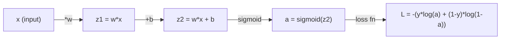
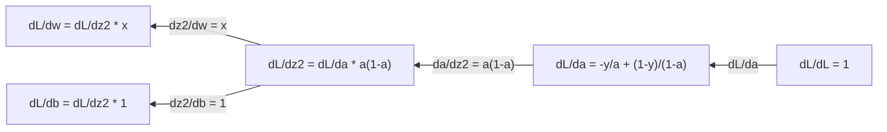
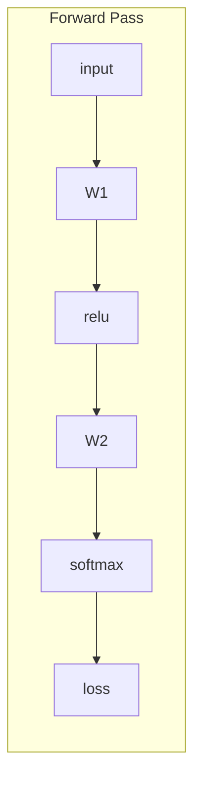
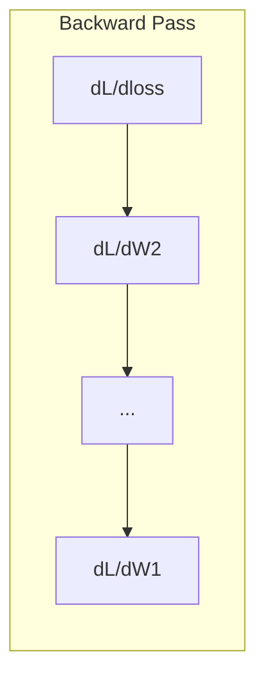

# 머신러닝을 위한 미적분

> 도함수는 어느 방향이 내리막인지 알려 줍니다. 신경망이 학습하는 데 필요한 것은 그것뿐입니다.

**Type:** Learn
**Languages:** Python
**Prerequisites:** Phase 1, Lessons 01-03
**Time:** ~60 minutes

## 학습 목표

- 흔한 ML 함수(x^2, sigmoid, cross-entropy)의 수치적 도함수와 해석적 도함수를 계산합니다.
- 1D와 2D에서 손실 함수를 최소화하는 gradient descent를 처음부터 구현합니다.
- 선형 회귀 모델의 그래디언트를 유도하고 수동 가중치 업데이트로 학습합니다.
- Hessian 행렬, Taylor series 근사, 그리고 이들이 최적화 방법과 어떻게 연결되는지 설명합니다.

## 문제

수백만 개의 가중치를 가진 신경망이 있습니다. 각 가중치는 하나의 조절 손잡이입니다. 모델이 조금 덜 틀리게 만들려면 손잡이 하나하나를 어느 방향으로 돌려야 하는지 알아내야 합니다. 미적분이 그 방향을 줍니다.

미적분이 없다면 신경망 학습은 무작위 변화를 시도하고 잘되기를 바라는 일이 됩니다. 도함수가 있으면 각 가중치가 오류에 어떤 영향을 주는지 정확히 알 수 있습니다. 매번 모든 손잡이를 올바른 방향으로 돌리게 됩니다.

## 개념

### 도함수란 무엇인가?

도함수는 변화율을 측정합니다. 함수 y = f(x)에 대해 도함수 f'(x)는 x를 아주 조금 움직이면 y가 얼마나 변하는지 알려 줍니다.

기하학적으로 도함수는 한 점에서의 접선 기울기입니다.

**f(x) = x^2:**

| x | f(x) | f'(x) (기울기) |
|---|------|---------------|
| 0 | 0    | 0 (평평함, 바닥) |
| 1 | 1    | 2 |
| 2 | 4    | 4 (이 점에서 접선 기울기) |
| 3 | 9    | 6 |

x=2에서 기울기는 4입니다. x를 오른쪽으로 아주 조금 움직이면 y는 그 양의 약 4배만큼 증가합니다. x=0에서 기울기는 0입니다. 그릇의 바닥에 있는 셈입니다.

형식적 정의:

```text
f'(x) = lim   f(x + h) - f(x)
        h->0  -----------------
                     h
```

코드에서는 극한을 직접 계산하지 않고 매우 작은 h를 사용합니다. 이것이 수치 도함수입니다.

### 편도함수: 한 번에 변수 하나

실제 함수에는 입력이 많습니다. 신경망 loss는 수천 개의 가중치에 의존합니다. 편도함수는 하나를 제외한 모든 변수를 상수로 고정한 뒤, 그 하나에 대해 미분합니다.

```text
f(x, y) = x^2 + 3xy + y^2

df/dx = 2x + 3y     (treat y as a constant)
df/dy = 3x + 2y     (treat x as a constant)
```

각 편도함수는 "이 가중치 하나만 조금 움직이면 loss가 어떻게 변하는가?"에 답합니다.

### 그래디언트: 모든 편도함수의 벡터

그래디언트는 모든 편도함수를 하나의 벡터로 모읍니다. 함수 f(x, y, z)에 대해 그래디언트는 다음과 같습니다:

```text
grad f = [ df/dx, df/dy, df/dz ]
```

그래디언트는 가장 가파른 상승 방향을 가리킵니다. 함수를 최소화하려면 반대 방향으로 가면 됩니다.

**f(x,y) = x^2 + y^2의 contour plot:**

이 함수는 등고선이 동심원인 그릇 모양을 이룹니다. 최솟값은 (0, 0)에 있습니다.

| 점 | grad f | -grad f (하강 방향) |
|-------|--------|----------------------------|
| (1, 1) | [2, 2] (최솟값에서 멀어지는 오르막 방향) | [-2, -2] (최솟값을 향한 내리막 방향) |
| (0, 0) | [0, 0] (평평함, 최솟값) | [0, 0] |

이것이 그림으로 본 gradient descent입니다. 그래디언트를 계산하고, 부호를 바꾸고, 한 걸음 이동합니다.

### 최적화와의 연결

신경망 학습은 최적화입니다. 모델이 얼마나 틀렸는지 측정하는 loss function L(w1, w2, ..., wn)이 있습니다. 이를 최소화하고 싶습니다.

```text
Gradient descent update rule:

  w_new = w_old - learning_rate * dL/dw

For every weight:
  1. Compute the partial derivative of loss with respect to that weight
  2. Subtract a small multiple of it from the weight
  3. Repeat
```

learning rate는 step size를 제어합니다. 너무 크면 지나치고, 너무 작으면 기어가듯 느립니다.

**Loss landscape (1D 단면):**

loss function L(w)는 가중치 w가 변함에 따라 봉우리와 골짜기가 있는 곡선을 이룹니다.

| 특징 | 설명 |
|---------|-------------|
| Global minimum | 전체 곡선에서 가장 낮은 점, 즉 최선의 해 |
| Local minimum | 이웃보다 낮지만 전체에서 가장 낮지는 않은 골짜기 |
| Slope | Gradient descent는 어떤 시작점에서든 기울기를 따라 내리막으로 이동합니다 |

gradient descent는 기울기를 따라 내리막으로 갑니다. local minima에 갇힐 수 있지만, 수백만 가중치가 있는 고차원 공간에서는 실무적으로 드문 문제입니다.

### 수치 도함수와 해석 도함수

도함수를 계산하는 방법은 두 가지입니다.

해석적 방법: 미적분 규칙을 손으로 적용합니다. f(x) = x^2의 도함수는 f'(x) = 2x입니다. 정확하고 빠릅니다.

수치적 방법: 정의를 사용해 근사합니다. 아주 작은 h에 대해 f(x+h)와 f(x-h)를 계산한 뒤 차이를 사용합니다.

```text
Numerical (central difference):

f'(x) ~= f(x + h) - f(x - h)
          -----------------------
                  2h

h = 0.0001 works well in practice
```

수치 도함수는 느리지만 어떤 함수에도 작동합니다. 해석 도함수는 빠르지만 공식을 유도해야 합니다. 신경망 프레임워크는 세 번째 접근법인 automatic differentiation을 사용합니다. 이는 정확한 도함수를 기계적으로 계산합니다. Phase 3에서 이를 보게 됩니다.

### 단순 함수의 도함수를 손으로 구하기

ML에서 반복해서 보게 될 도함수들입니다.

```text
Function        Derivative       Used in
--------        ----------       -------
f(x) = x^2     f'(x) = 2x      Loss functions (MSE)
f(x) = wx + b  f'(w) = x        Linear layer (gradient w.r.t. weight)
                f'(b) = 1        Linear layer (gradient w.r.t. bias)
                f'(x) = w        Linear layer (gradient w.r.t. input)
f(x) = e^x     f'(x) = e^x     Softmax, attention
f(x) = ln(x)   f'(x) = 1/x     Cross-entropy loss
f(x) = 1/(1+e^-x)  f'(x) = f(x)(1-f(x))   Sigmoid activation
```

f(x) = x^2에 대해:

```text
f(x) = x^2    f'(x) = 2x

  x    f(x)   f'(x)   meaning
  -2    4      -4      slope tilts left (decreasing)
  -1    1      -2      slope tilts left (decreasing)
   0    0       0      flat (minimum!)
   1    1       2      slope tilts right (increasing)
   2    4       4      slope tilts right (increasing)
```

f(w) = wx + b이고 x=3, b=1일 때:

```text
f(w) = 3w + 1    f'(w) = 3

The derivative with respect to w is just x.
If x is big, a small change in w causes a big change in output.
```

### 연쇄 법칙

함수가 합성되어 있을 때 연쇄 법칙은 어떻게 미분할지 알려 줍니다.

```text
If y = f(g(x)), then dy/dx = f'(g(x)) * g'(x)

Example: y = (3x + 1)^2
  outer: f(u) = u^2       f'(u) = 2u
  inner: g(x) = 3x + 1    g'(x) = 3
  dy/dx = 2(3x + 1) * 3 = 6(3x + 1)
```

신경망은 함수의 체인입니다: input -> linear -> activation -> linear -> activation -> loss. Backpropagation은 출력에서 입력으로 연쇄 법칙을 반복 적용하는 것입니다. 이것이 전체 알고리즘입니다.

### Hessian 행렬

그래디언트는 기울기를 알려 줍니다. Hessian은 곡률을 알려 줍니다.

Hessian은 2차 편도함수들의 행렬입니다. 함수 f(x1, x2, ..., xn)에 대해 Hessian의 (i, j) 원소는 다음과 같습니다:

```text
H[i][j] = d^2f / (dx_i * dx_j)
```

2변수 함수 f(x, y)에 대해:

```text
H = | d^2f/dx^2    d^2f/dxdy |
    | d^2f/dydx    d^2f/dy^2 |
```

**임계점(gradient = 0)에서 Hessian이 알려 주는 것:**

| Hessian 성질 | 의미 | 예시 표면 |
|-----------------|---------|-----------------|
| Positive definite (all eigenvalues > 0) | Local minimum | 위로 열린 그릇 |
| Negative definite (all eigenvalues < 0) | Local maximum | 아래로 열린 그릇 |
| Indefinite (mixed eigenvalues) | Saddle point | 말안장 모양 |

**예:** f(x, y) = x^2 - y^2 (saddle function)

```text
df/dx = 2x       df/dy = -2y
d^2f/dx^2 = 2    d^2f/dy^2 = -2    d^2f/dxdy = 0

H = | 2   0 |
    | 0  -2 |

Eigenvalues: 2 and -2 (one positive, one negative)
--> Saddle point at (0, 0)
```

f(x, y) = x^2 + y^2(그릇)과 비교해 봅시다:

```text
H = | 2  0 |
    | 0  2 |

Eigenvalues: 2 and 2 (both positive)
--> Local minimum at (0, 0)
```

**ML에서 Hessian이 중요한 이유:**

Newton's method는 Hessian을 사용해 gradient descent보다 더 나은 최적화 step을 취합니다. 단순히 기울기만 따르는 대신 곡률을 고려합니다:

```text
Newton's update:    w_new = w_old - H^(-1) * gradient
Gradient descent:   w_new = w_old - lr * gradient
```

Newton's method는 Hessian이 그래디언트를 "재스케일"하기 때문에 더 빠르게 수렴합니다. 가파른 방향은 더 작은 step을, 평평한 방향은 더 큰 step을 얻습니다.

문제는 N개 파라미터를 가진 신경망에서 Hessian이 N x N이라는 점입니다. 파라미터가 100만 개인 모델은 1조 원소 행렬이 필요합니다. 그래서 근사를 사용합니다.

| 방법 | 사용하는 것 | 비용 | 수렴 |
|--------|-------------|------|-------------|
| Gradient descent | 1차 도함수만 | step당 O(N) | 느림(선형) |
| Newton's method | 전체 Hessian | step당 O(N^3) | 빠름(2차) |
| L-BFGS | gradient history에서 근사한 Hessian | step당 O(N) | 중간(superlinear) |
| Adam | 파라미터별 adaptive rates(diagonal Hessian approx) | step당 O(N) | 중간 |
| Natural gradient | Fisher information matrix(statistical Hessian) | step당 O(N^2) | 빠름 |

실무에서 Adam은 딥러닝의 기본 optimizer입니다. 파라미터별 그래디언트의 running mean과 variance를 추적해 2차 정보를 저렴하게 근사합니다.

### Taylor Series 근사

어떤 매끄러운 함수든 한 점 근처에서는 다항식으로 근사할 수 있습니다:

```text
f(x + h) = f(x) + f'(x)*h + (1/2)*f''(x)*h^2 + (1/6)*f'''(x)*h^3 + ...
```

포함하는 항이 많을수록 근사가 좋아집니다. 단, x 근처에서만 그렇습니다.

**ML에서 Taylor series가 중요한 이유:**

- **First-order Taylor = gradient descent.** f(x + h) ~ f(x) + f'(x)*h를 사용하면 선형 근사를 만드는 것입니다. Gradient descent는 이 선형 모델을 최소화해 h = -lr * f'(x)를 선택합니다.

- **Second-order Taylor = Newton's method.** f(x + h) ~ f(x) + f'(x)*h + (1/2)*f''(x)*h^2를 사용하면 2차 모델을 얻습니다. 이를 최소화하면 h = -f'(x)/f''(x), 즉 Newton's step을 얻습니다.

- **Loss function design.** MSE와 cross-entropy는 매끄럽기 때문에 Taylor expansions가 잘 동작합니다. 이는 우연이 아닙니다. 매끄러운 losses는 최적화를 예측 가능하게 만듭니다.

```text
Approximation order    What it captures    Optimization method
-------------------    -----------------   -------------------
0th order (constant)   Just the value      Random search
1st order (linear)     Slope               Gradient descent
2nd order (quadratic)  Curvature           Newton's method
Higher orders          Finer structure     Rarely used in ML
```

핵심 통찰: 모든 gradient 기반 최적화는 결국 loss function을 국소적으로 근사하고 그 근사의 최솟값으로 이동하는 일입니다.

### ML에서의 적분

도함수는 변화율을 알려 줍니다. 적분은 누적량, 즉 곡선 아래 면적을 계산합니다.

ML에서 적분을 손으로 계산하는 일은 드물지만, 개념은 어디에나 있습니다:

**확률.** 밀도 p(x)를 갖는 연속 확률변수에 대해:
```text
P(a < X < b) = integral from a to b of p(x) dx
```
a와 b 사이의 확률밀도 곡선 아래 면적이 그 범위에 들어갈 확률입니다.

**기댓값.** 확률로 가중한 평균 결과:
```text
E[f(X)] = integral of f(x) * p(x) dx
```
데이터 분포에 대한 expected loss는 적분입니다. 학습은 이에 대한 경험적 근사를 최소화합니다.

**KL divergence.** 두 분포가 얼마나 다른지 측정합니다:
```text
KL(p || q) = integral of p(x) * log(p(x) / q(x)) dx
```
VAEs, knowledge distillation, Bayesian inference에 사용됩니다.

**정규화 상수.** Bayesian inference에서:
```text
p(w | data) = p(data | w) * p(w) / integral of p(data | w) * p(w) dw
```
분모는 가능한 모든 파라미터 값에 대한 적분입니다. 보통 계산하기 어려워서 MCMC와 variational inference 같은 근사를 사용합니다.

| 적분 개념 | ML에서 나타나는 곳 |
|-----------------|----------------------|
| Area under curve | density functions에서의 확률 |
| Expected value | Loss functions, risk minimization |
| KL divergence | VAEs, policy optimization, distillation |
| Normalization | Bayesian posteriors, softmax denominator |
| Marginal likelihood | Model comparison, evidence lower bound (ELBO) |

### Computation Graph에서의 다변수 연쇄 법칙

연쇄 법칙은 일렬로 이어진 스칼라 함수에만 적용되는 것이 아닙니다. 신경망에서는 변수들이 갈라지고 다시 합쳐집니다. 간단한 forward pass에서 도함수가 흐르는 방식은 다음과 같습니다:



backward pass는 오른쪽에서 왼쪽으로 그래디언트를 계산합니다:



각 화살표는 local derivative를 곱합니다. 어떤 파라미터의 그래디언트는 loss에서 그 파라미터까지 가는 경로상의 모든 local derivatives의 곱입니다. 경로가 갈라지고 합쳐질 때는 기여분을 합합니다(다변수 연쇄 법칙).

backpropagation은 이것이 전부입니다. 출력에서 입력으로 computation graph를 따라 연쇄 법칙을 체계적으로 적용하는 것입니다.

### Jacobian 행렬

함수가 벡터를 벡터로 매핑하면(신경망 layer처럼) 그 도함수는 행렬입니다. Jacobian은 모든 출력의 모든 입력에 대한 편도함수를 담습니다.

f: R^n -> R^m에 대해 Jacobian J는 m x n 행렬입니다:

| | x1 | x2 | ... | xn |
|---|---|---|---|---|
| f1 | df1/dx1 | df1/dx2 | ... | df1/dxn |
| f2 | df2/dx1 | df2/dx2 | ... | df2/dxn |
| ... | ... | ... | ... | ... |
| fm | dfm/dx1 | dfm/dx2 | ... | dfm/dxn |

신경망에서 Jacobian을 손으로 계산하지는 않을 것입니다. PyTorch가 처리합니다. 하지만 그것이 존재한다는 사실을 알면 backpropagation의 shape를 이해하는 데 도움이 됩니다. 어떤 layer가 R^n을 R^m으로 매핑하면 Jacobian은 m x n입니다. 그래디언트는 이 행렬의 전치를 통해 뒤로 흐릅니다.

### 이것이 신경망에서 중요한 이유

신경망의 모든 가중치는 그래디언트를 받습니다. 그래디언트는 loss를 줄이기 위해 그 가중치를 어떻게 조정해야 하는지 알려 줍니다.





각 가중치 업데이트:
- `W1 = W1 - lr * dL/dW1`
- `W2 = W2 - lr * dL/dW2`

forward pass는 예측과 loss를 계산합니다. backward pass는 모든 가중치에 대한 loss의 그래디언트를 계산합니다. 그런 다음 모든 가중치가 내리막 방향으로 작은 step을 취합니다. 이를 수백만 step 반복합니다. 그것이 딥러닝입니다.

```figure
derivative-tangent
```

## 직접 만들기

### 단계 1: 수치 도함수를 처음부터 만들기

```python
def numerical_derivative(f, x, h=1e-7):
    return (f(x + h) - f(x - h)) / (2 * h)

def f(x):
    return x ** 2

for x in [-2, -1, 0, 1, 2]:
    numerical = numerical_derivative(f, x)
    analytical = 2 * x
    print(f"x={x:2d}  f'(x) numerical={numerical:.6f}  analytical={analytical:.1f}")
```

수치 도함수는 많은 소수 자리까지 해석 도함수와 일치합니다.

### 단계 2: 편도함수와 그래디언트

```python
def numerical_gradient(f, point, h=1e-7):
    gradient = []
    for i in range(len(point)):
        point_plus = list(point)
        point_minus = list(point)
        point_plus[i] += h
        point_minus[i] -= h
        partial = (f(point_plus) - f(point_minus)) / (2 * h)
        gradient.append(partial)
    return gradient

def f_multi(point):
    x, y = point
    return x**2 + 3*x*y + y**2

grad = numerical_gradient(f_multi, [1.0, 2.0])
print(f"Numerical gradient at (1,2): {[f'{g:.4f}' for g in grad]}")
print(f"Analytical gradient at (1,2): [2*1+3*2, 3*1+2*2] = [{2*1+3*2}, {3*1+2*2}]")
```

### 단계 3: f(x) = x^2의 최솟값을 찾는 gradient descent

```python
x = 5.0
lr = 0.1
for step in range(20):
    grad = 2 * x
    x = x - lr * grad
    print(f"step {step:2d}  x={x:8.4f}  f(x)={x**2:10.6f}")
```

x=5에서 시작해 각 step마다 x=0(최솟값)에 가까워집니다.

### 단계 4: 2D 함수에서의 gradient descent

```python
def f_2d(point):
    x, y = point
    return x**2 + y**2

point = [4.0, 3.0]
lr = 0.1
for step in range(30):
    grad = numerical_gradient(f_2d, point)
    point = [p - lr * g for p, g in zip(point, grad)]
    loss = f_2d(point)
    if step % 5 == 0 or step == 29:
        print(f"step {step:2d}  point=({point[0]:7.4f}, {point[1]:7.4f})  f={loss:.6f}")
```

### 단계 5: 수치 도함수와 해석 도함수 비교

```python
import math

test_functions = [
    ("x^2",      lambda x: x**2,          lambda x: 2*x),
    ("x^3",      lambda x: x**3,          lambda x: 3*x**2),
    ("sin(x)",   lambda x: math.sin(x),   lambda x: math.cos(x)),
    ("e^x",      lambda x: math.exp(x),   lambda x: math.exp(x)),
    ("1/x",      lambda x: 1/x,           lambda x: -1/x**2),
]

x = 2.0
print(f"{'Function':<12} {'Numerical':>12} {'Analytical':>12} {'Error':>12}")
print("-" * 50)
for name, f, df in test_functions:
    num = numerical_derivative(f, x)
    ana = df(x)
    err = abs(num - ana)
    print(f"{name:<12} {num:12.6f} {ana:12.6f} {err:12.2e}")
```

### 단계 6: Hessian을 수치적으로 계산하기

```python
def hessian_2d(f, x, y, h=1e-5):
    fxx = (f(x + h, y) - 2 * f(x, y) + f(x - h, y)) / (h ** 2)
    fyy = (f(x, y + h) - 2 * f(x, y) + f(x, y - h)) / (h ** 2)
    fxy = (f(x + h, y + h) - f(x + h, y - h) - f(x - h, y + h) + f(x - h, y - h)) / (4 * h ** 2)
    return [[fxx, fxy], [fxy, fyy]]

def saddle(x, y):
    return x ** 2 - y ** 2

def bowl(x, y):
    return x ** 2 + y ** 2

H_saddle = hessian_2d(saddle, 0.0, 0.0)
H_bowl = hessian_2d(bowl, 0.0, 0.0)
print(f"Saddle Hessian: {H_saddle}")  # [[2, 0], [0, -2]] -- mixed signs
print(f"Bowl Hessian:   {H_bowl}")    # [[2, 0], [0, 2]]  -- both positive
```

saddle function의 Hessian은 eigenvalues 2와 -2를 가집니다(부호가 섞여 있어 saddle point임을 확인). bowl은 eigenvalues 2와 2를 가집니다(둘 다 양수라 최솟값임을 확인).

### 단계 7: Taylor approximation 실제 적용

```python
import math

def taylor_approx(f, f_prime, f_double_prime, x0, h, order=2):
    result = f(x0)
    if order >= 1:
        result += f_prime(x0) * h
    if order >= 2:
        result += 0.5 * f_double_prime(x0) * h ** 2
    return result

x0 = 0.0
for h in [0.1, 0.5, 1.0, 2.0]:
    true_val = math.sin(h)
    t1 = taylor_approx(math.sin, math.cos, lambda x: -math.sin(x), x0, h, order=1)
    t2 = taylor_approx(math.sin, math.cos, lambda x: -math.sin(x), x0, h, order=2)
    print(f"h={h:.1f}  sin(h)={true_val:.4f}  order1={t1:.4f}  order2={t2:.4f}")
```

x0=0 근처에서 sin(x) ~ x입니다(first-order Taylor). h가 작을 때 근사는 훌륭하지만 h가 크면 무너집니다. 그래서 gradient descent는 작은 learning rates에서 가장 잘 작동합니다. 각 step은 선형 근사가 정확하다고 가정하기 때문입니다.

### 단계 8: 이것이 신경망에서 중요한 이유

```python
import random

random.seed(42)

w = random.gauss(0, 1)
b = random.gauss(0, 1)
lr = 0.01

xs = [1.0, 2.0, 3.0, 4.0, 5.0]
ys = [3.0, 5.0, 7.0, 9.0, 11.0]

for epoch in range(200):
    total_loss = 0
    dw = 0
    db = 0
    for x, y in zip(xs, ys):
        pred = w * x + b
        error = pred - y
        total_loss += error ** 2
        dw += 2 * error * x
        db += 2 * error
    dw /= len(xs)
    db /= len(xs)
    total_loss /= len(xs)
    w -= lr * dw
    b -= lr * db
    if epoch % 40 == 0 or epoch == 199:
        print(f"epoch {epoch:3d}  w={w:.4f}  b={b:.4f}  loss={total_loss:.6f}")

print(f"\nLearned: y = {w:.2f}x + {b:.2f}")
print(f"Actual:  y = 2x + 1")
```

모든 gradient 기반 학습 루프는 이 패턴을 따릅니다. 예측하고, loss를 계산하고, gradients를 계산하고, weights를 업데이트합니다.

## 활용하기

NumPy를 사용하면 같은 연산이 더 빠르고 간결해집니다:

```python
import numpy as np

x = np.array([1, 2, 3, 4, 5], dtype=float)
y = np.array([3, 5, 7, 9, 11], dtype=float)

w, b = np.random.randn(), np.random.randn()
lr = 0.01

for epoch in range(200):
    pred = w * x + b
    error = pred - y
    loss = np.mean(error ** 2)
    dw = np.mean(2 * error * x)
    db = np.mean(2 * error)
    w -= lr * dw
    b -= lr * db

print(f"Learned: y = {w:.2f}x + {b:.2f}")
```

방금 gradient descent를 처음부터 만들었습니다. PyTorch는 그래디언트 계산을 자동화하지만, 업데이트 루프는 동일합니다.

## 연습 문제

1. `numerical_derivative`를 두 번 호출해 `numerical_second_derivative(f, x)`를 구현하세요. x=2에서 x^3의 2차 도함수가 12인지 검증하세요.
2. gradient descent를 사용해 f(x, y) = (x - 3)^2 + (y + 1)^2의 최솟값을 찾으세요. (0, 0)에서 시작하세요. 답은 (3, -1)로 수렴해야 합니다.
3. gradient descent 루프에 momentum을 추가하세요. 과거 gradients를 누적하는 velocity vector를 유지합니다. f(x) = x^4 - 3x^2에서 momentum이 있을 때와 없을 때의 수렴 속도를 비교하세요.

## 핵심 용어

| 용어 | 흔히 하는 말 | 실제 의미 |
|------|----------------|----------------------|
| Derivative | "기울기" | 한 점에서 함수의 변화율입니다. 입력이 한 단위 변할 때 출력이 얼마나 변하는지 알려 줍니다. |
| Partial derivative | "변수 하나의 도함수" | 다른 모든 변수를 상수로 고정하고 한 변수에 대해 구한 도함수입니다. |
| Gradient | "가장 가파른 상승 방향" | 모든 편도함수의 벡터입니다. 함수가 가장 빠르게 증가하는 방향을 가리킵니다. |
| Gradient descent | "내리막으로 가기" | loss를 줄이기 위해 파라미터에서 그래디언트(learning rate를 곱한 값)를 뺍니다. 신경망 학습의 핵심입니다. |
| Learning rate | "Step size" | 각 gradient descent step의 크기를 제어하는 스칼라입니다. 너무 크면 발산하고, 너무 작으면 느리게 수렴합니다. |
| Chain rule | "도함수 곱하기" | 합성 함수를 미분하는 규칙입니다: df/dx = df/dg * dg/dx. backpropagation의 수학적 기반입니다. |
| Jacobian | "도함수의 행렬" | 함수가 벡터를 벡터로 매핑할 때, Jacobian은 입력에 대한 출력의 모든 편도함수 행렬입니다. |
| Numerical derivative | "Finite differences" | 가까운 두 점에서 함수를 평가하고 그 사이의 기울기를 계산해 도함수를 근사하는 것입니다. |
| Backpropagation | "Reverse-mode autodiff" | 연쇄 법칙을 사용해 출력에서 입력으로 layer별 gradients를 계산하는 것입니다. 신경망이 학습하는 방식입니다. |
| Hessian | "2차 도함수의 행렬" | 모든 2차 편도함수의 행렬입니다. 함수의 곡률을 설명합니다. 임계점에서 positive definite Hessian은 local minimum을 뜻합니다. |
| Taylor series | "다항식 근사" | 도함수를 사용해 한 점 근처에서 함수를 근사하는 것입니다: f(x+h) ~ f(x) + f'(x)h + (1/2)f''(x)h^2 + ... gradient descent와 Newton's method가 작동하는 이유를 이해하는 기반입니다. |
| Integral | "곡선 아래 면적" | 어떤 범위에 걸친 양의 누적입니다. ML에서 적분은 확률, 기댓값, KL divergence를 정의합니다. |

## 더 읽을거리

- [3Blue1Brown: Essence of Calculus](https://www.3blue1brown.com/topics/calculus) - derivatives, integrals, chain rule에 대한 시각적 직관
- [Stanford CS231n: Backpropagation](https://cs231n.github.io/optimization-2/) - gradients가 신경망 layers를 통해 흐르는 방식
