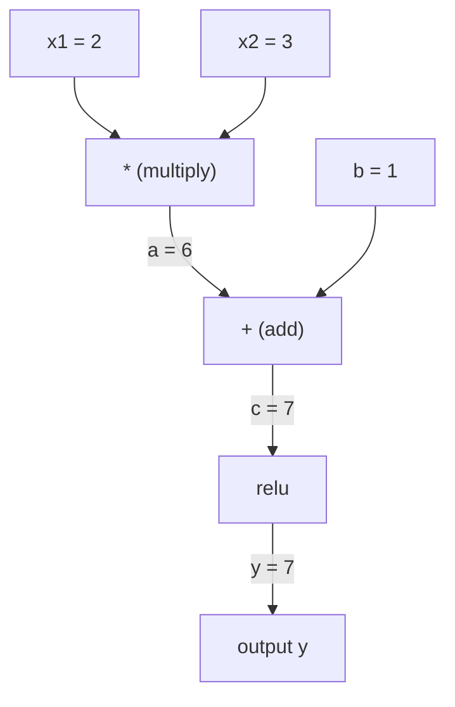
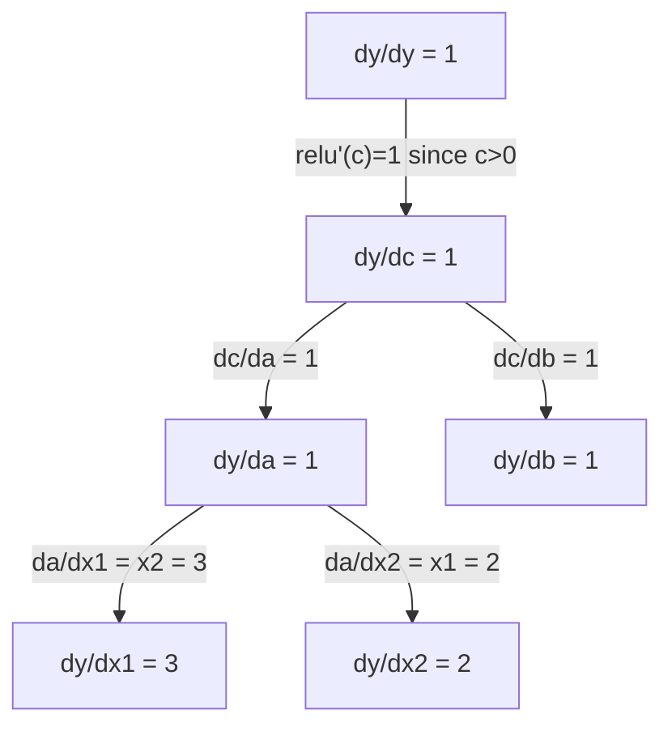

# 연쇄 법칙과 자동 미분

> 연쇄 법칙은 학습하는 모든 신경망 뒤에서 작동하는 엔진입니다.

**Type:** Build
**Languages:** Python
**Prerequisites:** Phase 1, Lesson 04 (Derivatives & Gradients)
**Time:** ~90 minutes

## 학습 목표

- 연산을 기록하고 reverse-mode autodiff로 gradient를 계산하는 최소 autograd engine(`Value` class)을 만든다
- topological sort를 사용해 computation graph의 forward pass와 backward pass를 구현한다
- from-scratch autograd engine만 사용해 XOR에서 multi-layer perceptron을 구성하고 학습한다
- numerical finite differences에 대한 gradient checking으로 autodiff의 정확성을 검증한다

## 문제

간단한 함수의 derivative는 계산할 수 있습니다. 하지만 neural network는 간단한 함수가 아닙니다. matrix multiply, add bias, apply activation, 다시 matrix multiply, softmax, cross-entropy loss처럼 수백 개의 함수가 합성된 것입니다. 출력은 함수의 함수의 함수입니다.

network를 학습하려면 모든 weight 각각에 대한 loss의 gradient가 필요합니다. parameter가 수백만 개라면 이것을 손으로 하는 것은 불가능합니다. 수치적으로 하는 것, 즉 finite differences는 너무 느립니다.

연쇄 법칙은 수학을 제공합니다. automatic differentiation은 알고리즘을 제공합니다. 둘을 함께 쓰면 임의의 함수 합성을 통과하는 정확한 gradient를 단일 forward pass에 비례하는 시간에 계산할 수 있습니다.

이것이 PyTorch, TensorFlow, JAX가 작동하는 방식입니다. 이번 lesson에서는 그 축소판을 처음부터 만듭니다.

## 개념

### 연쇄 법칙

`y = f(g(x))`라면 `x`에 대한 `y`의 derivative는 다음과 같습니다.

```text
dy/dx = dy/dg * dg/dx = f'(g(x)) * g'(x)
```

chain을 따라 derivative를 곱합니다. 각 link는 자신의 local derivative를 기여합니다.

예: `y = sin(x^2)`

```text
g(x) = x^2       g'(x) = 2x
f(g) = sin(g)     f'(g) = cos(g)

dy/dx = cos(x^2) * 2x
```

더 깊은 합성에서는 chain이 길어집니다.

```text
y = f(g(h(x)))

dy/dx = f'(g(h(x))) * g'(h(x)) * h'(x)
```

neural network의 모든 layer는 이 chain의 link 하나입니다.

### 계산 그래프

computational graph는 연쇄 법칙을 시각화합니다. 모든 operation이 node가 됩니다. data는 graph를 따라 forward로 흐르고, gradient는 backward로 흐릅니다.

**Forward pass (값 계산):**



**Backward pass (gradient 계산):**



backward pass는 모든 node에서 연쇄 법칙을 적용해 output에서 input으로 gradient를 전파합니다.

### Forward Mode와 Reverse Mode

graph를 통과하며 연쇄 법칙을 적용하는 방법은 두 가지입니다.

**Forward mode**는 input에서 시작해 derivative를 forward로 밀어 보냅니다. `dx/dx = 1`을 계산하고 각 operation을 통과하며 전파합니다. input이 적고 output이 많을 때 좋습니다.

```text
Forward mode: seed dx/dx = 1, propagate forward

  x = 2       (dx/dx = 1)
  a = x^2     (da/dx = 2x = 4)
  y = sin(a)  (dy/dx = cos(a) * da/dx = cos(4) * 4 = -2.615)
```

**Reverse mode**는 output에서 시작해 gradient를 backward로 끌어옵니다. `dy/dy = 1`을 계산하고 각 operation을 역순으로 통과하며 전파합니다. input이 많고 output이 적을 때 좋습니다.

```text
Reverse mode: seed dy/dy = 1, propagate backward

  y = sin(a)  (dy/dy = 1)
  a = x^2     (dy/da = cos(a) = cos(4) = -0.654)
  x = 2       (dy/dx = dy/da * da/dx = -0.654 * 4 = -2.615)
```

neural network에는 input, 즉 weight가 수백만 개이고 output, 즉 loss는 하나입니다. reverse mode는 한 번의 backward pass로 모든 gradient를 계산합니다. 그래서 backpropagation은 reverse mode를 사용합니다.

| Mode | Seed | Direction | Best when |
|------|------|-----------|-----------|
| Forward | `dx_i/dx_i = 1` | Input to output | Few inputs, many outputs |
| Reverse | `dy/dy = 1` | Output to input | Many inputs, few outputs (neural nets) |

### Forward Mode를 위한 Dual Numbers

forward mode는 dual numbers로 우아하게 구현할 수 있습니다. dual number는 `a + b*epsilon` 형태이며, 여기서 `epsilon^2 = 0`입니다.

```text
Dual number: (value, derivative)

(2, 1) means: value is 2, derivative w.r.t. x is 1

Arithmetic rules:
  (a, a') + (b, b') = (a+b, a'+b')
  (a, a') * (b, b') = (a*b, a'*b + a*b')
  sin(a, a')         = (sin(a), cos(a)*a')
```

input variable의 derivative를 1로 seed합니다. derivative는 모든 operation을 통과하며 자동으로 전파됩니다.

### Autograd Engine 만들기

autograd engine에는 세 가지가 필요합니다.

1. **Value wrapping.** 모든 number를 value와 gradient를 저장하는 object로 감쌉니다.
2. **Graph recording.** 모든 operation은 input과 local gradient function을 기록합니다.
3. **Backward pass.** graph를 topological sort한 뒤 역순으로 순회하며 각 node에서 연쇄 법칙을 적용합니다.

이것이 PyTorch의 `autograd`가 하는 일입니다. `torch.Tensor` class는 value를 감싸고, `requires_grad=True`일 때 operation을 기록하며, `.backward()`를 호출하면 gradient를 계산합니다.

### PyTorch Autograd의 내부 동작

PyTorch code를 작성하면:

```python
x = torch.tensor(2.0, requires_grad=True)
y = x ** 2 + 3 * x + 1
y.backward()
print(x.grad)  # 7.0 = 2*x + 3 = 2*2 + 3
```

PyTorch는 내부적으로 다음을 수행합니다.

1. `requires_grad=True`인 `x`에 대해 `Tensor` node를 만든다
2. 모든 operation(`**`, `*`, `+`)이 새 node를 만들고 backward function을 기록한다
3. `y.backward()`가 recorded graph를 통과하는 reverse-mode autodiff를 트리거한다
4. 각 node의 `grad_fn`이 local gradient를 계산하고 parent node로 전달한다
5. gradient는 replacement가 아니라 addition으로 `.grad` attribute에 누적된다

graph는 dynamic, 즉 define-by-run입니다. 모든 forward pass마다 새 graph가 만들어집니다. 그래서 PyTorch는 model 안의 control flow(if/else, loop)를 지원합니다.

```figure
chain-rule
```

## 직접 만들기

### 단계 1: Value class

```python
class Value:
    def __init__(self, data, children=(), op=''):
        self.data = data
        self.grad = 0.0
        self._backward = lambda: None
        self._prev = set(children)
        self._op = op

    def __repr__(self):
        return f"Value(data={self.data:.4f}, grad={self.grad:.4f})"
```

모든 `Value`는 numeric data, gradient(처음에는 zero), backward function, 그리고 그것을 만들어 낸 child node에 대한 pointer를 저장합니다.

### 단계 2: Gradient tracking이 있는 arithmetic operations

```python
    def __add__(self, other):
        other = other if isinstance(other, Value) else Value(other)
        out = Value(self.data + other.data, (self, other), '+')
        def _backward():
            self.grad += out.grad
            other.grad += out.grad
        out._backward = _backward
        return out

    def __mul__(self, other):
        other = other if isinstance(other, Value) else Value(other)
        out = Value(self.data * other.data, (self, other), '*')
        def _backward():
            self.grad += other.data * out.grad
            other.grad += self.data * out.grad
        out._backward = _backward
        return out

    def relu(self):
        out = Value(max(0, self.data), (self,), 'relu')
        def _backward():
            self.grad += (1.0 if out.data > 0 else 0.0) * out.grad
        out._backward = _backward
        return out
```

각 operation은 local gradient를 계산하고 upstream gradient(`out.grad`)를 곱하는 방법을 아는 closure를 만듭니다. `+=`는 어떤 value가 여러 operation에서 사용되는 경우를 처리합니다.

### 단계 3: Backward pass

```python
    def backward(self):
        topo = []
        visited = set()
        def build_topo(v):
            if v not in visited:
                visited.add(v)
                for child in v._prev:
                    build_topo(child)
                topo.append(v)
        build_topo(self)

        self.grad = 1.0
        for v in reversed(topo):
            v._backward()
```

topological sort는 모든 node의 gradient가 child로 전파되기 전에 완전히 계산되도록 보장합니다. seed gradient는 1.0입니다(`dy/dy = 1`).

### 단계 4: 완전한 engine을 위한 더 많은 operations

basic `Value` class는 addition, multiplication, relu를 처리합니다. 실제 autograd engine에는 더 많은 것이 필요합니다. neural network를 만들기 위해 필요한 operations는 다음과 같습니다.

```python
    def __neg__(self):
        return self * -1

    def __sub__(self, other):
        return self + (-other)

    def __radd__(self, other):
        return self + other

    def __rmul__(self, other):
        return self * other

    def __rsub__(self, other):
        return other + (-self)

    def __pow__(self, n):
        out = Value(self.data ** n, (self,), f'**{n}')
        def _backward():
            self.grad += n * (self.data ** (n - 1)) * out.grad
        out._backward = _backward
        return out

    def __truediv__(self, other):
        return self * (other ** -1) if isinstance(other, Value) else self * (Value(other) ** -1)

    def exp(self):
        import math
        e = math.exp(self.data)
        out = Value(e, (self,), 'exp')
        def _backward():
            self.grad += e * out.grad
        out._backward = _backward
        return out

    def log(self):
        import math
        out = Value(math.log(self.data), (self,), 'log')
        def _backward():
            self.grad += (1.0 / self.data) * out.grad
        out._backward = _backward
        return out

    def tanh(self):
        import math
        t = math.tanh(self.data)
        out = Value(t, (self,), 'tanh')
        def _backward():
            self.grad += (1 - t ** 2) * out.grad
        out._backward = _backward
        return out
```

**각 operation이 중요한 이유:**

| Operation | Backward rule | Used in |
|-----------|--------------|---------|
| `__sub__` | add + neg 재사용 | Loss computation (pred - target) |
| `__pow__` | n * x^(n-1) | Polynomial activations, MSE (error^2) |
| `__truediv__` | mul + pow(-1) 재사용 | Normalization, learning rate scaling |
| `exp` | exp(x) * upstream | Softmax, log-likelihood |
| `log` | (1/x) * upstream | Cross-entropy loss, log probabilities |
| `tanh` | (1 - tanh^2) * upstream | Classic activation function |

영리한 부분은 `__sub__`와 `__truediv__`가 existing operations로 정의된다는 점입니다. underlying add/mul/pow operations를 통해 연쇄 법칙이 합성되므로 올바른 gradient를 공짜로 얻습니다.

### 단계 5: 처음부터 만드는 mini MLP

완전한 `Value` class가 있으면 neural network를 만들 수 있습니다. PyTorch도 NumPy도 없습니다. 오직 `Value`와 연쇄 법칙만 사용합니다.

```python
import random

class Neuron:
    def __init__(self, n_inputs):
        self.w = [Value(random.uniform(-1, 1)) for _ in range(n_inputs)]
        self.b = Value(0.0)

    def __call__(self, x):
        act = sum((wi * xi for wi, xi in zip(self.w, x)), self.b)
        return act.tanh()

    def parameters(self):
        return self.w + [self.b]

class Layer:
    def __init__(self, n_inputs, n_outputs):
        self.neurons = [Neuron(n_inputs) for _ in range(n_outputs)]

    def __call__(self, x):
        return [n(x) for n in self.neurons]

    def parameters(self):
        return [p for n in self.neurons for p in n.parameters()]

class MLP:
    def __init__(self, sizes):
        self.layers = [Layer(sizes[i], sizes[i+1]) for i in range(len(sizes)-1)]

    def __call__(self, x):
        for layer in self.layers:
            x = layer(x)
        return x[0] if len(x) == 1 else x

    def parameters(self):
        return [p for layer in self.layers for p in layer.parameters()]
```

`Neuron`은 `tanh(w1*x1 + w2*x2 + ... + b)`를 계산합니다. `Layer`는 neuron의 list입니다. `MLP`는 layer를 쌓습니다. 모든 weight가 `Value`이므로 `loss.backward()`를 호출하면 gradient가 모든 parameter로 전파됩니다.

**XOR 학습:**

```python
random.seed(42)
model = MLP([2, 4, 1])  # 2 inputs, 4 hidden neurons, 1 output

xs = [[0, 0], [0, 1], [1, 0], [1, 1]]
ys = [-1, 1, 1, -1]  # XOR pattern (using -1/1 for tanh)

for step in range(100):
    preds = [model(x) for x in xs]
    loss = sum((p - y) ** 2 for p, y in zip(preds, ys))

    for p in model.parameters():
        p.grad = 0.0
    loss.backward()

    lr = 0.05
    for p in model.parameters():
        p.data -= lr * p.grad

    if step % 20 == 0:
        print(f"step {step:3d}  loss = {loss.data:.4f}")

print("\nPredictions after training:")
for x, y in zip(xs, ys):
    print(f"  input={x}  target={y:2d}  pred={model(x).data:6.3f}")
```

이것이 micrograd입니다. automatic differentiation을 사용하는 pure Python neural network training loop 전체입니다. 모든 상용 deep learning framework는 같은 일을 거대한 규모로 수행합니다.

### 단계 6: Gradient checking

autodiff가 맞는지 어떻게 알 수 있을까요? numerical derivatives와 비교합니다. 이것이 gradient checking입니다.

```python
def gradient_check(build_expr, x_val, h=1e-7):
    x = Value(x_val)
    y = build_expr(x)
    y.backward()
    autodiff_grad = x.grad

    y_plus = build_expr(Value(x_val + h)).data
    y_minus = build_expr(Value(x_val - h)).data
    numerical_grad = (y_plus - y_minus) / (2 * h)

    diff = abs(autodiff_grad - numerical_grad)
    return autodiff_grad, numerical_grad, diff
```

복잡한 expression에서 test합니다.

```python
def expr(x):
    return (x ** 3 + x * 2 + 1).tanh()

ad, num, diff = gradient_check(expr, 0.5)
print(f"Autodiff:  {ad:.8f}")
print(f"Numerical: {num:.8f}")
print(f"Difference: {diff:.2e}")
# Difference should be < 1e-5
```

gradient checking은 새 operation을 구현할 때 필수입니다. backward pass에 bug가 있으면 numerical check가 잡아냅니다. 진지한 deep learning implementation은 모두 개발 중에 gradient check를 실행합니다.

**Gradient checking을 사용할 때:**

| Situation | Do gradient check? |
|-----------|-------------------|
| autograd에 새 operation을 추가할 때 | Yes, always |
| 수렴하지 않는 training loop를 debug할 때 | Yes, check gradients first |
| Production training | No, too slow (2x forward passes per parameter) |
| Autograd code의 unit tests | Yes, automate it |

### 단계 7: Manual calculation으로 검증하기

```python
x1 = Value(2.0)
x2 = Value(3.0)
a = x1 * x2          # a = 6.0
b = a + Value(1.0)    # b = 7.0
y = b.relu()          # y = 7.0

y.backward()

print(f"y = {y.data}")          # 7.0
print(f"dy/dx1 = {x1.grad}")   # 3.0 (= x2)
print(f"dy/dx2 = {x2.grad}")   # 2.0 (= x1)
```

manual check: `y = relu(x1*x2 + 1)`입니다. `x1*x2 + 1 = 7 > 0`이므로 relu는 identity입니다.
`dy/dx1 = x2 = 3`. `dy/dx2 = x1 = 2`. engine이 일치합니다.

## 사용하기

### PyTorch와 검증하기

```python
import torch

x1 = torch.tensor(2.0, requires_grad=True)
x2 = torch.tensor(3.0, requires_grad=True)
a = x1 * x2
b = a + 1.0
y = torch.relu(b)
y.backward()

print(f"PyTorch dy/dx1 = {x1.grad.item()}")  # 3.0
print(f"PyTorch dy/dx2 = {x2.grad.item()}")  # 2.0
```

같은 gradient입니다. 여러분의 engine은 PyTorch와 같은 결과를 계산합니다. 수학이 같기 때문입니다. 연쇄 법칙을 통한 reverse-mode autodiff입니다.

### 더 복잡한 expression

```python
a = Value(2.0)
b = Value(-3.0)
c = Value(10.0)
f = (a * b + c).relu()  # relu(2*(-3) + 10) = relu(4) = 4

f.backward()
print(f"df/da = {a.grad}")  # -3.0 (= b)
print(f"df/db = {b.grad}")  #  2.0 (= a)
print(f"df/dc = {c.grad}")  #  1.0
```

## 내보내기

이 lesson이 만드는 것:
- `outputs/skill-autodiff.md` -- autograd system을 만들고 debug하기 위한 skill
- `code/autodiff.py` -- 확장할 수 있는 minimal autograd engine

여기에서 만든 `Value` class는 Phase 3의 neural network training loop의 foundation입니다.

## 연습 문제

1. `Value` class에 `__pow__`를 추가해 `x ** n`을 계산할 수 있게 하세요. `x=2`에서 `d/dx(x^3)`이 `12.0`과 같다는 것을 검증하세요.

2. activation function으로 `tanh`를 추가하세요. `tanh'(0) = 1`이고 `tanh'(2) = 0.0707`(근사)임을 검증하세요.

3. single neuron에 대한 computation graph를 만드세요: `y = relu(w1*x1 + w2*x2 + b)`. 다섯 gradient를 모두 계산하고 PyTorch와 비교해 검증하세요.

4. dual numbers를 사용해 forward-mode autodiff를 구현하세요. `Dual` class를 만들고 reverse-mode engine과 같은 derivative를 제공하는지 검증하세요.

## 핵심 용어

| Term | What people say | What it actually means |
|------|----------------|----------------------|
| Chain rule | "derivative를 곱한다" | composed functions의 derivative는 각 function의 local derivative를 올바른 지점에서 평가한 값들의 곱과 같다 |
| Computational graph | "network diagram" | node가 operation이고 edge가 value(forward) 또는 gradient(backward)를 운반하는 directed acyclic graph |
| Forward mode | "derivative를 forward로 민다" | input에서 output으로 derivative를 전파하는 autodiff. input variable 하나당 한 pass. |
| Reverse mode | "Backpropagation" | output에서 input으로 gradient를 전파하는 autodiff. output variable 하나당 한 pass. |
| Autograd | "Automatic gradients" | value에 대한 operation을 기록하고, graph를 만들고, 연쇄 법칙으로 exact gradient를 계산하는 system |
| Dual numbers | "Value plus derivative" | arithmetic을 통과하며 derivative 정보를 운반하는 a + b*epsilon (epsilon^2 = 0) 형태의 number |
| Topological sort | "Dependency order" | 모든 dependency 뒤에 해당 node가 오도록 graph node를 정렬하는 것. 올바른 gradient propagation에 필요하다. |
| Gradient accumulation | "Add, don't replace" | value가 여러 operation으로 들어갈 때, 그 gradient는 들어오는 모든 gradient contribution의 합이다 |
| Dynamic graph | "Define by run" | forward pass마다 다시 만들어지는 computation graph로, model 안에서 Python control flow를 허용한다(PyTorch style) |
| Gradient checking | "Numerical verification" | correctness를 검증하기 위해 autodiff gradient를 numerical finite-difference gradient와 비교하는 것. debugging에 필수다. |
| MLP | "Multi-layer perceptron" | 하나 이상의 hidden layer of neurons를 가진 neural network. 각 neuron은 weighted sum plus bias를 계산한 뒤 activation function을 적용한다. |
| Neuron | "Weighted sum + activation" | 기본 단위: output = activation(w1*x1 + w2*x2 + ... + b). weights와 bias는 learnable parameters다. |

## 더 읽을거리

- [3Blue1Brown: Backpropagation calculus](https://www.youtube.com/watch?v=tIeHLnjs5U8) -- neural network에서 연쇄 법칙을 시각적으로 설명
- [PyTorch Autograd mechanics](https://pytorch.org/docs/stable/notes/autograd.html) -- 실제 system이 작동하는 방식
- [Baydin et al., Automatic Differentiation in Machine Learning: a Survey](https://arxiv.org/abs/1502.05767) -- 종합 참고 자료
