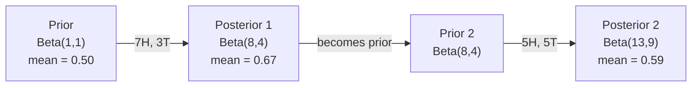

# 베이즈 정리

> 확률은 당신이 무엇을 예상하는지에 관한 것입니다. Bayes' theorem은 당신이 무엇을 배우는지에 관한 것입니다.

**Type:** Build
**Languages:** Python
**Prerequisites:** Phase 1, Lesson 06 (Probability Fundamentals)
**Time:** ~75 minutes

## 학습 목표

- prior, likelihood, evidence에서 posterior probability를 계산하기 위해 Bayes' theorem을 적용한다
- Laplace smoothing과 log-space computation을 사용해 Naive Bayes text classifier를 처음부터 만든다
- MLE와 MAP estimation을 비교하고, MAP이 L2 regularization에 어떻게 대응되는지 설명한다
- A/B testing을 위해 Beta-Binomial conjugate prior를 사용하는 sequential Bayesian updating을 구현한다

## 문제

의료 검사가 99% 정확합니다. 검사 결과가 양성입니다. 실제로 병에 걸렸을 확률은 얼마일까요?

대부분은 99%라고 답합니다. 실제 답은 그 병이 얼마나 드문지에 따라 달라집니다. 10,000명 중 1명만 걸리는 병이라면, 양성 결과는 아플 확률을 약 1%로만 올립니다. 양성 결과의 나머지 99%는 건강한 사람에게서 나온 false alarm입니다.

이것은 함정 문제가 아닙니다. Bayes' theorem입니다. 모든 spam filter, 모든 medical diagnostic, 불확실성을 정량화하는 모든 machine learning model은 정확히 이 추론을 사용합니다. 믿음에서 시작합니다. 증거를 봅니다. 갱신합니다.

이를 이해하지 못한 채 ML system을 만들면 model output을 잘못 해석하고, 나쁜 threshold를 설정하고, 지나치게 확신하는 prediction을 배포하게 됩니다.

## 개념

### 결합확률에서 Bayes로

Lesson 06에서 이미 조건부확률을 배웠습니다:

```text
P(A|B) = P(A and B) / P(B)
```

그리고 대칭적으로:

```text
P(B|A) = P(A and B) / P(A)
```

두 식은 같은 분자를 공유합니다: P(A and B). 두 식을 같게 놓고 정리합니다:

```text
P(A and B) = P(A|B) * P(B) = P(B|A) * P(A)

Therefore:

P(A|B) = P(B|A) * P(A) / P(B)
```

이것이 Bayes' theorem입니다. 네 개의 양, 하나의 방정식입니다.

### 네 부분

| Part | Name | What it means |
|------|------|---------------|
| P(A\|B) | Posterior | evidence B를 본 뒤 A에 대한 갱신된 믿음 |
| P(B\|A) | Likelihood | A가 참일 때 evidence B가 얼마나 그럴듯한지 |
| P(A) | Prior | evidence를 보기 전 A에 대한 믿음 |
| P(B) | Evidence | 모든 가능성 아래에서 B를 볼 전체 확률 |

evidence 항 P(B)는 normalizer로 작동합니다. total probability law를 사용해 확장할 수 있습니다:

```text
P(B) = P(B|A) * P(A) + P(B|not A) * P(not A)
```

### 의료 검사 예시

어떤 병이 10,000명 중 1명에게 영향을 줍니다. 검사는 99% 정확합니다(아픈 사람의 99%를 잡고, 건강한 사람에게 1%의 false positive를 냅니다).

```text
P(sick)          = 0.0001     (prior: disease is rare)
P(positive|sick) = 0.99       (likelihood: test catches it)
P(positive|healthy) = 0.01    (false positive rate)

P(positive) = P(positive|sick) * P(sick) + P(positive|healthy) * P(healthy)
            = 0.99 * 0.0001 + 0.01 * 0.9999
            = 0.000099 + 0.009999
            = 0.010098

P(sick|positive) = P(positive|sick) * P(sick) / P(positive)
                 = 0.99 * 0.0001 / 0.010098
                 = 0.0098
                 = 0.98%
```

1%보다 작습니다. prior가 지배합니다. 어떤 상태가 드물면, 정확한 검사도 대부분 false positive를 만들어냅니다. 그래서 의사는 confirmation test를 지시합니다.

### Spam filter 예시

당신은 "lottery"라는 단어가 들어간 email을 받았습니다. 이것은 spam일까요?

```text
P(spam)                = 0.3      (30% of email is spam)
P("lottery"|spam)      = 0.05     (5% of spam emails contain "lottery")
P("lottery"|not spam)  = 0.001    (0.1% of legitimate emails contain "lottery")

P("lottery") = 0.05 * 0.3 + 0.001 * 0.7
             = 0.015 + 0.0007
             = 0.0157

P(spam|"lottery") = 0.05 * 0.3 / 0.0157
                  = 0.955
                  = 95.5%
```

단어 하나가 확률을 30%에서 95.5%로 이동시킵니다. 실제 spam filter는 수백 개 단어에 대해 동시에 Bayes를 적용합니다.

### Naive Bayes: 독립성 가정

Naive Bayes는 class가 주어졌을 때 모든 feature가 conditionally independent라고 가정하여 이를 여러 feature로 확장합니다:

```text
P(class | feature_1, feature_2, ..., feature_n)
  = P(class) * P(feature_1|class) * P(feature_2|class) * ... * P(feature_n|class)
    / P(feature_1, feature_2, ..., feature_n)
```

"naive"한 부분은 independence assumption입니다. text에서는 단어 발생이 독립이 아닙니다("New"와 "York"은 correlated입니다). 하지만 이 가정은 실제로 놀라울 만큼 잘 작동합니다. classifier가 calibrated probability를 생성할 필요 없이 class를 rank하기만 하면 되기 때문입니다.

분모는 모든 class에서 같으므로 생략하고 분자만 비교할 수 있습니다:

```text
score(class) = P(class) * product of P(feature_i | class)
```

score가 가장 높은 class를 고릅니다.

### 최대우도추정(MLE)

training data에서 P(feature|class)를 어떻게 얻을까요? 셉니다.

```text
P("free"|spam) = (number of spam emails containing "free") / (total spam emails)
```

이것이 MLE입니다. 관측된 데이터를 가장 그럴듯하게 만드는 parameter value를 선택합니다. likelihood function을 최대화하는 것이며, 이산 count에서는 relative frequency로 줄어듭니다.

문제: 어떤 단어가 training 중 spam에서 한 번도 나타나지 않으면 MLE는 그 단어에 probability zero를 줍니다. 보지 못한 단어 하나가 전체 product를 죽입니다. Laplace smoothing으로 해결합니다:

```text
P(word|class) = (count(word, class) + 1) / (total_words_in_class + vocabulary_size)
```

모든 count에 1을 더하면 어떤 확률도 0이 되지 않습니다.

### 최대 사후확률(MAP)

MLE는 묻습니다: 어떤 parameters가 P(data|parameters)를 최대화하는가?

MAP은 묻습니다: 어떤 parameters가 P(parameters|data)를 최대화하는가?

Bayes' theorem에 의해:

```text
P(parameters|data) proportional to P(data|parameters) * P(parameters)
```

MAP은 parameter 자체에 대한 prior를 더합니다. parameter가 작아야 한다고 믿는다면, 큰 값을 penalize하는 prior로 이를 인코딩합니다. 이것은 ML의 L2 regularization과 동일합니다. ridge regression의 "ridge" penalty는 말 그대로 weights에 대한 Gaussian prior입니다.

| Estimation | Optimizes | ML equivalent |
|------------|-----------|---------------|
| MLE | P(data\|params) | Unregularized training |
| MAP | P(data\|params) * P(params) | L2 / L1 regularization |

### Bayesian vs frequentist: 실용적 차이

Frequentist는 parameter를 고정되었지만 모르는 값으로 봅니다. 그들은 묻습니다: "이 실험을 여러 번 반복하면 무슨 일이 일어날까?"

Bayesian은 parameter를 분포로 봅니다. 그들은 묻습니다: "내가 관측한 것을 고려하면 parameter에 대해 무엇을 믿는가?"

ML system을 만들 때의 실용적 차이:

| Aspect | Frequentist | Bayesian |
|--------|-------------|----------|
| Output | Point estimate | Distribution over values |
| Uncertainty | Confidence intervals (about procedure) | Credible intervals (about parameter) |
| Small data | Can overfit | Prior acts as regularization |
| Computation | Usually faster | Often requires sampling (MCMC) |

대부분의 production ML은 frequentist입니다(SGD, point estimates). Bayesian method는 calibrated uncertainty가 필요할 때(medical decisions, safety-critical systems) 또는 데이터가 부족할 때(few-shot learning, cold start) 빛납니다.

### Bayesian thinking이 ML에 중요한 이유

연결은 비유보다 깊습니다:

**Priors are regularization.** weights에 대한 Gaussian prior는 L2 regularization입니다. Laplace prior는 L1입니다. regularization term을 추가할 때마다, 당신은 어떤 parameter value를 기대하는지에 대한 Bayesian statement를 하고 있습니다.

**Posteriors are uncertainty.** 하나의 predicted probability는 모델이 그 estimate에 얼마나 confident한지 말해주지 않습니다. Bayesian method는 분포를 줍니다: "P(spam)이 0.8과 0.95 사이일 것으로 생각한다."

**Bayes updates are online learning.** 오늘의 posterior가 내일의 prior가 됩니다. 모델이 새 데이터를 보면, 처음부터 다시 학습하는 대신 믿음을 점진적으로 갱신합니다.

**Model comparison is Bayesian.** Bayesian information criterion (BIC), marginal likelihood, Bayes factors는 모두 overfitting 없이 model을 선택하기 위해 Bayesian reasoning을 사용합니다.

```figure
bayes-update
```

## 직접 만들기

### Step 1: Bayes theorem 함수

```python
def bayes(prior, likelihood, false_positive_rate):
    evidence = likelihood * prior + false_positive_rate * (1 - prior)
    posterior = likelihood * prior / evidence
    return posterior

result = bayes(prior=0.0001, likelihood=0.99, false_positive_rate=0.01)
print(f"P(sick|positive) = {result:.4f}")
```

### Step 2: Naive Bayes 분류기

```python
import math
from collections import defaultdict

class NaiveBayes:
    def __init__(self, smoothing=1.0):
        self.smoothing = smoothing
        self.class_counts = defaultdict(int)
        self.word_counts = defaultdict(lambda: defaultdict(int))
        self.class_word_totals = defaultdict(int)
        self.vocab = set()

    def train(self, documents, labels):
        for doc, label in zip(documents, labels):
            self.class_counts[label] += 1
            words = doc.lower().split()
            for word in words:
                self.word_counts[label][word] += 1
                self.class_word_totals[label] += 1
                self.vocab.add(word)

    def predict(self, document):
        words = document.lower().split()
        total_docs = sum(self.class_counts.values())
        vocab_size = len(self.vocab)
        best_class = None
        best_score = float("-inf")
        for cls in self.class_counts:
            score = math.log(self.class_counts[cls] / total_docs)
            for word in words:
                count = self.word_counts[cls].get(word, 0)
                total = self.class_word_totals[cls]
                score += math.log((count + self.smoothing) / (total + self.smoothing * vocab_size))
            if score > best_score:
                best_score = score
                best_class = cls
        return best_class
```

Log probability는 underflow를 막습니다. 작은 확률을 많이 곱하면 floating point로 표현하기에는 너무 작은 숫자가 됩니다. log-probability를 더하는 것은 수치적으로 안정적이고 수학적으로 동일합니다.

### Step 3: spam data로 학습하기

```python
train_docs = [
    "win free money now",
    "free lottery ticket winner",
    "claim your prize today free",
    "urgent offer free cash",
    "congratulations you won free",
    "meeting tomorrow at noon",
    "project update attached",
    "can we schedule a call",
    "quarterly report review",
    "lunch on thursday sounds good",
    "team standup notes attached",
    "please review the pull request",
]

train_labels = [
    "spam", "spam", "spam", "spam", "spam",
    "ham", "ham", "ham", "ham", "ham", "ham", "ham",
]

classifier = NaiveBayes()
classifier.train(train_docs, train_labels)

test_messages = [
    "free money waiting for you",
    "meeting rescheduled to friday",
    "you won a free prize",
    "please review the attached report",
]

for msg in test_messages:
    print(f"  '{msg}' -> {classifier.predict(msg)}")
```

### Step 4: 학습된 확률 살펴보기

```python
def show_top_words(classifier, cls, n=5):
    vocab_size = len(classifier.vocab)
    total = classifier.class_word_totals[cls]
    probs = {}
    for word in classifier.vocab:
        count = classifier.word_counts[cls].get(word, 0)
        probs[word] = (count + classifier.smoothing) / (total + classifier.smoothing * vocab_size)
    sorted_words = sorted(probs.items(), key=lambda x: x[1], reverse=True)
    for word, prob in sorted_words[:n]:
        print(f"    {word}: {prob:.4f}")

print("\nTop spam words:")
show_top_words(classifier, "spam")
print("\nTop ham words:")
show_top_words(classifier, "ham")
```

## 사용하기

Scikit-learn은 production-ready naive Bayes implementation을 제공합니다:

```python
from sklearn.feature_extraction.text import CountVectorizer
from sklearn.naive_bayes import MultinomialNB
from sklearn.metrics import classification_report

vectorizer = CountVectorizer()
X_train = vectorizer.fit_transform(train_docs)
clf = MultinomialNB()
clf.fit(X_train, train_labels)

X_test = vectorizer.transform(test_messages)
predictions = clf.predict(X_test)
for msg, pred in zip(test_messages, predictions):
    print(f"  '{msg}' -> {pred}")
```

같은 알고리즘입니다. CountVectorizer는 tokenization과 vocabulary building을 처리합니다. MultinomialNB는 smoothing과 log-probabilities를 내부적으로 처리합니다. 당신이 처음부터 만든 버전은 같은 일을 40줄로 합니다.

## 배포하기

여기서 만든 NaiveBayes class는 전체 pipeline을 보여줍니다: tokenization, Laplace smoothing을 사용한 probability estimation, log-space prediction. `code/bayes.py`의 코드는 Python standard library 외 의존성 없이 end-to-end로 실행됩니다.

### 켤레 사전분포

prior와 posterior가 같은 distribution family에 속하면 그 prior를 "conjugate"라고 부릅니다. 이것은 Bayesian updating을 대수적으로 깔끔하게 만듭니다. numerical integration 없이 closed-form posterior를 얻습니다.

| Likelihood | Conjugate Prior | Posterior | Example |
|-----------|----------------|-----------|---------|
| Bernoulli | Beta(a, b) | Beta(a + successes, b + failures) | Coin flip bias estimation |
| Normal (known variance) | Normal(mu_0, sigma_0) | Normal(weighted mean, smaller variance) | Sensor calibration |
| Poisson | Gamma(a, b) | Gamma(a + sum of counts, b + n) | Modeling arrival rates |
| Multinomial | Dirichlet(alpha) | Dirichlet(alpha + counts) | Topic modeling, language models |

이것이 중요한 이유: conjugate prior가 없으면 posterior를 근사하기 위해 Monte Carlo sampling이나 variational inference가 필요합니다. conjugate prior가 있으면 숫자 두 개만 갱신하면 됩니다.

Beta distribution은 실제로 가장 흔한 conjugate prior입니다. Beta(a, b)는 probability parameter에 대한 믿음을 나타냅니다. 평균은 a/(a+b)입니다. a+b가 클수록 분포가 더 concentrated됩니다(confident).

Beta prior의 특수한 경우:
- Beta(1, 1) = uniform. parameter에 대한 의견이 없습니다.
- Beta(10, 10) = 0.5 근처에 peaked. parameter가 0.5 근처라고 강하게 믿습니다.
- Beta(1, 10) = 0 쪽으로 skewed. parameter가 작다고 믿습니다.

update rule은 매우 단순합니다:

```text
Prior:     Beta(a, b)
Data:      s successes, f failures
Posterior: Beta(a + s, b + f)
```

적분도, 샘플링도 없습니다. 그냥 덧셈입니다.

### 순차적 베이지안 업데이트

Bayesian inference는 자연스럽게 sequential합니다. 오늘의 posterior가 내일의 prior가 됩니다. 이것이 실제 system이 모든 historical data를 다시 처리하지 않고 점진적으로 배우는 방식입니다.

구체적 예시: 동전이 fair한지 추정하기.

**Day 1: 아직 데이터가 없습니다.**
Beta(1, 1)로 시작합니다. uniform prior입니다. 의견이 없습니다.
- Prior mean: 0.5
- Prior is flat across [0, 1]

**Day 2: 앞면 7번, 뒷면 3번을 관측합니다.**
Posterior = Beta(1 + 7, 1 + 3) = Beta(8, 4)
- Posterior mean: 8/12 = 0.667
- Evidence suggests the coin is biased toward heads

**Day 3: 앞면 5번, 뒷면 5번을 추가로 관측합니다.**
어제의 posterior를 오늘의 prior로 사용합니다.
Posterior = Beta(8 + 5, 4 + 5) = Beta(13, 9)
- Posterior mean: 13/22 = 0.591
- The balanced new data pulled the estimate back toward 0.5



관측 순서는 중요하지 않습니다. Beta(1,1)을 앞면 12번, 뒷면 8번 전체로 한 번에 갱신해도 Beta(13, 9)가 됩니다. 같은 결과입니다. Sequential updating과 batch updating은 수학적으로 동등합니다. 하지만 sequential updating은 raw data를 저장하지 않고도 각 단계에서 결정을 내리게 해줍니다.

이것이 production ML system에서 online learning의 기반입니다. bandit을 위한 Thompson sampling, incremental recommendation system, streaming anomaly detector가 모두 이 패턴을 사용합니다.

### A/B Testing과의 연결

A/B testing은 변장한 Bayesian inference입니다.

설정: 버튼 색 두 가지를 테스트합니다. Variant A(blue)와 variant B(green). 어떤 것이 더 많은 click을 얻는지 알고 싶습니다.

베이지안 A/B test:

1. **Prior.** 두 variant 모두 Beta(1, 1)로 시작합니다. prior preference가 없습니다.
2. **Data.** Variant A: 1000 views 중 50 clicks. Variant B: 1000 views 중 65 clicks.
3. **Posteriors.**
   - A: Beta(1 + 50, 1 + 950) = Beta(51, 951). Mean = 0.051
   - B: Beta(1 + 65, 1 + 935) = Beta(66, 936). Mean = 0.066
4. **Decision.** P(B > A), 즉 B의 true conversion rate가 A보다 높을 확률을 계산합니다.

P(B > A)를 해석적으로 계산하기는 어렵습니다. 하지만 Monte Carlo를 쓰면 간단합니다:

```text
1. Draw 100,000 samples from Beta(51, 951)  -> samples_A
2. Draw 100,000 samples from Beta(66, 936)  -> samples_B
3. P(B > A) = fraction of samples where B > A
```

P(B > A) > 0.95이면 variant B를 ship합니다. 0.05와 0.95 사이이면 데이터를 계속 모읍니다. P(B > A) < 0.05이면 variant A를 ship합니다.

frequentist A/B testing 대비 장점:
- 직접적인 probability statement를 얻습니다: "B가 더 좋을 확률이 97%다"
- p-value 혼동이 없습니다. "fail to reject the null hypothesis" 같은 회피가 없습니다.
- false positive rate를 부풀리지 않고 언제든 결과를 확인할 수 있습니다("peeking problem" 없음)
- prior knowledge를 포함할 수 있습니다(예: 이전 test에서 conversion rate가 보통 3-8%였음)

| Aspect | Frequentist A/B | Bayesian A/B |
|--------|----------------|--------------|
| Output | p-value | P(B > A) |
| Interpretation | "How surprising is this data if A=B?" | "How likely is B better than A?" |
| Early stopping | Inflates false positives | Safe at any point (given a well-chosen prior and correctly specified model) |
| Prior knowledge | Not used | Encoded as Beta prior |
| Decision rule | p < 0.05 | P(B > A) > threshold |

## 연습문제

1. **Multiple tests.** 환자가 독립적인 검사 두 번에서 양성입니다(둘 다 99% 정확, disease prevalence는 10,000명 중 1명). 두 검사 이후 P(sick)은 얼마인가요? 첫 번째 test의 posterior를 두 번째 test의 prior로 사용하세요.

2. **Smoothing impact.** smoothing 값 0.01, 0.1, 1.0, 10.0으로 spam classifier를 실행하세요. top word probability가 어떻게 변하나요? smoothing=0이고 어떤 단어가 ham에만 나타나면 무슨 일이 생기나요?

3. **Add features.** NaiveBayes class를 확장해 word count와 함께 message length(short/long)도 feature로 사용하세요. training data에서 P(short|spam)과 P(short|ham)을 추정하고 prediction score에 포함하세요.

4. **MAP by hand.** 관측 데이터(동전 10번 중 앞면 7번)가 주어졌을 때 Beta(2,2) prior를 사용해 bias의 MAP estimate를 계산하세요. MLE estimate(7/10)와 비교하세요.

## 핵심 용어

| 용어 | 흔히 하는 말 | 실제 의미 |
|------|----------------|----------------------|
| Prior | "내 초기 추측" | evidence를 관측하기 전 P(hypothesis). ML에서는 regularization term입니다. |
| Likelihood | "데이터가 얼마나 잘 맞는지" | P(evidence\|hypothesis). 특정 hypothesis 아래에서 observed data가 얼마나 그럴듯한지입니다. |
| Posterior | "갱신된 믿음" | P(hypothesis\|evidence). prior에 likelihood를 곱한 뒤 normalize한 것입니다. |
| Evidence | "정규화 상수" | 모든 hypothesis에 대한 P(data). posterior의 합이 1이 되게 합니다. |
| Naive Bayes | "그 간단한 text classifier" | class가 주어졌을 때 feature가 independent라고 가정하는 classifier입니다. 틀린 가정에도 잘 작동합니다. |
| Laplace smoothing | "Add-one smoothing" | unseen data 때문에 probability가 0이 되는 것을 막기 위해 모든 feature에 작은 count를 더하는 것입니다. |
| MLE | "frequency를 그대로 쓰기" | P(data\|parameters)를 최대화하는 parameter를 선택합니다. prior가 없습니다. small data에서 overfit될 수 있습니다. |
| MAP | "prior가 있는 MLE" | P(data\|parameters) * P(parameters)를 최대화하는 parameter를 선택합니다. regularized MLE와 동등합니다. |
| Log-probability | "log space에서 작업" | 작은 확률을 많이 곱할 때 floating-point underflow를 피하기 위해 P 대신 log(P)를 사용합니다. |
| False positive | "잘못된 경보" | test는 positive라고 하지만 true state는 negative입니다. base rate fallacy를 일으킵니다. |

## 더 읽을거리

- [3Blue1Brown: Bayes' theorem](https://www.youtube.com/watch?v=HZGCoVF3YvM) - medical test 예시를 사용한 시각적 설명
- [Stanford CS229: Generative Learning Algorithms](https://cs229.stanford.edu/notes2022fall/cs229-notes2.pdf) - naive Bayes와 discriminative model과의 연결
- [Think Bayes](https://greenteapress.com/wp/think-bayes/) - Python code로 배우는 무료 Bayesian statistics 책
- [scikit-learn Naive Bayes](https://scikit-learn.org/stable/modules/naive_bayes.html) - production implementation과 각 variant를 언제 쓸지
