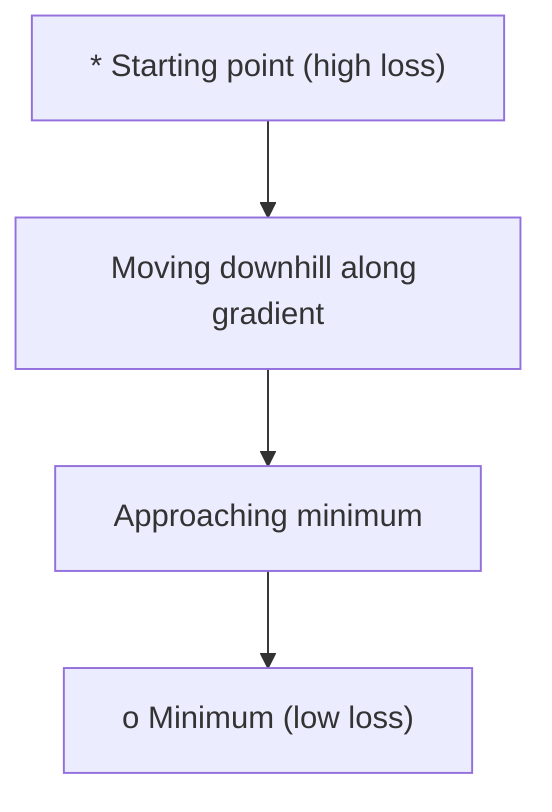
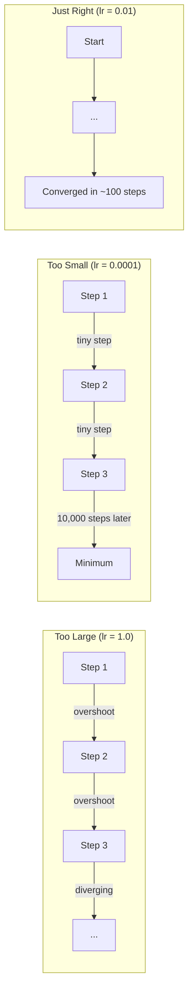
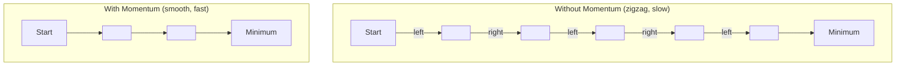
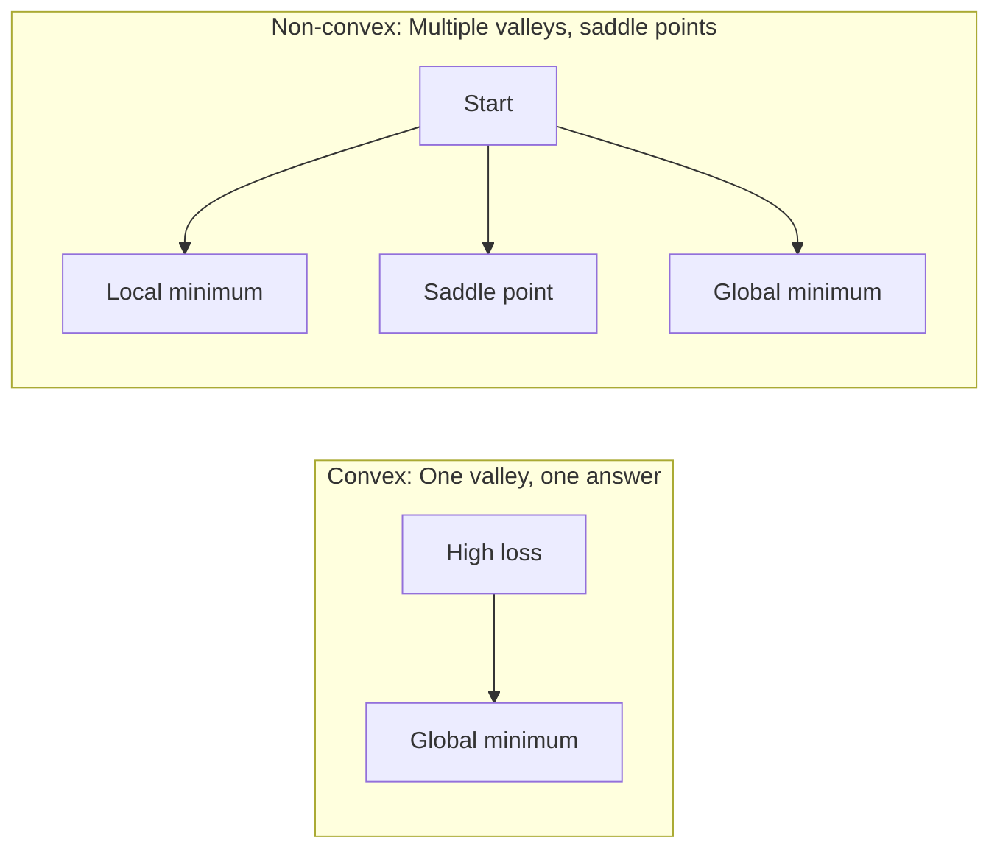
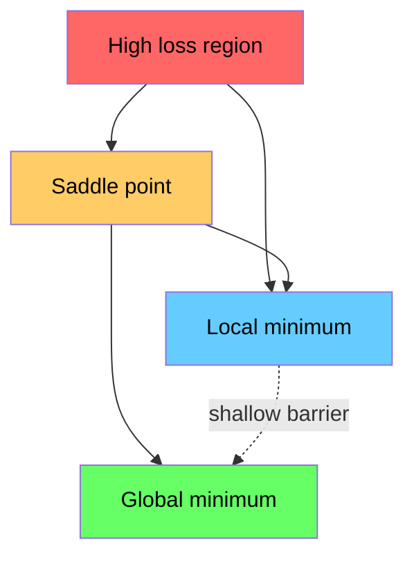

# 최적화

> 신경망 학습은 결국 valley의 바닥을 찾는 일입니다.

**Type:** Build
**Languages:** Python
**Prerequisites:** Phase 1, Lessons 04-05 (Derivatives, Gradients)
**Time:** ~75 minutes

## 학습 목표

- vanilla gradient descent, momentum이 있는 SGD, Adam을 처음부터 구현한다
- Rosenbrock function에서 optimizer convergence를 비교하고 Adam이 왜 weight별 learning rate를 조정하는지 설명한다
- convex loss landscape와 non-convex loss landscape를 구분하고 high dimension에서 saddle point의 역할을 설명한다
- training stability를 위해 learning rate schedule(step decay, cosine annealing, warmup)을 설정한다

## 문제

loss function이 있습니다. 그것은 모델이 얼마나 틀렸는지 알려줍니다. gradients가 있습니다. 그것들은 어느 방향으로 가면 loss가 더 나빠지는지 알려줍니다. 이제 downhill로 걸어갈 전략이 필요합니다.

순진한 접근은 단순합니다. gradient의 반대 방향으로 움직입니다. learning rate라는 숫자로 step 크기를 조절합니다. 반복합니다. 이것이 gradient descent이고, 작동합니다. 하지만 "작동한다"에는 단서가 있습니다. learning rate가 너무 크면 valley를 완전히 지나쳐 벽 사이를 튕깁니다. 너무 작으면 답을 향해 불필요한 수천 step을 기어갑니다. saddle point에 걸리면 minimum을 찾지 못했는데도 움직임을 멈춥니다.

deep learning의 모든 optimizer는 같은 질문에 대한 답입니다: 어떻게 valley의 바닥에 더 빠르고 더 안정적으로 도달할 것인가?

## 개념

### 최적화란 무엇인가

최적화는 함수를 최소화(또는 최대화)하는 입력값을 찾는 것입니다. machine learning에서 그 함수는 loss입니다. 입력은 model weights입니다. training은 optimization입니다.

```text
minimize L(w) where:
  L = loss function
  w = model weights (could be millions of parameters)
```

### 기본 gradient descent

가장 단순한 optimizer입니다. 모든 weight에 대한 loss의 gradient를 계산합니다. 각 weight를 gradient의 반대 방향으로 움직입니다. learning rate로 step 크기를 조절합니다.

```text
w = w - lr * gradient
```

이것이 전체 알고리즘입니다. 한 줄입니다.



### Learning rate: 가장 중요한 hyperparameter

learning rate는 step size를 제어합니다. convergence의 모든 것을 결정합니다.



올바른 learning rate를 주는 공식은 없습니다. 실험으로 찾습니다. 흔한 시작점은 Adam의 경우 0.001, momentum이 있는 SGD의 경우 0.01입니다.

### SGD, batch, mini-batch 비교

Vanilla gradient descent는 한 step을 밟기 전에 전체 dataset에 대해 gradient를 계산합니다. 이를 batch gradient descent라고 합니다. 안정적이지만 느립니다.

Stochastic gradient descent(SGD)는 단일 random sample에서 gradient를 계산하고 즉시 step을 밟습니다. noisy하지만 빠릅니다.

Mini-batch gradient descent는 둘의 중간입니다. 작은 batch(32, 64, 128, 256 samples)에 대해 gradient를 계산한 다음 step을 밟습니다. 실제로 모두가 사용하는 방식입니다.

| Variant | Batch size | Gradient quality | Speed per step | Noise |
|---------|-----------|-----------------|---------------|-------|
| Batch GD | Entire dataset | Exact | Slow | None |
| SGD | 1 sample | Very noisy | Fast | High |
| Mini-batch | 32-256 | Good estimate | Balanced | Moderate |

SGD와 mini-batch의 noise는 bug가 아닙니다. 얕은 local minima와 saddle point에서 빠져나오도록 돕습니다.

### Momentum: 내리막을 굴러가는 공

Vanilla gradient descent는 현재 gradient만 봅니다. gradient가 지그재그로 움직이면(좁은 valley에서 흔함) 진행이 느립니다. Momentum은 과거 gradient를 velocity term에 누적하여 이를 해결합니다.

```text
v = beta * v + gradient
w = w - lr * v
```

비유는 downhill로 굴러가는 공입니다. 공은 작은 bump마다 멈췄다가 다시 시작하지 않습니다. 일관된 방향에서는 속도를 쌓고 oscillation을 완화합니다.



`beta`(보통 0.9)는 history를 얼마나 유지할지 제어합니다. beta가 높을수록 momentum이 커지고 path가 smoother해지지만, direction change에 더 느리게 반응합니다.

### Adam: 적응형 learning rates

서로 다른 weight에는 서로 다른 learning rate가 필요합니다. 드물게 큰 gradient를 받는 weight는 그 순간 더 큰 step을 밟아야 합니다. 계속 huge gradient를 받는 weight는 더 작은 step을 밟아야 합니다.

Adam(Adaptive Moment Estimation)은 weight마다 두 가지를 추적합니다:

1. First moment (m): gradient의 running average(momentum과 유사)
2. Second moment (v): squared gradient의 running average(gradient magnitude)

```text
m = beta1 * m + (1 - beta1) * gradient
v = beta2 * v + (1 - beta2) * gradient^2

m_hat = m / (1 - beta1^t)    bias correction
v_hat = v / (1 - beta2^t)    bias correction

w = w - lr * m_hat / (sqrt(v_hat) + epsilon)
```

`sqrt(v_hat)`로 나누는 것이 핵심 통찰입니다. 큰 gradient를 가진 weight는 큰 수로 나뉩니다(작은 effective step). 작은 gradient를 가진 weight는 작은 수로 나뉩니다(큰 effective step). 각 weight가 자기만의 adaptive learning rate를 갖습니다.

기본 hyperparameter는 `lr=0.001, beta1=0.9, beta2=0.999, epsilon=1e-8`입니다. 이 기본값은 대부분의 문제에서 잘 작동합니다.

### Learning rate schedules(학습률 스케줄)

고정 learning rate는 타협입니다. training 초반에는 빠르게 진행하기 위해 큰 step이 필요합니다. training 후반에는 minimum 근처에서 fine-tune하기 위해 작은 step이 필요합니다.

흔한 schedule:

| Schedule | Formula | Use case |
|----------|---------|----------|
| Step decay | lr = lr * factor every N epochs | Simple, manual control |
| Exponential decay | lr = lr_0 * decay^t | Smooth reduction |
| Cosine annealing | lr = lr_min + 0.5 * (lr_max - lr_min) * (1 + cos(pi * t / T)) | Transformers, modern training |
| Warmup + decay | Linear ramp up, then decay | Large models, prevents early instability |

### Convex와 non-convex

convex function에는 minimum이 하나 있습니다. gradient descent는 항상 그것을 찾습니다. `f(x) = x^2` 같은 quadratic은 convex입니다.

Neural network loss function은 non-convex입니다. 많은 local minima, saddle points, flat regions가 있습니다.



실제로 high-dimensional neural network에서 local minima는 큰 문제가 아닌 경우가 많습니다. 대부분의 local minima는 global minimum에 가까운 loss value를 가집니다. 진짜 장애물은 saddle point입니다(어떤 방향으로는 flat하고, 다른 방향으로는 curved). Momentum과 mini-batch noise가 여기서 빠져나오도록 돕습니다.

### Loss landscape 시각화

loss는 모든 weight의 함수입니다. weight가 1 million개인 model의 loss landscape는 1,000,001-dimensional space에 존재합니다. 우리는 weight space에서 random direction 두 개를 고르고 그 방향을 따라 loss를 plot하여 2D surface를 만들어 시각화합니다.



Sharp minima는 generalize가 좋지 않습니다. Flat minima는 generalize가 좋습니다. 이것이 SGD with momentum이 최종 test accuracy에서 Adam을 종종 이기는 이유 중 하나입니다. noise가 sharp minima에 안착하는 것을 막습니다.

```figure
gradient-descent
```

## 직접 만들기

### Step 1: 테스트 함수 정의

Rosenbrock function은 고전적인 optimization benchmark입니다. minimum은 (1, 1)에 있으며, 찾기는 쉽지만 따라가기는 어려운 좁고 휘어진 valley 안에 있습니다.

```text
f(x, y) = (1 - x)^2 + 100 * (y - x^2)^2
```

```python
def rosenbrock(params):
    x, y = params
    return (1 - x) ** 2 + 100 * (y - x ** 2) ** 2

def rosenbrock_gradient(params):
    x, y = params
    df_dx = -2 * (1 - x) + 200 * (y - x ** 2) * (-2 * x)
    df_dy = 200 * (y - x ** 2)
    return [df_dx, df_dy]
```

### Step 2: Vanilla gradient descent 구현

```python
class GradientDescent:
    def __init__(self, lr=0.001):
        self.lr = lr

    def step(self, params, grads):
        return [p - self.lr * g for p, g in zip(params, grads)]
```

### Step 3: momentum이 있는 SGD

```python
class SGDMomentum:
    def __init__(self, lr=0.001, momentum=0.9):
        self.lr = lr
        self.momentum = momentum
        self.velocity = None

    def step(self, params, grads):
        if self.velocity is None:
            self.velocity = [0.0] * len(params)
        self.velocity = [
            self.momentum * v + g
            for v, g in zip(self.velocity, grads)
        ]
        return [p - self.lr * v for p, v in zip(params, self.velocity)]
```

### Step 4: Adam 구현

```python
class Adam:
    def __init__(self, lr=0.001, beta1=0.9, beta2=0.999, epsilon=1e-8):
        self.lr = lr
        self.beta1 = beta1
        self.beta2 = beta2
        self.epsilon = epsilon
        self.m = None
        self.v = None
        self.t = 0

    def step(self, params, grads):
        if self.m is None:
            self.m = [0.0] * len(params)
            self.v = [0.0] * len(params)

        self.t += 1

        self.m = [
            self.beta1 * m + (1 - self.beta1) * g
            for m, g in zip(self.m, grads)
        ]
        self.v = [
            self.beta2 * v + (1 - self.beta2) * g ** 2
            for v, g in zip(self.v, grads)
        ]

        m_hat = [m / (1 - self.beta1 ** self.t) for m in self.m]
        v_hat = [v / (1 - self.beta2 ** self.t) for v in self.v]

        return [
            p - self.lr * mh / (vh ** 0.5 + self.epsilon)
            for p, mh, vh in zip(params, m_hat, v_hat)
        ]
```

### Step 5: 실행하고 비교하기

```python
def optimize(optimizer, func, grad_func, start, steps=5000):
    params = list(start)
    history = [params[:]]
    for _ in range(steps):
        grads = grad_func(params)
        params = optimizer.step(params, grads)
        history.append(params[:])
    return history

start = [-1.0, 1.0]

gd_history = optimize(GradientDescent(lr=0.0005), rosenbrock, rosenbrock_gradient, start)
sgd_history = optimize(SGDMomentum(lr=0.0001, momentum=0.9), rosenbrock, rosenbrock_gradient, start)
adam_history = optimize(Adam(lr=0.01), rosenbrock, rosenbrock_gradient, start)

for name, history in [("GD", gd_history), ("SGD+M", sgd_history), ("Adam", adam_history)]:
    final = history[-1]
    loss = rosenbrock(final)
    print(f"{name:6s} -> x={final[0]:.6f}, y={final[1]:.6f}, loss={loss:.8f}")
```

예상 output: Adam이 가장 빠르게 converge합니다. SGD with momentum은 더 smooth한 path를 따릅니다. Vanilla GD는 좁은 valley를 따라 느리게 진행합니다.

## 사용하기

실무에서는 PyTorch나 JAX optimizer를 사용합니다. 이들은 parameter groups, weight decay, gradient clipping, GPU acceleration을 처리합니다.

```python
import torch

model = torch.nn.Linear(784, 10)

sgd = torch.optim.SGD(model.parameters(), lr=0.01, momentum=0.9)
adam = torch.optim.Adam(model.parameters(), lr=0.001)
adamw = torch.optim.AdamW(model.parameters(), lr=0.001, weight_decay=0.01)

scheduler = torch.optim.lr_scheduler.CosineAnnealingLR(adam, T_max=100)
```

경험칙:

- Adam(lr=0.001)으로 시작하세요. 대부분의 문제에서 tuning 없이 작동합니다.
- 최고의 final accuracy가 필요하고 더 많은 tuning을 감당할 수 있으면 SGD with momentum(lr=0.01, momentum=0.9)으로 전환하세요.
- transformer에는 AdamW(decoupled weight decay가 있는 Adam)를 사용하세요.
- training run이 몇 epoch보다 길면 항상 learning rate schedule을 사용하세요.
- training이 불안정하면 learning rate를 줄이세요. training이 너무 느리면 늘리세요.

## 배포하기

이 lesson은 올바른 optimizer를 고르기 위한 prompt를 만듭니다. `outputs/prompt-optimizer-guide.md`를 보세요.

여기서 만든 optimizer class들은 Phase 3에서 neural network를 처음부터 학습할 때 다시 등장합니다.

## 연습문제

1. **Learning rate sweep.** learning rate [0.0001, 0.0005, 0.001, 0.005, 0.01]로 Rosenbrock function에서 vanilla gradient descent를 실행하세요. 각 learning rate에 대해 5000 steps 후 final loss를 plot하거나 print하세요. 여전히 converge하는 가장 큰 learning rate를 찾으세요.

2. **Momentum comparison.** Rosenbrock function에서 momentum 값 [0.0, 0.5, 0.9, 0.99]로 SGD를 실행하세요. 모든 step에서 loss를 추적하세요. 어떤 momentum 값이 가장 빠르게 converge하나요? 어떤 값이 overshoot하나요?

3. **Saddle point escape.** `f(x, y) = x^2 - y^2` 함수를 정의하세요(origin에 saddle point). (0.01, 0.01)에서 시작하세요. vanilla GD, SGD with momentum, Adam이 어떻게 행동하는지 비교하세요. 어떤 것이 saddle point에서 빠져나오나요?

4. **Learning rate decay 구현.** GradientDescent class에 exponential decay schedule을 추가하세요: `lr = lr_0 * 0.999^step`. Rosenbrock function에서 decay 유무에 따른 convergence를 비교하세요.

## 핵심 용어

| 용어 | 흔히 하는 말 | 실제 의미 |
|------|----------------|----------------------|
| Gradient descent | "내리막으로 가기" | learning rate로 조절한 gradient를 빼서 weight를 update합니다. 가장 기본적인 optimizer입니다. |
| Learning rate | "Step size" | 각 update가 weight를 얼마나 멀리 움직이는지 제어하는 scalar입니다. 너무 크면 divergence가 생깁니다. 너무 작으면 compute를 낭비합니다. |
| Momentum | "계속 굴러가기" | 과거 gradient를 velocity vector에 누적합니다. oscillation을 완화하고 일관된 방향의 이동을 가속합니다. |
| SGD | "Random sampling" | Stochastic gradient descent. 전체 dataset 대신 random subset에서 gradient를 계산합니다. 실제로는 거의 항상 mini-batch SGD를 뜻합니다. |
| Mini-batch | "데이터 한 덩어리" | gradient를 추정하는 데 쓰는 작은 training data subset(32-256 samples)입니다. speed와 gradient accuracy의 균형을 잡습니다. |
| Adam | "기본 optimizer" | Adaptive Moment Estimation. weight마다 gradient와 squared gradient의 running average를 추적해 각 weight에 자기 learning rate를 줍니다. |
| Bias correction | "cold start 보정" | Adam의 first moment와 second moment는 0으로 초기화됩니다. bias correction은 초기 step에서 보정하기 위해 (1 - beta^t)로 나눕니다. |
| Learning rate schedule | "시간에 따라 lr 바꾸기" | training 중 learning rate를 조정하는 함수입니다. 초반에는 큰 step, 후반에는 작은 step입니다. |
| Convex function | "하나의 valley" | 어떤 local minimum도 global minimum인 함수입니다. gradient descent는 항상 찾습니다. neural network loss는 convex가 아닙니다. |
| Saddle point | "flat하지만 minimum은 아님" | gradient가 0이지만 어떤 방향으로는 minimum이고 다른 방향으로는 maximum인 점입니다. high dimension에서 흔합니다. |
| Loss landscape | "지형" | weight space 위에 plot한 loss function입니다. 두 random direction을 따라 잘라 시각화합니다. |
| Convergence | "도착하기" | optimizer가 더 step을 밟아도 loss를 의미 있게 줄이지 못하는 지점에 도달한 상태입니다. |

## 더 읽을거리

- [Sebastian Ruder: An overview of gradient descent optimization algorithms](https://ruder.io/optimizing-gradient-descent/) - 주요 optimizer 전반에 대한 포괄적 survey
- [Why Momentum Really Works (Distill)](https://distill.pub/2017/momentum/) - momentum dynamics의 interactive visualization
- [Adam: A Method for Stochastic Optimization (Kingma & Ba, 2014)](https://arxiv.org/abs/1412.6980) - 원 Adam paper, 읽기 쉽고 짧습니다
- [Visualizing the Loss Landscape of Neural Nets (Li et al., 2018)](https://arxiv.org/abs/1712.09913) - sharp vs flat minima를 보여준 논문
