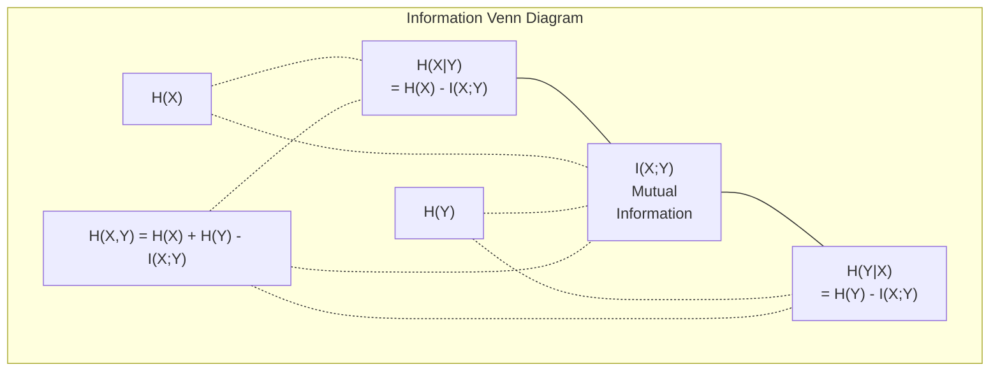

# 정보 이론

> 정보 이론은 놀라움을 측정합니다. 손실 함수는 그 위에 만들어집니다.

**Type:** Learn
**Languages:** Python
**Prerequisites:** Phase 1, Lesson 06 (Probability)
**Time:** ~60 minutes

## 학습 목표

- entropy, cross-entropy, KL divergence를 처음부터 계산하고 그 관계를 설명한다
- cross-entropy loss를 최소화하는 것이 log-likelihood를 최대화하는 것과 왜 동등한지 유도한다
- feature와 target 사이의 mutual information을 계산해 feature importance를 rank한다
- perplexity를 언어 모델이 선택하는 effective vocabulary size로 설명한다

## 문제

훈련하는 모든 classification model에서 `CrossEntropyLoss()`를 호출합니다. 모든 language model paper에서 "perplexity"를 봅니다. VAE, distillation, RLHF에서 KL divergence를 읽습니다. 이들은 서로 끊어진 개념이 아닙니다. 모두 같은 아이디어가 다른 모자를 쓴 것입니다.

정보 이론은 uncertainty, compression, prediction을 추론할 언어를 줍니다. Claude Shannon은 1948년에 communication problem을 해결하기 위해 이를 만들었습니다. 알고 보니 neural network training도 communication problem입니다. model은 learned weights라는 noisy channel을 통해 correct label을 전송하려고 합니다.

이 lesson은 모든 공식을 처음부터 만들어서, 그것들이 어디서 왔고 왜 작동하는지 보이게 합니다.

## 개념

### 정보량(Surprise)

가능성이 낮은 일이 일어나면 더 많은 정보를 담습니다. 동전이 앞면으로 나오는 것? 놀랍지 않습니다. 복권 당첨? 매우 놀랍습니다.

확률 p를 가진 event의 information content는:

```text
I(x) = -log(p(x))
```

log base 2를 쓰면 bits입니다. natural log를 쓰면 nats입니다. 같은 아이디어, 다른 단위입니다.

```text
Event              Probability    Surprise (bits)
Fair coin heads    0.5            1.0
Rolling a 6        0.167          2.58
1-in-1000 event    0.001          9.97
Certain event      1.0            0.0
```

확실한 event는 정보량이 0입니다. 이미 일어날 것을 알고 있었기 때문입니다.

### Entropy(평균 Surprise)

Entropy는 distribution의 가능한 모든 outcome에 대한 expected surprise입니다.

```text
H(P) = -sum( p(x) * log(p(x)) )  for all x
```

fair coin은 binary variable에서 maximum entropy를 가집니다: 1 bit. biased coin(99% heads)은 low entropy입니다: 0.08 bits. 무엇이 일어날지 이미 알고 있으므로, 각 flip은 거의 아무것도 알려주지 않습니다.

```text
Fair coin:    H = -(0.5 * log2(0.5) + 0.5 * log2(0.5)) = 1.0 bit
Biased coin:  H = -(0.99 * log2(0.99) + 0.01 * log2(0.01)) = 0.08 bits
```

Entropy는 distribution에 남아 있는 irreducible uncertainty를 측정합니다. 그 아래로는 압축할 수 없습니다.

### Cross-Entropy(매일 쓰는 손실 함수)

Cross-entropy는 실제로 distribution P에서 나오는 event를 distribution Q로 encode할 때의 average surprise를 측정합니다.

```text
H(P, Q) = -sum( p(x) * log(q(x)) )  for all x
```

P는 true distribution(labels)입니다. Q는 model predictions입니다. Q가 P와 완벽히 일치하면 cross-entropy는 entropy와 같습니다. 어떤 mismatch든 값을 더 크게 만듭니다.

classification에서 P는 one-hot vector입니다(true class는 probability 1, 나머지는 0). 그러면 cross-entropy는 다음처럼 단순해집니다:

```text
H(P, Q) = -log(q(true_class))
```

이것이 classification용 cross-entropy loss 공식 전체입니다. correct class의 predicted probability를 최대화하세요.

### KL Divergence(분포 사이의 거리)

KL divergence는 P 대신 Q를 사용할 때 얼마나 많은 추가 surprise가 생기는지 측정합니다.

```text
D_KL(P || Q) = sum( p(x) * log(p(x) / q(x)) )  for all x
             = H(P, Q) - H(P)
```

Cross-entropy는 entropy plus KL divergence입니다. true distribution의 entropy는 training 중 constant이므로, cross-entropy를 최소화하는 것은 KL divergence를 최소화하는 것과 같습니다. model distribution을 true distribution 쪽으로 밀고 있는 것입니다.

KL divergence는 symmetric하지 않습니다: D_KL(P || Q) != D_KL(Q || P). true distance metric이 아닙니다.

### 상호 정보량

Mutual information은 한 변수를 아는 것이 다른 변수에 대해 얼마나 알려주는지 측정합니다.

```text
I(X; Y) = H(X) - H(X|Y)
        = H(X) + H(Y) - H(X, Y)
```

X와 Y가 independent라면 mutual information은 0입니다. 하나를 알아도 다른 것에 대해 아무것도 알려주지 않습니다. 완벽히 correlated라면 mutual information은 어느 한 변수의 entropy와 같습니다.

feature selection에서 feature와 target 사이의 mutual information이 높다는 것은 그 feature가 유용하다는 뜻입니다. 낮은 mutual information은 noise라는 뜻입니다.

### 조건부 엔트로피

H(Y|X)는 X를 관측한 뒤 Y에 대해 얼마나 uncertainty가 남는지 측정합니다.

```text
H(Y|X) = H(X,Y) - H(X)
```

두 극단:
- X가 Y를 완전히 결정하면 H(Y|X) = 0입니다. X를 알면 Y에 대한 uncertainty가 모두 사라집니다. 예: X = temperature in Celsius, Y = temperature in Fahrenheit.
- X가 Y에 대해 아무것도 알려주지 않으면 H(Y|X) = H(Y)입니다. X를 알아도 uncertainty가 전혀 줄지 않습니다. 예: X = coin flip, Y = tomorrow's weather.

Conditional entropy는 항상 non-negative이고 H(Y)를 넘지 않습니다:

```text
0 <= H(Y|X) <= H(Y)
```

machine learning에서 conditional entropy는 decision tree에 나타납니다. 각 split에서 algorithm은 H(Y|X)를 최소화하는 feature X를 고릅니다. 즉 label Y에 대한 uncertainty를 가장 많이 제거하는 feature입니다.

### 결합 엔트로피

H(X,Y)는 X와 Y를 함께 보는 joint distribution의 entropy입니다.

```text
H(X,Y) = -sum sum p(x,y) * log(p(x,y))   for all x, y
```

핵심 속성:

```text
H(X,Y) <= H(X) + H(Y)
```

X와 Y가 independent일 때 equality가 성립합니다. 정보를 공유하면 joint entropy는 individual entropy의 합보다 작습니다. "missing" entropy가 바로 mutual information입니다.



관계:
- H(X,Y) = H(X) + H(Y|X) = H(Y) + H(X|Y)
- I(X;Y) = H(X) - H(X|Y) = H(Y) - H(Y|X)
- H(X,Y) = H(X) + H(Y) - I(X;Y)

### Mutual Information(심화)

Mutual information I(X;Y)는 한 변수를 아는 것이 다른 변수에 대한 uncertainty를 얼마나 줄이는지 정량화합니다.

```text
I(X;Y) = H(X) - H(X|Y)
       = H(Y) - H(Y|X)
       = H(X) + H(Y) - H(X,Y)
       = sum sum p(x,y) * log(p(x,y) / (p(x) * p(y)))
```

속성:
- I(X;Y) >= 0 always. 무언가를 관측해서 정보를 잃지는 않습니다.
- I(X;Y) = 0 iff X와 Y가 independent입니다.
- I(X;Y) = I(Y;X). KL divergence와 달리 symmetric합니다.
- I(X;X) = H(X). 변수는 자기 자신과 모든 정보를 공유합니다.

**feature selection을 위한 mutual information.** ML에서는 target에 대해 informative한 feature가 필요합니다. Mutual information은 feature를 rank할 principled way를 제공합니다:

1. 각 feature X_i에 대해 target variable Y와의 I(X_i; Y)를 계산합니다.
2. MI score로 feature를 rank합니다.
3. top k features를 유지합니다.

이는 feature와 target 사이의 어떤 관계에도 작동합니다. linear, nonlinear, monotonic 여부와 관계없습니다. correlation은 linear relationship만 잡습니다. MI는 모든 것을 잡습니다.

| Method | Detects | Computational cost | Handles categorical? |
|--------|---------|-------------------|---------------------|
| Pearson correlation | Linear relationships | O(n) | No |
| Spearman correlation | Monotonic relationships | O(n log n) | No |
| Mutual information | Any statistical dependency | O(n log n) with binning | Yes |

### Label Smoothing과 Cross-Entropy

Standard classification은 hard targets를 사용합니다: [0, 0, 1, 0]. true class는 probability 1을 얻고 나머지는 0을 얻습니다. Label smoothing은 이를 soft targets로 바꿉니다:

```text
soft_target = (1 - epsilon) * hard_target + epsilon / num_classes
```

epsilon = 0.1이고 4 classes라면:
- Hard target:  [0, 0, 1, 0]
- Soft target:  [0.025, 0.025, 0.925, 0.025]

정보 이론 관점에서 label smoothing은 target distribution의 entropy를 증가시킵니다. hard one-hot target은 entropy가 0입니다. uncertainty가 없습니다. soft target은 positive entropy를 가집니다.

이것이 도움이 되는 이유:
- model이 logits를 극단값으로 밀어붙이는 것을 막습니다(cross-entropy 아래에서 one-hot target을 완벽히 맞추려면 infinite logits가 필요합니다)
- regularization처럼 작동합니다: model은 100% confident할 수 없습니다
- calibration을 개선합니다: predicted probability가 true uncertainty를 더 잘 반영합니다
- training과 inference behavior 사이의 gap을 줄입니다

label smoothing이 있는 cross-entropy loss는 다음이 됩니다:

```text
L = (1 - epsilon) * CE(hard_target, prediction) + epsilon * H_uniform(prediction)
```

두 번째 항은 uniform에서 먼 prediction을 penalize합니다. confidence에 대한 직접적인 regularization입니다.

### Cross-Entropy가 classification loss인 이유

세 관점, 같은 결론입니다.

**Information theory view.** Cross-entropy는 true distribution 대신 model distribution을 사용할 때 낭비하는 bit 수를 측정합니다. 이를 최소화하면 model은 reality를 가장 효율적으로 encode합니다.

**Maximum likelihood view.** true class y_i를 가진 N개의 training samples에 대해:

```text
Likelihood     = product( q(y_i) )
Log-likelihood = sum( log(q(y_i)) )
Negative log-likelihood = -sum( log(q(y_i)) )
```

마지막 줄이 cross-entropy loss입니다. cross-entropy를 최소화하는 것 = model 아래에서 training data의 likelihood를 최대화하는 것입니다.

**Gradient view.** logits에 대한 cross-entropy의 gradient는 단순히 (predicted - true)입니다. 깔끔하고 안정적이며 계산이 빠릅니다. 그래서 softmax와 완벽하게 짝을 이룹니다.

### Bits와 Nats

차이는 log base뿐입니다.

```text
log base 2   -> bits      (information theory tradition)
log base e   -> nats      (machine learning convention)
log base 10  -> hartleys  (rarely used)
```

1 nat = 1/ln(2) bits = 1.4427 bits. PyTorch와 TensorFlow는 기본적으로 natural log(nats)를 사용합니다.

### Perplexity(혼란도)

Perplexity는 cross-entropy의 exponential입니다. model이 평균적으로 몇 개의 equally likely choices 사이에서 불확실한지 알려줍니다.

```text
Perplexity = 2^H(P,Q)   (if using bits)
Perplexity = e^H(P,Q)   (if using nats)
```

perplexity 50인 language model은 평균적으로 possible next tokens 50개에서 uniform하게 고르는 것만큼 혼란스러운 상태입니다. 낮을수록 좋습니다.

GPT-2는 흔한 benchmark에서 perplexity ~30을 달성했습니다. modern model은 잘 표현된 domain에서 single digits입니다.

```figure
entropy-kl
```

## 직접 만들기

### Step 1: Information content와 entropy

```python
import math

def information_content(p, base=2):
    if p <= 0 or p > 1:
        return float('inf') if p <= 0 else 0.0
    return -math.log(p) / math.log(base)

def entropy(probs, base=2):
    return sum(
        p * information_content(p, base)
        for p in probs if p > 0
    )

fair_coin = [0.5, 0.5]
biased_coin = [0.99, 0.01]
fair_die = [1/6] * 6

print(f"Fair coin entropy:   {entropy(fair_coin):.4f} bits")
print(f"Biased coin entropy: {entropy(biased_coin):.4f} bits")
print(f"Fair die entropy:    {entropy(fair_die):.4f} bits")
```

### Step 2: Cross-entropy와 KL divergence

```python
def cross_entropy(p, q, base=2):
    total = 0.0
    for pi, qi in zip(p, q):
        if pi > 0:
            if qi <= 0:
                return float('inf')
            total += pi * (-math.log(qi) / math.log(base))
    return total

def kl_divergence(p, q, base=2):
    return cross_entropy(p, q, base) - entropy(p, base)

true_dist = [0.7, 0.2, 0.1]
good_model = [0.6, 0.25, 0.15]
bad_model = [0.1, 0.1, 0.8]

print(f"Entropy of true dist:     {entropy(true_dist):.4f} bits")
print(f"CE (good model):          {cross_entropy(true_dist, good_model):.4f} bits")
print(f"CE (bad model):           {cross_entropy(true_dist, bad_model):.4f} bits")
print(f"KL divergence (good):     {kl_divergence(true_dist, good_model):.4f} bits")
print(f"KL divergence (bad):      {kl_divergence(true_dist, bad_model):.4f} bits")
```

### Step 3: classification loss로서의 Cross-entropy

```python
def softmax(logits):
    max_logit = max(logits)
    exps = [math.exp(z - max_logit) for z in logits]
    total = sum(exps)
    return [e / total for e in exps]

def cross_entropy_loss(true_class, logits):
    probs = softmax(logits)
    return -math.log(probs[true_class])

logits = [2.0, 1.0, 0.1]
true_class = 0

probs = softmax(logits)
loss = cross_entropy_loss(true_class, logits)

print(f"Logits:      {logits}")
print(f"Softmax:     {[f'{p:.4f}' for p in probs]}")
print(f"True class:  {true_class}")
print(f"Loss:        {loss:.4f} nats")
print(f"Perplexity:  {math.exp(loss):.2f}")
```

### Step 4: Cross-entropy는 negative log-likelihood와 같다

```python
import random

random.seed(42)

n_samples = 1000
n_classes = 3
true_labels = [random.randint(0, n_classes - 1) for _ in range(n_samples)]
model_logits = [[random.gauss(0, 1) for _ in range(n_classes)] for _ in range(n_samples)]

ce_loss = sum(
    cross_entropy_loss(label, logits)
    for label, logits in zip(true_labels, model_logits)
) / n_samples

nll = -sum(
    math.log(softmax(logits)[label])
    for label, logits in zip(true_labels, model_logits)
) / n_samples

print(f"Cross-entropy loss:      {ce_loss:.6f}")
print(f"Negative log-likelihood: {nll:.6f}")
print(f"Difference:              {abs(ce_loss - nll):.2e}")
```

### Step 5: 상호 정보량

```python
def mutual_information(joint_probs, base=2):
    rows = len(joint_probs)
    cols = len(joint_probs[0])

    margin_x = [sum(joint_probs[i][j] for j in range(cols)) for i in range(rows)]
    margin_y = [sum(joint_probs[i][j] for i in range(rows)) for j in range(cols)]

    mi = 0.0
    for i in range(rows):
        for j in range(cols):
            pxy = joint_probs[i][j]
            if pxy > 0:
                mi += pxy * math.log(pxy / (margin_x[i] * margin_y[j])) / math.log(base)
    return mi

independent = [[0.25, 0.25], [0.25, 0.25]]
dependent = [[0.45, 0.05], [0.05, 0.45]]

print(f"MI (independent): {mutual_information(independent):.4f} bits")
print(f"MI (dependent):   {mutual_information(dependent):.4f} bits")
```

## 사용하기

실무에서 쓰게 될 방식인 NumPy로 같은 개념을 구현하면:

```python
import numpy as np

def np_entropy(p):
    p = np.asarray(p, dtype=float)
    mask = p > 0
    result = np.zeros_like(p)
    result[mask] = p[mask] * np.log(p[mask])
    return -result.sum()

def np_cross_entropy(p, q):
    p, q = np.asarray(p, dtype=float), np.asarray(q, dtype=float)
    mask = p > 0
    return -(p[mask] * np.log(q[mask])).sum()

def np_kl_divergence(p, q):
    return np_cross_entropy(p, q) - np_entropy(p)

true = np.array([0.7, 0.2, 0.1])
pred = np.array([0.6, 0.25, 0.15])
print(f"Entropy:    {np_entropy(true):.4f} nats")
print(f"Cross-ent:  {np_cross_entropy(true, pred):.4f} nats")
print(f"KL div:     {np_kl_divergence(true, pred):.4f} nats")
```

당신은 `torch.nn.CrossEntropyLoss()`가 내부적으로 하는 일을 처음부터 만들었습니다. 이제 training 중 loss가 왜 내려가는지 압니다. model의 predicted distribution이 true distribution에 더 가까워지고 있으며, 이는 낭비된 정보의 nats로 측정됩니다.

## 연습문제

1. English alphabet이 uniform distribution(26 letters)이라고 가정하고 entropy를 계산하세요. 그런 다음 실제 letter frequency를 사용해 추정하세요. 어느 쪽이 더 높고 왜 그런가요?

2. model이 true class 1인 sample에 대해 logits [5.0, 2.0, 0.5]를 출력합니다. cross-entropy loss를 손으로 계산한 다음 `cross_entropy_loss` 함수로 검증하세요. 어떤 logits가 zero loss를 만들까요?

3. KL divergence가 symmetric하지 않음을 보이세요. distribution P와 Q를 선택하고 D_KL(P || Q)와 D_KL(Q || P)를 계산하세요. 왜 다른지 설명하세요.

4. token prediction sequence의 perplexity를 계산하는 함수를 만드세요. (true_token_index, predicted_logits) pair 목록이 주어지면 sequence의 perplexity를 반환하세요.

## 핵심 용어

| 용어 | 흔히 하는 말 | 실제 의미 |
|------|----------------|----------------------|
| Information content | "Surprise" | event를 encode하는 데 필요한 bits(또는 nats)의 수: -log(p) |
| Entropy | "Randomness" | distribution의 모든 outcome에 대한 average surprise입니다. irreducible uncertainty를 측정합니다. |
| Cross-entropy | "손실 함수" | true distribution P의 event를 model distribution Q로 encode할 때의 average surprise입니다. |
| KL divergence | "분포 사이 거리" | P 대신 Q를 사용해서 낭비하는 extra bits입니다. cross-entropy minus entropy와 같습니다. symmetric하지 않습니다. |
| Mutual information | "X와 Y가 얼마나 관련 있는지" | Y를 아는 것으로 X에 대한 uncertainty가 줄어드는 양입니다. 0이면 independent입니다. |
| Softmax | "logits를 probabilities로 바꾸기" | 지수화하고 normalize합니다. 어떤 real-valued vector든 valid probability distribution으로 매핑합니다. |
| Perplexity | "model이 얼마나 혼란스러운지" | cross-entropy의 exponential입니다. 각 step에서 model이 고르는 effective vocabulary size입니다. |
| Bits | "Shannon의 단위" | log base 2로 측정한 정보입니다. one bit는 fair coin flip 하나를 해결합니다. |
| Nats | "ML의 단위" | natural log로 측정한 정보입니다. PyTorch와 TensorFlow가 기본적으로 사용합니다. |
| Negative log-likelihood | "NLL loss" | one-hot label에서는 cross-entropy loss와 동일합니다. 이를 최소화하면 correct prediction의 probability를 최대화합니다. |

## 더 읽을거리

- [Shannon 1948: A Mathematical Theory of Communication](https://people.math.harvard.edu/~ctm/home/text/others/shannon/entropy/entropy.pdf) - 원 논문이며 지금도 읽기 좋습니다
- [Visual Information Theory (Chris Olah)](https://colah.github.io/posts/2015-09-Visual-Information/) - entropy와 KL divergence에 대한 최고의 시각적 설명
- [PyTorch CrossEntropyLoss docs](https://pytorch.org/docs/stable/generated/torch.nn.CrossEntropyLoss.html) - 방금 만든 것을 framework가 어떻게 구현하는지
