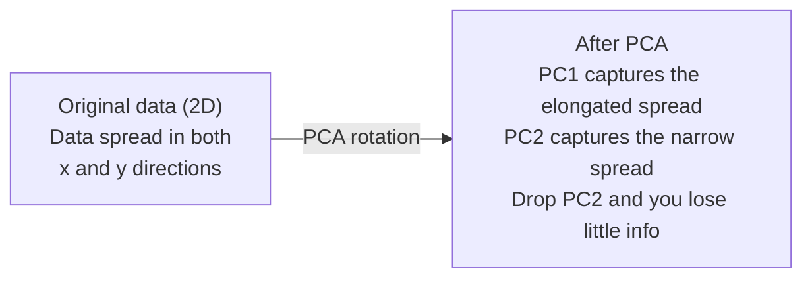

# 차원 축소

> 고차원 데이터에는 구조가 있습니다. 올바른 각도에서 보면 그것을 찾을 수 있습니다.

**Type:** Build
**Languages:** Python
**Prerequisites:** Phase 1, Lessons 01 (Linear Algebra Intuition), 02 (Vectors, Matrices & Operations), 03 (Eigenvalues & Eigenvectors), 06 (Probability & Distributions)
**Time:** ~90 minutes

## 학습 목표

- PCA를 처음부터 구현한다: data centering, covariance matrix 계산, eigendecomposition, projection
- explained variance ratio와 elbow method를 사용해 principal component 수를 선택한다
- MNIST digits를 2D로 시각화하기 위해 PCA, t-SNE, UMAP을 비교하고 tradeoff를 설명한다
- RBF kernel을 사용하는 kernel PCA를 적용해 standard PCA로는 처리할 수 없는 nonlinear data structure를 분리한다

## 문제

sample마다 784개 feature가 있는 dataset이 있습니다. 손글씨 숫자의 pixel value일 수도 있습니다. gene expression level일 수도 있습니다. user behavior signal일 수도 있습니다. 784차원은 시각화할 수 없습니다. plot할 수 없습니다. 생각하기도 어렵습니다.

하지만 그 784개 feature의 대부분은 redundant합니다. 실제 정보는 훨씬 작은 surface 위에 있습니다. 손글씨 "7"을 설명하는 데 784개의 독립 숫자는 필요하지 않습니다. 몇 개면 됩니다: stroke의 angle, crossbar의 length, 얼마나 기울었는지. 나머지는 noise입니다.

Dimensionality reduction은 그 작은 surface를 찾습니다. 784-dimensional data를 2, 10, 또는 50 dimensions로 압축하면서 중요한 structure를 유지합니다.

## 개념

### 차원의 저주

High-dimensional space는 직관적이지 않습니다. dimension이 커지면 세 가지가 깨집니다.

**Distance becomes meaningless.** high dimension에서는 두 random point 사이의 distance가 같은 값으로 수렴합니다. 모든 point가 다른 모든 point에서 거의 같은 distance에 있다면 nearest-neighbor search는 작동하지 않기 시작합니다.

```text
Dimension    Avg distance ratio (max/min between random points)
2            ~5.0
10           ~1.8
100          ~1.2
1000         ~1.02
```

**Volume concentrates in corners.** d dimensions의 unit hypercube에는 2^d개의 corner가 있습니다. 100 dimensions에서는 거의 모든 volume이 center에서 먼 corner에 있습니다. data point는 edge로 퍼지고 model은 interior의 data에 굶주립니다.

**You need exponentially more data.** space에서 같은 sample density를 유지하려면, 2D에서 20D로 가는 순간 10^18배 더 많은 data가 필요합니다. 충분한 data는 없습니다. dimension을 줄이면 data density를 다시 다룰 수 있는 수준으로 되돌립니다.

### PCA: 중요한 방향 찾기

Principal Component Analysis(PCA)는 data가 가장 많이 변하는 axis를 찾습니다. coordinate system을 회전하여 첫 번째 axis가 가장 많은 variance를, 두 번째가 그다음 variance를 포착하게 합니다.

알고리즘:

```text
1. Center the data        (subtract the mean from each feature)
2. Compute covariance     (how features move together)
3. Eigendecomposition     (find the principal directions)
4. Sort by eigenvalue     (biggest variance first)
5. Project               (keep top k eigenvectors, drop the rest)
```

왜 eigendecomposition일까요? covariance matrix는 symmetric하고 positive semi-definite입니다. eigenvector는 feature space의 orthogonal direction입니다. eigenvalue는 각 direction이 얼마나 많은 variance를 포착하는지 알려줍니다. 가장 큰 eigenvalue를 가진 eigenvector는 maximum variance direction을 가리킵니다.



- **Before PCA:** data cloud가 x axis와 y axis 모두에 걸쳐 대각선으로 퍼져 있습니다
- **After PCA:** coordinate system이 회전되어 PC1은 maximum variance direction(elongated spread)에, PC2는 minimum variance direction(narrow spread)에 정렬됩니다
- **Dimensionality reduction:** PC2를 버리면 data를 PC1 위로 project하며, 아주 적은 정보만 잃습니다

### 설명된 분산 비율

각 principal component는 total variance의 일부를 포착합니다. explained variance ratio가 그 양을 알려줍니다.

```text
Component    Eigenvalue    Explained ratio    Cumulative
PC1          4.73          0.473              0.473
PC2          2.51          0.251              0.724
PC3          1.12          0.112              0.836
PC4          0.89          0.089              0.925
...
```

cumulative explained variance가 0.95에 도달하면, 그만큼의 component가 정보의 95%를 포착한다는 뜻입니다. 그 뒤는 대부분 noise입니다.

### component 수 선택하기

세 가지 전략:

1. **Threshold.** variance의 90-95%를 설명할 만큼 component를 유지합니다.
2. **Elbow method.** component별 explained variance를 plot합니다. 급격한 drop-off를 찾습니다.
3. **Downstream performance.** PCA를 preprocessing으로 사용합니다. k를 sweep하고 model accuracy를 측정합니다. accuracy가 plateau되는 지점이 best k입니다.

### t-SNE: neighborhood 보존

t-Distributed Stochastic Neighbor Embedding(t-SNE)은 visualization을 위해 설계되었습니다. 어떤 point들이 서로 가까운지 보존하면서 high-dimensional data를 2D(또는 3D)로 map합니다.

직관: original space에서 point pair 사이의 distance를 기반으로 probability distribution을 계산합니다. 가까운 point는 높은 probability를 얻고 먼 point는 낮은 probability를 얻습니다. 그런 다음 같은 probability distribution이 성립하는 2D arrangement를 찾습니다. 784 dimensions에서 neighbor였던 point가 2D에서도 neighbor로 남습니다.

t-SNE의 핵심 속성:
- Non-linear. PCA가 풀 수 없는 complex manifold를 펼칠 수 있습니다.
- Stochastic. run마다 다른 layout을 생성합니다.
- Perplexity parameter는 고려할 neighbor 수를 제어합니다(typical range: 5-50).
- output에서 cluster 사이의 distance는 의미가 없습니다. cluster 자체만 의미가 있습니다.
- large dataset에서는 느립니다. 기본적으로 O(n^2)입니다.

### UMAP: 더 빠르고 더 나은 global structure

Uniform Manifold Approximation and Projection(UMAP)은 t-SNE와 비슷하게 작동하지만 두 가지 장점이 있습니다:
- Faster. 모든 pairwise distance를 계산하는 대신 approximate nearest-neighbor graph를 사용합니다.
- Better global structure. output에서 cluster의 relative position이 t-SNE보다 더 의미 있는 경향이 있습니다.

UMAP은 high-dimensional space에서 weighted graph("fuzzy topological representation")를 만들고, 이 graph를 가능한 잘 보존하는 low-dimensional layout을 찾습니다.

핵심 parameter:
- `n_neighbors`: local structure를 정의하는 neighbor 수(perplexity와 유사). 값이 높을수록 더 많은 global structure를 보존합니다.
- `min_dist`: output에서 point가 얼마나 촘촘히 모이는지입니다. 값이 낮을수록 더 dense한 cluster를 만듭니다.

### 무엇을 언제 쓸까

| Method | Use case | Preserves | Speed |
|--------|----------|-----------|-------|
| PCA | Preprocessing before training | Global variance | Fast (exact), works on millions of samples |
| PCA | Quick exploratory visualization | Linear structure | Fast |
| t-SNE | Publication-quality 2D plots | Local neighborhoods | Slow (< 10k samples ideal) |
| UMAP | 2D visualization at scale | Local + some global structure | Medium (handles millions) |
| PCA | Feature reduction for models | Variance-ranked features | Fast |
| t-SNE / UMAP | Understanding cluster structure | Cluster separation | Medium to slow |

경험칙: preprocessing과 data compression에는 PCA를 사용하세요. 2D structure를 시각화해야 할 때 t-SNE나 UMAP을 사용하세요.

### Kernel PCA(커널 PCA)

Standard PCA는 linear subspace를 찾습니다. coordinate system을 회전하고 axis를 버립니다. 하지만 data가 nonlinear manifold 위에 있다면 어떨까요? 2D의 circle은 어떤 line으로도 분리할 수 없습니다. Standard PCA는 도움이 되지 않습니다.

Kernel PCA는 kernel function이 유도하는 high-dimensional feature space에서 PCA를 적용합니다. 그 공간의 coordinate를 명시적으로 계산하지 않습니다. 이것이 kernel trick입니다. SVM 뒤에 있는 것과 같은 아이디어입니다.

알고리즘:
1. K_ij = k(x_i, x_j)인 kernel matrix K를 계산합니다
2. feature space에서 kernel matrix를 center합니다
3. centered kernel matrix를 eigendecompose합니다
4. top eigenvectors(1/sqrt(eigenvalue)로 scaled)가 projection입니다

흔한 kernel function:

| Kernel | Formula | Good for |
|--------|---------|----------|
| RBF (Gaussian) | exp(-gamma * \|\|x - y\|\|^2) | Most nonlinear data, smooth manifolds |
| Polynomial | (x . y + c)^d | Polynomial relationships |
| Sigmoid | tanh(alpha * x . y + c) | Neural network-like mappings |

kernel PCA와 standard PCA를 언제 쓸지:

| Criterion | Standard PCA | Kernel PCA |
|-----------|-------------|------------|
| Data structure | Linear subspace | Nonlinear manifold |
| Speed | O(min(n^2 d, d^2 n)) | O(n^2 d + n^3) |
| Interpretability | Components are linear combinations of features | Components lack direct feature interpretation |
| Scalability | Works on millions of samples | Kernel matrix is n x n, memory-limited |
| Reconstruction | Direct inverse transform | Requires pre-image approximation |

고전적 예시는 2D의 concentric circles입니다. 두 개의 ring of points가 하나는 안쪽, 하나는 바깥쪽에 있습니다. Standard PCA는 둘을 같은 line 위로 project합니다. classification에는 쓸모가 없습니다. RBF kernel을 사용한 kernel PCA는 inner circle과 outer circle을 다른 region으로 map하여 linearly separable하게 만듭니다.

### 재구성 오차

dimensionality reduction이 얼마나 좋은지 어떻게 알까요? 784 dimensions를 50으로 압축했습니다. 무엇을 잃었을까요?

reconstruction error를 측정합니다:
1. data를 k dimensions로 project: X_reduced = X @ W_k
2. reconstruct: X_hat = X_reduced @ W_k^T
3. MSE 계산: mean((X - X_hat)^2)

PCA에서 reconstruction error는 explained variance와 깔끔한 관계를 가집니다:

```text
Reconstruction error = sum of eigenvalues NOT included
Total variance = sum of ALL eigenvalues
Fraction lost = (sum of dropped eigenvalues) / (sum of all eigenvalues)
```

각 component의 explained variance ratio는:

```text
explained_ratio_k = eigenvalue_k / sum(all eigenvalues)
```

number of components에 대해 cumulative explained variance를 plot하면 "elbow" curve가 나옵니다. 올바른 component 수는 다음 기준 중 하나입니다:
- curve가 flatten됩니다(diminishing returns)
- cumulative variance가 threshold를 넘습니다(보통 0.90 또는 0.95)
- downstream task performance가 plateau됩니다

Reconstruction error는 k를 고르는 것 이상의 용도로도 유용합니다. anomaly detection에 사용할 수 있습니다. reconstruction error가 높은 sample은 learned subspace에 맞지 않는 outlier입니다. 이것이 production system에서 PCA-based anomaly detection의 기반입니다.

```figure
pca-axes
```

## 직접 만들기

### Step 1: PCA를 처음부터 만들기

```python
import numpy as np

class PCA:
    def __init__(self, n_components):
        self.n_components = n_components
        self.components = None
        self.mean = None
        self.eigenvalues = None
        self.explained_variance_ratio_ = None

    def fit(self, X):
        self.mean = np.mean(X, axis=0)
        X_centered = X - self.mean

        cov_matrix = np.cov(X_centered, rowvar=False)

        eigenvalues, eigenvectors = np.linalg.eigh(cov_matrix)

        sorted_idx = np.argsort(eigenvalues)[::-1]
        eigenvalues = eigenvalues[sorted_idx]
        eigenvectors = eigenvectors[:, sorted_idx]

        self.components = eigenvectors[:, :self.n_components].T
        self.eigenvalues = eigenvalues[:self.n_components]
        total_var = np.sum(eigenvalues)
        self.explained_variance_ratio_ = self.eigenvalues / total_var

        return self

    def transform(self, X):
        X_centered = X - self.mean
        return X_centered @ self.components.T

    def fit_transform(self, X):
        self.fit(X)
        return self.transform(X)
```

### Step 2: synthetic data로 테스트하기

```python
np.random.seed(42)
n_samples = 500

t = np.random.uniform(0, 2 * np.pi, n_samples)
x1 = 3 * np.cos(t) + np.random.normal(0, 0.2, n_samples)
x2 = 3 * np.sin(t) + np.random.normal(0, 0.2, n_samples)
x3 = 0.5 * x1 + 0.3 * x2 + np.random.normal(0, 0.1, n_samples)

X_synthetic = np.column_stack([x1, x2, x3])

pca = PCA(n_components=2)
X_reduced = pca.fit_transform(X_synthetic)

print(f"Original shape: {X_synthetic.shape}")
print(f"Reduced shape:  {X_reduced.shape}")
print(f"Explained variance ratios: {pca.explained_variance_ratio_}")
print(f"Total variance captured: {sum(pca.explained_variance_ratio_):.4f}")
```

### Step 3: 2D의 MNIST digits

```python
from sklearn.datasets import fetch_openml

mnist = fetch_openml("mnist_784", version=1, as_frame=False, parser="auto")
X_mnist = mnist.data[:5000].astype(float)
y_mnist = mnist.target[:5000].astype(int)

pca_mnist = PCA(n_components=50)
X_pca50 = pca_mnist.fit_transform(X_mnist)
print(f"50 components capture {sum(pca_mnist.explained_variance_ratio_):.2%} of variance")

pca_2d = PCA(n_components=2)
X_pca2d = pca_2d.fit_transform(X_mnist)
print(f"2 components capture {sum(pca_2d.explained_variance_ratio_):.2%} of variance")
```

### Step 4: sklearn과 비교하기

```python
from sklearn.decomposition import PCA as SklearnPCA
from sklearn.manifold import TSNE

sklearn_pca = SklearnPCA(n_components=2)
X_sklearn_pca = sklearn_pca.fit_transform(X_mnist)

print(f"\nOur PCA explained variance:     {pca_2d.explained_variance_ratio_}")
print(f"Sklearn PCA explained variance: {sklearn_pca.explained_variance_ratio_}")

diff = np.abs(np.abs(X_pca2d) - np.abs(X_sklearn_pca))
print(f"Max absolute difference: {diff.max():.10f}")

tsne = TSNE(n_components=2, perplexity=30, random_state=42)
X_tsne = tsne.fit_transform(X_mnist)
print(f"\nt-SNE output shape: {X_tsne.shape}")
```

### Step 5: UMAP 비교

```python
try:
    from umap import UMAP

    reducer = UMAP(n_components=2, n_neighbors=15, min_dist=0.1, random_state=42)
    X_umap = reducer.fit_transform(X_mnist)
    print(f"UMAP output shape: {X_umap.shape}")
except ImportError:
    print("Install umap-learn: pip install umap-learn")
```

## 사용하기

classifier 전 preprocessing으로 PCA 사용하기:

```python
from sklearn.decomposition import PCA as SklearnPCA
from sklearn.linear_model import LogisticRegression
from sklearn.model_selection import train_test_split
from sklearn.metrics import accuracy_score

X_train, X_test, y_train, y_test = train_test_split(
    X_mnist, y_mnist, test_size=0.2, random_state=42
)

results = {}
for k in [10, 30, 50, 100, 200]:
    pca_k = SklearnPCA(n_components=k)
    X_tr = pca_k.fit_transform(X_train)
    X_te = pca_k.transform(X_test)

    clf = LogisticRegression(max_iter=1000, random_state=42)
    clf.fit(X_tr, y_train)
    acc = accuracy_score(y_test, clf.predict(X_te))
    var_captured = sum(pca_k.explained_variance_ratio_)
    results[k] = (acc, var_captured)
    print(f"k={k:>3d}  accuracy={acc:.4f}  variance={var_captured:.4f}")
```

performance는 784 dimensions 훨씬 전에 plateau됩니다. 그 plateau가 당신의 operating point입니다.

## 배포하기

이 lesson은 다음을 만듭니다:
- `outputs/skill-dimensionality-reduction.md` - 주어진 task에 맞는 dimensionality reduction technique을 고르기 위한 skill

## 연습문제

1. PCA class가 `inverse_transform`을 지원하도록 수정하세요. 10, 50, 200 components에서 MNIST digits를 reconstruct하세요. 각각에 대해 reconstruction error(original과의 mean squared difference)를 print하세요.

2. 같은 MNIST subset에서 perplexity 값 5, 30, 100으로 t-SNE를 실행하세요. output이 어떻게 변하는지 설명하세요. perplexity가 왜 cluster tightness에 영향을 주나요?

3. feature가 50개이고 그중 5개만 informative한 dataset을 가져오세요(`sklearn.datasets.make_classification`으로 생성). PCA를 적용하고 explained variance curve가 data가 사실상 5-dimensional임을 올바르게 식별하는지 확인하세요.

## 핵심 용어

| 용어 | 흔히 하는 말 | 실제 의미 |
|------|----------------|----------------------|
| Curse of dimensionality | "feature가 너무 많다" | dimension이 커질수록 distance, volume, data density가 모두 직관에 반하게 행동합니다. model은 이를 보상하기 위해 exponentially more data가 필요합니다. |
| PCA | "dimension 줄이기" | coordinate system을 회전해 axis가 maximum variance direction과 정렬되게 한 다음 low-variance axis를 버립니다. |
| Principal component | "중요한 방향" | covariance matrix의 eigenvector입니다. data가 가장 많이 변하는 feature space의 direction입니다. |
| Explained variance ratio | "이 component에 info가 얼마나 있는지" | 한 principal component가 포착한 total variance의 fraction입니다. top k ratio를 합하면 k components가 얼마나 보존하는지 알 수 있습니다. |
| Covariance matrix | "feature가 어떻게 correlate되는지" | entry (i,j)가 feature i와 feature j가 함께 어떻게 움직이는지 측정하는 symmetric matrix입니다. diagonal entry는 individual variance입니다. |
| t-SNE | "그 cluster plot" | pairwise neighborhood probability를 보존해 high-dimensional data를 2D로 map하는 nonlinear method입니다. preprocessing이 아니라 visualization에 좋습니다. |
| UMAP | "더 빠른 t-SNE" | topological data analysis에 기반한 nonlinear method입니다. local structure와 일부 global structure를 모두 보존합니다. t-SNE보다 더 잘 scale됩니다. |
| Perplexity | "t-SNE knob" | 각 point가 고려하는 effective number of neighbors를 제어합니다. low perplexity는 매우 local structure에 집중합니다. high perplexity는 더 넓은 pattern을 포착합니다. |
| Manifold | "data가 놓인 surface" | high-dimensional space에 embedded된 lower-dimensional surface입니다. 3D에서 구겨진 종이는 2D manifold입니다. |

## 더 읽을거리

- [A Tutorial on Principal Component Analysis](https://arxiv.org/abs/1404.1100) (Shlens) - PCA를 처음부터 명확히 유도합니다
- [How to Use t-SNE Effectively](https://distill.pub/2016/misread-tsne/) (Wattenberg et al.) - t-SNE 함정과 parameter choice에 대한 interactive guide
- [UMAP documentation](https://umap-learn.readthedocs.io/) - UMAP authors가 제공하는 theory와 practical guidance
