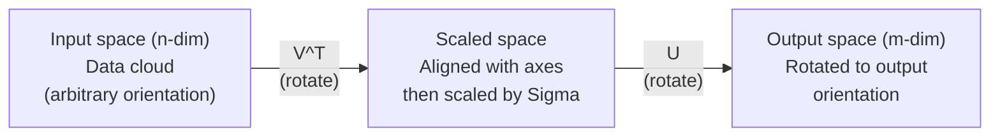
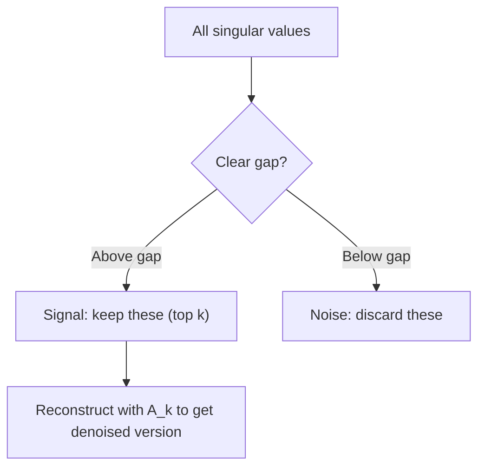

# 특이값 분해

> SVD는 선형대수의 Swiss Army knife입니다. 모든 행렬은 SVD를 가집니다. 모든 data scientist는 SVD가 필요합니다.

**Type:** Build
**Languages:** Python, Julia
**Prerequisites:** Phase 1, Lessons 01 (Linear Algebra Intuition), 02 (Vectors & Matrices Operations), 03 (Matrix Transformations)
**Time:** ~120 minutes

## 학습 목표

- power iteration으로 SVD를 구현하고 U, Sigma, V^T의 기하학적 의미 설명하기
- image compression에 truncated SVD를 적용하고 compression ratio와 reconstruction error 측정하기
- SVD로 Moore-Penrose pseudoinverse를 계산해 overdetermined least-squares system 풀기
- SVD를 PCA, recommendation systems(latent factors), NLP의 Latent Semantic Analysis와 연결하기

## 문제

1000x2000 행렬이 있습니다. user-movie ratings일 수도 있습니다. document-term frequency table일 수도 있습니다. 이미지의 pixel values일 수도 있습니다. 이 행렬을 압축하거나, denoise하거나, 숨은 구조를 찾거나, least-squares system을 풀어야 합니다. Eigendecomposition은 정사각 행렬에서만 작동합니다. 그 경우에도 행렬이 선형 독립 eigenvectors의 완전한 집합을 가져야 합니다.

SVD는 어떤 행렬에도 작동합니다. 어떤 shape든 됩니다. 어떤 rank든 됩니다. 조건이 없습니다. SVD는 행렬을 세 인자로 분해하여 그 행렬이 공간에 무엇을 하는지의 기하를 드러냅니다. 선형대수 전체에서 가장 일반적이고 가장 유용한 factorization입니다.

## 개념

### SVD가 기하학적으로 하는 일

모든 행렬은 shape와 무관하게 세 연산을 순서대로 수행합니다: rotate, scale, rotate. SVD는 이 분해를 명시적으로 만듭니다.

```text
A = U * Sigma * V^T

      m x n     m x m    m x n    n x n
     (any)    (rotate)  (scale)  (rotate)
```

어떤 행렬 A가 주어지든 SVD는 이를 다음으로 분해합니다.
- V^T는 input space(n-dimensional)의 vector를 회전합니다
- Sigma는 각 axis를 따라 scale합니다(stretch 또는 compress)
- U는 결과를 output space(m-dimensional)로 회전합니다



이렇게 생각하세요. SVD에 행렬을 건네면 SVD는 이렇게 말합니다. "이 행렬은 입력의 sphere를 먼저 V^T로 회전하고, Sigma로 ellipsoid로 늘린 다음, U로 그 ellipsoid를 회전합니다." singular values는 ellipsoid axis의 길이입니다.

### 전체 분해

shape가 m x n인 행렬 A에 대해:

```text
A = U * Sigma * V^T

where:
  U     is m x m, orthogonal (U^T U = I)
  Sigma is m x n, diagonal (singular values on the diagonal)
  V     is n x n, orthogonal (V^T V = I)

The singular values sigma_1 >= sigma_2 >= ... >= sigma_r > 0
where r = rank(A)
```

U의 columns를 left singular vectors라고 합니다. V의 columns를 right singular vectors라고 합니다. Sigma의 diagonal entries를 singular values라고 합니다. singular values는 항상 non-negative이며 관례적으로 decreasing order로 정렬됩니다.

### 왼쪽 특이벡터, 특이값, 오른쪽 특이벡터

SVD의 각 component는 서로 다른 기하학적 의미를 가집니다.

**Right singular vectors (columns of V):** input space(R^n)의 orthonormal basis를 이룹니다. 행렬이 output space의 orthogonal directions로 보내는 input space의 방향입니다. domain의 자연스러운 coordinate system이라고 생각하세요.

**Singular values (diagonal of Sigma):** scaling factors입니다. i-th singular value는 행렬이 i-th right singular vector 방향의 vector를 얼마나 늘리는지 알려줍니다. singular value가 0이면 행렬이 그 방향을 완전히 눌러 없앤다는 뜻입니다.

**Left singular vectors (columns of U):** output space(R^m)의 orthonormal basis를 이룹니다. i-th left singular vector는 i-th right singular vector가 scaling 후 도착하는 output space의 방향입니다.

둘 사이의 관계:

```text
A * v_i = sigma_i * u_i

The matrix A takes the i-th right singular vector v_i,
scales it by sigma_i, and maps it to the i-th left singular vector u_i.
```

이 관계는 어떤 행렬이 무엇을 하는지 coordinate별 그림을 제공합니다.

### 외적 형태

SVD는 rank-1 matrices의 합으로 쓸 수 있습니다.

```text
A = sigma_1 * u_1 * v_1^T + sigma_2 * u_2 * v_2^T + ... + sigma_r * u_r * v_r^T

Each term sigma_i * u_i * v_i^T is a rank-1 matrix (an outer product).
The full matrix is the sum of r such matrices, where r is the rank.
```

이 형태는 low-rank approximation의 기초입니다. 각 항은 구조의 한 layer를 더합니다. 첫 항은 가장 중요한 단일 패턴을 포착합니다. 두 번째 항은 그다음으로 중요한 패턴을 포착합니다. 이런 식으로 이어집니다. 이 합을 자르면 주어진 rank에서 가능한 최선의 approximation을 얻습니다.

```text
Rank-1 approx:    A_1 = sigma_1 * u_1 * v_1^T
                  (captures the dominant pattern)

Rank-2 approx:    A_2 = sigma_1 * u_1 * v_1^T + sigma_2 * u_2 * v_2^T
                  (captures the two most important patterns)

Rank-k approx:    A_k = sum of top k terms
                  (optimal by the Eckart-Young theorem)
```

### eigendecomposition과의 관계

SVD와 eigendecomposition은 깊게 연결되어 있습니다. A의 singular values와 vectors는 A^T A와 A A^T의 eigenvalues와 eigenvectors에서 직접 나옵니다.

```text
A^T A = V * Sigma^T * U^T * U * Sigma * V^T
      = V * Sigma^T * Sigma * V^T
      = V * D * V^T

where D = Sigma^T * Sigma is a diagonal matrix with sigma_i^2 on the diagonal.

So:
- The right singular vectors (V) are eigenvectors of A^T A
- The singular values squared (sigma_i^2) are eigenvalues of A^T A

Similarly:
A A^T = U * Sigma * V^T * V * Sigma^T * U^T
      = U * Sigma * Sigma^T * U^T

So:
- The left singular vectors (U) are eigenvectors of A A^T
- The eigenvalues of A A^T are also sigma_i^2
```

이 연결은 세 가지를 알려줍니다.
1. Singular values는 항상 real이고 non-negative입니다(positive semi-definite matrix의 eigenvalues의 square root이기 때문).
2. A^T A의 eigendecomposition으로 SVD를 계산할 수도 있지만, 이는 condition number를 제곱하고 수치 정밀도를 잃습니다. 전용 SVD algorithm은 이를 피합니다.
3. A가 square이고 symmetric positive semi-definite이면 SVD와 eigendecomposition은 같은 것입니다.

### Truncated SVD: 저랭크 근사

Eckart-Young-Mirsky theorem은 A에 대한 최선의 rank-k approximation(Frobenius norm과 spectral norm 모두)이 상위 k개 singular values와 해당 vectors만 유지해 얻어진다고 말합니다.

```text
A_k = U_k * Sigma_k * V_k^T

where:
  U_k     is m x k  (first k columns of U)
  Sigma_k is k x k  (top-left k x k block of Sigma)
  V_k     is n x k  (first k columns of V)

Approximation error = sigma_{k+1}  (in spectral norm)
                    = sqrt(sigma_{k+1}^2 + ... + sigma_r^2)  (in Frobenius norm)
```

이것은 단지 "좋은" approximation이 아닙니다. rank k에서 증명 가능한 최선의 approximation입니다. 어떤 다른 rank-k matrix도 A에 더 가깝지 않습니다.

| Component | Relative magnitude | Kept in rank-3 approx? |
|-----------|-------------------|------------------------|
| sigma_1 | Largest | Yes |
| sigma_2 | Large | Yes |
| sigma_3 | Medium-large | Yes |
| sigma_4 | Medium | No (error) |
| sigma_5 | Medium-small | No (error) |
| sigma_6 | Small | No (error) |
| sigma_7 | Very small | No (error) |
| sigma_8 | Tiny | No (error) |

상위 3개를 유지하면 A_3가 세 개의 가장 큰 singular values를 포착합니다. Error = 남은 값(sigma_4부터 sigma_8까지)입니다.

singular values가 빠르게 감소하면 작은 k가 행렬 대부분을 포착합니다. 천천히 감소하면 행렬에는 low-rank structure가 없습니다.

### SVD를 이용한 image compression

grayscale image는 pixel intensity의 matrix입니다. 800x600 이미지는 480,000개의 값을 가집니다. SVD를 사용하면 훨씬 적은 값으로 근사할 수 있습니다.

```text
Original image: 800 x 600 = 480,000 values

SVD with rank k:
  U_k:      800 x k values
  Sigma_k:  k values
  V_k:      600 x k values
  Total:    k * (800 + 600 + 1) = k * 1401 values

  k=10:   14,010 values   (2.9% of original)
  k=50:   70,050 values  (14.6% of original)
  k=100: 140,100 values  (29.2% of original)

  The compression ratio improves as k gets smaller,
  but visual quality degrades.
```

핵심 통찰: 자연 이미지는 singular values가 빠르게 감소합니다. 처음 몇 개 singular values는 큰 구조(shapes, gradients)를 포착합니다. 뒤쪽 값들은 fine detail과 noise를 포착합니다. rank 50으로 자르면 저장 공간을 85% 줄이면서도 원본과 거의 동일해 보이는 이미지를 자주 얻습니다.

### recommendation systems에서의 SVD

Netflix Prize가 이를 유명하게 만들었습니다. 대부분의 entries가 누락된 user-movie ratings matrix가 있습니다.

```text
             Movie1  Movie2  Movie3  Movie4  Movie5
  User1      [  5      ?       3       ?       1  ]
  User2      [  ?      4       ?       2       ?  ]
  User3      [  3      ?       5       ?       ?  ]
  User4      [  ?      ?       ?       4       3  ]

  ? = unknown rating
```

아이디어는 이 ratings matrix가 low rank라는 것입니다. 사용자의 취향은 완전히 독립적이지 않습니다. action vs. drama, old vs. new, cerebral vs. visceral 같은 소수의 latent factors가 대부분의 preference를 설명합니다.

(filled-in) ratings matrix에 SVD를 적용하면 다음으로 분해됩니다.
- U: latent factor space의 user profiles
- Sigma: 각 latent factor의 중요도
- V^T: latent factor space의 movie profiles

사용자의 영화 예측 평점은 user profile과 movie profile의 dot product입니다(singular values로 weighted). low-rank approximation이 누락 entries를 채웁니다.

실무에서는 누락 데이터를 직접 처리하는 Simon Funk의 incremental SVD나 ALS(alternating least squares) 같은 변형을 사용합니다. 하지만 핵심 아이디어는 같습니다. SVD를 통한 latent factor decomposition입니다.

### NLP의 SVD: Latent Semantic Analysis

Latent Semantic Analysis(LSA), 또는 Latent Semantic Indexing(LSI)은 term-document matrix에 SVD를 적용합니다.

```text
             Doc1   Doc2   Doc3   Doc4
  "cat"      [  3      0      1      0  ]
  "dog"      [  2      0      0      1  ]
  "fish"     [  0      4      1      0  ]
  "pet"      [  1      1      1      1  ]
  "ocean"    [  0      3      0      0  ]

After SVD with rank k=2:

  Each document becomes a point in 2D "concept space."
  Each term becomes a point in the same 2D space.
  Documents about similar topics cluster together.
  Terms with similar meanings cluster together.

  "cat" and "dog" end up near each other (land pets).
  "fish" and "ocean" end up near each other (water concepts).
  Doc1 and Doc3 cluster if they share similar topics.
```

LSA는 raw text에서 semantic similarity를 포착한 초기 성공 방법 중 하나였습니다. 동의어는 비슷한 문서에 함께 나타나는 경향이 있으므로 SVD가 이를 같은 latent dimensions로 묶습니다. 현대 word embeddings(Word2Vec, GloVe)는 이 아이디어의 후손으로 볼 수 있습니다.

### noise reduction을 위한 SVD

Noisy data는 상위 singular values에 signal이 집중되고 noise는 모든 singular values에 퍼집니다. truncation은 noise floor를 제거합니다.

**깨끗한 signal의 특이값:**

| Component | Magnitude | Type |
|-----------|-----------|------|
| sigma_1 | Very large | Signal |
| sigma_2 | Large | Signal |
| sigma_3 | Medium | Signal |
| sigma_4 | Near zero | Negligible |
| sigma_5 | Near zero | Negligible |

**Noisy signal의 특이값(noise가 모두에 더해짐):**

| Component | Magnitude | Type |
|-----------|-----------|------|
| sigma_1 | Very large | Signal |
| sigma_2 | Large | Signal |
| sigma_3 | Medium | Signal |
| sigma_4 | Small | Noise |
| sigma_5 | Small | Noise |
| sigma_6 | Small | Noise |
| sigma_7 | Small | Noise |



이는 signal processing, scientific measurement, data cleaning에서 사용됩니다. additive noise로 오염된 matrix가 있을 때 truncated SVD는 signal과 noise를 분리하는 원칙적인 방법입니다.

### SVD를 통한 pseudoinverse

Moore-Penrose pseudoinverse A+는 matrix inversion을 non-square 및 singular matrix로 일반화합니다. SVD를 쓰면 계산이 간단해집니다.

```text
If A = U * Sigma * V^T, then:

A+ = V * Sigma+ * U^T

where Sigma+ is formed by:
  1. Transpose Sigma (swap rows and columns)
  2. Replace each non-zero diagonal entry sigma_i with 1/sigma_i
  3. Leave zeros as zeros

For A (m x n):      A+ is (n x m)
For Sigma (m x n):  Sigma+ is (n x m)
```

pseudoinverse는 least-squares problem을 풉니다. Ax = b에 정확한 해가 없으면(overdetermined system), x = A+ b가 least-squares solution입니다(||Ax - b||를 최소화).

```text
Overdetermined system (more equations than unknowns):

  [1  1]         [3]
  [2  1] x   =   [5]       No exact solution exists.
  [3  1]         [6]

  x_ls = A+ b = V * Sigma+ * U^T * b

  This gives the x that minimizes the sum of squared residuals.
  Same result as the normal equations (A^T A)^(-1) A^T b,
  but numerically more stable.
```

### 수치 안정성의 장점

A^T A의 eigendecomposition을 계산하면 singular values가 제곱됩니다(A^T A의 eigenvalues는 sigma_i^2). 이는 condition number를 제곱해 numerical errors를 증폭합니다.

```text
Example:
  A has singular values [1000, 1, 0.001]
  Condition number of A: 1000 / 0.001 = 10^6

  A^T A has eigenvalues [10^6, 1, 10^{-6}]
  Condition number of A^T A: 10^6 / 10^{-6} = 10^{12}

  Computing SVD directly: works with condition number 10^6
  Computing via A^T A:     works with condition number 10^{12}
                           (6 extra digits of precision lost)
```

현대 SVD algorithm(Golub-Kahan bidiagonalization)은 A^T A를 만들지 않고 A에서 직접 작동합니다. 그래서 항상 `np.linalg.eig(A.T @ A)`보다 `np.linalg.svd(A)`를 선호해야 합니다.

### PCA와의 연결

PCA는 centered data에 대한 SVD입니다. 비유가 아닙니다. 말 그대로 같은 계산입니다.

```text
Given data matrix X (n_samples x n_features), centered (mean subtracted):

Covariance matrix: C = (1/(n-1)) * X^T X

PCA finds eigenvectors of C. But:

  X = U * Sigma * V^T    (SVD of X)

  X^T X = V * Sigma^2 * V^T

  C = (1/(n-1)) * V * Sigma^2 * V^T

So the principal components are exactly the right singular vectors V.
The explained variance for each component is sigma_i^2 / (n-1).

In sklearn, PCA is implemented using SVD, not eigendecomposition.
It is faster and more numerically stable.
```

즉 Lesson 10에서 배운 dimensionality reduction의 내부에는 SVD가 있습니다. PCA는 machine learning에서 SVD의 가장 흔한 응용입니다.

```figure
svd-rank-reconstruction
```

## 직접 만들기

### Step 1: power iteration으로 처음부터 SVD

아이디어: 가장 큰 singular value와 그 vector를 찾기 위해 A^T A(또는 A A^T)에 power iteration을 사용합니다. 그런 다음 matrix를 deflate하고 다음 singular value에 대해 반복합니다.

```python
import numpy as np

def power_iteration(M, num_iters=100):
    n = M.shape[1]
    v = np.random.randn(n)
    v = v / np.linalg.norm(v)

    for _ in range(num_iters):
        Mv = M @ v
        v = Mv / np.linalg.norm(Mv)

    eigenvalue = v @ M @ v
    return eigenvalue, v

def svd_from_scratch(A, k=None):
    m, n = A.shape
    if k is None:
        k = min(m, n)

    sigmas = []
    us = []
    vs = []

    A_residual = A.copy().astype(float)

    for _ in range(k):
        AtA = A_residual.T @ A_residual
        eigenvalue, v = power_iteration(AtA, num_iters=200)

        if eigenvalue < 1e-10:
            break

        sigma = np.sqrt(eigenvalue)
        u = A_residual @ v / sigma

        sigmas.append(sigma)
        us.append(u)
        vs.append(v)

        A_residual = A_residual - sigma * np.outer(u, v)

    U = np.column_stack(us) if us else np.empty((m, 0))
    S = np.array(sigmas)
    V = np.column_stack(vs) if vs else np.empty((n, 0))

    return U, S, V
```

### Step 2: NumPy와 테스트하고 비교하기

```python
np.random.seed(42)
A = np.random.randn(5, 4)

U_ours, S_ours, V_ours = svd_from_scratch(A)
U_np, S_np, Vt_np = np.linalg.svd(A, full_matrices=False)

print("Our singular values:", np.round(S_ours, 4))
print("NumPy singular values:", np.round(S_np, 4))

A_reconstructed = U_ours @ np.diag(S_ours) @ V_ours.T
print(f"Reconstruction error: {np.linalg.norm(A - A_reconstructed):.8f}")
```

### Step 3: Image compression demo(이미지 압축 데모)

```python
def compress_image_svd(image_matrix, k):
    U, S, Vt = np.linalg.svd(image_matrix, full_matrices=False)
    compressed = U[:, :k] @ np.diag(S[:k]) @ Vt[:k, :]
    return compressed

image = np.random.seed(42)
rows, cols = 200, 300
image = np.random.randn(rows, cols)

for k in [1, 5, 10, 20, 50]:
    compressed = compress_image_svd(image, k)
    error = np.linalg.norm(image - compressed) / np.linalg.norm(image)
    original_size = rows * cols
    compressed_size = k * (rows + cols + 1)
    ratio = compressed_size / original_size
    print(f"k={k:>3d}  error={error:.4f}  storage={ratio:.1%}")
```

### Step 4: Noise reduction(노이즈 제거)

```python
np.random.seed(42)
clean = np.outer(np.sin(np.linspace(0, 4*np.pi, 100)),
                 np.cos(np.linspace(0, 2*np.pi, 80)))
noise = 0.3 * np.random.randn(100, 80)
noisy = clean + noise

U, S, Vt = np.linalg.svd(noisy, full_matrices=False)
denoised = U[:, :5] @ np.diag(S[:5]) @ Vt[:5, :]

print(f"Noisy error:    {np.linalg.norm(noisy - clean):.4f}")
print(f"Denoised error: {np.linalg.norm(denoised - clean):.4f}")
print(f"Improvement:    {(1 - np.linalg.norm(denoised - clean) / np.linalg.norm(noisy - clean)):.1%}")
```

### Step 5: Pseudoinverse(의사역행렬)

```python
A = np.array([[1, 1], [2, 1], [3, 1]], dtype=float)
b = np.array([3, 5, 6], dtype=float)

U, S, Vt = np.linalg.svd(A, full_matrices=False)
S_inv = np.diag(1.0 / S)
A_pinv = Vt.T @ S_inv @ U.T

x_svd = A_pinv @ b
x_lstsq = np.linalg.lstsq(A, b, rcond=None)[0]
x_pinv = np.linalg.pinv(A) @ b

print(f"SVD pseudoinverse solution:  {x_svd}")
print(f"np.linalg.lstsq solution:   {x_lstsq}")
print(f"np.linalg.pinv solution:    {x_pinv}")
```

## 사용하기

전체 working demos는 `code/svd.py`에 있습니다. 실행하면 image compression, recommendation systems, latent semantic analysis, noise reduction에 SVD가 적용되는 모습을 볼 수 있습니다.

```bash
python svd.py
```

`code/svd.jl`의 Julia version은 Julia의 native `svd()` function과 `LinearAlgebra` package를 사용해 같은 개념을 보여줍니다.

```bash
julia svd.jl
```

## 산출물

이 lesson은 다음을 만듭니다.
- `outputs/skill-svd.md` - 실제 프로젝트에서 언제 어떻게 SVD를 적용할지 알려주는 skill

## 연습문제

1. power iteration을 쓰지 않고 full SVD를 처음부터 구현하세요. 대신 A^T A의 eigendecomposition을 계산해 V와 singular values를 얻은 뒤 U = A V Sigma^{-1}를 계산하세요. power iteration version 및 NumPy와 numerical accuracy를 비교하세요.

2. 실제 grayscale image를 불러오거나 하나를 grayscale로 변환하세요. rank 1, 5, 10, 25, 50, 100에서 압축하세요. 각 rank에 대해 compression ratio와 relative error를 계산하세요. 이미지가 시각적으로 받아들일 만해지는 rank를 찾으세요.

3. 작은 recommendation system을 만드세요. 일부 known entries를 가진 10x8 user-movie ratings matrix를 만드세요. 누락 entries를 row means로 채우세요. SVD를 계산하고 rank-3 approximation을 재구성하세요. 재구성된 matrix로 누락 평점을 예측하세요. 예측이 합리적인지 검증하세요.
