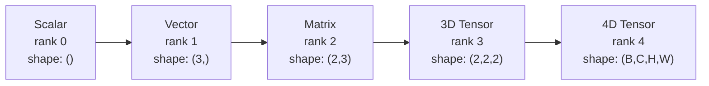
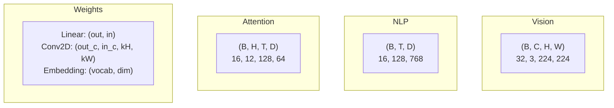
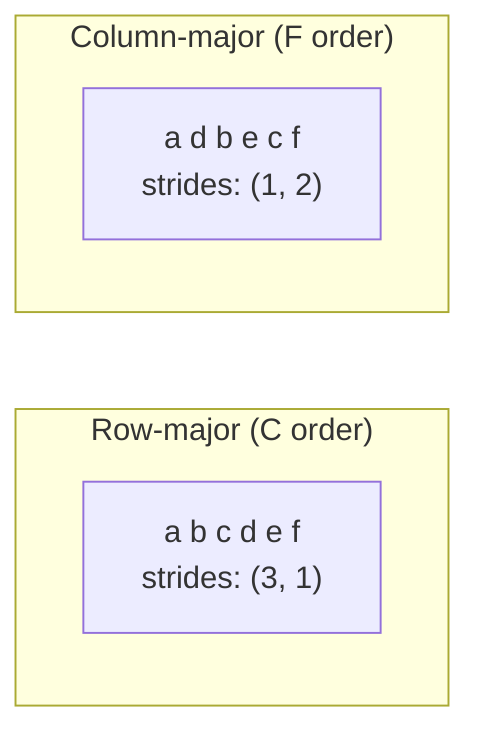
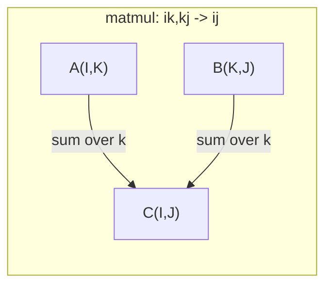

# 텐서 연산

> 텐서는 데이터와 딥러닝을 잇는 공통 언어입니다. 모든 이미지, 모든 문장, 모든 그래디언트가 텐서를 통해 흐릅니다.

**Type:** Build
**Languages:** Python
**Prerequisites:** Phase 1, Lessons 01 (Linear Algebra Intuition), 02 (Vectors, Matrices & Operations)
**Time:** ~90 minutes

## 학습 목표

- shape, strides, reshape, transpose, element-wise operations를 갖춘 tensor class를 처음부터 구현하기
- broadcasting 규칙을 적용해 데이터를 복사하지 않고 서로 다른 shape의 텐서에 연산하기
- dot product, matrix multiplication, outer product, batched operation을 위한 einsum 표현식 작성하기
- multi-head attention의 모든 단계에서 정확한 tensor shape 추적하기

## 문제

트랜스포머를 만든다고 해봅시다. forward pass는 깔끔해 보입니다. 실행하면 `RuntimeError: mat1 and mat2 shapes cannot be multiplied (32x768 and 512x768)`가 나옵니다. shape를 한참 들여다봅니다. transpose를 시도합니다. 이제 `Expected 4D input (got 3D input)`라고 합니다. unsqueeze를 추가합니다. 다른 것이 또 깨집니다.

shape 오류는 딥러닝 코드에서 가장 흔한 버그입니다. 개념적으로 어렵지는 않습니다. 각 연산에는 shape contract가 있습니다. 하지만 빠르게 증식합니다. 트랜스포머에는 수십 개의 reshape, transpose, broadcast가 연결되어 있습니다. 축 하나가 틀리면 오류가 연쇄적으로 퍼집니다. 더 나쁜 것은 일부 shape 실수가 오류를 전혀 던지지 않는다는 점입니다. 잘못된 차원을 따라 broadcasting하거나 잘못된 축을 합산하면서 조용히 쓰레기 값을 만듭니다.

행렬은 두 집합 사이의 pairwise relationship을 다룹니다. 실제 데이터는 2차원에 맞지 않습니다. 224x224 RGB 이미지 32장의 batch는 4D tensor `(32, 3, 224, 224)`입니다. 12개 head를 가진 self-attention도 4D입니다: `(batch, heads, seq_len, head_dim)`. 어떤 수의 차원으로도 일반화되고, 모든 차원에서 깔끔하게 합성되는 연산을 가진 자료구조가 필요합니다. 그 구조가 tensor입니다. tensor 연산을 익히면 shape 오류는 사소하게 디버깅할 수 있습니다.

## 개념

### tensor란 무엇인가

tensor는 균일한 데이터 타입을 가진 숫자의 multi-dimensional array입니다. 차원의 수가 **rank** 또는 **order**입니다. 각 차원은 **axis**입니다. **shape**는 각 axis를 따른 크기를 나열한 tuple입니다.



전체 원소 수 = 모든 크기의 곱입니다. shape `(2, 3, 4)`는 `2 * 3 * 4 = 24`개의 원소를 담습니다.

### 딥러닝의 tensor shape

서로 다른 데이터 타입은 관례적으로 특정 tensor shape에 매핑됩니다.



PyTorch는 NCHW(channels-first)를 사용합니다. TensorFlow는 기본적으로 NHWC(channels-last)를 사용합니다. 레이아웃이 맞지 않으면 조용한 slowdown이나 오류가 발생합니다.

### memory layout 작동 방식

메모리에서 2D array는 1D byte sequence입니다. **Strides**는 각 axis를 따라 한 칸 움직이려면 몇 개의 원소를 건너뛰어야 하는지 알려줍니다.



Transpose는 데이터를 옮기지 않습니다. stride를 바꾸어 tensor를 **non-contiguous**로 만듭니다. 행의 원소들이 더 이상 메모리에서 인접하지 않습니다.

### Broadcasting 규칙

Broadcasting은 데이터를 복사하지 않고 서로 다른 shape의 tensor에 연산할 수 있게 합니다. shape를 오른쪽부터 맞춥니다. 두 차원은 같거나 하나가 1이면 호환됩니다. 차원이 더 적은 쪽은 왼쪽에 1을 붙입니다.

```text
Tensor A:     (8, 1, 6, 1)
Tensor B:        (7, 1, 5)
Padded B:     (1, 7, 1, 5)
Result:       (8, 7, 6, 5)
```

### Einsum: 범용 tensor operation

Einstein summation은 각 axis에 문자를 붙입니다. 입력에는 있지만 출력에는 없는 axis는 합산됩니다. 양쪽에 있는 axis는 유지됩니다.



핵심 패턴: `i,i->`(dot product), `i,j->ij`(outer product), `ii->`(trace), `ij->ji`(transpose), `bij,bjk->bik`(batch matmul), `bhtd,bhsd->bhts`(attention scores).

```figure
tensor-broadcast
```

## 직접 만들기

코드는 `code/tensors.py`에 있습니다. 각 단계는 그 구현을 참조합니다.

### Step 1: Tensor storage와 strides

tensor는 flat list of numbers와 shape metadata를 저장합니다. Strides는 indexing logic이 multi-dimensional index를 flat position으로 매핑하는 방법을 알려줍니다.

```python
class Tensor:
    def __init__(self, data, shape=None):
        if isinstance(data, (list, tuple)):
            self._data, self._shape = self._flatten_nested(data)
        elif isinstance(data, np.ndarray):
            self._data = data.flatten().tolist()
            self._shape = tuple(data.shape)
        else:
            self._data = [data]
            self._shape = ()

        if shape is not None:
            total = reduce(lambda a, b: a * b, shape, 1)
            if total != len(self._data):
                raise ValueError(
                    f"Cannot reshape {len(self._data)} elements into shape {shape}"
                )
            self._shape = tuple(shape)

        self._strides = self._compute_strides(self._shape)

    @staticmethod
    def _compute_strides(shape):
        if len(shape) == 0:
            return ()
        strides = [1] * len(shape)
        for i in range(len(shape) - 2, -1, -1):
            strides[i] = strides[i + 1] * shape[i + 1]
        return tuple(strides)
```

shape `(3, 4)`의 stride는 `(4, 1)`입니다. 한 행 전진하려면 원소 4개를 건너뛰고, 한 열 전진하려면 원소 1개를 건너뜁니다.

### Step 2: Reshape, squeeze, unsqueeze 실습

Reshape는 원소 순서를 바꾸지 않고 shape만 바꿉니다. 전체 원소 수는 같아야 합니다. 한 차원의 크기를 추론하려면 `-1`을 사용합니다.

```python
t = Tensor(list(range(12)), shape=(2, 6))
r = t.reshape((3, 4))
r = t.reshape((-1, 3))
```

Squeeze는 크기가 1인 axis를 제거합니다. Unsqueeze는 axis 하나를 삽입합니다. Unsqueeze는 broadcasting에 중요합니다. batch `(B, T, D)`에 더할 bias vector `(D,)`는 `(1, 1, D)`로 unsqueeze되어야 합니다.

```python
t = Tensor(list(range(6)), shape=(1, 3, 1, 2))
s = t.squeeze()
v = Tensor([1, 2, 3])
u = v.unsqueeze(0)
```

### Step 3: Transpose와 permute

Transpose는 두 axis를 바꿉니다. Permute는 모든 axis를 재정렬합니다. 이것이 NCHW와 NHWC 사이를 변환하는 방법입니다.

```python
mat = Tensor(list(range(6)), shape=(2, 3))
tr = mat.transpose(0, 1)

t4d = Tensor(list(range(24)), shape=(1, 2, 3, 4))
perm = t4d.permute((0, 2, 3, 1))
```

transpose 또는 permute 후 tensor는 메모리에서 non-contiguous입니다. PyTorch에서 `view`는 non-contiguous tensor에서 실패합니다. `reshape`를 사용하거나 먼저 `.contiguous()`를 호출하세요.

### Step 4: Element-wise operations와 reductions

Element-wise ops(add, multiply, subtract)는 각 원소에 독립적으로 적용되고 shape를 보존합니다. Reductions(sum, mean, max)는 하나 이상의 axis를 접습니다.

```python
a = Tensor([[1, 2], [3, 4]])
b = Tensor([[10, 20], [30, 40]])
c = a + b
d = a * 2
s = a.sum(axis=0)
```

CNN의 global average pooling: `(B, C, H, W).mean(axis=[2, 3])`는 `(B, C)`를 만듭니다. NLP의 sequence mean pooling: `(B, T, D).mean(axis=1)`은 `(B, D)`를 만듭니다.

### Step 5: NumPy로 broadcasting

`tensors.py`의 `demo_broadcasting_numpy()` 함수는 핵심 패턴을 보여줍니다.

```python
activations = np.random.randn(4, 3)
bias = np.array([0.1, 0.2, 0.3])
result = activations + bias

images = np.random.randn(2, 3, 4, 4)
scale = np.array([0.5, 1.0, 1.5]).reshape(1, 3, 1, 1)
result = images * scale

a = np.array([1, 2, 3]).reshape(-1, 1)
b = np.array([10, 20, 30, 40]).reshape(1, -1)
outer = a * b
```

broadcasting을 통한 pairwise distance: `(M, 2)`를 `(M, 1, 2)`로, `(N, 2)`를 `(1, N, 2)`로 reshape하고, 빼고, 제곱하고, 마지막 axis를 따라 합산한 뒤 square root를 취합니다. 결과는 `(M, N)`입니다.

### Step 6: Einsum operations 실습

`demo_einsum()`과 `demo_einsum_gallery()` 함수는 흔한 모든 패턴을 단계별로 보여줍니다.

```python
a = np.array([1.0, 2.0, 3.0])
b = np.array([4.0, 5.0, 6.0])
dot = np.einsum("i,i->", a, b)

A = np.array([[1, 2], [3, 4], [5, 6]], dtype=float)
B = np.array([[7, 8, 9], [10, 11, 12]], dtype=float)
matmul = np.einsum("ik,kj->ij", A, B)

batch_A = np.random.randn(4, 3, 5)
batch_B = np.random.randn(4, 5, 2)
batch_mm = np.einsum("bij,bjk->bik", batch_A, batch_B)
```

contraction의 계산 비용은 모든 index size(유지되는 것과 합산되는 것)의 곱입니다. B=32, I=128, J=64, K=128인 `bij,bjk->bik`는 `32 * 128 * 64 * 128 = 33,554,432` multiply-adds입니다.

### Step 7: einsum으로 attention mechanism

`demo_attention_einsum()` 함수는 multi-head attention을 end to end로 구현합니다.

```python
B, H, T, D = 2, 4, 8, 16
E = H * D

X = np.random.randn(B, T, E)
W_q = np.random.randn(E, E) * 0.02

Q = np.einsum("bte,ek->btk", X, W_q)
Q = Q.reshape(B, T, H, D).transpose(0, 2, 1, 3)

scores = np.einsum("bhtd,bhsd->bhts", Q, K) / np.sqrt(D)
weights = softmax(scores, axis=-1)
attn_output = np.einsum("bhts,bhsd->bhtd", weights, V)

concat = attn_output.transpose(0, 2, 1, 3).reshape(B, T, E)
output = np.einsum("bte,ek->btk", concat, W_o)
```

모든 단계는 tensor operation입니다. projection(einsum을 통한 matmul), head splitting(reshape + transpose), attention scores(einsum을 통한 batch matmul), weighted sum(einsum을 통한 batch matmul), head merging(transpose + reshape), output projection(einsum을 통한 matmul)입니다.

## 사용하기

### Scratch와 NumPy

| Operation | Scratch (Tensor class) | NumPy |
|---|---|---|
| Create | `Tensor([[1,2],[3,4]])` | `np.array([[1,2],[3,4]])` |
| Reshape | `t.reshape((3,4))` | `a.reshape(3,4)` |
| Transpose | `t.transpose(0,1)` | `a.T` or `a.transpose(0,1)` |
| Squeeze | `t.squeeze(0)` | `np.squeeze(a, 0)` |
| Sum | `t.sum(axis=0)` | `a.sum(axis=0)` |
| Einsum | N/A | `np.einsum("ij,jk->ik", a, b)` |

### Scratch와 PyTorch

```python
import torch

t = torch.tensor([[1, 2, 3], [4, 5, 6]], dtype=torch.float32)
t.shape
t.stride()
t.is_contiguous()

t.reshape(3, 2)
t.unsqueeze(0)
t.transpose(0, 1)
t.transpose(0, 1).contiguous()

torch.einsum("ik,kj->ij", A, B)
```

PyTorch는 autograd, GPU support, optimized BLAS kernels를 추가합니다. shape semantics는 동일합니다. scratch version을 이해하면 PyTorch shape 오류가 읽을 수 있는 것이 됩니다.

### 모든 neural network layer는 tensor operation

| Operation | Tensor Form | Einsum |
|---|---|---|
| Linear layer | `Y = X @ W.T + b` | `"bd,od->bo"` + bias |
| Attention QKV | `Q = X @ W_q` | `"btd,dh->bth"` |
| Attention scores | `Q @ K.T / sqrt(d)` | `"bhtd,bhsd->bhts"` |
| Attention output | `softmax(scores) @ V` | `"bhts,bhsd->bhtd"` |
| Batch norm | `(X - mu) / sigma * gamma` | element-wise + broadcast |
| Softmax | `exp(x) / sum(exp(x))` | element-wise + reduction |

## 산출물

이 lesson은 재사용 가능한 prompt 두 개를 만듭니다.

1. **`outputs/prompt-tensor-shapes.md`** -- tensor shape mismatch를 체계적으로 디버깅하는 prompt입니다. 흔한 모든 연산(matmul, broadcast, cat, Linear, Conv2d, BatchNorm, softmax)에 대한 의사결정 표와 수정 lookup table을 포함합니다.

2. **`outputs/prompt-tensor-debugger.md`** -- shape 오류에 막혔을 때 어떤 AI assistant에도 붙여넣을 수 있는 단계별 디버깅 prompt입니다. 오류 메시지와 tensor shape를 넣으면 정확한 수정 방법을 돌려받습니다.

## 연습문제

1. **Easy -- Reshape round-trip.** shape `(2, 3, 4)`인 tensor를 가져오세요. `(6, 4)`로 reshape한 다음 `(24,)`로 reshape하고, 다시 `(2, 3, 4)`로 되돌리세요. 각 단계에서 flat data를 출력해 원소 순서가 보존되는지 확인하세요.

2. **Medium -- Implement broadcasting.** `Tensor` class에 size 1 차원을 target shape에 맞게 확장하는 `broadcast_to(shape)` method를 추가하세요. 그런 다음 `_elementwise_op`를 수정해 연산 전에 자동으로 broadcast하도록 만드세요. shape `(3, 1)`과 `(1, 4)`가 `(3, 4)`를 만드는지 테스트하세요.

3. **Hard -- Build einsum from scratch.** 최소한 dot product(`i,i->`), matrix multiply(`ij,jk->ik`), outer product(`i,j->ij`), transpose(`ij->ji`)를 처리하는 기본 `einsum(subscripts, *tensors)` 함수를 구현하세요. subscript string을 parse하고, contracted indices를 식별하며, 모든 index combination을 loop하세요. 결과를 `np.einsum`과 비교하세요.

4. **Hard -- Attention shape tracker.** `batch_size`, `seq_len`, `embed_dim`, `num_heads`를 입력으로 받아 multi-head attention의 모든 단계에서 정확한 shape를 출력하는 함수를 작성하세요: input, Q/K/V projection, head split, attention scores, softmax weights, weighted sum, head merge, output projection. `demo_attention_einsum()` 출력과 대조해 확인하세요.

## 핵심 용어

| 용어 | 사람들이 말하는 것 | 실제 의미 |
|---|---|---|
| Tensor | "차원이 더 많은 matrix" | 균일한 타입과 정의된 shape, strides, operations를 가진 multi-dimensional array |
| Rank | "차원의 수" | axis의 수입니다. matrix의 rank는 2이며, matrix rank와 같은 뜻이 아닙니다 |
| Shape | "tensor의 크기" | 각 axis를 따른 크기를 나열한 tuple입니다. `(2, 3)`은 2 rows, 3 columns를 의미합니다 |
| Stride | "메모리가 배치된 방식" | 각 axis를 따라 한 위치 전진하기 위해 건너뛰는 원소 수 |
| Broadcasting | "shape가 달라도 그냥 작동함" | 엄격한 규칙 집합입니다. 오른쪽부터 맞추고, 차원은 같거나 하나가 1이어야 합니다 |
| Contiguous | "tensor가 정상임" | 논리적 layout에서 gap이나 재정렬 없이 원소가 메모리에 순차적으로 저장됨 |
| Einsum | "matmul을 쓰는 멋진 방법" | 어떤 tensor contraction, outer product, trace, transpose도 한 줄로 표현하는 일반 표기법 |
| View | "reshape와 같음" | 같은 memory buffer를 공유하지만 shape/stride metadata가 다른 tensor입니다. non-contiguous data에서는 실패합니다 |
| Contraction | "index를 합산함" | tensor 사이의 shared index를 곱하고 합산해 더 낮은 rank 결과를 만드는 일반 연산 |
| NCHW / NHWC | "PyTorch vs TensorFlow format" | image tensor의 memory layout convention입니다. NCHW는 channels를 spatial dims 앞에 두고, NHWC는 뒤에 둡니다 |

## 더 읽을거리

- [NumPy Broadcasting](https://numpy.org/doc/stable/user/basics.broadcasting.html) -- 시각적 예시가 있는 표준 규칙
- [PyTorch Tensor Views](https://pytorch.org/docs/stable/tensor_view.html) -- view가 작동하는 때와 copy하는 때
- [einops](https://github.com/arogozhnikov/einops) -- tensor reshaping을 읽기 쉽고 안전하게 만드는 library
- [The Illustrated Transformer](https://jalammar.github.io/illustrated-transformer/) -- attention을 통과하는 tensor shape를 시각화
- [Einstein Summation in NumPy](https://numpy.org/doc/stable/reference/generated/numpy.einsum.html) -- 예제가 포함된 전체 einsum documentation
