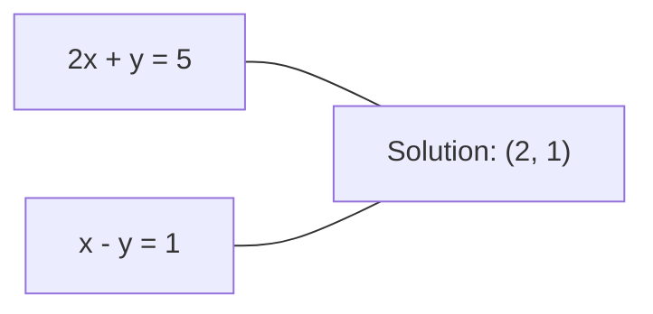
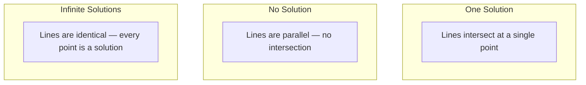

# 선형 시스템

> Ax = b를 푸는 일은 여전히 신경망을 움직이는, 수학에서 가장 오래된 문제입니다.

**Type:** Build
**Languages:** Python
**Prerequisites:** Phase 1, Lessons 01 (Linear Algebra Intuition), 02 (Vectors & Matrices), 03 (Matrix Transformations)
**Time:** ~120 minutes

## 학습 목표

- partial pivoting과 back substitution을 사용하는 Gaussian elimination으로 Ax = b를 풉니다
- LU, QR, Cholesky decomposition으로 matrix를 factor하고 각각이 언제 적절한지 설명합니다
- least squares의 normal equations를 유도하고 linear regression 및 ridge regression과 연결합니다
- condition number를 사용해 ill-conditioned system을 진단하고 regularization으로 안정화합니다

## 문제

linear regression을 학습할 때마다 linear system을 풉니다. least-squares fit을 계산할 때마다 linear system을 풉니다. neural network layer가 `y = Wx + b`를 계산할 때마다 linear system의 한쪽을 평가합니다. regularization을 추가하면 system을 수정합니다. Gaussian process를 사용하면 matrix를 factor합니다. Mahalanobis distance를 위해 covariance matrix를 invert하면 linear system을 푸는 것입니다.

equation Ax = b는 어디에나 나타납니다. A는 알려진 coefficients의 matrix입니다. b는 알려진 outputs의 vector입니다. x는 찾고 싶은 unknowns의 vector입니다. linear regression에서 A는 data matrix, b는 target vector, x는 weight vector입니다. 전체 model은 다음으로 축약됩니다. Ax가 b에 최대한 가까워지게 하는 x를 찾아라.

이 lesson은 이 equation을 푸는 주요 method를 처음부터 만듭니다. 어떤 method는 빠르고 어떤 method는 안정적인 이유, 어떤 method는 square system에서만 작동하고 어떤 method는 overdetermined system을 처리하는 이유, 그리고 matrix의 condition number가 답이 의미 있는지 여부를 결정하는 이유를 이해하게 됩니다.

## 개념

### Ax = b의 기하학적 의미

linear equations의 system에는 기하학적 해석이 있습니다. 각 equation은 hyperplane을 정의합니다. solution은 모든 hyperplanes가 교차하는 point(또는 points의 set)입니다.

```text
2x + y = 5          Two lines in 2D.
x - y  = 1          They intersect at x=2, y=1.
```



세 가지 일이 일어날 수 있습니다.



matrix form에서 "one solution"은 A가 invertible이라는 뜻입니다. "No solution"은 system이 inconsistent라는 뜻입니다. "Infinite solutions"는 A에 null space가 있다는 뜻입니다. 대부분의 ML problem은 unknowns(parameters)보다 equations(data points)가 더 많기 때문에 "no exact solution" category에 속합니다. 여기서 least squares가 등장합니다.

### Column picture와 row picture

Ax = b를 읽는 방식은 두 가지입니다.

**Row picture.** A의 각 row는 하나의 equation을 정의합니다. 각 equation은 hyperplane입니다. solution은 그것들이 모두 만나는 곳입니다.

**Column picture.** A의 각 column은 vector입니다. 질문은 이렇게 바뀝니다. A의 columns의 어떤 linear combination이 b를 만드는가?

```text
A = | 2  1 |    b = | 5 |
    | 1 -1 |        | 1 |

Row picture: solve 2x + y = 5 and x - y = 1 simultaneously.

Column picture: find x1, x2 such that:
  x1 * [2, 1] + x2 * [1, -1] = [5, 1]
  2 * [2, 1] + 1 * [1, -1] = [4+1, 2-1] = [5, 1]   check.
```

column picture가 더 근본적입니다. b가 A의 column space 안에 있으면 system에는 solution이 있습니다. 그렇지 않으면 column space 안에서 가장 가까운 point를 찾습니다. 그 closest point가 least-squares solution입니다.

### Gaussian elimination 설명

Gaussian elimination은 Ax = b를 upper triangular system Ux = c로 변환하고, 이를 back substitution으로 풉니다. 가장 직접적인 method입니다.

알고리즘:

```text
1. For each column k (the pivot column):
   a. Find the largest entry in column k at or below row k (partial pivoting).
   b. Swap that row with row k.
   c. For each row i below k:
      - Compute multiplier m = A[i][k] / A[k][k]
      - Subtract m times row k from row i.
2. Back substitute: solve from the last equation upward.
```

예:

```text
Original:
| 2  1  1 | 8 |       R2 = R2 - (2)R1     | 2  1   1 |  8 |
| 4  3  3 |20 |  -->  R3 = R3 - (1)R1 --> | 0  1   1 |  4 |
| 2  3  1 |12 |                            | 0  2   0 |  4 |

                       R3 = R3 - (2)R2     | 2  1   1 |  8 |
                                       --> | 0  1   1 |  4 |
                                           | 0  0  -2 | -4 |

Back substitute:
  -2 * x3 = -4    -->  x3 = 2
  x2 + 2  = 4     -->  x2 = 2
  2*x1 + 2 + 2 = 8 --> x1 = 2
```

Gaussian elimination은 O(n^3) operations가 듭니다. 1000x1000 system에서는 약 10억 floating-point operations입니다. 빠르지만 같은 A로 여러 systems를 풀어야 한다면 더 잘할 수 있습니다.

### Partial pivoting: 중요한 이유

pivoting이 없으면 Gaussian elimination은 실패하거나 엉뚱한 결과를 만들 수 있습니다. pivot element가 zero이면 zero로 나눕니다. 작으면 rounding errors를 증폭합니다.

```text
Bad pivot:                       With partial pivoting:
| 0.001  1 | 1.001 |            Swap rows first:
| 1      1 | 2     |            | 1      1 | 2     |
                                 | 0.001  1 | 1.001 |
m = 1/0.001 = 1000              m = 0.001/1 = 0.001
R2 = R2 - 1000*R1               R2 = R2 - 0.001*R1
| 0.001  1     | 1.001   |      | 1      1     | 2     |
| 0     -999   | -999.0  |      | 0      0.999 | 0.999 |

x2 = 1.000 (correct)            x2 = 1.000 (correct)
x1 = (1.001 - 1)/0.001          x1 = (2 - 1)/1 = 1.000 (correct)
   = 0.001/0.001 = 1.000        Stable because the multiplier is small.
```

precision이 제한된 floating-point arithmetic에서 pivoting 없는 version은 significant digits를 잃을 수 있습니다. Partial pivoting은 error amplification을 최소화하려고 항상 가장 큰 available pivot을 선택합니다.

### LU decomposition 설명

LU decomposition은 A를 lower triangular matrix L과 upper triangular matrix U로 factor합니다: A = LU. L matrix는 Gaussian elimination의 multipliers를 저장합니다. U matrix는 elimination의 결과입니다.

```text
A = L @ U

| 2  1  1 |   | 1  0  0 |   | 2  1   1 |
| 4  3  3 | = | 2  1  0 | @ | 0  1   1 |
| 2  3  1 |   | 1  2  1 |   | 0  0  -2 |
```

그냥 eliminate하지 않고 factor하는 이유는 무엇일까요? L과 U가 있으면 어떤 새 b에 대해서도 Ax = b를 푸는 비용이 O(n^2)뿐이기 때문입니다.

```text
Ax = b
LUx = b
Let y = Ux:
  Ly = b    (forward substitution, O(n^2))
  Ux = y    (back substitution, O(n^2))
```

O(n^3) cost는 factorization 중 한 번만 지불합니다. 이후 각 solve는 O(n^2)입니다. 같은 A와 서로 다른 b vectors로 1000 systems를 풀어야 한다면 LU는 total work에서 1000/3배를 절약합니다.

partial pivoting을 사용하면 PA = LU가 됩니다. 여기서 P는 row swaps를 기록하는 permutation matrix입니다.

### QR decomposition 설명

QR decomposition은 A를 orthogonal matrix Q와 upper triangular matrix R로 factor합니다: A = QR.

orthogonal matrix는 Q^T Q = I라는 property를 갖습니다. columns는 orthonormal vectors입니다. Q를 곱해도 lengths와 angles가 보존됩니다.

```text
A = Q @ R

Q has orthonormal columns: Q^T Q = I
R is upper triangular

To solve Ax = b:
  QRx = b
  Rx = Q^T b    (just multiply by Q^T, no inversion needed)
  Back substitute to get x.
```

least-squares problems를 풀 때 QR은 LU보다 수치적으로 더 안정적입니다. Gram-Schmidt process는 Q를 column by column으로 만듭니다.

```text
Given columns a1, a2, ... of A:

q1 = a1 / ||a1||

q2 = a2 - (a2 . q1) * q1        (subtract projection onto q1)
q2 = q2 / ||q2||                (normalize)

q3 = a3 - (a3 . q1) * q1 - (a3 . q2) * q2
q3 = q3 / ||q3||

R[i][j] = qi . aj    for i <= j
```

각 step은 이전 모든 q vectors를 따른 component를 제거하고 새 orthogonal direction만 남깁니다.

### Cholesky decomposition 설명

A가 symmetric(A = A^T)이고 positive definite(모든 eigenvalues가 positive)일 때, A = L L^T로 factor할 수 있습니다. 여기서 L은 lower triangular입니다. 이것이 Cholesky decomposition입니다.

```text
A = L @ L^T

| 4  2 |   | 2  0 |   | 2  1 |
| 2  5 | = | 1  2 | @ | 0  2 |

L[i][i] = sqrt(A[i][i] - sum(L[i][k]^2 for k < i))
L[i][j] = (A[i][j] - sum(L[i][k]*L[j][k] for k < j)) / L[j][j]    for i > j
```

Cholesky는 LU보다 두 배 빠르고 storage는 절반만 필요합니다. symmetric positive definite matrices에서만 작동하지만, 그런 matrices는 계속 등장합니다.

- Covariance matrices는 symmetric positive semi-definite입니다(regularization을 적용하면 positive definite).
- Gaussian processes의 kernel matrix는 symmetric positive definite입니다.
- minimum에서 convex function의 Hessian은 symmetric positive definite입니다.
- A^T A는 항상 symmetric positive semi-definite입니다.

Gaussian processes에서는 kernel matrix K를 Cholesky로 factor한 뒤 K alpha = y를 풀어 predictive mean을 얻습니다. Cholesky factor는 marginal likelihood의 log-determinant도 제공합니다: log det(K) = 2 * sum(log(diag(L))).

### Least squares: Ax = b에 exact solution이 없을 때

A가 m x n이고 m > n(unknowns보다 equations가 많음)이면 system은 overdetermined입니다. exact solution은 없습니다. 대신 squared error를 minimize합니다.

```text
minimize ||Ax - b||^2

This is the sum of squared residuals:
  sum((A[i,:] @ x - b[i])^2 for i in range(m))
```

minimizer는 normal equations를 만족합니다.

```text
A^T A x = A^T b
```

Derivation: ||Ax - b||^2 = (Ax - b)^T (Ax - b) = x^T A^T A x - 2 x^T A^T b + b^T b로 전개합니다. x에 대한 gradient를 취해 zero로 놓으면 2 A^T A x - 2 A^T b = 0입니다.

```text
Original system (overdetermined, 4 equations, 2 unknowns):
| 1  1 |         | 3 |
| 1  2 | x     = | 5 |       No exact x satisfies all 4 equations.
| 1  3 |         | 6 |
| 1  4 |         | 8 |

Normal equations:
A^T A = | 4  10 |    A^T b = | 22 |
        | 10 30 |            | 63 |

Solve: x = [1.5, 1.7]

This is linear regression. x[0] is the intercept, x[1] is the slope.
```

### Normal equations = linear regression 설명

연결은 정확합니다. linear regression에서 data matrix X는 sample마다 하나의 row, feature마다 하나의 column을 갖습니다. target vector y는 sample마다 하나의 entry를 갖습니다. weight vector w는 다음을 만족합니다.

```text
X^T X w = X^T y
w = (X^T X)^(-1) X^T y
```

이것이 linear regression의 closed-form solution입니다. `sklearn.linear_model.LinearRegression.fit()` 호출은 이것(또는 QR/SVD를 통한 equivalent)을 계산합니다.

matrix에 regularization term lambda * I를 더하면 ridge regression이 됩니다:

```text
(X^T X + lambda * I) w = X^T y
w = (X^T X + lambda * I)^(-1) X^T y
```

regularization은 matrix를 더 well-conditioned하게 만들고(정확히 invert하기 쉬움), weights를 zero 쪽으로 shrink하여 overfitting을 막습니다. lambda > 0일 때 matrix X^T X + lambda * I는 항상 symmetric positive definite이므로 Cholesky로 풀 수 있습니다.

### Pseudoinverse(Moore-Penrose) 설명

pseudoinverse A+는 matrix inversion을 non-square 및 singular matrices로 generalize합니다. 임의의 matrix A에 대해:

```text
x = A+ b

where A+ = V Sigma+ U^T    (computed via SVD)
```

Sigma+는 각 nonzero singular value의 reciprocal을 취하고 결과를 transpose하여 만듭니다. A = U Sigma V^T이면 A+ = V Sigma+ U^T입니다.

```text
A = U Sigma V^T        (SVD)

Sigma = | 5  0 |       Sigma+ = | 1/5  0  0 |
        | 0  2 |                | 0  1/2  0 |
        | 0  0 |

A+ = V Sigma+ U^T
```

pseudoinverse는 minimum-norm least-squares solution을 제공합니다. system이 다음과 같다면:
- One solution: A+ b가 그 해를 줍니다.
- No solution: A+ b가 least-squares solution을 줍니다.
- Infinite solutions: A+ b가 가장 작은 ||x||를 가진 해를 줍니다.

NumPy의 `np.linalg.lstsq`와 `np.linalg.pinv`는 둘 다 내부적으로 SVD를 사용합니다.

### Condition number 설명

condition number는 input의 작은 변화에 solution이 얼마나 민감한지 측정합니다. matrix A의 condition number는 다음과 같습니다.

```text
kappa(A) = ||A|| * ||A^(-1)|| = sigma_max / sigma_min
```

여기서 sigma_max와 sigma_min은 largest 및 smallest singular values입니다.

```text
Well-conditioned (kappa ~ 1):        Ill-conditioned (kappa ~ 10^15):
Small change in b -->                Small change in b -->
small change in x                    huge change in x

| 2  0 |   kappa = 2/1 = 2          | 1   1          |   kappa ~ 10^15
| 0  1 |   safe to solve            | 1   1+10^(-15) |   solution is garbage
```

경험 법칙:
- kappa < 100: 안전하며 solution이 accurate합니다.
- kappa ~ 10^k: floating-point arithmetic에서 약 k digits of precision을 잃습니다.
- kappa ~ 10^16(float64의 경우): solution은 의미가 없습니다. matrix는 effectively singular입니다.

ML에서 ill-conditioning은 features가 거의 collinear일 때 발생합니다. Regularization(lambda * I 추가)은 condition number를 sigma_max / sigma_min에서 (sigma_max + lambda) / (sigma_min + lambda)로 개선합니다.

### Iterative methods: conjugate gradient 설명

매우 큰 sparse systems(millions of unknowns)에서는 LU나 Cholesky 같은 direct methods가 너무 비쌉니다. Iterative methods는 여러 iterations에 걸쳐 guess를 개선하여 solution을 approximate합니다.

Conjugate gradient(CG)는 A가 symmetric positive definite일 때 Ax = b를 풉니다. exact arithmetic에서는 최대 n iterations 안에 exact solution을 찾지만, A의 eigenvalues가 clustered되어 있으면 보통 훨씬 빠르게 수렴합니다.

```text
Algorithm sketch:
  x0 = initial guess (often zero)
  r0 = b - A x0           (residual)
  p0 = r0                 (search direction)

  For k = 0, 1, 2, ...:
    alpha = (rk . rk) / (pk . A pk)
    x_{k+1} = xk + alpha * pk
    r_{k+1} = rk - alpha * A pk
    beta = (r_{k+1} . r_{k+1}) / (rk . rk)
    p_{k+1} = r_{k+1} + beta * pk
    if ||r_{k+1}|| < tolerance: stop
```

CG는 다음에 사용됩니다.
- Large-scale optimization(Newton-CG method)
- PDE discretizations 풀기
- kernel matrix가 너무 커서 factor할 수 없는 kernel methods
- 다른 iterative solvers를 위한 preconditioning

convergence rate는 condition number에 달려 있습니다. 더 well-conditioned systems는 더 빨리 수렴하며, 이것이 regularization이 도움이 되는 또 다른 이유입니다.

### 전체 그림: 언제 어떤 method를 쓸까

| Method | 요구사항 | 비용 | 사용 사례 |
|--------|-------------|------|----------|
| Gaussian elimination | Square이고 nonsingular인 A | O(n^3) | square system을 한 번 풀 때 |
| LU decomposition | Square이고 nonsingular인 A | O(n^3) factor + O(n^2) solve | 같은 A로 여러 번 풀 때 |
| QR decomposition | 임의의 A (m >= n) | O(mn^2) | Least squares, 수치적으로 안정적 |
| Cholesky | Symmetric positive definite A | O(n^3/3) | Covariance matrices, Gaussian processes, ridge regression |
| Normal equations | Overdetermined (m > n) | O(mn^2 + n^3) | Linear regression (작은 n) |
| SVD / pseudoinverse | 임의의 A | O(mn^2) | Rank-deficient system, minimum-norm solution |
| Conjugate gradient | Symmetric positive definite, sparse A | O(n * k * nnz) | 큰 sparse system, k = iterations |

### ML과의 연결

이 lesson의 모든 method는 production ML에 등장합니다.

**Linear regression.** closed-form solution은 normal equations X^T X w = X^T y를 풉니다. n이 작으면 Cholesky, numerical stability가 중요하면 QR, matrix가 rank-deficient일 수 있으면 SVD로 수행합니다.

**Ridge regression.** X^T X에 lambda * I를 추가합니다. lambda > 0이면 X^T X + lambda * I가 symmetric positive definite이므로 regularized system (X^T X + lambda * I) w = X^T y는 항상 Cholesky로 풀 수 있습니다.

**Gaussian processes.** predictive mean은 kernel matrix K에 대해 K alpha = y를 푸는 것을 요구합니다. K의 Cholesky factorization이 standard approach입니다. log marginal likelihood는 log det(K) = 2 sum(log(diag(L)))를 사용합니다.

**Neural network initialization.** Orthogonal initialization은 QR decomposition을 사용해 columns가 orthonormal인 weight matrices를 만듭니다. 이는 deep networks에서 signal collapse를 막습니다.

**Preconditioning.** Large-scale optimizers는 conjugate gradient solvers의 preconditioners로 incomplete Cholesky 또는 incomplete LU를 사용합니다.

**Feature engineering.** X^T X의 condition number는 features가 collinear인지 알려 줍니다. kappa가 크면 features를 제거하거나 regularization을 추가하세요.

```figure
linear-system-conditioning
```

## 직접 만들기

### 단계 1: partial pivoting을 사용한 Gaussian elimination

```python
import numpy as np

def gaussian_elimination(A, b):
    n = len(b)
    Ab = np.hstack([A.astype(float), b.reshape(-1, 1).astype(float)])

    for k in range(n):
        max_row = k + np.argmax(np.abs(Ab[k:, k]))
        Ab[[k, max_row]] = Ab[[max_row, k]]

        if abs(Ab[k, k]) < 1e-12:
            raise ValueError(f"Matrix is singular or nearly singular at pivot {k}")

        for i in range(k + 1, n):
            m = Ab[i, k] / Ab[k, k]
            Ab[i, k:] -= m * Ab[k, k:]

    x = np.zeros(n)
    for i in range(n - 1, -1, -1):
        x[i] = (Ab[i, -1] - Ab[i, i+1:n] @ x[i+1:n]) / Ab[i, i]

    return x
```

### 단계 2: LU decomposition

```python
def lu_decompose(A):
    n = A.shape[0]
    L = np.eye(n)
    U = A.astype(float).copy()
    P = np.eye(n)

    for k in range(n):
        max_row = k + np.argmax(np.abs(U[k:, k]))
        if max_row != k:
            U[[k, max_row]] = U[[max_row, k]]
            P[[k, max_row]] = P[[max_row, k]]
            if k > 0:
                L[[k, max_row], :k] = L[[max_row, k], :k]

        for i in range(k + 1, n):
            L[i, k] = U[i, k] / U[k, k]
            U[i, k:] -= L[i, k] * U[k, k:]

    return P, L, U

def lu_solve(P, L, U, b):
    n = len(b)
    Pb = P @ b.astype(float)

    y = np.zeros(n)
    for i in range(n):
        y[i] = Pb[i] - L[i, :i] @ y[:i]

    x = np.zeros(n)
    for i in range(n - 1, -1, -1):
        x[i] = (y[i] - U[i, i+1:] @ x[i+1:]) / U[i, i]

    return x
```

### 단계 3: Cholesky decomposition

```python
def cholesky(A):
    n = A.shape[0]
    L = np.zeros_like(A, dtype=float)

    for i in range(n):
        for j in range(i + 1):
            s = A[i, j] - L[i, :j] @ L[j, :j]
            if i == j:
                if s <= 0:
                    raise ValueError("Matrix is not positive definite")
                L[i, j] = np.sqrt(s)
            else:
                L[i, j] = s / L[j, j]

    return L
```

### 단계 4: normal equations를 통한 least squares

```python
def least_squares_normal(A, b):
    AtA = A.T @ A
    Atb = A.T @ b
    return gaussian_elimination(AtA, Atb)

def ridge_regression(A, b, lam):
    n = A.shape[1]
    AtA = A.T @ A + lam * np.eye(n)
    Atb = A.T @ b
    L = cholesky(AtA)
    y = np.zeros(n)
    for i in range(n):
        y[i] = (Atb[i] - L[i, :i] @ y[:i]) / L[i, i]
    x = np.zeros(n)
    for i in range(n - 1, -1, -1):
        x[i] = (y[i] - L.T[i, i+1:] @ x[i+1:]) / L.T[i, i]
    return x
```

### 단계 5: Condition number

```python
def condition_number(A):
    U, S, Vt = np.linalg.svd(A)
    return S[0] / S[-1]
```

## 사용하기

real data에서 linear regression과 ridge regression을 위해 조각들을 합쳐 봅니다.

```python
np.random.seed(42)
X_raw = np.random.randn(100, 3)
w_true = np.array([2.0, -1.0, 0.5])
y = X_raw @ w_true + np.random.randn(100) * 0.1

X = np.column_stack([np.ones(100), X_raw])

w_ols = least_squares_normal(X, y)
print(f"OLS weights (ours):    {w_ols}")

w_np = np.linalg.lstsq(X, y, rcond=None)[0]
print(f"OLS weights (numpy):   {w_np}")
print(f"Max difference: {np.max(np.abs(w_ols - w_np)):.2e}")

w_ridge = ridge_regression(X, y, lam=1.0)
print(f"Ridge weights (ours):  {w_ridge}")

from sklearn.linear_model import Ridge
ridge_sk = Ridge(alpha=1.0, fit_intercept=False)
ridge_sk.fit(X, y)
print(f"Ridge weights (sklearn): {ridge_sk.coef_}")
```

## 내보내기

이 lesson은 다음을 만듭니다.
- Gaussian elimination, LU decomposition, Cholesky decomposition, least squares, ridge regression의 from-scratch implementations를 담은 `code/linear_systems.py`
- normal equations와 sklearn의 LinearRegression이 같은 weights를 만든다는 working demonstration

## 연습 문제

1. 직접 만든 Gaussian elimination, LU solver, 그리고 `np.linalg.solve`를 사용해 system `[[1,2,3],[4,5,6],[7,8,10]] x = [6, 15, 27]`을 푸세요. 세 방법이 floating-point tolerance 안에서 같은 답을 주는지 검증하세요.

2. 50x5 random matrix X와 target y = X @ w_true + noise를 생성하세요. normal equations, QR(`np.linalg.qr`), SVD(`np.linalg.svd`), `np.linalg.lstsq`를 사용해 w를 푸세요. 네 solution을 비교하세요. X^T X의 condition number를 측정하고, 신뢰할 method 선택에 어떤 영향을 주는지 설명하세요.

3. 두 column을 거의 같게 만들어(예: column 2 = column 1 + 1e-10 * noise) nearly singular matrix를 만드세요. condition number를 계산하세요. regularization 없이, 그리고 0.01 * I를 더한 regularization을 사용해 Ax = b를 푸세요. solutions와 residuals를 비교하고 regularization이 왜 도움이 되는지 설명하세요.

4. 100x100 random symmetric positive definite matrix에 대해 conjugate gradient algorithm을 구현하세요. tolerance 1e-8까지 수렴하는 데 필요한 iterations 수를 세고, 이론적 최대값인 n iterations와 비교하세요.

5. 크기 10, 50, 200, 500의 symmetric positive definite matrices에서 직접 만든 Cholesky solver, LU solver, `np.linalg.solve`의 시간을 측정하세요. 결과를 plot하고 Cholesky가 LU보다 대략 2배 빠른지 검증하세요.

## 핵심 용어

| 용어 | 흔히 하는 말 | 실제 의미 |
|------|----------------|----------------------|
| Linear system | "x를 풀기" | linear equations Ax = b의 집합입니다. x를 찾는다는 것은 transformation A 아래에서 output b를 만드는 input을 찾는다는 뜻입니다. |
| Gaussian elimination | "Row reduce" | row operations로 diagonal 아래 entries를 체계적으로 0으로 만들어 back substitution으로 풀 수 있는 upper triangular system을 만듭니다. O(n^3). |
| Partial pivoting | "안정성을 위해 row 교체" | column k에서 eliminate하기 전에, 그 column에서 absolute value가 가장 큰 row를 pivot 위치로 바꿉니다. 작은 수로 나누는 일을 막습니다. |
| LU decomposition | "삼각 행렬로 factor" | A = LU로 씁니다. L은 lower triangular이고 multipliers를 저장하며, U는 upper triangular인 eliminated matrix입니다. 여러 solve에 O(n^3) 비용을 분산합니다. |
| QR decomposition | "Orthogonal factorization" | A = QR로 씁니다. Q는 orthonormal columns를 갖고 R은 upper triangular입니다. least squares에서 LU보다 안정적입니다. |
| Cholesky decomposition | "Matrix의 square root" | symmetric positive definite A에 대해 A = LL^T로 씁니다. LU 비용의 절반이며 covariance matrices, kernel matrices, ridge regression에 사용됩니다. |
| Least squares | "정확한 해가 불가능할 때 best fit" | system이 overdetermined(unknowns보다 equations가 많음)일 때 squared residuals ||Ax - b||^2의 합을 최소화합니다. |
| Normal equations | "미적분 shortcut" | A^T A x = A^T b입니다. ||Ax - b||^2의 gradient를 0으로 놓은 식입니다. linear regression의 closed-form solution입니다. |
| Pseudoinverse | "non-square matrices를 위한 inversion" | SVD를 통해 A+ = V Sigma+ U^T를 만듭니다. square든 rectangular든, singular이든 아니든 임의의 matrix에 대해 minimum-norm least-squares solution을 줍니다. |
| Condition number | "이 답을 얼마나 믿을 수 있는가" | kappa = sigma_max / sigma_min입니다. input perturbations에 대한 sensitivity를 측정합니다. 대략 log10(kappa) digits of precision을 잃습니다. |
| Ridge regression | "Regularized least squares" | (X^T X + lambda I) w = X^T y를 풉니다. lambda I를 더하면 conditioning이 좋아지고 weights가 zero 쪽으로 shrink되어 overfitting을 막습니다. |
| Conjugate gradient | "큰 matrix를 위한 iterative Ax=b" | symmetric positive definite systems를 위한 iterative solver입니다. 최대 n steps 안에 수렴하며, factorization이 너무 비싼 큰 sparse systems에 실용적입니다. |
| Overdetermined system | "parameters보다 data가 많음" | m-by-n system에서 m > n인 경우입니다. exact solution은 없습니다. least squares가 가장 좋은 approximation을 찾습니다. 모든 regression problem이 여기에 해당합니다. |
| Back substitution | "아래에서 위로 풀기" | upper triangular system이 주어졌을 때 마지막 equation을 먼저 풀고 뒤로 substitute합니다. O(n^2). |
| Forward substitution | "위에서 아래로 풀기" | lower triangular system이 주어졌을 때 첫 equation을 먼저 풀고 앞으로 substitute합니다. O(n^2). LU solve의 L step에서 사용됩니다. |

## 더 읽을거리

- [MIT 18.06: Linear Algebra](https://ocw.mit.edu/courses/18-06-linear-algebra-spring-2010/) (Gilbert Strang) -- linear systems와 matrix factorizations에 대한 대표 강의
- [Numerical Linear Algebra](https://people.maths.ox.ac.uk/trefethen/text.html) (Trefethen & Bau) -- numerical stability, conditioning, algorithm failure를 이해하기 위한 표준 참고서
- [Matrix Computations](https://www.cs.cornell.edu/cv/GolubVanLoan4/golubandvanloan.htm) (Golub & Van Loan) -- 거의 모든 matrix algorithm을 다루는 백과사전식 참고서
- [3Blue1Brown: Inverse Matrices](https://www.3blue1brown.com/lessons/inverse-matrices) -- Ax = b를 푸는 일이 기하학적으로 무엇을 뜻하는지 보여 주는 시각적 직관
