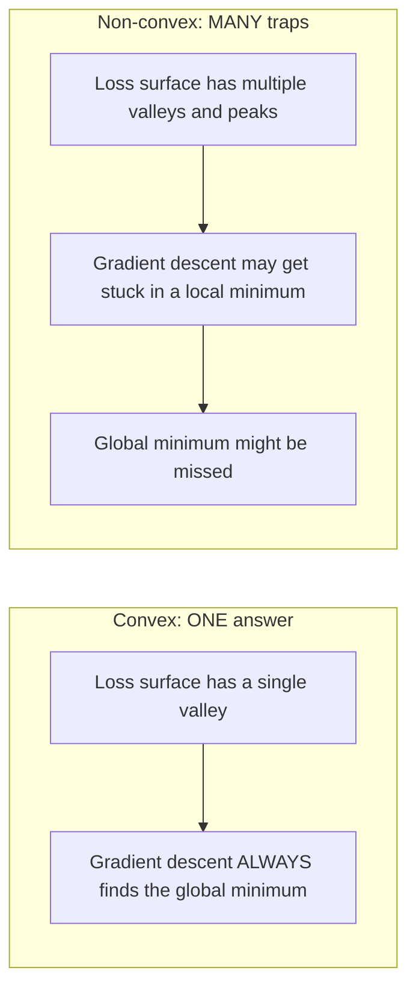
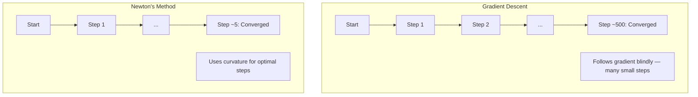
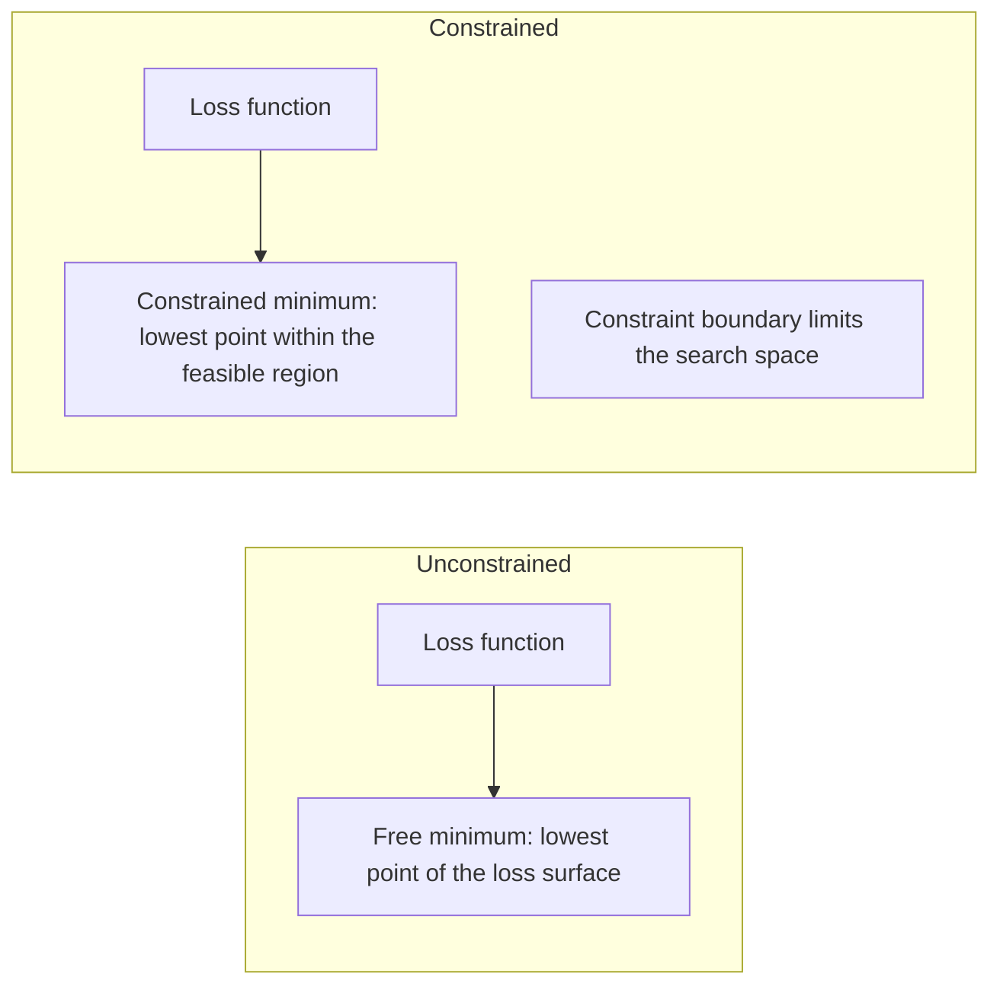
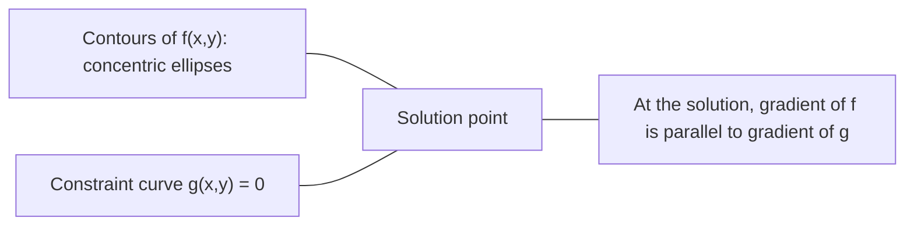

# 볼록 최적화

> Convex problem에는 valley가 하나뿐입니다. Neural network에는 수백만 개가 있습니다. 그 차이를 아는 것이 중요합니다.

**Type:** Build
**Languages:** Python
**Prerequisites:** Phase 1, Lessons 04 (Calculus for ML), 08 (Optimization)
**Time:** ~90 minutes

## 학습 목표

- definition, second derivative, Hessian criteria를 사용해 function이 convex인지 테스트합니다
- Newton's method를 구현하고 quadratic convergence를 gradient descent와 비교합니다
- Lagrange multipliers를 사용해 constrained optimization problems를 풀고 KKT conditions를 해석합니다
- neural network loss landscapes가 non-convex인데도 SGD가 좋은 해를 찾는 이유를 설명합니다

## 문제

Lesson 08에서는 gradient descent, momentum, Adam을 배웠습니다. 이 optimizer들은 어떤 surface에서도 downhill로 걸어갑니다. 하지만 보장은 없습니다. non-convex landscape에서 gradient descent는 나쁜 local minimum에 도착하거나 saddle point에 갇히거나 계속 oscillate할 수 있습니다. 그래도 neural network는 non-convex이고 대안이 없기 때문에 사용했습니다.

하지만 machine learning의 많은 problems는 convex입니다. Linear regression, logistic regression, SVMs, LASSO, ridge regression이 그렇습니다. 이런 경우에는 더 강한 것이 있습니다. mathematical guarantees가 있는 optimization입니다. convex problem에는 정확히 하나의 valley만 있습니다. downhill로 걷는 어떤 algorithm도 global minimum에 도달합니다. restarts도 필요 없고 learning rate schedules도 필요 없으며 운에 맡길 필요도 없습니다.

convexity를 이해하면 세 가지를 얻습니다. 첫째, problem이 쉬운지(convex) 어려운지(non-convex) 알려 줍니다. 둘째, convex problems에 대해 Newton's method 같은 더 빠른 도구를 제공합니다. 셋째, ML 전반에 등장하는 concepts를 설명합니다. constraint로서의 regularization, SVMs의 duality, 그리고 convexity가 주는 좋은 properties를 모두 위반하는데도 deep learning이 작동하는 이유입니다.

## 개념

### Convex sets 설명

set S 안의 임의의 두 points에 대해, 그 사이의 line segment도 완전히 S 안에 있으면 S는 convex입니다.

| Convex sets | Convex가 아님 |
|---|---|
| **Rectangle**: 내부의 임의의 두 points를 내부에 머무는 line segment로 연결할 수 있음 | **Star/crescent shape**: 내부의 두 points를 잇는 line이 set 밖으로 나갈 수 있음 |
| **Triangle**: 모든 interior points에 대해 같은 property가 성립 | **Donut/annulus**: hole 때문에 일부 line segments가 set을 벗어남 |
| 임의의 두 points 사이의 line segment가 set 안에 머묾 | 일부 point pairs 사이의 line segment가 set을 벗어남 |

형식적 테스트: S 안의 임의의 points x, y와 임의의 t in [0, 1]에 대해 point tx + (1-t)y도 S 안에 있어야 합니다.

convex sets의 예:
- line, plane, R^n 전체
- ball(circle, sphere, hypersphere)
- halfspace: {x : a^T x <= b}
- 임의 개수의 convex sets의 intersection

non-convex sets의 예:
- donut(annulus)
- 두 disjoint circles의 union
- "dent"나 "hole"이 있는 set

### Convex functions 설명

function f의 domain이 convex set이고, domain 안의 임의의 두 points x, y와 임의의 t in [0, 1]에 대해 다음이 성립하면 f는 convex입니다.

```text
f(tx + (1-t)y) <= t*f(x) + (1-t)*f(y)
```

기하학적으로는 graph 위의 임의의 두 points를 잇는 line segment가 graph 위에 있거나 그보다 위에 있다는 뜻입니다.

| 성질 | Convex function | Non-convex function |
|---|---|---|
| **Line segment test** | graph 위의 임의의 두 points 사이 line이 curve **위에 있거나 그 위**에 있음 | graph 위의 일부 points 사이 line이 curve **아래**로 내려감 |
| **Shape** | 위로 휘는 single bowl/valley | mixed curvature를 가진 multiple peaks and valleys |
| **Local minima** | 모든 local minimum이 global minimum | 서로 다른 heights의 multiple local minima가 존재할 수 있음 |

흔한 convex functions:
- f(x) = x^2 (parabola)
- f(x) = |x| (absolute value)
- f(x) = e^x (exponential)
- f(x) = max(0, x) (ReLU, though piecewise linear)
- f(x) = -log(x) for x > 0 (negative log)
- 임의의 linear function f(x) = a^T x + b (convex이면서 concave)

### convexity 테스트

쉬운 것부터 엄밀한 것까지 세 가지 practical test가 있습니다.

**Test 1: Second derivative test (1D).** 모든 x에 대해 f''(x) >= 0이면 f는 convex입니다.

- f(x) = x^2: f''(x) = 2 >= 0. Convex입니다.
- f(x) = x^3: f''(x) = 6x. x < 0에서는 negative입니다. Convex가 아닙니다.
- f(x) = e^x: f''(x) = e^x > 0. Convex입니다.

**Test 2: Hessian test (multivariate).** 모든 x에 대해 Hessian matrix H(x)가 positive semidefinite이면 f는 convex입니다. Hessian은 second partial derivatives의 matrix입니다.

**Test 3: Definition test.** inequality f(tx + (1-t)y) <= t*f(x) + (1-t)*f(y)를 직접 확인합니다. derivatives를 계산하기 어려운 functions에 유용합니다.

### convexity가 중요한 이유

convex optimization의 핵심 theorem:

**convex function에서는 모든 local minimum이 global minimum입니다.**

이는 gradient descent가 갇힐 수 없다는 뜻입니다. 어떤 downhill path도 같은 답으로 이어집니다. algorithm은 optimal solution으로 수렴한다는 보장을 갖습니다.



결과:
- random restarts가 필요 없음
- 정교한 learning rate schedules가 필요 없음
- convergence proofs가 가능함(rate는 function properties에 따라 달라짐)
- solution이 unique함(flat regions까지 고려)

### ML에서 convex vs non-convex

| Problem | Convex? | 이유 |
|---------|---------|-----|
| Linear regression (MSE) | Yes | Loss가 weights에 대해 quadratic |
| Logistic regression | Yes | Log-loss가 weights에 대해 convex |
| SVM (hinge loss) | Yes | linear functions의 maximum |
| LASSO (L1 regression) | Yes | convex functions의 sum은 convex |
| Ridge regression (L2) | Yes | Quadratic + quadratic = convex |
| Neural network (any loss) | No | Nonlinear activations가 non-convex landscape를 만듦 |
| k-means clustering | No | Discrete assignment step |
| Matrix factorization | No | unknowns의 product |

convex losses를 가진 linear models는 convex입니다. nonlinear activations가 있는 hidden layers를 추가하는 순간 convexity는 깨집니다.

### Hessian matrix 설명

function f: R^n -> R의 Hessian H는 second partial derivatives의 n x n matrix입니다.

```text
H[i][j] = d^2 f / (dx_i dx_j)
```

For f(x, y) = x^2 + 3xy + y^2:

```text
df/dx = 2x + 3y       d^2f/dx^2 = 2      d^2f/dxdy = 3
df/dy = 3x + 2y       d^2f/dydx = 3      d^2f/dy^2 = 2

H = [ 2  3 ]
    [ 3  2 ]
```

Hessian은 curvature를 알려 줍니다.
- Eigenvalues가 모두 positive: function이 모든 direction에서 위로 휨(그 point에서 convex)
- Eigenvalues가 모두 negative: 모든 direction에서 아래로 휨(concave, local max)
- Mixed signs: saddle point(어떤 directions에서는 위로, 다른 directions에서는 아래로 휨)
- Zero eigenvalue: 그 direction에서 flat(degenerate)

convexity를 위해서는 Hessian이 한 point가 아니라 모든 곳에서 positive semidefinite(모든 eigenvalues >= 0)여야 합니다.

### Newton's method 설명

Gradient descent는 first-order information(gradient)을 사용합니다. Newton's method는 second-order information(Hessian)을 사용합니다. 현재 point에서 quadratic approximation을 맞추고 그 quadratic의 minimum으로 바로 이동합니다.

```text
Update rule:
  x_new = x - H^(-1) * gradient

Compare to gradient descent:
  x_new = x - lr * gradient
```

Newton's method는 scalar learning rate를 inverse Hessian으로 대체합니다. 이는 local curvature에 따라 step size와 direction을 자동으로 조정합니다.



장점:
- minimum 근처에서 quadratic convergence(error가 각 step마다 제곱됨)
- tune할 learning rate가 없음
- Scale-invariant(problem을 어떻게 parameterize하든 작동)

단점:
- Hessian을 계산하는 데 O(n^2) memory가 들고 invert하는 데 O(n^3)이 듦
- 1 million weights를 가진 neural network에서는 10^12 entries와 10^18 operations
- deep learning에는 실용적이지 않음

### Constrained optimization 설명

Unconstrained optimization: 모든 x에 대해 f(x)를 minimize합니다.
Constrained optimization: constraints를 만족하면서 f(x)를 minimize합니다.

실제 problems에는 constraints가 있습니다. cost를 minimize하고 싶지만 budget은 제한되어 있습니다. error를 minimize하고 싶지만 model complexity는 bounded되어 있습니다.



### Lagrange multipliers 설명

Lagrange multipliers method는 constrained problem을 unconstrained problem으로 변환합니다.

Problem: g(x) = 0을 만족하면서 f(x)를 minimize합니다.

Solution: 새 variable(Lagrange multiplier lambda)을 도입하고 unconstrained problem을 풉니다.

```text
L(x, lambda) = f(x) + lambda * g(x)
```

solution에서는 L의 gradient가 zero입니다.

```text
dL/dx = df/dx + lambda * dg/dx = 0
dL/dlambda = g(x) = 0
```

Geometric intuition: constrained minimum에서 f의 gradient는 constraint g의 gradient와 parallel이어야 합니다. parallel이 아니라면 constraint surface를 따라 움직여 f를 더 줄일 수 있습니다.



예: x + y = 1을 만족하면서 f(x,y) = x^2 + y^2를 minimize합니다.

```text
L = x^2 + y^2 + lambda(x + y - 1)

dL/dx = 2x + lambda = 0  =>  x = -lambda/2
dL/dy = 2y + lambda = 0  =>  y = -lambda/2
dL/dlambda = x + y - 1 = 0

From first two: x = y
Substituting: 2x = 1, so x = y = 0.5, lambda = -1
```

line x + y = 1 위에서 origin에 가장 가까운 point는 (0.5, 0.5)입니다.

### KKT conditions 설명

Karush-Kuhn-Tucker conditions는 Lagrange multipliers를 inequality constraints로 확장합니다.

Problem: i = 1, ..., m에 대해 g_i(x) <= 0을 만족하면서 f(x)를 minimize합니다.

KKT conditions(optimality에 필요한 조건):

```text
1. Stationarity:    df/dx + sum(lambda_i * dg_i/dx) = 0
2. Primal feasibility:  g_i(x) <= 0  for all i
3. Dual feasibility:    lambda_i >= 0  for all i
4. Complementary slackness:  lambda_i * g_i(x) = 0  for all i
```

Complementary slackness가 핵심 insight입니다. constraint가 active이거나(g_i = 0, solution이 boundary 위에 있음), multiplier가 zero입니다(constraint가 중요하지 않음). solution에 영향을 주지 않는 constraint는 lambda = 0입니다.

KKT conditions는 SVMs의 중심입니다. support vectors는 constraint가 active인(lambda > 0) data points입니다. 다른 모든 data points는 lambda = 0이고 decision boundary에 영향을 주지 않습니다.

### constrained optimization으로서의 Regularization

L1과 L2 regularization은 임의의 trick이 아닙니다. disguised constrained optimization problems입니다.

**L2 regularization(Ridge) 설명:**

```text
minimize  Loss(w)  subject to  ||w||^2 <= t

Equivalent unconstrained form:
minimize  Loss(w) + lambda * ||w||^2
```

constraint ||w||^2 <= t는 ball(2D에서는 circle, 3D에서는 sphere)을 정의합니다. solution은 loss contours가 이 ball에 처음 닿는 곳입니다.

**L1 regularization(LASSO) 설명:**

```text
minimize  Loss(w)  subject to  ||w||_1 <= t

Equivalent unconstrained form:
minimize  Loss(w) + lambda * ||w||_1
```

constraint ||w||_1 <= t는 diamond(2D에서 rotated square)를 정의합니다.

| 성질 | L2 constraint (circle) | L1 constraint (diamond) |
|---|---|---|
| **Constraint shape** | Circle(higher dims에서는 sphere) | Diamond(2D에서 rotated square) |
| **Loss contour가 닿는 곳** | Smooth boundary, circle 위의 임의의 point | Corner, axis와 aligned |
| **Solution behavior** | Weights가 작지만 nonzero | 일부 weights가 정확히 zero(sparse) |
| **Result** | Weight shrinkage | Feature selection |

이것은 L1이 sparse models(feature selection)를 만들고 L2는 weights를 shrink하기만 하는 이유를 설명합니다. diamond에는 axes와 aligned된 corners가 있습니다. Loss contours는 corner에 닿을 가능성이 더 높고, 하나 이상의 weights를 정확히 zero로 만듭니다.

### Duality 설명

모든 constrained optimization problem(primal)에는 companion problem(dual)이 있습니다. convex problems에서는 primal과 dual이 같은 optimal value를 갖습니다. 이것이 strong duality입니다.

Lagrangian dual function 설명:

```text
Primal: minimize f(x) subject to g(x) <= 0
Lagrangian: L(x, lambda) = f(x) + lambda * g(x)
Dual function: d(lambda) = min_x L(x, lambda)
Dual problem: maximize d(lambda) subject to lambda >= 0
```

duality가 중요한 이유:
- dual problem이 때때로 primal보다 풀기 쉽습니다
- SVMs는 dual form으로 풀리며, 여기서 problem은 data points 사이의 dot products에 의존합니다(kernel trick 가능)
- dual은 primal optimum에 대한 lower bound를 제공하므로 solution quality를 확인하는 데 유용합니다

SVMs에 대해서는 구체적으로:

```text
Primal: find w, b that maximize the margin 2/||w|| subject to
        y_i(w^T x_i + b) >= 1 for all i

Dual:   maximize sum(alpha_i) - 0.5 * sum_ij(alpha_i * alpha_j * y_i * y_j * x_i^T x_j)
        subject to alpha_i >= 0 and sum(alpha_i * y_i) = 0

The dual only involves dot products x_i^T x_j.
Replace x_i^T x_j with K(x_i, x_j) to get the kernel trick.
```

### non-convexity에도 deep learning이 작동하는 이유

Neural network loss functions는 매우 non-convex입니다. classical measure로 보면 이를 optimize하는 것은 실패해야 합니다. 하지만 stochastic gradient descent는 안정적으로 좋은 solutions를 찾습니다. 몇 가지 factors가 이를 설명합니다.

**대부분의 local minima는 충분히 좋습니다.** high-dimensional spaces에서 random critical points(gradient가 zero인 곳)의 압도적 다수는 local minima가 아니라 saddle points입니다. 존재하는 소수의 local minima는 global minimum에 가까운 loss values를 갖는 경향이 있습니다. parameter space가 millions of dimensions를 가지면 끔찍한 local minimum에 갇힐 가능성은 극히 낮습니다.

**진짜 obstacle은 local minima가 아니라 saddle points입니다.** n parameters를 가진 function에서 saddle point는 positive와 negative curvature directions가 섞여 있습니다. high dimensions의 random critical point에서 모든 n eigenvalues가 positive일(local minimum일) 확률은 대략 2^(-n)입니다. 거의 모든 critical points는 saddle points입니다. SGD의 noise가 이를 빠져나오게 돕습니다.

**Overparameterization은 landscape를 매끄럽게 합니다.** training examples보다 parameters가 많은 networks는 더 매끄럽고 더 연결된 loss surfaces를 갖습니다. 더 넓은 networks에는 나쁜 local minima가 더 적습니다. 이는 직관에 어긋나지만 empirical하게 일관됩니다.

**Loss landscape 구조:**

| Property | Low-dimensional space | High-dimensional space |
|---|---|---|
| **Landscape** | many isolated peaks and valleys | smoothly connected valleys |
| **Minima** | many isolated local minima | bad local minima는 적고 대부분 near-optimal |
| **Navigation** | global minimum을 찾기 어려움 | 많은 paths가 good solutions로 이어짐 |
| **Critical points** | local minima와 saddle points가 섞임 | 압도적으로 saddle points이며 local minima가 아님 |

**Stochastic noise는 implicit regularization처럼 작동합니다.** Mini-batch SGD는 sharp minima에 안착하는 것을 막는 noise를 추가합니다. Sharp minima는 overfit하고 flat minima는 generalize합니다. noise는 optimization을 loss landscape의 flat regions 쪽으로 bias합니다.

### 실제 second-order methods

순수 Newton's method는 large models에 비실용적입니다. 여러 approximations가 second-order information을 사용할 수 있게 만듭니다.

**L-BFGS (Limited-memory BFGS):** 마지막 m개의 gradient differences를 사용해 inverse Hessian을 근사합니다. O(n^2) 대신 O(mn) memory가 필요합니다. 최대 약 10,000 parameters 규모의 problems에서 잘 작동합니다. classical ML(logistic regression, CRFs)에서는 사용되지만 deep learning에서는 잘 쓰이지 않습니다.

**Natural gradient:** 표준 Hessian 대신 Fisher information matrix(log-likelihood의 expected Hessian)를 사용합니다. 이는 probability distributions의 geometry를 반영합니다. K-FAC(Kronecker-Factored Approximate Curvature)는 Fisher matrix를 Kronecker product로 근사해 neural networks에서도 실용적으로 만듭니다.

**Hessian-free optimization:** H를 직접 만들지 않고 conjugate gradient를 사용해 Hx = g를 풉니다. Hessian-vector products만 필요하며, 이는 automatic differentiation으로 O(n) time에 계산할 수 있습니다.

**Diagonal approximations:** Adam의 second moment는 Hessian diagonal의 diagonal approximation입니다. AdaHessian은 Hutchinson's estimator를 통해 실제 Hessian diagonal elements를 사용하도록 이를 확장합니다.

| Method | Memory | Step당 비용 | 사용할 때 |
|--------|--------|--------------|-------------|
| Gradient descent | O(n) | O(n) | Baseline, large models |
| Newton's method | O(n^2) | O(n^3) | 작은 convex problems |
| L-BFGS | O(mn) | O(mn) | 중간 규모 convex problems |
| Adam | O(n) | O(n) | Deep learning default |
| K-FAC | O(n) | layer당 O(n) | Research, large-batch training |

```figure
convex-vs-nonconvex
```

## 직접 만들기

### 단계 1: Convexity checker

points를 sampling하고 definition을 확인하여 convexity를 경험적으로 테스트하는 function을 만드세요.

```python
import random
import math

def check_convexity(f, dim, bounds=(-5, 5), samples=1000):
    violations = 0
    for _ in range(samples):
        x = [random.uniform(*bounds) for _ in range(dim)]
        y = [random.uniform(*bounds) for _ in range(dim)]
        t = random.uniform(0, 1)
        mid = [t * xi + (1 - t) * yi for xi, yi in zip(x, y)]
        lhs = f(mid)
        rhs = t * f(x) + (1 - t) * f(y)
        if lhs > rhs + 1e-10:
            violations += 1
    return violations == 0, violations
```

### 단계 2: 2D용 Newton's method

explicit Hessian을 사용해 Newton's method를 구현하세요. convergence speed를 gradient descent와 비교하세요.

```python
def newtons_method(f, grad_f, hessian_f, x0, steps=50, tol=1e-12):
    x = list(x0)
    history = [x[:]]
    for _ in range(steps):
        g = grad_f(x)
        H = hessian_f(x)
        det = H[0][0] * H[1][1] - H[0][1] * H[1][0]
        if abs(det) < 1e-15:
            break
        H_inv = [
            [H[1][1] / det, -H[0][1] / det],
            [-H[1][0] / det, H[0][0] / det],
        ]
        dx = [
            H_inv[0][0] * g[0] + H_inv[0][1] * g[1],
            H_inv[1][0] * g[0] + H_inv[1][1] * g[1],
        ]
        x = [x[0] - dx[0], x[1] - dx[1]]
        history.append(x[:])
        if sum(gi ** 2 for gi in g) < tol:
            break
    return history
```

### 단계 3: Lagrange multiplier solver

Lagrangian에 gradient descent를 적용해 constrained optimization을 푸세요.

```python
def lagrange_solve(f_grad, g_val, g_grad, x0, lr=0.01,
                   lr_lambda=0.01, steps=5000):
    x = list(x0)
    lam = 0.0
    history = []
    for _ in range(steps):
        fg = f_grad(x)
        gv = g_val(x)
        gg = g_grad(x)
        x = [
            xi - lr * (fgi + lam * ggi)
            for xi, fgi, ggi in zip(x, fg, gg)
        ]
        lam = lam + lr_lambda * gv
        history.append((x[:], lam, gv))
    return history
```

### 단계 4: first-order와 second-order 비교

같은 quadratic function에서 gradient descent와 Newton's method를 실행하세요. convergence까지의 steps를 세세요.

```python
def quadratic(x):
    return 5 * x[0] ** 2 + x[1] ** 2

def quadratic_grad(x):
    return [10 * x[0], 2 * x[1]]

def quadratic_hessian(x):
    return [[10, 0], [0, 2]]
```

Newton's method는 1 step에 수렴합니다(quadratics에서는 exact). Hessian의 eigenvalues가 factor 5만큼 달라 elongated valley를 만들기 때문에 gradient descent는 수백 steps가 걸립니다.

## 사용하기

Convexity analysis는 ML models와 solvers를 선택할 때 직접 적용됩니다.

convex problems(logistic regression, SVMs, LASSO)의 경우:
- dedicated solvers(liblinear, CVXPY, scipy.optimize.minimize with method='L-BFGS-B')를 사용하세요
- unique global solution을 기대하세요
- second-order methods는 실용적이고 빠릅니다

non-convex problems(neural networks)의 경우:
- first-order methods(SGD, Adam)를 사용하세요
- solution이 initialization과 randomness에 의존함을 받아들이세요
- overparameterization, noise, learning rate schedules를 implicit regularization으로 사용하세요
- global minimum을 찾는 데 시간을 낭비하지 마세요. 좋은 local minimum이면 충분합니다.

```python
from scipy.optimize import minimize

result = minimize(
    fun=lambda w: sum((y - X @ w) ** 2) + 0.1 * sum(w ** 2),
    x0=np.zeros(d),
    method='L-BFGS-B',
    jac=lambda w: -2 * X.T @ (y - X @ w) + 0.2 * w,
)
```

SVMs에서는 dual formulation 덕분에 kernel trick을 사용할 수 있습니다.

```python
from sklearn.svm import SVC

svm = SVC(kernel='rbf', C=1.0)
svm.fit(X_train, y_train)
print(f"Support vectors: {svm.n_support_}")
```

## 연습 문제

1. **Convexity gallery.** checker를 사용해 다음 functions의 convexity를 테스트하세요: f(x) = x^4, f(x) = sin(x), f(x,y) = x^2 + y^2, f(x,y) = x*y, f(x) = max(x, 0). 각 결과가 왜 타당한지 설명하세요.

2. **Newton vs gradient descent race.** starting point (10, 10)에서 f(x,y) = 50*x^2 + y^2에 두 method를 모두 실행하세요. loss < 1e-10에 도달하려면 각각 몇 step이 필요한가요? condition number(Hessian eigenvalue의 largest/smallest ratio)가 증가하면 gradient descent에는 어떤 일이 일어나나요?

3. **Lagrange multiplier geometry.** x + 2y = 4를 만족하면서 f(x,y) = (x-3)^2 + (y-3)^2를 minimize하세요. solution에서 f의 gradient가 g의 gradient와 parallel인지 확인해 solution을 검증하세요.

4. **Regularization constraint.** L1-constrained optimization을 구현하세요: |x| + |y| <= 1을 만족하면서 (x-3)^2 + (y-2)^2를 minimize합니다. solution의 coordinate 하나가 zero임을 보이세요(diamond constraint에서 오는 sparsity).

5. **Hessian eigenvalue analysis.** Rosenbrock function의 Hessian을 (1,1)과 (-1,1)에서 계산하세요. 두 points에서 eigenvalues를 계산하세요. eigenvalues는 minimum과 그곳에서 먼 지점의 curvature에 대해 무엇을 알려 주나요?

## 핵심 용어

| 용어 | 의미 |
|------|---------------|
| Convex set | set 안의 임의의 두 points 사이 line segment가 set 안에 머무는 set |
| Convex function | graph 위의 임의의 두 points 사이 line이 graph 위에 있거나 그보다 위에 있는 function입니다. 동치로 Hessian이 모든 곳에서 positive semidefinite입니다. |
| Local minimum | 주변 모든 points보다 낮은 point입니다. convex functions에서는 모든 local minimum이 global minimum입니다. |
| Global minimum | function의 전체 domain에서 가장 낮은 point입니다. |
| Hessian matrix | 모든 second partial derivatives의 matrix입니다. curvature information을 encode합니다. |
| Positive semidefinite | eigenvalues가 모두 non-negative인 matrix입니다. "second derivative >= 0"의 multidimensional analogue입니다. |
| Condition number | Hessian의 largest/smallest eigenvalue ratio입니다. 높은 condition number는 elongated valleys와 느린 gradient descent를 의미합니다. |
| Newton's method | inverse Hessian을 사용해 step direction과 size를 결정하는 second-order optimizer입니다. minimum 근처에서 quadratic convergence를 보입니다. |
| Lagrange multiplier | constrained optimization problem을 unconstrained one으로 바꾸기 위해 도입하는 variable입니다. |
| KKT conditions | inequality constraints가 있는 optimality의 necessary conditions입니다. Lagrange multipliers를 generalize합니다. |
| Complementary slackness | solution에서 constraint가 active이거나 multiplier가 zero입니다. 둘 다 nonzero일 수 없습니다. |
| Duality | 모든 constrained problem에는 companion dual problem이 있습니다. convex problems에서는 둘이 같은 optimal value를 갖습니다. |
| Strong duality | primal과 dual optimal values가 같습니다. Slater's condition을 만족하는 convex problems에서 성립합니다. |
| L-BFGS | full Hessian 대신 마지막 m gradient differences를 저장하는 approximate second-order method입니다. |
| Saddle point | gradient는 zero이지만 일부 directions에서는 minimum이고 다른 directions에서는 maximum인 point입니다. |
| Overparameterization | training examples보다 더 많은 parameters를 사용합니다. loss landscape를 smooth하게 하고 bad local minima를 줄입니다. |

## 더 읽을거리

- [Boyd & Vandenberghe: Convex Optimization](https://web.stanford.edu/~boyd/cvxbook/) - 온라인에서 무료로 제공되는 표준 교재
- [Bottou, Curtis, Nocedal: Optimization Methods for Large-Scale Machine Learning (2018)](https://arxiv.org/abs/1606.04838) - convex optimization theory와 deep learning practice를 연결하는 논문
- [Choromanska et al.: The Loss Surfaces of Multilayer Networks (2015)](https://arxiv.org/abs/1412.0233) - non-convex neural network landscapes가 보이는 것만큼 나쁘지 않은 이유
- [Nocedal & Wright: Numerical Optimization](https://link.springer.com/book/10.1007/978-0-387-40065-5) - Newton's method, L-BFGS, constrained optimization의 종합 참고서
