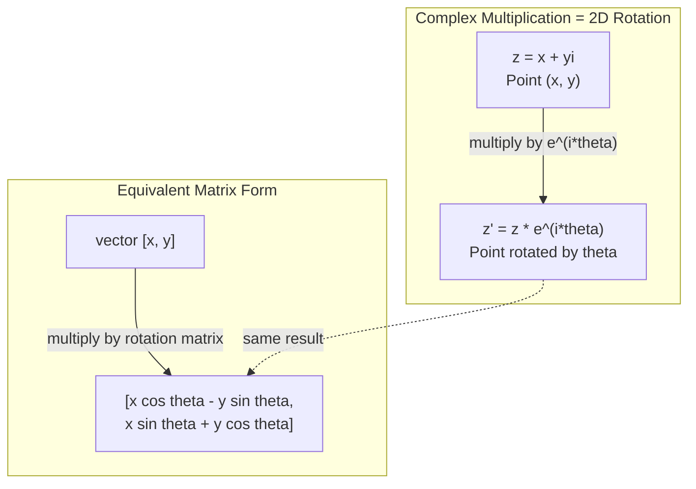
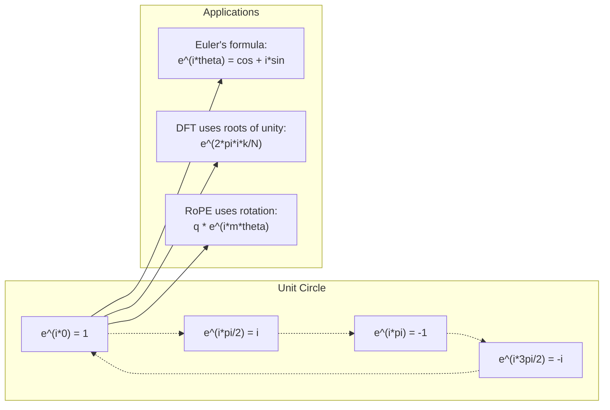

# AI를 위한 복소수

> -1의 제곱근은 상상이 아닙니다. 그것은 rotations, frequencies, 그리고 signal processing의 절반을 여는 열쇠입니다.

**Type:** Learn
**Languages:** Python
**Prerequisites:** Phase 1, Lessons 01-04 (linear algebra, calculus)
**Time:** ~60 minutes

## 학습 목표

- rectangular form과 polar form 모두에서 complex arithmetic(add, multiply, divide, conjugate)을 수행합니다
- Euler's formula를 적용해 complex exponentials와 trigonometric functions 사이를 변환합니다
- complex roots of unity를 사용해 Discrete Fourier Transform을 구현합니다
- complex rotations가 transformers의 RoPE와 sinusoidal positional encodings의 기반이 되는 방식을 설명합니다

## 문제

Fourier transforms 논문을 열면 곳곳에 `i`가 있습니다. transformer positional encodings를 보면 서로 다른 frequencies의 `sin`과 `cos`가 보입니다. 이것들은 complex exponentials의 real part와 imaginary part입니다. quantum computing을 읽으면 모든 것이 complex vector spaces로 표현되어 있습니다.

Complex numbers는 추상적으로 보입니다. -1의 제곱근 위에 만든 number system은 수학적 요령처럼 느껴집니다. 하지만 요령이 아닙니다. rotations와 oscillations의 자연스러운 언어입니다. 무언가가 회전하거나 진동하거나 oscillate할 때마다 complex numbers가 올바른 도구입니다.

Complex numbers를 이해하지 못하면 Discrete Fourier Transform을 이해할 수 없습니다. FFT도 이해할 수 없습니다. modern language models에서 RoPE(Rotary Position Embedding)가 어떻게 작동하는지도 이해할 수 없습니다. original Transformer paper의 sinusoidal positional encodings가 왜 그런 frequencies를 사용하는지도 이해할 수 없습니다.

이 lesson은 complex arithmetic을 처음부터 만들고, 그것을 geometry와 연결하며, machine learning에서 complex numbers가 정확히 어디에 나타나는지 보여 줍니다.

## 개념

### complex number란 무엇인가?

complex number에는 두 부분이 있습니다. real part와 imaginary part입니다.

```text
z = a + bi

where:
  a is the real part
  b is the imaginary part
  i is the imaginary unit, defined by i^2 = -1
```

그게 전부입니다. number line을 plane으로 확장한 것입니다. real numbers는 한 axis에 있고 imaginary numbers는 다른 axis에 있습니다. 모든 complex number는 이 plane의 한 점입니다.

### Complex arithmetic 설명

**Addition.** real parts끼리 더하고 imaginary parts끼리 더합니다.

```text
(a + bi) + (c + di) = (a + c) + (b + d)i

Example: (3 + 2i) + (1 + 4i) = 4 + 6i
```

**Multiplication.** distributive law를 사용하고 i^2 = -1임을 기억합니다.

```text
(a + bi)(c + di) = ac + adi + bci + bdi^2
                 = ac + adi + bci - bd
                 = (ac - bd) + (ad + bc)i

Example: (3 + 2i)(1 + 4i) = 3 + 12i + 2i + 8i^2
                            = 3 + 14i - 8
                            = -5 + 14i
```

**Conjugate.** imaginary part의 sign을 뒤집습니다.

```text
conjugate of (a + bi) = a - bi
```

complex number와 그 conjugate의 product는 항상 real입니다.

```text
(a + bi)(a - bi) = a^2 + b^2
```

**Division.** numerator와 denominator에 denominator의 conjugate를 곱합니다.

```text
(a + bi) / (c + di) = (a + bi)(c - di) / (c^2 + d^2)
```

이렇게 하면 denominator에서 imaginary part가 제거되어 깔끔한 complex number를 얻습니다.

### Complex plane 설명

complex plane은 모든 complex number를 2D point로 mapping합니다. horizontal axis는 real axis이고 vertical axis는 imaginary axis입니다.

```text
z = 3 + 2i  corresponds to the point (3, 2)
z = -1 + 0i corresponds to the point (-1, 0) on the real axis
z = 0 + 4i  corresponds to the point (0, 4) on the imaginary axis
```

complex number는 동시에 point이자 origin에서 시작하는 vector입니다. 이 이중 해석이 complex numbers를 geometry에 유용하게 만듭니다.

### Polar form 설명

plane의 어떤 point도 origin으로부터의 거리와 positive real axis로부터의 angle로 설명할 수 있습니다.

```text
z = r * (cos(theta) + i*sin(theta))

where:
  r = |z| = sqrt(a^2 + b^2)     (magnitude, or modulus)
  theta = atan2(b, a)             (phase, or argument)
```

Rectangular form(a + bi)은 addition에 좋습니다. Polar form(r, theta)은 multiplication에 좋습니다.

**polar form에서의 multiplication.** magnitudes를 곱하고 angles를 더합니다.

```text
z1 = r1 * e^(i*theta1)
z2 = r2 * e^(i*theta2)

z1 * z2 = (r1 * r2) * e^(i*(theta1 + theta2))
```

이것이 complex numbers가 rotations에 완벽한 이유입니다. magnitude가 1인 complex number를 곱하는 것은 pure rotation입니다.

### Euler's formula 설명

complex exponentials와 trigonometry를 잇는 다리입니다.

```text
e^(i*theta) = cos(theta) + i*sin(theta)
```

이 lesson에서 가장 중요한 공식입니다. theta = pi일 때:

```text
e^(i*pi) = cos(pi) + i*sin(pi) = -1 + 0i = -1

Therefore: e^(i*pi) + 1 = 0
```

다섯 fundamental constants(e, i, pi, 1, 0)가 하나의 equation으로 연결됩니다.

### Euler's formula가 ML에서 중요한 이유

Euler's formula는 theta가 변할 때 `e^(i*theta)`가 unit circle을 따라간다고 말합니다. theta = 0이면 (1, 0)에 있습니다. theta = pi/2이면 (0, 1)에 있습니다. theta = pi이면 (-1, 0)에 있습니다. theta = 3*pi/2이면 (0, -1)에 있습니다. full rotation은 theta = 2*pi입니다.

즉 complex exponentials는 rotations 그 자체입니다. 그리고 rotations는 signal processing과 ML 어디에나 있습니다.

### 2D rotations와의 연결

complex number (x + yi)에 e^(i*theta)를 곱하면 point (x, y)가 origin 주위로 angle theta만큼 회전합니다.

```text
Rotation via complex multiplication:
  (x + yi) * (cos(theta) + i*sin(theta))
  = (x*cos(theta) - y*sin(theta)) + (x*sin(theta) + y*cos(theta))i

Rotation via matrix multiplication:
  [cos(theta)  -sin(theta)] [x]   [x*cos(theta) - y*sin(theta)]
  [sin(theta)   cos(theta)] [y] = [x*sin(theta) + y*cos(theta)]
```

둘은 동일한 결과를 냅니다. Complex multiplication은 곧 2D rotation입니다. rotation matrix는 complex multiplication을 matrix notation으로 쓴 것일 뿐입니다.



### Phasors와 rotating signals

complex exponential e^(i*omega*t)는 angular frequency omega로 unit circle 주위를 도는 point입니다. t가 증가하면 그 point는 circle을 따라갑니다.

이 rotating point의 real part는 cos(omega*t)입니다. imaginary part는 sin(omega*t)입니다. sinusoidal signal은 rotating complex number의 그림자입니다.

```text
e^(i*omega*t) = cos(omega*t) + i*sin(omega*t)

Real part:      cos(omega*t)    -- a cosine wave
Imaginary part: sin(omega*t)    -- a sine wave
```

이것이 phasor representation입니다. 출렁이는 sine wave를 추적하는 대신 매끄럽게 회전하는 arrow를 추적합니다. Phase shifts는 angle offsets가 됩니다. Amplitude changes는 magnitude changes가 됩니다. signals의 addition은 vector addition이 됩니다.

### Roots of unity 설명

N-th roots of unity는 unit circle 위에 균등하게 배치된 N개의 points입니다.

```text
w_k = e^(2*pi*i*k/N)    for k = 0, 1, 2, ..., N-1
```

N = 4이면 roots는 1, i, -1, -i입니다(네 compass points).
N = 8이면 네 compass points에 네 diagonals가 더해집니다.

Roots of unity는 Discrete Fourier Transform의 토대입니다. DFT는 signal을 이 N개의 균등 간격 frequencies에 있는 components로 분해합니다.

### DFT와의 연결

signal x[0], x[1], ..., x[N-1]의 Discrete Fourier Transform은 다음과 같습니다.

```text
X[k] = sum_{n=0}^{N-1} x[n] * e^(-2*pi*i*k*n/N)
```

각 X[k]는 signal이 k-th root of unity, 즉 frequency k의 complex sinusoid와 얼마나 correlate하는지 측정합니다. DFT는 signal을 N개의 rotating phasors로 나누고 각각의 amplitude와 phase를 알려 줍니다.

### i가 imaginary가 아닌 이유

"imaginary"라는 단어는 역사적 우연입니다. Descartes가 폄하하는 의미로 사용했습니다. 하지만 i는 사람들이 처음 negative numbers를 거부했을 때의 negative numbers보다 더 상상적인 것이 아닙니다. Negative numbers는 "3에서 5를 빼려면 무엇이 필요한가?"에 답합니다. imaginary unit은 "무엇을 제곱하면 -1이 되는가?"에 답합니다.

더 유용하게 말하면 i는 90-degree rotation operator입니다. real number에 i를 한 번 곱하면 imaginary axis로 90 degrees 회전합니다. i를 다시 곱하면(i^2) 또 90 degrees 회전하여 negative real direction을 가리킵니다. 그래서 i^2 = -1입니다. 신비로운 것이 아닙니다. 두 quarter-turns로 만든 half-turn입니다.

이것이 complex numbers가 engineering 어디에나 있는 이유입니다. electromagnetic waves, quantum states, signal oscillations, positional encodings처럼 회전하는 것은 무엇이든 complex numbers로 자연스럽게 설명됩니다.

### Complex exponentials와 trigonometric functions

Euler's formula 이전에 engineers는 signals를 A*cos(omega*t + phi)로 썼습니다. amplitude A, frequency omega, phase phi입니다. 이것은 작동하지만 arithmetic을 고통스럽게 만듭니다. phases가 다른 두 cosines를 더하려면 trigonometric identities가 필요합니다.

complex exponentials를 쓰면 같은 signal은 A*e^(i*(omega*t + phi))입니다. 두 signals를 더하는 것은 complex numbers 두 개를 더하는 것뿐입니다. 곱하기(modulating)는 magnitudes를 곱하고 angles를 더하는 것뿐입니다. Phase shifts는 angle additions가 됩니다. Frequency shifts는 phasors를 곱하는 것이 됩니다.

signal processing 전체 분야가 complex exponential notation으로 전환한 이유는 수학이 더 깔끔하기 때문입니다. "real signal"은 항상 complex representation의 real part일 뿐입니다. imaginary part는 bookkeeping으로 함께 따라다니며 모든 algebra가 자연스럽게 맞아떨어지게 합니다.

### transformers와의 연결

**Sinusoidal positional encodings** (original Transformer paper):

```text
PE(pos, 2i) = sin(pos / 10000^(2i/d))
PE(pos, 2i+1) = cos(pos / 10000^(2i/d))
```

sin과 cos pairs는 서로 다른 frequencies에서 complex exponentials의 real part와 imaginary part입니다. 각 frequency는 position을 encoding하기 위한 서로 다른 "resolution"을 제공합니다. Low frequencies는 천천히 변합니다(coarse position). High frequencies는 빠르게 변합니다(fine position). 함께 각 position에 unique frequency fingerprint를 줍니다.

**RoPE (Rotary Position Embedding)** 는 이것을 더 밀고 나갑니다. query와 key vectors에 complex rotation matrices를 명시적으로 곱합니다. 두 tokens 사이의 relative position은 rotation angle이 됩니다. Attention은 이 rotated vectors를 사용해 계산되므로, model은 complex multiplication을 통해 relative position에 민감해집니다.

| Operation | Algebraic Form | Geometric Meaning |
|-----------|---------------|-------------------|
| Addition | (a+c) + (b+d)i | Vector addition in the plane |
| Multiplication | (ac-bd) + (ad+bc)i | Rotate and scale |
| Conjugate | a - bi | Reflect over real axis |
| Magnitude | sqrt(a^2 + b^2) | Distance from origin |
| Phase | atan2(b, a) | Angle from positive real axis |
| Division | multiply by conjugate | Reverse rotation and rescale |
| Power | r^n * e^(i*n*theta) | Rotate n times, scale by r^n |



```figure
roots-of-unity
```

## 직접 만들기

### Step 1: Complex class 구현

arithmetic, magnitude, phase, rectangular form과 polar form 사이의 conversion을 지원하는 Complex number class를 만드세요.

```python
import math

class Complex:
    def __init__(self, real, imag=0.0):
        self.real = real
        self.imag = imag

    def __add__(self, other):
        return Complex(self.real + other.real, self.imag + other.imag)

    def __mul__(self, other):
        r = self.real * other.real - self.imag * other.imag
        i = self.real * other.imag + self.imag * other.real
        return Complex(r, i)

    def __truediv__(self, other):
        denom = other.real ** 2 + other.imag ** 2
        r = (self.real * other.real + self.imag * other.imag) / denom
        i = (self.imag * other.real - self.real * other.imag) / denom
        return Complex(r, i)

    def magnitude(self):
        return math.sqrt(self.real ** 2 + self.imag ** 2)

    def phase(self):
        return math.atan2(self.imag, self.real)

    def conjugate(self):
        return Complex(self.real, -self.imag)
```

### Step 2: Polar conversion과 Euler's formula

```python
def to_polar(z):
    return z.magnitude(), z.phase()

def from_polar(r, theta):
    return Complex(r * math.cos(theta), r * math.sin(theta))

def euler(theta):
    return Complex(math.cos(theta), math.sin(theta))
```

확인하세요: `euler(theta).magnitude()`는 항상 1.0이어야 합니다. `euler(0)`은 (1, 0)을, `euler(pi)`는 (-1, 0)을 줘야 합니다.

### Step 3: Rotation 구현

point (x, y)를 angle theta만큼 rotating하는 것은 complex multiplication 한 번입니다.

```python
point = Complex(3, 4)
rotated = point * euler(math.pi / 4)
```

magnitude는 그대로입니다. angle만 바뀝니다.

### Step 4: complex arithmetic으로 DFT 만들기

```python
def dft(signal):
    N = len(signal)
    result = []
    for k in range(N):
        total = Complex(0, 0)
        for n in range(N):
            angle = -2 * math.pi * k * n / N
            total = total + Complex(signal[n], 0) * euler(angle)
        result.append(total)
    return result
```

이것은 O(N^2) DFT입니다. 각 output X[k]는 signal samples에 roots of unity를 곱한 합입니다.

### Step 5: Inverse DFT 구현

inverse DFT는 spectrum에서 original signal을 reconstruct합니다. forward DFT와 달라지는 것은 exponent의 sign을 뒤집고 N으로 나누는 것뿐입니다.

```python
def idft(spectrum):
    N = len(spectrum)
    result = []
    for n in range(N):
        total = Complex(0, 0)
        for k in range(N):
            angle = 2 * math.pi * k * n / N
            total = total + spectrum[k] * euler(angle)
        result.append(Complex(total.real / N, total.imag / N))
    return result
```

이것은 perfect reconstruction을 제공합니다. DFT를 적용한 뒤 IDFT를 적용하면 machine precision 수준으로 original signal이 돌아옵니다. 정보는 손실되지 않습니다.

### Step 6: Roots of unity 구현

```python
def roots_of_unity(N):
    return [euler(2 * math.pi * k / N) for k in range(N)]
```

두 properties를 확인하세요.
- 모든 root의 magnitude는 정확히 1입니다.
- 모든 N roots의 합은 zero입니다(symmetry로 서로 상쇄됩니다).

이 properties가 DFT를 invertible하게 만듭니다. roots of unity는 frequency domain의 orthogonal basis를 형성합니다.

## 사용하기

Python은 complex number를 built-in으로 지원합니다. literal `j`는 imaginary unit을 나타냅니다.

```python
z = 3 + 2j
w = 1 + 4j

print(z + w)
print(z * w)
print(abs(z))

import cmath
print(cmath.phase(z))
print(cmath.exp(1j * cmath.pi))
```

arrays의 경우 numpy는 complex numbers를 native로 처리합니다.

```python
import numpy as np

z = np.array([1+2j, 3+4j, 5+6j])
print(np.abs(z))
print(np.angle(z))
print(np.conj(z))
print(np.real(z))
print(np.imag(z))

signal = np.sin(2 * np.pi * 5 * np.linspace(0, 1, 128))
spectrum = np.fft.fft(signal)
freqs = np.fft.fftfreq(128, d=1/128)
```

## 내보내기

`code/complex_numbers.py`를 실행해 `outputs/skill-complex-arithmetic.md`를 생성하세요.

## 연습 문제

1. **손으로 하는 Complex arithmetic.** (2 + 3i) * (4 - i)를 계산하고 code로 확인하세요. 그다음 (5 + 2i) / (1 - 3i)를 계산하세요. 두 결과를 complex plane에 그리고 multiplication이 첫 번째 number를 rotate하고 scale했는지 확인하세요.

2. **Rotation sequence.** point (1, 0)에서 시작하세요. e^(i*pi/6)을 열두 번 곱하세요. 12번 multiplication 후 (1, 0)으로 돌아오는지 확인하세요. 각 step의 coordinates를 출력하고 regular 12-gon을 따라가는지 확인하세요.

3. **known signal의 DFT.** 32 points에서 sampling한 sin(2*pi*3*t)와 0.5*sin(2*pi*7*t)의 합인 signal을 만드세요. 직접 만든 DFT를 실행하세요. magnitude spectrum이 frequencies 3과 7에서 peaks를 갖고, 7의 peak가 3의 peak height의 절반인지 확인하세요.

4. **Roots of unity visualization.** 8th roots of unity를 계산하세요. 합이 zero인지 확인하세요. 어떤 root에 primitive root e^(2*pi*i/8)을 곱하면 next root가 되는지 확인하세요.

5. **Rotation matrix equivalence.** 10개의 random angles와 10개의 random points에 대해 complex multiplication이 2x2 rotation matrix를 사용한 matrix-vector multiplication과 같은 결과를 주는지 확인하세요. maximum numerical difference를 출력하세요.

## 핵심 용어

| Term | What it means |
|------|---------------|
| Complex number | a + bi 형태의 number. a는 real part, b는 imaginary part이며 i^2 = -1 |
| Imaginary unit | i^2 = -1로 정의되는 number i. 철학적 의미의 imaginary가 아니라 rotation operator |
| Complex plane | x-axis가 real이고 y-axis가 imaginary인 2D plane. Argand plane이라고도 함 |
| Magnitude (modulus) | origin으로부터의 거리: sqrt(a^2 + b^2). \|z\|로 씀 |
| Phase (argument) | positive real axis로부터의 angle: atan2(b, a). arg(z)로 씀 |
| Conjugate | real axis에 대한 mirror image. a + bi의 conjugate는 a - bi |
| Polar form | z를 a + bi 대신 r * e^(i*theta)로 표현. multiplication을 쉽게 만듦 |
| Euler's formula | e^(i*theta) = cos(theta) + i*sin(theta). exponentials와 trigonometry를 연결 |
| Phasor | sinusoidal signal을 나타내는 rotating complex number e^(i*omega*t) |
| Roots of unity | k = 0 to N-1에 대한 N개의 complex numbers e^(2*pi*i*k/N). unit circle 위의 N개 균등 간격 points |
| DFT | Discrete Fourier Transform. roots of unity를 사용해 signal을 complex sinusoidal components로 분해 |
| RoPE | Rotary Position Embedding. transformer attention에서 relative position을 encode하기 위해 complex multiplication을 사용 |

## 더 읽을거리

- [Visual Introduction to Euler's Formula](https://betterexplained.com/articles/intuitive-understanding-of-eulers-formula/) - 무거운 notation 없이 geometric intuition을 만듭니다
- [Su et al.: RoFormer (2021)](https://arxiv.org/abs/2104.09864) - complex rotations를 사용하는 Rotary Position Embedding을 소개한 paper
- [Vaswani et al.: Attention Is All You Need (2017)](https://arxiv.org/abs/1706.03762) - sinusoidal positional encodings가 있는 original Transformer paper
- [3Blue1Brown: Euler's formula with introductory group theory](https://www.youtube.com/watch?v=mvmuCPvRoWQ) - e^(i*pi) = -1인 이유를 시각적으로 설명
- [Needham: Visual Complex Analysis](https://global.oup.com/academic/product/visual-complex-analysis-9780198534464) - geometric insight가 풍부한 complex numbers의 최고 visual treatment
- [Strang: Introduction to Linear Algebra, Ch. 10](https://math.mit.edu/~gs/linearalgebra/) - linear algebra와 eigenvalues 맥락에서의 complex numbers
