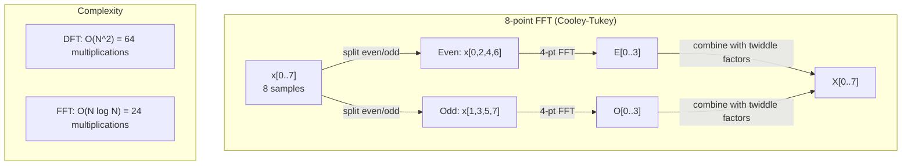
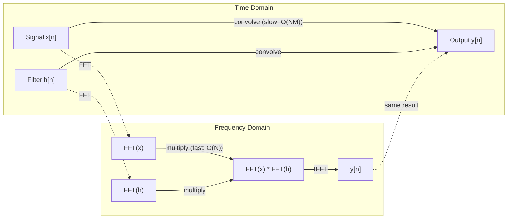

# 푸리에 변환

> 모든 signal은 sine waves의 합입니다. Fourier transform은 그 sine waves가 무엇인지 알려 줍니다.

**Type:** Build
**Languages:** Python
**Prerequisites:** Phase 1, Lessons 01-04, 19 (complex numbers)
**Time:** ~90 minutes

## 학습 목표

- DFT를 처음부터 구현하고 O(N log N) Cooley-Tukey FFT와 비교해 검증합니다
- frequency coefficients를 해석합니다. signal에서 amplitude, phase, power spectrum을 추출합니다
- convolution theorem을 적용해 FFT multiplication으로 convolution을 수행합니다
- Fourier frequency decomposition을 transformer positional encodings 및 CNN convolution layers와 연결합니다

## 문제

audio recording은 시간에 따른 pressure measurements의 sequence입니다. stock price는 날짜에 따른 values의 sequence입니다. image는 space 위의 pixel intensities grid입니다. 이 모든 것은 time domain(또는 space domain)의 data입니다. 어떤 index를 따라 values가 변하는 것을 봅니다.

하지만 많은 patterns는 time domain에서 보이지 않습니다. 이 audio signal은 pure tone인가요, chord인가요? 이 stock price에는 weekly cycle이 있나요? 이 image에는 repeating texture가 있나요? 이런 질문들은 frequency content에 관한 것이고, time domain은 그것을 숨깁니다.

Fourier transform은 data를 time domain에서 frequency domain으로 변환합니다. signal을 받아 서로 다른 frequencies의 sine waves로 분해합니다. 각 sine wave에는 amplitude(얼마나 강한지)와 phase(어디서 시작하는지)가 있습니다. Fourier transform은 둘 다 알려 줍니다.

frequency-domain 사고는 ML 곳곳에 나타나므로 중요합니다. Convolutional neural networks는 convolution을 수행하는데, 이는 frequency domain에서 multiplication입니다. Transformer positional encodings는 position을 표현하기 위해 frequency decomposition을 사용합니다. Audio models(speech recognition, music generation)는 sound의 frequency representations인 spectrograms에서 작동합니다. Time series models는 periodic patterns를 찾습니다. Fourier transform을 이해하면 이 모든 것을 다룰 vocabulary를 얻습니다.

## 개념

### DFT 정의

N samples x[0], x[1], ..., x[N-1]가 주어지면 Discrete Fourier Transform은 N개의 frequency coefficients X[0], X[1], ..., X[N-1]를 만듭니다.

```text
X[k] = sum_{n=0}^{N-1} x[n] * e^(-2*pi*i*k*n/N)

for k = 0, 1, ..., N-1
```

각 X[k]는 complex number입니다. magnitude |X[k]|는 frequency k의 amplitude를 알려 줍니다. phase angle(X[k])는 그 frequency의 phase offset을 알려 줍니다.

핵심 통찰은 `e^(-2*pi*i*k*n/N)`가 frequency k의 rotating phasor라는 것입니다. DFT는 signal과 N개의 균등 간격 frequencies 각각 사이의 correlation을 계산합니다. signal이 frequency k에 energy를 포함하면 correlation이 큽니다. 그렇지 않으면 거의 zero입니다.

### 각 coefficient의 의미

**X[0]: DC component.** 모든 samples의 합입니다. mean에 비례합니다. signal의 constant(zero-frequency) offset을 나타냅니다.

```text
X[0] = sum_{n=0}^{N-1} x[n] * e^0 = sum of all samples
```

**1 <= k <= N/2인 X[k]: positive frequencies.** X[k]는 N samples당 k cycles의 frequency를 나타냅니다. k가 클수록 더 높은 frequency(더 빠른 oscillation)입니다.

**X[N/2]: Nyquist frequency.** N samples로 표현할 수 있는 가장 높은 frequency입니다. 이를 넘으면 aliasing이 발생합니다. high frequencies가 low frequencies처럼 위장합니다.

**N/2 < k < N인 X[k]: negative frequencies.** real-valued signals에서는 X[N-k] = conj(X[k])입니다. negative frequencies는 positive ones의 mirror images입니다. 그래서 유용한 정보는 처음 N/2 + 1 coefficients에 있습니다.

### Inverse DFT 설명

inverse DFT는 frequency coefficients에서 original signal을 reconstruct합니다.

```text
x[n] = (1/N) * sum_{k=0}^{N-1} X[k] * e^(2*pi*i*k*n/N)

for n = 0, 1, ..., N-1
```

forward DFT와 다른 점은 exponent의 sign이 negative가 아니라 positive이고, 1/N normalization factor가 있다는 것뿐입니다.

inverse DFT는 perfect reconstruction입니다. 정보는 손실되지 않습니다. time domain에서 frequency domain으로 갔다가 error 없이 돌아올 수 있습니다. DFT는 change of basis입니다. 같은 정보를 다른 coordinate system으로 다시 표현합니다.

### FFT: 빠르게 만들기

위에서 정의한 DFT는 O(N^2)입니다. N개의 output coefficients 각각에 대해 N개의 input samples를 합산합니다. N = 1 million이면 10^12 operations입니다.

Fast Fourier Transform(FFT)은 같은 결과를 O(N log N)에 계산합니다. N = 1 million이면 1 trillion이 아니라 약 20 million operations입니다. 이것이 frequency analysis를 실용적으로 만듭니다.

Cooley-Tukey algorithm(가장 흔한 FFT)은 divide and conquer로 작동합니다.

1. signal을 even-indexed samples와 odd-indexed samples로 나눕니다.
2. 각 half의 DFT를 재귀적으로 계산합니다.
3. "twiddle factors" e^(-2*pi*i*k/N)를 사용해 두 half-size DFT를 결합합니다.

```text
X[k] = E[k] + e^(-2*pi*i*k/N) * O[k]          for k = 0, ..., N/2 - 1
X[k + N/2] = E[k] - e^(-2*pi*i*k/N) * O[k]    for k = 0, ..., N/2 - 1

where E = DFT of even-indexed samples
      O = DFT of odd-indexed samples
```

symmetry 덕분에 recursion의 각 level은 O(N) work를 수행하고, levels는 log2(N)개입니다. 전체는 O(N log N)입니다.



FFT는 signal length가 power of 2이기를 요구합니다. 실제로는 signals를 다음 power of 2까지 zero-padding합니다.

### Spectral analysis 설명

**power spectrum**은 |X[k]|^2입니다. 각 frequency coefficient의 squared magnitude입니다. 각 frequency에 energy가 얼마나 있는지 보여 줍니다.

**phase spectrum**은 angle(X[k])입니다. 각 frequency의 phase offset입니다. 대부분의 analysis tasks에서는 power spectrum이 중요하고 phase는 무시합니다.

```text
Power at frequency k:  P[k] = |X[k]|^2 = X[k].real^2 + X[k].imag^2
Phase at frequency k:  phi[k] = atan2(X[k].imag, X[k].real)
```

### Frequency resolution 설명

DFT의 frequency resolution은 samples 수 N과 sampling rate fs에 달려 있습니다.

```text
Frequency of bin k:      f_k = k * fs / N
Frequency resolution:    delta_f = fs / N
Maximum frequency:       f_max = fs / 2  (Nyquist)
```

서로 가까운 두 frequencies를 분리하려면 더 많은 samples가 필요합니다. high frequencies를 포착하려면 더 높은 sampling rate가 필요합니다.

### Convolution theorem 설명

이것은 signal processing에서 가장 중요한 결과 중 하나이며 CNNs와 직접 관련됩니다.

**time domain의 convolution은 frequency domain의 pointwise multiplication과 같습니다.**

```text
x * h = IFFT(FFT(x) . FFT(h))

where * is convolution and . is element-wise multiplication
```

중요한 이유:

- 길이가 N과 M인 두 signals의 direct convolution은 O(N*M) operations가 듭니다.
- FFT-based convolution은 O(N log N)입니다. 둘 다 transform하고, multiply하고, 다시 transform합니다.
- large kernels에서는 FFT convolution이 훨씬 빠릅니다.
- large receptive fields를 가진 convolutional layers에서 정확히 이런 일이 일어납니다.

참고: DFT는 circular convolution(signal이 wrap around함)을 계산합니다. linear convolution(wraparound 없음)을 위해서는 계산 전에 두 signals를 length N + M - 1로 zero-pad하세요.



### Windowing 설명

DFT는 signal이 periodic이라고 가정합니다. N samples를 무한히 반복되는 signal의 한 period로 취급합니다. signal이 같은 값으로 시작하고 끝나지 않으면 boundary에 discontinuity가 생기고, 이것이 spurious high-frequency content로 나타납니다. 이를 spectral leakage라고 합니다.

Windowing은 DFT를 계산하기 전에 signal의 양 끝을 zero로 tapering하여 leakage를 줄입니다.

흔한 windows:

| Window | Shape | Main lobe width | Side lobe level | Use case |
|--------|-------|----------------|-----------------|----------|
| Rectangular | Flat (no window) | 가장 좁음 | 가장 높음 (-13 dB) | signal이 N samples에서 정확히 periodic일 때 |
| Hann | Raised cosine | 중간 | 낮음 (-31 dB) | 범용 spectral analysis |
| Hamming | Modified cosine | 중간 | 더 낮음 (-42 dB) | Audio processing, speech analysis |
| Blackman | Triple cosine | 넓음 | 매우 낮음 (-58 dB) | side lobe suppression이 중요할 때 |

```text
Hann window:    w[n] = 0.5 * (1 - cos(2*pi*n / (N-1)))
Hamming window: w[n] = 0.54 - 0.46 * cos(2*pi*n / (N-1))
```

DFT 전에 signal과 element-wise로 곱해 window를 적용합니다: `X = DFT(x * w)`.

### DFT properties 설명

| Property | Time Domain | Frequency Domain |
|----------|-------------|-----------------|
| Linearity | a*x + b*y | a*X + b*Y |
| Time shift | x[n - k] | X[f] * e^(-2*pi*i*f*k/N) |
| Frequency shift | x[n] * e^(2*pi*i*f0*n/N) | X[f - f0] |
| Convolution | x * h | X * H (pointwise) |
| Multiplication | x * h (pointwise) | X * H (circular convolution, scaled by 1/N) |
| Parseval's theorem | sum \|x[n]\|^2 | (1/N) * sum \|X[k]\|^2 |
| Conjugate symmetry (real input) | x[n] real | X[k] = conj(X[N-k]) |

Parseval's theorem은 total energy가 두 domains에서 같다고 말합니다. Energy는 transform을 거쳐도 보존됩니다.

### positional encodings와의 연결

Original Transformer는 sinusoidal positional encodings를 사용합니다:

```text
PE(pos, 2i)   = sin(pos / 10000^(2i/d_model))
PE(pos, 2i+1) = cos(pos / 10000^(2i/d_model))
```

각 dimension pair(2i, 2i+1)는 서로 다른 frequency로 oscillate합니다. frequencies는 high(dimension 0,1)에서 low(last dimensions)까지 geometrically spaced됩니다. 이는 모든 frequency bands에 걸쳐 각 position에 unique pattern을 줍니다. Fourier coefficients가 signal을 고유하게 식별하는 방식과 비슷합니다.

이것이 제공하는 핵심 properties:

- **Uniqueness:** 어떤 두 positions도 같은 encoding을 갖지 않습니다.
- **Bounded values:** sin과 cos는 항상 [-1, 1] 안에 있습니다.
- **Relative position:** position p+k의 encoding은 position p의 encoding의 linear function으로 표현될 수 있습니다. model은 relative positions에 attend하는 법을 배울 수 있습니다.

### CNNs와의 연결

convolution layer는 learned filter(kernel)를 signal이나 image 위로 sliding하여 input에 적용합니다. 수학적으로 이것은 convolution operation입니다.

convolution theorem에 따르면 이것은 다음과 같습니다.
1. input에 FFT
2. kernel에 FFT
3. frequency domain에서 multiply
4. result에 IFFT

Standard CNN implementations는 direct convolution을 사용합니다(작은 3x3 kernels에서는 더 빠름). 하지만 large kernels나 global convolution에서는 FFT-based approaches가 훨씬 빠릅니다. FNet 같은 일부 architectures는 attention을 완전히 FFT로 대체하여 O(N^2)가 아니라 O(N log N) complexity로 경쟁력 있는 accuracy를 달성합니다.

### Spectrograms와 Short-Time Fourier Transform

단일 FFT는 전체 signal의 frequency content를 제공하지만, 그 frequencies가 언제 발생하는지는 알려 주지 않습니다. chirp(시간에 따라 frequency가 증가하는 signal)와 chord(모든 frequencies가 동시에 존재)는 같은 magnitude spectrum을 가질 수 있습니다.

Short-Time Fourier Transform(STFT)은 signal의 overlapping windows에 FFTs를 계산해 이 문제를 해결합니다. 결과는 spectrogram입니다. 한 axis는 time, 다른 axis는 frequency인 2D representation입니다. 각 point의 intensity는 그 시간과 frequency에서의 energy를 보여 줍니다.

```text
STFT procedure:
1. Choose a window size (e.g., 1024 samples)
2. Choose a hop size (e.g., 256 samples -- 75% overlap)
3. For each window position:
   a. Extract the windowed segment
   b. Apply a Hann/Hamming window
   c. Compute FFT
   d. Store the magnitude spectrum as one column of the spectrogram
```

Spectrograms는 audio ML models의 standard input representation입니다. Speech recognition models(Whisper, DeepSpeech)는 mel-spectrograms에서 작동합니다. 이는 frequencies를 human pitch perception에 더 잘 맞는 mel scale로 mapping한 spectrograms입니다.

### Aliasing 설명

signal에 fs/2(Nyquist frequency)보다 높은 frequencies가 포함되어 있으면 rate fs로 sampling할 때 aliased copies가 생깁니다. 100 Hz로 sampled된 90 Hz signal은 10 Hz signal과 동일하게 보입니다. samples만으로는 둘을 구별할 방법이 없습니다.

```text
Example:
  True signal: 90 Hz sine wave
  Sampling rate: 100 Hz
  Apparent frequency: 100 - 90 = 10 Hz

  The samples from the 90 Hz signal at 100 Hz sampling rate
  are identical to the samples from a 10 Hz signal.
  No amount of math can recover the original 90 Hz.
```

이것이 analog-to-digital converters가 sampling 전에 Nyquist 위 frequencies를 제거하는 anti-aliasing filters를 포함하는 이유입니다. ML에서는 적절한 low-pass filtering 없이 feature maps를 downsampling할 때 aliasing이 나타납니다. 일부 architectures는 anti-aliased pooling layers로 이를 처리합니다.

### Zero-padding은 resolution을 높이지 않는다

흔한 오해가 있습니다. FFT 전에 signal을 zero-padding하면 frequency resolution이 좋아진다는 생각입니다. 그렇지 않습니다. Zero-padding은 existing frequency bins 사이를 interpolate하여 더 매끄러워 보이는 spectrum을 줍니다. 하지만 original samples에 없던 frequency detail을 드러낼 수는 없습니다.

True frequency resolution은 observation time T = N / fs에만 달려 있습니다. delta_f만큼 떨어진 두 frequencies를 resolve하려면 최소 T = 1 / delta_f seconds의 data가 필요합니다. 어떤 양의 zero-padding도 이 fundamental limit을 바꾸지 못합니다.

```figure
fourier-synthesis
```

## 직접 만들기

### Step 1: 처음부터 DFT 만들기

O(N^2) DFT는 정의에서 바로 나옵니다.

```python
import math

class Complex:
    ...

def dft(x):
    N = len(x)
    result = []
    for k in range(N):
        total = Complex(0, 0)
        for n in range(N):
            angle = -2 * math.pi * k * n / N
            w = Complex(math.cos(angle), math.sin(angle))
            xn = x[n] if isinstance(x[n], Complex) else Complex(x[n])
            total = total + xn * w
        result.append(total)
    return result
```

### Step 2: Inverse DFT 구현

같은 구조에 positive exponent를 쓰고 N으로 나눕니다.

```python
def idft(X):
    N = len(X)
    result = []
    for n in range(N):
        total = Complex(0, 0)
        for k in range(N):
            angle = 2 * math.pi * k * n / N
            w = Complex(math.cos(angle), math.sin(angle))
            total = total + X[k] * w
        result.append(Complex(total.real / N, total.imag / N))
    return result
```

### Step 3: FFT(Cooley-Tukey) 구현

recursive FFT는 power-of-2 length를 요구합니다. even과 odd로 나누고, recurse한 뒤 twiddle factors로 결합합니다.

```python
def fft(x):
    N = len(x)
    if N <= 1:
        return [x[0] if isinstance(x[0], Complex) else Complex(x[0])]
    if N % 2 != 0:
        return dft(x)

    even = fft([x[i] for i in range(0, N, 2)])
    odd = fft([x[i] for i in range(1, N, 2)])

    result = [Complex(0)] * N
    for k in range(N // 2):
        angle = -2 * math.pi * k / N
        twiddle = Complex(math.cos(angle), math.sin(angle))
        t = twiddle * odd[k]
        result[k] = even[k] + t
        result[k + N // 2] = even[k] - t
    return result
```

### Step 4: Spectral analysis helpers 구현

```python
def power_spectrum(X):
    return [xk.real ** 2 + xk.imag ** 2 for xk in X]

def convolve_fft(x, h):
    N = len(x) + len(h) - 1
    padded_N = 1
    while padded_N < N:
        padded_N *= 2

    x_padded = x + [0.0] * (padded_N - len(x))
    h_padded = h + [0.0] * (padded_N - len(h))

    X = fft(x_padded)
    H = fft(h_padded)

    Y = [xk * hk for xk, hk in zip(X, H)]

    y = idft(Y)
    return [y[n].real for n in range(N)]
```

## 사용하기

실제 작업에는 고도로 최적화된 C libraries가 뒷받침하는 numpy의 FFT를 사용하세요.

```python
import numpy as np

signal = np.sin(2 * np.pi * 5 * np.arange(256) / 256)
spectrum = np.fft.fft(signal)
freqs = np.fft.fftfreq(256, d=1/256)

power = np.abs(spectrum) ** 2

positive_freqs = freqs[:len(freqs)//2]
positive_power = power[:len(power)//2]
```

windowing과 더 advanced spectral analysis에는 다음을 사용합니다.

```python
from scipy.signal import windows, stft

window = windows.hann(256)
windowed = signal * window
spectrum = np.fft.fft(windowed)
```

convolution에는:

```python
from scipy.signal import fftconvolve

result = fftconvolve(signal, kernel, mode='full')
```

spectrograms에는:

```python
from scipy.signal import stft

frequencies, times, Zxx = stft(signal, fs=sample_rate, nperseg=256)
spectrogram = np.abs(Zxx) ** 2
```

spectrogram matrix의 shape는 (n_frequencies, n_time_frames)입니다. 각 column은 하나의 time window에서의 power spectrum입니다. 이것이 audio ML models가 input으로 소비하는 것입니다.

## 내보내기

`code/fourier.py`를 실행해 `outputs/prompt-spectral-analyzer.md`를 생성하세요.

## 연습 문제

1. **Pure tone identification.** unknown frequency(1에서 50 Hz 사이)의 단일 sine wave signal을 만들고, 128 Hz로 1초 동안 sample하세요. 직접 만든 DFT로 frequency를 식별하세요. 답이 맞는지 확인하세요. 이제 standard deviation 0.5의 Gaussian noise를 추가하고 반복하세요. noise는 spectrum에 어떤 영향을 주나요?

2. **FFT vs DFT verification.** length 64의 random signal을 생성하세요. DFT(O(N^2))와 FFT를 모두 계산하세요. 모든 coefficients가 1e-10 이내로 일치하는지 확인하세요. length 256, 512, 1024, 2048 signals에서 두 functions의 시간을 재세요. DFT time과 FFT time의 ratio를 plot하세요.

3. **example로 convolution theorem 증명.** signal x = [1, 2, 3, 4, 0, 0, 0, 0]와 filter h = [1, 1, 1, 0, 0, 0, 0, 0]를 만드세요. circular convolution을 직접(nested loop) 계산하세요. 그런 다음 FFT(transform, multiply, inverse transform)로 계산하세요. 결과가 일치하는지 확인하세요. 이제 적절히 zero-padding하여 linear convolution을 수행하세요.

4. **Windowing effects.** 10 Hz와 12 Hz(매우 가까움)의 두 sine waves 합으로 signal을 만드세요. 128 Hz로 1초 동안 sample하세요. no window, Hann window, Hamming window로 power spectrum을 계산하세요. 어떤 window가 두 peaks를 가장 쉽게 구별하게 하나요? 왜인가요?

5. **Positional encoding analysis.** d_model = 128, max_pos = 512에 대한 sinusoidal positional encodings를 생성하세요. positions (p1, p2)의 각 pair에 대해 encodings의 dot product를 계산하세요. dot product가 absolute positions가 아니라 |p1 - p2|에만 의존함을 보이세요. distance가 증가하면 dot product는 어떻게 되나요?

## 핵심 용어

| Term | What it means |
|------|---------------|
| DFT (Discrete Fourier Transform) | N개의 time-domain samples를 N개의 frequency-domain coefficients로 변환. 각 coefficient는 해당 frequency의 complex sinusoid와의 correlation |
| FFT (Fast Fourier Transform) | DFT를 계산하는 O(N log N) algorithm. Cooley-Tukey algorithm은 even/odd indices를 재귀적으로 나눔 |
| Inverse DFT | frequency coefficients에서 time-domain signal을 reconstruct. DFT와 같은 formula지만 exponent sign을 뒤집고 1/N scaling |
| Frequency bin | DFT output의 각 index k는 frequency k*fs/N Hz를 나타냄. "bin"은 discrete frequency slot |
| DC component | X[0], zero-frequency coefficient. signal mean에 비례 |
| Nyquist frequency | fs/2, sampling rate fs에서 표현 가능한 maximum frequency. 이보다 높은 frequencies는 alias됨 |
| Power spectrum | \|X[k]\|^2, 각 frequency coefficient의 squared magnitude. frequencies 전반의 energy distribution을 보여 줌 |
| Phase spectrum | angle(X[k]), 각 frequency component의 phase offset. analysis에서 자주 무시됨 |
| Spectral leakage | non-periodic signal을 periodic으로 취급해 생기는 spurious frequency content. windowing으로 줄임 |
| Window function | spectral leakage를 줄이기 위해 DFT 전에 적용하는 tapering function(Hann, Hamming, Blackman) |
| Twiddle factor | FFT butterfly computation에서 sub-DFTs를 결합하는 데 쓰는 complex exponential e^(-2*pi*i*k/N) |
| Convolution theorem | time domain의 convolution은 frequency domain의 pointwise multiplication과 같음. signal processing과 CNNs의 기반 |
| Circular convolution | signal이 wrap around하는 convolution. DFT가 자연스럽게 계산하는 것 |
| Linear convolution | wraparound 없는 standard convolution. DFT 전에 zero-padding하여 달성 |
| Parseval's theorem | Fourier transform을 거쳐도 total energy가 보존됨. sum \|x[n]\|^2 = (1/N) sum \|X[k]\|^2 |
| Aliasing | sampling rate가 부족해 Nyquist 위 frequencies가 더 낮은 frequencies로 나타나는 현상 |

## 더 읽을거리

- [Cooley & Tukey: An Algorithm for the Machine Calculation of Complex Fourier Series (1965)](https://www.ams.org/journals/mcom/1965-19-090/S0025-5718-1965-0178586-1/) - computing을 바꾼 original FFT paper
- [3Blue1Brown: But what is the Fourier Transform?](https://www.youtube.com/watch?v=spUNpyF58BY) - Fourier transforms에 대한 최고의 visual introduction
- [Lee-Thorp et al.: FNet: Mixing Tokens with Fourier Transforms (2021)](https://arxiv.org/abs/2105.03824) - transformers에서 self-attention을 FFT로 대체
- [Smith: The Scientist and Engineer's Guide to Digital Signal Processing](http://www.dspguide.com/) - FFT, windowing, spectral analysis를 깊이 다루는 무료 online textbook
- [Vaswani et al.: Attention Is All You Need (2017)](https://arxiv.org/abs/1706.03762) - Fourier frequency decomposition에서 나온 sinusoidal positional encodings
- [Radford et al.: Whisper (2022)](https://arxiv.org/abs/2212.04356) - mel-spectrograms를 input representation으로 사용하는 speech recognition
