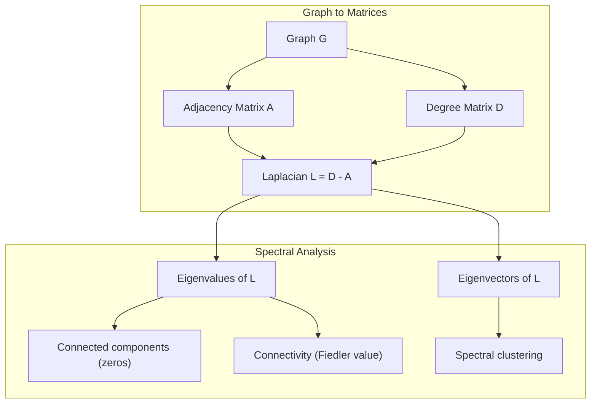
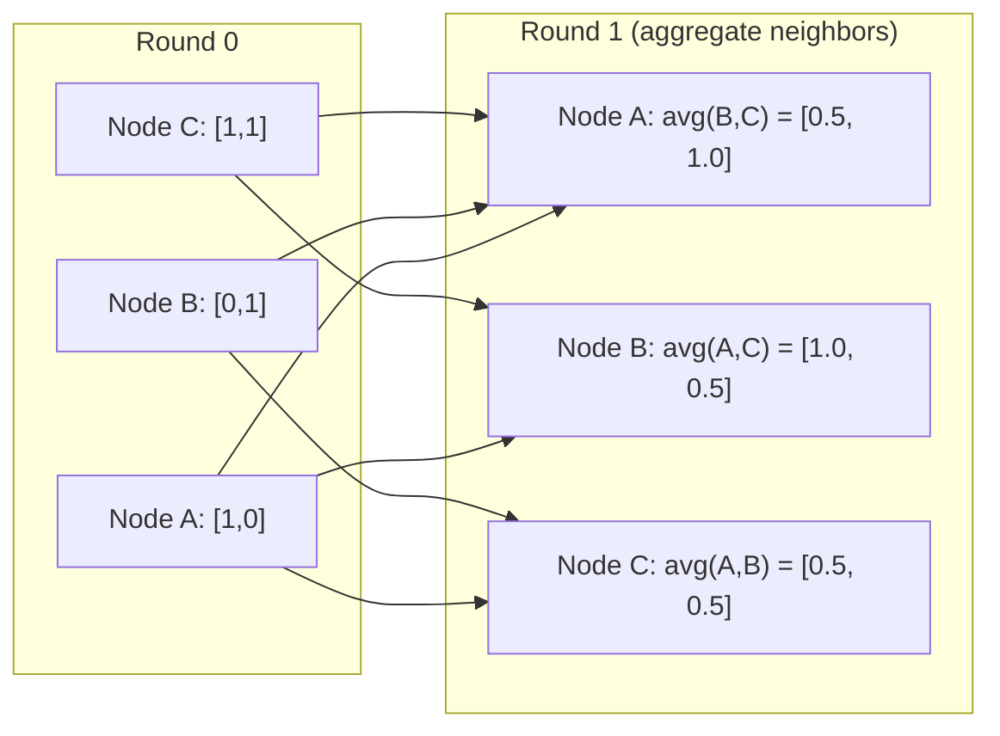

# 머신러닝을 위한 그래프 이론

> 그래프는 관계를 표현하는 자료구조입니다. 데이터에 연결이 있다면 그래프 이론이 필요합니다.

**Type:** Build
**Languages:** Python
**Prerequisites:** Phase 1, Lessons 01-03 (선형대수, 행렬)
**Time:** ~90 minutes

## 학습 목표

- 인접 행렬/리스트 표현을 갖춘 그래프 클래스를 만들고 BFS 및 DFS 순회를 구현합니다
- 그래프 라플라시안을 계산하고 그 고유값을 사용해 연결 성분을 감지하고 노드를 클러스터링합니다
- 정규화된 인접 행렬 곱셈으로 GNN 스타일 메시지 전달 한 라운드를 구현합니다
- Fiedler 벡터를 사용해 그래프를 분할하는 스펙트럴 클러스터링을 적용합니다

## 문제

소셜 네트워크, 분자, 지식 베이스, 인용 네트워크, 도로 지도 -- 모두 그래프입니다. 전통적인 ML은 데이터를 평평한 테이블로 다룹니다. 각 행은 독립적입니다. 각 특성은 열입니다. 하지만 연결 구조가 중요할 때 테이블은 실패합니다.

소셜 네트워크를 생각해 봅시다. 어떤 사용자가 어떤 제품을 살지 예측하고 싶습니다. 사용자의 구매 이력도 중요합니다. 하지만 친구들의 구매 이력은 더 중요할 수 있습니다. 연결이 신호를 전달합니다.

또는 분자를 생각해 봅시다. 분자가 단백질에 결합하는지 예측하고 싶습니다. 원자도 중요하지만, 정말 중요한 것은 원자들이 서로 어떻게 결합되어 있는지입니다. 구조 자체가 데이터입니다.

Graph Neural Networks (GNNs)는 딥러닝에서 가장 빠르게 성장하는 분야입니다. 신약 발견, 소셜 추천, 사기 탐지, 지식 그래프 추론을 구동합니다. 모든 GNN은 같은 기반 위에 세워집니다. 바로 기본 그래프 이론입니다.

필요한 것은 네 가지입니다:
1. 그래프를 행렬로 표현하는 방법(곱셈을 할 수 있도록)
2. 그래프 구조를 탐색하는 순회 알고리즘
3. 라플라시안 -- 스펙트럴 그래프 이론에서 가장 중요한 단일 행렬
4. 메시지 전달 -- GNN을 작동하게 만드는 연산

## 개념

### 그래프: 노드와 엣지

그래프 G = (V, E)는 정점(노드) V와 엣지 E로 구성됩니다. 각 엣지는 두 노드를 연결합니다.

**방향 그래프와 무방향 그래프.** 무방향 그래프에서 엣지 (u, v)는 u가 v에 연결되고 v도 u에 연결된다는 뜻입니다. 방향 그래프(digraph)에서 엣지 (u, v)는 u가 v를 가리킨다는 뜻이며, 반대 방향이 반드시 존재하지는 않습니다.

**가중 그래프와 비가중 그래프.** 비가중 그래프에서는 엣지가 있거나 없습니다. 가중 그래프에서는 각 엣지가 거리, 비용, 강도 같은 수치 가중치를 갖습니다.

| 그래프 유형 | 예시 |
|-----------|---------|
| 무방향, 비가중 | Facebook 친구 네트워크 |
| 방향, 비가중 | Twitter 팔로우 네트워크 |
| 무방향, 가중 | 도로 지도(거리) |
| 방향, 가중 | 웹 페이지 링크(PageRank 점수) |

### 인접 행렬

인접 행렬 A는 핵심 표현입니다. n개 노드를 가진 그래프에서:

```text
A[i][j] = 1    노드 i에서 노드 j로 가는 엣지가 있으면
A[i][j] = 0    그렇지 않으면
```

무방향 그래프에서는 A가 대칭입니다: A[i][j] = A[j][i]. 가중 그래프에서는 A[i][j] = 엣지 (i, j)의 가중치입니다.

**예시 -- 삼각형:**

```text
Nodes: 0, 1, 2
Edges: (0,1), (1,2), (0,2)

A = [[0, 1, 1],
     [1, 0, 1],
     [1, 1, 0]]
```

인접 행렬은 모든 GNN의 입력입니다. A에 대한 행렬 연산은 그래프에 대한 연산에 대응됩니다.

### 차수

노드의 차수는 그 노드에 연결된 엣지 수입니다. 방향 그래프에서는 들어오는 엣지의 in-degree와 나가는 엣지의 out-degree가 있습니다.

차수 행렬 D는 대각 행렬입니다:

```text
D[i][i] = 노드 i의 차수
D[i][j] = 0    i != j인 경우
```

삼각형 예시에서는 모든 노드가 다른 두 노드와 연결되므로 D = diag(2, 2, 2)입니다.

차수는 노드 중요도에 대한 정보를 줍니다. 높은 차수 = 허브 노드입니다. 네트워크의 차수 분포는 구조를 드러냅니다. 소셜 네트워크는 멱법칙을 따릅니다(소수의 허브, 많은 리프 노드). 랜덤 그래프는 푸아송 분포 차수를 갖습니다.

### BFS와 DFS

두 가지 기본 그래프 순회 알고리즘입니다. 둘 다 필요합니다.

**Breadth-First Search (BFS):** 먼저 모든 이웃을 탐색한 다음 이웃의 이웃을 탐색합니다. 큐(FIFO)를 사용합니다.

```text
BFS from node 0:
  Visit 0
  Queue: [1, 2]        (neighbors of 0)
  Visit 1
  Queue: [2, 3]        (add neighbors of 1)
  Visit 2
  Queue: [3]           (neighbors of 2 already visited)
  Visit 3
  Queue: []            (done)
```

BFS는 비가중 그래프에서 최단 경로를 찾습니다. 시작점에서 어떤 노드까지의 거리는 그 노드가 처음 발견된 BFS 레벨과 같습니다. 그래서 BFS는 소셜 네트워크에서 hop-count 거리에 사용됩니다.

**Depth-First Search (DFS):** 되돌아가기 전에 가능한 한 깊이 들어갑니다. 스택(LIFO) 또는 재귀를 사용합니다.

```text
DFS from node 0:
  Visit 0
  Stack: [1, 2]        (neighbors of 0)
  Visit 2               (pop from stack)
  Stack: [1, 3]         (add neighbors of 2)
  Visit 3               (pop from stack)
  Stack: [1]
  Visit 1               (pop from stack)
  Stack: []             (done)
```

DFS는 다음에 유용합니다:
- 연결 성분 찾기(방문하지 않은 노드에서 DFS 실행)
- 사이클 감지(DFS 트리의 역방향 엣지)
- 위상 정렬(DFS 종료 순서의 역순)

| 알고리즘 | 자료구조 | 찾는 것 | 사용 사례 |
|-----------|---------------|-------|----------|
| BFS | Queue | 최단 경로 | 소셜 네트워크 거리, 지식 그래프 순회 |
| DFS | Stack | 성분, 사이클 | 연결성, 위상 정렬 |

### 그래프 라플라시안

L = D - A. 스펙트럴 그래프 이론에서 가장 중요한 행렬입니다.

삼각형의 경우:

```text
D = [[2, 0, 0],    A = [[0, 1, 1],    L = [[2, -1, -1],
     [0, 2, 0],         [1, 0, 1],         [-1, 2, -1],
     [0, 0, 2]]         [1, 1, 0]]         [-1, -1,  2]]
```

라플라시안에는 놀라운 성질이 있습니다:

1. **L은 양의 준정부호입니다.** 모든 고유값은 >= 0입니다.

2. **0 고유값의 개수는 연결 성분의 개수와 같습니다.** 연결 그래프는 정확히 하나의 0 고유값을 갖습니다. 연결되지 않은 성분이 3개인 그래프는 0 고유값을 세 개 갖습니다.

3. **가장 작은 0이 아닌 고유값(Fiedler 값)은 연결성을 측정합니다.** 큰 Fiedler 값은 그래프가 잘 연결되어 있음을 뜻합니다. 작은 Fiedler 값은 그래프에 약한 지점, 즉 병목이 있음을 뜻합니다.

4. **Fiedler 값의 고유벡터(Fiedler 벡터)는 가장 좋은 분할을 드러냅니다.** 양수 값을 가진 노드는 한 그룹으로, 음수 값을 가진 노드는 다른 그룹으로 갑니다. 이것이 스펙트럴 클러스터링입니다.



### 스펙트럴 성질

인접 행렬과 라플라시안의 고유값은 어떤 순회도 없이 구조적 성질을 드러냅니다.

**스펙트럴 클러스터링**은 다음처럼 작동합니다:
1. 라플라시안 L을 계산합니다
2. L의 가장 작은 k개 고유벡터를 찾습니다(연결 그래프에서 모두 1인 첫 번째 벡터는 건너뜁니다)
3. 그 고유벡터들을 각 노드의 새 좌표로 사용합니다
4. 그 좌표에 k-means를 실행합니다

왜 이 방식이 작동할까요? L의 고유벡터는 그래프 위에서 가장 "매끄러운" 함수를 인코딩합니다. 잘 연결된 노드는 비슷한 고유벡터 값을 얻습니다. 병목으로 분리된 노드는 다른 값을 얻습니다. 고유벡터가 자연스럽게 클러스터를 분리합니다.

**랜덤 워크 연결.** 정규화 라플라시안은 그래프 위의 랜덤 워크와 관련됩니다. 랜덤 워크의 정상 분포는 노드 차수에 비례합니다. 혼합 시간(워크가 수렴하는 속도)은 스펙트럴 갭에 의존합니다.

### 메시지 전달

Graph Neural Networks의 핵심 연산입니다. 각 노드는 이웃으로부터 메시지를 모으고, 집계한 뒤, 자신의 상태를 업데이트합니다.

```text
h_v^(k+1) = UPDATE(h_v^(k), AGGREGATE({h_u^(k) : u in neighbors(v)}))
```

가장 단순한 형태에서는 AGGREGATE = mean이고 UPDATE = linear transform + activation입니다:

```text
h_v^(k+1) = sigma(W * mean({h_u^(k) : u in neighbors(v)}))
```

이는 변장한 행렬 곱셈입니다. H가 모든 노드 특성의 행렬이고 A가 인접 행렬이면:

```text
H^(k+1) = sigma(A_norm * H^(k) * W)
```

여기서 A_norm은 정규화된 인접 행렬입니다(각 행의 합이 1).

메시지 전달 한 라운드는 각 노드가 바로 이웃을 "볼" 수 있게 합니다. 두 라운드는 이웃의 이웃을 보게 합니다. K 라운드는 각 노드에 K-hop 이웃의 정보를 줍니다.



### 개념과 ML 응용

| 개념 | ML 응용 |
|---------|---------------|
| 인접 행렬 | GNN 입력 표현 |
| 그래프 라플라시안 | 스펙트럴 클러스터링, 커뮤니티 탐지 |
| BFS/DFS | 지식 그래프 순회, 경로 찾기 |
| 차수 분포 | 노드 중요도, 특성 엔지니어링 |
| 메시지 전달 | GNN 계층(GCN, GAT, GraphSAGE) |
| L의 고유값 | 커뮤니티 탐지, 그래프 분할 |
| 스펙트럴 클러스터링 | 비지도 노드 그룹화 |
| PageRank | 노드 중요도, 웹 검색 |

```figure
graph-degree-distribution
```

## 직접 만들기

### Step 1: 처음부터 만드는 Graph 클래스

```python
class Graph:
    def __init__(self, n_nodes, directed=False):
        self.n = n_nodes
        self.directed = directed
        self.adj = {i: {} for i in range(n_nodes)}

    def add_edge(self, u, v, weight=1.0):
        self.adj[u][v] = weight
        if not self.directed:
            self.adj[v][u] = weight

    def neighbors(self, node):
        return list(self.adj[node].keys())

    def degree(self, node):
        return len(self.adj[node])

    def adjacency_matrix(self):
        import numpy as np
        A = np.zeros((self.n, self.n))
        for u in range(self.n):
            for v, w in self.adj[u].items():
                A[u][v] = w
        return A

    def degree_matrix(self):
        import numpy as np
        D = np.zeros((self.n, self.n))
        for i in range(self.n):
            D[i][i] = self.degree(i)
        return D

    def laplacian(self):
        return self.degree_matrix() - self.adjacency_matrix()
```

인접 리스트(`self.adj`)는 이웃을 효율적으로 저장합니다. 인접 행렬 변환은 모든 스펙트럴 연산에 필요하므로 numpy를 사용합니다.

### Step 2: BFS와 DFS

```python
from collections import deque

def bfs(graph, start):
    visited = set()
    order = []
    distances = {}
    queue = deque([(start, 0)])
    visited.add(start)
    while queue:
        node, dist = queue.popleft()
        order.append(node)
        distances[node] = dist
        for neighbor in graph.neighbors(node):
            if neighbor not in visited:
                visited.add(neighbor)
                queue.append((neighbor, dist + 1))
    return order, distances


def dfs(graph, start):
    visited = set()
    order = []
    stack = [start]
    while stack:
        node = stack.pop()
        if node in visited:
            continue
        visited.add(node)
        order.append(node)
        for neighbor in reversed(graph.neighbors(node)):
            if neighbor not in visited:
                stack.append(neighbor)
    return order
```

BFS는 O(1) popleft를 위해 deque(양쪽 끝 큐)를 사용합니다. DFS는 리스트를 스택으로 사용합니다. 둘 다 각 노드를 정확히 한 번 방문합니다 -- 시간 복잡도는 O(V + E)입니다.

### Step 3: 연결 성분과 라플라시안 고유값

```python
def connected_components(graph):
    visited = set()
    components = []
    for node in range(graph.n):
        if node not in visited:
            order, _ = bfs(graph, node)
            visited.update(order)
            components.append(order)
    return components


def laplacian_eigenvalues(graph):
    import numpy as np
    L = graph.laplacian()
    eigenvalues = np.linalg.eigvalsh(L)
    return eigenvalues
```

`eigvalsh`는 대칭 행렬용입니다 -- 라플라시안은 무방향 그래프에서 항상 대칭입니다. 고유값을 오름차순으로 반환합니다. 0의 개수를 세면 연결 성분의 개수를 찾을 수 있습니다.

### Step 4: 스펙트럴 클러스터링

```python
def spectral_clustering(graph, k=2):
    import numpy as np
    L = graph.laplacian()
    eigenvalues, eigenvectors = np.linalg.eigh(L)
    features = eigenvectors[:, 1:k+1]

    labels = np.zeros(graph.n, dtype=int)
    for i in range(graph.n):
        if features[i, 0] >= 0:
            labels[i] = 0
        else:
            labels[i] = 1
    return labels
```

k=2에서는 Fiedler 벡터의 부호가 그래프를 두 클러스터로 나눕니다. k>2에서는 (자명한 모두 1인 고유벡터를 제외하고) 처음 k개 고유벡터에 k-means를 실행합니다.

### Step 5: 메시지 전달

```python
def message_passing(graph, features, weight_matrix):
    import numpy as np
    A = graph.adjacency_matrix()
    row_sums = A.sum(axis=1, keepdims=True)
    row_sums[row_sums == 0] = 1
    A_norm = A / row_sums
    aggregated = A_norm @ features
    output = aggregated @ weight_matrix
    return output
```

이것은 GNN 메시지 전달 한 라운드입니다. 각 노드의 새 특성은 이웃 특성의 가중 평균을 weight matrix로 변환한 값입니다. 여러 라운드를 쌓으면 정보를 더 멀리 전파할 수 있습니다.

## 사용하기

networkx와 numpy를 사용하면 같은 연산은 한 줄짜리가 됩니다:

```python
import networkx as nx
import numpy as np

G = nx.karate_club_graph()

A = nx.adjacency_matrix(G).toarray()
L = nx.laplacian_matrix(G).toarray()

eigenvalues = np.linalg.eigvalsh(L.astype(float))
print(f"Smallest eigenvalues: {eigenvalues[:5]}")
print(f"Connected components: {nx.number_connected_components(G)}")

communities = nx.community.greedy_modularity_communities(G)
print(f"Communities found: {len(communities)}")

pr = nx.pagerank(G)
top_nodes = sorted(pr.items(), key=lambda x: x[1], reverse=True)[:5]
print(f"Top 5 PageRank nodes: {top_nodes}")
```

networkx는 최적화된 C 백엔드로 어떤 크기의 그래프도 처리합니다. 프로덕션에서는 이것을 사용하세요. 직접 구현한 버전은 내부에서 무엇을 하는지 이해하는 데 사용하세요.

### numpy 스펙트럴 분석

```python
import numpy as np

A = np.array([
    [0, 1, 1, 0, 0],
    [1, 0, 1, 0, 0],
    [1, 1, 0, 1, 0],
    [0, 0, 1, 0, 1],
    [0, 0, 0, 1, 0]
])

D = np.diag(A.sum(axis=1))
L = D - A

eigenvalues, eigenvectors = np.linalg.eigh(L)
print(f"Eigenvalues: {np.round(eigenvalues, 4)}")
print(f"Fiedler value: {eigenvalues[1]:.4f}")
print(f"Fiedler vector: {np.round(eigenvectors[:, 1], 4)}")

fiedler = eigenvectors[:, 1]
group_a = np.where(fiedler >= 0)[0]
group_b = np.where(fiedler < 0)[0]
print(f"Cluster A: {group_a}")
print(f"Cluster B: {group_b}")
```

Fiedler 벡터가 핵심 역할을 합니다. 양수 항목은 한 클러스터에, 음수 항목은 다른 클러스터에 속합니다. 반복 최적화가 필요 없습니다 -- 고유분해 한 번이면 됩니다.

## 산출물로 만들기

이 lesson은 다음을 만듭니다:
- `outputs/skill-graph-analysis.md` -- 그래프 구조 데이터를 분석하기 위한 skill reference

## 연결

| 개념 | 나타나는 곳 |
|---------|------------------|
| 인접 행렬 | GCN, GAT, GraphSAGE 입력 |
| 라플라시안 | 스펙트럴 클러스터링, ChebNet 필터 |
| BFS | 지식 그래프 순회, 최단 경로 쿼리 |
| 메시지 전달 | 모든 GNN 계층, neural message passing |
| 스펙트럴 갭 | 그래프 연결성, 랜덤 워크의 혼합 시간 |
| 차수 분포 | 멱법칙 네트워크, 노드 특성 엔지니어링 |
| 연결 성분 | 전처리, 연결되지 않은 그래프 처리 |
| PageRank | 노드 중요도 순위화, attention 초기화 |

GNN은 특별히 언급할 가치가 있습니다. GCN(Kipf & Welling, 2017)의 그래프 합성곱 연산은 self-loop가 추가된 인접 행렬 A_hat = A + I를 사용합니다:

```text
H^(l+1) = sigma(D_hat^(-1/2) * A_hat * D_hat^(-1/2) * H^(l) * W^(l))
```

여기서 A_hat = A + I(인접 행렬 더하기 self-loop)이고 D_hat은 A_hat의 차수 행렬입니다. self-loop는 각 노드가 집계 중 자신의 특성도 포함하도록 보장합니다. 이것은 대칭 정규화를 사용한 메시지 전달과 정확히 같습니다. D_hat^(-1/2) * A_hat * D_hat^(-1/2)는 정규화된 인접 행렬입니다. 라플라시안이 등장하는 이유는 이 정규화가 L_sym = I - D^(-1/2) * A * D^(-1/2)와 관련되기 때문입니다. 라플라시안을 이해한다는 것은 GCN이 왜 작동하는지 이해한다는 뜻입니다.

## 연습 문제

1. **PageRank를 처음부터 구현하세요.** 균등한 점수에서 시작합니다. 각 단계에서 v를 가리키는 모든 u에 대해 score(v) = (1-d)/n + d * sum(score(u)/out_degree(u))를 계산합니다. d=0.85를 사용하세요. 수렴할 때까지(change < 1e-6) 실행합니다. 작은 웹 그래프에서 테스트하세요.

2. **스펙트럴 클러스터링으로 커뮤니티를 찾으세요.** 명확히 분리된 두 클러스터를 가진 그래프(예: 하나의 엣지로 연결된 두 clique)를 만듭니다. 스펙트럴 클러스터링을 실행하고 올바른 분할을 찾는지 확인하세요. 클러스터 간 엣지를 더 추가하면 어떻게 되나요?

3. **가중 그래프의 최단 경로를 위한 Dijkstra 알고리즘을 구현하세요.** 균일 가중치를 가진 같은 그래프에서 BFS와 결과를 비교하세요.

4. **2-layer 메시지 전달 네트워크를 만드세요.** 서로 다른 weight matrix로 메시지 전달을 두 번 적용합니다. 2라운드 후 각 노드가 2-hop 이웃의 정보를 갖게 됨을 보이세요.

5. **실세계 그래프를 분석하세요.** Karate Club graph(34 nodes, 78 edges)를 사용합니다. 차수 분포, 라플라시안 고유값, 스펙트럴 클러스터링을 계산하세요. 스펙트럴 클러스터링 결과를 알려진 ground truth 분할과 비교하세요.

## 핵심 용어

| 용어 | 사람들이 말하는 것 | 실제 의미 |
|------|----------------|----------------------|
| Graph | "Nodes and edges" | 쌍별 관계를 인코딩하는 수학적 구조 G=(V,E) |
| Adjacency matrix | "The connection table" | 노드 i와 j가 연결되어 있으면 A[i][j] = 1인 n x n 행렬 |
| Degree | "How connected a node is" | 노드에 닿는 엣지 수 |
| Laplacian | "D minus A" | L = D - A, 고유값이 그래프 구조를 드러내는 행렬 |
| Fiedler value | "The algebraic connectivity" | L의 가장 작은 0이 아닌 고유값으로, 그래프가 얼마나 잘 연결되어 있는지 측정 |
| BFS | "Level-by-level search" | 더 깊이 가기 전에 모든 이웃을 방문하는 순회, 최단 경로를 찾음 |
| DFS | "Go deep first" | 되돌아가기 전에 한 경로를 끝까지 따라가는 순회 |
| Message passing | "Nodes talk to neighbors" | 각 노드가 이웃의 정보를 집계하는 것, GNN의 핵심 |
| Spectral clustering | "Cluster by eigenvectors" | 라플라시안의 고유벡터를 사용해 그래프를 분할 |
| Connected component | "A separate piece" | 모든 노드가 서로 도달할 수 있는 최대 부분 그래프 |

## 더 읽을거리

- **Kipf & Welling (2017)** -- "Semi-Supervised Classification with Graph Convolutional Networks." 현대 GNN을 촉발한 논문입니다. 스펙트럴 그래프 합성곱이 메시지 전달로 단순화됨을 보여 줍니다.
- **Spielman (2012)** -- "Spectral Graph Theory" 강의 노트. 라플라시안, 스펙트럴 갭, 그래프 분할에 대한 결정적 입문 자료입니다.
- **Hamilton (2020)** -- "Graph Representation Learning." 기본 원리부터 응용까지 GNN을 다루는 책입니다.
- **Bronstein et al. (2021)** -- "Geometric Deep Learning: Grids, Groups, Graphs, Geodesics, and Gauges." 통합 프레임워크 논문입니다.
- **Veličković et al. (2018)** -- "Graph Attention Networks." 메시지 전달을 attention mechanisms로 확장합니다.
