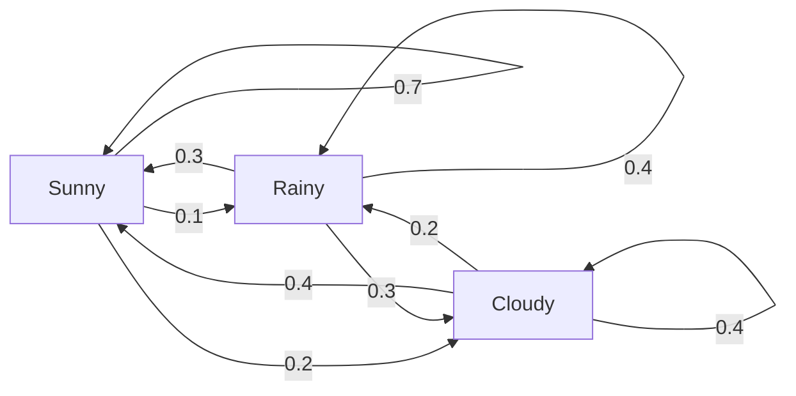
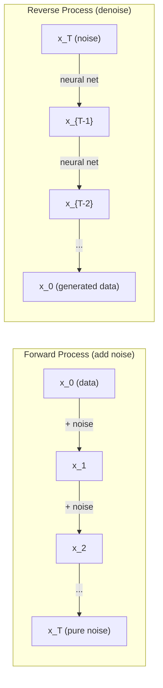

# 확률 과정

> 구조를 가진 무작위성. 랜덤 워크, Markov chains, diffusion models 뒤에 있는 수학입니다.

**Type:** Learn
**Languages:** Python
**Prerequisites:** Phase 1, Lessons 06-07 (확률, Bayes)
**Time:** ~75 minutes

## 학습 목표

- 1D 및 2D 랜덤 워크를 시뮬레이션하고 변위의 sqrt(n) 스케일링을 검증합니다
- Markov chain 시뮬레이터를 만들고 고유분해로 정상 분포를 계산합니다
- 목표 분포에서 샘플링하기 위해 Metropolis-Hastings MCMC와 Langevin dynamics를 구현합니다
- forward diffusion process를 Brownian motion과 연결하고 reverse process가 데이터를 생성하는 방식을 설명합니다

## 문제

많은 AI 시스템에는 시간이 지나며 진화하는 무작위성이 포함됩니다. 정적인 무작위성이 아니라, 각 단계가 이전에 일어난 일에 의존하는 구조적이고 순차적인 무작위성입니다.

언어 모델은 토큰을 한 번에 하나씩 생성합니다. 각 토큰은 이전 문맥에 의존합니다. 모델은 확률 분포를 출력하고, 그 분포에서 샘플링한 뒤, 다음으로 이동합니다. 이것이 확률 과정입니다.

Diffusion models는 이미지를 단계별로 노이즈화하여 순수한 잡음이 될 때까지 만듭니다. 그런 다음 과정을 뒤집어 단계별로 denoising하여 새 이미지가 나타나게 합니다. forward process는 Markov chain입니다. reverse process는 거꾸로 실행되는 학습된 Markov chain입니다.

강화학습 에이전트는 환경에서 행동을 취합니다. 각 행동은 어떤 확률로 새 상태로 이어집니다. 에이전트는 무작위 세계에서 무작위 정책을 따릅니다. 전체는 Markov decision process입니다.

MCMC sampling -- Bayesian inference의 중추 -- 은 정상 분포가 샘플링하려는 posterior가 되도록 Markov chain을 구성합니다.

이 모든 것은 네 가지 기초 아이디어 위에 세워집니다:
1. Random walks -- 가장 단순한 확률 과정
2. Markov chains -- transition matrix를 가진 구조화된 무작위성
3. Langevin dynamics -- 노이즈가 있는 gradient descent
4. Metropolis-Hastings -- 어떤 분포에서든 샘플링하기

## 개념

### 랜덤 워크

위치 0에서 시작합니다. 각 단계마다 공정한 동전을 던집니다. 앞면: 오른쪽으로 이동(+1). 뒷면: 왼쪽으로 이동(-1).

n단계 후 위치는 n개의 무작위 +/-1 값의 합입니다. 기대 위치는 0입니다(워크는 편향되지 않았습니다). 하지만 원점으로부터의 기대 거리는 sqrt(n)만큼 증가합니다.

이는 직관에 어긋납니다. 워크는 공정합니다 -- 어느 방향으로도 drift가 없습니다. 하지만 시간이 지나면 시작한 곳에서 점점 더 멀리 떠돌게 됩니다. n단계 후 표준편차는 sqrt(n)입니다.

```text
Step 0:  Position = 0
Step 1:  Position = +1 or -1
Step 2:  Position = +2, 0, or -2
...
Step 100: Expected distance from origin ~ 10 (sqrt(100))
Step 10000: Expected distance from origin ~ 100 (sqrt(10000))
```

**2D에서는**, 워크가 위, 아래, 왼쪽, 오른쪽으로 같은 확률로 이동합니다. 원점으로부터의 거리에도 같은 sqrt(n) 스케일링이 적용됩니다. 경로는 프랙탈 같은 패턴을 그립니다.

**왜 sqrt(n)일까요?** 각 단계는 같은 확률로 +1 또는 -1입니다. n단계 후 위치는 S_n = X_1 + X_2 + ... + X_n이며 각 X_i는 +/-1입니다. 각 단계의 분산은 1이고 단계들은 독립이므로 Var(S_n) = n입니다. 표준편차 = sqrt(n)입니다. 중심극한정리에 의해 S_n / sqrt(n)은 표준 정규분포로 수렴합니다.

이 sqrt(n) 스케일링은 ML 곳곳에 나타납니다. SGD 노이즈는 1/sqrt(batch_size)로 스케일됩니다. Embedding 차원은 sqrt(d)로 스케일됩니다. 제곱근은 독립적인 무작위 덧셈의 서명입니다.

**Brownian motion과의 연결.** 단계 크기가 1/sqrt(n)이고 단위 시간당 n단계를 갖는 랜덤 워크를 생각해 봅시다. n이 무한대로 갈 때, 워크는 Brownian motion B(t)로 수렴합니다 -- B(t)가 평균 0, 분산 t인 정규분포를 따르는 연속시간 과정입니다.

Brownian motion은 diffusion의 수학적 기반입니다. 유체 속 입자의 무작위 흔들림, 주가 변동, 그리고 결정적으로 diffusion models의 노이즈 과정을 모델링합니다.

**Gambler's ruin.** 위치 k에서 시작하고 0과 N에 흡수 장벽이 있는 랜덤 워커가 있습니다. 0에 도달하기 전에 N에 도달할 확률은 얼마일까요? 공정한 워크에서는 P(reach N) = k/N입니다. 놀랍도록 단순하고 우아합니다. 이는 martingales 이론과 연결됩니다 -- 공정한 랜덤 워크는 martingale입니다(기대 미래 값 = 현재 값).

### 마르코프 체인

Markov chain은 고정된 확률에 따라 상태 사이를 전이하는 시스템입니다. 핵심 성질은 다음 상태가 과거 전체가 아니라 현재 상태에만 의존한다는 것입니다.

```text
P(X_{t+1} = j | X_t = i, X_{t-1} = ...) = P(X_{t+1} = j | X_t = i)
```

이것이 Markov property입니다. 전체 동역학을 transition matrix P로 설명할 수 있다는 뜻입니다:

```text
P[i][j] = probability of going from state i to state j
```

P의 각 행은 합이 1입니다(어딘가로는 가야 합니다).

**예시 -- 날씨:**

```text
States: Sunny (0), Rainy (1), Cloudy (2)

P = [[0.7, 0.1, 0.2],    (if sunny: 70% sunny, 10% rainy, 20% cloudy)
     [0.3, 0.4, 0.3],    (if rainy: 30% sunny, 40% rainy, 30% cloudy)
     [0.4, 0.2, 0.4]]    (if cloudy: 40% sunny, 20% rainy, 40% cloudy)
```

어떤 상태에서 시작해도 많은 전이 후 상태 분포는 정상 분포 pi로 수렴합니다. 여기서 pi * P = pi입니다. 이는 고유값 1에 대응하는 P의 왼쪽 고유벡터입니다.

날씨 chain의 정상 분포는 [0.53, 0.18, 0.29]일 수 있습니다 -- 장기적으로 시작 상태와 무관하게 53%의 시간 동안 맑습니다.



**정상 분포 계산.** 두 가지 접근이 있습니다:

1. **Power method**: 임의의 초기 분포에 P를 반복해서 곱합니다. 충분히 반복하면 수렴합니다.
2. **Eigenvalue method**: 고유값 1에 대응하는 P의 왼쪽 고유벡터를 찾습니다. 이는 고유값 1에 대응하는 P^T의 고유벡터입니다.

두 접근 모두 chain이 수렴 조건을 만족해야 합니다.

**수렴 조건.** Markov chain은 다음 조건을 만족하면 유일한 정상 분포로 수렴합니다:
- **Irreducible**: 모든 상태가 다른 모든 상태에서 도달 가능합니다
- **Aperiodic**: chain이 고정된 주기로 순환하지 않습니다

ML에서 마주치는 대부분의 chain은 두 조건을 모두 만족합니다.

**흡수 상태.** 어떤 상태에 들어가면 다시 떠나지 않는다면 그 상태는 흡수 상태입니다(P[i][i] = 1). 흡수 Markov chain은 종료 상태가 있는 과정을 모델링합니다 -- 끝나는 게임, 이탈한 고객, end-of-text token에 도달한 토큰 시퀀스.

**혼합 시간.** chain이 정상 분포에 "가까워질" 때까지 몇 단계가 필요할까요? 형식적으로는 정상 분포와의 total variation distance가 어떤 임계값 아래로 떨어질 때까지의 단계 수입니다. 빠른 혼합 = 필요한 단계가 적음. P의 스펙트럴 갭(1에서 두 번째로 큰 고유값을 뺀 값)이 혼합 시간을 제어합니다. 갭이 클수록 더 빠르게 혼합됩니다.

### 언어 모델과의 연결

언어 모델의 토큰 생성은 근사적으로 Markov process입니다. 현재 문맥이 주어지면 모델은 다음 토큰에 대한 분포를 출력합니다. Temperature는 날카로움을 제어합니다:

```text
P(token_i) = exp(logit_i / temperature) / sum(exp(logit_j / temperature))
```

- Temperature = 1.0: 표준 분포
- Temperature < 1.0: 더 날카로움(더 결정적)
- Temperature > 1.0: 더 평평함(더 무작위)
- Temperature -> 0: argmax (greedy)

Top-k sampling은 가장 높은 확률의 k개 토큰으로 잘라냅니다. Top-p (nucleus) sampling은 누적 확률이 p를 넘는 가장 작은 토큰 집합으로 잘라냅니다. 둘 다 Markov transition probabilities를 수정합니다.

### 브라운 운동

랜덤 워크의 연속시간 극한입니다. 위치 B(t)는 세 가지 성질을 갖습니다:
1. B(0) = 0
2. B(t) - B(s)는 평균 0, 분산 t - s인 정규분포를 따릅니다(t > s인 경우)
3. 겹치지 않는 구간의 증분은 독립입니다

Brownian motion은 연속이지만 어디에서도 미분 가능하지 않습니다 -- 모든 스케일에서 흔들립니다. 그 경로는 평면에서 프랙탈 차원 2를 갖습니다.

이산 시뮬레이션에서는 다음으로 Brownian motion을 근사합니다:

```text
B(t + dt) = B(t) + sqrt(dt) * z,    where z ~ N(0, 1)
```

sqrt(dt) 스케일링이 중요합니다. 이는 랜덤 워크에 적용한 중심극한정리에서 나옵니다.

### 랑주뱅 동역학

Gradient descent는 함수의 최솟값을 찾습니다. Langevin dynamics는 exp(-U(x)/T)에 비례하는 확률 분포를 찾습니다. 여기서 U는 에너지 함수이고 T는 temperature입니다.

```text
x_{t+1} = x_t - dt * gradient(U(x_t)) + sqrt(2 * T * dt) * z_t
```

두 힘이 입자에 작용합니다:
1. **Gradient force** (-dt * gradient(U)): 낮은 에너지 쪽으로 밀어냅니다(gradient descent처럼)
2. **Random force** (sqrt(2*T*dt) * z): 무작위 방향으로 밀어냅니다(탐색)

Temperature T = 0에서는 순수한 gradient descent입니다. 높은 temperature에서는 거의 랜덤 워크입니다. 적절한 temperature에서는 입자가 에너지 지형을 탐색하고 낮은 에너지 영역에서 더 오래 머뭅니다.

**Diffusion models와의 연결.** Diffusion model의 forward process는 다음과 같습니다:

```text
x_t = sqrt(alpha_t) * x_{t-1} + sqrt(1 - alpha_t) * noise
```

이것은 데이터를 점진적으로 노이즈와 섞는 Markov chain입니다. 충분한 단계 후 x_T는 순수한 Gaussian noise입니다.

노이즈에서 데이터로 돌아가는 reverse process도 Markov chain이지만, 그 transition probabilities는 neural network가 학습합니다. 네트워크는 각 단계에서 더해진 노이즈를 예측한 다음 그것을 뺍니다.



### MCMC: Markov Chain Monte Carlo 설명

때로는 값을 계산할 수는 있지만(상수 배까지) 직접 샘플링할 수는 없는 분포 p(x)에서 샘플링해야 합니다. Bayesian posteriors가 전형적인 예입니다 -- likelihood와 prior의 곱은 알지만 정규화 상수는 다루기 어렵습니다.

**Metropolis-Hastings**는 정상 분포가 p(x)인 Markov chain을 구성합니다:

1. 어떤 위치 x에서 시작합니다
2. proposal distribution Q(x'|x)에서 새 위치 x'를 제안합니다
3. acceptance ratio를 계산합니다: a = p(x') * Q(x|x') / (p(x) * Q(x'|x))
4. 확률 min(1, a)로 x'를 수락합니다. 그렇지 않으면 x에 머뭅니다.
5. 반복합니다.

Q가 대칭이면(예: Q(x'|x) = Q(x|x') = N(x, sigma^2)), 비율은 a = p(x') / p(x)로 단순화됩니다. 확률의 비율만 있으면 됩니다 -- 정규화 상수는 상쇄됩니다.

chain은 약한 조건에서 p(x)로 수렴함이 보장됩니다. 하지만 proposal이 너무 작거나(랜덤 워크) 너무 크면(높은 거절률) 수렴이 느릴 수 있습니다. proposal을 조정하는 것이 MCMC의 기술입니다.

**왜 작동할까요.** acceptance ratio는 detailed balance를 보장합니다. x에 있다가 x'로 이동할 확률은 x'에 있다가 x로 이동할 확률과 같습니다. Detailed balance는 p(x)가 chain의 정상 분포임을 의미합니다. 따라서 충분한 단계 후 샘플은 p(x)에서 나옵니다.

**실무 고려사항:**
- **Burn-in**: 처음 N개 샘플을 버립니다. chain은 시작점에서 정상 분포에 도달할 시간이 필요합니다.
- **Thinning**: autocorrelation을 줄이기 위해 k번째 샘플마다 보관합니다.
- **Multiple chains**: 서로 다른 시작점에서 여러 chain을 실행합니다. 같은 분포로 수렴하면 수렴의 증거가 됩니다.
- **Acceptance rate**: d차원 Gaussian proposals에서는 최적 acceptance rate가 약 23%입니다(Roberts & Rosenthal, 2001). 너무 높으면 chain이 거의 움직이지 않습니다. 너무 낮으면 모든 것을 거절합니다.

### AI에서의 확률 과정

| 과정 | AI 응용 |
|---------|---------------|
| Random walk | RL에서의 탐색, Node2Vec embeddings |
| Markov chain | 텍스트 생성, MCMC sampling |
| Brownian motion | Diffusion models (forward process) |
| Langevin dynamics | Score-based generative models, SGLD |
| Markov decision process | Reinforcement learning |
| Metropolis-Hastings | Bayesian inference, posterior sampling |

```figure
random-walk-diffusion
```

## 직접 만들기

### Step 1: Random walk 시뮬레이터

```python
import numpy as np

def random_walk_1d(n_steps, seed=None):
    rng = np.random.RandomState(seed)
    steps = rng.choice([-1, 1], size=n_steps)
    positions = np.concatenate([[0], np.cumsum(steps)])
    return positions


def random_walk_2d(n_steps, seed=None):
    rng = np.random.RandomState(seed)
    directions = rng.choice(4, size=n_steps)
    dx = np.zeros(n_steps)
    dy = np.zeros(n_steps)
    dx[directions == 0] = 1   # right
    dx[directions == 1] = -1  # left
    dy[directions == 2] = 1   # up
    dy[directions == 3] = -1  # down
    x = np.concatenate([[0], np.cumsum(dx)])
    y = np.concatenate([[0], np.cumsum(dy)])
    return x, y
```

1D 워크는 누적합을 저장합니다. 각 단계는 +1 또는 -1입니다. n단계 후 위치는 그 합입니다. 분산은 n에 선형으로 증가하므로 표준편차는 sqrt(n)으로 증가합니다.

### Step 2: Markov chain 구현

```python
class MarkovChain:
    def __init__(self, transition_matrix, state_names=None):
        self.P = np.array(transition_matrix, dtype=float)
        self.n_states = len(self.P)
        self.state_names = state_names or [str(i) for i in range(self.n_states)]

    def step(self, current_state, rng=None):
        if rng is None:
            rng = np.random.RandomState()
        probs = self.P[current_state]
        return rng.choice(self.n_states, p=probs)

    def simulate(self, start_state, n_steps, seed=None):
        rng = np.random.RandomState(seed)
        states = [start_state]
        current = start_state
        for _ in range(n_steps):
            current = self.step(current, rng)
            states.append(current)
        return states

    def stationary_distribution(self):
        eigenvalues, eigenvectors = np.linalg.eig(self.P.T)
        idx = np.argmin(np.abs(eigenvalues - 1.0))
        stationary = np.real(eigenvectors[:, idx])
        stationary = stationary / stationary.sum()
        return np.abs(stationary)
```

정상 분포는 고유값 1에 대응하는 P의 왼쪽 고유벡터입니다. P^T의 고유벡터를 계산해 찾습니다(전치하면 왼쪽 고유벡터가 오른쪽 고유벡터가 됩니다).

### Step 3: Langevin dynamics 구현

```python
def langevin_dynamics(grad_U, x0, dt, temperature, n_steps, seed=None):
    rng = np.random.RandomState(seed)
    x = np.array(x0, dtype=float)
    trajectory = [x.copy()]
    for _ in range(n_steps):
        noise = rng.randn(*x.shape)
        x = x - dt * grad_U(x) + np.sqrt(2 * temperature * dt) * noise
        trajectory.append(x.copy())
    return np.array(trajectory)
```

gradient는 x를 낮은 에너지 쪽으로 밀어냅니다. noise는 x가 갇히지 않게 합니다. 평형에서는 샘플 분포가 exp(-U(x)/temperature)에 비례합니다.

### Step 4: Metropolis-Hastings 구현

```python
def metropolis_hastings(target_log_prob, proposal_std, x0, n_samples, seed=None):
    rng = np.random.RandomState(seed)
    x = np.array(x0, dtype=float)
    samples = [x.copy()]
    accepted = 0
    for _ in range(n_samples - 1):
        x_proposed = x + rng.randn(*x.shape) * proposal_std
        log_ratio = target_log_prob(x_proposed) - target_log_prob(x)
        if np.log(rng.rand()) < log_ratio:
            x = x_proposed
            accepted += 1
        samples.append(x.copy())
    acceptance_rate = accepted / (n_samples - 1)
    return np.array(samples), acceptance_rate
```

이 알고리즘은 새 점을 제안하고, 더 높은 확률을 갖는지 확인한 뒤(또는 비율에 비례하는 확률로 수락한 뒤) 반복합니다. 좋은 혼합을 위해 acceptance rate는 약 23-50%여야 합니다.

## 사용하기

실무에서는 이런 알고리즘에 검증된 라이브러리를 사용합니다. 하지만 메커니즘을 이해하는 것은 디버깅과 튜닝에 중요합니다.

```python
import numpy as np

rng = np.random.RandomState(42)
walk = np.cumsum(rng.choice([-1, 1], size=10000))
print(f"Final position: {walk[-1]}")
print(f"Expected distance: {np.sqrt(10000):.1f}")
print(f"Actual distance: {abs(walk[-1])}")
```

### transition matrices를 위한 numpy

```python
import numpy as np

P = np.array([[0.7, 0.1, 0.2],
              [0.3, 0.4, 0.3],
              [0.4, 0.2, 0.4]])

distribution = np.array([1.0, 0.0, 0.0])
for _ in range(100):
    distribution = distribution @ P

print(f"Stationary distribution: {np.round(distribution, 4)}")
```

초기 분포에 P를 반복해서 곱합니다. 충분히 반복하면 어디에서 시작했든 정상 분포로 수렴합니다. 이것은 지배적인 왼쪽 고유벡터를 찾는 power method입니다.

### 실제 프레임워크와의 연결

- **PyTorch diffusion:** Hugging Face `diffusers`의 `DDPMScheduler`는 forward 및 reverse Markov chains를 구현합니다
- **NumPyro / PyMC:** Bayesian inference에는 MCMC(Metropolis-Hastings를 개선한 NUTS sampler)를 사용합니다
- **Gymnasium (RL):** 환경의 step 함수가 Markov decision process를 정의합니다

### Markov chain 수렴 검증

```python
import numpy as np

P = np.array([[0.9, 0.1], [0.3, 0.7]])

eigenvalues = np.linalg.eigvals(P)
spectral_gap = 1 - sorted(np.abs(eigenvalues))[-2]
print(f"Eigenvalues: {eigenvalues}")
print(f"Spectral gap: {spectral_gap:.4f}")
print(f"Approximate mixing time: {1/spectral_gap:.1f} steps")
```

스펙트럴 갭은 chain이 초기 상태를 얼마나 빨리 잊는지 알려 줍니다. 0.2의 갭은 대략 5단계면 혼합된다는 뜻입니다. 0.01의 갭은 대략 100단계라는 뜻입니다. 긴 시뮬레이션을 실행하기 전에 항상 이것을 확인하세요 -- 느리게 혼합되는 chain은 compute를 낭비합니다.

## 산출물로 만들기

이 lesson은 다음을 만듭니다:
- `outputs/prompt-stochastic-process-advisor.md` -- 주어진 문제에 어떤 stochastic process framework가 적용되는지 식별하는 데 도움을 주는 prompt

## 연결

| 개념 | 나타나는 곳 |
|---------|------------------|
| Random walk | Node2Vec graph embeddings, RL에서의 탐색 |
| Markov chain | LLM의 token generation, MCMC sampling |
| Brownian motion | DDPM의 forward diffusion process, SDE-based models |
| Langevin dynamics | Score-based generative models, stochastic gradient Langevin dynamics (SGLD) |
| Stationary distribution | MCMC 수렴 목표, PageRank |
| Metropolis-Hastings | Bayesian posterior sampling, simulated annealing |
| Temperature | LLM sampling, RL의 Boltzmann exploration, simulated annealing |
| Mixing time | MCMC 수렴 속도, spectral gap analysis |
| Absorbing state | End-of-sequence token, RL의 terminal states |
| Detailed balance | MCMC samplers의 correctness guarantee |

Diffusion models는 특별히 주목할 만합니다. DDPM(Ho et al., 2020)은 forward Markov chain을 다음과 같이 정의합니다:

```text
q(x_t | x_{t-1}) = N(x_t; sqrt(1-beta_t) * x_{t-1}, beta_t * I)
```

여기서 beta_t는 noise schedule입니다. T단계 후 x_T는 대략 N(0, I)입니다. reverse process는 노이즈를 예측하는 neural network로 매개변수화됩니다:

```text
p_theta(x_{t-1} | x_t) = N(x_{t-1}; mu_theta(x_t, t), sigma_t^2 * I)
```

생성의 모든 단계는 학습된 Markov chain의 한 단계입니다. Markov chains를 이해한다는 것은 diffusion models가 어떻게 그리고 왜 데이터를 생성하는지 이해한다는 뜻입니다.

SGLD(Stochastic Gradient Langevin Dynamics)는 mini-batch gradient descent와 Langevin noise를 결합합니다. 전체 gradient를 계산하는 대신 확률적 추정치를 사용하고 보정된 노이즈를 더합니다. learning rate가 감소하면 SGLD는 최적화에서 샘플링으로 전환됩니다 -- 신경망에서 근사 Bayesian posterior samples를 거의 공짜로 얻습니다. 이는 신경망에서 uncertainty estimates를 얻는 가장 단순한 방법 중 하나입니다.

이 모든 연결을 관통하는 핵심 통찰은 다음과 같습니다. 확률 과정은 이론적 도구에 그치지 않습니다. 현대 AI 시스템 내부의 계산 메커니즘입니다. LLM의 temperature를 조정할 때, 당신은 Markov chain을 조정하고 있습니다. Diffusion model을 훈련할 때, 당신은 Brownian-motion-like process를 역전하는 방법을 학습하고 있습니다. Bayesian inference를 실행할 때, 당신은 posterior로 수렴하는 chain을 구성하고 있습니다.

## 연습 문제

1. **10000단계 랜덤 워크 1000개를 시뮬레이션하세요.** 최종 위치의 분포를 그립니다. 평균 0, 표준편차 sqrt(10000) = 100인 Gaussian에 가까운지 확인하세요.

2. **Markov chain을 사용해 텍스트 생성기를 만드세요.** 작은 corpus로 학습합니다. 각 단어에 대해 다음 단어로의 전이를 셉니다. transition matrix를 만듭니다. chain에서 샘플링해 새 문장을 생성합니다.

3. **Metropolis-Hastings를 사용해 simulated annealing을 구현하세요.** 높은 temperature에서 시작해(거의 모든 것을 수락) 점차 식힙니다(개선만 수락). 많은 local minima를 가진 함수의 최솟값을 찾는 데 사용하세요.

4. **서로 다른 temperature에서 Langevin dynamics를 비교하세요.** double-well potential U(x) = (x^2 - 1)^2에서 샘플링합니다. 낮은 temperature에서는 샘플이 한 well에 모입니다. 높은 temperature에서는 두 well 전체로 퍼집니다. chain이 well 사이를 섞는 critical temperature를 찾으세요.

5. **forward diffusion process를 구현하세요.** 1D signal(예: sine wave)에서 시작합니다. linear noise schedule로 100단계에 걸쳐 점진적으로 노이즈를 더합니다. 신호가 순수한 noise로 어떻게 열화되는지 보이세요. 그런 다음 과정을 되돌리는 간단한 denoiser를 구현하세요(추정된 noise를 빼는 naive한 것이라도 괜찮습니다).

## 핵심 용어

| 용어 | 사람들이 말하는 것 | 실제 의미 |
|------|----------------|----------------------|
| Random walk | "Coin-flip movement" | 각 단계에서 위치가 무작위 증분만큼 변하는 과정 |
| Markov property | "Memoryless" | 미래가 과거가 아니라 현재 상태에만 의존함 |
| Transition matrix | "The probability table" | P[i][j] = 상태 i에서 상태 j로 이동할 확률 |
| Stationary distribution | "The long-run average" | pi*P = pi인 분포 pi -- chain의 평형 |
| Brownian motion | "Random jiggling" | 랜덤 워크의 연속시간 극한, B(t) ~ N(0, t) |
| Langevin dynamics | "Gradient descent with noise" | 결정적 gradient와 무작위 perturbation을 결합한 업데이트 규칙 |
| MCMC | "Walking toward the target" | 원하는 분포를 정상 분포로 갖는 Markov chain을 구성하는 것 |
| Metropolis-Hastings | "Propose and accept/reject" | acceptance ratios로 수렴을 보장하는 MCMC 알고리즘 |
| Temperature | "The randomness knob" | exploration과 exploitation의 tradeoff를 제어하는 매개변수 |
| Diffusion process | "Noise in, noise out" | Forward: 점진적으로 noise를 추가. Reverse: 점진적으로 제거. 데이터를 생성함. |

## 더 읽을거리

- **Ho, Jain, Abbeel (2020)** -- "Denoising Diffusion Probabilistic Models." diffusion model revolution을 촉발한 DDPM 논문입니다. forward 및 reverse Markov chains를 명확하게 유도합니다.
- **Song & Ermon (2019)** -- "Generative Modeling by Estimating Gradients of the Data Distribution." 샘플링에 Langevin dynamics를 사용하는 score-based 접근입니다.
- **Roberts & Rosenthal (2004)** -- "General state space Markov chains and MCMC algorithms." MCMC가 언제 왜 작동하는지에 대한 이론입니다.
- **Norris (1997)** -- "Markov Chains." 표준 교과서입니다. 수렴, 정상 분포, hitting times를 다룹니다.
- **Welling & Teh (2011)** -- "Bayesian Learning via Stochastic Gradient Langevin Dynamics." scalable Bayesian inference를 위해 SGD와 Langevin dynamics를 결합합니다.
