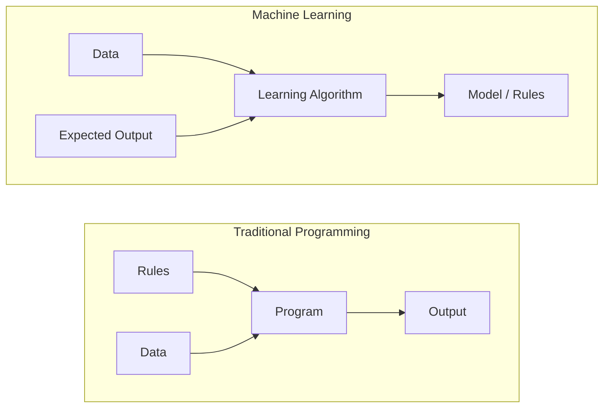
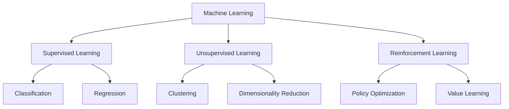
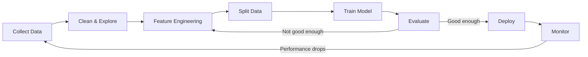
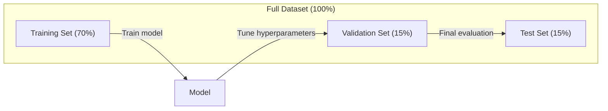
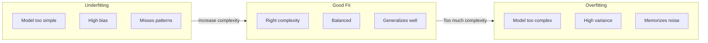
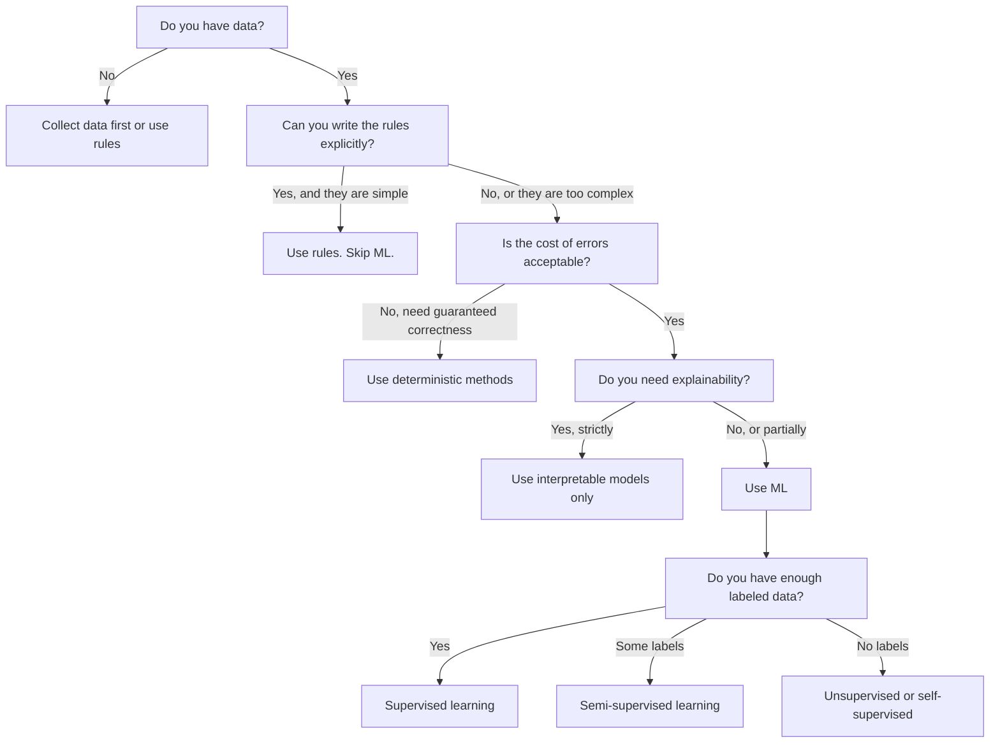

# 머신러닝이란 무엇인가

> Machine learning은 사람이 직접 rules를 작성하는 대신 computers가 data에서 patterns를 찾도록 가르치는 것입니다.

**Type:** Learn
**Languages:** Python
**Prerequisites:** Phase 1 (Math Foundations)
**Time:** ~45 minutes

## 학습 목표

- supervised, unsupervised, reinforcement learning의 차이를 설명하고 주어진 problem에 어떤 type이 적용되는지 식별하기
- nearest centroid classifier를 scratch부터 구현하고 random baseline과 비교해 evaluate하기
- classification tasks와 regression tasks를 구분하고 각각에 맞는 loss function 선택하기
- 주어진 business problem이 ML에 적합한지, 아니면 deterministic rules로 푸는 것이 나은지 evaluate하기

## 문제

spam filter를 만들고 싶다고 해 봅시다. 전통적인 접근법은 자리에 앉아 수백 개의 rules를 작성하는 것입니다. "email에 'FREE MONEY'가 포함되어 있으면 spam으로 표시한다. 느낌표가 3개보다 많으면 spam으로 표시한다." 이렇게 rules를 작성하는 데 몇 주를 씁니다. 그러면 spammers가 표현을 바꿉니다. rules가 깨집니다. rules를 더 작성합니다. 이 cycle은 끝나지 않습니다.

Machine learning은 이것을 뒤집습니다. rules를 작성하는 대신, computer에 수천 개의 labeled emails("spam" 또는 "not spam")를 주고 스스로 rules를 찾아내게 합니다. computer는 사람이 생각하지 못했을 patterns를 찾습니다. spammers가 tactics를 바꾸면 code를 다시 쓰는 대신 new data로 retrain합니다.

"programming rules"에서 "learning from data"로의 이 전환이 machine learning의 핵심입니다. 모든 recommendation engine, voice assistant, self-driving car, language model은 이런 방식으로 작동합니다.

## 개념

### Rules가 아니라 Data에서 배우기

Traditional programming과 machine learning은 반대 방향으로 문제를 풉니다.



Traditional programming: rules를 사람이 작성합니다. program이 그 rules를 data에 적용해 output을 만듭니다.

Machine learning: data와 expected outputs를 제공합니다. algorithm이 rules를 발견합니다.

training의 결과로 나오는 "model"이 바로 rules이며, numbers(weights, parameters)로 encoded되어 있습니다. model은 본 examples에서 generalize하여 한 번도 본 적 없는 data에 predictions를 만듭니다.

### Machine Learning의 세 가지 유형



**Supervised Learning**: input-output pairs가 있습니다. model은 inputs를 outputs에 mapping하는 법을 배웁니다.
- "cat 또는 dog로 labeled된 photos 10,000장이 있다. 둘을 구분하는 법을 배워라."
- "house features와 prices가 있다. price를 예측하는 법을 배워라."

**Unsupervised Learning**: inputs만 있습니다. labels는 없습니다. model이 스스로 structure를 찾습니다.
- "customer purchase histories 10,000개가 있다. 자연스러운 groupings를 찾아라."
- "1,000 dimensional data points가 있다. structure를 유지하면서 2 dimensions로 줄여라."

**Reinforcement Learning**: agent가 environment에서 actions를 취하고 rewards 또는 penalties를 받습니다. total reward를 maximize하는 strategy(policy)를 배웁니다.
- "이 game을 플레이해라. 이기면 +1, 지면 -1. strategy를 찾아라."
- "이 robot arm을 제어해라. object를 집으면 +1, 낭비한 각 second마다 -0.01."

실무에서 만들 대부분의 것은 supervised learning을 사용합니다. Unsupervised learning은 preprocessing과 exploration에 흔합니다. Reinforcement learning은 game AI, robotics, language models를 위한 RLHF를 구동합니다.

### Big Three 너머

위 세 categories는 깔끔하지만, real-world ML은 종종 경계를 흐립니다.

**Semi-supervised learning**은 small set의 labeled data와 large set의 unlabeled data를 사용합니다. labeled medical images 100장과 unlabeled images 100,000장이 있을 수 있습니다. techniques에는 다음이 포함됩니다.

- **Label propagation:** similar data points를 연결하는 graph를 만듭니다. labels가 graph를 통해 labeled nodes에서 unlabeled neighbors로 퍼집니다.
- **Pseudo-labeling:** labeled data로 model을 train하고, 그 model로 unlabeled data의 labels를 예측한 다음, 모든 data로 retrain합니다. model이 자신의 training set을 bootstrap합니다.
- **Consistency regularization:** model은 input과 그 input을 살짝 perturb한 version에 대해 같은 prediction을 내야 합니다. labels가 없어도 작동합니다.

**Self-supervised learning**은 data 자체에서 supervision을 만듭니다. human labels가 전혀 필요 없습니다. model이 data structure에서 자기 자신의 prediction task를 만듭니다.

- **Masked language modeling (BERT):** sentence의 words 15%를 숨기고, model이 missing words를 예측하도록 train합니다. "labels"는 original text에서 옵니다.
- **Contrastive learning (SimCLR):** image 하나를 가져와 augmented versions 두 개를 만듭니다. model이 그것들이 같은 image에서 왔음을 인식하면서 다른 images의 augmented versions와 구분하도록 train합니다.
- **Next-token prediction (GPT):** previous words가 모두 주어졌을 때 next word를 예측합니다. 모든 text document가 training example이 됩니다.

이들은 big three와 별개의 categories가 아닙니다. supervised와 unsupervised ideas를 결합하는 strategies입니다. Self-supervised learning은 기술적으로 supervised입니다(model이 무엇인가를 예측하므로). 하지만 labels가 humans가 아니라 자동으로 생성됩니다.

### 분류와 회귀

두 가지 주요 supervised learning tasks입니다.

| Aspect | Classification | Regression |
|--------|---------------|------------|
| Output | Discrete categories | Continuous numbers |
| Example | "Is this email spam?" | "What will the house price be?" |
| Output space | {cat, dog, bird} | Any real number |
| Loss function | Cross-entropy, accuracy | Mean squared error, MAE |
| Decision | Boundaries between classes | A curve that fits the data |

Classification은 "어느 category인가?"에 답합니다. Regression은 "얼마나 많은가?"에 답합니다.

어떤 problems는 두 방식 모두로 framing할 수 있습니다. stock이 오를지 내릴지 예측하는 것은 classification입니다. 정확한 price를 예측하는 것은 regression입니다.

### ML 워크플로

모든 machine learning project는 algorithm과 관계없이 같은 pipeline을 따릅니다.



**Collect Data**: raw data를 모읍니다. 더 많은 data는 거의 항상 좋지만, quantity보다 quality가 더 중요합니다.

**Clean & Explore**: missing values를 처리하고, duplicates를 제거하고, distributions를 visualize하고, anomalies를 찾습니다. 이 단계는 전체 project time의 60-80%를 차지하는 경우가 많습니다.

**Feature Engineering**: raw data를 model이 사용할 수 있는 features로 변환합니다. dates를 day-of-week로 바꾸고, numerical columns를 normalize하고, categorical variables를 encode합니다. 좋은 features는 fancy algorithms보다 더 중요합니다.

**Split Data**: training, validation, test sets로 나눕니다. model은 training data로 train하고, validation data로 hyperparameters를 tune하며, test data에서 final performance를 report합니다.

**Train Model**: training data를 algorithm에 넣습니다. algorithm은 loss function을 minimize하도록 internal parameters를 조정합니다.

**Evaluate**: validation/test data에서 performance를 측정합니다. performance가 acceptable하지 않으면 돌아가서 다른 features, algorithms, hyperparameters를 시도합니다.

**Deploy**: model을 production에 넣어 new data에 predictions를 만들게 합니다.

**Monitor**: 시간에 따른 performance를 추적합니다. Data distributions는 변하고(data drift), models는 degrade합니다. performance가 떨어지면 retrain합니다.

### 훈련, 검증, 테스트 분할

이것은 beginners가 가장 자주 틀리는 가장 중요한 개념입니다. model은 training 중 본 적 없는 data에서 evaluate해야 합니다. 그렇지 않으면 learning이 아니라 memorization을 측정하는 것입니다.



| Split | Purpose | When used | Typical size |
|-------|---------|-----------|-------------|
| Training | Model learns from this data | During training | 60-80% |
| Validation | Tune hyperparameters, compare models | After each training run | 10-20% |
| Test | Final unbiased performance estimate | Once, at the very end | 10-20% |

test set은 sacred합니다. 정확히 한 번만 봅니다. test performance를 기준으로 model을 계속 조정하면 사실상 test set으로 training하는 것이며, report한 numbers는 의미가 없어집니다.

small datasets에는 k-fold cross-validation을 사용하세요. data를 k parts로 나누고, k-1 parts로 train하고 remaining part로 validate한 뒤 rotate하고 results를 average합니다.

### 과대적합과 과소적합



**Underfitting**: model이 data의 patterns를 capture하기에 너무 단순합니다. curved relationship에 straight line을 맞추려는 경우입니다. Training error가 높고, test error도 높습니다.

**Overfitting**: model이 너무 복잡해서 noise까지 포함해 training data를 memorize합니다. 모든 training point를 지나지만 new data에서는 실패하는 구불구불한 curve입니다. Training error는 낮고, test error는 높습니다.

**Good fit**: model이 noise를 memorize하지 않고 real patterns를 capture합니다. Training error와 test error가 모두 적절히 낮습니다.

overfitting의 signs:
- Training accuracy가 validation accuracy보다 훨씬 높음
- model이 training data에서는 잘 수행하지만 new data에서는 poor하게 수행함
- training data를 더 추가하면 performance가 개선됨(model이 learning이 아니라 memorizing하고 있었음)

overfitting 해결책:
- 더 많은 training data 확보
- model complexity 줄이기(fewer parameters, simpler architecture)
- Regularization(large weights에 penalty 추가)
- Dropout(training 중 neurons를 random하게 zero out)
- Early stopping(validation error가 증가하기 시작하면 training 중단)

underfitting 해결책:
- 더 complex한 model 사용
- features 더 추가
- regularization 줄이기
- 더 오래 train하기

### 편향-분산 트레이드오프

이것은 overfitting과 underfitting 뒤에 있는 mathematical framework입니다.

**Bias**: model의 잘못된 assumptions에서 오는 error입니다. true relationship이 nonlinear인데 linear model을 쓰면 high bias가 생깁니다. High bias는 underfitting으로 이어집니다.

**Variance**: training data의 작은 fluctuations에 대한 sensitivity에서 오는 error입니다. high variance model은 data의 다른 subsets로 train했을 때 매우 다른 predictions를 냅니다. High variance는 overfitting으로 이어집니다.

| Model complexity | Bias | Variance | Result |
|-----------------|------|----------|--------|
| Too low (linear model for curved data) | High | Low | Underfitting |
| Just right | Medium | Medium | Good generalization |
| Too high (degree-20 polynomial for 10 points) | Low | High | Overfitting |

Total error = Bias^2 + Variance + Irreducible noise

irreducible noise는 줄일 수 없습니다(data 자체의 randomness입니다). 목표는 bias^2 + variance가 minimized되는 sweet spot을 찾는 것입니다.

### 공짜 점심 없음 정리

모든 problem에 가장 잘 작동하는 single algorithm은 없습니다. 어떤 class of problems에서 잘 작동하는 algorithm은 다른 class에서는 poor하게 수행합니다. 그래서 data scientists는 multiple algorithms를 시도하고 results를 비교합니다.

실무에서 선택은 다음에 따라 달라집니다.
- data가 얼마나 많은지
- features가 얼마나 많은지
- relationship이 linear인지 nonlinear인지
- interpretability가 필요한지
- 감당할 수 있는 compute가 얼마나 되는지

### Machine Learning을 사용하지 말아야 할 때

ML은 강력하지만 항상 올바른 tool은 아닙니다. model을 꺼내기 전에 정말 필요한지 물어보세요.

**다음 경우에는 ML을 사용하지 마세요.**

- **Rules가 simple하고 well-defined입니다.** Tax calculation, sorting algorithms, unit conversions. 몇 개의 if-statements로 logic을 작성할 수 있다면 model은 이득 없이 complexity만 더합니다.
- **data가 없거나 매우 적습니다.** ML은 examples에서 배워야 합니다. data points 10개로는 의미 있는 것을 train할 수 없습니다. 먼저 data를 수집하세요.
- **틀렸을 때의 비용이 catastrophic이고 guaranteed correctness가 필요합니다.** Medical dosage calculation, nuclear reactor control, cryptographic verification. ML models는 probabilistic합니다. 때로는 틀립니다. "sometimes wrong"이 unacceptable하다면 deterministic methods를 사용하세요.
- **lookup table 또는 heuristic으로 문제가 해결됩니다.** simple threshold나 table이 cases의 99%를 cover한다면 ML을 추가하는 것은 meaningful improvement 없이 maintenance cost를 늘립니다.
- **decision을 설명할 수 없고 explainability가 required입니다.** regulated industries(lending, insurance, criminal justice)는 모든 decision이 fully explainable해야 할 때가 있습니다. 일부 ML models(linear regression, small decision trees)는 interpretable합니다. 대부분은 그렇지 않습니다.
- **problem이 retrain할 수 있는 속도보다 빠르게 변합니다.** rules가 매일 바뀌고 retraining에 일주일이 걸리면 model은 항상 stale합니다.

이 decision flowchart를 사용하세요.



## 직접 만들기

`code/ml_intro.py`의 code는 scratch부터 nearest centroid classifier를 구현합니다. 가능한 가장 단순한 ML algorithm입니다. 핵심 idea를 보여 줍니다. data에서 배우고, new data를 predict합니다.

### Step 1: Scratch부터 Nearest Centroid Classifier

nearest centroid classifier는 training data에서 각 class의 center(mean)를 계산합니다. predict할 때는 각 new point를 가장 가까운 center의 class에 할당합니다.

```python
class NearestCentroid:
    def fit(self, X, y):
        self.classes = np.unique(y)
        self.centroids = np.array([
            X[y == c].mean(axis=0) for c in self.classes
        ])

    def predict(self, X):
        distances = np.array([
            np.sqrt(((X - c) ** 2).sum(axis=1))
            for c in self.centroids
        ])
        return self.classes[distances.argmin(axis=0)]
```

이것이 전체 algorithm입니다. Fit은 means 두 개를 계산합니다. Predict는 distances를 계산합니다. gradient descent도, iteration도, hyperparameters도 없습니다.

### Step 2: Synthetic Data로 Train하기

약간 overlap되는 두 classes를 가진 2D classification dataset을 생성합니다. centroid classifier는 class centers 사이에 linear decision boundary를 그립니다.

```python
rng = np.random.RandomState(42)
X_class0 = rng.randn(100, 2) + np.array([1.0, 1.0])
X_class1 = rng.randn(100, 2) + np.array([-1.0, -1.0])
X = np.vstack([X_class0, X_class1])
y = np.array([0] * 100 + [1] * 100)
```

### Step 3: Baseline과 비교하기

모든 ML model은 trivial baseline과 비교해야 합니다. 여기서 baseline은 random class를 예측합니다. ML model이 random guessing을 이기지 못하면 뭔가 잘못된 것입니다.

```python
baseline_preds = rng.choice([0, 1], size=len(y_test))
baseline_acc = np.mean(baseline_preds == y_test)
```

centroid classifier는 이 clean dataset에서 약 90%+ accuracy를 얻어야 합니다. Random baseline은 약 50%를 얻습니다.

### 이것이 중요한 이유

nearest centroid classifier는 너무 단순합니다. hyperparameters도, iteration도, gradient descent도 없습니다. 하지만 근본적인 ML pattern을 포착합니다.

1. training data에서 representation을 **Learn**합니다(centroids)
2. 그 representation을 사용해 new data를 **Predict**합니다(nearest distance)
3. baseline과 비교해 **Evaluate**합니다(random guessing)

logistic regression부터 transformers까지 모든 ML algorithm은 같은 three-step pattern을 따릅니다. representation은 더 complex해지지만 workflow는 그대로입니다.

### Step 4: Centroid Classifier가 할 수 없는 것

nearest centroid classifier는 각 class가 single blob을 이룬다고 가정합니다. linear decision boundaries를 그립니다. 다음 경우 실패합니다.

- classes가 multiple clusters를 가짐(예: digit "1"은 여러 방식으로 쓰일 수 있음)
- decision boundary가 nonlinear임(예: 한 class가 다른 class를 감싸는 경우)
- features의 scales가 매우 다름(distance가 가장 큰 scale의 feature에 지배됨)

이 limitations가 앞으로 배울 다른 모든 algorithms의 동기입니다. K-nearest neighbors는 multiple clusters를 처리합니다. Decision trees는 nonlinear boundaries를 처리합니다. Feature scaling은 scale problem을 고칩니다. 각 lesson은 이전 lesson의 limitations 위에 쌓입니다.

## 사용하기

sklearn은 `NearestCentroid`와 synthetic data generators를 제공합니다.

```python
from sklearn.neighbors import NearestCentroid
from sklearn.datasets import make_classification
from sklearn.model_selection import train_test_split

X, y = make_classification(
    n_samples=500, n_features=2, n_redundant=0,
    n_clusters_per_class=1, random_state=42
)
X_train, X_test, y_train, y_test = train_test_split(X, y, test_size=0.3)

clf = NearestCentroid()
clf.fit(X_train, y_train)
print(f"Accuracy: {clf.score(X_test, y_test):.3f}")
```

## 산출물로 만들기

이 lesson은 `outputs/prompt-ml-problem-framer.md`를 만듭니다. vague business problems를 concrete ML tasks로 바꾸는 prompt입니다. problem description("we want to reduce churn" 또는 "predict demand for next quarter")을 주면 learning type을 식별하고, prediction target을 정의하고, candidate features를 나열하고, success metric을 고르고, baseline을 세우며, data leakage나 class imbalance 같은 pitfalls를 표시합니다. 어떤 ML project든 시작할 때 이것을 사용해 잘못된 것을 만들지 않게 하세요.

## 핵심 용어

| Term | What people say | What it actually means |
|------|----------------|----------------------|
| Model | "The AI" | inputs를 outputs에 mapping하는 learnable parameters를 가진 mathematical function |
| Training | "Teaching the AI" | predictions가 known outputs와 맞도록 model parameters를 조정하는 optimization algorithm 실행 |
| Feature | "An input column" | model이 predictions를 만들기 위해 사용하는 data의 measurable property |
| Label | "The answer" | training example의 known output이며 error signal을 계산하는 데 사용됨 |
| Hyperparameter | "A setting you tweak" | learning process를 제어하기 위해 training 전에 설정되는 parameter (learning rate, number of layers) |
| Loss function | "How wrong the model is" | predicted outputs와 actual outputs 사이의 gap을 측정하고 training이 minimize하려는 function |
| Overfitting | "It memorized the test" | model이 general patterns 대신 training-specific noise를 배워 new data에서 실패함 |
| Underfitting | "It didn't learn anything" | model이 data의 real patterns를 capture하기에 너무 단순함 |
| Generalization | "It works on new data" | train되지 않은 data에서 accurate predictions를 만드는 model의 능력 |
| Cross-validation | "Testing on different chunks" | data를 train/test folds로 반복 split하고 results를 average해 더 robust한 performance estimate를 얻는 것 |
| Regularization | "Keeping weights small" | overly complex models를 억제하는 penalty term을 loss function에 추가하는 것 |
| Data drift | "The world changed" | incoming data의 statistical distribution이 시간에 따라 shift되어 model performance를 떨어뜨리는 것 |

## 연습 문제

1. 아무 dataset(예: Iris, Titanic)을 가져오세요. train/validation/test로 70/15/15 split하세요. 왜 test set에서 hyperparameters를 tune하면 안 되는지 설명하세요.
2. 세 가지 real-world problems를 나열하세요. 각각 classification, regression, clustering 중 무엇인지, 그리고 supervised인지 unsupervised인지 식별하세요.
3. 어떤 model이 training data에서 99% accuracy를 얻지만 test data에서는 60%를 얻습니다. 문제를 diagnose하고 고치기 위해 시도할 세 가지를 나열하세요.

## 더 읽을거리

- [An Introduction to Statistical Learning](https://www.statlearning.com/) - practical examples와 함께 classical ML methods 전반을 다루는 무료 textbook
- [Google's Machine Learning Crash Course](https://developers.google.com/machine-learning/crash-course) - ML concepts에 대한 concise visual introduction
- [Scikit-learn User Guide](https://scikit-learn.org/stable/user_guide.html) - Python에서 ML을 구현하기 위한 practical reference
