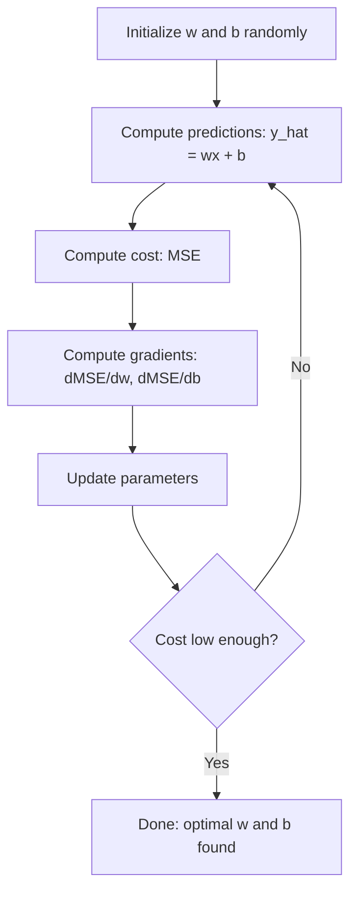

# 선형 회귀

> 선형 회귀는 데이터에 가장 잘 맞는 직선을 그립니다. 머신러닝의 "hello world"입니다.

**Type:** Build
**Languages:** Python
**Prerequisites:** Phase 1 (Linear Algebra, Calculus, Optimization), Phase 2 Lesson 1
**Time:** ~90 minutes

## 학습 목표

- 평균 제곱 오차에 대한 경사 하강법 업데이트 규칙을 유도하고 선형 회귀를 처음부터 구현한다
- 경사 하강법과 정규 방정식을 계산 복잡도와 사용 시점 관점에서 비교한다
- 특성 표준화를 포함한 다중 선형 회귀 모델을 만들고 학습된 가중치를 해석한다
- Ridge regression (L2 regularization)이 큰 가중치에 페널티를 주어 과적합을 막는 방식을 설명한다

## 문제

집 크기와 판매 가격 데이터가 있습니다. 새 집의 크기가 주어졌을 때 가격을 예측하고 싶습니다. 산점도에서 눈대중으로 볼 수도 있지만, 필요한 것은 공식입니다. 어떤 크기든 넣으면 가격 예측을 얻을 수 있도록 데이터에 가장 잘 맞는 선이 필요합니다.

선형 회귀는 그 선을 제공합니다. 더 중요한 점은 선형 회귀가 전체 ML 학습 루프를 소개한다는 것입니다. 모델을 정의하고, 비용 함수를 정의하고, 매개변수를 최적화합니다. 모든 ML 알고리즘은 같은 패턴을 따릅니다. 가장 단순한 경우로 여기서 익혀 두면 어디에서든 이 구조를 알아볼 수 있습니다.

이것은 단순한 문제에만 쓰이지 않습니다. 선형 회귀는 수요 예측, A/B 테스트 분석, 금융 모델링, 그리고 모든 회귀 작업의 기준선으로 프로덕션 시스템에서 사용됩니다.

## 개념

### 모델

선형 회귀는 입력 (x)와 출력 (y) 사이에 선형 관계가 있다고 가정합니다.

```text
y = wx + b
```

- `w` (weight/slope): x가 1 증가할 때 y가 얼마나 변하는지
- `b` (bias/intercept): x = 0일 때 y의 값

입력(특성)이 여러 개이면 다음처럼 확장됩니다.

```text
y = w1*x1 + w2*x2 + ... + wn*xn + b
```

또는 벡터 형태로는 `y = w^T * x + b`입니다.

목표는 모든 학습 예제에서 예측 y가 실제 y에 최대한 가까워지게 하는 w와 b의 값을 찾는 것입니다.

### 비용 함수(평균 제곱 오차)

"최대한 가깝다"를 어떻게 측정할까요? 예측이 얼마나 틀렸는지 담아내는 단일 숫자가 필요합니다. 가장 흔한 선택은 Mean Squared Error (MSE)입니다.

```text
MSE = (1/n) * sum((y_predicted - y_actual)^2)
```

왜 제곱할까요? 이유는 두 가지입니다. 첫째, 작은 오차보다 큰 오차에 더 큰 페널티를 줍니다(오차 10은 오차 1보다 10배가 아니라 100배 더 나쁩니다). 둘째, 제곱 함수는 모든 지점에서 매끄럽고 미분 가능하므로 최적화가 단순해집니다.

비용 함수는 표면을 만듭니다. 하나의 가중치 w와 편향 b에 대해 MSE 표면은 그릇 모양(볼록 포물면)처럼 보입니다. 그릇의 바닥이 MSE가 최소가 되는 지점입니다. 학습이란 그 바닥을 찾는 일입니다.

### 경사 하강법(Gradient Descent)

Gradient descent는 아래쪽으로 한 걸음씩 이동하며 그릇의 바닥을 찾습니다.



기울기는 두 가지를 알려 줍니다. 각 매개변수를 어느 방향으로 움직일지, 그리고 얼마나 움직일지입니다.

y_hat = wx + b인 MSE에 대해:

```text
dMSE/dw = (2/n) * sum((y_hat - y) * x)
dMSE/db = (2/n) * sum(y_hat - y)
```

업데이트 규칙:

```text
w = w - learning_rate * dMSE/dw
b = b - learning_rate * dMSE/db
```

learning rate는 보폭을 제어합니다. 너무 크면 최솟값을 지나쳐 발산합니다. 너무 작으면 학습이 너무 오래 걸립니다. 일반적인 시작값은 0.01, 0.001, 또는 0.0001입니다.

### 정규 방정식(닫힌형 해)

선형 회귀에는 반복 없이 최적 가중치를 바로 주는 직접 공식이 있습니다.

```text
w = (X^T * X)^(-1) * X^T * y
```

이 식은 행렬을 역행렬로 만들어 w를 한 번에 풉니다. 작은 데이터셋에서는 완벽하게 동작합니다. 큰 데이터셋(수백만 행 또는 수천 특성)에서는 행렬 역산이 특성 수에 대해 O(n^3)이므로 gradient descent가 선호됩니다.

### 다중 선형 회귀

특성이 여러 개이면 모델은 다음과 같습니다.

```text
y = w1*x1 + w2*x2 + ... + wn*xn + b
```

모든 것은 같은 방식으로 동작합니다. MSE가 비용 함수이고, gradient descent가 모든 가중치를 동시에 업데이트합니다. 유일한 차이는 직선 대신 초평면을 맞춘다는 점입니다.

여기서는 특성 스케일링이 중요합니다. 한 특성의 범위가 0부터 1이고 다른 특성의 범위가 0부터 1,000,000이면 비용 표면이 길게 늘어나므로 gradient descent가 어려워집니다. 학습 전에 특성을 표준화합니다(평균을 빼고 표준편차로 나누기).

### 다항 회귀

관계가 선형이 아니라면 어떨까요? 다항 특성을 만들면 여전히 선형 회귀를 사용할 수 있습니다.

```text
y = w1*x + w2*x^2 + w3*x^3 + b
```

이것은 여전히 "linear" regression입니다. 모델이 가중치(w1, w2, w3)에 대해 선형이기 때문입니다. 단지 x의 비선형 특성을 사용할 뿐입니다.

차수가 높은 다항식은 더 복잡한 곡선을 맞출 수 있지만 과적합 위험이 있습니다. 10차 다항식은 10개 점으로 된 데이터셋의 모든 점을 통과할 수 있지만 새 데이터에서는 예측이 나쁠 수 있습니다.

### R-Squared 점수

MSE는 얼마나 틀렸는지 알려 주지만, 그 숫자는 y의 스케일에 의존합니다. R-squared (R^2)는 스케일에 독립적인 척도를 제공합니다.

```text
R^2 = 1 - (sum of squared residuals) / (sum of squared deviations from mean)
    = 1 - SS_res / SS_tot
```

- R^2 = 1.0: 완벽한 예측
- R^2 = 0.0: 모델이 매번 평균을 예측하는 것보다 낫지 않음
- R^2 < 0.0: 모델이 평균을 예측하는 것보다 나쁨

### 정규화 미리보기(Ridge Regression)

특성이 많으면 모델이 큰 가중치를 부여하면서 과적합할 수 있습니다. Ridge regression (L2 regularization)은 페널티를 추가합니다.

```text
Cost = MSE + lambda * sum(w_i^2)
```

페널티 항은 큰 가중치를 억제합니다. 하이퍼파라미터 lambda는 절충을 제어합니다. lambda가 클수록 가중치는 작아지고 정규화는 강해집니다. 이는 이후 수업에서 깊이 다룹니다. 지금은 이것이 존재하며 왜 도움이 되는지만 알아 두면 됩니다.

```figure
linear-regression-fit
```

## 직접 만들기

### Step 1: 샘플 데이터 생성

```python
import random
import math

random.seed(42)

TRUE_W = 3.0
TRUE_B = 7.0
N_SAMPLES = 100

X = [random.uniform(0, 10) for _ in range(N_SAMPLES)]
y = [TRUE_W * x + TRUE_B + random.gauss(0, 2.0) for x in X]

print(f"Generated {N_SAMPLES} samples")
print(f"True relationship: y = {TRUE_W}x + {TRUE_B} (+ noise)")
print(f"First 5 points: {[(round(X[i], 2), round(y[i], 2)) for i in range(5)]}")
```

### Step 2: gradient descent로 선형 회귀를 처음부터 구현하기

```python
class LinearRegression:
    def __init__(self, learning_rate=0.01):
        self.w = 0.0
        self.b = 0.0
        self.lr = learning_rate
        self.cost_history = []

    def predict(self, X):
        return [self.w * x + self.b for x in X]

    def compute_cost(self, X, y):
        predictions = self.predict(X)
        n = len(y)
        cost = sum((pred - actual) ** 2 for pred, actual in zip(predictions, y)) / n
        return cost

    def compute_gradients(self, X, y):
        predictions = self.predict(X)
        n = len(y)
        dw = (2 / n) * sum((pred - actual) * x for pred, actual, x in zip(predictions, y, X))
        db = (2 / n) * sum(pred - actual for pred, actual in zip(predictions, y))
        return dw, db

    def fit(self, X, y, epochs=1000, print_every=200):
        for epoch in range(epochs):
            dw, db = self.compute_gradients(X, y)
            self.w -= self.lr * dw
            self.b -= self.lr * db
            cost = self.compute_cost(X, y)
            self.cost_history.append(cost)
            if epoch % print_every == 0:
                print(f"  Epoch {epoch:4d} | Cost: {cost:.4f} | w: {self.w:.4f} | b: {self.b:.4f}")
        return self

    def r_squared(self, X, y):
        predictions = self.predict(X)
        y_mean = sum(y) / len(y)
        ss_res = sum((actual - pred) ** 2 for actual, pred in zip(y, predictions))
        ss_tot = sum((actual - y_mean) ** 2 for actual in y)
        return 1 - (ss_res / ss_tot)


print("=== Training Linear Regression (Gradient Descent) ===")
model = LinearRegression(learning_rate=0.005)
model.fit(X, y, epochs=1000, print_every=200)
print(f"\nLearned: y = {model.w:.4f}x + {model.b:.4f}")
print(f"True:    y = {TRUE_W}x + {TRUE_B}")
print(f"R-squared: {model.r_squared(X, y):.4f}")
```

### Step 3: 정규 방정식(닫힌형 해)

```python
class LinearRegressionNormal:
    def __init__(self):
        self.w = 0.0
        self.b = 0.0

    def fit(self, X, y):
        n = len(X)
        x_mean = sum(X) / n
        y_mean = sum(y) / n
        numerator = sum((X[i] - x_mean) * (y[i] - y_mean) for i in range(n))
        denominator = sum((X[i] - x_mean) ** 2 for i in range(n))
        self.w = numerator / denominator
        self.b = y_mean - self.w * x_mean
        return self

    def predict(self, X):
        return [self.w * x + self.b for x in X]

    def r_squared(self, X, y):
        predictions = self.predict(X)
        y_mean = sum(y) / len(y)
        ss_res = sum((actual - pred) ** 2 for actual, pred in zip(y, predictions))
        ss_tot = sum((actual - y_mean) ** 2 for actual in y)
        return 1 - (ss_res / ss_tot)


print("\n=== Normal Equation (Closed-Form) ===")
model_normal = LinearRegressionNormal()
model_normal.fit(X, y)
print(f"Learned: y = {model_normal.w:.4f}x + {model_normal.b:.4f}")
print(f"R-squared: {model_normal.r_squared(X, y):.4f}")
```

### Step 4: 다중 선형 회귀

```python
class MultipleLinearRegression:
    def __init__(self, n_features, learning_rate=0.01):
        self.weights = [0.0] * n_features
        self.bias = 0.0
        self.lr = learning_rate
        self.cost_history = []

    def predict_single(self, x):
        return sum(w * xi for w, xi in zip(self.weights, x)) + self.bias

    def predict(self, X):
        return [self.predict_single(x) for x in X]

    def compute_cost(self, X, y):
        predictions = self.predict(X)
        n = len(y)
        return sum((pred - actual) ** 2 for pred, actual in zip(predictions, y)) / n

    def fit(self, X, y, epochs=1000, print_every=200):
        n = len(y)
        n_features = len(X[0])
        for epoch in range(epochs):
            predictions = self.predict(X)
            errors = [pred - actual for pred, actual in zip(predictions, y)]
            for j in range(n_features):
                grad = (2 / n) * sum(errors[i] * X[i][j] for i in range(n))
                self.weights[j] -= self.lr * grad
            grad_b = (2 / n) * sum(errors)
            self.bias -= self.lr * grad_b
            cost = self.compute_cost(X, y)
            self.cost_history.append(cost)
            if epoch % print_every == 0:
                print(f"  Epoch {epoch:4d} | Cost: {cost:.4f}")
        return self

    def r_squared(self, X, y):
        predictions = self.predict(X)
        y_mean = sum(y) / len(y)
        ss_res = sum((actual - pred) ** 2 for actual, pred in zip(y, predictions))
        ss_tot = sum((actual - y_mean) ** 2 for actual in y)
        return 1 - (ss_res / ss_tot)


random.seed(42)
N = 100
X_multi = []
y_multi = []
for _ in range(N):
    size = random.uniform(500, 3000)
    bedrooms = random.randint(1, 5)
    age = random.uniform(0, 50)
    price = 50 * size + 10000 * bedrooms - 1000 * age + 50000 + random.gauss(0, 20000)
    X_multi.append([size, bedrooms, age])
    y_multi.append(price)


def standardize(X):
    n_features = len(X[0])
    means = [sum(X[i][j] for i in range(len(X))) / len(X) for j in range(n_features)]
    stds = []
    for j in range(n_features):
        variance = sum((X[i][j] - means[j]) ** 2 for i in range(len(X))) / len(X)
        stds.append(variance ** 0.5)
    X_scaled = []
    for i in range(len(X)):
        row = [(X[i][j] - means[j]) / stds[j] if stds[j] > 0 else 0 for j in range(n_features)]
        X_scaled.append(row)
    return X_scaled, means, stds


y_mean_val = sum(y_multi) / len(y_multi)
y_std_val = (sum((yi - y_mean_val) ** 2 for yi in y_multi) / len(y_multi)) ** 0.5
y_scaled = [(yi - y_mean_val) / y_std_val for yi in y_multi]

X_scaled, x_means, x_stds = standardize(X_multi)

print("\n=== Multiple Linear Regression (3 features) ===")
print("Features: house size, bedrooms, age")
multi_model = MultipleLinearRegression(n_features=3, learning_rate=0.01)
multi_model.fit(X_scaled, y_scaled, epochs=1000, print_every=200)

print(f"\nWeights (standardized): {[round(w, 4) for w in multi_model.weights]}")
print(f"Bias (standardized): {multi_model.bias:.4f}")
print(f"R-squared: {multi_model.r_squared(X_scaled, y_scaled):.4f}")
```

### Step 5: 다항 회귀

```python
class PolynomialRegression:
    def __init__(self, degree, learning_rate=0.01):
        self.degree = degree
        self.weights = [0.0] * degree
        self.bias = 0.0
        self.lr = learning_rate

    def make_features(self, X):
        return [[x ** (d + 1) for d in range(self.degree)] for x in X]

    def predict(self, X):
        features = self.make_features(X)
        return [sum(w * f for w, f in zip(self.weights, row)) + self.bias for row in features]

    def fit(self, X, y, epochs=1000, print_every=200):
        features = self.make_features(X)
        n = len(y)
        for epoch in range(epochs):
            predictions = [sum(w * f for w, f in zip(self.weights, row)) + self.bias for row in features]
            errors = [pred - actual for pred, actual in zip(predictions, y)]
            for j in range(self.degree):
                grad = (2 / n) * sum(errors[i] * features[i][j] for i in range(n))
                self.weights[j] -= self.lr * grad
            grad_b = (2 / n) * sum(errors)
            self.bias -= self.lr * grad_b
            if epoch % print_every == 0:
                cost = sum(e ** 2 for e in errors) / n
                print(f"  Epoch {epoch:4d} | Cost: {cost:.6f}")
        return self

    def r_squared(self, X, y):
        predictions = self.predict(X)
        y_mean = sum(y) / len(y)
        ss_res = sum((actual - pred) ** 2 for actual, pred in zip(y, predictions))
        ss_tot = sum((actual - y_mean) ** 2 for actual in y)
        return 1 - (ss_res / ss_tot)


random.seed(42)
X_poly = [x / 10.0 for x in range(0, 50)]
y_poly = [0.5 * x ** 2 - 2 * x + 3 + random.gauss(0, 1.0) for x in X_poly]

x_max = max(abs(x) for x in X_poly)
X_poly_norm = [x / x_max for x in X_poly]
y_poly_mean = sum(y_poly) / len(y_poly)
y_poly_std = (sum((yi - y_poly_mean) ** 2 for yi in y_poly) / len(y_poly)) ** 0.5
y_poly_norm = [(yi - y_poly_mean) / y_poly_std for yi in y_poly]

print("\n=== Polynomial Regression (degree 2 vs degree 5) ===")
print("True relationship: y = 0.5x^2 - 2x + 3")

print("\nDegree 2:")
poly2 = PolynomialRegression(degree=2, learning_rate=0.1)
poly2.fit(X_poly_norm, y_poly_norm, epochs=2000, print_every=500)
print(f"  R-squared: {poly2.r_squared(X_poly_norm, y_poly_norm):.4f}")

print("\nDegree 5:")
poly5 = PolynomialRegression(degree=5, learning_rate=0.1)
poly5.fit(X_poly_norm, y_poly_norm, epochs=2000, print_every=500)
print(f"  R-squared: {poly5.r_squared(X_poly_norm, y_poly_norm):.4f}")

print("\nDegree 2 fits the true curve well. Degree 5 fits training data slightly better")
print("but risks overfitting on new data.")
```

### Step 6: Ridge regression (L2 regularization)

```python
class RidgeRegression:
    def __init__(self, n_features, learning_rate=0.01, alpha=1.0):
        self.weights = [0.0] * n_features
        self.bias = 0.0
        self.lr = learning_rate
        self.alpha = alpha

    def predict_single(self, x):
        return sum(w * xi for w, xi in zip(self.weights, x)) + self.bias

    def predict(self, X):
        return [self.predict_single(x) for x in X]

    def fit(self, X, y, epochs=1000, print_every=200):
        n = len(y)
        n_features = len(X[0])
        for epoch in range(epochs):
            predictions = self.predict(X)
            errors = [pred - actual for pred, actual in zip(predictions, y)]
            mse = sum(e ** 2 for e in errors) / n
            reg_term = self.alpha * sum(w ** 2 for w in self.weights)
            cost = mse + reg_term
            for j in range(n_features):
                grad = (2 / n) * sum(errors[i] * X[i][j] for i in range(n))
                grad += 2 * self.alpha * self.weights[j]
                self.weights[j] -= self.lr * grad
            grad_b = (2 / n) * sum(errors)
            self.bias -= self.lr * grad_b
            if epoch % print_every == 0:
                print(f"  Epoch {epoch:4d} | Cost: {cost:.4f} | L2 penalty: {reg_term:.4f}")
        return self


print("\n=== Ridge Regression (L2 Regularization) ===")
print("Same data as multiple regression, with alpha=0.1")
ridge = RidgeRegression(n_features=3, learning_rate=0.01, alpha=0.1)
ridge.fit(X_scaled, y_scaled, epochs=1000, print_every=200)
print(f"\nRidge weights: {[round(w, 4) for w in ridge.weights]}")
print(f"Plain weights: {[round(w, 4) for w in multi_model.weights]}")
print("Ridge weights are smaller (shrunk toward zero) due to the L2 penalty.")
```

## 사용하기

이제 실제 프로덕션에서 사용할 scikit-learn으로 같은 작업을 해 봅니다.

```python
from sklearn.linear_model import LinearRegression as SklearnLR
from sklearn.linear_model import Ridge
from sklearn.preprocessing import PolynomialFeatures, StandardScaler
from sklearn.model_selection import train_test_split
from sklearn.metrics import mean_squared_error, r2_score
import numpy as np

np.random.seed(42)
X_sk = np.random.uniform(0, 10, (100, 1))
y_sk = 3.0 * X_sk.squeeze() + 7.0 + np.random.normal(0, 2.0, 100)

X_train, X_test, y_train, y_test = train_test_split(X_sk, y_sk, test_size=0.2, random_state=42)

lr = SklearnLR()
lr.fit(X_train, y_train)
y_pred = lr.predict(X_test)

print("=== Scikit-learn Linear Regression ===")
print(f"Coefficient (w): {lr.coef_[0]:.4f}")
print(f"Intercept (b): {lr.intercept_:.4f}")
print(f"R-squared (test): {r2_score(y_test, y_pred):.4f}")
print(f"MSE (test): {mean_squared_error(y_test, y_pred):.4f}")

poly = PolynomialFeatures(degree=2, include_bias=False)
X_poly_sk = poly.fit_transform(X_train)
X_poly_test = poly.transform(X_test)

lr_poly = SklearnLR()
lr_poly.fit(X_poly_sk, y_train)
print(f"\nPolynomial degree 2 R-squared: {r2_score(y_test, lr_poly.predict(X_poly_test)):.4f}")

scaler = StandardScaler()
X_train_scaled = scaler.fit_transform(X_train)
X_test_scaled = scaler.transform(X_test)

ridge = Ridge(alpha=1.0)
ridge.fit(X_train_scaled, y_train)
print(f"Ridge R-squared: {r2_score(y_test, ridge.predict(X_test_scaled)):.4f}")
print(f"Ridge coefficient: {ridge.coef_[0]:.4f}")
```

처음부터 구현한 버전과 scikit-learn은 같은 결과를 냅니다. 차이는 scikit-learn이 엣지 케이스, 수치 안정성, 성능 최적화를 처리한다는 점입니다. 프로덕션에서는 라이브러리를 사용하세요. 처음부터 만든 버전은 무슨 일이 일어나는지 이해하기 위해 사용하세요.

## 산출물로 만들기

이 수업의 산출물:
- `outputs/skill-regression.md` - 문제에 맞는 회귀 접근법을 선택하기 위한 skill

## 연습 문제

1. Batch gradient descent, stochastic gradient descent (SGD), mini-batch gradient descent를 구현하세요. 같은 데이터셋에서 수렴 속도를 비교하세요. 어떤 방식이 가장 빨리 수렴하나요? 어떤 방식의 비용 곡선이 가장 매끄럽나요?
2. 3차 함수(y = ax^3 + bx^2 + cx + d + noise)에서 데이터를 생성하세요. 1차, 3차, 10차 다항식을 맞추세요. 학습 R^2와 테스트 R^2를 비교하세요. 어느 차수에서 과적합이 명확해지나요?
3. Lasso regression (L1 regularization: penalty = alpha * sum(|w_i|))을 구현하세요. 다중 특성 주택 데이터로 학습하세요. 어떤 가중치가 Ridge와 비교해 0으로 가는지 비교하세요. 왜 L1은 희소 해를 만들지만 L2는 그렇지 않을까요?

## 핵심 용어

| Term | 사람들이 흔히 말하는 것 | 실제 의미 |
|------|----------------|----------------------|
| Linear regression | "데이터에 선을 긋기" | wx+b와 실제 y 값 사이의 제곱 차이 합을 최소화하는 weight w와 bias b를 찾는 것 |
| Cost function | "모델이 얼마나 나쁜지" | 모델 매개변수를 예측 오차를 측정하는 단일 숫자로 매핑하고, 최적화가 이를 최소화하는 함수 |
| Mean squared error | "제곱 오차의 평균" | (1/n) * sum of (predicted - actual)^2로, 큰 오차에 불균형하게 큰 페널티를 준다 |
| Gradient descent | "내리막 걷기" | 편미분을 사용해 비용 함수를 줄이는 방향으로 매개변수를 반복적으로 조정하는 방법 |
| Learning rate | "보폭" | gradient descent의 한 단계마다 매개변수가 얼마나 변하는지 제어하는 스칼라 |
| Normal equation | "직접 풀기" | 반복 없이 최적 가중치를 주는 닫힌형 해 w = (X^T X)^-1 X^T y |
| R-squared | "맞춤이 얼마나 좋은지" | y의 분산 중 모델이 설명하는 비율로, 음의 무한대부터 1.0까지 가능하다 |
| Feature scaling | "특성을 비교 가능하게 만들기" | gradient descent가 더 빨리 수렴하도록 특성을 비슷한 범위(예: 평균 0, 분산 1)로 변환하는 것 |
| Regularization | "복잡도에 페널티 주기" | 과적합을 막기 위해 가중치를 줄이는 항을 비용 함수에 추가하는 것 |
| Ridge regression | "L2 regularization" | MSE에 lambda * sum(w_i^2) 페널티를 더한 선형 회귀 |
| Polynomial regression | "선형 수학으로 곡선 맞추기" | 다항 특성(x, x^2, x^3, ...)에 대한 선형 회귀로, 여전히 가중치에 대해서는 선형이다 |
| Overfitting | "학습 데이터 암기" | 학습 데이터의 잡음까지 맞출 만큼 복잡한 모델을 사용해 새 데이터에서 실패하는 것 |

## 더 읽을거리

- [An Introduction to Statistical Learning (ISLR)](https://www.statlearning.com/) -- 무료 PDF, 3장과 6장에서 실용적인 R 예제로 선형 회귀와 정규화를 다룹니다
- [The Elements of Statistical Learning (ESL)](https://hastie.su.domains/ElemStatLearn/) -- 무료 PDF, ISLR의 더 수학적인 동반 자료로 ridge와 lasso를 더 깊게 다룹니다
- [Stanford CS229 Lecture Notes on Linear Regression](https://cs229.stanford.edu/main_notes.pdf) -- Andrew Ng의 노트로, 정규 방정식과 gradient descent를 제1원리에서 유도합니다
- [scikit-learn LinearRegression documentation](https://scikit-learn.org/stable/modules/linear_model.html) -- LinearRegression, Ridge, Lasso, ElasticNet에 대한 코드 예제 포함 실용 참고 자료
