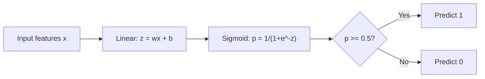
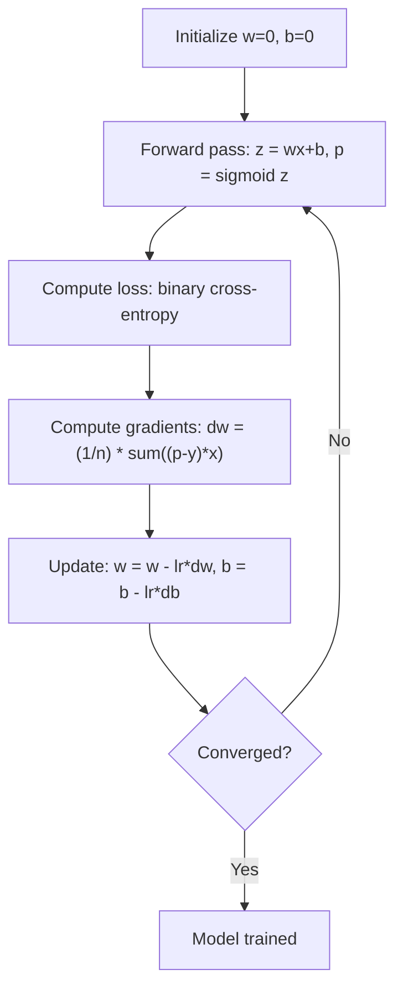

# 로지스틱 회귀

> 로지스틱 회귀는 직선을 S-곡선으로 휘어 yes-or-no 질문에 확률로 답합니다.

**Type:** Build
**Languages:** Python
**Prerequisites:** Phase 2 Lesson 1-2 (What Is ML, Linear Regression)
**Time:** ~90 minutes

## 학습 목표

- sigmoid 함수와 binary cross-entropy loss를 사용해 로지스틱 회귀를 처음부터 구현한다
- 이진 분류에서 precision, recall, F1 score, confusion matrix를 계산하고 해석한다
- MSE가 분류에서 실패하는 이유와 binary cross-entropy가 볼록 비용 표면을 만드는 이유를 설명한다
- 다중 클래스 분류용 softmax regression 모델을 만들고 threshold tuning의 절충을 평가한다

## 문제

종양의 크기가 주어졌을 때 악성인지 양성인지 예측하고 싶습니다. 선형 회귀를 시도합니다. 출력은 0.3, 1.7, -0.5 같은 숫자입니다. 이것들은 무엇을 의미할까요? 1.7은 "매우 악성"일까요? -0.5는 "매우 양성"일까요? 선형 회귀는 경계가 없는 숫자를 출력합니다. 분류에는 0과 1 사이로 제한된 확률과 명확한 결정, 즉 yes 또는 no가 필요합니다.

로지스틱 회귀는 이 문제를 해결합니다. 같은 선형 결합(wx + b)을 가져와 sigmoid function에 통과시키고, sigmoid는 어떤 숫자든 (0, 1) 범위로 눌러 넣습니다. 출력은 확률입니다. threshold(보통 0.5)를 정하고 결정을 내립니다.

이는 실무에서 가장 널리 쓰이는 알고리즘 중 하나입니다. 이름과 달리 logistic regression은 회귀 알고리즘이 아니라 분류 알고리즘입니다. 이름은 이 알고리즘이 사용하는 logistic (sigmoid) function에서 왔습니다.

## 개념

### 선형 회귀가 분류에서 실패하는 이유

공부 시간으로 합격/불합격(1/0)을 예측한다고 상상해 봅시다. 선형 회귀는 데이터에 선을 맞춥니다.

```text
hours:  1   2   3   4   5   6   7   8   9   10
actual: 0   0   0   0   1   1   1   1   1   1
```

선형 맞춤은 1시간에서 -0.2, 10시간에서 1.3 같은 예측을 만들 수 있습니다. 이 값들은 확률이 아닙니다. 0보다 작거나 1보다 큽니다. 더 나쁜 점은 단 하나의 이상치(50시간 공부한 사람)가 전체 선을 끌어당겨 모든 사람의 예측을 바꿀 수 있다는 것입니다.

분류에는 다음을 만족하는 함수가 필요합니다.
- 0과 1 사이의 값(확률)을 출력한다
- 날카로운 전환(결정 경계)을 만든다
- 경계에서 멀리 떨어진 이상치에 의해 왜곡되지 않는다

### Sigmoid 함수

sigmoid function은 정확히 이 일을 합니다.

```text
sigmoid(z) = 1 / (1 + e^(-z))
```

성질:
- z가 크고 양수이면 sigmoid(z)는 1에 가까워진다
- z가 크고 음수이면 sigmoid(z)는 0에 가까워진다
- z = 0이면 sigmoid(z) = 0.5이다
- 출력은 항상 0과 1 사이이다
- 함수는 모든 지점에서 매끄럽고 미분 가능하다

도함수는 편리한 형태를 가집니다. sigmoid'(z) = sigmoid(z) * (1 - sigmoid(z)). 그래서 기울기 계산이 효율적입니다.

### Logistic Regression = Linear Model + Sigmoid

모델은 z = wx + b(선형 회귀와 동일)를 계산한 다음 sigmoid를 적용합니다.



출력 p는 P(y=1 | x), 즉 입력이 class 1에 속할 확률로 해석됩니다. 결정 경계는 wx + b = 0인 곳이며, 이때 sigmoid 출력은 정확히 0.5입니다.

### Binary cross-entropy loss

로지스틱 회귀에는 MSE를 사용할 수 없습니다. sigmoid와 함께 쓰는 MSE는 많은 국소 최솟값을 가진 비볼록 비용 표면을 만듭니다. 대신 binary cross-entropy (log loss)를 사용합니다.

```text
Loss = -(1/n) * sum(y * log(p) + (1-y) * log(1-p))
```

이것이 동작하는 이유:
- y=1이고 p가 1에 가까우면: log(1) = 0이므로 loss는 0에 가깝다(정답, 낮은 비용)
- y=1이고 p가 0에 가까우면: log(0)은 음의 무한대에 가까워지므로 loss가 매우 크다(오답, 높은 비용)
- y=0이고 p가 0에 가까우면: log(1) = 0이므로 loss는 0에 가깝다(정답, 낮은 비용)
- y=0이고 p가 1에 가까우면: log(0)은 음의 무한대에 가까워지므로 loss가 매우 크다(오답, 높은 비용)

이 loss function은 로지스틱 회귀에서 볼록하므로 하나의 전역 최솟값을 보장합니다.

### 로지스틱 회귀의 Gradient Descent

sigmoid를 사용하는 binary cross-entropy의 기울기는 깔끔한 형태를 가집니다.

```text
dL/dw = (1/n) * sum((p - y) * x)
dL/db = (1/n) * sum(p - y)
```

이 식은 선형 회귀의 기울기와 동일해 보입니다. 차이는 p = wx + b가 아니라 p = sigmoid(wx + b)라는 점입니다. sigmoid가 비선형성을 도입하지만, 기울기 업데이트 규칙은 그대로입니다.



### 결정 경계

2D 입력(두 특성)에서 결정 경계는 다음 선입니다.

```text
w1*x1 + w2*x2 + b = 0
```

한쪽의 점들은 1로 분류되고, 다른 쪽의 점들은 0으로 분류됩니다. 로지스틱 회귀는 항상 선형 결정 경계를 만듭니다. 곡선 경계가 필요하면 다항 특성을 추가하거나 비선형 모델을 사용해야 합니다.

### Softmax를 사용한 다중 클래스 분류

이진 로지스틱 회귀는 두 클래스를 다룹니다. k개 클래스에는 softmax function을 사용합니다.

```text
softmax(z_i) = e^(z_i) / sum(e^(z_j) for all j)
```

각 클래스는 자체 가중치 벡터를 가집니다. 모델은 각 클래스에 대해 score z_i를 계산하고, softmax는 점수들을 합이 1인 확률로 변환합니다. 예측 클래스는 확률이 가장 높은 클래스입니다.

loss function은 categorical cross-entropy가 됩니다.

```text
Loss = -(1/n) * sum(sum(y_k * log(p_k)))
```

여기서 y_k는 실제 클래스에 대해 1이고 나머지는 모두 0입니다(one-hot encoding).

### 평가 지표

Accuracy만으로는 충분하지 않습니다. negative가 95%, positive가 5%인 데이터셋에서 항상 negative를 예측하는 모델은 95% accuracy를 얻지만 쓸모가 없습니다.

**Confusion Matrix**:

| | Predicted Positive | Predicted Negative |
|---|---|---|
| Actually Positive | True Positive (TP) | False Negative (FN) |
| Actually Negative | False Positive (FP) | True Negative (TN) |

**Precision**: positive로 예측한 것 중 실제 positive는 몇 개인가?
```text
Precision = TP / (TP + FP)
```

**Recall** (Sensitivity): 실제 positive 중 몇 개를 잡아냈는가?
```text
Recall = TP / (TP + FN)
```

**F1 Score**: precision과 recall의 조화 평균입니다. 두 지표의 균형을 맞춥니다.
```text
F1 = 2 * (Precision * Recall) / (Precision + Recall)
```

우선순위를 정하는 기준:
- **Precision**: false positive의 비용이 클 때(스팸 필터, 정상 이메일을 차단하고 싶지 않음)
- **Recall**: false negative의 비용이 클 때(암 검진, 종양을 놓치고 싶지 않음)
- **F1**: 균형 잡힌 단일 지표가 필요할 때

```figure
logistic-sigmoid
```

## 직접 만들기

### Step 1: Sigmoid function과 데이터 생성

```python
import random
import math

def sigmoid(z):
    z = max(-500, min(500, z))
    return 1.0 / (1.0 + math.exp(-z))


random.seed(42)
N = 200
X = []
y = []

for _ in range(N // 2):
    X.append([random.gauss(2, 1), random.gauss(2, 1)])
    y.append(0)

for _ in range(N // 2):
    X.append([random.gauss(5, 1), random.gauss(5, 1)])
    y.append(1)

combined = list(zip(X, y))
random.shuffle(combined)
X, y = zip(*combined)
X = list(X)
y = list(y)

print(f"Generated {N} samples (2 classes, 2 features)")
print(f"Class 0 center: (2, 2), Class 1 center: (5, 5)")
print(f"First 5 samples:")
for i in range(5):
    print(f"  Features: [{X[i][0]:.2f}, {X[i][1]:.2f}], Label: {y[i]}")
```

### Step 2: 로지스틱 회귀를 처음부터 구현하기

```python
class LogisticRegression:
    def __init__(self, n_features, learning_rate=0.01):
        self.weights = [0.0] * n_features
        self.bias = 0.0
        self.lr = learning_rate
        self.loss_history = []

    def predict_proba(self, x):
        z = sum(w * xi for w, xi in zip(self.weights, x)) + self.bias
        return sigmoid(z)

    def predict(self, x, threshold=0.5):
        return 1 if self.predict_proba(x) >= threshold else 0

    def compute_loss(self, X, y):
        n = len(y)
        total = 0.0
        for i in range(n):
            p = self.predict_proba(X[i])
            p = max(1e-15, min(1 - 1e-15, p))
            total += y[i] * math.log(p) + (1 - y[i]) * math.log(1 - p)
        return -total / n

    def fit(self, X, y, epochs=1000, print_every=200):
        n = len(y)
        n_features = len(X[0])
        for epoch in range(epochs):
            dw = [0.0] * n_features
            db = 0.0
            for i in range(n):
                p = self.predict_proba(X[i])
                error = p - y[i]
                for j in range(n_features):
                    dw[j] += error * X[i][j]
                db += error
            for j in range(n_features):
                self.weights[j] -= self.lr * (dw[j] / n)
            self.bias -= self.lr * (db / n)
            loss = self.compute_loss(X, y)
            self.loss_history.append(loss)
            if epoch % print_every == 0:
                print(f"  Epoch {epoch:4d} | Loss: {loss:.4f} | w: [{self.weights[0]:.3f}, {self.weights[1]:.3f}] | b: {self.bias:.3f}")
        return self

    def accuracy(self, X, y):
        correct = sum(1 for i in range(len(y)) if self.predict(X[i]) == y[i])
        return correct / len(y)


split = int(0.8 * N)
X_train, X_test = X[:split], X[split:]
y_train, y_test = y[:split], y[split:]

print("\n=== Training Logistic Regression ===")
model = LogisticRegression(n_features=2, learning_rate=0.1)
model.fit(X_train, y_train, epochs=1000, print_every=200)

print(f"\nTrain accuracy: {model.accuracy(X_train, y_train):.4f}")
print(f"Test accuracy:  {model.accuracy(X_test, y_test):.4f}")
print(f"Weights: [{model.weights[0]:.4f}, {model.weights[1]:.4f}]")
print(f"Bias: {model.bias:.4f}")
```

### Step 3: Confusion matrix와 지표를 처음부터 구현하기

```python
class ClassificationMetrics:
    def __init__(self, y_true, y_pred):
        self.tp = sum(1 for t, p in zip(y_true, y_pred) if t == 1 and p == 1)
        self.tn = sum(1 for t, p in zip(y_true, y_pred) if t == 0 and p == 0)
        self.fp = sum(1 for t, p in zip(y_true, y_pred) if t == 0 and p == 1)
        self.fn = sum(1 for t, p in zip(y_true, y_pred) if t == 1 and p == 0)

    def accuracy(self):
        total = self.tp + self.tn + self.fp + self.fn
        return (self.tp + self.tn) / total if total > 0 else 0

    def precision(self):
        denom = self.tp + self.fp
        return self.tp / denom if denom > 0 else 0

    def recall(self):
        denom = self.tp + self.fn
        return self.tp / denom if denom > 0 else 0

    def f1(self):
        p = self.precision()
        r = self.recall()
        return 2 * p * r / (p + r) if (p + r) > 0 else 0

    def print_confusion_matrix(self):
        print(f"\n  Confusion Matrix:")
        print(f"                  Predicted")
        print(f"                  Pos   Neg")
        print(f"  Actual Pos     {self.tp:4d}  {self.fn:4d}")
        print(f"  Actual Neg     {self.fp:4d}  {self.tn:4d}")

    def print_report(self):
        self.print_confusion_matrix()
        print(f"\n  Accuracy:  {self.accuracy():.4f}")
        print(f"  Precision: {self.precision():.4f}")
        print(f"  Recall:    {self.recall():.4f}")
        print(f"  F1 Score:  {self.f1():.4f}")


y_pred_test = [model.predict(x) for x in X_test]
print("\n=== Classification Report (Test Set) ===")
metrics = ClassificationMetrics(y_test, y_pred_test)
metrics.print_report()
```

### Step 4: 결정 경계 분석

```python
print("\n=== Decision Boundary ===")
w1, w2 = model.weights
b = model.bias
print(f"Decision boundary: {w1:.4f}*x1 + {w2:.4f}*x2 + {b:.4f} = 0")
if abs(w2) > 1e-10:
    print(f"Solved for x2:     x2 = {-w1/w2:.4f}*x1 + {-b/w2:.4f}")

print("\nSample predictions near the boundary:")
test_points = [
    [3.0, 3.0],
    [3.5, 3.5],
    [4.0, 4.0],
    [2.5, 2.5],
    [5.0, 5.0],
]
for point in test_points:
    prob = model.predict_proba(point)
    pred = model.predict(point)
    print(f"  [{point[0]}, {point[1]}] -> prob={prob:.4f}, class={pred}")
```

### Step 5: softmax를 사용한 다중 클래스

```python
class SoftmaxRegression:
    def __init__(self, n_features, n_classes, learning_rate=0.01):
        self.n_features = n_features
        self.n_classes = n_classes
        self.lr = learning_rate
        self.weights = [[0.0] * n_features for _ in range(n_classes)]
        self.biases = [0.0] * n_classes

    def softmax(self, scores):
        max_score = max(scores)
        exp_scores = [math.exp(s - max_score) for s in scores]
        total = sum(exp_scores)
        return [e / total for e in exp_scores]

    def predict_proba(self, x):
        scores = [
            sum(self.weights[k][j] * x[j] for j in range(self.n_features)) + self.biases[k]
            for k in range(self.n_classes)
        ]
        return self.softmax(scores)

    def predict(self, x):
        probs = self.predict_proba(x)
        return probs.index(max(probs))

    def fit(self, X, y, epochs=1000, print_every=200):
        n = len(y)
        for epoch in range(epochs):
            grad_w = [[0.0] * self.n_features for _ in range(self.n_classes)]
            grad_b = [0.0] * self.n_classes
            total_loss = 0.0
            for i in range(n):
                probs = self.predict_proba(X[i])
                for k in range(self.n_classes):
                    target = 1.0 if y[i] == k else 0.0
                    error = probs[k] - target
                    for j in range(self.n_features):
                        grad_w[k][j] += error * X[i][j]
                    grad_b[k] += error
                true_prob = max(probs[y[i]], 1e-15)
                total_loss -= math.log(true_prob)
            for k in range(self.n_classes):
                for j in range(self.n_features):
                    self.weights[k][j] -= self.lr * (grad_w[k][j] / n)
                self.biases[k] -= self.lr * (grad_b[k] / n)
            if epoch % print_every == 0:
                print(f"  Epoch {epoch:4d} | Loss: {total_loss / n:.4f}")
        return self

    def accuracy(self, X, y):
        correct = sum(1 for i in range(len(y)) if self.predict(X[i]) == y[i])
        return correct / len(y)


random.seed(42)
X_3class = []
y_3class = []

centers = [(1, 1), (5, 1), (3, 5)]
for label, (cx, cy) in enumerate(centers):
    for _ in range(50):
        X_3class.append([random.gauss(cx, 0.8), random.gauss(cy, 0.8)])
        y_3class.append(label)

combined = list(zip(X_3class, y_3class))
random.shuffle(combined)
X_3class, y_3class = zip(*combined)
X_3class = list(X_3class)
y_3class = list(y_3class)

split_3 = int(0.8 * len(X_3class))
X_train_3 = X_3class[:split_3]
y_train_3 = y_3class[:split_3]
X_test_3 = X_3class[split_3:]
y_test_3 = y_3class[split_3:]

print("\n=== Multi-class Softmax Regression (3 classes) ===")
softmax_model = SoftmaxRegression(n_features=2, n_classes=3, learning_rate=0.1)
softmax_model.fit(X_train_3, y_train_3, epochs=1000, print_every=200)
print(f"\nTrain accuracy: {softmax_model.accuracy(X_train_3, y_train_3):.4f}")
print(f"Test accuracy:  {softmax_model.accuracy(X_test_3, y_test_3):.4f}")

print("\nSample predictions:")
for i in range(5):
    probs = softmax_model.predict_proba(X_test_3[i])
    pred = softmax_model.predict(X_test_3[i])
    print(f"  True: {y_test_3[i]}, Predicted: {pred}, Probs: [{', '.join(f'{p:.3f}' for p in probs)}]")
```

### Step 6: threshold tuning

```python
print("\n=== Threshold Tuning ===")
print("Default threshold: 0.5. Adjusting the threshold trades precision for recall.\n")

thresholds = [0.3, 0.4, 0.5, 0.6, 0.7]
print(f"{'Threshold':>10} {'Accuracy':>10} {'Precision':>10} {'Recall':>10} {'F1':>10}")
print("-" * 52)

for t in thresholds:
    y_pred_t = [1 if model.predict_proba(x) >= t else 0 for x in X_test]
    m = ClassificationMetrics(y_test, y_pred_t)
    print(f"{t:>10.1f} {m.accuracy():>10.4f} {m.precision():>10.4f} {m.recall():>10.4f} {m.f1():>10.4f}")
```

## 사용하기

이제 scikit-learn으로 같은 작업을 해 봅니다.

```python
from sklearn.linear_model import LogisticRegression as SklearnLR
from sklearn.metrics import accuracy_score, precision_score, recall_score, f1_score
from sklearn.metrics import confusion_matrix, classification_report
from sklearn.model_selection import train_test_split
from sklearn.preprocessing import StandardScaler
import numpy as np

np.random.seed(42)
X_0 = np.random.randn(100, 2) + [2, 2]
X_1 = np.random.randn(100, 2) + [5, 5]
X_sk = np.vstack([X_0, X_1])
y_sk = np.array([0] * 100 + [1] * 100)

X_tr, X_te, y_tr, y_te = train_test_split(X_sk, y_sk, test_size=0.2, random_state=42)

scaler = StandardScaler()
X_tr_sc = scaler.fit_transform(X_tr)
X_te_sc = scaler.transform(X_te)

lr = SklearnLR()
lr.fit(X_tr_sc, y_tr)
y_pred = lr.predict(X_te_sc)

print("=== Scikit-learn Logistic Regression ===")
print(f"Accuracy:  {accuracy_score(y_te, y_pred):.4f}")
print(f"Precision: {precision_score(y_te, y_pred):.4f}")
print(f"Recall:    {recall_score(y_te, y_pred):.4f}")
print(f"F1:        {f1_score(y_te, y_pred):.4f}")
print(f"\nConfusion Matrix:\n{confusion_matrix(y_te, y_pred)}")
print(f"\nClassification Report:\n{classification_report(y_te, y_pred)}")
```

처음부터 구현한 버전은 같은 결정 경계와 지표를 만들어 냅니다. Scikit-learn은 solver 옵션(liblinear, lbfgs, saga), 자동 정규화, 다중 클래스 전략(one-vs-rest, multinomial), 수치 안정성 최적화를 추가로 제공합니다.

## 산출물로 만들기

이 수업의 산출물:
- `code/logistic_regression.py` - 지표를 포함한 처음부터 구현한 logistic regression

## 연습 문제

1. 선형 분리가 불가능한 데이터셋(예: 두 개의 동심원)을 생성하세요. logistic regression을 학습하고 실패를 관찰하세요. 그런 다음 다항 특성(x1^2, x2^2, x1*x2)을 추가해 다시 학습하세요. accuracy가 향상됨을 보이세요.
2. 3-class softmax model을 위한 다중 클래스 confusion matrix를 구현하세요. 클래스별 precision과 recall을 계산하세요. 어떤 클래스가 가장 분류하기 어렵나요?
3. ROC curve를 처음부터 만드세요. 0부터 1까지 100개의 threshold 값에 대해 true positive rate와 false positive rate를 계산하세요. 사다리꼴 공식으로 AUC(area under the curve)를 계산하세요.

## 핵심 용어

| Term | 사람들이 흔히 말하는 것 | 실제 의미 |
|------|----------------|----------------------|
| Logistic regression | "분류를 위한 회귀" | class probabilities를 출력하는 sigmoid function 뒤에 선형 모델을 붙인 것 |
| Sigmoid function | "S-curve" | 임의의 실수를 (0, 1) 범위로 매핑하는 함수 1/(1+e^(-z)) |
| Binary cross-entropy | "Log loss" | 확신 있게 틀린 예측에 큰 페널티를 주는 loss function -[y*log(p) + (1-y)*log(1-p)] |
| Decision boundary | "나누는 선" | 모델의 출력 확률이 0.5가 되어 예측 클래스를 분리하는 표면 |
| Softmax | "Multi-class sigmoid" | 점수 벡터를 합이 1인 확률로 변환하는 함수 |
| Precision | "선택한 것 중 관련 있는 비율" | TP / (TP + FP), positive 예측 중 실제 positive인 비율 |
| Recall | "관련 있는 것 중 선택한 비율" | TP / (TP + FN), 실제 positive 중 모델이 올바르게 식별한 비율 |
| F1 score | "균형 잡힌 accuracy" | precision과 recall의 조화 평균: 2*P*R / (P+R) |
| Confusion matrix | "오류 분해표" | 각 클래스 쌍에 대해 TP, TN, FP, FN 개수를 보여 주는 표 |
| Threshold | "cutoff" | 모델이 class 1로 예측하는 기준이 되는 확률값(default 0.5, 조정 가능) |
| One-hot encoding | "범주용 이진 열" | class k를 k 위치에 1이 있고 나머지는 0인 벡터로 표현하는 것 |
| Categorical cross-entropy | "Multi-class log loss" | one-hot encoded labels를 사용해 binary cross-entropy를 k개 클래스로 확장한 것 |
