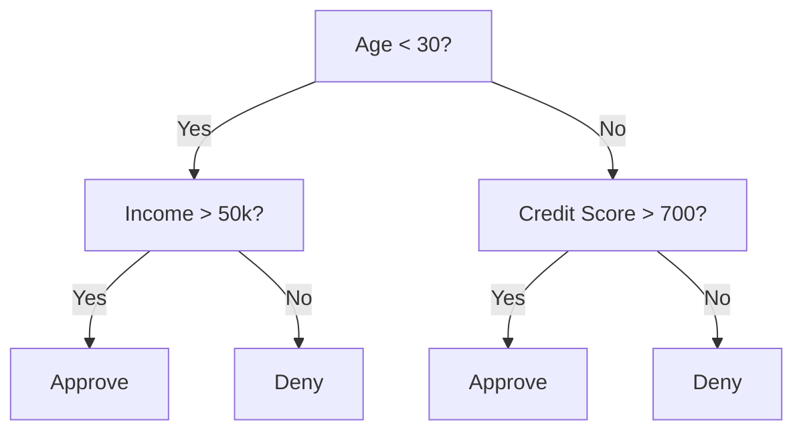
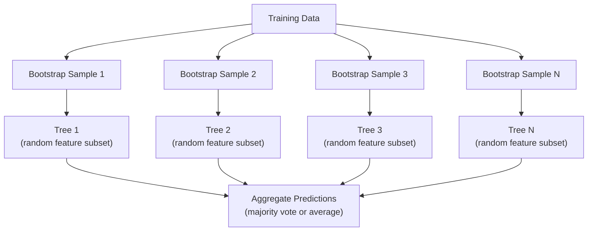

# 의사결정 트리와 랜덤 포레스트

> 의사결정 트리는 그저 순서도입니다. 하지만 그 트리들이 모인 숲은 ML에서 가장 강력한 도구 중 하나입니다.

**Type:** Build
**Languages:** Python
**Prerequisites:** Phase 1 (Lessons 09 Information Theory, 06 Probability)
**Time:** ~90 minutes

## 학습 목표

- 최적의 의사결정 트리 분할을 찾기 위해 Gini impurity, entropy, information gain 계산을 구현합니다
- 사전 가지치기 제어(max depth, min samples)를 갖춘 의사결정 트리 분류기를 처음부터 만듭니다
- bootstrap sampling과 feature randomization을 사용해 random forest를 구성하고, 이것이 왜 variance를 줄이는지 설명합니다
- MDI feature importance와 permutation importance를 비교하고 MDI가 언제 편향되는지 식별합니다

## 문제

표 형식 데이터가 있습니다. 행은 샘플, 열은 feature이고, 예측하려는 target 열이 있습니다. 여기에 neural network를 던질 수도 있습니다. 하지만 tabular data에서는 tree 기반 모델(decision trees, random forests, gradient boosted trees)이 deep learning을 꾸준히 능가합니다. 구조화된 데이터의 Kaggle 대회는 transformers가 아니라 XGBoost와 LightGBM이 지배합니다.

왜일까요? 트리는 전처리 없이 혼합 feature type(numeric과 categorical)을 처리합니다. Feature engineering 없이 nonlinear relationship을 처리합니다. 해석 가능합니다. 트리를 보고 왜 어떤 예측이 만들어졌는지 정확히 확인할 수 있습니다. 그리고 많은 트리의 평균을 내는 random forest는 중간 크기 데이터셋에서 overfitting에 매우 강합니다.

이 레슨에서는 recursive splitting으로 decision tree를 처음부터 만든 뒤, 그 위에 random forest를 만듭니다. split criteria(Gini impurity, entropy, information gain) 뒤의 수학을 구현하고, weak learner의 ensemble이 왜 strong learner가 되는지 이해합니다.

## 개념

### 의사결정 트리가 하는 일

Decision tree는 일련의 yes/no 질문을 던져 feature space를 직사각형 영역들로 나눕니다.



각 internal node는 feature를 threshold와 비교합니다. 각 leaf node는 예측을 만듭니다. 새 data point를 분류하려면 root에서 시작해 leaf에 도달할 때까지 branch를 따라갑니다.

트리는 각 node에서 데이터를 가장 잘 분리하는 feature와 threshold를 고르는 방식으로 top-down으로 만들어집니다. 여기서 "가장 좋다"는 split criterion으로 정의됩니다.

### 분할 기준: impurity 측정

각 node에는 샘플 집합이 있습니다. 우리는 이들을 나누어 resulting child node가 가능한 한 "pure"하도록 만들고 싶습니다. 즉 각 child가 대부분 하나의 class를 담도록 하는 것입니다.

**Gini impurity**는 어떤 node의 class distribution에 따라 무작위로 고른 샘플에 label을 붙였을 때, 그 샘플이 잘못 분류될 확률을 측정합니다.

```text
Gini(S) = 1 - sum(p_k^2)

where p_k is the proportion of class k in set S.
```

Pure node(모두 하나의 class)에서는 Gini = 0입니다. 50/50 class를 가진 binary split에서는 Gini = 0.5입니다. 낮을수록 좋습니다.

```text
Example: 6 cats, 4 dogs

Gini = 1 - (0.6^2 + 0.4^2) = 1 - (0.36 + 0.16) = 0.48
```

**Entropy**는 node 안의 정보량(disorder)을 측정합니다. Phase 1 Lesson 09에서 다뤘습니다.

```text
Entropy(S) = -sum(p_k * log2(p_k))
```

Pure node에서는 entropy = 0입니다. 50/50 binary split에서는 entropy = 1.0입니다. 낮을수록 좋습니다.

```text
Example: 6 cats, 4 dogs

Entropy = -(0.6 * log2(0.6) + 0.4 * log2(0.4))
        = -(0.6 * -0.737 + 0.4 * -1.322)
        = 0.442 + 0.529
        = 0.971 bits
```

**Information gain**은 split 후 impurity(entropy 또는 Gini)가 얼마나 줄었는지입니다.

```text
IG(S, feature, threshold) = Impurity(S) - weighted_avg(Impurity(S_left), Impurity(S_right))

where the weights are the proportions of samples in each child.
```

각 node에서의 greedy algorithm은 모든 feature와 가능한 모든 threshold를 시도합니다. information gain을 최대화하는 (feature, threshold) 쌍을 고릅니다.

### 분할이 작동하는 방식

현재 node에 n개 feature와 m개 sample이 있는 dataset의 경우:

1. 각 feature j(j = 1 to n)에 대해:
   - feature j 기준으로 sample을 정렬합니다
   - 연속된 서로 다른 값 사이의 모든 midpoint를 threshold로 시도합니다
   - 각 threshold의 information gain을 계산합니다
2. information gain이 가장 높은 feature와 threshold를 선택합니다
3. 데이터를 left(feature <= threshold)와 right(feature > threshold)로 나눕니다
4. 각 child에서 재귀적으로 반복합니다

이 greedy approach는 globally optimal tree를 보장하지 않습니다. optimal tree를 찾는 문제는 NP-hard입니다. 하지만 greedy splitting은 실전에서 잘 작동합니다.

### 중단 조건

중단 조건이 없으면 트리는 모든 leaf가 pure해질 때까지(one sample per leaf) 자랍니다. 이는 training data를 완벽히 암기하고 일반화 성능은 형편없게 만듭니다.

**Pre-pruning**은 트리가 완전히 자라기 전에 멈춥니다:
- Maximum depth: 트리가 정해진 깊이에 도달하면 split을 멈춥니다
- Minimum samples per leaf: node에 k개보다 적은 sample이 있으면 멈춥니다
- Minimum information gain: best split이 impurity를 threshold보다 적게 개선하면 멈춥니다
- Maximum leaf nodes: 전체 leaf 수를 제한합니다

**Post-pruning**은 full tree를 키운 뒤 다시 잘라냅니다:
- Cost-complexity pruning(scikit-learn에서 사용): leaf 수에 비례하는 penalty를 추가합니다. penalty를 키우면 더 작은 tree를 얻습니다
- Reduced error pruning: validation error가 증가하지 않으면 subtree를 제거합니다

Pre-pruning은 더 단순하고 빠릅니다. Post-pruning은 유용한 추가 split로 이어질 수 있는 split을 성급히 멈추지 않기 때문에 더 좋은 tree를 만드는 경우가 많습니다.

### 회귀용 의사결정 트리

Regression에서는 leaf prediction이 해당 leaf에 있는 target value의 mean입니다. split criterion도 바뀝니다.

**Variance reduction**이 information gain을 대체합니다:

```text
VR(S, feature, threshold) = Var(S) - weighted_avg(Var(S_left), Var(S_right))
```

variance를 가장 많이 줄이는 split을 고릅니다. 트리는 input space를 영역으로 나누고, 각 영역에서 constant(mean)를 예측합니다.

### 랜덤 포레스트: ensemble의 힘

단일 decision tree는 high variance입니다. 데이터가 조금만 달라져도 완전히 다른 tree가 만들어질 수 있습니다. Random forest는 많은 tree를 평균 내어 이를 해결합니다.



두 가지 randomness source가 tree들을 다양하게 만듭니다.

**Bagging (bootstrap aggregating):** 각 tree는 training data에서 replacement를 허용해 뽑은 random sample인 bootstrap sample로 학습합니다. 각 bootstrap에는 원본 sample의 약 63%가 등장합니다(나머지는 validation에 사용할 수 있는 out-of-bag sample입니다).

**Feature randomization:** 각 split에서 feature의 random subset만 고려합니다. Classification에서는 기본값이 sqrt(n_features)입니다. Regression에서는 n_features/3입니다. 이로 인해 모든 tree가 같은 dominant feature로 split하는 것을 막습니다.

핵심 통찰은 다음과 같습니다. 서로 덜 상관된 많은 tree를 평균 내면 bias를 늘리지 않고 variance를 줄입니다. 개별 tree는 평범할 수 있습니다. Ensemble은 강합니다.

### Feature importance

Random forest는 feature importance score를 자연스럽게 제공합니다. 가장 흔한 방법은 다음과 같습니다.

**Mean Decrease in Impurity (MDI):** 각 feature에 대해, 모든 tree와 그 feature가 사용된 모든 node에서 impurity reduction의 총합을 더합니다. 더 이른 split에서 더 큰 impurity reduction을 만드는 feature가 더 중요합니다.

```text
importance(feature_j) = sum over all nodes where feature_j is used:
    (n_samples_at_node / n_total_samples) * impurity_decrease
```

이 방법은 빠르지만(training 중 계산됨) high-cardinality feature와 가능한 split point가 많은 feature 쪽으로 편향됩니다.

**Permutation importance**는 대안입니다. 한 feature의 값을 shuffle하고 model accuracy가 얼마나 떨어지는지 측정합니다. 더 신뢰할 수 있지만 느립니다.

### 트리가 neural network를 이길 때

Tree와 forest는 tabular data에서 neural network를 압도합니다. 몇 가지 이유가 있습니다:

| Factor | Trees | Neural networks |
|--------|-------|----------------|
| 혼합 type (numeric + categorical) | Native support | Need encoding |
| 작은 dataset (< 10k rows) | Work well | Overfit |
| Feature interaction | Found by splitting | Need architecture design |
| 해석 가능성 | Full transparency | Black box |
| Training time | Minutes | Hours |
| Hyperparameter sensitivity | Low | High |

Neural network는 데이터에 spatial 또는 sequential structure(images, text, audio)가 있을 때 이깁니다. 평평한 feature table에서는 tree가 기본 선택입니다.

```figure
decision-tree-depth
```

## 직접 만들기

### Step 1: Gini impurity와 entropy

두 split criterion을 모두 처음부터 만들고 어떤 split이 좋은지에 대해 같은 결론을 내는지 확인합니다.

```python
import math

def gini_impurity(labels):
    n = len(labels)
    if n == 0:
        return 0.0
    counts = {}
    for label in labels:
        counts[label] = counts.get(label, 0) + 1
    return 1.0 - sum((c / n) ** 2 for c in counts.values())

def entropy(labels):
    n = len(labels)
    if n == 0:
        return 0.0
    counts = {}
    for label in labels:
        counts[label] = counts.get(label, 0) + 1
    return -sum(
        (c / n) * math.log2(c / n) for c in counts.values() if c > 0
    )
```

### Step 2: 최적의 split 찾기

모든 feature와 모든 threshold를 시도합니다. information gain이 가장 높은 것을 반환합니다.

```python
def information_gain(parent_labels, left_labels, right_labels, criterion="gini"):
    measure = gini_impurity if criterion == "gini" else entropy
    n = len(parent_labels)
    n_left = len(left_labels)
    n_right = len(right_labels)
    if n_left == 0 or n_right == 0:
        return 0.0
    parent_impurity = measure(parent_labels)
    child_impurity = (
        (n_left / n) * measure(left_labels) +
        (n_right / n) * measure(right_labels)
    )
    return parent_impurity - child_impurity
```

### Step 3: DecisionTree class 만들기

Recursive splitting, prediction, feature importance 추적을 구현합니다.

```python
class DecisionTree:
    def __init__(self, max_depth=None, min_samples_split=2,
                 min_samples_leaf=1, criterion="gini",
                 max_features=None):
        self.max_depth = max_depth
        self.min_samples_split = min_samples_split
        self.min_samples_leaf = min_samples_leaf
        self.criterion = criterion
        self.max_features = max_features
        self.tree = None
        self.feature_importances_ = None

    def fit(self, X, y):
        self.n_features = len(X[0])
        self.feature_importances_ = [0.0] * self.n_features
        self.n_samples = len(X)
        self.tree = self._build(X, y, depth=0)
        total = sum(self.feature_importances_)
        if total > 0:
            self.feature_importances_ = [
                fi / total for fi in self.feature_importances_
            ]

    def predict(self, X):
        return [self._predict_one(x, self.tree) for x in X]
```

### Step 4: RandomForest class 만들기

Bootstrap sampling, feature randomization, majority voting을 구현합니다.

```python
class RandomForest:
    def __init__(self, n_trees=100, max_depth=None,
                 min_samples_split=2, max_features="sqrt",
                 criterion="gini"):
        self.n_trees = n_trees
        self.max_depth = max_depth
        self.min_samples_split = min_samples_split
        self.max_features = max_features
        self.criterion = criterion
        self.trees = []

    def fit(self, X, y):
        n = len(X)
        for _ in range(self.n_trees):
            indices = [random.randint(0, n - 1) for _ in range(n)]
            X_boot = [X[i] for i in indices]
            y_boot = [y[i] for i in indices]
            tree = DecisionTree(
                max_depth=self.max_depth,
                min_samples_split=self.min_samples_split,
                max_features=self.max_features,
                criterion=self.criterion,
            )
            tree.fit(X_boot, y_boot)
            self.trees.append(tree)

    def predict(self, X):
        all_preds = [tree.predict(X) for tree in self.trees]
        predictions = []
        for i in range(len(X)):
            votes = {}
            for preds in all_preds:
                v = preds[i]
                votes[v] = votes.get(v, 0) + 1
            predictions.append(max(votes, key=votes.get))
        return predictions
```

모든 helper method를 포함한 전체 구현은 `code/trees.py`를 참고하세요.

## 사용하기

scikit-learn에서는 random forest 학습이 세 줄입니다:

```python
from sklearn.ensemble import RandomForestClassifier
from sklearn.datasets import load_iris
from sklearn.model_selection import train_test_split

X, y = load_iris(return_X_y=True)
X_train, X_test, y_train, y_test = train_test_split(X, y, random_state=42)

rf = RandomForestClassifier(n_estimators=100, random_state=42)
rf.fit(X_train, y_train)
print(f"Accuracy: {rf.score(X_test, y_test):.4f}")
print(f"Feature importances: {rf.feature_importances_}")
```

실전에서는 gradient boosted trees(XGBoost, LightGBM, CatBoost)가 random forest보다 더 강한 경우가 많습니다. tree를 순차적으로 만들고, 각 tree가 이전 tree의 error를 보정하기 때문입니다. 하지만 random forest는 잘못 설정하기가 더 어렵고 hyperparameter tuning이 거의 필요 없습니다.

## 출시하기

이 레슨은 `outputs/prompt-tree-interpreter.md`를 만듭니다. 이는 business stakeholder를 위해 decision tree split을 해석하는 prompt입니다. 학습된 tree의 구조(depth, features, split thresholds, accuracy)를 넣으면 model을 plain-language rule로 번역하고, feature importance 순위를 매기며, overfitting이나 leakage를 표시하고, 다음 단계를 추천합니다. 코드를 읽지 않는 사람에게 tree 기반 model을 설명해야 할 때 사용하세요.

## 연습 문제

1. 3개 class가 있는 2D dataset에서 단일 decision tree를 학습하세요. split을 수동으로 추적하고 직사각형 decision boundary를 그리세요. max_depth=2와 max_depth=10에서 boundary를 비교하세요.

2. Regression tree를 위한 variance reduction splitting을 구현하세요. 200개 point에 대해 y = sin(x) + noise를 생성하고 regression tree를 fit하세요. tree의 piecewise-constant prediction을 true curve와 함께 plot하세요.

3. 1, 5, 10, 50, 200개의 tree를 가진 random forest를 만드세요. tree 수에 따른 training accuracy와 test accuracy를 plot하세요. test accuracy가 plateau에 도달하지만 감소하지 않는다는 점(forest가 overfitting에 저항함)을 관찰하세요.

4. 5개의 서로 다른 dataset에서 split criterion으로 Gini impurity와 entropy를 비교하세요. accuracy와 tree depth를 측정하세요. 대부분의 경우 거의 동일한 결과를 만듭니다. 이유를 설명하세요.

5. Permutation importance를 구현하세요. feature 하나가 random noise이지만 high cardinality인 dataset에서 MDI importance와 비교하세요. MDI는 noise feature를 높게 rank할 것입니다. Permutation importance는 그렇지 않을 것입니다.

## 핵심 용어

| 용어 | 사람들이 하는 말 | 실제 의미 |
|------|----------------|-----------|
| Decision tree | "예측용 flowchart" | if/else split의 sequence를 학습해 feature space를 직사각형 영역으로 나누는 model |
| Gini impurity | "node가 얼마나 섞였는지" | node에서 random sample을 잘못 분류할 확률. 0 = pure, 0.5 = binary에서 maximum impurity |
| Entropy | "node의 disorder" | node의 information content. 0 = pure, 1.0 = binary에서 maximum uncertainty. information theory에서 온 개념 |
| Information gain | "split이 얼마나 좋은지" | split 후 impurity reduction. split을 고르는 greedy criterion |
| Pre-pruning | "tree를 일찍 멈추기" | max depth, min samples, min gain threshold를 설정해 tree growth를 일찍 멈추는 것 |
| Post-pruning | "나중에 tree 다듬기" | full tree를 키운 뒤 validation performance를 개선하지 않는 subtree를 제거하는 것 |
| Bagging | "random subset으로 학습" | Bootstrap aggregating. replacement를 허용해 뽑은 서로 다른 random sample로 각 model을 학습 |
| Random forest | "tree 여러 개" | 각 split에서 random feature subset을 쓰고 bootstrap sample로 학습한 decision tree들의 ensemble |
| Feature importance (MDI) | "어떤 feature가 중요한지" | 모든 tree와 node에 걸쳐 각 feature가 기여한 total impurity decrease |
| Permutation importance | "shuffle하고 확인하기" | feature 값을 무작위로 shuffle했을 때의 accuracy drop. noisy feature에는 MDI보다 더 신뢰 가능 |
| Variance reduction | "info gain의 regression version" | information gain의 regression tree analogue. target variance를 가장 많이 줄이는 split을 고름 |
| Bootstrap sample | "반복이 있는 random sample" | 원본 dataset에서 replacement를 허용해 뽑은 random sample. 크기는 같지만 duplicate가 있음 |

## 더 읽을거리

- [Breiman: Random Forests (2001)](https://link.springer.com/article/10.1023/A:1010933404324) - 원래 random forest 논문
- [Grinsztajn et al.: Why do tree-based models still outperform deep learning on tabular data? (2022)](https://arxiv.org/abs/2207.08815) - tabular task에서 tree와 neural network를 엄밀히 비교한 논문
- [scikit-learn Decision Trees documentation](https://scikit-learn.org/stable/modules/tree.html) - visualization tool을 포함한 실용 가이드
- [XGBoost: A Scalable Tree Boosting System (Chen & Guestrin, 2016)](https://arxiv.org/abs/1603.02754) - Kaggle을 지배한 gradient boosting 논문
