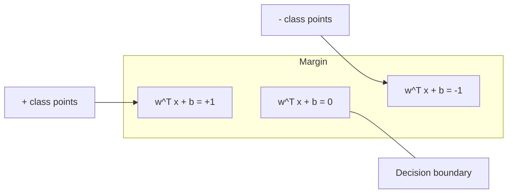
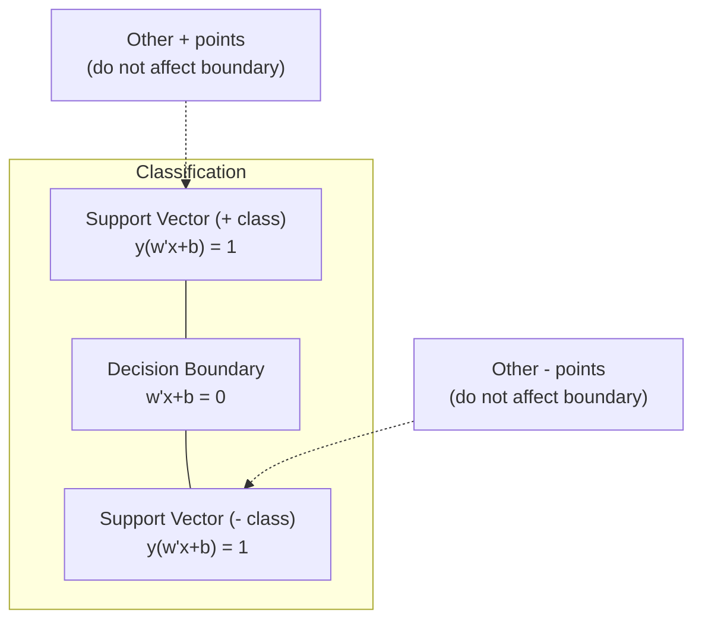
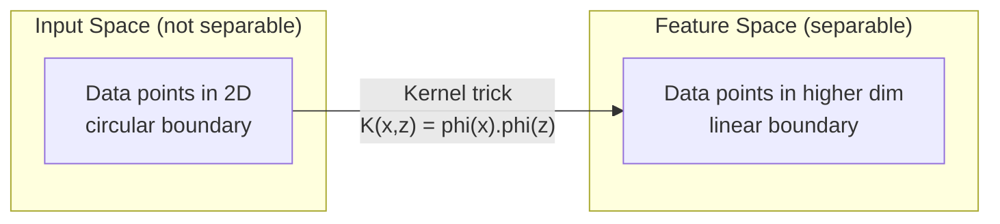

# 서포트 벡터 머신

> 두 class 사이에서 가장 넓은 길을 찾으세요. 이것이 전체 아이디어입니다.

**Type:** Build
**Languages:** Python
**Prerequisites:** Phase 1 (Lessons 08 Optimization, 14 Norms and Distances, 18 Convex Optimization)
**Time:** ~90 minutes

## 학습 목표

- primal formulation에서 hinge loss와 gradient descent를 사용해 linear SVM을 처음부터 구현합니다
- maximum margin principle을 설명하고 학습된 model에서 support vector를 식별합니다
- linear, polynomial, RBF kernel을 비교하고 kernel trick이 explicit high-dimensional mapping을 어떻게 피하는지 설명합니다
- margin width와 classification error 사이의 tradeoff를 조절하는 C parameter를 평가합니다

## 문제

두 class의 data point가 있고, 이를 분리하는 line(또는 hyperplane)을 그려야 합니다. 무한히 많은 line이 작동할 수 있습니다. 어느 것을 골라야 할까요?

margin이 가장 큰 것을 고릅니다. margin은 decision boundary와 각 side에서 가장 가까운 data point 사이의 거리입니다. margin이 넓을수록 classifier는 더 confident하고 unseen data에 더 잘 일반화합니다.

이 직관이 ML에서 가장 수학적으로 우아한 algorithm 중 하나인 Support Vector Machine으로 이어집니다. SVM은 deep learning 이전에 지배적인 classification method였고, small dataset, high-dimensional data, 이론적 보장이 있는 원칙적이고 잘 이해된 model이 필요한 문제에서는 여전히 최고의 선택입니다.

SVM은 Phase 1과 직접 연결됩니다. optimization은 convex이고(Lesson 18), margin은 norm으로 측정되며(Lesson 14), kernel trick은 dot product를 활용해 high-dimensional space에서 직접 계산하지 않고 nonlinear boundary를 처리합니다.

## 개념

### 최대 margin classifier

label y_i가 {-1, +1}이고 feature vector가 x_i인 linearly separable data가 주어졌을 때, class를 분리하는 hyperplane w^T x + b = 0을 찾고 싶습니다.

point x_i에서 hyperplane까지의 거리는 다음과 같습니다:

```text
distance = |w^T x_i + b| / ||w||
```

correctly classified point의 경우 y_i * (w^T x_i + b) > 0입니다. margin은 hyperplane에서 양쪽의 가장 가까운 point까지 거리의 두 배입니다.



optimization problem:

```text
maximize    2 / ||w||     (the margin width)
subject to  y_i * (w^T x_i + b) >= 1  for all i
```

동등하게(||w||^2를 minimize하는 편이 더 최적화하기 쉽습니다):

```text
minimize    (1/2) ||w||^2
subject to  y_i * (w^T x_i + b) >= 1  for all i
```

이는 convex quadratic program입니다. unique global solution을 가집니다. margin boundary 위에 정확히 놓인 data point(y_i * (w^T x_i + b) = 1인 곳)가 support vector입니다. 이 point들만 decision boundary를 결정합니다. support vector가 아닌 point를 움직이거나 제거해도 boundary는 바뀌지 않습니다.

### Support vector: 결정적인 소수



대부분의 training point는 irrelevant합니다. support vector만 중요합니다. 그래서 SVM은 prediction time에 memory-efficient합니다. 전체 training set이 아니라 support vector만 저장하면 됩니다.

support vector의 수도 generalization error의 bound를 제공합니다. dataset size에 비해 support vector가 적을수록 generalization이 더 좋습니다.

### Soft margin: C parameter로 noise 처리

실제 데이터는 거의 완벽하게 separable하지 않습니다. 어떤 point는 boundary의 잘못된 쪽에 있거나 margin 안에 있을 수 있습니다. soft margin formulation은 slack variable을 도입해 violation을 허용합니다.

```text
minimize    (1/2) ||w||^2 + C * sum(xi_i)
subject to  y_i * (w^T x_i + b) >= 1 - xi_i
            xi_i >= 0  for all i
```

slack variable xi_i는 point i가 margin을 얼마나 위반하는지 측정합니다. C는 trade-off를 조절합니다:

| C value | Behavior |
|---------|----------|
| Large C | violation을 강하게 penalize합니다. narrow margin, 더 적은 misclassification. Overfit |
| Small C | 더 많은 violation을 허용합니다. wide margin, 더 많은 misclassification. Underfit |

C는 regularization strength의 역수입니다. Large C = less regularization. Small C = more regularization.

### Hinge loss: SVM loss function

soft margin SVM은 unconstrained optimization으로 다시 쓸 수 있습니다:

```text
minimize    (1/2) ||w||^2 + C * sum(max(0, 1 - y_i * (w^T x_i + b)))
```

항 max(0, 1 - y_i * f(x_i))가 hinge loss입니다. point가 correctly classified이고 margin 밖에 있으면 0입니다. point가 margin 안에 있거나 misclassified이면 linear입니다.

```text
Hinge loss for a single point:

loss
  |
  | \
  |  \
  |   \
  |    \
  |     \_______________
  |
  +-----|-----|-------->  y * f(x)
       0     1

Zero loss when y*f(x) >= 1 (correctly classified, outside margin).
Linear penalty when y*f(x) < 1.
```

logistic loss(logistic regression)와 비교해 보세요:

```text
Hinge:     max(0, 1 - y*f(x))          Hard cutoff at margin
Logistic:  log(1 + exp(-y*f(x)))        Smooth, never exactly zero
```

Hinge loss는 sparse solution을 만듭니다(support vector만 nonzero contribution을 가짐). Logistic loss는 모든 data point를 사용합니다. 그래서 SVM은 prediction time에 더 memory-efficient합니다.

### gradient descent로 linear SVM 학습

constrained QP를 풀지 않고도 hinge loss + L2 regularization에 대해 gradient descent를 사용해 linear SVM을 학습할 수 있습니다:

```text
L(w, b) = (lambda/2) * ||w||^2 + (1/n) * sum(max(0, 1 - y_i * (w^T x_i + b)))

Gradient with respect to w:
  If y_i * (w^T x_i + b) >= 1:  dL/dw = lambda * w
  If y_i * (w^T x_i + b) < 1:   dL/dw = lambda * w - y_i * x_i

Gradient with respect to b:
  If y_i * (w^T x_i + b) >= 1:  dL/db = 0
  If y_i * (w^T x_i + b) < 1:   dL/db = -y_i
```

이를 primal formulation이라고 합니다. epoch당 O(n * d)로 실행됩니다. 여기서 n은 sample 수, d는 feature 수입니다. large, sparse, high-dimensional data(text classification)에서는 빠릅니다.

### dual formulation과 kernel trick

SVM problem의 Lagrangian dual(Phase 1 Lesson 18, KKT conditions)은 다음과 같습니다:

```text
maximize    sum(alpha_i) - (1/2) * sum_ij(alpha_i * alpha_j * y_i * y_j * (x_i . x_j))
subject to  0 <= alpha_i <= C
            sum(alpha_i * y_i) = 0
```

dual에는 data point 사이의 dot product x_i . x_j만 등장합니다. 이것이 핵심 통찰입니다. 모든 dot product를 kernel function K(x_i, x_j)로 바꾸면, SVM은 transformation을 명시적으로 계산하지 않고도 nonlinear boundary를 학습할 수 있습니다.

```text
Linear kernel:      K(x, z) = x . z
Polynomial kernel:  K(x, z) = (x . z + c)^d
RBF (Gaussian):     K(x, z) = exp(-gamma * ||x - z||^2)
```

RBF kernel은 data를 infinite-dimensional space로 mapping합니다. input space에서 가까운 point는 kernel value가 1에 가깝습니다. 멀리 떨어진 point는 kernel value가 0에 가깝습니다. 어떤 smooth decision boundary도 학습할 수 있습니다.



kernel trick은 high-dimensional space에 실제로 가지 않고 그 공간에서의 dot product를 계산합니다. D dimensions에서 degree d인 polynomial kernel의 explicit feature space는 O(D^d) dimensions입니다. 하지만 K(x, z)는 O(D) time에 계산됩니다.

### regression용 SVM (SVR)

Support Vector Regression은 data 주변에 width epsilon의 tube를 fit합니다. tube 안의 point는 loss가 0입니다. tube 밖의 point는 linear로 penalize됩니다.

```text
minimize    (1/2) ||w||^2 + C * sum(xi_i + xi_i*)
subject to  y_i - (w^T x_i + b) <= epsilon + xi_i
            (w^T x_i + b) - y_i <= epsilon + xi_i*
            xi_i, xi_i* >= 0
```

epsilon parameter는 tube width를 조절합니다. Wider tube = fewer support vectors = smoother fit. Narrower tube = more support vectors = tighter fit.

### SVM이 deep learning에 밀린 이유와 여전히 이기는 경우

SVM은 1990년대 후반부터 2010년대 초반까지 ML을 지배했습니다. Deep learning은 여러 이유로 이를 넘어섰습니다:

| Factor | SVMs | Deep learning |
|--------|------|---------------|
| Feature engineering | Requires it | Learns features |
| Scalability | kernel은 O(n^2) to O(n^3) | SGD로 epoch당 O(n) |
| Image/text/audio | handcrafted feature 필요 | raw data에서 학습 |
| 큰 dataset (>100k) | Slow | Scales well |
| GPU acceleration | Limited benefit | Massive speedup |

SVM은 여전히 다음 상황에서 이깁니다:
- Small dataset(수백에서 수천 개 sample)
- High-dimensional sparse data(TF-IDF feature가 있는 text)
- 수학적 보장(margin bound)이 필요할 때
- training time이 최소여야 할 때(linear SVM은 매우 빠름)
- 명확한 margin structure가 있는 binary classification
- anomaly detection(one-class SVM)

```figure
svm-margin
```

## 직접 만들기

### Step 1: Hinge loss와 gradient

기초입니다. batch의 hinge loss와 gradient를 계산합니다.

```python
def hinge_loss(X, y, w, b):
    n = len(X)
    total_loss = 0.0
    for i in range(n):
        margin = y[i] * (dot(w, X[i]) + b)
        total_loss += max(0.0, 1.0 - margin)
    return total_loss / n
```

### Step 2: gradient descent를 통한 Linear SVM

regularized hinge loss를 minimize해 학습합니다. QP solver가 필요 없습니다.

```python
class LinearSVM:
    def __init__(self, lr=0.001, lambda_param=0.01, n_epochs=1000):
        self.lr = lr
        self.lambda_param = lambda_param
        self.n_epochs = n_epochs
        self.w = None
        self.b = 0.0

    def fit(self, X, y):
        n_features = len(X[0])
        self.w = [0.0] * n_features
        self.b = 0.0

        for epoch in range(self.n_epochs):
            for i in range(len(X)):
                margin = y[i] * (dot(self.w, X[i]) + self.b)
                if margin >= 1:
                    self.w = [wj - self.lr * self.lambda_param * wj
                              for wj in self.w]
                else:
                    self.w = [wj - self.lr * (self.lambda_param * wj - y[i] * X[i][j])
                              for j, wj in enumerate(self.w)]
                    self.b -= self.lr * (-y[i])

    def predict(self, X):
        return [1 if dot(self.w, x) + self.b >= 0 else -1 for x in X]
```

### Step 3: kernel function

linear, polynomial, RBF kernel을 구현합니다.

```python
def linear_kernel(x, z):
    return dot(x, z)

def polynomial_kernel(x, z, degree=3, c=1.0):
    return (dot(x, z) + c) ** degree

def rbf_kernel(x, z, gamma=0.5):
    diff = [xi - zi for xi, zi in zip(x, z)]
    return math.exp(-gamma * dot(diff, diff))
```

### Step 4: margin과 support vector 식별

학습 후 어떤 point가 support vector인지 식별하고 margin width를 계산합니다.

```python
def find_support_vectors(X, y, w, b, tol=1e-3):
    support_vectors = []
    for i in range(len(X)):
        margin = y[i] * (dot(w, X[i]) + b)
        if abs(margin - 1.0) < tol:
            support_vectors.append(i)
    return support_vectors
```

모든 demo를 포함한 전체 구현은 `code/svm.py`를 참고하세요.

## 사용하기

scikit-learn으로는 다음과 같습니다:

```python
from sklearn.svm import SVC, LinearSVC, SVR
from sklearn.preprocessing import StandardScaler
from sklearn.pipeline import Pipeline

clf = Pipeline([
    ("scaler", StandardScaler()),
    ("svm", SVC(kernel="rbf", C=1.0, gamma="scale")),
])
clf.fit(X_train, y_train)
print(f"Accuracy: {clf.score(X_test, y_test):.4f}")
print(f"Support vectors: {clf['svm'].n_support_}")
```

중요: SVM을 학습하기 전에 항상 feature를 scale하세요. SVM은 feature magnitude에 민감합니다. margin이 ||w||에 의존하고, unscaled feature는 geometry를 왜곡하기 때문입니다.

large dataset에서는 `SVC`(dual formulation, O(n^2) to O(n^3)) 대신 `LinearSVC`(primal formulation, epoch당 O(n))를 사용하세요:

```python
from sklearn.svm import LinearSVC

clf = Pipeline([
    ("scaler", StandardScaler()),
    ("svm", LinearSVC(C=1.0, max_iter=10000)),
])
```

## 연습 문제

1. 2D linearly separable dataset을 생성하세요. LinearSVM을 학습하고 support vector를 식별하세요. support vector가 decision boundary에 가장 가까운 point인지 확인하세요.

2. noisy dataset에서 C를 0.001부터 1000까지 바꿔 보세요. 각 C value에 대해 decision boundary를 plot하세요. wide margin(underfitting)에서 narrow margin(overfitting)으로의 transition을 관찰하세요.

3. class boundary가 circular인 dataset(not linear)을 만드세요. linear SVM이 실패함을 보이세요. RBF kernel matrix를 계산하고 class가 kernel-induced feature space에서 separable해지는 것을 보이세요.

4. 같은 dataset에서 hinge loss와 logistic loss를 비교하세요. linear SVM과 logistic regression을 학습하세요. 각 model의 decision boundary에 기여하는 training point 수를 세세요(support vector vs all points).

5. SVR(epsilon-insensitive loss)을 구현하세요. y = sin(x) + noise에 fit하세요. prediction 주변의 epsilon tube를 plot하고 support vector(tube 밖 point)를 강조하세요.

## 핵심 용어

| 용어 | 실제 의미 |
|------|-----------|
| Support vectors | decision boundary에 가장 가까운 training point. hyperplane을 결정하는 유일한 point |
| Margin | decision boundary와 가장 가까운 support vector 사이의 거리. SVM은 이를 maximize함 |
| Hinge loss | max(0, 1 - y*f(x)). correctly classified이고 margin 밖이면 0. 그 외에는 linear penalty |
| C parameter | margin width와 classification error 사이의 trade-off. Large C = narrow margin, small C = wide margin |
| Soft margin | slack variable로 margin violation을 허용하는 SVM formulation. non-separable data를 처리함 |
| Kernel trick | high-dimensional feature space로 explicit mapping하지 않고 그 공간의 dot product를 계산하는 것 |
| Linear kernel | K(x, z) = x . z. standard dot product와 동일. linearly separable data용 |
| RBF kernel | K(x, z) = exp(-gamma * \|\|x-z\|\|^2). infinite dimension으로 mapping. smooth boundary를 학습 |
| Polynomial kernel | K(x, z) = (x . z + c)^d. polynomial combination의 feature space로 mapping |
| Dual formulation | data point 사이의 dot product에만 의존하도록 SVM problem을 재구성한 것. kernel을 가능하게 함 |
| SVR | Support Vector Regression. data 주변에 epsilon-tube를 fit함. tube 안의 point는 zero loss |
| Slack variables | xi_i: point가 margin을 얼마나 위반하는지 측정. margin 밖에서 correctly classified된 point는 0 |
| Maximum margin | 각 class의 가장 가까운 point까지의 거리를 최대화하는 hyperplane을 고르는 원칙 |

## 더 읽을거리

- [Vapnik: The Nature of Statistical Learning Theory (1995)](https://link.springer.com/book/10.1007/978-1-4757-3264-1) - SVM과 statistical learning의 foundational text
- [Cortes & Vapnik: Support-vector networks (1995)](https://link.springer.com/article/10.1007/BF00994018) - 원래 SVM 논문
- [Platt: Sequential Minimal Optimization (1998)](https://www.microsoft.com/en-us/research/publication/sequential-minimal-optimization-a-fast-algorithm-for-training-support-vector-machines/) - SVM training을 실용적으로 만든 SMO algorithm
- [scikit-learn SVM documentation](https://scikit-learn.org/stable/modules/svm.html) - implementation detail이 포함된 practical guide
- [LIBSVM: A Library for Support Vector Machines](https://www.csie.ntu.edu.tw/~cjlin/libsvm/) - 대부분의 SVM implementation 뒤에 있는 C++ library
