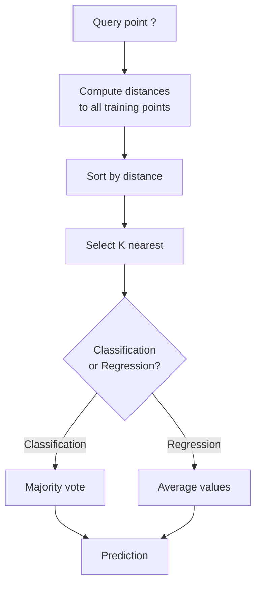
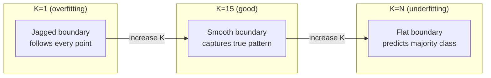
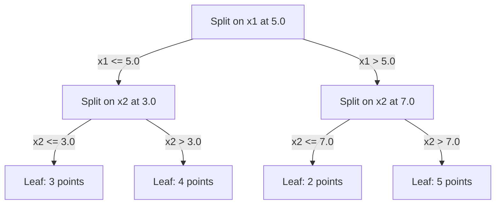

# K-최근접 이웃과 거리

> 모든 것을 저장하세요. 이웃을 살펴 예측하세요. 실제로 작동하는 가장 단순한 알고리즘입니다.

**Type:** Build
**Languages:** Python
**Prerequisites:** Phase 1 (Lesson 14 Norms and Distances)
**Time:** ~90 minutes

## 학습 목표

- 구성 가능한 K와 거리 가중 투표를 사용해 KNN 분류와 회귀를 처음부터 구현합니다.
- L1, L2, 코사인, 민코프스키 거리 측도를 비교하고 주어진 데이터 타입에 맞는 측도를 선택합니다.
- 차원의 저주를 설명하고 KNN이 고차원 공간에서 성능이 떨어지는 이유를 시연합니다.
- 효율적인 최근접 이웃 탐색을 위한 KD-트리를 만들고, 언제 브루트 포스보다 뛰어난지 분석합니다.

## 문제

데이터셋이 있습니다. 새로운 데이터 포인트가 도착했습니다. 이를 분류하거나 값을 예측해야 합니다. 데이터에서 파라미터를 학습하는 대신(선형 회귀나 SVM처럼), 새 포인트와 가장 가까운 K개의 훈련 포인트를 찾아 그들이 투표하게 합니다.

이것이 K-최근접 이웃입니다. 훈련 단계가 없습니다. 학습할 파라미터도 없습니다. 최소화할 손실 함수도 없습니다. 전체 훈련 세트를 저장하고 예측 시점에 거리를 계산합니다.

작동하기에는 너무 단순해 보입니다. 하지만 KNN은 특히 작거나 중간 규모의 데이터셋에서 놀라울 정도로 경쟁력이 있으며, 이를 깊이 이해하면 거리 측도 선택(Phase 1 Lesson 14와 연결), 차원의 저주, 지연 학습과 즉시 학습의 차이라는 기본 개념이 드러납니다.

KNN은 현대 AI 곳곳에도 다른 이름으로 등장합니다. 벡터 데이터베이스는 임베딩 위에서 KNN 검색을 수행합니다. 검색 증강 생성(RAG)은 K개의 가장 가까운 문서 청크를 찾습니다. 추천 시스템은 비슷한 사용자나 아이템을 찾습니다. 알고리즘은 같습니다. 규모와 자료구조가 다를 뿐입니다.

## 개념

### KNN 작동 방식

라벨이 붙은 포인트 데이터셋과 새로운 쿼리 포인트가 주어지면:

1. 쿼리에서 데이터셋의 모든 포인트까지의 거리를 계산합니다.
2. 거리순으로 정렬합니다.
3. 가장 가까운 K개 포인트를 가져옵니다.
4. 분류의 경우: K개 이웃 사이에서 다수결 투표를 합니다.
5. 회귀의 경우: K개 이웃 값의 평균(또는 가중 평균)을 냅니다.



이것이 전체 알고리즘입니다. 피팅도 없습니다. 경사 하강법도 없습니다. 에폭도 없습니다.

### K 선택하기

K는 유일한 하이퍼파라미터입니다. K는 편향-분산 트레이드오프를 제어합니다.

| K | 동작 |
|---|----------|
| K = 1 | 결정 경계가 모든 포인트를 따라갑니다. 훈련 오류가 0입니다. 분산이 높습니다. 과적합합니다 |
| 작은 K (3-5) | 국소 구조에 민감합니다. 복잡한 경계를 포착할 수 있습니다 |
| 큰 K | 경계가 더 매끄럽습니다. 노이즈에 더 강합니다. 과소적합할 수 있습니다 |
| K = N | 모든 포인트에 대해 다수 클래스를 예측합니다. 편향이 최대입니다 |

흔한 시작점은 N개 포인트가 있는 데이터셋에서 K = sqrt(N)입니다. 이진 분류에서는 동률을 피하기 위해 홀수 K를 사용합니다.



### 거리 측도

거리 함수는 무엇이 "가깝다"는 뜻인지 정의합니다. 서로 다른 측도는 서로 다른 이웃과 서로 다른 예측을 만듭니다.

**L2 (Euclidean)** 는 기본값입니다. 직선거리입니다.

```text
d(a, b) = sqrt(sum((a_i - b_i)^2))
```

특징 스케일에 민감합니다. KNN에서 L2를 사용하기 전에 항상 특징을 표준화하세요.

**L1 (Manhattan)** 은 절댓값 차이를 합산합니다. 차이를 제곱하지 않으므로 L2보다 이상치에 더 강합니다.

```text
d(a, b) = sum(|a_i - b_i|)
```

**Cosine distance** 는 벡터 사이의 각도를 측정하고 크기는 무시합니다. 텍스트와 임베딩 데이터에 필수적입니다.

```text
d(a, b) = 1 - (a . b) / (||a|| * ||b||)
```

**Minkowski** 는 파라미터 p로 L1과 L2를 일반화합니다.

```text
d(a, b) = (sum(|a_i - b_i|^p))^(1/p)

p=1: Manhattan
p=2: Euclidean
p->inf: Chebyshev (max absolute difference)
```

어떤 측도를 사용할지는 데이터에 따라 달라집니다.

| 데이터 타입 | 가장 적합한 측도 | 이유 |
|-----------|------------|-----|
| 비슷한 스케일의 수치 특징 | L2 (Euclidean) | 기본값이며 공간 데이터에 잘 작동합니다 |
| 이상치가 있는 수치 특징 | L1 (Manhattan) | 강건하며 큰 차이를 증폭하지 않습니다 |
| 텍스트 임베딩 | Cosine | 크기는 노이즈이고 방향이 의미입니다 |
| 고차원 희소 데이터 | Cosine 또는 L1 | L2는 차원의 저주에 취약합니다 |
| 혼합 타입 | 사용자 정의 거리 | 특징 타입별 측도를 결합합니다 |

### 가중 KNN

표준 KNN은 K개 이웃 모두에 같은 가중치를 줍니다. 하지만 거리 0.1에 있는 이웃은 거리 5.0에 있는 이웃보다 더 중요해야 합니다.

**Distance-weighted KNN** 은 각 이웃에 거리의 역수로 가중치를 줍니다.

```text
weight_i = 1 / (distance_i + epsilon)

For classification: weighted vote
For regression:     weighted average = sum(w_i * y_i) / sum(w_i)
```

epsilon은 쿼리 포인트가 훈련 포인트와 정확히 일치할 때 0으로 나누는 일을 막습니다.

가중 KNN은 먼 이웃이 거의 기여하지 않으므로 K 선택에 덜 민감합니다.

### 차원의 저주

KNN 성능은 고차원에서 저하됩니다. 이는 막연한 걱정이 아닙니다. 수학적 사실입니다.

**문제 1: 거리가 수렴합니다.** 차원이 증가하면 최대 거리와 최소 거리의 비율이 1에 가까워집니다. 모든 포인트가 쿼리에서 거의 똑같이 "멀어집니다."

```text
In d dimensions, for random uniform points:

d=2:    max_dist / min_dist = varies widely
d=100:  max_dist / min_dist ~ 1.01
d=1000: max_dist / min_dist ~ 1.001

When all distances are nearly equal, "nearest" is meaningless.
```

**문제 2: 부피가 폭발합니다.** 데이터의 고정된 비율 안에서 K개 이웃을 포착하려면, 특징 공간의 훨씬 더 큰 비율을 덮도록 탐색 반지름을 늘려야 합니다. 고차원의 "이웃 영역"은 공간 대부분을 포함합니다.

**문제 3: 모서리가 지배합니다.** d차원 단위 초입방체에서 부피 대부분은 중심이 아니라 모서리 근처에 집중됩니다. 큐브에 내접한 구는 d가 커질수록 사라질 만큼 작은 부피 비율만 포함합니다.

실무적 결과: KNN은 대략 20-50개 특징까지 잘 작동합니다. 그 이상에서는 KNN을 적용하기 전에 차원 축소(PCA, UMAP, t-SNE)가 필요하거나, 데이터의 내재적 저차원성을 활용하는 트리 기반 탐색 구조를 사용해야 합니다.

### KD-트리: 빠른 최근접 이웃 탐색

브루트 포스 KNN은 쿼리에서 모든 훈련 포인트까지의 거리를 계산합니다. 쿼리 하나당 O(n * d)입니다. 큰 데이터셋에서는 너무 느립니다.

KD-트리는 특징 축을 따라 공간을 재귀적으로 분할합니다. 각 레벨에서 한 차원의 중앙값을 기준으로 나눕니다.



최근접 이웃을 찾으려면, 쿼리를 포함하는 리프까지 트리를 순회한 다음, 더 가까운 포인트를 포함할 가능성이 있는 인접 분할만 백트래킹하며 확인합니다.

평균 쿼리 시간: 저차원에서는 O(log n)입니다. 하지만 고차원(d > 20)에서는 백트래킹이 점점 더 적은 가지를 제거하므로 KD-트리는 O(n)으로 저하됩니다.

### 볼 트리: 중간 차원에 더 적합

볼 트리는 축에 정렬된 박스 대신 중첩 초구로 데이터를 분할합니다. 각 노드는 해당 서브트리의 모든 포인트를 포함하는 볼(중심 + 반지름)을 정의합니다.

KD-트리 대비 장점:
- 중간 차원(최대 ~50)에서 더 잘 작동합니다.
- 축에 정렬되지 않은 구조를 처리합니다.
- 더 타이트한 경계 부피 덕분에 탐색 중 더 많은 가지가 가지치기됩니다.

KD-트리와 볼 트리는 모두 정확한 알고리즘입니다. 정말 큰 규모의 탐색(수백만 개 포인트, 수백 차원)에는 대신 근사 최근접 이웃 방법(HNSW, IVF, product quantization)을 사용합니다. 이는 Phase 1 Lesson 14에서 다룹니다.

### 지연 학습과 즉시 학습

KNN은 지연 학습자입니다. 훈련 시점에는 아무 작업도 하지 않고 예측 시점에 모든 작업을 합니다. 대부분의 다른 알고리즘(선형 회귀, SVM, 신경망)은 즉시 학습자입니다. 훈련 시점에 무거운 계산을 수행해 압축된 모델을 만들고, 이후 예측은 빠릅니다.

| 측면 | 지연 (KNN) | 즉시 (SVM, neural net) |
|--------|------------|------------------------|
| 훈련 시간 | O(1), 데이터를 저장만 함 | O(n * epochs) |
| 예측 시간 | 쿼리당 O(n * d) | O(d) 또는 O(parameters) |
| 예측 시 메모리 | 전체 훈련 세트를 저장 | 모델 파라미터만 저장 |
| 새 데이터 적응 | 포인트를 즉시 추가 | 모델을 재훈련 |
| 결정 경계 | 암묵적이며 즉석에서 계산됨 | 명시적이며 훈련 후 고정됨 |

지연 학습은 다음 상황에 이상적입니다.
- 데이터셋이 자주 바뀝니다(재훈련 없이 포인트 추가/삭제).
- 매우 적은 수의 쿼리에 대해서만 예측이 필요합니다.
- 훈련 시간이 0이기를 원합니다.
- 데이터셋이 충분히 작아 브루트 포스 탐색이 빠릅니다.

### 회귀를 위한 KNN

KNN 회귀는 다수결 투표 대신 K개 이웃의 타깃값을 평균냅니다.

```text
prediction = (1/K) * sum(y_i for i in K nearest neighbors)

Or with distance weighting:
prediction = sum(w_i * y_i) / sum(w_i)
where w_i = 1 / distance_i
```

KNN 회귀는 구간별 상수(또는 가중치를 쓰면 구간별 매끄러운) 예측을 만듭니다. 훈련 데이터 범위 밖으로 외삽할 수 없습니다. 훈련 타깃이 모두 0과 100 사이에 있다면 KNN은 절대 200을 예측하지 않습니다.

```figure
knn-smoothness
```

## 직접 만들기

### Step 1: 거리 함수

L1, L2, 코사인, 민코프스키 거리를 구현합니다. 이는 Phase 1 Lesson 14와 직접 연결됩니다.

```python
import math

def l2_distance(a, b):
    return math.sqrt(sum((ai - bi) ** 2 for ai, bi in zip(a, b)))

def l1_distance(a, b):
    return sum(abs(ai - bi) for ai, bi in zip(a, b))

def cosine_distance(a, b):
    dot_val = sum(ai * bi for ai, bi in zip(a, b))
    norm_a = math.sqrt(sum(ai ** 2 for ai in a))
    norm_b = math.sqrt(sum(bi ** 2 for bi in b))
    if norm_a == 0 or norm_b == 0:
        return 1.0
    return 1.0 - dot_val / (norm_a * norm_b)

def minkowski_distance(a, b, p=2):
    if p == float('inf'):
        return max(abs(ai - bi) for ai, bi in zip(a, b))
    return sum(abs(ai - bi) ** p for ai, bi in zip(a, b)) ** (1 / p)
```

### Step 2: KNN 분류기와 회귀기

구성 가능한 K, 거리 측도, 선택적 거리 가중치를 갖춘 전체 KNN을 만듭니다.

```python
class KNN:
    def __init__(self, k=5, distance_fn=l2_distance, weighted=False,
                 task="classification"):
        self.k = k
        self.distance_fn = distance_fn
        self.weighted = weighted
        self.task = task
        self.X_train = None
        self.y_train = None

    def fit(self, X, y):
        self.X_train = X
        self.y_train = y

    def predict(self, X):
        return [self._predict_one(x) for x in X]
```

### Step 3: 효율적인 탐색을 위한 KD-트리

각 차원의 중앙값을 기준으로 재귀적으로 분할하는 KD-트리를 처음부터 만듭니다.

```python
class KDTree:
    def __init__(self, X, indices=None, depth=0):
        # Recursively partition the data
        self.axis = depth % len(X[0])
        # Split on median of the current axis
        ...

    def query(self, point, k=1):
        # Traverse to leaf, then backtrack
        ...
```

모든 헬퍼 메서드와 데모가 포함된 전체 구현은 `code/knn.py`를 보세요.

### Step 4: 특징 스케일링

KNN은 거리가 특징 크기에 민감하므로 특징 스케일링이 필요합니다. 0에서 1000 범위의 특징은 0에서 1 범위의 특징보다 거리를 지배합니다.

```python
def standardize(X):
    n = len(X)
    d = len(X[0])
    means = [sum(X[i][j] for i in range(n)) / n for j in range(d)]
    stds = [
        max(1e-10, (sum((X[i][j] - means[j]) ** 2 for i in range(n)) / n) ** 0.5)
        for j in range(d)
    ]
    return [[((X[i][j] - means[j]) / stds[j]) for j in range(d)] for i in range(n)], means, stds
```

## 사용하기

scikit-learn을 사용하면:

```python
from sklearn.neighbors import KNeighborsClassifier
from sklearn.preprocessing import StandardScaler
from sklearn.pipeline import Pipeline

clf = Pipeline([
    ("scaler", StandardScaler()),
    ("knn", KNeighborsClassifier(n_neighbors=5, metric="euclidean")),
])
clf.fit(X_train, y_train)
print(f"Accuracy: {clf.score(X_test, y_test):.4f}")
```

scikit-learn은 데이터셋이 충분히 크고 차원이 충분히 낮으면 KD-트리나 볼 트리를 자동으로 사용합니다. 고차원 데이터에서는 브루트 포스로 되돌아갑니다. `algorithm` 파라미터로 이를 제어할 수 있습니다.

대규모 최근접 이웃 탐색(수백만 개 벡터)에는 FAISS, Annoy 또는 벡터 데이터베이스를 사용합니다.

```python
import faiss

index = faiss.IndexFlatL2(dimension)
index.add(embeddings)
distances, indices = index.search(query_vectors, k=5)
```

## 연습문제

1. 3개 클래스를 가진 2D 데이터셋에서 KNN 분류를 구현하세요. K=1, K=5, K=15, K=N에 대한 결정 경계를 그리세요. 과적합에서 과소적합으로 넘어가는 변화를 관찰하세요.

2. 2, 5, 10, 50, 100, 500차원에서 무작위 포인트 1000개를 생성하세요. 각 차원마다 최대 쌍별 거리와 최소 쌍별 거리의 비율을 계산하세요. 차원의 저주를 시각화하기 위해 차원 대비 비율을 그리세요.

3. 텍스트 분류 문제에서 KNN에 대해 L1, L2, 코사인 거리를 비교하세요(TF-IDF 벡터 사용). 어떤 측도가 가장 높은 정확도를 내나요? 텍스트에서 코사인이 이기는 경향이 있는 이유는 무엇인가요?

4. KD-트리를 구현하고 2D, 10D, 50D에서 1k, 10k, 100k 포인트 데이터셋에 대해 브루트 포스와 쿼리 시간을 비교하세요. 어느 차원에서 KD-트리가 브루트 포스보다 더 빠르지 않게 되나요?

5. y = sin(x) + noise에 대한 가중 KNN 회귀기를 만드세요. K=3, 10, 30에서 비가중 KNN과 비교하세요. 특히 큰 K에서 가중치가 더 매끄러운 예측을 만든다는 점을 보이세요.

## 핵심 용어

| 용어 | 실제 의미 |
|------|----------------------|
| K-nearest neighbors | 쿼리와 가장 가까운 K개 훈련 포인트를 찾아 예측하는 비모수 알고리즘 |
| Lazy learning | 훈련 시점에는 계산하지 않습니다. 모든 작업은 예측 시점에 일어납니다. KNN이 대표적인 예입니다 |
| Eager learning | 훈련 시점에 무거운 계산을 수행해 압축된 모델을 만듭니다. 대부분의 ML 알고리즘은 즉시 학습입니다 |
| Curse of dimensionality | 고차원에서는 거리가 수렴하고 이웃 영역이 공간 대부분을 덮도록 확장되어 KNN이 비효과적이 되는 현상 |
| KD-tree | 특징 축을 따라 공간을 재귀적으로 분할하는 이진 트리입니다. 저차원에서 O(log n) 쿼리를 제공합니다 |
| Ball tree | 중첩 초구의 트리입니다. 중간 차원(최대 ~50)에서 KD-트리보다 더 잘 작동합니다 |
| Weighted KNN | 이웃에 거리의 역수로 가중치를 줍니다. 더 가까운 이웃이 예측에 더 큰 영향을 미칩니다 |
| Feature scaling | 특징을 비교 가능한 범위로 정규화합니다. KNN 같은 거리 기반 방법에 필요합니다 |
| Majority vote | K개 이웃 중 가장 흔한 클래스를 세어 분류합니다 |
| Brute force search | 모든 훈련 포인트까지 거리를 계산합니다. 쿼리당 O(n*d)입니다. 정확하지만 n이 크면 느립니다 |
| Approximate nearest neighbor | 정확한 탐색보다 훨씬 빠르게 근사 최근접 포인트를 찾는 알고리즘(HNSW, LSH, IVF) |
| Voronoi diagram | 각 영역이 다른 어떤 훈련 포인트보다 하나의 훈련 포인트에 더 가까운 모든 공간을 포함하도록 나눈 분할입니다. K=1 KNN은 보로노이 경계를 만듭니다 |

## 더 읽을거리

- [Cover & Hart: Nearest Neighbor Pattern Classification (1967)](https://ieeexplore.ieee.org/document/1053964) - KNN의 기초 논문으로, 오류율이 베이즈 최적의 최대 두 배임을 증명합니다.
- [Friedman, Bentley, Finkel: An Algorithm for Finding Best Matches in Logarithmic Expected Time (1977)](https://dl.acm.org/doi/10.1145/355744.355745) - 최초의 KD-트리 논문입니다.
- [Beyer et al.: When Is "Nearest Neighbor" Meaningful? (1999)](https://link.springer.com/chapter/10.1007/3-540-49257-7_15) - 최근접 이웃에 대한 차원의 저주를 형식적으로 분석합니다.
- [scikit-learn Nearest Neighbors documentation](https://scikit-learn.org/stable/modules/neighbors.html) - 알고리즘 선택을 포함한 실무 가이드입니다.
- [FAISS: A Library for Efficient Similarity Search](https://github.com/facebookresearch/faiss) - Meta의 십억 규모 근사 최근접 이웃 탐색 라이브러리입니다.
