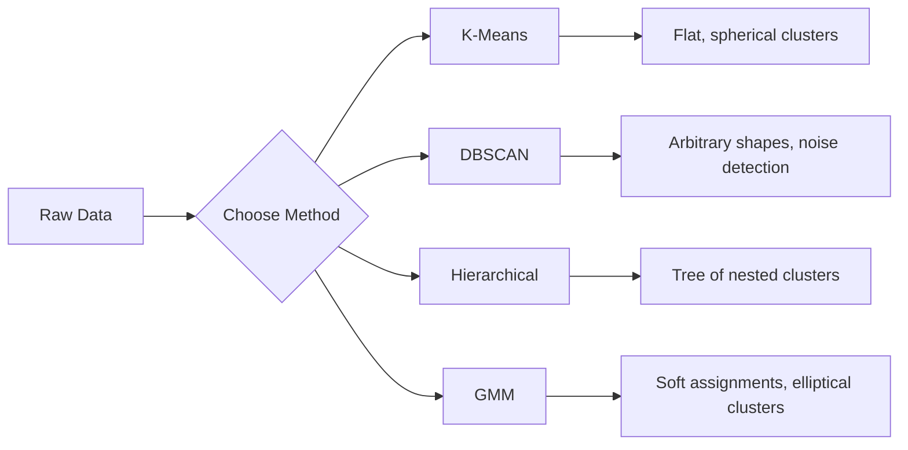

# 비지도 학습

> 레이블도, 교사도 없습니다. 알고리즘이 스스로 구조를 찾아냅니다.

**Type:** Build
**Languages:** Python
**Prerequisites:** Phase 1 (Norms & Distances, Probability & Distributions), Phase 2 Lessons 1-6
**Time:** ~90 minutes

## 학습 목표

- K-Means, DBSCAN, Gaussian Mixture Models를 처음부터 구현하고 클러스터링 동작을 비교합니다
- silhouette score와 elbow method를 사용해 클러스터 품질을 평가하고 최적의 K를 선택합니다
- DBSCAN이 K-Means보다 나은 경우를 설명하고 비구형 클러스터와 이상치를 다루는 알고리즘을 식별합니다
- 클러스터링 방법으로 정상 패턴에서 벗어난 점을 표시하는 이상 탐지 파이프라인을 구축합니다

## 문제

지금까지의 모든 ML 수업은 레이블이 있는 데이터를 가정했습니다. "여기 입력이 있고, 여기 정답 출력이 있다"는 식입니다. 현실에서는 레이블이 비쌉니다. 병원에는 수백만 건의 환자 기록이 있지만, 누군가가 각각에 질병 범주를 수작업으로 태깅해 두지는 않았습니다. 전자상거래 사이트에는 수백만 개의 사용자 세션이 있지만, 누군가가 고객 세그먼트를 손으로 레이블링해 두지는 않았습니다. 보안 팀에는 네트워크 로그가 있지만, 모든 이상 현상을 표시한 사람은 없습니다.

비지도 학습은 무엇을 찾아야 하는지 알려 주지 않아도 패턴을 찾습니다. 비슷한 데이터 포인트를 묶고, 숨은 구조를 발견하며, 이상 현상을 드러냅니다. 지도 학습이 정답지가 있는 교과서로 공부하는 것이라면, 비지도 학습은 패턴이 스스로 드러날 때까지 원시 데이터를 바라보는 일입니다.

문제는 레이블이 없으면 "맞음" 또는 "틀림"을 직접 측정할 수 없다는 점입니다. 알고리즘이 찾은 구조가 의미 있는지 평가하려면 다른 도구가 필요합니다.

## 개념

### 클러스터링: 비슷한 것끼리 묶기

클러스터링은 각 데이터 포인트를 그룹(클러스터)에 배정해 같은 그룹 안의 점들이 다른 그룹의 점들보다 서로 더 비슷하게 만듭니다. 항상 따라오는 질문은 이것입니다. "비슷하다"는 무엇을 뜻할까요?



### K-Means: 기본 작업마

K-Means는 데이터를 정확히 K개의 클러스터로 나눕니다. 각 클러스터에는 centroid(질량 중심)가 있고, 모든 점은 가장 가까운 centroid에 속합니다.

Lloyd's algorithm:

1. 무작위 점 K개를 초기 centroid로 선택합니다
2. 각 데이터 포인트를 가장 가까운 centroid에 배정합니다
3. 배정된 점들의 평균으로 각 centroid를 다시 계산합니다
4. 배정이 더 이상 바뀌지 않을 때까지 2-3단계를 반복합니다

목적 함수(inertia)는 각 점에서 배정된 centroid까지의 제곱 거리 총합을 측정합니다. K-Means는 이를 최소화하지만, 지역 최솟값만 찾습니다. 초기화가 다르면 결과도 달라질 수 있습니다.

### K 선택하기

표준 방법은 두 가지입니다.

**Elbow method:** K = 1, 2, 3, ..., n에 대해 K-Means를 실행합니다. inertia vs K를 그립니다. 클러스터를 더 추가해도 inertia가 크게 줄지 않는 "elbow" 지점을 찾습니다.

**Silhouette score:** 각 점에 대해 자기 클러스터와의 유사도(a)와 가장 가까운 다른 클러스터와의 유사도(b)를 측정합니다. silhouette coefficient는 (b - a) / max(a, b)이며, -1(잘못된 클러스터)부터 +1(잘 군집됨)까지입니다. 전체 점에 대해 평균을 내 전역 점수를 얻습니다.

### DBSCAN: 밀도 기반 클러스터링

K-Means는 클러스터가 구형이라고 가정하고 K를 미리 선택해야 합니다. DBSCAN은 두 가정 모두 하지 않습니다. 희소한 영역으로 분리된 조밀한 영역을 클러스터로 찾습니다.

매개변수는 두 가지입니다.
- **eps**: 이웃의 반지름
- **min_samples**: 조밀한 영역을 형성하는 데 필요한 최소 점 개수

점의 유형은 세 가지입니다.
- **Core point**: eps 거리 안에 min_samples개 이상의 점이 있습니다
- **Border point**: core point의 eps 안에 있지만 자신은 core point가 아닙니다
- **Noise point**: core도 border도 아닙니다. 이상치입니다.

DBSCAN은 서로 eps 안에 있는 core point들을 같은 클러스터로 연결합니다. Border point는 가까운 core point의 클러스터에 합류합니다. Noise point는 어떤 클러스터에도 속하지 않습니다.

강점: 어떤 모양의 클러스터도 찾고, 클러스터 수를 자동으로 결정하며, 이상치를 식별합니다. 약점: 밀도가 서로 다른 클러스터에는 어려움을 겪습니다.

### 계층적 클러스터링

중첩된 클러스터의 트리(dendrogram)를 만듭니다.

Agglomerative(상향식):
1. 각 점을 자기 자신의 클러스터로 시작합니다
2. 가장 가까운 두 클러스터를 병합합니다
3. 클러스터가 하나만 남을 때까지 반복합니다
4. 원하는 수준에서 dendrogram을 잘라 K개의 클러스터를 얻습니다

클러스터 사이의 "가까움"은 다음처럼 측정할 수 있습니다.
- **Single linkage**: 두 클러스터에 속한 임의의 두 점 사이의 최소 거리
- **Complete linkage**: 임의의 두 점 사이의 최대 거리
- **Average linkage**: 모든 쌍 사이 거리의 평균
- **Ward's method**: 클러스터 내 총 분산 증가가 가장 작아지는 병합

### Gaussian Mixture Models (GMM)

K-Means는 hard assignment를 제공합니다. 각 점은 정확히 하나의 클러스터에 속합니다. GMM은 soft assignment를 제공합니다. 각 점은 각 클러스터에 속할 확률을 가집니다.

GMM은 데이터가 각각 고유한 평균과 공분산을 가진 K개의 Gaussian distribution 혼합에서 생성된다고 가정합니다. Expectation-Maximization (EM) 알고리즘은 다음을 번갈아 수행합니다.

- **E-step**: 각 점이 각 Gaussian에 속할 확률을 계산합니다
- **M-step**: 데이터의 likelihood를 최대화하도록 각 Gaussian의 평균, 공분산, 혼합 가중치를 업데이트합니다

GMM은 K-Means처럼 구형뿐 아니라 타원형 클러스터도 모델링할 수 있고, 겹치는 클러스터를 자연스럽게 다룹니다.

### 어떤 방법을 언제 사용할까

| 방법 | 가장 적합한 경우 | 피해야 할 경우 |
|--------|----------|------------|
| K-Means | 큰 데이터셋, 구형 클러스터, 알려진 K | 불규칙한 모양, 이상치가 있음 |
| DBSCAN | 알 수 없는 K, 임의의 모양, 이상치 탐지 | 서로 다른 밀도, 매우 높은 차원 |
| Hierarchical | 작은 데이터셋, dendrogram 필요, 알 수 없는 K | 큰 데이터셋 (O(n^2) memory) |
| GMM | 겹치는 클러스터, soft assignment 필요 | 매우 큰 데이터셋, 너무 많은 차원 |

### 클러스터링을 이용한 이상 탐지

클러스터링은 자연스럽게 이상 탐지를 지원합니다.
- **K-Means**: 어떤 centroid에서도 먼 점은 이상치입니다
- **DBSCAN**: noise point는 정의상 이상치입니다
- **GMM**: 모든 Gaussian에서 확률이 낮은 점은 이상치입니다

```figure
kmeans-step
```

## 직접 만들기

### Step 1: 처음부터 K-Means 구현하기

```python
import math
import random


def euclidean_distance(a, b):
    return math.sqrt(sum((ai - bi) ** 2 for ai, bi in zip(a, b)))


def kmeans(data, k, max_iterations=100, seed=42):
    random.seed(seed)
    n_features = len(data[0])

    centroids = random.sample(data, k)

    for iteration in range(max_iterations):
        clusters = [[] for _ in range(k)]
        assignments = []

        for point in data:
            distances = [euclidean_distance(point, c) for c in centroids]
            nearest = distances.index(min(distances))
            clusters[nearest].append(point)
            assignments.append(nearest)

        new_centroids = []
        for cluster in clusters:
            if len(cluster) == 0:
                new_centroids.append(random.choice(data))
                continue
            centroid = [
                sum(point[j] for point in cluster) / len(cluster)
                for j in range(n_features)
            ]
            new_centroids.append(centroid)

        if all(
            euclidean_distance(old, new) < 1e-6
            for old, new in zip(centroids, new_centroids)
        ):
            print(f"  Converged at iteration {iteration + 1}")
            break

        centroids = new_centroids

    return assignments, centroids
```

### Step 2: Elbow method와 silhouette score

```python
def compute_inertia(data, assignments, centroids):
    total = 0.0
    for point, cluster_id in zip(data, assignments):
        total += euclidean_distance(point, centroids[cluster_id]) ** 2
    return total


def silhouette_score(data, assignments):
    n = len(data)
    if n < 2:
        return 0.0

    clusters = {}
    for i, c in enumerate(assignments):
        clusters.setdefault(c, []).append(i)

    if len(clusters) < 2:
        return 0.0

    scores = []
    for i in range(n):
        own_cluster = assignments[i]
        own_members = [j for j in clusters[own_cluster] if j != i]

        if len(own_members) == 0:
            scores.append(0.0)
            continue

        a = sum(euclidean_distance(data[i], data[j]) for j in own_members) / len(own_members)

        b = float("inf")
        for cluster_id, members in clusters.items():
            if cluster_id == own_cluster:
                continue
            avg_dist = sum(euclidean_distance(data[i], data[j]) for j in members) / len(members)
            b = min(b, avg_dist)

        if max(a, b) == 0:
            scores.append(0.0)
        else:
            scores.append((b - a) / max(a, b))

    return sum(scores) / len(scores)


def find_best_k(data, max_k=10):
    print("Elbow method:")
    inertias = []
    for k in range(1, max_k + 1):
        assignments, centroids = kmeans(data, k)
        inertia = compute_inertia(data, assignments, centroids)
        inertias.append(inertia)
        print(f"  K={k}: inertia={inertia:.2f}")

    print("\nSilhouette scores:")
    for k in range(2, max_k + 1):
        assignments, centroids = kmeans(data, k)
        score = silhouette_score(data, assignments)
        print(f"  K={k}: silhouette={score:.4f}")

    return inertias
```

### Step 3: 처음부터 DBSCAN 구현하기

```python
def dbscan(data, eps, min_samples):
    n = len(data)
    labels = [-1] * n
    cluster_id = 0

    def region_query(point_idx):
        neighbors = []
        for i in range(n):
            if euclidean_distance(data[point_idx], data[i]) <= eps:
                neighbors.append(i)
        return neighbors

    visited = [False] * n

    for i in range(n):
        if visited[i]:
            continue
        visited[i] = True

        neighbors = region_query(i)

        if len(neighbors) < min_samples:
            labels[i] = -1
            continue

        labels[i] = cluster_id
        seed_set = list(neighbors)
        seed_set.remove(i)

        j = 0
        while j < len(seed_set):
            q = seed_set[j]

            if not visited[q]:
                visited[q] = True
                q_neighbors = region_query(q)
                if len(q_neighbors) >= min_samples:
                    for nb in q_neighbors:
                        if nb not in seed_set:
                            seed_set.append(nb)

            if labels[q] == -1:
                labels[q] = cluster_id

            j += 1

        cluster_id += 1

    return labels
```

### Step 4: Gaussian Mixture Model (EM algorithm)

```python
def gmm(data, k, max_iterations=100, seed=42):
    random.seed(seed)
    n = len(data)
    d = len(data[0])

    indices = random.sample(range(n), k)
    means = [list(data[i]) for i in indices]
    variances = [1.0] * k
    weights = [1.0 / k] * k

    def gaussian_pdf(x, mean, variance):
        d = len(x)
        coeff = 1.0 / ((2 * math.pi * variance) ** (d / 2))
        exponent = -sum((xi - mi) ** 2 for xi, mi in zip(x, mean)) / (2 * variance)
        return coeff * math.exp(max(exponent, -500))

    for iteration in range(max_iterations):
        responsibilities = []
        for i in range(n):
            probs = []
            for j in range(k):
                probs.append(weights[j] * gaussian_pdf(data[i], means[j], variances[j]))
            total = sum(probs)
            if total == 0:
                total = 1e-300
            responsibilities.append([p / total for p in probs])

        old_means = [list(m) for m in means]

        for j in range(k):
            r_sum = sum(responsibilities[i][j] for i in range(n))
            if r_sum < 1e-10:
                continue

            weights[j] = r_sum / n

            for dim in range(d):
                means[j][dim] = sum(
                    responsibilities[i][j] * data[i][dim] for i in range(n)
                ) / r_sum

            variances[j] = sum(
                responsibilities[i][j]
                * sum((data[i][dim] - means[j][dim]) ** 2 for dim in range(d))
                for i in range(n)
            ) / (r_sum * d)
            variances[j] = max(variances[j], 1e-6)

        shift = sum(
            euclidean_distance(old_means[j], means[j]) for j in range(k)
        )
        if shift < 1e-6:
            print(f"  GMM converged at iteration {iteration + 1}")
            break

    assignments = []
    for i in range(n):
        assignments.append(responsibilities[i].index(max(responsibilities[i])))

    return assignments, means, weights, responsibilities
```

### Step 5: 테스트 데이터를 생성하고 모두 실행하기

```python
def make_blobs(centers, n_per_cluster=50, spread=0.5, seed=42):
    random.seed(seed)
    data = []
    true_labels = []
    for label, (cx, cy) in enumerate(centers):
        for _ in range(n_per_cluster):
            x = cx + random.gauss(0, spread)
            y = cy + random.gauss(0, spread)
            data.append([x, y])
            true_labels.append(label)
    return data, true_labels


def make_moons(n_samples=200, noise=0.1, seed=42):
    random.seed(seed)
    data = []
    labels = []
    n_half = n_samples // 2
    for i in range(n_half):
        angle = math.pi * i / n_half
        x = math.cos(angle) + random.gauss(0, noise)
        y = math.sin(angle) + random.gauss(0, noise)
        data.append([x, y])
        labels.append(0)
    for i in range(n_half):
        angle = math.pi * i / n_half
        x = 1 - math.cos(angle) + random.gauss(0, noise)
        y = 1 - math.sin(angle) - 0.5 + random.gauss(0, noise)
        data.append([x, y])
        labels.append(1)
    return data, labels


if __name__ == "__main__":
    centers = [[2, 2], [8, 3], [5, 8]]
    data, true_labels = make_blobs(centers, n_per_cluster=50, spread=0.8)

    print("=== K-Means on 3 blobs ===")
    assignments, centroids = kmeans(data, k=3)
    print(f"  Centroids: {[[round(c, 2) for c in cent] for cent in centroids]}")
    sil = silhouette_score(data, assignments)
    print(f"  Silhouette score: {sil:.4f}")

    print("\n=== Elbow Method ===")
    find_best_k(data, max_k=6)

    print("\n=== DBSCAN on 3 blobs ===")
    db_labels = dbscan(data, eps=1.5, min_samples=5)
    n_clusters = len(set(db_labels) - {-1})
    n_noise = db_labels.count(-1)
    print(f"  Found {n_clusters} clusters, {n_noise} noise points")

    print("\n=== GMM on 3 blobs ===")
    gmm_assignments, gmm_means, gmm_weights, _ = gmm(data, k=3)
    print(f"  Means: {[[round(m, 2) for m in mean] for mean in gmm_means]}")
    print(f"  Weights: {[round(w, 3) for w in gmm_weights]}")
    gmm_sil = silhouette_score(data, gmm_assignments)
    print(f"  Silhouette score: {gmm_sil:.4f}")

    print("\n=== DBSCAN on moons (non-spherical clusters) ===")
    moon_data, moon_labels = make_moons(n_samples=200, noise=0.1)
    moon_db = dbscan(moon_data, eps=0.3, min_samples=5)
    n_moon_clusters = len(set(moon_db) - {-1})
    n_moon_noise = moon_db.count(-1)
    print(f"  Found {n_moon_clusters} clusters, {n_moon_noise} noise points")

    print("\n=== K-Means on moons (will fail to separate) ===")
    moon_km, moon_centroids = kmeans(moon_data, k=2)
    moon_sil = silhouette_score(moon_data, moon_km)
    print(f"  Silhouette score: {moon_sil:.4f}")
    print("  K-Means splits moons poorly because they are not spherical")

    print("\n=== Anomaly detection with DBSCAN ===")
    anomaly_data = list(data)
    anomaly_data.append([20.0, 20.0])
    anomaly_data.append([-5.0, -5.0])
    anomaly_data.append([15.0, 0.0])
    anomaly_labels = dbscan(anomaly_data, eps=1.5, min_samples=5)
    anomalies = [
        anomaly_data[i]
        for i in range(len(anomaly_labels))
        if anomaly_labels[i] == -1
    ]
    print(f"  Detected {len(anomalies)} anomalies")
    for a in anomalies[-3:]:
        print(f"    Point {[round(v, 2) for v in a]}")
```

## 사용하기

scikit-learn을 사용하면 같은 알고리즘을 한 줄로 실행할 수 있습니다.

```python
from sklearn.cluster import KMeans, DBSCAN, AgglomerativeClustering
from sklearn.mixture import GaussianMixture
from sklearn.metrics import silhouette_score as sklearn_silhouette

km = KMeans(n_clusters=3, random_state=42).fit(data)
db = DBSCAN(eps=1.5, min_samples=5).fit(data)
agg = AgglomerativeClustering(n_clusters=3).fit(data)
gmm_model = GaussianMixture(n_components=3, random_state=42).fit(data)
```

직접 구현한 버전은 이 라이브러리들이 정확히 무엇을 계산하는지 보여 줍니다. K-Means는 배정과 재계산을 반복합니다. DBSCAN은 조밀한 seed에서 클러스터를 확장합니다. GMM은 expectation과 maximization을 번갈아 수행합니다. 라이브러리 버전은 수치 안정성, 더 똑똑한 초기화(K-Means++), GPU 가속을 더하지만 핵심 로직은 같습니다.

## 결과물

이 수업은 K-Means, DBSCAN, GMM의 동작하는 직접 구현을 만듭니다. 클러스터링 코드는 더 고급 비지도 방법의 기반으로 재사용할 수 있습니다.

## 연습 문제

1. K-Means++ 초기화를 구현하세요. centroid를 무작위로 고르는 대신 첫 번째는 무작위로 고르고, 이후 centroid는 가장 가까운 기존 centroid와의 제곱 거리에 비례하는 확률로 선택합니다. 무작위 초기화와 수렴 속도를 비교하세요.
2. 코드에 hierarchical agglomerative clustering을 추가하세요. Ward's linkage를 구현하고 dendrogram(병합의 중첩 리스트)을 생성합니다. 서로 다른 수준에서 자르고 K-Means 결과와 비교하세요.
3. 간단한 이상 탐지 파이프라인을 만드세요. 같은 데이터에 DBSCAN과 GMM을 실행하고, 두 방법이 모두 이상치라고 동의하는 점(DBSCAN에서는 noise, GMM에서는 낮은 확률)을 표시합니다. 겹치는 정도를 측정하고 두 방법이 언제 불일치하는지 논의하세요.

## 핵심 용어

| 용어 | 사람들이 흔히 말하는 것 | 실제 의미 |
|------|----------------|----------------------|
| Clustering | "비슷한 것 묶기" | 특정 distance metric으로 측정했을 때 그룹 내 유사도가 그룹 간 유사도보다 크도록 데이터를 부분집합으로 나누는 것 |
| Centroid | "클러스터의 중심" | 클러스터에 배정된 모든 점의 평균이며, K-Means에서 클러스터 대표로 사용됨 |
| Inertia | "클러스터가 얼마나 조밀한가" | 각 점에서 배정된 centroid까지의 제곱 거리 합이며, 낮을수록 더 조밀함 |
| Silhouette score | "클러스터가 얼마나 잘 분리되었는가" | 각 점에 대해 (b - a) / max(a, b)이며, a는 평균 클러스터 내 거리이고 b는 가장 가까운 클러스터까지의 평균 거리 |
| Core point | "조밀한 영역의 점" | DBSCAN에서 eps 거리 안에 min_samples개 이상의 이웃을 가진 점 |
| EM algorithm | "Soft K-Means" | Expectation-Maximization: 소속 확률(E-step)을 반복 계산하고 분포 매개변수(M-step)를 업데이트하는 방법 |
| Dendrogram | "클러스터의 트리" | hierarchical clustering에서 클러스터가 병합된 순서와 거리를 보여 주는 트리 다이어그램 |
| Anomaly | "이상치" | 예상 패턴을 따르지 않는 데이터 포인트이며, DBSCAN에서는 noise로, GMM에서는 낮은 확률로 식별됨 |

## 더 읽을거리

- [Stanford CS229 - Unsupervised Learning](https://cs229.stanford.edu/notes2022fall/main_notes.pdf) - 클러스터링과 EM에 대한 Andrew Ng의 강의 노트
- [scikit-learn Clustering Guide](https://scikit-learn.org/stable/modules/clustering.html) - 모든 클러스터링 알고리즘을 시각 예제와 함께 실용적으로 비교한 가이드
- [DBSCAN original paper (Ester et al., 1996)](https://www.aaai.org/Papers/KDD/1996/KDD96-037.pdf) - 밀도 기반 클러스터링을 소개한 논문
