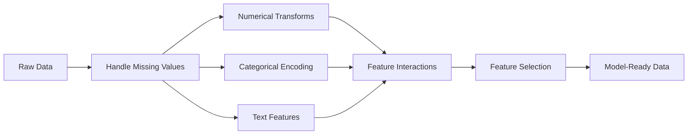

# 피처 엔지니어링과 피처 선택

> 좋은 feature 하나는 데이터 포인트 천 개의 가치가 있습니다.

**Type:** Build
**Languages:** Python
**Prerequisites:** Phase 1 (Statistics for ML, Linear Algebra), Phase 2 Lessons 1-7
**Time:** ~90 minutes

## 학습 목표

- numerical transform(standardization, min-max scaling, log transform, binning)을 구현하고 각각이 언제 적절한지 설명합니다
- categorical feature를 위한 one-hot, label, target encoding을 만들고 target encoding의 data leakage 위험을 식별합니다
- TF-IDF vectorizer를 처음부터 구성하고 text classification에서 raw word count보다 나은 이유를 설명합니다
- filter 기반 feature selection(variance threshold, correlation, mutual information)을 적용해 차원을 줄입니다

## 문제

데이터셋이 있습니다. 알고리즘을 고릅니다. 학습합니다. 결과는 그저 그렇습니다. 더 화려한 알고리즘을 시도합니다. 여전히 그저 그렇습니다. hyperparameter tuning에 일주일을 씁니다. 조금 나아질 뿐입니다.

그런데 누군가 raw data를 더 좋은 feature로 변환하자, 단순한 logistic regression이 tuning한 gradient-boosted ensemble을 이깁니다.

이런 일은 계속 일어납니다. classical ML에서는 알고리즘 선택보다 데이터 표현이 더 중요합니다. "square footage"와 "number of bedrooms"를 가진 주택 가격 모델은, 학습기가 아무리 정교하더라도 "address as a raw string"만 가진 모델을 이깁니다. 알고리즘은 우리가 건네준 것만 다룰 수 있습니다.

Feature engineering은 raw data를 모델이 패턴을 더 쉽게 찾을 수 있는 표현으로 변환하는 과정입니다. Feature selection은 signal을 더하지 않고 noise만 더하는 feature를 버리는 과정입니다. 둘을 합치면 classical ML에서 가장 leverage가 큰 작업이 됩니다.

## 개념

### Feature pipeline



### 수치형 feature

raw number가 곧바로 model-ready인 경우는 드뭅니다. 흔한 transform은 다음과 같습니다.

**Scaling:** distance 기반 알고리즘(K-Means, KNN, SVM)이 모든 feature를 동등하게 다루도록 feature를 같은 range에 둡니다. Min-max scaling은 [0, 1]로 매핑합니다. Standardization(z-score)은 mean=0, std=1로 매핑합니다.

**Log transform:** right-skewed distribution(income, population, word counts)을 압축합니다. multiplicative relationship을 additive relationship으로 바꿉니다.

**Binning:** continuous value를 category로 변환합니다. feature와 target의 관계가 non-linear이지만 step-wise일 때 유용합니다(예: age group).

**Polynomial features:** x^2, x^3, x1*x2 항을 만듭니다. feature 수가 늘어나는 대가로 linear model이 non-linear relationship을 포착할 수 있게 합니다.

### 범주형 feature

모델에는 숫자가 필요합니다. category에는 encoding이 필요합니다.

**One-hot encoding:** category마다 binary column을 만듭니다. "color = red/blue/green"은 is_red, is_blue, is_green 세 column이 됩니다. low-cardinality feature에는 잘 작동하지만 category가 많으면 폭발적으로 커집니다.

**Label encoding:** 각 category를 integer에 매핑합니다: red=0, blue=1, green=2. 잘못된 ordering을 도입합니다(모델이 green > blue > red라고 생각할 수 있습니다). 개별 값으로 split하는 tree-based model에만 적절합니다.

**Target encoding:** 각 category를 그 category의 target variable 평균으로 대체합니다. 강력하지만 위험합니다. data leakage 위험이 큽니다. 반드시 training data에서만 계산하고 test data에 적용해야 합니다.

### 텍스트 feature

**Count vectorizer:** 각 단어가 문서에 몇 번 등장하는지 셉니다. "the cat sat on the mat"은 {the: 2, cat: 1, sat: 1, on: 1, mat: 1}이 됩니다.

**TF-IDF:** Term Frequency-Inverse Document Frequency입니다. 단어가 문서 전체에서 얼마나 고유한지에 따라 가중치를 줍니다. "the" 같은 흔한 단어는 낮은 가중치를 받습니다. 드물고 구별력 있는 단어는 높은 가중치를 받습니다.

```text
TF(word, doc) = count(word in doc) / total words in doc
IDF(word) = log(total docs / docs containing word)
TF-IDF = TF * IDF
```

### 결측값

실제 데이터에는 빈 곳이 있습니다. 전략은 다음과 같습니다.

- **Drop rows:** missing data가 드물고 random일 때만 사용합니다
- **Mean/median imputation:** 단순하며 distribution shape을 보존합니다(median은 outlier에 더 robust합니다)
- **Mode imputation:** categorical feature에 사용합니다
- **Indicator column:** imputation 전에 "was_this_missing" binary column을 추가합니다. 데이터가 missing이라는 사실 자체가 정보가 될 수 있습니다
- **Forward/backward fill:** time series data에 사용합니다

### Feature interaction

때로는 관계가 조합 안에 있습니다. "Height"와 "weight"만 따로 쓰는 것보다 "BMI = weight / height^2"가 더 예측력이 높습니다. Feature interaction은 feature space를 곱하듯 늘리므로 domain knowledge를 사용해 올바른 조합을 고르세요.

### Feature selection

feature가 많다고 항상 좋은 것은 아닙니다. 관련 없는 feature는 noise를 더하고, training time을 늘리며, overfitting을 일으킬 수 있습니다.

**Filter methods (pre-model):**
- Correlation: 서로 강하게 correlated된 feature를 제거합니다(redundant)
- Mutual information: 어떤 feature를 아는 것이 target에 대한 uncertainty를 얼마나 줄이는지 측정합니다
- Variance threshold: 거의 변하지 않는 feature를 제거합니다

**Wrapper methods (model-based):**
- L1 regularization (Lasso): 관련 없는 feature weight를 정확히 0으로 몰아갑니다
- Recursive feature elimination: 학습하고, 가장 덜 중요한 feature를 제거하고, 반복합니다

**Why selection matters:** 좋은 feature 10개를 가진 모델은 보통 좋은 feature 10개와 noisy feature 90개를 가진 모델보다 성능이 좋습니다. noisy feature는 모델이 generalize되지 않는 training data pattern에 overfit할 기회를 줍니다.

```figure
feature-scaling
```

## 직접 만들기

### Step 1: 처음부터 numerical transform 구현하기

```python
import math


def min_max_scale(values):
    min_val = min(values)
    max_val = max(values)
    if max_val == min_val:
        return [0.0] * len(values)
    return [(v - min_val) / (max_val - min_val) for v in values]


def standardize(values):
    n = len(values)
    mean = sum(values) / n
    variance = sum((v - mean) ** 2 for v in values) / n
    std = math.sqrt(variance) if variance > 0 else 1.0
    return [(v - mean) / std for v in values]


def log_transform(values):
    return [math.log(v + 1) for v in values]


def bin_values(values, n_bins=5):
    min_val = min(values)
    max_val = max(values)
    bin_width = (max_val - min_val) / n_bins
    if bin_width == 0:
        return [0] * len(values)
    result = []
    for v in values:
        bin_idx = int((v - min_val) / bin_width)
        bin_idx = min(bin_idx, n_bins - 1)
        result.append(bin_idx)
    return result


def polynomial_features(row, degree=2):
    n = len(row)
    result = list(row)
    if degree >= 2:
        for i in range(n):
            result.append(row[i] ** 2)
        for i in range(n):
            for j in range(i + 1, n):
                result.append(row[i] * row[j])
    return result
```

### Step 2: 처음부터 categorical encoding 구현하기

```python
def one_hot_encode(values):
    categories = sorted(set(values))
    cat_to_idx = {cat: i for i, cat in enumerate(categories)}
    n_cats = len(categories)

    encoded = []
    for v in values:
        row = [0] * n_cats
        row[cat_to_idx[v]] = 1
        encoded.append(row)

    return encoded, categories


def label_encode(values):
    categories = sorted(set(values))
    cat_to_int = {cat: i for i, cat in enumerate(categories)}
    return [cat_to_int[v] for v in values], cat_to_int


def target_encode(feature_values, target_values, smoothing=10):
    global_mean = sum(target_values) / len(target_values)

    category_stats = {}
    for feat, target in zip(feature_values, target_values):
        if feat not in category_stats:
            category_stats[feat] = {"sum": 0.0, "count": 0}
        category_stats[feat]["sum"] += target
        category_stats[feat]["count"] += 1

    encoding = {}
    for cat, stats in category_stats.items():
        cat_mean = stats["sum"] / stats["count"]
        weight = stats["count"] / (stats["count"] + smoothing)
        encoding[cat] = weight * cat_mean + (1 - weight) * global_mean

    return [encoding[v] for v in feature_values], encoding
```

### Step 3: 처음부터 text feature 구현하기

```python
def count_vectorize(documents):
    vocab = {}
    idx = 0
    for doc in documents:
        for word in doc.lower().split():
            if word not in vocab:
                vocab[word] = idx
                idx += 1

    vectors = []
    for doc in documents:
        vec = [0] * len(vocab)
        for word in doc.lower().split():
            vec[vocab[word]] += 1
        vectors.append(vec)

    return vectors, vocab


def tfidf(documents):
    n_docs = len(documents)

    vocab = {}
    idx = 0
    for doc in documents:
        for word in doc.lower().split():
            if word not in vocab:
                vocab[word] = idx
                idx += 1

    doc_freq = {}
    for doc in documents:
        seen = set()
        for word in doc.lower().split():
            if word not in seen:
                doc_freq[word] = doc_freq.get(word, 0) + 1
                seen.add(word)

    vectors = []
    for doc in documents:
        words = doc.lower().split()
        word_count = len(words)
        tf_map = {}
        for word in words:
            tf_map[word] = tf_map.get(word, 0) + 1

        vec = [0.0] * len(vocab)
        for word, count in tf_map.items():
            tf = count / word_count
            idf = math.log(n_docs / doc_freq[word])
            vec[vocab[word]] = tf * idf
        vectors.append(vec)

    return vectors, vocab
```

### Step 4: 처음부터 missing value imputation 구현하기

```python
def impute_mean(values):
    present = [v for v in values if v is not None]
    if not present:
        return [0.0] * len(values), 0.0
    mean = sum(present) / len(present)
    return [v if v is not None else mean for v in values], mean


def impute_median(values):
    present = sorted(v for v in values if v is not None)
    if not present:
        return [0.0] * len(values), 0.0
    n = len(present)
    if n % 2 == 0:
        median = (present[n // 2 - 1] + present[n // 2]) / 2
    else:
        median = present[n // 2]
    return [v if v is not None else median for v in values], median


def impute_mode(values):
    present = [v for v in values if v is not None]
    if not present:
        return values, None
    counts = {}
    for v in present:
        counts[v] = counts.get(v, 0) + 1
    mode = max(counts, key=counts.get)
    return [v if v is not None else mode for v in values], mode


def add_missing_indicator(values):
    return [0 if v is not None else 1 for v in values]
```

### Step 5: 처음부터 feature selection 구현하기

```python
def correlation(x, y):
    n = len(x)
    mean_x = sum(x) / n
    mean_y = sum(y) / n
    cov = sum((xi - mean_x) * (yi - mean_y) for xi, yi in zip(x, y)) / n
    std_x = math.sqrt(sum((xi - mean_x) ** 2 for xi in x) / n)
    std_y = math.sqrt(sum((yi - mean_y) ** 2 for yi in y) / n)
    if std_x == 0 or std_y == 0:
        return 0.0
    return cov / (std_x * std_y)


def mutual_information(feature, target, n_bins=10):
    feat_min = min(feature)
    feat_max = max(feature)
    bin_width = (feat_max - feat_min) / n_bins if feat_max != feat_min else 1.0
    feat_binned = [
        min(int((f - feat_min) / bin_width), n_bins - 1) for f in feature
    ]

    n = len(feature)
    target_classes = sorted(set(target))

    feat_bins = sorted(set(feat_binned))
    p_feat = {}
    for b in feat_bins:
        p_feat[b] = feat_binned.count(b) / n

    p_target = {}
    for t in target_classes:
        p_target[t] = target.count(t) / n

    mi = 0.0
    for b in feat_bins:
        for t in target_classes:
            joint_count = sum(
                1 for fb, tv in zip(feat_binned, target) if fb == b and tv == t
            )
            p_joint = joint_count / n
            if p_joint > 0:
                mi += p_joint * math.log(p_joint / (p_feat[b] * p_target[t]))

    return mi


def variance_threshold(features, threshold=0.01):
    n_features = len(features[0])
    n_samples = len(features)
    selected = []

    for j in range(n_features):
        col = [features[i][j] for i in range(n_samples)]
        mean = sum(col) / n_samples
        var = sum((v - mean) ** 2 for v in col) / n_samples
        if var >= threshold:
            selected.append(j)

    return selected


def remove_correlated(features, threshold=0.9):
    n_features = len(features[0])
    n_samples = len(features)

    to_remove = set()
    for i in range(n_features):
        if i in to_remove:
            continue
        col_i = [features[r][i] for r in range(n_samples)]
        for j in range(i + 1, n_features):
            if j in to_remove:
                continue
            col_j = [features[r][j] for r in range(n_samples)]
            corr = abs(correlation(col_i, col_j))
            if corr >= threshold:
                to_remove.add(j)

    return [i for i in range(n_features) if i not in to_remove]
```

### Step 6: 전체 pipeline과 demo

```python
import random


def make_housing_data(n=200, seed=42):
    random.seed(seed)
    data = []
    for _ in range(n):
        sqft = random.uniform(500, 5000)
        bedrooms = random.choice([1, 2, 3, 4, 5])
        age = random.uniform(0, 50)
        neighborhood = random.choice(["downtown", "suburbs", "rural"])
        has_pool = random.choice([True, False])

        sqft_with_missing = sqft if random.random() > 0.05 else None
        age_with_missing = age if random.random() > 0.08 else None

        price = (
            50 * sqft
            + 20000 * bedrooms
            - 1000 * age
            + (50000 if neighborhood == "downtown" else 10000 if neighborhood == "suburbs" else 0)
            + (15000 if has_pool else 0)
            + random.gauss(0, 20000)
        )

        data.append({
            "sqft": sqft_with_missing,
            "bedrooms": bedrooms,
            "age": age_with_missing,
            "neighborhood": neighborhood,
            "has_pool": has_pool,
            "price": price,
        })
    return data


if __name__ == "__main__":
    data = make_housing_data(200)

    print("=== Raw Data Sample ===")
    for row in data[:3]:
        print(f"  {row}")

    sqft_raw = [d["sqft"] for d in data]
    age_raw = [d["age"] for d in data]
    prices = [d["price"] for d in data]

    print("\n=== Missing Value Handling ===")
    sqft_missing = sum(1 for v in sqft_raw if v is None)
    age_missing = sum(1 for v in age_raw if v is None)
    print(f"  sqft missing: {sqft_missing}/{len(sqft_raw)}")
    print(f"  age missing: {age_missing}/{len(age_raw)}")

    sqft_indicator = add_missing_indicator(sqft_raw)
    age_indicator = add_missing_indicator(age_raw)
    sqft_imputed, sqft_fill = impute_median(sqft_raw)
    age_imputed, age_fill = impute_mean(age_raw)
    print(f"  sqft filled with median: {sqft_fill:.0f}")
    print(f"  age filled with mean: {age_fill:.1f}")

    print("\n=== Numerical Transforms ===")
    sqft_scaled = standardize(sqft_imputed)
    age_scaled = min_max_scale(age_imputed)
    sqft_log = log_transform(sqft_imputed)
    age_binned = bin_values(age_imputed, n_bins=5)
    print(f"  sqft standardized: mean={sum(sqft_scaled)/len(sqft_scaled):.4f}, std={math.sqrt(sum(v**2 for v in sqft_scaled)/len(sqft_scaled)):.4f}")
    print(f"  age min-max: [{min(age_scaled):.2f}, {max(age_scaled):.2f}]")
    print(f"  age bins: {sorted(set(age_binned))}")

    print("\n=== Categorical Encoding ===")
    neighborhoods = [d["neighborhood"] for d in data]

    ohe, ohe_cats = one_hot_encode(neighborhoods)
    print(f"  One-hot categories: {ohe_cats}")
    print(f"  Sample encoding: {neighborhoods[0]} -> {ohe[0]}")

    le, le_map = label_encode(neighborhoods)
    print(f"  Label encoding map: {le_map}")

    te, te_map = target_encode(neighborhoods, prices, smoothing=10)
    print(f"  Target encoding: {({k: round(v) for k, v in te_map.items()})}")

    print("\n=== Text Features ===")
    descriptions = [
        "large modern house with pool",
        "small cozy cottage near downtown",
        "spacious family home with large yard",
        "modern apartment downtown with view",
        "rustic cabin in rural area",
    ]
    cv, cv_vocab = count_vectorize(descriptions)
    print(f"  Vocabulary size: {len(cv_vocab)}")
    print(f"  Doc 0 non-zero features: {sum(1 for v in cv[0] if v > 0)}")

    tf, tf_vocab = tfidf(descriptions)
    print(f"  TF-IDF vocabulary size: {len(tf_vocab)}")
    top_words = sorted(tf_vocab.keys(), key=lambda w: tf[0][tf_vocab[w]], reverse=True)[:3]
    print(f"  Doc 0 top TF-IDF words: {top_words}")

    print("\n=== Polynomial Features ===")
    sample_row = [sqft_scaled[0], age_scaled[0]]
    poly = polynomial_features(sample_row, degree=2)
    print(f"  Input: {[round(v, 4) for v in sample_row]}")
    print(f"  Polynomial: {[round(v, 4) for v in poly]}")
    print(f"  Features: [x1, x2, x1^2, x2^2, x1*x2]")

    print("\n=== Feature Selection ===")
    feature_matrix = [
        [sqft_scaled[i], age_scaled[i], float(sqft_indicator[i]), float(age_indicator[i])]
        + ohe[i]
        for i in range(len(data))
    ]

    print(f"  Total features: {len(feature_matrix[0])}")

    surviving_var = variance_threshold(feature_matrix, threshold=0.01)
    print(f"  After variance threshold (0.01): {len(surviving_var)} features kept")

    surviving_corr = remove_correlated(feature_matrix, threshold=0.9)
    print(f"  After correlation filter (0.9): {len(surviving_corr)} features kept")

    binary_prices = [1 if p > sum(prices) / len(prices) else 0 for p in prices]
    print("\n  Mutual information with target:")
    feature_names = ["sqft", "age", "sqft_missing", "age_missing"] + [f"neigh_{c}" for c in ohe_cats]
    for j in range(len(feature_matrix[0])):
        col = [feature_matrix[i][j] for i in range(len(feature_matrix))]
        mi = mutual_information(col, binary_prices, n_bins=10)
        print(f"    {feature_names[j]}: MI={mi:.4f}")

    print("\n  Correlation with price:")
    for j in range(len(feature_matrix[0])):
        col = [feature_matrix[i][j] for i in range(len(feature_matrix))]
        corr = correlation(col, prices)
        print(f"    {feature_names[j]}: r={corr:.4f}")
```

## 사용하기

scikit-learn에서는 이런 transform을 composable pipeline으로 만들 수 있습니다.

```python
from sklearn.preprocessing import StandardScaler, OneHotEncoder, PolynomialFeatures
from sklearn.impute import SimpleImputer
from sklearn.feature_extraction.text import TfidfVectorizer
from sklearn.feature_selection import mutual_info_classif, VarianceThreshold
from sklearn.compose import ColumnTransformer
from sklearn.pipeline import Pipeline

numeric_pipe = Pipeline([
    ("imputer", SimpleImputer(strategy="median")),
    ("scaler", StandardScaler()),
])

categorical_pipe = Pipeline([
    ("encoder", OneHotEncoder(sparse_output=False)),
])

preprocessor = ColumnTransformer([
    ("num", numeric_pipe, ["sqft", "age"]),
    ("cat", categorical_pipe, ["neighborhood"]),
])
```

처음부터 구현한 버전은 각 transform 내부에서 정확히 무슨 일이 일어나는지 보여줍니다. library 버전은 edge-case handling, sparse matrix 지원, pipeline composition을 더하지만 수학은 같습니다.

## 결과물

이 lesson은 다음을 만듭니다.
- `outputs/prompt-feature-engineer.md` - raw data에서 feature를 체계적으로 engineering하기 위한 prompt

## 연습 문제

1. numerical transform에 robust scaling(mean과 standard deviation 대신 median과 interquartile range 사용)을 추가하세요. extreme outlier가 있는 데이터에서 standard scaling과 비교하세요.
2. leave-one-out target encoding을 구현하세요. 각 row마다 그 row 자신의 target value를 제외하고 target mean을 계산합니다. 이것이 naive target encoding과 비교해 overfitting을 어떻게 줄이는지 보이세요.
3. variance threshold, correlation filtering, mutual information ranking을 결합한 automated feature selection pipeline을 만드세요. housing dataset에 적용하고 모든 feature를 사용한 경우와 selected feature를 사용한 경우의 model performance를 비교하세요(simple linear regression 사용).

## 핵심 용어

| Term | 사람들이 흔히 하는 말 | 실제 의미 |
|------|----------------|----------------------|
| Feature engineering | "새 column 만들기" | raw data를 모델에 패턴을 드러내는 표현으로 변환하는 것 |
| Standardization | "normal하게 만들기" | feature가 mean=0, std=1을 갖도록 mean을 빼고 standard deviation으로 나누는 것 |
| One-hot encoding | "dummy variable 만들기" | category마다 하나의 binary column을 만들고, 각 row에서 정확히 하나의 column만 1이 되게 하는 것 |
| Target encoding | "정답을 사용해 encode하기" | overfitting을 막기 위한 smoothing과 함께 각 category를 해당 category의 average target value로 대체하는 것 |
| TF-IDF | "화려한 word count" | Term Frequency 곱하기 Inverse Document Frequency: corpus 전체에서 얼마나 구별력 있는지에 따라 단어에 가중치를 주는 것 |
| Imputation | "빈칸 채우기" | missing value를 추정값(mean, median, mode 또는 model-predicted)으로 대체하는 것 |
| Feature selection | "나쁜 column 버리기" | noise나 redundancy를 더하는 feature를 제거하고 target에 대한 signal을 가진 feature만 남기는 것 |
| Mutual information | "한 가지가 다른 것에 대해 얼마나 알려주는지" | variable X를 관찰함으로써 variable Y에 대한 uncertainty가 얼마나 줄어드는지 측정하는 값 |
| Data leakage | "실수로 cheating하기" | prediction time에는 사용할 수 없는 정보를 training 중 사용해 지나치게 낙관적인 결과를 얻는 것 |

## 더 읽을거리

- [Feature Engineering and Selection (Max Kuhn & Kjell Johnson)](http://www.feat.engineering/) - feature engineering 전체 지형을 다루는 무료 online book
- [scikit-learn Preprocessing Guide](https://scikit-learn.org/stable/modules/preprocessing.html) - 모든 standard transform에 대한 실용 reference
- [Target Encoding Done Right (Micci-Barreca, 2001)](https://dl.acm.org/doi/10.1145/507533.507538) - smoothing을 포함한 target encoding의 원 논문
