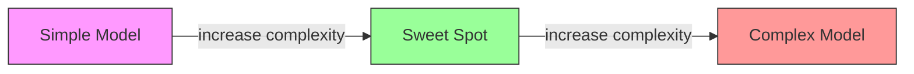
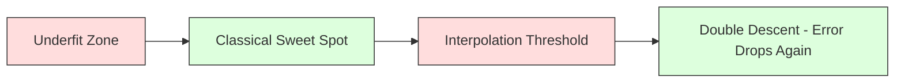
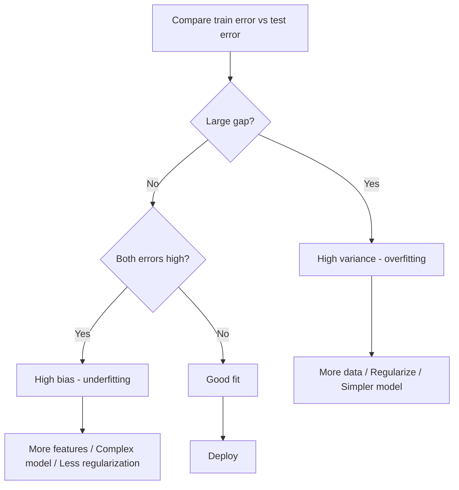
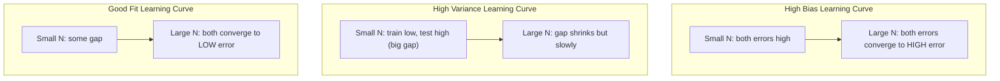
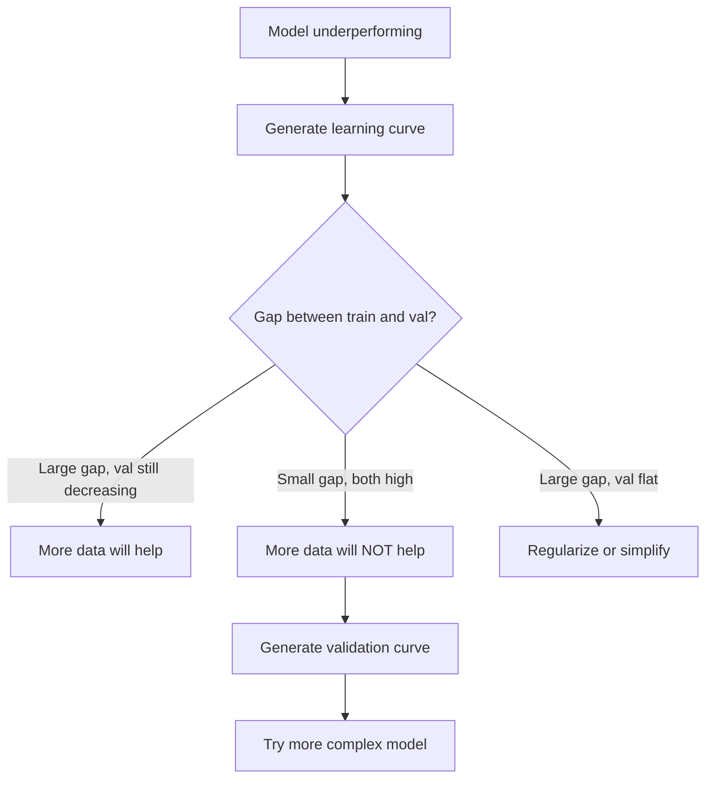

# 편향-분산 트레이드오프

> 모든 모델 오류는 편향, 분산, 노이즈라는 세 가지 원천 중 하나에서 나온다. 그중 제어할 수 있는 것은 앞의 두 가지뿐이다.

**Type:** Learn
**Languages:** Python
**Prerequisites:** Phase 2, Lessons 01-09 (ML 기초, 회귀, 분류, 평가)
**Time:** ~75 minutes

## 학습 목표

- 기대 예측 오류의 편향-분산 분해를 유도하고, 줄일 수 없는 노이즈의 역할을 설명한다
- 학습 오류와 테스트 오류 패턴을 사용해 모델이 높은 편향인지 높은 분산인지 진단한다
- 정규화 기법(L1, L2, dropout, early stopping)이 어떻게 편향을 대가로 분산을 낮추는지 설명한다
- 복잡도가 증가하는 모델들에서 편향-분산 트레이드오프를 시각화하는 실험을 구현한다

## 문제

모델을 학습했다. 테스트 데이터에서 오류가 있다. 그 오류는 어디에서 오는가?

모델이 너무 단순하면(휘어진 데이터셋에 선형 회귀를 적용하는 경우) 참 패턴을 계속 놓친다. 이것이 편향이다. 모델이 너무 복잡하면(15개 데이터 포인트에 20차 다항식을 맞추는 경우) 학습 데이터에는 완벽히 맞지만 새 데이터에서는 예측이 크게 흔들린다. 이것이 분산이다.

고정된 모델 용량에서는 둘을 동시에 최소화할 수 없다. 편향을 낮추면 분산이 올라간다. 분산을 낮추면 편향이 올라간다. 이 트레이드오프를 이해하는 것은 머신러닝에서 가장 유용한 진단 기술이다. 모델을 더 복잡하게 만들지 덜 복잡하게 만들지, 데이터를 더 모을지 더 나은 특징을 설계할지, 정규화를 더 강하게 할지 약하게 할지를 알려준다.

## 개념

### 편향: 체계적 오류

편향은 모델의 평균 예측이 참값에서 얼마나 벗어나는지를 측정한다. 같은 분포에서 뽑은 여러 학습 세트로 같은 모델을 학습하고 예측을 평균냈을 때, 그 평균과 진실 사이의 차이가 편향이다.

편향이 높다는 것은 모델이 실제 패턴을 포착하기에 너무 경직되어 있다는 뜻이다. 포물선에 직선을 맞추면 데이터를 아무리 많이 줘도 곡선을 놓친다. 이것이 과소적합이다.

```text
높은 편향(과소적합):
  모델이 대체로 같은 잘못된 값을 계속 예측한다.
  학습 오류: 높음
  테스트 오류: 높음
  둘 사이의 차이: 작음
```

### 분산: 학습 데이터에 대한 민감도

분산은 서로 다른 데이터 부분집합으로 학습했을 때 예측이 얼마나 달라지는지를 측정한다. 학습 세트의 작은 변화가 모델의 큰 변화를 일으키면 분산이 높다.

분산이 높다는 것은 모델이 근본 신호가 아니라 학습 데이터의 노이즈를 맞추고 있다는 뜻이다. 20차 다항식은 모든 학습 포인트를 지나가지만 포인트 사이에서는 크게 진동한다. 이것이 과대적합이다.

```text
높은 분산(과대적합):
  모델이 학습 데이터에는 완벽히 맞지만 새 데이터에서는 실패한다.
  학습 오류: 낮음
  테스트 오류: 높음
  둘 사이의 차이: 큼
```

### 분해

임의의 점 x에서, 제곱 손실 아래 기대 예측 오류는 정확히 다음처럼 분해된다.

```text
Expected Error = Bias^2 + Variance + Irreducible Noise

where:
  Bias^2   = (E[f_hat(x)] - f(x))^2
  Variance = E[(f_hat(x) - E[f_hat(x)])^2]
  Noise    = E[(y - f(x))^2]             (sigma^2)
```

- `f(x)`는 참 함수다
- `f_hat(x)`는 모델의 예측이다
- `E[...]`는 서로 다른 학습 세트에 대한 기대값이다
- `y`는 관측된 라벨이다(참 함수에 노이즈가 더해진 값)

노이즈 항은 줄일 수 없다. 어떤 모델도 노이즈가 있는 데이터에서 sigma^2보다 더 잘할 수 없다. 우리의 일은 bias^2와 variance 사이의 올바른 균형을 찾는 것이다.

### 모델 복잡도와 오류



고전적인 U자 곡선은 다음과 같다.

| 복잡도 | 편향 | 분산 | 전체 오류 |
|-----------|------|----------|-------------|
| 너무 낮음 | 높음 | 낮음 | 높음(과소적합) |
| 적절함 | 중간 | 중간 | 최저 |
| 너무 높음 | 낮음 | 높음 | 높음(과대적합) |

### 편향-분산 제어로서의 정규화

정규화는 분산을 낮추기 위해 의도적으로 편향을 높인다. 모델을 제약해 노이즈를 쫓지 못하게 만든다.

- **L2 (Ridge):** 모든 가중치를 0 쪽으로 줄인다. 모든 특징을 유지하지만 영향력을 줄인다.
- **L1 (Lasso):** 일부 가중치를 정확히 0으로 민다. 특징 선택을 수행한다.
- **Dropout:** 학습 중 뉴런을 무작위로 비활성화한다. 중복 표현을 강제한다.
- **Early stopping:** 모델이 학습 데이터를 완전히 맞추기 전에 학습을 멈춘다.

정규화 강도(lambda, dropout rate, epoch 수)는 편향-분산 곡선에서 어디에 위치하는지를 직접 제어한다. 정규화가 강할수록 편향은 커지고 분산은 작아진다.

### 이중 하강: 현대적 관점

고전 이론은 최적 지점을 지난 뒤에는 복잡도가 늘수록 항상 나빠진다고 말한다. 하지만 2019년 이후 연구는 예상 밖의 현상을 보여줬다. 모델 용량을 보간 임계점(모델이 학습 데이터를 완벽히 맞출 만큼 충분한 파라미터를 가진 지점) 훨씬 너머로 계속 늘리면 테스트 오류가 다시 감소할 수 있다.



이 "double descent" 현상은 학습 예제보다 훨씬 많은 파라미터를 가진 대규모 과매개변수화 신경망이 왜 여전히 잘 일반화하는지 설명한다. 고전적인 편향-분산 트레이드오프가 틀린 것은 아니지만, 현대적 영역에서는 불완전하다.

double descent에 대한 핵심 관찰:
- 선형 모델, 결정 트리, 신경망에서 발생한다
- 보간 영역에서는 데이터가 더 많아지는 것이 오히려 해로울 수 있다(sample-wise double descent)
- 학습 epoch가 많아져도 발생할 수 있다(epoch-wise double descent)
- 정규화는 피크를 완만하게 만들지만 제거하지는 않는다

왜 이런 일이 생길까? 보간 임계점에서 모델은 모든 학습 포인트를 맞추기에 딱 충분한 용량을 가진다. 모델은 모든 점을 통과하는 매우 특정한 해로 몰리고, 데이터의 작은 교란이 적합에 큰 변화를 만든다. 여기서 분산이 정점에 도달한다. 임계점을 지나면 모델은 데이터를 완벽히 맞추는 가능한 해를 많이 가진다. 학습 알고리즘(예: 암묵적 정규화를 가진 gradient descent)은 그중 가장 단순한 해를 고르는 경향이 있다. 단순한 해를 향한 이 암묵적 편향 때문에 과매개변수화 모델이 일반화된다.

| 영역 | 파라미터 vs 샘플 | 동작 |
|--------|----------------------|----------|
| 과소매개변수 | p << n | 고전적 트레이드오프가 적용됨 |
| 보간 임계점 | p ~ n | 분산이 정점에 도달하고 테스트 오류가 치솟음 |
| 과매개변수 | p >> n | 암묵적 정규화가 작동하고 테스트 오류가 낮아짐 |

실무적으로 말하면, 신경망이나 큰 트리 앙상블을 쓴다면 보간 임계점에서 멈추지 말아야 한다. 명시적 정규화로 그보다 훨씬 낮은 곳에 머물거나, 훨씬 지나쳐야 한다. 최악의 위치는 바로 임계점 위다.

### 모델 진단하기



| 증상 | 진단 | 해결책 |
|---------|-----------|-----|
| 높은 학습 오류, 높은 테스트 오류 | 편향 | 더 많은 특징, 복잡한 모델, 더 약한 정규화 |
| 낮은 학습 오류, 높은 테스트 오류 | 분산 | 더 많은 데이터, 정규화, 단순한 모델, dropout |
| 낮은 학습 오류, 낮은 테스트 오류 | 좋은 적합 | 출시 |
| 학습 오류는 감소하고 테스트 오류는 증가 | 진행 중인 과대적합 | Early stopping |

### 실전 전략

**편향이 문제일 때:**
- 다항식 또는 상호작용 특징을 추가한다
- 더 유연한 모델을 사용한다(선형 대신 트리 앙상블)
- 정규화 강도를 낮춘다
- 아직 수렴하지 않았다면 더 오래 학습한다

**분산이 문제일 때:**
- 학습 데이터를 더 모은다
- bagging을 사용한다(random forests)
- 정규화를 강화한다(더 높은 lambda, 더 많은 dropout)
- 특징 선택을 한다(노이즈가 많은 특징 제거)
- cross-validation으로 조기에 감지한다

### 앙상블 방법과 분산 감소

앙상블 방법은 분산과 싸우는 가장 실용적인 도구다.

**Bagging (Bootstrap Aggregating)**은 학습 데이터의 서로 다른 bootstrap sample로 여러 모델을 학습한 뒤 예측을 평균낸다. 각 개별 모델은 분산이 높지만, 평균은 훨씬 낮은 분산을 가진다. Random forests는 결정 트리에 bagging을 적용한 것이다.

수학적으로 왜 동작할까? 분산이 sigma^2인 독립 예측 N개를 평균내면 평균의 분산은 sigma^2 / N이다. 모델들은 완전히 독립적이지 않다(비슷한 데이터를 모두 본다). 따라서 감소량은 1/N보다 작지만 여전히 상당하다.

**Boosting**은 모델을 순차적으로 만들고, 각 새 모델이 지금까지 앙상블의 오류에 집중하게 하여 편향을 줄인다. Gradient boosting과 AdaBoost가 대표 예다. 모델을 너무 많이 추가하면 boosting은 과대적합될 수 있으므로 early stopping이나 정규화가 필요하다.

| 방법 | 주요 효과 | 편향 변화 | 분산 변화 |
|--------|---------------|-------------|-----------------|
| Bagging | 분산 감소 | 변화 없음 | 감소 |
| Boosting | 편향 감소 | 감소 | 증가할 수 있음 |
| Stacking | 둘 다 감소 | meta-learner에 따라 다름 | base model에 따라 다름 |
| Dropout | 암묵적 bagging | 약간 증가 | 감소 |

**실전 규칙:** base model의 분산이 높다면(깊은 트리, 고차 다항식) bagging을 사용한다. base model의 편향이 높다면(얕은 stump, 단순 선형 모델) boosting을 사용한다.

### 학습 곡선

학습 곡선은 학습 세트 크기의 함수로 학습 오류와 검증 오류를 그린다. 이것은 가장 실용적인 진단 도구다. 단일 train/test 비교와 달리, 학습 곡선은 모델의 궤적을 보여주고 데이터가 더 도움이 될지 알려준다.



읽는 방법:

| 시나리오 | 학습 오류 | 검증 오류 | 차이 | 의미 | 할 일 |
|----------|---------------|-----------------|-----|---------------|------------|
| 높은 편향 | 높음 | 높음 | 작음 | 모델이 패턴을 포착하지 못함 | 더 많은 특징, 복잡한 모델, 더 약한 정규화 |
| 높은 분산 | 낮음 | 높음 | 큼 | 모델이 학습 데이터를 암기함 | 더 많은 데이터, 정규화, 단순한 모델 |
| 좋은 적합 | 중간 | 중간 | 작음 | 모델이 잘 일반화함 | 출시 |
| 높은 분산, 개선 중 | 낮음 | 데이터가 늘수록 감소 | 줄어듦 | 데이터로 고칠 수 있는 분산 문제 | 데이터 더 수집 |
| 높은 편향, 평평함 | 높음 | 높고 평평함 | 작고 평평함 | 데이터가 더 있어도 도움이 되지 않음 | 모델 구조 변경 |

핵심 통찰은 이것이다. 두 곡선이 모두 평탄해졌고 차이는 작지만 두 오류가 모두 높다면, 데이터 추가는 소용없다. 더 나은 모델이 필요하다. 차이가 크고 여전히 줄어든다면 데이터가 도움이 된다.

### 학습 곡선 생성 방법

두 가지 접근이 있다.

**접근 1: 학습 세트 크기를 바꾸고 모델을 고정한다.** 모델과 하이퍼파라미터를 일정하게 유지한다. 학습 데이터의 점점 큰 부분집합으로 학습한다. 각 크기에서 학습 오류와 검증 오류를 측정한다. 이것이 표준 학습 곡선이다.

**접근 2: 데이터를 고정하고 모델 복잡도를 바꾼다.** 데이터를 일정하게 유지한다. 복잡도 파라미터(다항식 차수, 트리 깊이, 레이어 수)를 훑는다. 각 복잡도에서 학습 오류와 검증 오류를 측정한다. 이것은 검증 곡선이며 편향-분산 트레이드오프를 직접 보여준다.

두 접근은 서로를 보완한다. 첫 번째는 데이터가 더 도움이 될지 알려준다. 두 번째는 다른 모델이 도움이 될지 알려준다. 다음 단계를 결정하기 전에 둘 다 실행하라.



```figure
bias-variance
```

## 직접 만들기

`code/bias_variance.py`의 코드는 전체 편향-분산 분해 실험을 실행한다. 접근은 다음과 같다.

### 1단계: 알려진 함수에서 합성 데이터 생성

Gaussian noise가 더해진 `f(x) = sin(1.5x) + 0.5x`를 사용한다. 참 함수를 알면 정확한 편향과 분산을 계산할 수 있다.

```python
def true_function(x):
    return np.sin(1.5 * x) + 0.5 * x

def generate_data(n_samples=30, noise_std=0.5, x_range=(-3, 3), seed=None):
    rng = np.random.RandomState(seed)
    x = rng.uniform(x_range[0], x_range[1], n_samples)
    y = true_function(x) + rng.normal(0, noise_std, n_samples)
    return x, y
```

### 2단계: Bootstrap Sampling과 다항식 적합

각 다항식 차수마다 여러 bootstrap training set를 뽑고, 다항식을 맞춘 뒤, 고정된 테스트 grid에서 예측을 기록한다. 그러면 각 테스트 점에서 예측 분포를 얻는다.

```python
def fit_polynomial(x_train, y_train, degree, lam=0.0):
    X = np.column_stack([x_train ** d for d in range(degree + 1)])
    if lam > 0:
        penalty = lam * np.eye(X.shape[1])
        penalty[0, 0] = 0
        w = np.linalg.solve(X.T @ X + penalty, X.T @ y_train)
    else:
        w = np.linalg.lstsq(X, y_train, rcond=None)[0]
    return w
```

200개의 서로 다른 bootstrap sample에 맞춘다. 각 bootstrap sample은 같은 근본 분포에서 뽑히지만 서로 다른 포인트를 포함한다.

### 3단계: Bias^2, Variance 분해 계산

각 테스트 점에서 200개 예측 세트가 있으면 정의에서 직접 분해를 계산할 수 있다.

```python
mean_pred = predictions.mean(axis=0)
bias_sq = np.mean((mean_pred - y_true) ** 2)
variance = np.mean(predictions.var(axis=0))
total_error = np.mean(np.mean((predictions - y_true) ** 2, axis=1))
```

- `mean_pred`는 bootstrap sample로 추정한 E[f_hat(x)]다
- `bias_sq`는 평균 예측과 진실 사이 차이의 제곱이다
- `variance`는 bootstrap sample 전체에서 예측 퍼짐의 평균이다
- `total_error`는 대략 bias^2 + variance + noise와 같아야 한다

### 4단계: 학습 곡선

학습 곡선은 모델 복잡도를 고정한 채 학습 세트 크기를 훑는다. 모델이 데이터 제한인지 용량 제한인지 보여준다.

```python
def demo_learning_curves():
    sizes = [10, 15, 20, 30, 50, 75, 100, 150, 200, 300]
    degree = 5

    for n in sizes:
        train_errors = []
        test_errors = []
        for seed in range(50):
            x_train, y_train = generate_data(n_samples=n, seed=seed * 100)
            w = fit_polynomial(x_train, y_train, degree)
            train_pred = predict_polynomial(x_train, w)
            train_mse = np.mean((train_pred - y_train) ** 2)
            test_pred = predict_polynomial(x_test, w)
            test_mse = np.mean((test_pred - y_test) ** 2)
            train_errors.append(train_mse)
            test_errors.append(test_mse)
        # Average over runs gives the learning curve point
```

고분산 모델(작은 데이터에서 degree 5)에서는 다음을 볼 수 있다.
- 데이터가 늘수록 암기가 어려워져 학습 오류가 낮게 시작했다가 증가한다
- 모델이 더 많은 신호를 얻으면서 테스트 오류는 높게 시작했다가 감소한다
- 데이터가 많아질수록 차이가 줄어든다

고편향 모델(degree 1)에서는 두 오류가 빠르게 같은 높은 값으로 수렴하고, 데이터가 더 있어도 도움이 되지 않는다.

### 5단계: 정규화 훑기

코드에는 `demo_regularization_sweep()`도 포함되어 있다. 이 함수는 고차 다항식(degree 15)을 고정하고 Ridge 정규화 강도를 0.001부터 100까지 훑는다. 모델 복잡도를 바꾸는 대신 제약 강도를 바꿔 편향-분산 트레이드오프를 다른 각도에서 보여준다.

```python
def demo_regularization_sweep():
    alphas = [0.001, 0.005, 0.01, 0.05, 0.1, 0.5, 1.0, 5.0, 10.0, 50.0, 100.0]
    for alpha in alphas:
        results = bias_variance_decomposition([15], lam=alpha)
        r = results[15]
        print(f"alpha={alpha:.3f}  bias={r['bias_sq']:.4f}  var={r['variance']:.4f}")
```

alpha가 낮으면 degree-15 다항식은 거의 제약이 없다. 모델이 각 bootstrap sample의 노이즈를 쫓기 때문에 분산이 지배한다. alpha가 높으면 penalty가 너무 강해서 모델이 사실상 거의 상수 함수가 된다. 편향이 지배한다. 최적 alpha는 이 양극단 사이에 있다.

이것은 다항식 차수를 바꿨을 때의 같은 U자 곡선이지만, 이산적인 손잡이 대신 연속적인 손잡이로 제어한다. 실무에서는 특징 집합을 바꾸지 않고 세밀하게 제어할 수 있으므로 정규화가 트레이드오프를 제어하는 선호 방식이다.

## 활용하기

sklearn은 bootstrap loop를 직접 쓰지 않고도 이런 진단을 자동화할 수 있도록 `learning_curve`와 `validation_curve`를 제공한다.

### Validation Curve: 모델 복잡도 훑기

```python
from sklearn.model_selection import validation_curve
from sklearn.pipeline import make_pipeline
from sklearn.preprocessing import PolynomialFeatures
from sklearn.linear_model import Ridge

degrees = list(range(1, 16))
train_scores_all = []
val_scores_all = []

for d in degrees:
    pipe = make_pipeline(PolynomialFeatures(d), Ridge(alpha=0.01))
    train_scores, val_scores = validation_curve(
        pipe, X, y, param_name="polynomialfeatures__degree",
        param_range=[d], cv=5, scoring="neg_mean_squared_error"
    )
    train_scores_all.append(-train_scores.mean())
    val_scores_all.append(-val_scores.mean())
```

이것은 편향-분산 트레이드오프 곡선을 직접 제공한다. 검증 점수가 학습 점수에 비해 가장 나쁜 곳에서는 분산이 지배한다. 둘 다 나쁜 곳에서는 편향이 지배한다.

### Learning Curve: 학습 세트 크기 훑기

```python
from sklearn.model_selection import learning_curve

pipe = make_pipeline(PolynomialFeatures(5), Ridge(alpha=0.01))
train_sizes, train_scores, val_scores = learning_curve(
    pipe, X, y, train_sizes=np.linspace(0.1, 1.0, 10),
    cv=5, scoring="neg_mean_squared_error"
)
train_mse = -train_scores.mean(axis=1)
val_mse = -val_scores.mean(axis=1)
```

`train_sizes`에 대해 `train_mse`와 `val_mse`를 그려라. 형태가 모델에 대해 필요한 모든 것을 말해준다.

### 정규화 훑기를 포함한 Cross-Validation

```python
from sklearn.model_selection import cross_val_score

alphas = [0.001, 0.01, 0.1, 1.0, 10.0, 100.0]
for alpha in alphas:
    pipe = make_pipeline(PolynomialFeatures(10), Ridge(alpha=alpha))
    scores = cross_val_score(pipe, X, y, cv=5, scoring="neg_mean_squared_error")
    print(f"alpha={alpha:>7.3f}  MSE={-scores.mean():.4f} +/- {scores.std():.4f}")
```

이것은 고정된 모델 복잡도에서 정규화 강도를 훑는다. 같은 편향-분산 트레이드오프를 보게 된다. 낮은 alpha는 높은 분산을, 높은 alpha는 높은 편향을 의미한다.

### 모두 합친 완전한 진단 워크플로

실무에서는 이 진단을 순서대로 실행한다.

1. 모델을 학습한다. 학습 오류와 테스트 오류를 계산한다.
2. 둘 다 높다면 편향 문제다. 4단계로 건너뛴다.
3. 학습 오류는 낮지만 테스트 오류가 높다면 분산 문제다. 데이터가 더 도움이 될지 확인하기 위해 학습 곡선을 생성한다. 그렇지 않다면 정규화한다.
4. 주요 복잡도 파라미터를 훑는 검증 곡선을 생성한다. 최적 지점을 찾는다.
5. 최적 지점에서 학습 곡선을 생성한다. 차이가 여전히 크다면 더 많은 데이터나 정규화가 필요하다.
6. `cross_val_score`를 사용해 서로 다른 alpha 값으로 Ridge/Lasso를 시도한다. 교차검증 오류가 가장 낮은 alpha를 고른다.

대부분의 tabular dataset에서는 10-15분의 compute로 끝나며, 추측에 쓰는 몇 시간을 아껴준다.

## 산출물

이 lesson은 `outputs/prompt-model-diagnostics.md`를 만든다.

## 연습문제

1. `noise_std=0`(노이즈 없음)으로 분해를 실행하라. 줄일 수 없는 오류 항에는 어떤 일이 생기는가? 최적 복잡도가 바뀌는가?

2. 학습 세트 크기를 30에서 300으로 늘려라. 이것이 분산 성분에 어떤 영향을 주는가? 최적 다항식 차수가 이동하는가?

3. 실험에 L2 정규화(Ridge regression)를 추가하라. 고정된 고차 다항식(degree 15)에 대해 lambda를 0부터 100까지 훑는다. lambda의 함수로 bias^2와 variance를 그려라.

4. 참 함수를 다항식에서 `sin(x)`로 바꿔라. 편향-분산 분해가 어떻게 달라지는가? 여전히 뚜렷한 최적 차수가 있는가?

5. 단순한 bootstrap aggregating(bagging) wrapper를 구현하라. bootstrap sample로 모델 10개를 학습하고 예측을 평균내라. 이것이 편향을 크게 높이지 않으면서 분산을 줄인다는 것을 보여라.

## 핵심 용어

| 용어 | 사람들이 하는 말 | 실제 의미 |
|------|----------------|----------------------|
| Bias | "모델이 너무 단순하다" | 잘못된 가정에서 오는 체계적 오류. 평균 모델 예측과 진실 사이의 차이. |
| Variance | "모델이 과대적합한다" | 학습 데이터에 대한 민감도에서 오는 오류. 서로 다른 학습 세트에서 예측이 얼마나 바뀌는지. |
| Irreducible error | "데이터의 노이즈" | 실제 데이터 생성 과정의 무작위성에서 오는 오류. 어떤 모델도 제거할 수 없다. |
| Underfitting | "충분히 배우지 못한다" | 모델의 편향이 높다. 학습 데이터에서도 실제 패턴을 놓친다. |
| Overfitting | "데이터를 암기한다" | 모델의 분산이 높다. 일반화되지 않는 학습 데이터의 노이즈를 맞춘다. |
| Regularization | "모델을 제약한다" | 모델 복잡도를 낮추는 penalty를 추가해 편향을 더 낮은 분산과 교환한다. |
| Double descent | "파라미터가 더 많으면 도움이 될 수 있다" | 모델 용량이 보간 임계점을 훨씬 넘으면 테스트 오류가 다시 감소한다. |
| Model complexity | "모델이 얼마나 유연한가" | 임의의 패턴을 맞출 수 있는 모델의 용량. architecture, features, regularization으로 제어된다. |

## 더 읽을거리

- [Hastie, Tibshirani, Friedman: Elements of Statistical Learning, Ch. 7](https://hastie.su.domains/ElemStatLearn/) -- 편향-분산 분해의 결정적 설명
- [Belkin et al., Reconciling modern machine learning practice and the bias-variance trade-off (2019)](https://arxiv.org/abs/1812.11118) -- double descent 논문
- [Nakkiran et al., Deep Double Descent (2019)](https://arxiv.org/abs/1912.02292) -- epoch-wise 및 sample-wise double descent
- [Scott Fortmann-Roe: Understanding the Bias-Variance Tradeoff](http://scott.fortmann-roe.com/docs/BiasVariance.html) -- 명확한 시각적 설명
