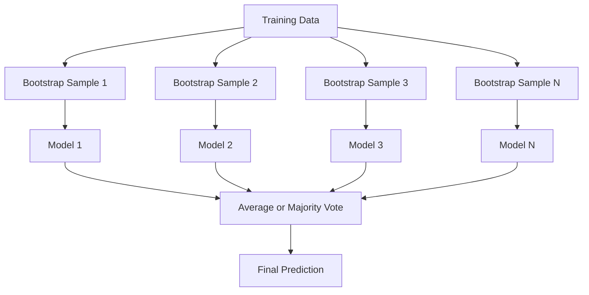
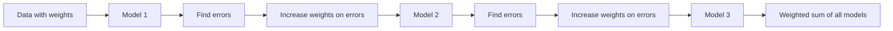
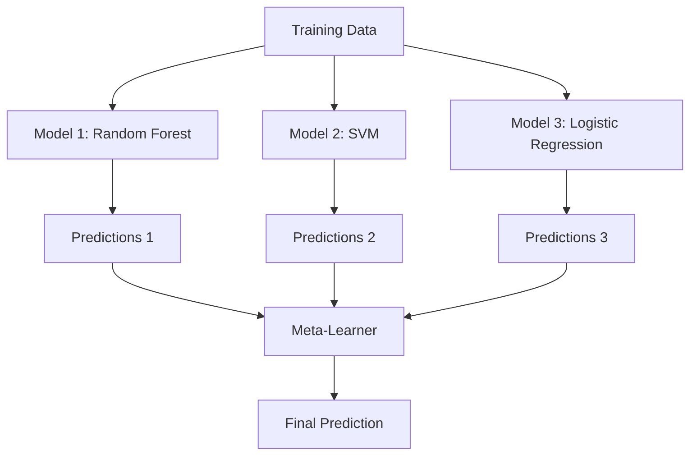

# 앙상블 방법

> 약한 learner들의 집합도 올바르게 결합하면 강한 learner가 된다. 이것은 비유가 아니다. 정리다.

**Type:** Build
**Languages:** Python
**Prerequisites:** Phase 2, Lesson 10 (편향-분산 트레이드오프)
**Time:** ~120 minutes

## 학습 목표

- AdaBoost와 gradient boosting을 처음부터 구현하고, boosting이 어떻게 순차적으로 편향을 줄이는지 설명한다
- bagging ensemble을 만들고, 상관이 낮은 모델들을 평균내면 편향을 늘리지 않고 분산이 줄어드는 방식을 보여준다
- bagging, boosting, stacking을 각각 어떤 오류 성분을 겨냥하는지 기준으로 비교한다
- ensemble diversity를 평가하고, 독립적인 weak learner가 많아질수록 majority voting 정확도가 향상되는 이유를 설명한다

## 문제

단일 decision tree는 학습이 빠르고 해석하기 쉽지만 과대적합한다. 단일 linear model은 복잡한 경계에서 과소적합한다. 완벽한 모델 architecture를 설계하는 데 며칠을 쓸 수도 있다. 또는 불완전한 모델 여러 개를 결합해 그중 어떤 개별 모델보다 나은 것을 얻을 수도 있다.

앙상블 방법은 바로 이것을 한다. tabular data에서 Kaggle competition을 이기는 가장 신뢰할 수 있는 기법이며, 대부분의 production ML system을 움직이고, 편향-분산 트레이드오프가 실제로 작동하는 모습을 보여준다. Bagging은 분산을 줄인다. Boosting은 편향을 줄인다. Stacking은 어떤 입력에서 어떤 모델을 신뢰해야 하는지 배운다.

## 개념

### Ensemble이 작동하는 이유

정확도가 p > 0.5인 독립 classifier N개가 있다고 하자. majority vote의 정확도는 다음과 같다.

```text
P(majority correct) = sum over k > N/2 of C(N,k) * p^k * (1-p)^(N-k)
```

각각 정확도가 60%인 classifier 21개를 쓰면 majority vote 정확도는 약 74%다. classifier 101개를 쓰면 84%까지 오른다. 모델들이 서로 다른 실수를 만들 때 오류가 상쇄된다.

핵심 요구사항은 **다양성**이다. 모든 모델이 같은 오류를 만든다면 결합해도 도움이 되지 않는다. Ensemble은 다음 방식으로 다양한 모델을 만들기 때문에 동작한다.

- 서로 다른 학습 부분집합(bagging)
- 서로 다른 feature 부분집합(random forests)
- 순차적 오류 수정(boosting)
- 서로 다른 모델 계열(stacking)

### Bagging (bootstrap aggregating)

Bagging은 학습 데이터의 서로 다른 bootstrap sample로 각 모델을 학습해 다양성을 만든다.



bootstrap sample은 원본 데이터에서 복원추출로 뽑으며, 크기는 원본과 같다. 각 bootstrap에는 고유 sample의 약 63.2%가 등장한다. 나머지 36.8%(out-of-bag samples)는 무료 검증 세트 역할을 한다.

Bagging은 편향을 크게 늘리지 않고 분산을 줄인다. 각 개별 tree는 자신의 bootstrap sample에 과대적합하지만, 과대적합 방식이 tree마다 다르므로 평균이 노이즈를 상쇄한다.

**Random Forests**는 bagging에 추가 장치를 더한 것이다. 각 split에서 feature의 무작위 부분집합만 고려한다. 이렇게 하면 tree 사이의 다양성이 더 커진다. 일반적인 후보 feature 수는 classification에서는 `sqrt(n_features)`, regression에서는 `n_features / 3`이다.

### Boosting (순차적 오류 수정)

Boosting은 모델을 순차적으로 학습한다. 각 새 모델은 이전 모델들이 틀린 예제에 집중한다.



Boosting은 편향을 줄인다. 각 새 모델은 지금까지 ensemble의 체계적 오류를 수정한다. 최종 예측은 모든 모델의 weighted sum이며, 더 나은 모델은 더 높은 weight를 받는다.

트레이드오프는 이것이다. 너무 많은 round를 실행하면 boosting은 과대적합할 수 있다. 계속 더 어려운 예제에 맞추는데, 그중 일부는 노이즈일 수 있기 때문이다.

### AdaBoost

AdaBoost(Adaptive Boosting)는 최초의 실용적인 boosting algorithm이다. 어떤 base learner와도 작동하지만 보통 decision stumps(depth-1 trees)를 사용한다.

Algorithm:

```text
1. Initialize sample weights: w_i = 1/N for all i

2. For t = 1 to T:
   a. Train weak learner h_t on weighted data
   b. Compute weighted error:
      err_t = sum(w_i * I(h_t(x_i) != y_i)) / sum(w_i)
   c. Compute model weight:
      alpha_t = 0.5 * ln((1 - err_t) / err_t)
   d. Update sample weights:
      w_i = w_i * exp(-alpha_t * y_i * h_t(x_i))
   e. Normalize weights to sum to 1

3. Final prediction: H(x) = sign(sum(alpha_t * h_t(x)))
```

오류가 낮은 모델은 더 높은 alpha를 받는다. 잘못 분류된 sample은 더 높은 weight를 받아 다음 모델이 그것에 집중하게 된다.

### Gradient boosting

Gradient boosting은 boosting을 임의의 loss function으로 일반화한다. sample을 재가중하는 대신, 각 새 모델을 현재 ensemble의 residuals(loss의 negative gradient)에 맞춘다.

```text
1. Initialize: F_0(x) = argmin_c sum(L(y_i, c))

2. For t = 1 to T:
   a. Compute pseudo-residuals:
      r_i = -dL(y_i, F_{t-1}(x_i)) / dF_{t-1}(x_i)
   b. Fit a tree h_t to the residuals r_i
   c. Find optimal step size:
      gamma_t = argmin_gamma sum(L(y_i, F_{t-1}(x_i) + gamma * h_t(x_i)))
   d. Update:
      F_t(x) = F_{t-1}(x) + learning_rate * gamma_t * h_t(x)

3. Final prediction: F_T(x)
```

제곱 오류 loss에서는 pseudo-residuals가 실제 residuals와 같다: `r_i = y_i - F_{t-1}(x_i)`. 각 tree는 말 그대로 이전 ensemble의 오류를 맞춘다.

learning rate(shrinkage)는 각 tree가 얼마나 기여할지 제어한다. 더 작은 learning rate는 더 많은 tree가 필요하지만 더 잘 일반화한다. 일반적인 값은 0.01부터 0.3까지다.

### XGBoost: Tabular Data를 지배하는 이유

XGBoost(eXtreme Gradient Boosting)는 빠르고 정확하며 과대적합에 강하게 만드는 engineering optimization을 더한 gradient boosting이다.

- **Regularized objective:** leaf weight에 대한 L1 및 L2 penalty가 개별 tree의 과도한 확신을 막는다
- **Second-order approximation:** loss의 1차 및 2차 derivative를 모두 사용해 더 나은 split decision을 만든다
- **Sparsity-aware splits:** 각 split에서 missing data의 최적 방향을 학습해 missing value를 native하게 처리한다
- **Column subsampling:** random forests처럼 각 split에서 feature를 sampling해 다양성을 만든다
- **Weighted quantile sketch:** distributed data의 continuous feature에서 split point를 효율적으로 찾는다
- **Cache-aware block structure:** CPU cache line에 최적화된 memory layout

tabular data에서는 XGBoost(및 후속 LightGBM)가 neural networks를 일관되게 능가한다. 이 상황은 당분간 바뀌지 않을 것이다. 데이터가 row와 column이 있는 table에 맞는다면 gradient boosting부터 시작하라.

### Stacking (meta-learning)

Stacking은 여러 base model의 예측을 meta-learner의 feature로 사용한다.



meta-learner는 어떤 입력에서 어떤 base model을 신뢰해야 하는지 배운다. random forest가 어떤 영역에서 더 낫고 SVM이 다른 영역에서 더 낫다면, meta-learner는 그에 맞게 route하는 법을 배운다.

data leakage를 피하려면 base model prediction은 반드시 학습 세트에서 cross-validation을 통해 생성해야 한다. 같은 데이터로 base model을 학습하고 meta-feature를 생성하면 안 된다.

### Voting

가장 단순한 ensemble이다. 예측을 직접 결합한다.

- **Hard voting:** class label에 대한 majority vote.
- **Soft voting:** 예측 확률을 평균내고, 평균 확률이 가장 높은 class를 고른다. confidence information을 사용하므로 보통 더 낫다.

## 직접 만들기

### 1단계: Decision Stump (Base Learner)

`code/ensembles.py`의 코드는 모든 것을 처음부터 구현한다. 단일 split을 가진 tree인 decision stump부터 시작한다.

```python
class DecisionStump:
    def __init__(self):
        self.feature_idx = None
        self.threshold = None
        self.polarity = 1
        self.alpha = None

    def fit(self, X, y, weights):
        n_samples, n_features = X.shape
        best_error = float("inf")

        for f in range(n_features):
            thresholds = np.unique(X[:, f])
            for thresh in thresholds:
                for polarity in [1, -1]:
                    pred = np.ones(n_samples)
                    pred[polarity * X[:, f] < polarity * thresh] = -1
                    error = np.sum(weights[pred != y])
                    if error < best_error:
                        best_error = error
                        self.feature_idx = f
                        self.threshold = thresh
                        self.polarity = polarity

    def predict(self, X):
        n = X.shape[0]
        pred = np.ones(n)
        idx = self.polarity * X[:, self.feature_idx] < self.polarity * self.threshold
        pred[idx] = -1
        return pred
```

### 2단계: 처음부터 AdaBoost 구현

```python
class AdaBoostScratch:
    def __init__(self, n_estimators=50):
        self.n_estimators = n_estimators
        self.stumps = []
        self.alphas = []

    def fit(self, X, y):
        n = X.shape[0]
        weights = np.full(n, 1 / n)

        for _ in range(self.n_estimators):
            stump = DecisionStump()
            stump.fit(X, y, weights)
            pred = stump.predict(X)

            err = np.sum(weights[pred != y])
            err = np.clip(err, 1e-10, 1 - 1e-10)

            alpha = 0.5 * np.log((1 - err) / err)
            weights *= np.exp(-alpha * y * pred)
            weights /= weights.sum()

            stump.alpha = alpha
            self.stumps.append(stump)
            self.alphas.append(alpha)

    def predict(self, X):
        total = sum(a * s.predict(X) for a, s in zip(self.alphas, self.stumps))
        return np.sign(total)
```

### 3단계: 처음부터 Gradient Boosting 구현

```python
class GradientBoostingScratch:
    def __init__(self, n_estimators=100, learning_rate=0.1, max_depth=3):
        self.n_estimators = n_estimators
        self.lr = learning_rate
        self.max_depth = max_depth
        self.trees = []
        self.initial_pred = None

    def fit(self, X, y):
        self.initial_pred = np.mean(y)
        current_pred = np.full(len(y), self.initial_pred)

        for _ in range(self.n_estimators):
            residuals = y - current_pred
            tree = SimpleRegressionTree(max_depth=self.max_depth)
            tree.fit(X, residuals)
            update = tree.predict(X)
            current_pred += self.lr * update
            self.trees.append(tree)

    def predict(self, X):
        pred = np.full(X.shape[0], self.initial_pred)
        for tree in self.trees:
            pred += self.lr * tree.predict(X)
        return pred
```

### 4단계: sklearn과 비교

코드는 처음부터 구현한 버전이 sklearn의 `AdaBoostClassifier` 및 `GradientBoostingClassifier`와 비슷한 정확도를 내는지 검증하고, 모든 방법을 나란히 비교한다.

## 활용하기

### 각 방법을 언제 사용할까

| 방법 | 줄이는 것 | 가장 적합한 경우 | 주의할 점 |
|--------|---------|----------|---------------|
| Bagging / Random Forest | 분산 | noisy data, 많은 features | 편향에는 도움이 되지 않음 |
| AdaBoost | 편향 | clean data, 단순 base learners | outliers와 noise에 민감 |
| Gradient Boosting | 편향 | tabular data, competitions | 학습이 느리고 tuning 없이는 과대적합 쉬움 |
| XGBoost / LightGBM | 둘 다 | production tabular ML | hyperparameter가 많음 |
| Stacking | 둘 다 | 마지막 1-2% 정확도 | 복잡하고 meta-learner 과대적합 위험 |
| Voting | 분산 | 다양한 모델의 빠른 결합 | 모델이 다양할 때만 도움 |

### Tabular Data를 위한 Production Stack

대부분의 tabular prediction 문제에서는 다음 순서로 시도한다.

1. 기본 parameter의 **LightGBM 또는 XGBoost**
2. n_estimators, learning_rate, max_depth, min_child_weight 조정
3. 마지막 0.5%가 필요하면 3-5개의 다양한 모델로 stacking ensemble 구성
4. 항상 cross-validation 사용

tabular data에서 neural networks는 지속적인 연구 시도에도 불구하고 거의 항상 gradient boosting보다 나쁘다. TabNet, NODE, 유사 architecture는 가끔 비슷하지만 잘 tuning된 XGBoost를 이기는 경우는 드물다.

## 산출물

이 lesson은 주어진 dataset에 맞는 ensemble method를 고르는 데 도움을 주는 prompt인 `outputs/prompt-ensemble-selector.md`를 만든다. data(size, feature types, noise level, class balance)와 해결 중인 문제를 설명하라. prompt는 decision checklist를 따라가며 method를 추천하고, 시작 hyperparameter를 제안하며, 해당 method의 흔한 실수를 경고한다. 또한 전체 selection guide가 담긴 `outputs/skill-ensemble-builder.md`도 만든다.

## 연습문제

1. 각 round 후 training accuracy를 추적하도록 AdaBoost 구현을 수정하라. estimator 수 대비 accuracy를 plot하라. 언제 수렴하는가?

2. regression tree에 random feature subsampling을 추가해 random forest를 처음부터 구현하라. `max_features=sqrt(n_features)`로 tree 100개를 학습하고 예측을 평균내라. 단일 tree와 분산 감소를 비교하라.

3. gradient boosting 구현에 early stopping을 추가하라. 각 round 후 validation loss를 추적하고, 10번 연속 개선이 없으면 멈춘다. 실제로 tree가 몇 개 필요한가?

4. 세 base model(logistic regression, decision tree, k-nearest neighbors)과 logistic regression meta-learner로 stacking ensemble을 만들라. 5-fold cross-validation으로 meta-features를 생성한다. 각 base model 단독과 비교하라.

5. 같은 dataset에서 기본 parameter로 XGBoost를 실행하라. 처음부터 만든 gradient boosting과 accuracy를 비교하라. 둘의 시간을 재라. 속도 차이가 얼마나 큰가?

## 핵심 용어

| 용어 | 사람들이 하는 말 | 실제 의미 |
|------|----------------|----------------------|
| Bagging | "무작위 부분집합으로 학습" | Bootstrap aggregating: bootstrap sample로 모델을 학습하고 예측을 평균내 분산을 줄인다 |
| Boosting | "어려운 예제에 집중" | 모델을 순차적으로 학습하며 각 모델이 지금까지 ensemble의 오류를 수정해 편향을 줄인다 |
| AdaBoost | "데이터를 재가중" | sample weight update를 통한 boosting. 잘못 분류된 point는 다음 learner에서 더 높은 weight를 받는다 |
| Gradient boosting | "residuals에 맞춘다" | 각 새 모델을 loss function의 negative gradient에 맞추는 boosting |
| XGBoost | "Kaggle 무기" | regularization, second-order optimization, systems-level speed trick을 더한 gradient boosting |
| Stacking | "모델 위의 모델" | base model의 예측을 meta-learner의 input feature로 사용한다 |
| Random forest | "많은 randomized trees" | decision tree를 사용한 bagging이며, 각 split에서 random feature subsampling을 더해 다양성을 만든다 |
| Ensemble diversity | "서로 다른 실수를 만들기" | ensemble이 개별 모델보다 좋아지려면 모델들의 오류가 낮은 상관을 가져야 한다 |
| Out-of-bag error | "무료 validation" | bootstrap draw에 포함되지 않은 sample(~36.8%)이 holdout 없이 validation set 역할을 한다 |

## 더 읽을거리

- [Schapire & Freund: Boosting: Foundations and Algorithms](https://mitpress.mit.edu/9780262526036/) -- AdaBoost 창시자들의 책
- [Friedman: Greedy Function Approximation: A Gradient Boosting Machine (2001)](https://statweb.stanford.edu/~jhf/ftp/trebst.pdf) -- 원래 gradient boosting 논문
- [Chen & Guestrin: XGBoost (2016)](https://arxiv.org/abs/1603.02754) -- XGBoost 논문
- [Wolpert: Stacked Generalization (1992)](https://www.sciencedirect.com/science/article/abs/pii/S0893608005800231) -- 원래 stacking 논문
- [scikit-learn Ensemble Methods](https://scikit-learn.org/stable/modules/ensemble.html) -- 실전 reference
