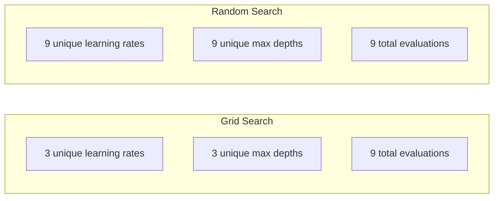
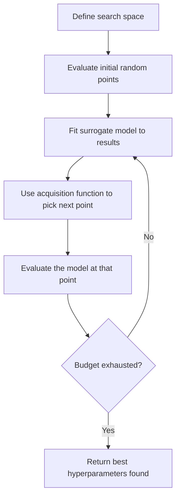
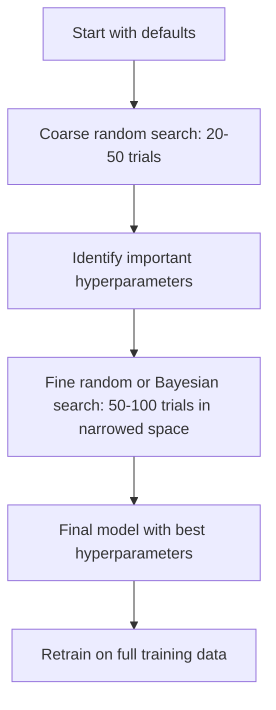
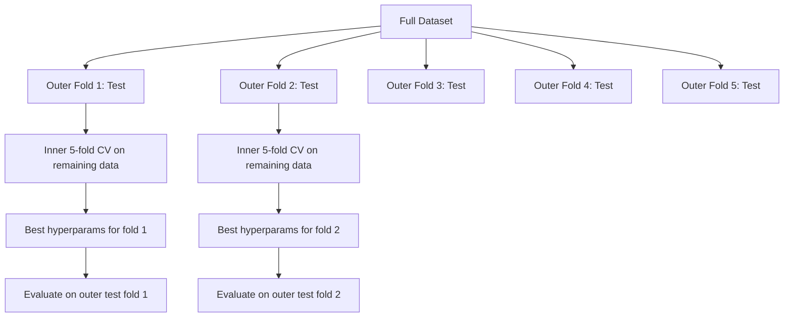

# 하이퍼파라미터 튜닝

> Hyperparameter는 training이 시작되기 전에 조정하는 knob이다. 이것을 잘 조정하는 일이 평범한 model과 훌륭한 model의 차이를 만든다.

**Type:** Build
**Languages:** Python
**Prerequisites:** Phase 2, Lesson 11 (Ensemble Methods)
**Time:** ~90 minutes

## 학습 목표

- grid search, random search, Bayesian optimization을 처음부터 구현하고 sample efficiency를 비교한다
- 대부분의 hyperparameter가 낮은 effective dimensionality를 가질 때 random search가 grid search보다 나은 이유를 설명한다
- surrogate model과 acquisition function을 사용해 search를 안내하는 Bayesian optimization loop를 만든다
- 적절한 cross-validation을 통해 validation set 과대적합을 피하는 hyperparameter tuning strategy를 설계한다

## 문제

gradient boosting model에는 learning rate, tree 수, max depth, leaf당 min sample 수, subsample ratio, column sample ratio가 있다. hyperparameter가 여섯 개다. 각각에 합리적인 값이 5개씩 있다면 grid에는 5^6 = 15,625개 combination이 있다. 각 training에 10초가 걸린다면 전부 시도하는 데 43시간의 compute가 든다.

Grid search는 가장 obvious한 접근이지만 scale이 커지면 최악의 접근이다. Random search는 더 적은 compute로 더 잘한다. Bayesian optimization은 과거 evaluation에서 학습해 더 잘한다. 어떤 strategy를 사용할지, 어떤 hyperparameter가 실제로 중요한지 알면 낭비되는 GPU time을 며칠씩 줄일 수 있다.

## 개념

### Parameter와 hyperparameter

Parameter는 training 중에 학습된다(weights, biases, split thresholds). Hyperparameter는 training이 시작되기 전에 설정되며 learning이 어떻게 일어나는지 제어한다.

| Hyperparameter | 제어하는 것 | 일반적인 range |
|---------------|-----------------|---------------|
| Learning rate | update당 step size | 0.001 to 1.0 |
| Number of trees/epochs | train을 얼마나 오래 할지 | 10 to 10,000 |
| Max depth | model complexity | 1 to 30 |
| Regularization (lambda) | overfitting prevention | 0.0001 to 100 |
| Batch size | gradient estimation noise | 16 to 512 |
| Dropout rate | drop되는 neuron fraction | 0.0 to 0.5 |

### Grid search

Grid search는 지정된 값의 모든 combination을 평가한다. exhaustive하고 이해하기 쉽지만, hyperparameter 수에 따라 exponentially scale된다.

```text
Grid for 2 hyperparameters:

  learning_rate: [0.01, 0.1, 1.0]
  max_depth:     [3, 5, 7]

  Evaluations: 3 x 3 = 9 combinations

  (0.01, 3)  (0.01, 5)  (0.01, 7)
  (0.1,  3)  (0.1,  5)  (0.1,  7)
  (1.0,  3)  (1.0,  5)  (1.0,  7)
```

Grid search에는 근본적인 결함이 있다. hyperparameter 하나만 중요하고 다른 하나가 중요하지 않다면 대부분의 evaluation이 낭비된다. evaluation 9번에서 중요한 parameter의 unique value는 3개밖에 얻지 못한다.

### Random search

Random search는 grid 대신 distribution에서 hyperparameter를 sample한다. 같은 budget인 9번의 evaluation으로 각 hyperparameter의 unique value를 9개 얻는다.



random이 grid를 이기는 이유(Bergstra & Bengio, 2012):

- 대부분의 hyperparameter는 낮은 effective dimensionality를 가진다. 보통 주어진 문제에서 6개 hyperparameter 중 1-2개만 중요하다.
- Grid search는 중요하지 않은 dimension에 evaluation을 낭비한다.
- Random search는 같은 budget에서 중요한 dimension을 더 조밀하게 cover한다.
- random trial 60번이면 optimum의 5% 이내에 있는 point를 찾을 확률이 95%다(search space 안에 그런 point가 있다면).

### Bayesian optimization

Random search는 결과를 무시한다. 높은 learning rate가 divergence를 일으킨다거나 depth 3이 depth 10보다 일관되게 낫다는 사실을 학습하지 않는다. Bayesian optimization은 과거 evaluation을 사용해 다음에 어디를 search할지 결정한다.



핵심 component는 두 가지다.

**Surrogate model:** expensive objective function을 근사하는, evaluate하기 저렴한 model(보통 Gaussian process). search space의 임의 point에서 prediction과 uncertainty estimate를 모두 제공한다.

**Acquisition function:** exploitation(알려진 좋은 point 근처 search)과 exploration(uncertainty가 높은 곳 search)의 균형을 맞춰 다음에 어디를 evaluate할지 결정한다. 흔한 선택지는 다음과 같다.

- **Expected Improvement (EI):** 이 point에서 현재 best보다 얼마나 개선될 것으로 기대하는가?
- **Upper Confidence Bound (UCB):** prediction에 uncertainty의 배수를 더한 값. UCB가 높다는 것은 promising하거나 unexplored라는 뜻이다.
- **Probability of Improvement (PI):** 이 point가 현재 best를 이길 probability는 얼마인가?

Bayesian optimization은 보통 random search보다 2-5x 적은 evaluation으로 더 좋은 hyperparameter를 찾는다. surrogate model을 fit하는 overhead는 실제 model training에 비해 negligible하다.

### Early stopping

모든 training run을 끝까지 실행할 필요는 없다. 어떤 configuration이 10 epoch 후에 명백히 나쁘다면 멈추고 다음으로 넘어간다. 이것이 hyperparameter search 맥락의 early stopping이다.

Strategy:
- **Patience-based:** validation loss가 N consecutive epoch 동안 개선되지 않으면 stop
- **Median pruning:** trial의 intermediate result가 같은 step에서 완료된 trial들의 median보다 나쁘면 stop
- **Hyperband:** 많은 configuration에 작은 budget을 할당한 뒤, 가장 좋은 것들의 budget을 점진적으로 늘림

Hyperband는 특히 효과적이다. 81개 configuration을 각각 1 epoch로 시작하고, 상위 1/3을 유지한 뒤, 이들에게 3 epoch를 주고, 다시 상위 1/3을 유지하는 식이다. 모든 config를 full budget으로 평가하는 것보다 10-50x 빠르게 좋은 configuration을 찾는다.

### Learning rate scheduler

learning rate는 거의 항상 가장 중요한 hyperparameter다. 고정해 두는 대신 scheduler는 training 중에 learning rate를 조정한다.

| Scheduler | Formula | 사용할 때 |
|-----------|---------|-------------|
| Step decay | Multiply by 0.1 every N epochs | classic CNN training |
| Cosine annealing | lr * 0.5 * (1 + cos(pi * t / T)) | modern default |
| Warmup + decay | Linear increase then cosine decay | Transformers |
| One-cycle | Increase then decrease over one cycle | 빠른 convergence |
| Reduce on plateau | Reduce by factor when metric stalls | 안전한 default |

### Hyperparameter importance

모든 hyperparameter가 똑같이 중요하지는 않다. random forests(Probst et al., 2019)와 gradient boosting에 대한 연구는 일관된 pattern을 보여준다.

**중요도 높음:**
- Learning rate(항상 먼저 tune)
- Number of estimators / epochs(tuning 대신 early stopping 사용)
- Regularization strength

**중요도 중간:**
- Max depth / number of layers
- Min samples per leaf / weight decay
- Subsample ratio

**중요도 낮음:**
- Max features(random forests의 경우)
- 특정 activation function 선택
- Batch size(합리적인 range 안에서)

중요한 것부터 tune하고 나머지는 default로 둔다.

### 실용적 Strategy



구체적인 workflow:

1. **library default로 시작한다.** 경험 많은 practitioner들이 고른 값이며, 종종 80% 수준까지 도달한다.
2. **Coarse random search.** 넓은 range, 20-50 trial. 나쁜 run을 빨리 종료하려면 early stopping을 사용한다.
3. **결과를 analyze한다.** 어떤 hyperparameter가 performance와 correlate하는가? search space를 좁힌다.
4. **Fine search.** 좁힌 space에서 Bayesian optimization 또는 focused random search를 수행한다. 50-100 trial.
5. 찾은 best hyperparameter로 **모든 training data에서 retrain**한다.

### Cross-validation 통합

단일 validation split에서 hyperparameter를 tuning하는 것은 위험하다. best hyperparameter가 특정 validation fold에 과대적합할 수 있다. Nested cross-validation은 두 loop를 사용해 이 문제를 해결한다.

- **Outer loop** (evaluation): data를 train+val과 test로 나눈다. unbiased performance를 보고한다.
- **Inner loop** (tuning): train+val을 train과 val로 나눈다. best hyperparameter를 찾는다.



각 outer fold는 자신만의 best hyperparameter를 독립적으로 찾는다. outer score는 generalization performance의 unbiased estimate다.

sklearn에서는 다음과 같다.

```python
from sklearn.model_selection import cross_val_score, GridSearchCV
from sklearn.ensemble import GradientBoostingRegressor

inner_cv = GridSearchCV(
    GradientBoostingRegressor(),
    param_grid={
        "learning_rate": [0.01, 0.05, 0.1],
        "max_depth": [2, 3, 5],
        "n_estimators": [50, 100, 200],
    },
    cv=5,
    scoring="neg_mean_squared_error",
)

outer_scores = cross_val_score(
    inner_cv, X, y, cv=5, scoring="neg_mean_squared_error"
)

print(f"Nested CV MSE: {-outer_scores.mean():.4f} +/- {outer_scores.std():.4f}")
```

이 방법은 비싸다(5 outer folds x 5 inner folds x 27 grid points = 675 model fits). 하지만 신뢰할 수 있는 performance estimate를 준다. 논문에서 final result를 보고하거나 decision의 stake가 높을 때 사용한다.

### 실용적 팁

**learning rate부터 시작한다.** gradient-based method에서는 항상 가장 중요한 hyperparameter다. 나쁜 learning rate는 다른 모든 것을 irrelevant하게 만든다. 다른 hyperparameter를 default로 고정하고 learning rate를 먼저 sweep한다.

**learning rate와 regularization에는 log-uniform distribution을 사용한다.** 0.001과 0.01의 차이는 0.1과 1.0의 차이만큼 중요하다. linear하게 search하면 큰 쪽 끝에 budget을 낭비한다.

**n_estimators를 tuning하는 대신 early stopping을 사용한다.** boosting과 neural network에서는 n_estimators 또는 epoch를 높게 설정하고 언제 멈출지는 early stopping이 결정하게 한다. 이렇게 하면 search에서 hyperparameter 하나가 제거된다.

**Budget allocation.** tuning budget의 60%를 가장 중요한 hyperparameter 상위 2개에 사용한다. 나머지 40%를 그 밖의 것들에 쓴다. 상위 2개가 performance variation의 대부분을 설명한다.

**Scale이 중요하다.** batch size를 log scale에서 search하지 않는다(16, 32, 64면 충분하다). learning rate는 항상 log scale에서 search한다. hyperparameter가 model에 영향을 주는 방식에 search distribution을 맞춘다.

| Model Type | Top Hyperparameters | Recommended Search | Budget |
|-----------|--------------------|--------------------|--------|
| Random Forest | n_estimators, max_depth, min_samples_leaf | Random search, 50 trials | Low(빠른 training) |
| Gradient Boosting | learning_rate, n_estimators, max_depth | Bayesian, 100 trials + early stopping | Medium |
| Neural Network | learning_rate, weight_decay, batch_size | Bayesian or random, 100+ trials | High(느린 training) |
| SVM | C, gamma (RBF kernel) | Grid on log scale, 25-50 trials | Low(2 params) |
| Lasso/Ridge | alpha | 1D search on log scale, 20 trials | Very low |
| XGBoost | learning_rate, max_depth, subsample, colsample | Bayesian, 100-200 trials + early stopping | Medium |

**확신이 없다면:** hyperparameter 수의 2배를 trial 수로 삼아 random search를 실행한다(예: hyperparameter 6개 = 최소 12+ trial). 50 trial random search가 세심하게 설계한 grid search를 얼마나 자주 이기는지 보면 놀랄 것이다.

```figure
k-fold-cv
```

## 직접 만들기

### 1단계: 처음부터 Grid Search 만들기

`code/tuning.py`의 코드는 grid search, random search, 간단한 Bayesian optimizer를 처음부터 구현한다.

```python
def grid_search(model_fn, param_grid, X_train, y_train, X_val, y_val):
    keys = list(param_grid.keys())
    values = list(param_grid.values())
    best_score = -float("inf")
    best_params = None
    n_evals = 0

    for combo in itertools.product(*values):
        params = dict(zip(keys, combo))
        model = model_fn(**params)
        model.fit(X_train, y_train)
        score = evaluate(model, X_val, y_val)
        n_evals += 1

        if score > best_score:
            best_score = score
            best_params = params

    return best_params, best_score, n_evals
```

### 2단계: 처음부터 Random Search 만들기

```python
def random_search(model_fn, param_distributions, X_train, y_train,
                  X_val, y_val, n_iter=50, seed=42):
    rng = np.random.RandomState(seed)
    best_score = -float("inf")
    best_params = None

    for _ in range(n_iter):
        params = {k: sample(v, rng) for k, v in param_distributions.items()}
        model = model_fn(**params)
        model.fit(X_train, y_train)
        score = evaluate(model, X_val, y_val)

        if score > best_score:
            best_score = score
            best_params = params

    return best_params, best_score, n_iter
```

### 3단계: Bayesian Optimization (단순화)

핵심 아이디어는 observed (hyperparameter, score) pair에 Gaussian process를 fit한 뒤, acquisition function을 사용해 다음에 어디를 볼지 결정하는 것이다.

```python
class SimpleBayesianOptimizer:
    def __init__(self, search_space, n_initial=5):
        self.search_space = search_space
        self.n_initial = n_initial
        self.X_observed = []
        self.y_observed = []

    def _kernel(self, x1, x2, length_scale=1.0):
        dists = np.sum((x1[:, None, :] - x2[None, :, :]) ** 2, axis=2)
        return np.exp(-0.5 * dists / length_scale ** 2)

    def _fit_gp(self, X_new):
        X_obs = np.array(self.X_observed)
        y_obs = np.array(self.y_observed)
        y_mean = y_obs.mean()
        y_centered = y_obs - y_mean

        K = self._kernel(X_obs, X_obs) + 1e-4 * np.eye(len(X_obs))
        K_star = self._kernel(X_new, X_obs)

        L = np.linalg.cholesky(K)
        alpha = np.linalg.solve(L.T, np.linalg.solve(L, y_centered))
        mu = K_star @ alpha + y_mean

        v = np.linalg.solve(L, K_star.T)
        var = 1.0 - np.sum(v ** 2, axis=0)
        var = np.maximum(var, 1e-6)

        return mu, var

    def _expected_improvement(self, mu, var, best_y):
        sigma = np.sqrt(var)
        z = (mu - best_y) / (sigma + 1e-10)
        ei = sigma * (z * norm_cdf(z) + norm_pdf(z))
        return ei

    def suggest(self):
        if len(self.X_observed) < self.n_initial:
            return sample_random(self.search_space)

        candidates = [sample_random(self.search_space) for _ in range(500)]
        X_cand = np.array([to_vector(c) for c in candidates])
        mu, var = self._fit_gp(X_cand)
        ei = self._expected_improvement(mu, var, max(self.y_observed))
        return candidates[np.argmax(ei)]

    def observe(self, params, score):
        self.X_observed.append(to_vector(params))
        self.y_observed.append(score)
```

GP surrogate는 각 candidate point에서 두 가지를 제공한다. predicted score(mu)와 uncertainty(var)다. Expected Improvement는 이 둘의 균형을 맞춘다. model이 높은 score를 예측하거나 uncertainty가 높은 point를 선호한다. 초반에는 대부분의 point가 높은 uncertainty를 가지므로 optimizer가 explore한다. 이후에는 가장 promising한 region에 집중한다.

### 4단계: 모든 Method 비교

세 method를 같은 synthetic objective에서 실행하고 비교한다. 이 비교는 direct objective function(model training 없음)으로 각 optimizer를 호출하는 단순화된 wrapper를 사용하므로, API는 위의 model-based implementation과 다르다.

```python
def synthetic_objective(params):
    lr = params["learning_rate"]
    depth = params["max_depth"]
    return -(np.log10(lr) + 2) ** 2 - (depth - 4) ** 2 + 10

param_grid = {
    "learning_rate": [0.001, 0.01, 0.1, 1.0],
    "max_depth": [2, 3, 4, 5, 6, 7, 8],
}

grid_best = None
grid_score = -float("inf")
grid_history = []
for combo in itertools.product(*param_grid.values()):
    params = dict(zip(param_grid.keys(), combo))
    score = synthetic_objective(params)
    grid_history.append((params, score))
    if score > grid_score:
        grid_score = score
        grid_best = params

param_dist = {
    "learning_rate": ("log_float", 0.001, 1.0),
    "max_depth": ("int", 2, 8),
}

rand_best = None
rand_score = -float("inf")
rand_history = []
rng = np.random.RandomState(42)
for _ in range(28):
    params = {k: sample(v, rng) for k, v in param_dist.items()}
    score = synthetic_objective(params)
    rand_history.append((params, score))
    if score > rand_score:
        rand_score = score
        rand_best = params

optimizer = SimpleBayesianOptimizer(param_dist, n_initial=5)
bayes_history = []
for _ in range(28):
    params = optimizer.suggest()
    score = synthetic_objective(params)
    optimizer.observe(params, score)
    bayes_history.append((params, score))
bayes_score = max(s for _, s in bayes_history)

print(f"{'Method':<20} {'Best Score':>12} {'Evaluations':>12}")
print("-" * 50)
print(f"{'Grid Search':<20} {grid_score:>12.4f} {len(grid_history):>12}")
print(f"{'Random Search':<20} {rand_score:>12.4f} {len(rand_history):>12}")
print(f"{'Bayesian Opt':<20} {bayes_score:>12.4f} {len(bayes_history):>12}")
```

같은 budget에서는 Bayesian optimization이 보통 best score를 가장 빠르게 찾는다. 명백히 나쁜 region에 evaluation을 낭비하지 않기 때문이다. Random search는 grid search보다 더 넓게 cover한다. Grid search는 hyperparameter가 매우 적고 exhaustive하게 할 여유가 있을 때만 이긴다.

## 사용하기

### 실전 Optuna

Optuna는 serious hyperparameter tuning에 권장되는 library다. pruning, distributed search, visualization을 out of the box로 지원한다.

```python
import optuna

def objective(trial):
    lr = trial.suggest_float("learning_rate", 1e-4, 1e-1, log=True)
    n_est = trial.suggest_int("n_estimators", 50, 500)
    max_depth = trial.suggest_int("max_depth", 2, 10)

    model = GradientBoostingRegressor(
        learning_rate=lr,
        n_estimators=n_est,
        max_depth=max_depth,
    )
    model.fit(X_train, y_train)
    return mean_squared_error(y_val, model.predict(X_val))

study = optuna.create_study(direction="minimize")
study.optimize(objective, n_trials=100)

print(f"Best params: {study.best_params}")
print(f"Best MSE: {study.best_value:.4f}")
```

핵심 Optuna feature:
- log scale에서 search하는 것이 가장 좋은 parameter(learning rate, regularization)에 `suggest_float(..., log=True)` 사용
- integer parameter에는 `suggest_int` 사용
- discrete choice에는 `suggest_categorical` 사용
- 나쁜 trial을 early stopping하기 위한 built-in MedianPruner
- analysis를 위한 `study.trials_dataframe()`

### Pruning을 사용하는 Optuna

Pruning은 promising하지 않은 trial을 일찍 멈춰 massive compute를 절약한다. pattern은 다음과 같다.

```python
import optuna
from sklearn.model_selection import cross_val_score

def objective(trial):
    params = {
        "learning_rate": trial.suggest_float("lr", 1e-4, 0.5, log=True),
        "max_depth": trial.suggest_int("max_depth", 2, 10),
        "n_estimators": trial.suggest_int("n_estimators", 50, 500),
        "subsample": trial.suggest_float("subsample", 0.5, 1.0),
    }

    model = GradientBoostingRegressor(**params)
    scores = cross_val_score(model, X_train, y_train, cv=3,
                             scoring="neg_mean_squared_error")
    mean_score = -scores.mean()

    trial.report(mean_score, step=0)
    if trial.should_prune():
        raise optuna.TrialPruned()

    return mean_score

pruner = optuna.pruners.MedianPruner(n_startup_trials=10, n_warmup_steps=5)
study = optuna.create_study(direction="minimize", pruner=pruner)
study.optimize(objective, n_trials=200)
```

`MedianPruner`는 intermediate value가 같은 step에서 완료된 모든 trial의 median보다 나쁘면 trial을 멈춘다. Pruning에는 intermediate metric을 보고하기 위한 `trial.report()` 호출과 trial을 멈춰야 하는지 확인하기 위한 `trial.should_prune()` 호출이 필요하다. `n_startup_trials=10`은 pruning이 시작되기 전에 최소 10개의 trial이 완전히 완료되도록 보장한다. 이것은 보통 전체 compute의 40-60%를 절약한다.

### sklearn의 Built-in Tuner

빠른 experiment를 위해 sklearn은 `GridSearchCV`, `RandomizedSearchCV`, `HalvingRandomSearchCV`를 제공한다.

```python
from sklearn.model_selection import RandomizedSearchCV
from scipy.stats import loguniform, randint

param_dist = {
    "learning_rate": loguniform(1e-4, 0.5),
    "max_depth": randint(2, 10),
    "n_estimators": randint(50, 500),
}

search = RandomizedSearchCV(
    GradientBoostingRegressor(),
    param_dist,
    n_iter=100,
    cv=5,
    scoring="neg_mean_squared_error",
    random_state=42,
    n_jobs=-1,
)
search.fit(X_train, y_train)
print(f"Best params: {search.best_params_}")
print(f"Best CV MSE: {-search.best_score_:.4f}")
```

learning rate와 regularization에는 scipy의 `loguniform`을 사용한다. integer hyperparameter에는 `randint`를 사용한다. `n_jobs=-1` flag는 모든 CPU core에 걸쳐 parallelize한다.

### Hyperparameter Tuning의 흔한 실수

**preprocessing을 통한 data leakage.** cross-validation 전에 full dataset에 scaler를 fit하면 validation fold의 information이 training으로 leak된다. preprocessing은 항상 `Pipeline` 안에 넣어 training fold에서만 fit되게 한다.

**validation set에 과대적합.** 수천 개 trial을 실행하면 사실상 validation set에서 train하는 셈이다. final performance estimate에는 nested cross-validation을 사용하거나, tuning 중 절대 건드리지 않는 별도 test set을 hold out한다.

**너무 좁은 range search.** best value가 search space의 boundary에 있다면 충분히 넓게 search하지 않은 것이다. optimal value가 range 밖에 있을 수 있다. best parameter가 edge에 있는지 항상 확인한다.

**interaction effect 무시.** boosting에서 learning rate와 number of estimators는 강하게 상호작용한다. 낮은 learning rate에는 더 많은 estimator가 필요하다. 이들을 독립적으로 tuning하면 함께 tuning할 때보다 결과가 나쁘다.

**iterative model에서 early stopping을 사용하지 않음.** gradient boosting과 neural network에서는 n_estimators 또는 epoch를 높은 값으로 설정하고 early stopping을 사용한다. 이것은 iteration 수를 hyperparameter로 tuning하는 것보다 엄밀히 더 낫다.

## 연습 문제

1. 같은 total budget(예: 50 evaluations)으로 grid search와 random search를 실행한다. 찾은 best score를 비교한다. 서로 다른 seed로 experiment를 10번 실행한다. random search는 얼마나 자주 이기는가?

2. Hyperband를 처음부터 구현한다. 81개 configuration으로 시작하고, 각각 1 epoch만 train한다. 각 round에서 상위 1/3을 유지하고 budget을 3배로 늘린다. total compute(모든 config의 epoch 합)를 81개 config를 full budget으로 실행하는 경우와 비교한다.

3. Lesson 11의 gradient boosting implementation에 learning rate scheduler(cosine annealing)를 추가한다. fixed learning rate와 비교해 도움이 되는가?

4. 실제 dataset(예: sklearn의 breast cancer dataset)에서 Optuna로 RandomForestClassifier를 tune한다. `optuna.visualization.plot_param_importances(study)`를 사용해 어떤 hyperparameter가 가장 중요한지 확인한다. 이 lesson의 importance ranking과 일치하는가?

5. 간단한 acquisition function(Expected Improvement)을 구현하고 exploration vs exploitation을 보여준다. surrogate model의 mean과 uncertainty를 plot하고, EI가 다음에 어디를 evaluate하기로 선택하는지 보여준다.

## 핵심 용어

| Term | 사람들이 말하는 것 | 실제 의미 |
|------|----------------|----------------------|
| Hyperparameter | "선택하는 setting" | data에서 학습되는 것이 아니라 training 전에 설정되어 learning process를 제어하는 값 |
| Grid search | "모든 combination을 시도" | 지정된 parameter grid에 대한 exhaustive search. cost가 exponential하다. |
| Random search | "그냥 무작위 sample" | distribution에서 hyperparameter를 sample한다. grid search보다 중요한 dimension을 더 잘 cover한다. |
| Bayesian optimization | "Smart search" | objective의 surrogate model을 사용해 다음 evaluate 위치를 결정하고, exploration과 exploitation의 균형을 맞춘다 |
| Surrogate model | "저렴한 approximation" | observed evaluation에서 expensive objective function을 근사하는 model(보통 Gaussian process) |
| Acquisition function | "다음에 볼 곳" | expected improvement와 uncertainty의 균형을 맞춰 candidate point에 score를 매긴다. EI와 UCB가 흔한 선택지다. |
| Early stopping | "시간 낭비 중단" | validation performance가 개선을 멈추면 training을 early terminate한다 |
| Hyperband | "config를 위한 tournament bracket" | adaptive resource allocation: 작은 budget으로 많은 config를 시작하고, 가장 좋은 것을 유지하며 budget을 늘린다 |
| Learning rate scheduler | "training 중 lr 변경" | 더 나은 convergence를 위해 training 과정에서 learning rate를 조정하는 function |

## 더 읽을거리

- [Bergstra & Bengio: Random Search for Hyper-Parameter Optimization (2012)](https://jmlr.org/papers/v13/bergstra12a.html) -- random이 grid를 이긴다는 것을 보인 paper
- [Snoek et al., Practical Bayesian Optimization of Machine Learning Algorithms (2012)](https://arxiv.org/abs/1206.2944) -- ML을 위한 Bayesian optimization
- [Li et al., Hyperband: A Novel Bandit-Based Approach (2018)](https://jmlr.org/papers/v18/16-558.html) -- Hyperband paper
- [Optuna: A Next-generation Hyperparameter Optimization Framework](https://arxiv.org/abs/1907.10902) -- Optuna paper
- [Probst et al., Tunability: Importance of Hyperparameters (2019)](https://jmlr.org/papers/v20/18-444.html) -- 어떤 hyperparameter가 중요한가
