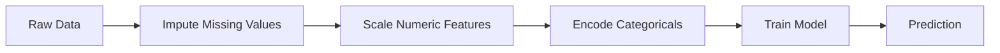
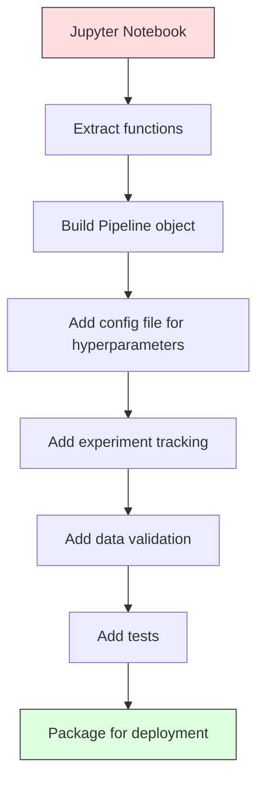

# ML Pipeline

> Model은 product가 아니다. Pipeline이 product다. Pipeline은 raw data부터 deployed prediction까지의 모든 것이며, 모든 step은 재현 가능해야 한다.

**Type:** Build
**Languages:** Python
**Prerequisites:** Phase 2, Lesson 12 (Hyperparameter Tuning)
**Time:** ~120 minutes

## 학습 목표

- imputation, scaling, encoding, model training을 하나의 reproducible object로 연결하는 ML pipeline을 처음부터 만든다
- data leakage scenario를 식별하고, pipeline이 transformer를 training data에만 fit해서 이를 막는 방식을 설명한다
- numeric feature와 categorical feature에 서로 다른 preprocessing을 적용하는 ColumnTransformer를 구성한다
- pipeline serialization을 구현하고, 같은 fitted pipeline이 training과 production에서 동일한 결과를 만든다는 것을 보여준다

## 문제

data를 load하고, missing value를 median으로 채우고, feature를 scale하고, model을 train하고, accuracy를 출력하는 notebook이 있다. 잘 동작한다. 그래서 ship한다.

한 달 뒤, 누군가 model을 다시 train했더니 다른 결과가 나온다. median은 test data를 포함한 full dataset에서 계산되었다(data leakage). scaling parameter는 저장되지 않아서 inference가 다른 statistics를 사용한다. feature engineering code는 training과 serving 사이에 copy-paste되었고, 두 copy가 서로 달라졌다. categorical column에는 production에서 encoder가 한 번도 본 적 없는 새 value가 생겼다.

이것들은 가정이 아니다. ML system이 production에서 실패하는 가장 흔한 이유다. Pipeline은 모든 transformation step을 하나의 ordered, reproducible object로 packaging해서 이 문제들을 모두 해결한다.

## 개념

### Pipeline이란 무엇인가

Pipeline은 data transformation의 ordered sequence 뒤에 model이 붙은 것이다. 각 step은 이전 step의 output을 input으로 받는다. 전체 pipeline은 training data에서 한 번 fit된다. inference time에는 같은 fitted pipeline이 new data를 transform하고 prediction을 만든다.



Pipeline은 다음을 보장한다.
- transformation은 training data에만 fit된다(leakage 없음)
- inference time에 같은 transformation이 적용된다
- 전체 object를 하나의 artifact로 serialize하고 deploy할 수 있다
- cross-validation이 fold마다 pipeline을 적용해 미묘한 leakage를 막는다

### Data Leakage: 조용한 살인자

Data leakage는 test set이나 future data의 information이 training을 오염시킬 때 발생한다. Pipeline은 가장 흔한 형태를 막는다.

**Leaky (잘못됨):**
```python
X = df.drop("target", axis=1)
y = df["target"]

scaler = StandardScaler()
X_scaled = scaler.fit_transform(X)

X_train, X_test = X_scaled[:800], X_scaled[800:]
y_train, y_test = y[:800], y[800:]
```

scaler가 test data를 보았다. mean과 standard deviation에 test sample이 포함된다. 이것은 accuracy estimate를 부풀린다.

**Correct:**
```python
X_train, X_test = X[:800], X[800:]

scaler = StandardScaler()
X_train_scaled = scaler.fit_transform(X_train)
X_test_scaled = scaler.transform(X_test)
```

Pipeline을 사용하면 이 문제를 따로 생각할 필요가 없다. Pipeline이 자동으로 처리한다.

### sklearn Pipeline

sklearn의 `Pipeline`은 transformer와 estimator를 연결한다. 모든 step을 순서대로 적용하는 `.fit()`, `.predict()`, `.score()`를 노출한다.

```python
from sklearn.pipeline import Pipeline
from sklearn.preprocessing import StandardScaler
from sklearn.linear_model import LogisticRegression

pipe = Pipeline([
    ("scaler", StandardScaler()),
    ("model", LogisticRegression()),
])

pipe.fit(X_train, y_train)
predictions = pipe.predict(X_test)
```

`pipe.fit(X_train, y_train)`을 호출하면:
1. Scaler가 X_train에 `fit_transform`을 호출한다
2. Model이 scaled X_train에 `fit`을 호출한다

`pipe.predict(X_test)`를 호출하면:
1. Scaler가 X_test에 `transform`을 호출한다(`fit_transform`이 아니다)
2. Model이 scaled X_test에 `predict`를 호출한다

scaler는 fitting 중에 test data를 절대 보지 않는다. 이것이 핵심이다.

### ColumnTransformer: 서로 다른 Column을 위한 서로 다른 Pipeline

실제 dataset에는 서로 다른 preprocessing이 필요한 numeric column과 categorical column이 있다. `ColumnTransformer`가 이를 처리한다.

```python
from sklearn.compose import ColumnTransformer
from sklearn.preprocessing import StandardScaler, OneHotEncoder
from sklearn.impute import SimpleImputer

numeric_pipe = Pipeline([
    ("impute", SimpleImputer(strategy="median")),
    ("scale", StandardScaler()),
])

categorical_pipe = Pipeline([
    ("impute", SimpleImputer(strategy="most_frequent")),
    ("encode", OneHotEncoder(handle_unknown="ignore")),
])

preprocessor = ColumnTransformer([
    ("num", numeric_pipe, ["age", "income", "score"]),
    ("cat", categorical_pipe, ["city", "gender", "plan"]),
])

full_pipeline = Pipeline([
    ("preprocess", preprocessor),
    ("model", GradientBoostingClassifier()),
])
```

OneHotEncoder의 `handle_unknown="ignore"`는 production에서 중요하다. 새 category가 나타나면(model이 본 적 없는 city), crash하는 대신 zero vector를 만든다.

### Experiment tracking

Pipeline은 training을 reproducible하게 만들지만, experiment 전반에서 무슨 일이 있었는지도 추적해야 한다. 어떤 hyperparameter를 사용했는지, 어떤 dataset version이었는지, metric이 무엇이었는지, 어떤 code가 실행 중이었는지 말이다.

**MLflow**는 가장 흔한 open-source solution이다.

```python
import mlflow

with mlflow.start_run():
    mlflow.log_param("max_depth", 5)
    mlflow.log_param("n_estimators", 100)
    mlflow.log_param("learning_rate", 0.1)

    pipe.fit(X_train, y_train)
    accuracy = pipe.score(X_test, y_test)

    mlflow.log_metric("accuracy", accuracy)
    mlflow.sklearn.log_model(pipe, "model")
```

모든 run은 parameter, metric, artifact, full model과 함께 기록된다. run을 비교하고, 어떤 experiment든 재현하고, 어떤 model version이든 deploy할 수 있다.

**Weights & Biases (wandb)**는 hosted dashboard와 함께 같은 기능을 제공한다.

```python
import wandb

wandb.init(project="my-pipeline")
wandb.config.update({"max_depth": 5, "n_estimators": 100})

pipe.fit(X_train, y_train)
accuracy = pipe.score(X_test, y_test)

wandb.log({"accuracy": accuracy})
```

### Model versioning

Experiment tracking 이후에는 model version을 관리해야 한다. 어떤 model이 production에 있는가? 어떤 것이 staging인가? 지난주 것은 무엇이었는가?

MLflow의 Model Registry는 다음을 제공한다.
- **Version tracking:** 저장된 모든 model에 version number가 붙는다
- **Stage transitions:** "Staging", "Production", "Archived"
- **Approval workflow:** model은 명시적으로 production으로 promote되어야 한다
- **Rollback:** 이전 version으로 즉시 되돌린다

### DVC를 이용한 Data Versioning

Code는 git으로 versioning된다. Data도 versioning되어야 하지만, git은 large file을 처리할 수 없다. DVC(Data Version Control)가 이를 해결한다.

```bash
dvc init
dvc add data/training.csv
git add data/training.csv.dvc data/.gitignore
git commit -m "Track training data"
dvc push
```

DVC는 실제 data를 remote storage(S3, GCS, Azure)에 저장하고, hash를 기록하는 작은 `.dvc` file을 git에 둔다. git commit을 checkout하면 `dvc checkout`이 사용된 정확한 data를 복원한다.

이는 모든 git commit이 code와 data를 함께 pin한다는 뜻이다. 완전한 reproducibility다.

### 재현 가능한 experiment

Reproducible experiment에는 네 가지가 필요하다.

1. **Fixed random seeds:** numpy, random, framework(torch, sklearn)에 seed를 설정한다
2. **Pinned dependencies:** exact version이 있는 requirements.txt 또는 poetry.lock
3. **Versioned data:** DVC 또는 유사 도구
4. **Config files:** 모든 hyperparameter를 hardcoded하지 않고 config에 둔다

```python
import numpy as np
import random

def set_seed(seed=42):
    random.seed(seed)
    np.random.seed(seed)
    try:
        import torch
        torch.manual_seed(seed)
        torch.cuda.manual_seed_all(seed)
        torch.backends.cudnn.deterministic = True
    except ImportError:
        pass
```

### Notebook에서 Production Pipeline까지



일반적인 progression:

1. **Notebook exploration:** 빠른 experiment, visualization, feature idea
2. **Extract functions:** preprocessing, feature engineering, evaluation을 module로 이동
3. **Build Pipeline:** transformation을 sklearn Pipeline 또는 custom class로 연결
4. **Config management:** 모든 hyperparameter를 YAML/JSON config로 이동
5. **Experiment tracking:** MLflow 또는 wandb logging 추가
6. **Data validation:** training 전에 schema, distribution, missing value pattern 확인
7. **Tests:** transformer unit test, full pipeline integration test
8. **Deployment:** pipeline을 serialize하고, API(FastAPI, Flask)로 감싸고, containerize

### 흔한 Pipeline 실수

| 실수 | 왜 나쁜가 | 수정 |
|---------|-------------|-----|
| splitting 전에 full data에 fitting | Data leakage | cross_val_score와 함께 Pipeline 사용 |
| pipeline 밖의 feature engineering | train과 serve에서 transformation이 달라짐 | 모든 transform을 Pipeline 안에 둔다 |
| unknown category를 처리하지 않음 | new value에서 production crash | OneHotEncoder(handle_unknown="ignore") |
| hardcoded column name | schema가 바뀌면 깨짐 | config의 column name list 사용 |
| data validation 없음 | bad data에서 조용히 잘못된 prediction | prediction 전에 schema check 추가 |
| Training/serving skew | model이 prod에서 다른 feature를 봄 | 둘 다 하나의 Pipeline object 사용 |

## 직접 만들기

`code/pipeline.py`의 code는 완전한 ML pipeline을 처음부터 만든다.

### 1단계: Custom Transformer

```python
class CustomTransformer:
    def __init__(self):
        self.means = None
        self.stds = None

    def fit(self, X):
        self.means = np.mean(X, axis=0)
        self.stds = np.std(X, axis=0)
        self.stds[self.stds == 0] = 1.0
        return self

    def transform(self, X):
        return (X - self.means) / self.stds

    def fit_transform(self, X):
        return self.fit(X).transform(X)
```

### 2단계: Pipeline을 처음부터 만들기

```python
class PipelineFromScratch:
    def __init__(self, steps):
        self.steps = steps

    def fit(self, X, y=None):
        X_current = X.copy()
        for name, step in self.steps[:-1]:
            X_current = step.fit_transform(X_current)
        name, model = self.steps[-1]
        model.fit(X_current, y)
        return self

    def predict(self, X):
        X_current = X.copy()
        for name, step in self.steps[:-1]:
            X_current = step.transform(X_current)
        name, model = self.steps[-1]
        return model.predict(X_current)
```

### 3단계: Pipeline을 사용한 Cross-Validation

code는 pipeline을 사용한 cross-validation이 data leakage를 어떻게 막는지 보여준다. scaler는 각 fold의 training data에 별도로 fit된다.

### 4단계: sklearn을 사용한 Full Production Pipeline

`ColumnTransformer`, 여러 preprocessing path, model을 포함한 완전한 pipeline이며, 올바른 cross-validation과 experiment logging으로 train된다.

## 내보내기

이 lesson은 다음을 만든다.
- `outputs/prompt-ml-pipeline.md` -- ML pipeline을 build하고 debug하기 위한 skill
- `code/pipeline.py` -- scratch부터 sklearn까지 이어지는 완전한 pipeline

## 연습문제

1. numeric column 3개와 categorical column 2개가 있는 dataset을 처리하는 pipeline을 만든다. `ColumnTransformer`를 사용해 numeric에는 median imputation + scaling을, categorical에는 most-frequent imputation + one-hot encoding을 적용한다. 5-fold cross-validation으로 train한다.

2. 의도적으로 data leakage를 넣는다. splitting 전에 full dataset에 scaler를 fit한다. cross-validation score(leaky)와 pipeline cross-validation score(clean)를 비교한다. 차이가 얼마나 큰가?

3. `joblib.dump`로 pipeline을 serialize한다. 별도 script에서 load하고 prediction을 실행한다. prediction이 동일한지 확인한다.

4. 가장 중요한 numeric column 두 개에 polynomial feature(degree 2)를 만드는 custom transformer를 pipeline에 추가한다. pipeline의 어디에 들어가야 하는가?

5. pipeline에 MLflow tracking을 설정한다. 서로 다른 hyperparameter로 5개 experiment를 실행한다. MLflow UI(`mlflow ui`)를 사용해 run을 비교하고 best model을 고른다.

## 핵심 용어

| 용어 | 사람들이 말하는 것 | 실제 의미 |
|------|----------------|----------------------|
| Pipeline | "Transform + model의 chain" | leakage를 막기 위해 하나의 unit으로 적용되는 fitted transformer와 model의 ordered sequence |
| Data leakage | "Test info가 training에 leak됨" | training set 밖의 information을 사용해 model을 만들어 performance estimate를 부풀리는 것 |
| ColumnTransformer | "Column마다 다른 preprocessing" | 서로 다른 column subset에 서로 다른 pipeline을 적용하고 결과를 결합함 |
| Experiment tracking | "Run logging" | 모든 training run의 parameter, metric, artifact, code version을 기록함 |
| MLflow | "Track and deploy models" | experiment tracking, model registry, deployment를 위한 open-source platform |
| DVC | "Data를 위한 Git" | large data file의 version control system으로, hash는 git에 저장하고 data는 remote storage에 저장함 |
| Model registry | "Model version catalog" | stage label(staging, production, archived)과 함께 model version을 추적하는 system |
| Training/serving skew | "Notebook에서는 됐는데" | training과 inference에서 data processing 방식이 달라져 조용한 error를 일으키는 차이 |
| Reproducibility | "Same code, same result" | 같은 code, data, configuration에서 동일한 결과를 얻을 수 있는 능력 |

## 더 읽을거리

- [scikit-learn Pipeline docs](https://scikit-learn.org/stable/modules/compose.html) -- 공식 pipeline reference
- [MLflow documentation](https://mlflow.org/docs/latest/index.html) -- experiment tracking과 model registry
- [DVC documentation](https://dvc.org/doc) -- data versioning
- [Sculley et al., Hidden Technical Debt in Machine Learning Systems (2015)](https://papers.nips.cc/paper/2015/hash/86df7dcfd896fcaf2674f757a2463eba-Abstract.html) -- ML system complexity에 대한 seminal paper
- [Google ML Best Practices: Rules of ML](https://developers.google.com/machine-learning/guides/rules-of-ml) -- practical production ML advice
