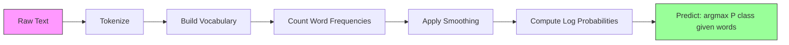

# Naive Bayes

> "naive" assumption은 틀렸지만 그래도 동작한다. 그 점이 아름답다.

**Type:** Build
**Languages:** Python
**Prerequisites:** Phase 2, Lessons 01-07 (classification, Bayes' theorem)
**Time:** ~75 minutes

## 학습 목표

- text classification을 위해 Laplace smoothing을 적용한 Multinomial Naive Bayes를 처음부터 구현한다
- naive independence assumption이 수학적으로 틀렸지만 실제로는 올바른 class ranking을 만드는 이유를 설명한다
- Multinomial, Bernoulli, Gaussian Naive Bayes variant를 비교하고 주어진 feature type에 맞는 것을 선택한다
- high-dimensional sparse data에서 Naive Bayes를 logistic regression과 비교하고, 작동 중인 bias-variance tradeoff를 설명한다

## 문제

text를 classify해야 한다. Email을 spam 또는 not-spam으로 나눈다. Customer review를 positive 또는 negative로 나눈다. Support ticket을 category로 나눈다. feature는 수천 개(word당 하나)이고 training data는 제한적이다.

대부분의 classifier는 여기서 막힌다. Logistic regression은 수천 개 weight를 안정적으로 estimate할 만큼 충분한 sample이 필요하다. Decision tree는 한 번에 word 하나로 split하고 심하게 overfit한다. 10,000 dimension에서 KNN은 모든 point가 다른 모든 point에서 비슷하게 멀기 때문에 의미가 없다.

Naive Bayes는 이를 처리한다. 수학적으로 틀린 assumption(class가 주어졌을 때 모든 feature가 서로 독립이라는 assumption)을 만들지만, text classification에서는 특히 small training set에서 "더 똑똑한" model보다 나은 성능을 내기도 한다. data를 한 번 통과하는 것으로 train된다. 수백만 feature까지 scale된다. probability estimate를 만들지만(independence assumption 때문에 calibration은 종종 좋지 않다).

틀린 assumption이 좋은 prediction으로 이어지는 이유를 이해하면 machine learning의 근본을 배운다. best model은 가장 정확한 model이 아니라, 당신의 data에 대해 bias-variance tradeoff가 가장 좋은 model이다.

## 개념

### Bayes' Theorem (빠른 복습)

Bayes' theorem은 conditional probability를 뒤집는다.

```text
P(class | features) = P(features | class) * P(class) / P(features)
```

우리가 원하는 것은 `P(class | features)`다. 즉 document가 그 안의 word를 기준으로 어떤 class에 속할 probability다. 이것은 다음에서 계산할 수 있다.
- `P(features | class)` -- 이 class의 document에서 이런 word를 볼 likelihood
- `P(class)` -- class의 prior probability(spam은 일반적으로 얼마나 흔한가?)
- `P(features)` -- evidence이며 모든 class에서 같으므로 비교할 때 무시할 수 있다

가장 높은 `P(class | features)`를 가진 class가 이긴다.

### Naive Independence Assumption이란 무엇인가

`P(features | class)`를 정확히 계산하려면 모든 feature가 함께 나타나는 joint probability를 estimate해야 한다. vocabulary가 10,000 word라면 2^10,000개의 가능한 combination에 대한 distribution을 estimate해야 한다. 불가능하다.

naive assumption: 모든 feature는 class가 주어졌을 때 conditionally independent다.

```text
P(w1, w2, ..., wn | class) = P(w1 | class) * P(w2 | class) * ... * P(wn | class)
```

하나의 불가능한 joint distribution 대신 n개의 simple per-feature distribution을 estimate한다. 각각은 count만 있으면 된다.

이 assumption은 명백히 틀렸다. "machine"과 "learning"이라는 word는 어떤 document에서도 독립이 아니다. 하지만 classifier에는 정확한 probability estimate가 필요하지 않다. 필요한 것은 올바른 ranking, 즉 어떤 class의 probability가 가장 높은지다. independence assumption은 systematic error를 만들지만, 그 error가 모든 class에 비슷하게 영향을 주기 때문에 ranking은 유지된다.

### 그래도 동작하는 이유

세 가지 이유가 있다.

1. **calibration보다 ranking.** Classification에는 top-ranked class가 맞으면 된다. true probability가 0.7인데 P(spam) = 0.99999라고 해도 classifier는 여전히 spam을 올바르게 고른다. 정확한 probability가 필요한 것이 아니다. 올바른 winner가 필요하다.

2. **High bias, low variance.** independence assumption은 강한 prior다. model을 강하게 constrain해서 overfitting을 막는다. training data가 제한적이면 조금 틀렸지만 안정적인 model이 이론적으로 맞지만 매우 불안정한 model을 이긴다. 이것이 작동 중인 bias-variance tradeoff다.

3. **Feature redundancy가 상쇄된다.** Correlated feature는 redundant evidence를 제공한다. classifier는 이 evidence를 double-count하지만, 올바른 class에 대해서도 double-count한다. "machine"과 "learning"이 항상 함께 나타난다면 둘 다 "tech" class에 대한 evidence를 제공한다. NB는 둘을 두 번 count하지만, right class에 대해 두 번 count한다.

네 번째 practical reason도 있다. Naive Bayes는 매우 빠르다. Training은 frequency를 count하면서 data를 한 번 통과하는 일이다. Prediction은 matrix multiplication이다. 백만 document에서도 몇 초 만에 train할 수 있다. 이 speed 덕분에 더 빠르게 iterate하고, 더 많은 feature set을 시도하고, 느린 model보다 더 많은 experiment를 실행할 수 있다.

### 수학을 단계별로 보기

concrete example을 따라가 보자. class가 두 개 있다고 하자: spam과 not-spam. vocabulary에는 세 word가 있다: "free", "money", "meeting".

Training data:
- Spam email은 "free"를 80번, "money"를 60번, "meeting"을 10번 언급한다(총 150 word)
- Not-spam email은 "free"를 5번, "money"를 10번, "meeting"을 100번 언급한다(총 115 word)
- email의 40%는 spam이고, 60%는 not-spam이다

Laplace smoothing(alpha=1)을 사용하면:

```text
P(free | spam)    = (80 + 1) / (150 + 3) = 81/153 = 0.529
P(money | spam)   = (60 + 1) / (150 + 3) = 61/153 = 0.399
P(meeting | spam) = (10 + 1) / (150 + 3) = 11/153 = 0.072

P(free | not-spam)    = (5 + 1) / (115 + 3) = 6/118 = 0.051
P(money | not-spam)   = (10 + 1) / (115 + 3) = 11/118 = 0.093
P(meeting | not-spam) = (100 + 1) / (115 + 3) = 101/118 = 0.856
```

New email contains: "free" (2 times), "money" (1 time), "meeting" (0 times).

```text
log P(spam | email) = log(0.4) + 2*log(0.529) + 1*log(0.399) + 0*log(0.072)
                    = -0.916 + 2*(-0.637) + (-0.919) + 0
                    = -3.109

log P(not-spam | email) = log(0.6) + 2*log(0.051) + 1*log(0.093) + 0*log(0.856)
                        = -0.511 + 2*(-2.976) + (-2.375) + 0
                        = -8.838
```

Spam이 큰 margin으로 이긴다. "free"라는 word가 두 번 나타난 것은 spam에 대한 강한 evidence다. "meeting"이 나타나지 않은 것은 두 log sum 모두에 0을 더한다(0 * log(P)). Multinomial NB에서는 absent word가 영향을 주지 않는다. word absence를 명시적으로 model하는 것은 Bernoulli NB다.

### 세 가지 Variant

Naive Bayes에는 세 가지 flavor가 있다. 각각은 `P(feature | class)`를 다르게 model한다.

#### Multinomial Naive Bayes

각 feature를 count로 model한다. feature가 word frequency나 TF-IDF value인 text data에 가장 적합하다.

```text
P(word_i | class) = (count of word_i in class + alpha) / (total words in class + alpha * vocab_size)
```

`alpha`는 Laplace smoothing이다(아래에서 설명). 이 variant는 text classification의 workhorse다.

#### Gaussian Naive Bayes

각 feature를 normal distribution으로 model한다. continuous feature에 가장 적합하다.

```text
P(x_i | class) = (1 / sqrt(2 * pi * var)) * exp(-(x_i - mean)^2 / (2 * var))
```

각 class는 feature마다 자체 mean과 variance를 가진다. feature가 각 class 안에서 실제로 bell curve를 따를 때 잘 작동한다.

#### Bernoulli Naive Bayes

각 feature를 binary(present or absent)로 model한다. short text나 binary feature vector에 가장 적합하다.

```text
P(word_i | class) = (docs in class containing word_i + alpha) / (total docs in class + 2 * alpha)
```

Multinomial과 달리 Bernoulli는 word absence를 명시적으로 penalize한다. "free"가 보통 spam에 나타나지만 이 email에는 없다면, Bernoulli는 그것을 spam에 반대되는 evidence로 count한다.

### 각 Variant를 언제 사용할까

| Variant | Feature Type | 가장 적합한 용도 | 예시 |
|---------|-------------|----------|---------|
| Multinomial | Count 또는 frequency | Text classification, bag-of-words | Email spam, topic classification |
| Gaussian | Continuous value | normal에 가까운 feature가 있는 tabular data | Iris classification, sensor data |
| Bernoulli | Binary (0/1) | Short text, binary feature vector | SMS spam, presence/absence feature |

### Laplace smoothing

test data에는 나타났지만 특정 class의 training data에는 한 번도 나타난 적 없는 word가 있으면 어떻게 될까?

smoothing이 없으면: `P(word | class) = 0/N = 0`. 전체 product에 zero 하나가 곱해져 `P(class | features) = 0`이 된다. 다른 evidence가 얼마나 강하든 상관없다. unseen word 하나가 전체 prediction을 망친다.

Laplace smoothing은 모든 feature count에 작은 count `alpha`(보통 1)를 더한다.

```text
P(word_i | class) = (count(word_i, class) + alpha) / (total_words_in_class + alpha * vocab_size)
```

alpha=1이면 모든 word가 최소한 작은 probability를 가진다. test email에 "discombobulate"가 나타나도 더 이상 spam probability를 죽이지 않는다. smoothing에는 Bayesian interpretation이 있다. word distribution에 uniform Dirichlet prior를 두는 것과 같다.

alpha가 높을수록 stronger smoothing(more uniform distribution)을 뜻한다. alpha가 낮을수록 model은 data를 더 신뢰한다. Alpha는 tune하는 hyperparameter다.

alpha의 effect:

| Alpha | Effect | 사용할 때 |
|-------|--------|-------------|
| 0.001 | 거의 smoothing 없음, data를 신뢰 | 매우 큰 training set, unseen feature가 예상되지 않음 |
| 0.1 | Light smoothing | 큰 training set |
| 1.0 | Standard Laplace smoothing | default starting point |
| 10.0 | Heavy smoothing, distribution을 flatten | 매우 작은 training set, unseen feature가 많을 것으로 예상 |

### Log-Space 계산

수백 개 probability(각각 1보다 작음)를 곱하면 floating-point underflow가 발생한다. true value는 매우 작은 positive number인데도 floating point에서는 product가 zero가 된다.

해결책: log space에서 작업한다. probability를 곱하는 대신 logarithm을 더한다.

```text
log P(class | x1, x2, ..., xn) = log P(class) + sum_i log P(xi | class)
```

이것은 prediction을 dot product로 바꾼다.

```text
log_scores = X @ log_feature_probs.T + log_class_priors
prediction = argmax(log_scores)
```

Matrix multiplication. 그래서 Naive Bayes prediction이 빠르다. single-layer linear model과 같은 operation이다.

### Naive Bayes와 Logistic Regression

둘 다 text를 위한 linear classifier다. 차이는 무엇을 model하는지에 있다.

| 관점 | Naive Bayes | Logistic Regression |
|--------|------------|-------------------|
| 유형 | Generative (P(X\|Y)를 model) | Discriminative (P(Y\|X)를 model) |
| Training | frequency count | loss function optimize |
| Small data | 더 나음(strong prior가 도움) | 더 나쁨(weight를 estimate하기에 부족) |
| Large data | 더 나쁨(wrong assumption이 방해) | 더 나음(flexible boundary) |
| Feature | independence를 assume | correlation을 처리 |
| 속도 | single pass, 매우 빠름 | iterative optimization |
| Calibration | probability가 poor | probability가 더 나음 |

경험칙: Naive Bayes로 시작한다. data가 충분하고 NB가 plateau에 도달하면 logistic regression으로 전환한다.

### Classification pipeline



실제로는 floating-point underflow를 피하기 위해 log space에서 작업한다. 많은 작은 probability를 곱하는 대신 logarithm을 더한다.

```text
log P(class | features) = log P(class) + sum_i log P(feature_i | class)
```

```figure
naive-bayes
```

## 직접 만들기

`code/naive_bayes.py`의 code는 MultinomialNB와 GaussianNB를 모두 처음부터 구현한다.

### MultinomialNB

from-scratch implementation:

1. **fit(X, y)**: 각 class에 대해 각 feature의 frequency를 count한다. Laplace smoothing을 더한다. log probability를 계산한다. class prior(class frequency의 log)를 저장한다.

2. **predict_log_proba(X)**: 각 sample에 대해 모든 class의 log P(class) + sum of log P(feature_i | class)를 계산한다. 이것은 matrix multiplication이다: X @ log_probs.T + log_priors.

3. **predict(X)**: log probability가 가장 높은 class를 반환한다.

```python
class MultinomialNB:
    def __init__(self, alpha=1.0):
        self.alpha = alpha

    def fit(self, X, y):
        classes = np.unique(y)
        n_classes = len(classes)
        n_features = X.shape[1]

        self.classes_ = classes
        self.class_log_prior_ = np.zeros(n_classes)
        self.feature_log_prob_ = np.zeros((n_classes, n_features))

        for i, c in enumerate(classes):
            X_c = X[y == c]
            self.class_log_prior_[i] = np.log(X_c.shape[0] / X.shape[0])
            counts = X_c.sum(axis=0) + self.alpha
            self.feature_log_prob_[i] = np.log(counts / counts.sum())

        return self
```

핵심 insight: fitting 후 prediction은 matrix multiplication에 bias를 더하는 것뿐이다. 그래서 Naive Bayes가 빠르다.

### GaussianNB

continuous feature에 대해서는 class별, feature별 mean과 variance를 estimate한다.

```python
class GaussianNB:
    def __init__(self):
        pass

    def fit(self, X, y):
        classes = np.unique(y)
        self.classes_ = classes
        self.means_ = np.zeros((len(classes), X.shape[1]))
        self.vars_ = np.zeros((len(classes), X.shape[1]))
        self.priors_ = np.zeros(len(classes))

        for i, c in enumerate(classes):
            X_c = X[y == c]
            self.means_[i] = X_c.mean(axis=0)
            self.vars_[i] = X_c.var(axis=0) + 1e-9
            self.priors_[i] = X_c.shape[0] / X.shape[0]

        return self
```

Prediction은 feature별 Gaussian PDF를 사용하고, 이를 feature 전반에 곱한다(log space에서는 더한다).

### 데모: Text Classification

code는 두 class(tech article vs sports article)를 simulation하는 synthetic bag-of-words data를 생성한다. 각 class는 서로 다른 word frequency distribution을 가진다. MultinomialNB는 word count를 사용해 이를 classify한다.

synthetic data는 이렇게 동작한다. 200개의 "word"(feature column)를 만든다. Word 0-39는 tech article에서 high frequency이고 sports에서는 low frequency다. Word 80-119는 sports에서 high frequency이고 tech에서는 low frequency다. Word 40-79는 둘 다 medium frequency다. 이렇게 일부 word는 강한 class indicator이고 다른 word는 noise인 realistic scenario가 만들어진다.

### 데모: Continuous Features

code는 Iris-like data(3 class, 4 feature, Gaussian cluster)를 생성한다. GaussianNB는 per-class mean과 variance를 사용해 classify한다. 각 class는 다른 center(mean vector)와 다른 spread(variance)를 가지며, measurement가 category 사이에서 systematic하게 다른 real-world data를 흉내 낸다.

code는 또한 다음을 보여준다.
- **Smoothing comparison:** smoothing strength가 accuracy에 미치는 effect를 보여주기 위해 서로 다른 alpha value로 MultinomialNB를 train한다.
- **Training size experiment:** training data가 20 sample에서 1600 sample로 늘어날 때 NB accuracy가 어떻게 개선되는지 보여준다. NB는 아주 적은 sample에서도 괜찮은 accuracy에 도달한다. 이것이 주요 장점이다.
- **Confusion matrix:** NB가 어디서 mistake하는지 보여주기 위한 class별 precision, recall, F1 score.

### Prediction 속도

Naive Bayes prediction은 matrix multiplication이다. n sample, d feature, k class에 대해:
- MultinomialNB: matrix multiply 한 번 (n x d) @ (d x k) = O(n * d * k)
- GaussianNB: n * k Gaussian PDF evaluation, 각각 d feature에 대해 = O(n * d * k)

둘 다 모든 dimension에 linear하다. 이것을 KNN(모든 training point에 대한 distance computation 필요)이나 RBF kernel SVM(모든 support vector에 대한 kernel evaluation 필요)과 비교해 보라. NB는 prediction time에 orders of magnitude만큼 더 빠르다.

## 활용하기

sklearn에서는 두 variant 모두 one-liner다.

```python
from sklearn.naive_bayes import GaussianNB, MultinomialNB

gnb = GaussianNB()
gnb.fit(X_train, y_train)
print(f"GaussianNB accuracy: {gnb.score(X_test, y_test):.3f}")

mnb = MultinomialNB(alpha=1.0)
mnb.fit(X_train_counts, y_train)
print(f"MultinomialNB accuracy: {mnb.score(X_test_counts, y_test):.3f}")
```

sklearn을 사용한 text classification:

```python
from sklearn.feature_extraction.text import CountVectorizer
from sklearn.naive_bayes import MultinomialNB
from sklearn.pipeline import Pipeline

text_clf = Pipeline([
    ("vectorizer", CountVectorizer()),
    ("classifier", MultinomialNB(alpha=1.0)),
])

text_clf.fit(train_texts, train_labels)
accuracy = text_clf.score(test_texts, test_labels)
```

`naive_bayes.py`의 code는 correctness를 verify하기 위해 같은 data에서 from-scratch implementation을 sklearn과 비교한다.

### Naive Bayes와 TF-IDF

raw word count는 occurrence마다 모든 word에 같은 weight를 준다. 하지만 "the"와 "is" 같은 common word는 모든 class에 자주 나타난다. information을 담지 않는다. TF-IDF(Term Frequency - Inverse Document Frequency)는 common word를 downweight하고 rare, discriminative word를 upweight한다.

```python
from sklearn.feature_extraction.text import TfidfVectorizer
from sklearn.naive_bayes import MultinomialNB
from sklearn.pipeline import Pipeline

text_clf = Pipeline([
    ("tfidf", TfidfVectorizer()),
    ("classifier", MultinomialNB(alpha=0.1)),
])
```

TF-IDF value는 non-negative이므로 MultinomialNB와 함께 동작한다. TF-IDF + MultinomialNB 조합은 text classification에서 가장 강력한 baseline 중 하나다. training sample이 10,000개보다 적은 dataset에서는 더 복잡한 model을 자주 이긴다.

### Short Text를 위한 BernoulliNB

short text(tweet, SMS, chat message)에서는 BernoulliNB가 MultinomialNB보다 나을 수 있다. Short text는 word count가 낮기 때문에 MultinomialNB가 의존하는 frequency information이 noisy하다. BernoulliNB는 presence or absence만 신경 쓰며, short text에서는 이것이 더 reliable하다.

```python
from sklearn.naive_bayes import BernoulliNB
from sklearn.feature_extraction.text import CountVectorizer

text_clf = Pipeline([
    ("vectorizer", CountVectorizer(binary=True)),
    ("classifier", BernoulliNB(alpha=1.0)),
])
```

CountVectorizer의 `binary=True` flag는 모든 count를 0/1로 변환한다. 이것이 없으면 BernoulliNB도 동작하긴 하지만, 설계 대상이 아닌 count를 보게 된다.

### NB Probability 보정하기

NB probability는 calibration이 좋지 않다. NB가 P(spam) = 0.95라고 말해도 true probability는 0.7일 수 있다. reliable probability estimate가 필요하다면(예: threshold를 설정하거나 다른 model과 결합하기 위해), sklearn의 CalibratedClassifierCV를 사용한다.

```python
from sklearn.calibration import CalibratedClassifierCV

calibrated_nb = CalibratedClassifierCV(MultinomialNB(), cv=5, method="sigmoid")
calibrated_nb.fit(X_train, y_train)
proba = calibrated_nb.predict_proba(X_test)
```

이것은 cross-validation을 사용해 NB의 raw score 위에 logistic regression을 fit한다. resulting probability는 true class frequency에 훨씬 가까워진다.

### 흔한 함정

1. **Negative feature values.** MultinomialNB는 non-negative feature가 필요하다. negative value가 있다면(특정 setting의 TF-IDF나 standardized feature처럼), GaussianNB를 대신 사용하거나 feature를 positive가 되도록 shift한다.

2. **Zero variance features.** GaussianNB는 variance로 나눈다. 어떤 feature가 class에서 zero variance를 가지면(모든 value가 동일), probability computation이 깨진다. code는 이를 막기 위해 모든 variance에 작은 smoothing term(1e-9)을 더한다.

3. **Class imbalance.** email의 99%가 not-spam이면 prior P(not-spam) = 0.99가 너무 강해서 likelihood evidence를 압도한다. class prior를 수동으로 설정하거나 sklearn의 class_prior parameter를 사용할 수 있다.

4. **Feature scaling.** MultinomialNB는 scaling이 필요 없다(count에서 동작한다). GaussianNB도 scaling이 필요 없다(per-feature statistics를 estimate한다). 이것은 feature scale에 민감한 logistic regression과 SVM에 비한 장점이다.

## 내보내기

이 lesson은 다음을 만든다.
- `outputs/skill-naive-bayes-chooser.md` -- 올바른 NB variant를 선택하기 위한 decision skill
- `code/naive_bayes.py` -- scratch로 만든 MultinomialNB와 GaussianNB, sklearn comparison 포함

### Naive Bayes가 실패할 때

NB는 independence assumption이 incorrect probability뿐 아니라 incorrect ranking을 만들 때 실패한다. 이는 다음 상황에서 발생한다.

1. **Strong feature interactions.** class가 두 feature의 combination에 의존하지만 각각에는 의존하지 않는다면(XOR-like pattern), NB는 이를 완전히 놓친다. 각 feature alone은 evidence를 제공하지 않고, NB는 이를 nonlinear하게 combine할 수 없다.

2. **opposing evidence를 가진 highly correlated features.** feature A는 "spam"이라고 말하고 feature B는 "not-spam"이라고 말하지만, A와 B가 perfectly correlated라면(현실에서는 항상 agree), NB는 실제로는 없는 conflicting evidence를 본다.

3. **Very large training sets.** data가 충분하면 logistic regression 같은 discriminative model이 true decision boundary를 학습하고 NB보다 나은 성능을 낸다. small data에서 도움을 주던 independence assumption이 이제 model을 붙잡는다.

실제로 text classification에서는 이런 failure mode가 드물다. Text feature는 많고, 개별적으로 약하며, independence assumption의 error는 서로 상쇄되는 경향이 있다. strongly correlated feature가 적은 tabular data에서는 logistic regression이나 tree-based model을 먼저 고려한다.

## 연습문제

1. **Smoothing experiment.** alpha 값 0.01, 0.1, 1.0, 10.0, 100.0으로 text data에서 MultinomialNB를 train한다. accuracy vs alpha를 plot한다. performance peak는 어디인가? alpha가 매우 높으면 왜 해로운가?

2. **Feature independence test.** real text dataset을 사용한다. 명백히 correlated된 두 word("machine"과 "learning")를 고른다. P(word1 | class) * P(word2 | class)를 계산하고 P(word1 AND word2 | class)와 비교한다. independence assumption은 얼마나 틀렸는가? classification accuracy에 영향을 주는가?

3. **Bernoulli implementation.** code에 BernoulliNB class를 추가한다. bag-of-words를 binary(present/absent)로 변환하고 text data에서 MultinomialNB와 accuracy를 비교한다. Bernoulli는 언제 이기는가?

4. **NB vs Logistic Regression.** text data에서 둘 다 train한다. training sample 100개로 시작해 10,000개까지 늘린다. 두 model의 training set size 대비 accuracy를 plot한다. 어느 지점에서 Logistic Regression이 Naive Bayes를 추월하는가?

5. **Spam filter.** complete spam classifier를 만든다. raw email text를 tokenize하고, vocabulary를 만들고, bag-of-words feature를 만들고, MultinomialNB를 train하고, precision과 recall로 evaluate한다(accuracy만 사용하지 말 것. 왜인가?).

## 핵심 용어

| 용어 | 사람들이 말하는 것 | 실제 의미 |
|------|----------------|----------------------|
| Naive Bayes | "간단한 probabilistic classifier" | feature가 class가 주어졌을 때 conditionally independent라는 assumption으로 Bayes' theorem을 적용하는 classifier |
| Conditional independence | "Feature들이 서로 영향을 주지 않음" | P(A, B \| C) = P(A \| C) * P(B \| C) -- C를 알고 나면 B를 아는 것이 A에 대한 새 정보를 주지 않음 |
| Laplace smoothing | "Add-one smoothing" | zero probability가 prediction을 지배하지 못하게 모든 feature에 작은 count를 더함 |
| Prior | "data를 보기 전에 믿었던 것" | P(class) -- feature를 관측하기 전 각 class의 probability |
| Likelihood | "data가 얼마나 잘 맞는가" | P(features \| class) -- class를 알고 있을 때 이런 feature를 관측할 probability |
| Posterior | "data를 본 뒤 믿는 것" | P(class \| features) -- feature를 관측한 뒤 class에 대해 update된 probability |
| Generative model | "data가 생성되는 방식을 model" | P(X \| Y)와 P(Y)를 학습한 뒤 Bayes' theorem을 사용해 P(Y \| X)를 얻는 model |
| Discriminative model | "decision boundary를 model" | X가 어떻게 generated되는지 model하지 않고 P(Y \| X)를 직접 학습하는 model |
| Log probability | "underflow를 피함" | 많은 작은 number의 product가 floating point에서 zero가 되는 것을 막기 위해 P 대신 log P로 작업 |

## 더 읽을거리

- [scikit-learn Naive Bayes docs](https://scikit-learn.org/stable/modules/naive_bayes.html) -- 세 variant와 mathematical detail
- [McCallum and Nigam, A Comparison of Event Models for Naive Bayes Text Classification (1998)](https://www.cs.cmu.edu/~knigam/papers/multinomial-aaaiws98.pdf) -- text에서 Multinomial vs Bernoulli를 비교한 classic paper
- [Rennie et al., Tackling the Poor Assumptions of Naive Bayes Text Classifiers (2003)](https://people.csail.mit.edu/jrennie/papers/icml03-nb.pdf) -- text를 위한 NB improvement
- [Ng and Jordan, On Discriminative vs. Generative Classifiers (2001)](https://ai.stanford.edu/~ang/papers/nips01-discriminativegenerative.pdf) -- data가 적을 때 NB가 LR보다 빠르게 converge함을 증명
