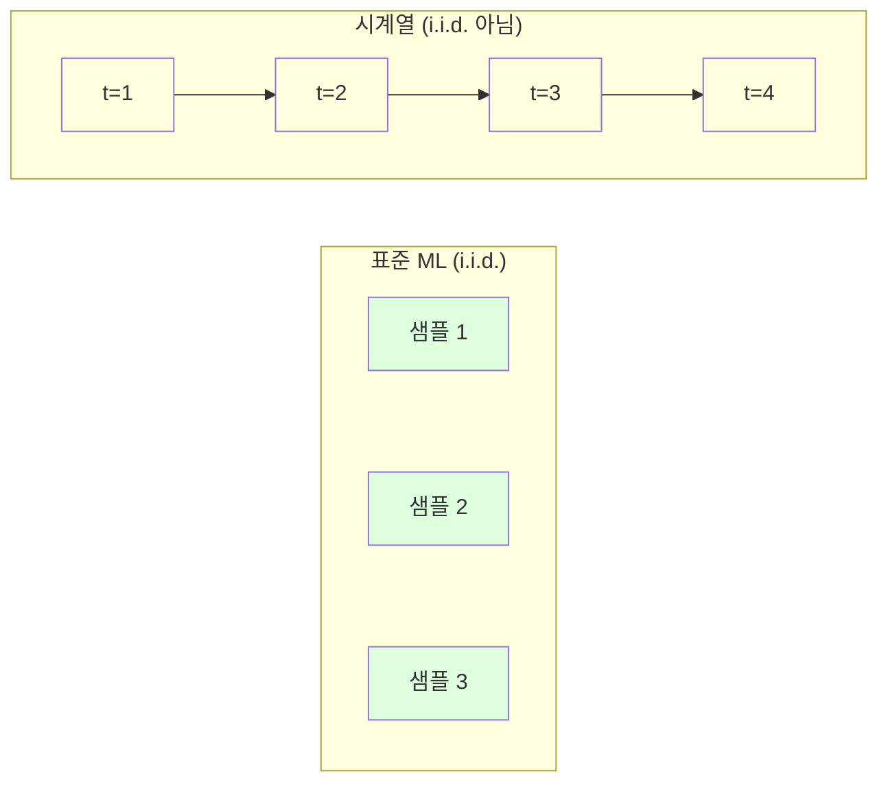
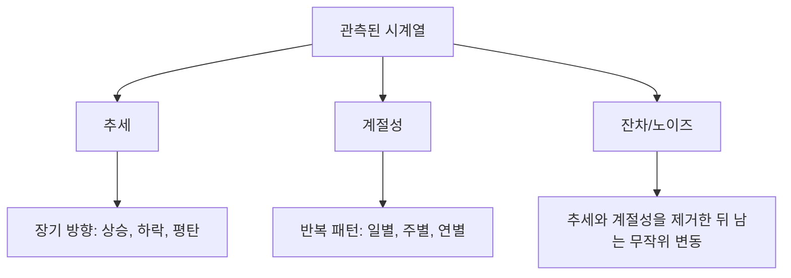
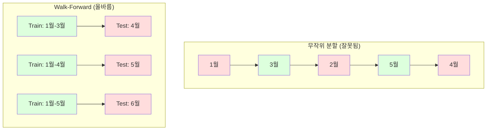

# 시계열 기초

> 정상성을 먼저 확인한다면, 과거 성과는 미래 결과를 예측한다.

**Type:** Build
**Languages:** Python
**Prerequisites:** Phase 2, Lessons 01-09
**Time:** ~90 minutes

## 학습 목표

- 시계열을 추세, 계절성, 잔차 성분으로 분해하고 정상성을 검정한다
- 지연 특징과 이동 통계를 구현해 시계열을 지도 학습 문제로 변환한다
- 미래 데이터가 학습에 새어 들어가지 않도록 방지하는 walk-forward 검증 프레임워크를 구축한다
- 무작위 train/test 분할이 시계열에 왜 유효하지 않은지 설명하고, 올바른 시간 기반 분할과 비교했을 때의 성능 차이를 보여준다

## 문제

시간 순서가 있는 데이터가 있다. 일별 매출, 시간별 기온, 분 단위 CPU 사용량, 주별 주가. 다음 값, 다음 주, 다음 분기를 예측하고 싶다.

표준 ML 도구 상자에 손이 간다. 무작위 train/test 분할, 교차 검증, 특징 행렬 입력, 예측 출력. 모든 단계가 틀렸다.

시계열은 표준 ML이 의존하는 가정을 깨뜨린다. 샘플은 독립적이지 않다. 오늘의 기온은 어제의 기온에 의존한다. 무작위 분할은 미래 정보를 과거로 누출한다. 백테스트에서는 좋아 보이는 특징이 시간이 지나며 바뀌는 패턴에 의존하기 때문에 운영 환경에서는 실패한다.

무작위 교차 검증에서 95% 정확도를 얻는 모델이 올바른 시간 기반 평가에서는 55%를 얻을 수 있다. 이 차이는 기술적 세부 사항이 아니다. 문서상으로만 작동하는 모델과 운영 환경에서 작동하는 모델의 차이다.

이 수업은 기본기를 다룬다. 시간 데이터가 무엇이 다른지, 모델을 정직하게 평가하는 방법, 그리고 시계열을 표준 ML 모델이 소비할 수 있는 특징으로 바꾸는 방법이다.

## 개념

### 시계열이 다른 이유

표준 ML은 i.i.d., 즉 독립 동일 분포를 가정한다. 각 샘플은 같은 분포에서 뽑히며 다른 샘플과 독립적이다. 시계열은 둘 다 위반한다.

- **독립적이지 않다.** 오늘의 주가는 어제의 주가에 의존한다. 이번 주 매출은 지난주 매출과 상관된다.
- **동일하게 분포하지 않는다.** 분포는 시간이 지나며 바뀐다. 12월의 매출은 3월의 매출과 다르게 보인다.

이 위반은 사소하지 않다. 특징을 만드는 방법, 모델을 평가하는 방법, 어떤 알고리즘이 작동하는지를 바꾼다.



표준 ML에서는 샘플을 서로 바꿔도 된다. 섞어도 아무것도 달라지지 않는다. 시계열에서는 순서가 전부다. 섞으면 신호가 파괴된다.

### 시계열의 성분

모든 시계열은 다음의 조합이다.



- **추세**: 장기 방향. 매출이 매년 10% 성장한다. 지구 평균 기온이 상승한다.
- **계절성**: 고정된 간격에서 반복되는 패턴. 소매 매출은 12월에 급증한다. 에어컨 사용량은 7월에 정점을 찍는다.
- **잔차**: 추세와 계절성을 제거한 뒤 남는 모든 것. 잔차가 백색 잡음처럼 보이면 분해가 신호를 잘 포착한 것이다.

### 정상성

시계열은 통계적 속성(평균, 분산, 자기상관)이 시간이 지나도 변하지 않을 때 정상적이라고 한다. 대부분의 예측 방법은 정상성을 가정한다.

**중요한 이유:** 비정상 시계열은 평균이 드리프트한다. 1월 데이터로 학습한 모델은 2월에 나타날 평균과 다른 평균을 학습한 것이다. 모델은 체계적으로 틀리게 된다.

**확인 방법:** 창을 두고 이동 평균과 이동 표준편차를 계산한다. 이들이 드리프트하면 시계열은 비정상이다.

**고치는 방법:** 차분. 원시 값을 모델링하는 대신 연속된 값 사이의 변화를 모델링한다.

```text
diff[t] = value[t] - value[t-1]
```

한 번의 차분으로 시계열이 정상화되지 않으면 다시 적용한다(2차 차분). 현실의 대부분 시계열은 많아야 두 번이면 충분하다.

**예:**

원본 시계열: [100, 102, 106, 112, 120]
1차 차분:  [2, 4, 6, 8] (여전히 상승 추세)
2차 차분:  [2, 2, 2] (상수 -- 정상)

원본 시계열에는 2차 추세가 있었다. 1차 차분은 그것을 선형 추세로 바꾸었다. 2차 차분은 평탄하게 만들었다. 실제로는 두 번 넘게 필요한 경우가 드물다.

**형식적 검정:** Augmented Dickey-Fuller (ADF) 검정은 정상성에 대한 표준 통계 검정이다. 귀무가설은 "시계열이 비정상이다"이다. p-value가 0.05보다 낮으면 귀무가설을 기각하고 정상성이라고 결론 내릴 수 있다. 우리는 ADF를 처음부터 구현하지 않는다(점근 분포표가 필요하다). 하지만 코드의 이동 통계 접근은 실용적인 시각적 확인을 제공한다.

### 자기상관

자기상관은 시간 t의 값이 시간 t-k(k 단계 과거)의 값과 얼마나 상관되는지 측정한다. 자기상관 함수(ACF)는 각 lag k에 대한 이 상관을 그린다.

**ACF가 알려주는 것:**
- 시계열이 얼마나 멀리까지 기억하는지. ACF가 lag 5 이후 0으로 떨어지면 5단계보다 오래된 값은 관련이 없다.
- 계절성이 있는지. ACF가 lag 12(월별 데이터)에서 튀면 연간 계절성이 있다.
- 지연 특징을 몇 개 만들지. ACF가 무시할 수 있을 정도로 작아지는 지점까지 lag를 사용한다.

**PACF (Partial Autocorrelation Function)** 는 간접 상관을 제거한다. 오늘이 3일 전과 상관되는 이유가 둘 다 어제와 상관되기 때문이라면, lag 3의 PACF는 0이지만 lag 3의 ACF는 0이 아니다.

### 지연 특징: 시계열을 지도 학습으로 바꾸기

표준 ML 모델에는 특징 행렬 X와 타깃 y가 필요하다. 시계열은 값 한 열을 제공한다. 그 사이를 잇는 다리가 지연 특징이다.

시계열 [10, 12, 14, 13, 15]를 가져와 lag-1과 lag-2 특징을 만든다.

| lag_2 | lag_1 | target |
|-------|-------|--------|
| 10    | 12    | 14     |
| 12    | 14    | 13     |
| 14    | 13    | 15     |

이제 표준 회귀 문제가 생겼다. 어떤 ML 모델(선형 회귀, 랜덤 포레스트, 그래디언트 부스팅)이든 lag에서 target을 예측할 수 있다.

추가로 만들 수 있는 특징:
- **이동 통계:** 최근 k개 값의 mean, std, min, max
- **달력 특징:** day of week, month, is_holiday, is_weekend
- **차분 값:** 이전 단계로부터의 변화
- **확장 통계:** 누적 평균, 누적 합
- **비율 특징:** 현재 값 / 이동 평균(최근 평균에서 얼마나 떨어져 있는지)
- **상호작용 특징:** lag_1 * day_of_week(요일이 모멘텀에 미치는 효과)

**lag를 몇 개 사용할까?** 자기상관 함수를 사용한다. ACF가 lag 10까지 유의미하면 최소 10개의 lag를 사용한다. 주간 계절성이 있으면 lag 7(그리고 가능하면 14)을 포함한다. lag가 많을수록 모델은 더 많은 이력을 받지만, 맞춰야 할 특징도 늘어나 과적합 위험이 커진다.

**타깃 정렬 함정.** 지연 특징을 만들 때 타깃은 시간 t의 값이어야 하고, 모든 특징은 시간 t-1 또는 그 이전 값을 사용해야 한다. 실수로 시간 t의 값을 특징에 포함하면 완벽한 예측기가 생긴다. 그리고 완전히 쓸모없는 모델이 된다. 이것이 시계열 특징 엔지니어링에서 가장 흔한 버그다.

### Walk-Forward 검증

이 수업에서 가장 중요한 개념이다. 표준 k-fold 교차 검증은 샘플을 무작위로 train과 test에 배정한다. 시계열에서는 이것이 미래 정보를 누출한다.



Walk-forward 검증:
1. 시간 t까지의 데이터로 학습한다
2. 시간 t+1을 예측한다(또는 다단계라면 t+1부터 t+k까지)
3. 창을 앞으로 민다
4. 반복한다

각 test fold는 모든 학습 데이터보다 뒤에 오는 데이터만 포함한다. 미래 누출이 없다. 이것이 배포 후 모델이 어떻게 동작할지에 대한 정직한 추정치를 준다.

**확장 창**은 학습에 모든 과거 데이터를 사용한다(창이 커진다). **슬라이딩 창**은 고정 크기의 학습 창을 사용한다(창이 미끄러진다). 오래된 데이터가 여전히 관련 있다고 믿으면 확장 창을 사용한다. 세상이 바뀌어 오래된 데이터가 해가 된다고 믿으면 슬라이딩 창을 사용한다.

### ARIMA 직관

ARIMA는 고전적인 시계열 모델이다. 세 가지 성분이 있다.

- **AR (Autoregressive):** 과거 값에서 예측한다. AR(p)는 마지막 p개 값을 사용한다.
- **I (Integrated):** 정상성을 얻기 위한 차분. I(d)는 d번의 차분을 적용한다.
- **MA (Moving Average):** 과거 예측 오차에서 예측한다. MA(q)는 마지막 q개 오차를 사용한다.

ARIMA(p, d, q)는 세 가지를 결합한다. ACF/PACF 분석 또는 자동 탐색(auto-ARIMA)을 기반으로 p, d, q를 선택한다.

우리는 ARIMA를 처음부터 구현하지 않는다. 이 수업 범위를 넘어서는 수치 최적화가 필요하기 때문이다. 핵심 통찰은 각 성분이 무엇을 하는지 이해해서 ARIMA 결과를 해석하고 언제 써야 하는지 아는 것이다.

### 무엇을 언제 사용할까

| 접근법 | 가장 적합한 경우 | 계절성 처리 | 외부 특징 처리 |
|----------|---------|-------------------|------------------------|
| 지연 특징 + ML | 외부 특징이 많은 표 형식 데이터 | 달력 특징으로 처리 | 예 |
| ARIMA | 단일 일변량 시계열, 단기 | SARIMA 변형 | 아니요 (제한적으로 ARIMAX) |
| 지수 평활 | 단순 추세 + 계절성 | 예 (Holt-Winters) | 아니요 |
| Prophet | 비즈니스 예측, 휴일 | 예 (Fourier terms) | 제한적 |
| 신경망 (LSTM, Transformer) | 긴 시퀀스, 많은 시계열 | 학습됨 | 예 |

대부분의 실무 문제에서는 지연 특징 + 그래디언트 부스팅이 가장 강한 출발점이다. 외부 특징을 자연스럽게 처리하고, 정상성을 요구하지 않으며, 디버그하기 쉽다.

### 예측 구간과 전략

단일 단계 예측은 한 시점 앞을 예측한다. 다단계 예측은 여러 단계를 예측한다. 전략은 세 가지다.

**재귀(반복):** 한 단계 앞을 예측하고, 그 예측을 다음 단계의 입력으로 사용한다. 단순하지만 오차가 누적된다. 각 예측이 이전 예측을 사용하므로 실수가 복합된다.

**직접:** 각 horizon마다 별도 모델을 학습한다. Model-1은 t+1을 예측하고, Model-5는 t+5를 예측한다. 오차 누적은 없지만 각 모델의 학습 샘플이 더 적고 정보를 공유하지 않는다.

**다중 출력:** 모든 horizon을 동시에 출력하는 모델 하나를 학습한다. horizon 사이에서 정보를 공유하지만 다중 출력을 지원하는 모델(또는 사용자 정의 손실 함수)이 필요하다.

대부분의 실무 문제에서는 짧은 horizon(1-5단계)은 재귀로 시작하고, 더 긴 horizon은 직접으로 시작한다.

### 시계열의 흔한 실수

| 실수 | 왜 발생하는가 | 고치는 방법 |
|---------|---------------|-----------|
| 무작위 train/test 분할 | 표준 ML에서 온 습관 | walk-forward 또는 시간 분할 사용 |
| 미래 특징 사용 | 시간 t의 특징을 실수로 포함 | 모든 특징의 시간 정렬 감사 |
| 계절성에 과적합 | 모델이 달력 패턴을 암기 | test set에 전체 계절 주기를 홀드아웃 |
| 스케일 변화 무시 | 매출은 두 배가 되지만 패턴은 유지 | 절댓값 대신 비율 변화를 모델링 |
| 너무 많은 지연 특징 | "이력이 많을수록 좋다" | ACF로 관련 lag 결정 |
| 차분하지 않음 | "모델이 알아서 하겠지" | 트리 모델은 추세를 처리하지만 선형 모델은 정상성이 필요 |

## 직접 만들기

`code/time_series.py`의 코드는 핵심 구성 요소를 처음부터 구현한다.

### 지연 특징 생성기

```python
def make_lag_features(series, n_lags):
    n = len(series)
    X = np.full((n, n_lags), np.nan)
    for lag in range(1, n_lags + 1):
        X[lag:, lag - 1] = series[:-lag]
    valid = ~np.isnan(X).any(axis=1)
    return X[valid], series[valid]
```

이는 1D 시계열을 특징 행렬로 변환한다. 각 행은 마지막 `n_lags`개 값을 특징으로 가지고 현재 값을 타깃으로 가진다.

### Walk-Forward 교차 검증

```python
def walk_forward_split(n_samples, n_splits=5, min_train=50):
    assert min_train < n_samples, "min_train must be less than n_samples"
    step = max(1, (n_samples - min_train) // n_splits)
    for i in range(n_splits):
        train_end = min_train + i * step
        test_end = min(train_end + step, n_samples)
        if train_end >= n_samples:
            break
        yield slice(0, train_end), slice(train_end, test_end)
```

각 분할은 학습 데이터가 테스트 데이터보다 반드시 앞서도록 보장한다. 학습 창은 fold마다 확장된다.

### 단순 자기회귀 모델

순수 AR 모델은 지연 특징에 대한 선형 회귀일 뿐이다.

```python
class SimpleAR:
    def __init__(self, n_lags=5):
        self.n_lags = n_lags
        self.weights = None
        self.bias = None

    def fit(self, series):
        X, y = make_lag_features(series, self.n_lags)
        # Solve via normal equations
        X_b = np.column_stack([np.ones(len(X)), X])
        theta = np.linalg.lstsq(X_b, y, rcond=None)[0]
        self.bias = theta[0]
        self.weights = theta[1:]
        return self
```

이는 Lesson 02의 선형 회귀와 개념적으로 동일하지만, 같은 변수의 시간 지연 버전에 적용된다.

### 정상성 확인

코드는 정상성을 시각적, 수치적으로 평가하기 위해 이동 통계를 계산한다.

```python
def check_stationarity(series, window=50):
    rolling_mean = np.array([
        series[max(0, i - window):i].mean()
        for i in range(1, len(series) + 1)
    ])
    rolling_std = np.array([
        series[max(0, i - window):i].std()
        for i in range(1, len(series) + 1)
    ])
    return rolling_mean, rolling_std
```

이동 평균이 드리프트하거나 이동 std가 변하면 시계열은 비정상이다. 차분을 적용하고 다시 확인한다.

코드는 시계열의 앞 절반과 뒤 절반을 비교해서도 정상성을 확인한다. 평균이 표준편차의 절반보다 더 다르거나 분산 비율이 2x를 넘으면 시계열을 비정상으로 표시한다.

### 자기상관

```python
def autocorrelation(series, max_lag=20):
    n = len(series)
    mean = series.mean()
    var = series.var()
    acf = np.zeros(max_lag + 1)
    for k in range(max_lag + 1):
        cov = np.mean((series[:n-k] - mean) * (series[k:] - mean))
        acf[k] = cov / var if var > 0 else 0
    return acf
```

## 사용하기

sklearn에서는 지연 특징을 어떤 회귀 모델과도 직접 사용할 수 있다.

```python
from sklearn.linear_model import Ridge
from sklearn.ensemble import GradientBoostingRegressor

X, y = make_lag_features(series, n_lags=10)

for train_idx, test_idx in walk_forward_split(len(X)):
    model = Ridge(alpha=1.0)
    model.fit(X[train_idx], y[train_idx])
    predictions = model.predict(X[test_idx])
```

ARIMA에는 statsmodels를 사용한다.

```python
from statsmodels.tsa.arima.model import ARIMA

model = ARIMA(train_series, order=(5, 1, 2))
fitted = model.fit()
forecast = fitted.forecast(steps=30)
```

`time_series.py`의 코드는 두 접근법을 모두 보여주고 walk-forward 검증으로 비교한다.

### sklearn TimeSeriesSplit

sklearn은 walk-forward 검증을 구현한 `TimeSeriesSplit`을 제공한다.

```python
from sklearn.model_selection import TimeSeriesSplit

tscv = TimeSeriesSplit(n_splits=5)
for train_index, test_index in tscv.split(X):
    X_train, X_test = X[train_index], X[test_index]
    y_train, y_test = y[train_index], y[test_index]
    model.fit(X_train, y_train)
    score = model.score(X_test, y_test)
```

이는 우리가 처음부터 만든 `walk_forward_split`과 동등하지만 sklearn의 교차 검증 프레임워크에 통합되어 있다. `cross_val_score`와 함께 사용할 수 있다.

```python
from sklearn.model_selection import cross_val_score

scores = cross_val_score(model, X, y, cv=TimeSeriesSplit(n_splits=5))
print(f"Mean score: {scores.mean():.4f} +/- {scores.std():.4f}")
```

### 평가 지표

시계열 예측은 회귀 지표를 사용하지만, 시간 인식 맥락이 필요하다.

- **MAE (Mean Absolute Error):** |y_true - y_pred|의 평균. 원래 단위로 해석하기 쉽다. "평균적으로 예측이 3.2도 빗나간다."
- **RMSE (Root Mean Squared Error):** 평균제곱오차의 제곱근. MAE보다 큰 오차를 더 강하게 벌한다. 큰 오차가 작은 오차 여러 개보다 더 나쁠 때 사용한다.
- **MAPE (Mean Absolute Percentage Error):** |error / true_value| * 100의 평균. 스케일 독립적이라 서로 다른 시계열 비교에 유용하다. 하지만 true 값이 0이면 정의되지 않는다.
- **나이브 기준선 비교:** 항상 단순 기준선과 비교한다. 계절 나이브 기준선은 한 주기 전의 값(어제, 지난주)을 예측한다. 모델이 나이브를 이기지 못하면 뭔가 잘못된 것이다.

### 이동 특징

코드는 지연 특징에 이동 통계(7일과 14일 창의 mean, std, min, max)를 추가하는 방법을 보여준다. 이 특징들은 지연 특징만으로는 포착하지 못하는 최근 추세와 변동성 정보를 모델에 제공한다.

예를 들어 이동 평균이 상승하면 상승 추세를 시사한다. 이동 std가 증가하면 변동성이 커지고 있음을 시사한다. 이런 패턴은 트리 기반 모델은 학습할 수 있지만 선형 모델은 학습할 수 없다.

## 내보내기

이 수업의 산출물:
- `outputs/prompt-time-series-advisor.md` -- 시계열 문제를 프레이밍하기 위한 프롬프트
- `code/time_series.py` -- 지연 특징, walk-forward 검증, AR 모델, 정상성 확인

### 반드시 이겨야 하는 기준선

모델을 만들기 전에 기준선을 세운다.

1. **마지막 값(지속성).** 내일은 오늘과 같을 것이라고 예측한다. 많은 시계열에서 이는 놀라울 정도로 이기기 어렵다.
2. **계절 나이브.** 오늘은 지난주 같은 요일(또는 작년 같은 날)과 같을 것이라고 예측한다. 모델이 이것을 이기지 못하면 계절성 이상의 유용한 패턴을 학습하지 못한 것이다.
3. **이동 평균.** 마지막 k개 값의 평균을 예측한다. 노이즈를 부드럽게 하지만 갑작스러운 변화는 포착하지 못한다.

화려한 ML 모델이 계절 나이브 기준선에 진다면 버그가 있다. 가장 흔한 원인은 특징의 미래 누출, 잘못된 평가 방법, 또는 시계열이 정말로 무작위라 예측 불가능한 경우다.

### 실무 팁

1. **플롯부터 시작한다.** 모델링 전에 원시 시계열을 그린다. 추세, 계절성, 이상치, 구조적 단절(행동의 갑작스러운 변화)을 찾는다. 30초짜리 시각 검사가 한 시간의 자동 분석보다 더 많은 것을 알려줄 때가 많다.

2. **먼저 차분하고, 그다음 모델링한다.** 시계열에 명확한 추세가 있으면 지연 특징을 만들기 전에 차분한다. 트리 기반 모델은 추세를 처리할 수 있지만 선형 모델은 처리하지 못하며, 차분은 해가 되지 않는다.

3. **최소 하나의 전체 계절 주기를 홀드아웃한다.** 주간 계절성이 있으면 test set에는 최소 한 주 전체가 필요하다. 월간이면 최소 한 달 전체가 필요하다. 그렇지 않으면 모델이 계절 패턴을 포착했는지 평가할 수 없다.

4. **운영 환경에서 모니터링한다.** 시계열 모델은 세상이 바뀌면서 시간이 지나면 성능이 떨어진다. 예측 오차를 이동 기준으로 추적한다. 오차가 증가하기 시작하면 최근 데이터로 모델을 재학습한다.

5. **체제 변화에 주의한다.** 팬데믹 이전 데이터로 학습한 모델은 팬데믹 이후 행동을 예측하지 못한다. 알려진 체제 변화 지표를 특징에 포함하거나, 오래된 데이터를 잊는 슬라이딩 창을 사용한다.

6. **왜도가 있는 시계열에는 로그 변환을 적용한다.** 매출, 가격, 카운트는 오른쪽으로 치우친 경우가 많다. 로그를 취하면 분산이 안정화되고 곱셈 패턴이 덧셈 패턴이 되어 선형 모델이 처리할 수 있다. 로그 공간에서 예측한 뒤 지수화해서 원래 단위로 되돌린다.

## 연습 문제

1. **정상성 실험.** 선형 추세가 있는 시계열을 생성한다. 이동 통계로 정상성을 확인한다. 1차 차분을 적용한다. 다시 확인한다. 2차 추세에는 몇 번의 차분이 필요한가?

2. **lag 선택.** 계절 시계열(period=7)에서 ACF를 계산한다. 어떤 lag의 자기상관이 가장 높은가? 해당 lag만 사용해 지연 특징을 만든다(연속된 lag를 쓰지 않는다). lag 1부터 7까지 사용하는 것과 비교해 정확도가 개선되는가?

3. **Walk-forward vs 무작위 분할.** 지연 특징으로 Ridge 회귀를 학습한다. 무작위 80/20 분할과 walk-forward 검증으로 평가한다. 무작위 분할은 성능을 얼마나 과대평가하는가?

4. **특징 엔지니어링.** 지연 특징에 이동 평균(window=7), 이동 std(window=7), day-of-week 특징을 추가한다. walk-forward 검증으로 추가 특징이 있을 때와 없을 때의 정확도를 비교한다.

5. **다단계 예측.** AR 모델을 1단계 대신 5단계 앞을 예측하도록 수정한다. 두 전략을 비교한다. (a) 한 단계를 예측하고 그 예측을 다음 단계의 입력으로 사용한다(재귀), (b) 각 horizon마다 별도 모델을 학습한다(직접). 어느 쪽이 더 정확한가?

## 핵심 용어

| 용어 | 사람들이 하는 말 | 실제 의미 |
|------|----------------|----------------------|
| 정상성 | "통계가 시간이 지나도 변하지 않는다" | 평균, 분산, 자기상관 구조가 시간이 지나도 일정한 시계열 |
| 차분 | "연속된 값을 뺀다" | 추세를 제거하고 정상성을 얻기 위해 y[t] - y[t-1]을 계산하는 것 |
| 자기상관 (ACF) | "시계열이 자기 자신과 얼마나 상관되는가" | lag의 함수로 본 시계열과 그 지연 복사본 사이의 상관 |
| 부분 자기상관 (PACF) | "직접 상관만" | 더 짧은 모든 lag의 효과를 제거한 뒤 lag k에서의 자기상관 |
| 지연 특징 | "과거 값을 입력으로" | y[t]를 예측하기 위해 y[t-1], y[t-2], ..., y[t-k]를 특징으로 사용하는 것 |
| Walk-forward 검증 | "시간을 존중하는 교차 검증" | 학습 데이터가 항상 테스트 데이터보다 시간상 앞서는 평가 |
| ARIMA | "고전적인 시계열 모델" | AutoRegressive Integrated Moving Average: 과거 값(AR), 차분(I), 과거 오차(MA)를 결합 |
| 계절성 | "반복되는 달력 패턴" | 일별, 주별, 연별 같은 달력 기간에 묶인 규칙적이고 예측 가능한 시계열 주기 |
| 추세 | "장기 방향" | 시간이 지나며 시계열 수준이 지속적으로 증가하거나 감소하는 것 |
| 확장 창 | "모든 이력 사용" | fold마다 학습 세트가 커지는 walk-forward 검증 |
| 슬라이딩 창 | "고정 크기 이력" | 고정 길이의 학습 창이 앞으로 미끄러지는 walk-forward 검증 |

## 더 읽을거리

- [Hyndman and Athanasopoulos, Forecasting: Principles and Practice (3rd ed.)](https://otexts.com/fpp3/) -- 시계열 예측에 대한 최고의 무료 교과서
- [scikit-learn Time Series Split](https://scikit-learn.org/stable/modules/generated/sklearn.model_selection.TimeSeriesSplit.html) -- sklearn의 walk-forward 분할기
- [statsmodels ARIMA docs](https://www.statsmodels.org/stable/generated/statsmodels.tsa.arima.model.ARIMA.html) -- 진단 기능이 있는 ARIMA 구현
- [Makridakis et al., The M5 Competition (2022)](https://www.sciencedirect.com/science/article/pii/S0169207021001874) -- ML 방법과 통계 방법을 비교한 대규모 예측 대회
