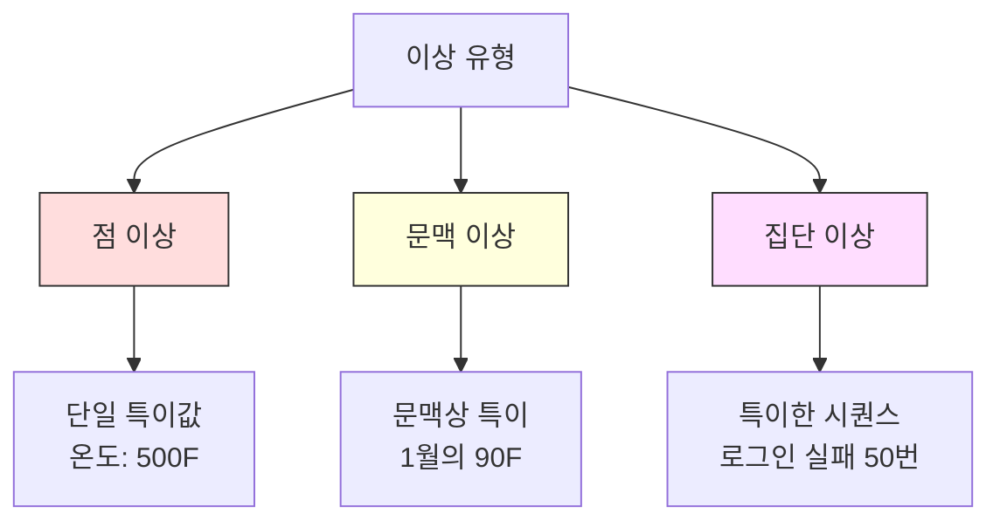
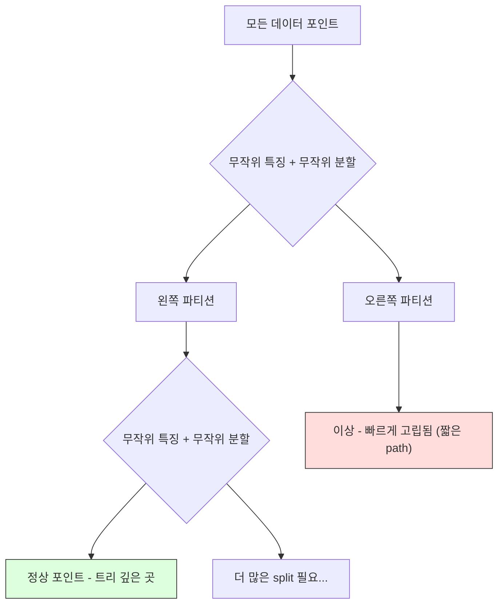
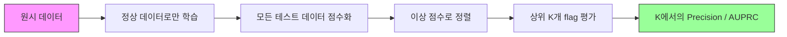

# 이상 탐지

> 정상은 정의하기 쉽다. 비정상은 맞지 않는 모든 것이다.

**Type:** Build
**Languages:** Python
**Prerequisites:** Phase 2, Lessons 01-09
**Time:** ~75 minutes

## 학습 목표

- Z-score, IQR, Isolation Forest 이상 탐지 방법을 처음부터 구현한다
- 점 이상, 문맥 이상, 집단 이상을 구분하고 각각에 적절한 탐지 방법을 선택한다
- 이상 탐지가 왜 이상을 분류하는 문제가 아니라 정상 데이터를 모델링하는 문제로 구성되는지 설명한다
- 비지도 이상 탐지와 지도 분류를 비교하고, 새로운 이상 유형을 포괄하는 능력과 정밀도 사이의 tradeoff를 평가한다

## 문제

신용카드가 오후 2시에 뉴욕에서 사용되고, 오후 2시 5분에 도쿄에서 사용된다. 공장 센서가 정상 범위 80-120도 대신 150도를 읽는다. 서버가 일평균 200건인데 초당 50,000건의 요청을 보낸다.

이것들이 이상이다. 이를 찾는 일은 중요하다. 사기는 수십억 달러의 비용을 만든다. 장비 고장은 다운타임을 만든다. 네트워크 침입은 데이터를 잃게 한다.

문제는 이상에 대한 라벨링된 예시가 거의 없다는 점이다. 사기는 거래의 0.1%를 차지한다. 장비 고장은 1년에 몇 번 발생한다. "이상" 클래스에서 배울 것이 거의 없기 때문에 표준 분류기를 학습할 수 없다. 일부 라벨이 있더라도, 지금까지 본 이상이 앞으로 만날 모든 유형은 아니다. 내일의 사기 수법은 오늘의 것과 다르게 생겼다.

이상 탐지는 문제를 뒤집는다. 비정상을 학습하는 대신 정상을 학습한다. 정상에서 벗어나는 것은 무엇이든 의심스럽다. 이 방식은 라벨 없이 작동하고, 새로운 이상 유형에 적응하며, 대규모 데이터셋으로 확장된다.

## 개념

### 이상 유형

모든 이상이 같은 것은 아니다.

- **점 이상.** 문맥과 관계없이 특이한 단일 데이터 포인트. 500도라는 온도 측정값. 평소 50달러를 쓰는 계정에서 나온 50,000달러 거래.
- **문맥 이상.** 주어진 문맥에서 특이한 데이터 포인트. 90도는 여름에는 정상이고 겨울에는 이상이다. 같은 값, 다른 문맥이다.
- **집단 이상.** 각 개별 포인트는 정상일 수 있지만, 그룹으로 보면 특이한 데이터 포인트의 시퀀스. 로그인 실패 5번은 정상이다. 연속 50번은 brute-force 공격이다.

대부분의 방법은 점 이상을 탐지한다. 문맥 이상에는 시간 또는 위치 특징이 필요하다. 집단 이상에는 시퀀스 인식 방법이 필요하다.



### 비지도 문제 구성

표준 분류에서는 두 클래스 모두에 대한 라벨이 있다. 이상 탐지에서는 보통 세 가지 상황 중 하나다.

1. **완전 비지도.** 라벨이 전혀 없다. 모든 데이터에 detector를 맞추고 이상이 충분히 드물어 "정상" 모델을 오염시키지 않기를 바란다.
2. **준지도.** 정상 데이터만 있는 깨끗한 데이터셋이 있다. 이 깨끗한 세트에 맞춘 뒤 나머지 모든 것을 점수화한다. 가능하다면 가장 강한 설정이다.
3. **약지도.** 라벨링된 이상이 몇 개 있다. 학습이 아니라 평가에 사용한다. 비지도 방식으로 학습한 뒤 라벨링된 부분집합에서 precision/recall을 측정한다.

핵심 통찰: 이상 탐지는 분류와 근본적으로 다르다. 두 클래스 사이의 결정 경계를 모델링하는 것이 아니라 정상 데이터의 분포를 모델링한다.

### 지도 vs 비지도: Tradeoff

라벨링된 이상이 있다면 이를 학습에 사용해야 할까(지도 분류), 아니면 평가에만 사용해야 할까(비지도 탐지)?

**지도(분류로 취급):**
- 이전에 본 정확한 이상 유형을 잡아낸다
- 알려진 이상 유형에 대해 더 높은 정밀도를 낸다
- 새로운 이상 유형은 완전히 놓친다
- 새로운 이상 유형이 나타나면 재학습이 필요하다
- 충분한 이상 예시가 필요하다(대개 너무 적다)

**비지도(정상을 모델링하고 이탈을 표시):**
- 새로운 유형을 포함해 정상에서 벗어나는 모든 것을 잡아낸다
- 라벨링된 이상이 필요 없다
- 더 높은 false positive rate(특이한 것이 모두 나쁜 것은 아니다)
- 분포 변화에 더 강건하다

실제로 가장 좋은 시스템은 둘을 결합한다. 넓은 포괄 범위에는 비지도 탐지, 알려진 고우선순위 이상 유형에는 지도 모델, 애매한 사례에는 사람 검토를 사용한다.

### Z-Score 방법

가장 단순한 접근법이다. 각 특징의 평균과 표준편차를 계산한다. 평균에서 k 표준편차보다 더 멀리 있는 포인트를 표시한다.

```text
z_score = (x - mean) / std
anomaly if |z_score| > threshold
```

기본 threshold는 3.0이다(가우시안 분포에서는 정상 데이터의 99.7%가 3 표준편차 안에 들어간다).

**강점:** 단순하다. 빠르다. 해석 가능하다("이 값은 정상보다 4.5 표준편차 떨어져 있다").

**약점:** 데이터가 정규분포라고 가정한다. 학습 데이터의 이상치에 민감하다(이상치가 평균을 이동시키고 std를 부풀려 탐지가 더 어려워진다). 다봉 분포에서 실패한다.

**잘 작동하는 경우:** 데이터가 대략 종 모양인 단일 특징 모니터링. 서버 응답 시간, 제조 허용오차, 안정적인 baseline을 가진 센서 측정값.

**실패하는 경우:** 다중 클러스터 데이터(기준 온도가 다른 두 사무실 위치), 왜도가 있는 데이터(1000달러가 드물지만 이상은 아닌 거래 금액), 학습 세트에 이상치가 있는 데이터.

### IQR 방법

Z-score보다 강건하다. 평균과 표준편차 대신 사분위 범위를 사용한다.

```text
Q1 = 25th percentile
Q3 = 75th percentile
IQR = Q3 - Q1
lower_bound = Q1 - factor * IQR
upper_bound = Q3 + factor * IQR
anomaly if x < lower_bound or x > upper_bound
```

기본 factor는 1.5다.

**강점:** 이상치에 강건하다(백분위수는 극단값의 영향을 받지 않는다). 왜도가 있는 분포에서 작동한다. 정규성 가정이 없다.

**약점:** 일변량 전용이다(각 특징에 독립적으로 적용). 특징을 함께 고려할 때만 특이한 이상은 탐지할 수 없다(각 특징에서는 정상인 포인트가 결합 공간에서는 이상일 수 있다).

**실무 메모:** IQR의 1.5 factor는 box plot의 whisker에 해당한다. whisker 밖의 포인트는 잠재적 이상치다. 1.5 대신 3.0을 쓰면 detector가 더 보수적이 된다(더 적은 flag, 더 적은 false positive). 적절한 factor는 false alarm에 대한 허용도에 달려 있다.

### Isolation Forest

핵심 통찰: 이상은 적고 다르다. 데이터를 무작위로 분할하면 이상은 더 쉽게 고립된다. 나머지와 분리되기 위해 필요한 무작위 split이 더 적다.



**작동 방식:**
1. 많은 무작위 트리(isolation forest)를 만든다
2. 각 노드에서 무작위 특징과 해당 특징의 min과 max 사이의 무작위 split 값을 고른다
3. 모든 포인트가 고립될 때까지(자기 leaf에 들어갈 때까지) 계속 분할한다
4. 이상은 모든 트리에서 평균 path length가 더 짧다

**작동하는 이유:** 정상 포인트는 조밀한 영역에 있다. 이웃들과 분리하려면 많은 무작위 split이 필요하다. 이상은 희소한 영역에 있다. 하나나 두 개의 무작위 split만으로도 고립된다.

이상 점수는 모든 트리의 평균 path length를 기반으로 하며, 무작위 이진 탐색 트리의 기대 path length로 정규화된다.

```text
score(x) = 2^(-average_path_length(x) / c(n))
```

여기서 `c(n)`은 n개 샘플에 대한 기대 path length다. 1에 가까운 점수는 이상을 의미한다. 0.5에 가까운 점수는 정상이다. 0에 가까운 점수는 매우 정상적이라는 뜻이다(조밀한 클러스터 깊은 곳).

**강점:** 분포 가정이 없다. 고차원에서 작동한다. 잘 확장된다(각 트리가 subsample을 사용하기 때문에 sample size에 대해 sublinear). 혼합 특징 유형을 처리한다.

**약점:** 조밀한 영역 안의 이상에는 약하다(masking effect). 관련 없는 특징이 많으면 무작위 분할이 덜 효과적이다.

**핵심 하이퍼파라미터:**
- `n_estimators`: 트리 수. 보통 100이면 충분하다. 트리가 많을수록 점수가 더 안정적이지만 계산은 느려진다.
- `max_samples`: 트리당 샘플 수. 원 논문의 기본값은 256이다. 값이 작을수록 개별 트리는 덜 정확하지만 다양성이 증가한다. 이 subsampling이 Isolation Forest를 빠르게 만든다. 각 트리는 데이터의 작은 일부만 본다.
- `contamination`: 예상 이상 비율. threshold 설정에만 사용된다. 점수 자체에는 영향을 주지 않는다.

### Local Outlier Factor (LOF)

LOF는 한 포인트 주변의 국소 밀도를 그 이웃 주변의 밀도와 비교한다. 조밀한 영역에 둘러싸인 희소 영역의 포인트는 이상이다.

**작동 방식:**
1. 각 포인트에 대해 k개의 최근접 이웃을 찾는다
2. local reachability density(이웃이 얼마나 조밀한지)를 계산한다
3. 각 포인트의 밀도를 이웃의 밀도와 비교한다
4. 어떤 포인트의 밀도가 이웃보다 훨씬 낮으면 outlier다

**LOF 점수:**
- LOF가 1.0에 가까우면 이웃과 비슷한 밀도(정상)
- LOF가 1.0보다 크면 이웃보다 낮은 밀도(잠재적 이상)
- LOF가 1.0보다 훨씬 크면(예: 2.0+) 밀도가 현저히 낮음(이상 가능성 높음)

"local" 부분이 중요하다. 두 클러스터가 있는 데이터셋을 생각해보자. 1000개 포인트의 조밀한 클러스터와 50개 포인트의 희소한 클러스터가 있다. 희소 클러스터 가장자리의 포인트는 전역적으로 특이하지 않다. 50개의 이웃이 있기 때문이다. 하지만 바로 가까운 이웃들이 자신보다 더 조밀하다면 국소적으로는 특이하다. LOF는 전역 방법이 놓치는 이 미묘함을 포착한다.

**강점:** 국소 이상을 탐지한다(전역적으로 특이하지 않아도 자기 이웃 안에서 특이한 포인트). 서로 다른 밀도의 클러스터에서 작동한다.

**약점:** 큰 데이터셋에서는 느리다(나이브 구현은 O(n^2)). k 선택에 민감하다. 매우 고차원에서는 잘 작동하지 않는다(차원의 저주가 거리 계산에 영향을 준다).

### 비교

| 방법 | 가정 | 속도 | 고차원 처리 | 국소 이상 탐지 |
|--------|------------|-------|-------------------|------------------------|
| Z-score | 정규분포 | 매우 빠름 | 예 (특징별) | 아니요 |
| IQR | 없음 (특징별) | 매우 빠름 | 예 (특징별) | 아니요 |
| Isolation Forest | 없음 | 빠름 | 예 | 부분적으로 |
| LOF | 거리가 의미 있어야 함 | 느림 | 나쁨 | 예 |

### 평가의 어려움

이상 detector 평가는 분류기 평가보다 어렵다.

- **극단적인 클래스 불균형.** 이상이 0.1%이면 모든 것에 "normal"을 예측해도 정확도는 99.9%다. 정확도는 쓸모없다.
- **AUROC는 오해를 부른다.** 불균형이 심하면 실제 threshold에서 대부분의 이상을 놓쳐도 AUROC는 좋아 보일 수 있다.
- **더 나은 지표:** Precision@k(상위 k개 flag 중 실제 이상이 몇 개인지), AUPRC(precision-recall curve 아래 면적), 고정 false positive rate에서의 recall.



### 이상 탐지 파이프라인

실무에서 이상 탐지는 다음 workflow를 따른다.

1. **baseline 데이터 수집.** 이상이 없거나 매우 적다고 아는 기간이 이상적이다.
2. **특징 엔지니어링.** 원시 특징과 파생 특징(이동 통계, 시간 특징, 비율).
3. **detector 학습.** baseline 데이터에 맞춘다. 모델은 "정상"이 어떻게 생겼는지 학습한다.
4. **새 데이터 점수화.** 각 새 관측값은 이상 점수를 받는다.
5. **threshold 선택.** 점수 cutoff를 고른다. 이는 비즈니스 결정이다. threshold가 높을수록 false alarm은 줄지만 놓치는 이상은 늘어난다.
6. **알림과 조사.** flag된 포인트는 사람 검토 또는 자동 대응으로 간다.
7. **피드백 수집.** flag된 항목이 true anomaly인지 false alarm인지 기록한다. 이 데이터를 사용해 detector를 평가하고 시간이 지나며 threshold를 조정한다.

파이프라인은 결코 "완료"되지 않는다. 데이터 분포는 바뀌고, 새로운 이상 유형은 나타나며, threshold는 조정이 필요하다. 이상 탐지를 일회성 모델이 아니라 살아 있는 시스템으로 다뤄라.

## 직접 만들기

`code/anomaly_detection.py`의 코드는 Z-score, IQR, Isolation Forest를 처음부터 구현한다.

### Z-score detector

```python
def zscore_detect(X, threshold=3.0):
    mean = X.mean(axis=0)
    std = X.std(axis=0)
    std[std == 0] = 1.0
    z = np.abs((X - mean) / std)
    return z.max(axis=1) > threshold
```

단순하고 vectorized되어 있다. 어떤 특징이든 threshold를 넘으면 그 포인트를 flag한다.

### IQR detector

```python
def iqr_detect(X, factor=1.5):
    q1 = np.percentile(X, 25, axis=0)
    q3 = np.percentile(X, 75, axis=0)
    iqr = q3 - q1
    iqr[iqr == 0] = 1.0
    lower = q1 - factor * iqr
    upper = q3 + factor * iqr
    outside = (X < lower) | (X > upper)
    return outside.any(axis=1)
```

### 처음부터 만드는 Isolation Forest

처음부터 구현한 버전은 특징 공간을 무작위로 분할하는 isolation tree를 만든다.

```python
class IsolationTree:
    def __init__(self, max_depth):
        self.max_depth = max_depth

    def fit(self, X, depth=0):
        n, p = X.shape
        if depth >= self.max_depth or n <= 1:
            self.is_leaf = True
            self.size = n
            return self
        self.is_leaf = False
        self.feature = np.random.randint(p)
        x_min = X[:, self.feature].min()
        x_max = X[:, self.feature].max()
        if x_min == x_max:
            self.is_leaf = True
            self.size = n
            return self
        self.threshold = np.random.uniform(x_min, x_max)
        left_mask = X[:, self.feature] < self.threshold
        self.left = IsolationTree(self.max_depth).fit(X[left_mask], depth + 1)
        self.right = IsolationTree(self.max_depth).fit(X[~left_mask], depth + 1)
        return self
```

포인트를 고립시키는 path length가 이상 점수를 결정한다. path가 짧을수록 더 이상하다.

`IsolationForest` 클래스는 여러 트리를 감싼다.

```python
class IsolationForest:
    def __init__(self, n_estimators=100, max_samples=256, seed=42):
        self.n_estimators = n_estimators
        self.max_samples = max_samples

    def fit(self, X):
        sample_size = min(self.max_samples, X.shape[0])
        max_depth = int(np.ceil(np.log2(sample_size)))
        for _ in range(self.n_estimators):
            idx = rng.choice(X.shape[0], size=sample_size, replace=False)
            tree = IsolationTree(max_depth=max_depth)
            tree.fit(X[idx])
            self.trees.append(tree)

    def anomaly_score(self, X):
        avg_path = average path length across all trees
        scores = 2.0 ** (-avg_path / c(max_samples))
        return scores
```

정규화 계수 `c(n)`은 n개 원소를 가진 이진 탐색 트리에서 실패한 탐색의 기대 path length다. 이는 `2 * H(n-1) - 2*(n-1)/n`과 같으며, 여기서 `H`는 조화수다. 이 정규화 덕분에 서로 다른 크기의 데이터셋 사이에서도 점수를 비교할 수 있다.

### 데모 시나리오

코드는 여러 테스트 시나리오를 생성한다.

1. **이상치가 있는 단일 클러스터.** 중심에서 멀리 주입된 이상을 가진 2D Gaussian 클러스터. 모든 방법이 여기서는 작동해야 한다.
2. **다봉 데이터.** 크기와 밀도가 다른 세 클러스터. 클러스터 사이의 포인트는 이상이다. 특징별 범위가 넓기 때문에 Z-score는 고전한다.
3. **고차원 데이터.** 50개 특징이 있지만 이상은 그중 5개에서만 다르다. 방법들이 특징 일부에서 나타나는 이상을 찾을 수 있는지 테스트한다.

각 데모는 precision, recall, F1, Precision@k를 사용해 모든 방법을 비교한다.

## 사용하기

sklearn을 사용할 때는(처음부터 구현한 것이 아니라 라이브러리 구현):

```python
from sklearn.ensemble import IsolationForest
from sklearn.neighbors import LocalOutlierFactor

iso = IsolationForest(n_estimators=100, contamination=0.05, random_state=42)
iso.fit(X_train)
predictions = iso.predict(X_test)

lof = LocalOutlierFactor(n_neighbors=20, contamination=0.05, novelty=True)
lof.fit(X_train)
predictions = lof.predict(X_test)
```

`contamination`은 예상 이상 비율을 설정한다. 이를 올바르게 설정하는 것이 중요하다. 너무 낮으면 이상을 놓치고, 너무 높으면 false alarm이 생긴다.

`anomaly_detection.py`의 코드는 처음부터 구현한 방법을 같은 데이터에서 sklearn과 비교한다.

### sklearn Contamination 파라미터

sklearn의 `contamination` 파라미터는 연속 이상 점수를 이진 예측으로 바꾸기 위한 threshold를 결정한다. underlying score는 바꾸지 않는다.

```python
iso_5 = IsolationForest(contamination=0.05)
iso_10 = IsolationForest(contamination=0.10)
```

둘은 같은 이상 점수를 만든다. 하지만 `iso_5`는 상위 5%를 flag하고 `iso_10`은 상위 10%를 flag한다. 실제 이상 비율을 모른다면(대개 모른다), contamination을 "auto"로 설정하고 raw score를 직접 다뤄라. false positive와 false negative 사이의 비용 tradeoff에 기반해 직접 threshold를 설정한다.

### One-Class SVM

알아둘 만한 또 다른 비지도 이상 detector다. One-Class SVM은 고차원 특징 공간에서 정상 데이터를 감싸는 경계를 맞춘다(kernel trick 사용).

```python
from sklearn.svm import OneClassSVM

oc_svm = OneClassSVM(kernel="rbf", gamma="auto", nu=0.05)
oc_svm.fit(X_train)
predictions = oc_svm.predict(X_test)
```

`nu` 파라미터는 이상 비율을 근사한다. One-Class SVM은 중소규모 데이터셋에서는 잘 작동하지만 매우 큰 데이터로는 확장되지 않는다(커널 행렬이 제곱으로 커진다).

### Autoencoder 접근법 (미리 보기)

Autoencoder는 데이터를 압축하고 복원하도록 학습하는 신경망이다. 정상 데이터로 학습한다. 테스트 시점에 이상은 복원 오차가 높다. 네트워크가 정상 패턴만 복원하도록 학습했기 때문이다.

이는 Phase 3(Deep Learning)에서 다루지만 원리는 같다. 정상을 모델링하고, 벗어나는 것을 flag한다.

### Ensemble 이상 탐지

ensemble 방법이 분류를 개선하듯(Lesson 11), 여러 이상 detector를 결합하면 탐지가 개선된다. 가장 단순한 접근법은 다음과 같다.

1. 여러 detector를 실행한다(Z-score, IQR, Isolation Forest, LOF)
2. 각 detector의 점수를 [0, 1]로 정규화한다
3. 정규화된 점수를 평균낸다
4. 평균 점수가 threshold를 넘는 포인트를 flag한다

이는 false positive를 줄인다. 방법마다 실패 모드가 다르기 때문이다. 네 방법 모두가 flag한 포인트는 거의 확실히 이상이다. 하나의 방법만 flag한 포인트는 그 방법의 특이한 반응일 수 있다.

더 정교한 ensemble은 각 detector의 추정 신뢰도(가능하다면 알려진 이상이 있는 validation set에서 측정)를 기준으로 가중치를 둔다.

### 운영 고려사항

1. **Threshold drift.** 데이터 분포가 바뀌면 고정 threshold는 낡는다. 이상 점수 분포를 모니터링하고 주기적으로 조정한다.
2. **Alert fatigue.** false alarm이 너무 많으면 운영자가 주의를 기울이지 않는다. 높은 threshold(더 적고 더 신뢰할 수 있는 alert)로 시작하고 신뢰가 쌓이면 낮춘다.
3. **Ensemble 접근법.** 운영 환경에서는 여러 detector를 결합한다. 여러 방법이 이상이라고 동의할 때만 포인트를 flag한다. 이렇게 하면 false positive가 크게 줄어든다.
4. **특징 엔지니어링.** 원시 특징만으로는 거의 충분하지 않다. 이동 통계, 비율, time-since-last-event, 도메인별 특징을 추가한다. 좋은 특징 세트는 detector 선택보다 더 중요하다.
5. **피드백 루프.** 운영자가 flag된 항목을 조사해 확인하거나 기각하면 이를 시스템에 되돌린다. 시간이 지나며 라벨링된 데이터를 축적해 detector를 평가하고 개선한다.

## 내보내기

이 수업의 산출물:
- `outputs/skill-anomaly-detector.md` -- 적절한 detector를 선택하기 위한 의사결정 skill
- `code/anomaly_detection.py` -- 처음부터 구현한 Z-score, IQR, Isolation Forest와 sklearn 비교

### Threshold 선택하기

이상 점수는 연속값이다. 이진 결정을 내리려면 threshold가 필요하다. 이는 기술적 결정이 아니라 비즈니스 결정이다.

두 시나리오를 생각해보자.
- **사기 탐지.** 사기를 놓치면 비용이 크다(chargeback, 고객 신뢰). false alarm은 사람 분석가가 조사하는 데 5분을 쓴다. 더 많은 사기를 잡기 위해 threshold를 낮게 설정하고 더 많은 false alarm을 받아들인다.
- **장비 유지보수.** false alarm은 50,000달러가 드는 불필요한 중단을 의미한다. 놓친 고장은 500,000달러 수리를 의미한다. 이 비용의 균형을 맞추도록 threshold를 설정한다.

두 경우 모두 최적 threshold는 false positive와 false negative 사이의 비용 비율에 달려 있다. 서로 다른 threshold에서 precision과 recall을 그리고, 비용 함수를 겹쳐서 최소 비용 지점을 선택한다.

### 운영 환경으로 확장하기

운영 환경의 실시간 이상 탐지:

1. **배치 학습, 온라인 점수화.** 최근 정상 데이터로 모델을 주기적으로(매일, 매주) 학습한다. 새 관측값이 들어오는 즉시 점수화한다.
2. **특징 계산이 일치해야 한다.** 30일 이동 통계로 학습했다면 새 관측값의 특징을 계산하려면 30일의 이력이 필요하다. 필요한 이력을 buffer에 보관한다.
3. **점수 분포 모니터링.** 시간에 따른 이상 점수 분포를 추적한다. median score가 위로 드리프트하면 데이터가 바뀌고 있거나 모델이 낡은 것이다.
4. **설명 가능성.** 이상을 flag할 때 이유를 말한다. Z-score: "Feature X is 4.2 standard deviations above normal." Isolation Forest: "This point was isolated in 3.1 splits on average (normal points take 8.5)."

## 연습 문제

1. **Threshold 튜닝.** Z-score detector를 threshold 1.0부터 5.0까지 0.5 간격으로 실행한다. 각 threshold에서 precision과 recall을 그린다. 데이터에 맞는 sweet spot은 어디인가?

2. **다변량 이상.** 각 특징은 개별적으로 정상처럼 보이지만 조합은 이상인 2D 데이터를 만든다(예: 주 클러스터 대각선에서 멀리 떨어진 포인트). 특징별 Z-score는 이를 놓치지만 Isolation Forest는 잡는다는 것을 보인다.

3. **LOF 처음부터 구현하기.** k-nearest neighbors를 사용해 Local Outlier Factor를 구현한다. 같은 데이터에서 sklearn의 LocalOutlierFactor와 비교한다. k=10과 k=50을 사용한다. k 선택이 결과에 어떤 영향을 주는가?

4. **스트리밍 이상 탐지.** Z-score detector가 스트리밍 설정에서 작동하도록 수정한다. 새 포인트가 도착할 때 running mean과 variance를 업데이트한다(Welford의 online algorithm). 같은 데이터에서 배치 Z-score와 비교한다.

5. **현실 데이터 평가.** 알려진 이상이 있는 데이터셋(예: Kaggle의 credit card fraud)을 가져온다. precision@100, precision@500, AUPRC로 네 방법을 모두 평가한다. 어떤 방법이 가장 잘 작동하는가? 왜인가?

## 핵심 용어

| 용어 | 사람들이 하는 말 | 실제 의미 |
|------|----------------|----------------------|
| 이상 | "Outlier, 특이한 포인트" | 정상 데이터의 기대 패턴에서 크게 벗어나는 데이터 포인트 |
| 점 이상 | "하나의 이상한 값" | 문맥과 관계없이 특이한 개별 관측값 |
| 문맥 이상 | "정상 값, 잘못된 문맥" | 주어진 문맥(시간, 위치 등)에서는 특이하지만 다른 문맥에서는 정상일 수 있는 관측값 |
| Isolation Forest | "outlier를 찾기 위한 무작위 split" | 정상 포인트보다 더 적은 split으로 이상을 고립시키는 무작위 트리 ensemble |
| Local Outlier Factor | "밀도를 이웃과 비교" | 국소 밀도가 이웃의 밀도보다 훨씬 낮은 포인트를 flag하는 방법 |
| Z-score | "평균으로부터의 표준편차" | (x - mean) / std로, 포인트가 중심에서 표준편차 단위로 얼마나 떨어져 있는지 측정 |
| IQR | "사분위 범위" | Q3 - Q1로, 데이터 가운데 50%의 퍼짐을 측정하며 강건한 outlier 탐지에 사용 |
| Contamination | "예상 이상 비율" | detector가 데이터 중 어느 비율을 이상으로 flag해야 하는지 알려주는 하이퍼파라미터 |
| Precision@k | "상위 k개 flag 중 실제가 몇 개인가" | 가장 의심스러운 k개 포인트에 대해서만 계산한 precision으로, 불균형 이상 탐지에 유용 |
| AUPRC | "Precision-recall curve 아래 면적" | 모든 threshold에서 precision-recall 성능을 요약하는 지표로, 불균형 데이터에서는 AUROC보다 낫다 |

## 더 읽을거리

- [Liu et al., Isolation Forest (2008)](https://cs.nju.edu.cn/zhouzh/zhouzh.files/publication/icdm08b.pdf) -- 원 Isolation Forest 논문
- [Breunig et al., LOF: Identifying Density-Based Local Outliers (2000)](https://dl.acm.org/doi/10.1145/342009.335388) -- 원 LOF 논문
- [scikit-learn Outlier Detection docs](https://scikit-learn.org/stable/modules/outlier_detection.html) -- 모든 sklearn 이상 detector 개요
- [Chandola et al., Anomaly Detection: A Survey (2009)](https://dl.acm.org/doi/10.1145/1541880.1541882) -- 이상 탐지 방법에 대한 포괄적 survey
- [Goldstein and Uchida, A Comparative Evaluation of Unsupervised Anomaly Detection Algorithms (2016)](https://journals.plos.org/plosone/article?id=10.1371/journal.pone.0152173) -- 실제 데이터셋에서 10개 방법을 비교한 실증 연구
