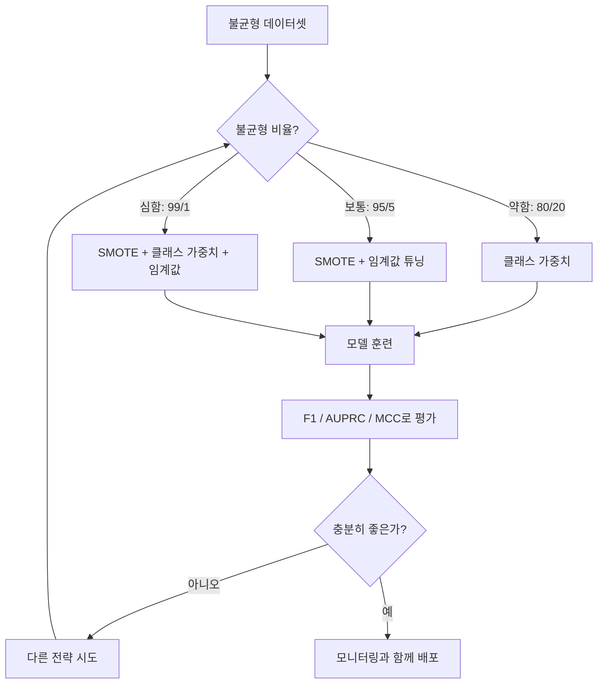
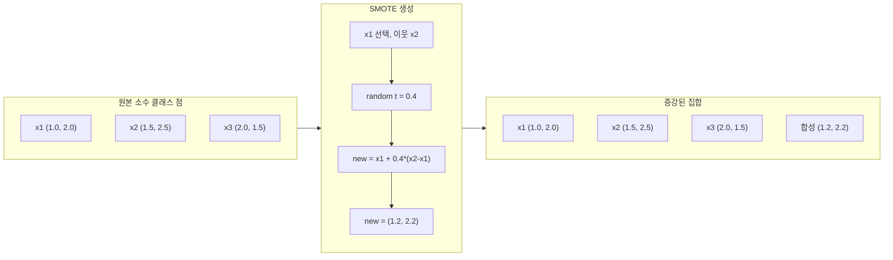
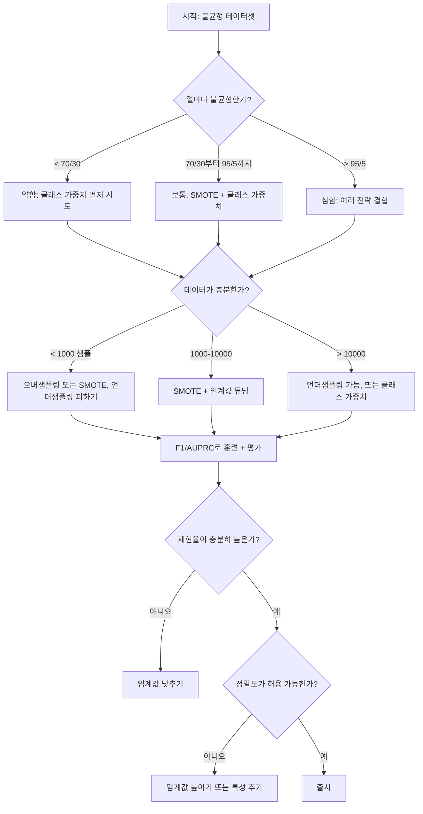

# 불균형 데이터 다루기

> 데이터의 99%가 "정상"이라면, 정확도는 거짓말입니다.

**Type:** Build
**Languages:** Python
**Prerequisites:** Phase 2, Lessons 01-09(특히 평가 지표)
**Time:** ~90 minutes

## 학습 목표

- SMOTE를 처음부터 구현하고, 합성 오버샘플링이 무작위 복제와 어떻게 다른지 설명한다
- 불균형 분류기를 정확도 대신 F1, AUPRC, Matthews Correlation Coefficient로 평가한다
- 클래스 가중치, 임계값 튜닝, 재샘플링 전략을 비교하고 주어진 불균형 비율에 맞는 접근법을 선택한다
- SMOTE, 클래스 가중치, 임계값 최적화를 결합한 완전한 불균형 데이터 파이프라인을 만든다

## 문제

사기 탐지 모델을 만들었습니다. 정확도가 99.9%입니다. 기뻐합니다. 그러다 모델이 모든 거래를 "사기 아님"으로 예측한다는 사실을 깨닫습니다.

이것은 버그가 아닙니다. 거래의 0.1%만 사기일 때 모델이 취할 수 있는 합리적인 행동입니다. 모델은 항상 다수 클래스를 찍는 것이 전체 오류를 최소화한다는 것을 배웁니다. 기술적으로는 맞지만 완전히 쓸모없습니다.

실제 분류가 중요한 곳에서는 이런 일이 어디서나 일어납니다. 질병 진단: 양성률 1%. 네트워크 침입: 공격 0.01%. 제조 결함: 불량 0.5%. 스팸 필터링: 스팸 20%. 이탈 예측: 이탈자 5%. 소수 클래스가 중요할수록 더 드문 경우가 많습니다.

정확도는 모든 올바른 예측을 똑같이 취급하기 때문에 실패합니다. 정상 거래를 올바르게 표시하는 것과 사기를 올바르게 잡는 것은 둘 다 정확도 1점으로 계산됩니다. 하지만 사기를 잡는 것이 모델이 존재하는 전체 이유입니다. 드물지만 중요한 클래스에 모델이 주의를 기울이도록 강제하는 지표, 기법, 훈련 전략이 필요합니다.

## 개념

### 정확도가 실패하는 이유

1000개 샘플이 있는 데이터셋을 생각해 봅시다. 음성 990개, 양성 10개입니다. 항상 음성으로 예측하는 모델은 다음과 같습니다.

|  | 예측 양성 | 예측 음성 |
|--|---|---|
| 실제 양성 | 0 (TP) | 10 (FN) |
| 실제 음성 | 0 (FP) | 990 (TN) |

정확도 = (0 + 990) / 1000 = 99.0%

모델은 사기를 하나도 잡지 못합니다. 질병도 0개. 결함도 0개. 하지만 정확도는 99%라고 말합니다. 이것이 불균형 문제에서 정확도가 위험한 이유입니다.

### 더 나은 지표

**Precision** = TP / (TP + FP). 양성으로 표시한 것 중 실제 양성은 얼마나 되는가? 높은 정밀도는 거짓 경보가 적다는 뜻입니다.

**Recall** = TP / (TP + FN). 실제 양성 중 얼마나 많이 잡았는가? 높은 재현율은 놓친 양성이 적다는 뜻입니다.

**F1 Score** = 2 * precision * recall / (precision + recall). 조화 평균입니다. 산술 평균보다 정밀도와 재현율 사이의 극단적인 불균형을 더 강하게 벌합니다.

**F-beta Score** = (1 + beta^2) * precision * recall / (beta^2 * precision + recall). beta > 1이면 재현율이 더 중요합니다. beta < 1이면 정밀도가 더 중요합니다. F2는 사기 탐지에서 흔합니다(사기를 놓치는 것이 거짓 경보보다 더 나쁩니다).

**AUPRC**(정밀도-재현율 곡선 아래 면적). AUC-ROC와 비슷하지만 불균형 데이터에서는 더 유익합니다. 무작위 분류기의 AUPRC는 양성 클래스 비율과 같습니다(ROC처럼 0.5가 아닙니다). 그래서 개선이 더 잘 보입니다.

**Matthews Correlation Coefficient** = (TP * TN - FP * FN) / sqrt((TP+FP)(TP+FN)(TN+FP)(TN+FN)). 범위는 -1부터 +1까지입니다. 모델이 두 클래스 모두에서 잘할 때만 높은 점수를 줍니다. 클래스 크기가 매우 달라도 균형 잡혀 있습니다.

위의 "항상 음성 예측" 모델에서는 precision = 0/0(정의되지 않으며 보통 0으로 설정), recall = 0/10 = 0, F1 = 0, MCC = 0입니다. 이 지표들은 모델이 쓸모없다는 것을 올바르게 식별합니다.

### 불균형 데이터 파이프라인



### SMOTE: 합성 소수 클래스 오버샘플링 기법

무작위 오버샘플링은 기존 소수 클래스 샘플을 복제합니다. 동작은 하지만 모델이 같은 점을 반복해서 보기 때문에 과적합 위험이 있습니다.

SMOTE는 그럴듯하지만 복사본은 아닌 새로운 합성 소수 클래스 샘플을 만듭니다. 알고리즘은 다음과 같습니다.

1. 각 소수 클래스 샘플 x에 대해 다른 소수 클래스 샘플 중 k개 최근접 이웃을 찾는다
2. 이웃 하나를 무작위로 고른다
3. x와 그 이웃 사이의 선분 위에 새 샘플을 만든다

공식: `new_sample = x + random(0, 1) * (neighbor - x)`

이 방식은 실제 소수 클래스 점 사이를 보간하여, 기존 데이터를 그냥 복사하지 않고 같은 특성 공간 영역에 샘플을 만듭니다.



### 샘플링 전략 비교

**Random Oversampling**: 소수 클래스 샘플을 다수 클래스 수에 맞게 복제합니다.
- 장점: 단순함, 정보 손실 없음
- 단점: 정확한 중복이 과적합을 유발하고 훈련 시간을 늘림

**Random Undersampling**: 다수 클래스 샘플을 소수 클래스 수에 맞게 제거합니다.
- 장점: 빠른 훈련, 단순함
- 단점: 유용할 수 있는 다수 클래스 데이터를 버리고 분산이 커짐

**SMOTE**: 보간으로 합성 소수 클래스 샘플을 만듭니다.
- 장점: 새 데이터 점을 생성하고 무작위 오버샘플링보다 과적합을 줄임
- 단점: 결정 경계 근처에 노이즈 많은 샘플을 만들 수 있고 다수 클래스 분포를 고려하지 않음

| 전략 | 바뀌는 데이터 | 위험 | 사용할 때 |
|----------|-------------|------|-------------|
| 오버샘플링 | 소수 클래스 복제 | 과적합 | 작은 데이터셋, 보통 불균형 |
| 언더샘플링 | 다수 클래스 제거 | 정보 손실 | 큰 데이터셋, 빠른 훈련이 필요할 때 |
| SMOTE | 합성 소수 클래스 추가 | 경계 노이즈 | 보통 불균형, k-NN에 충분한 소수 샘플 |

### 클래스 가중치

데이터를 바꾸는 대신 모델이 오류를 다루는 방식을 바꿉니다. 소수 클래스를 잘못 분류할 때 더 높은 가중치를 부여합니다.

음성 샘플 950개와 양성 샘플 50개가 있는 이진 문제라면:
- 음성 클래스 가중치 = n_samples / (2 * n_negative) = 1000 / (2 * 950) = 0.526
- 양성 클래스 가중치 = n_samples / (2 * n_positive) = 1000 / (2 * 50) = 10.0

양성 클래스는 19배의 가중치를 받습니다. 양성 샘플 하나를 잘못 분류하는 비용은 음성 샘플 19개를 잘못 분류하는 비용과 같습니다. 모델은 소수 클래스에 주의를 기울이도록 강제됩니다.

로지스틱 회귀에서는 손실 함수가 이렇게 수정됩니다.

```text
weighted_loss = -sum(w_i * [y_i * log(p_i) + (1-y_i) * log(1-p_i)])
```

여기서 w_i는 샘플 i의 클래스에 따라 달라집니다.

클래스 가중치는 기대값 관점에서 오버샘플링과 수학적으로 동등하지만 새 데이터 점을 만들지 않습니다. 그래서 더 빠르고 중복 샘플로 인한 과적합 위험을 피합니다.

### 임계값 튜닝

대부분의 분류기는 확률을 출력합니다. 기본 임계값은 0.5입니다. P(positive) >= 0.5이면 양성으로 예측합니다. 하지만 0.5는 임의적입니다. 클래스가 불균형할 때 최적 임계값은 보통 훨씬 낮습니다.

절차:
1. 모델을 훈련한다
2. 검증 세트에서 예측 확률을 얻는다
3. 임계값을 0.0부터 1.0까지 훑는다
4. 각 임계값에서 F1(또는 선택한 지표)을 계산한다
5. 지표를 최대화하는 임계값을 고른다


모델이 사기 거래에 대해 P(fraud) = 0.15를 출력할 수 있습니다. 임계값 0.5에서는 사기 아님으로 분류됩니다. 임계값 0.10에서는 올바르게 잡힙니다. 확률 보정은 순위보다 덜 중요합니다 -- 사기가 비사기보다 더 높은 확률을 받기만 한다면, 둘을 분리하는 임계값이 존재합니다.

### 비용 민감 학습

클래스 가중치의 일반화입니다. 균일한 비용 대신 구체적인 오분류 비용을 부여합니다.

| | 양성 예측 | 음성 예측 |
|--|---|---|
| 실제 양성 | 0 (정답) | C_FN = 100 |
| 실제 음성 | C_FP = 1 | 0 (정답) |

사기 거래를 놓치는 것(FN)은 거짓 경보(FP)보다 100배 더 큰 비용입니다. 모델은 전체 오류 수가 아니라 총비용을 최적화합니다.

실제 비용을 추정할 수 있다면 이것이 가장 원칙적인 접근법입니다. 놓친 암 진단의 비용은 추가 생검으로 이어지는 거짓 경보와 매우 다릅니다. 이런 비용을 명시하면 올바른 트레이드오프가 강제됩니다.

### 의사결정 흐름도



```figure
class-imbalance
```

## 직접 만들기

### 1단계: 불균형 데이터셋 생성하기

```python
import numpy as np


def make_imbalanced_data(n_majority=950, n_minority=50, seed=42):
    rng = np.random.RandomState(seed)

    X_maj = rng.randn(n_majority, 2) * 1.0 + np.array([0.0, 0.0])
    X_min = rng.randn(n_minority, 2) * 0.8 + np.array([2.5, 2.5])

    X = np.vstack([X_maj, X_min])
    y = np.concatenate([np.zeros(n_majority), np.ones(n_minority)])

    shuffle_idx = rng.permutation(len(y))
    return X[shuffle_idx], y[shuffle_idx]
```

### 2단계: SMOTE를 처음부터 구현하기

```python
def euclidean_distance(a, b):
    return np.sqrt(np.sum((a - b) ** 2))


def find_k_neighbors(X, idx, k):
    distances = []
    for i in range(len(X)):
        if i == idx:
            continue
        d = euclidean_distance(X[idx], X[i])
        distances.append((i, d))
    distances.sort(key=lambda x: x[1])
    return [d[0] for d in distances[:k]]


def smote(X_minority, k=5, n_synthetic=100, seed=42):
    rng = np.random.RandomState(seed)
    n_samples = len(X_minority)
    k = min(k, n_samples - 1)
    synthetic = []

    for _ in range(n_synthetic):
        idx = rng.randint(0, n_samples)
        neighbors = find_k_neighbors(X_minority, idx, k)
        neighbor_idx = neighbors[rng.randint(0, len(neighbors))]
        t = rng.random()
        new_point = X_minority[idx] + t * (X_minority[neighbor_idx] - X_minority[idx])
        synthetic.append(new_point)

    return np.array(synthetic)
```

### 3단계: 무작위 오버샘플링과 언더샘플링

```python
def random_oversample(X, y, seed=42):
    rng = np.random.RandomState(seed)
    classes, counts = np.unique(y, return_counts=True)
    max_count = counts.max()

    X_resampled = list(X)
    y_resampled = list(y)

    for cls, count in zip(classes, counts):
        if count < max_count:
            cls_indices = np.where(y == cls)[0]
            n_needed = max_count - count
            chosen = rng.choice(cls_indices, size=n_needed, replace=True)
            X_resampled.extend(X[chosen])
            y_resampled.extend(y[chosen])

    X_out = np.array(X_resampled)
    y_out = np.array(y_resampled)
    shuffle = rng.permutation(len(y_out))
    return X_out[shuffle], y_out[shuffle]


def random_undersample(X, y, seed=42):
    rng = np.random.RandomState(seed)
    classes, counts = np.unique(y, return_counts=True)
    min_count = counts.min()

    X_resampled = []
    y_resampled = []

    for cls in classes:
        cls_indices = np.where(y == cls)[0]
        chosen = rng.choice(cls_indices, size=min_count, replace=False)
        X_resampled.extend(X[chosen])
        y_resampled.extend(y[chosen])

    X_out = np.array(X_resampled)
    y_out = np.array(y_resampled)
    shuffle = rng.permutation(len(y_out))
    return X_out[shuffle], y_out[shuffle]
```

### 4단계: 클래스 가중치를 적용한 로지스틱 회귀

```python
def sigmoid(z):
    return 1.0 / (1.0 + np.exp(-np.clip(z, -500, 500)))


def logistic_regression_weighted(X, y, weights, lr=0.01, epochs=200):
    n_samples, n_features = X.shape
    w = np.zeros(n_features)
    b = 0.0

    for _ in range(epochs):
        z = X @ w + b
        pred = sigmoid(z)
        error = pred - y
        weighted_error = error * weights

        gradient_w = (X.T @ weighted_error) / n_samples
        gradient_b = np.mean(weighted_error)

        w -= lr * gradient_w
        b -= lr * gradient_b

    return w, b


def compute_class_weights(y):
    classes, counts = np.unique(y, return_counts=True)
    n_samples = len(y)
    n_classes = len(classes)
    weight_map = {}
    for cls, count in zip(classes, counts):
        weight_map[cls] = n_samples / (n_classes * count)
    return np.array([weight_map[yi] for yi in y])
```

### 5단계: 임계값 튜닝

```python
def find_optimal_threshold(y_true, y_probs, metric="f1"):
    best_threshold = 0.5
    best_score = -1.0

    for threshold in np.arange(0.05, 0.96, 0.01):
        y_pred = (y_probs >= threshold).astype(int)
        tp = np.sum((y_pred == 1) & (y_true == 1))
        fp = np.sum((y_pred == 1) & (y_true == 0))
        fn = np.sum((y_pred == 0) & (y_true == 1))

        if metric == "f1":
            precision = tp / (tp + fp) if (tp + fp) > 0 else 0.0
            recall = tp / (tp + fn) if (tp + fn) > 0 else 0.0
            score = 2 * precision * recall / (precision + recall) if (precision + recall) > 0 else 0.0
        elif metric == "recall":
            score = tp / (tp + fn) if (tp + fn) > 0 else 0.0
        elif metric == "precision":
            score = tp / (tp + fp) if (tp + fp) > 0 else 0.0

        if score > best_score:
            best_score = score
            best_threshold = threshold

    return best_threshold, best_score
```

### 6단계: 평가 함수

```python
def confusion_matrix_values(y_true, y_pred):
    tp = np.sum((y_pred == 1) & (y_true == 1))
    tn = np.sum((y_pred == 0) & (y_true == 0))
    fp = np.sum((y_pred == 1) & (y_true == 0))
    fn = np.sum((y_pred == 0) & (y_true == 1))
    return tp, tn, fp, fn


def compute_metrics(y_true, y_pred):
    tp, tn, fp, fn = confusion_matrix_values(y_true, y_pred)
    accuracy = (tp + tn) / (tp + tn + fp + fn)
    precision = tp / (tp + fp) if (tp + fp) > 0 else 0.0
    recall = tp / (tp + fn) if (tp + fn) > 0 else 0.0
    f1 = 2 * precision * recall / (precision + recall) if (precision + recall) > 0 else 0.0

    denom = np.sqrt(float((tp + fp) * (tp + fn) * (tn + fp) * (tn + fn)))
    mcc = (tp * tn - fp * fn) / denom if denom > 0 else 0.0

    return {
        "accuracy": accuracy,
        "precision": precision,
        "recall": recall,
        "f1": f1,
        "mcc": mcc,
    }
```

### 7단계: 모든 접근법 비교하기

```python
X, y = make_imbalanced_data(950, 50, seed=42)
split = int(0.8 * len(y))
X_train, X_test = X[:split], X[split:]
y_train, y_test = y[:split], y[split:]

# Baseline: no treatment
w_base, b_base = logistic_regression_weighted(
    X_train, y_train, np.ones(len(y_train)), lr=0.1, epochs=300
)
probs_base = sigmoid(X_test @ w_base + b_base)
preds_base = (probs_base >= 0.5).astype(int)

# Oversampled
X_over, y_over = random_oversample(X_train, y_train)
w_over, b_over = logistic_regression_weighted(
    X_over, y_over, np.ones(len(y_over)), lr=0.1, epochs=300
)
preds_over = (sigmoid(X_test @ w_over + b_over) >= 0.5).astype(int)

# SMOTE
minority_mask = y_train == 1
X_minority = X_train[minority_mask]
synthetic = smote(X_minority, k=5, n_synthetic=len(y_train) - 2 * int(minority_mask.sum()))
X_smote = np.vstack([X_train, synthetic])
y_smote = np.concatenate([y_train, np.ones(len(synthetic))])
w_sm, b_sm = logistic_regression_weighted(
    X_smote, y_smote, np.ones(len(y_smote)), lr=0.1, epochs=300
)
preds_smote = (sigmoid(X_test @ w_sm + b_sm) >= 0.5).astype(int)

# Class weights
sample_weights = compute_class_weights(y_train)
w_cw, b_cw = logistic_regression_weighted(
    X_train, y_train, sample_weights, lr=0.1, epochs=300
)
probs_cw = sigmoid(X_test @ w_cw + b_cw)
preds_cw = (probs_cw >= 0.5).astype(int)

# Threshold tuning (tune on held-out validation set, not test set)
probs_val = sigmoid(X_val @ w_cw + b_cw)
best_thresh, best_f1 = find_optimal_threshold(y_val, probs_val, metric="f1")
preds_thresh = (probs_cw >= best_thresh).astype(int)
```

코드 파일은 이 모든 것을 하나의 스크립트로 실행하고 결과를 출력합니다.

## 사용하기

scikit-learn과 imbalanced-learn을 사용하면 이 기법들은 한 줄짜리입니다.

```python
from sklearn.linear_model import LogisticRegression
from sklearn.metrics import classification_report, f1_score
from sklearn.model_selection import train_test_split
from imblearn.over_sampling import SMOTE
from imblearn.under_sampling import RandomUnderSampler
from imblearn.pipeline import Pipeline

X_train, X_test, y_train, y_test = train_test_split(X, y, stratify=y)

model_weighted = LogisticRegression(class_weight="balanced")
model_weighted.fit(X_train, y_train)
print(classification_report(y_test, model_weighted.predict(X_test)))

smote = SMOTE(random_state=42)
X_resampled, y_resampled = smote.fit_resample(X_train, y_train)
model_smote = LogisticRegression()
model_smote.fit(X_resampled, y_resampled)
print(classification_report(y_test, model_smote.predict(X_test)))

pipeline = Pipeline([
    ("smote", SMOTE()),
    ("model", LogisticRegression(class_weight="balanced")),
])
pipeline.fit(X_train, y_train)
print(classification_report(y_test, pipeline.predict(X_test)))
```

처음부터 구현한 버전은 각 기법이 정확히 무엇을 하는지 보여 줍니다. SMOTE는 소수 클래스에 대한 k-NN 보간일 뿐입니다. 클래스 가중치는 손실을 곱합니다. 임계값 튜닝은 컷오프를 훑는 for-loop입니다. 마법은 없습니다.

## 출시하기

이 수업의 산출물:
- `outputs/skill-imbalanced-data.md` -- 불균형 분류 문제를 다루기 위한 의사결정 체크리스트

## 연습 문제

1. **Borderline-SMOTE**: SMOTE 구현을 수정하여 결정 경계 근처에 있는 소수 클래스 점(그 k-최근접 이웃에 다수 클래스 샘플이 포함된 점)에 대해서만 합성 샘플을 생성하게 하세요. 클래스가 겹치는 데이터셋에서 표준 SMOTE와 결과를 비교하세요.

2. **비용 행렬 최적화**: 비용 행렬을 매개변수로 받는 비용 민감 학습을 구현하세요. 비용 행렬을 받아 기대 비용을 최소화하는 최적 예측을 반환하는 함수를 만드세요. 서로 다른 비용 비율(1:10, 1:100, 1:1000)로 테스트하고 정밀도-재현율 트레이드오프가 어떻게 바뀌는지 플롯하세요.

3. **임계값 보정**: Platt scaling을 구현하세요(모델의 원시 출력에 로지스틱 회귀를 적합하여 보정된 확률 생성). 보정 전후의 정밀도-재현율 곡선을 비교하세요. 보정은 순위(AUC는 그대로)를 바꾸지 않지만 확률을 더 의미 있게 만든다는 것을 보이세요.

4. **균형 배깅 앙상블**: 여러 모델을 훈련하되, 각 모델은 균형 잡힌 부트스트랩 샘플(전체 소수 클래스 + 다수 클래스의 무작위 부분집합)에서 훈련하세요. 예측을 평균 내세요. 이 접근법을 SMOTE를 사용한 단일 모델과 비교하세요. 성능과 실행 간 분산을 모두 측정하세요.

5. **불균형 비율 실험**: 균형 데이터셋을 가져와 불균형 비율을 점진적으로 높이세요(50/50, 70/30, 90/10, 95/5, 99/1). 각 비율에서 SMOTE를 사용한 경우와 사용하지 않은 경우를 훈련하세요. 두 접근법에 대해 F1 vs 불균형 비율을 플롯하세요. 어떤 비율부터 SMOTE가 의미 있는 차이를 만들기 시작하나요?

## 핵심 용어

| 용어 | 사람들이 말하는 것 | 실제 의미 |
|------|----------------|----------------------|
| 클래스 불균형 | "한 클래스에 샘플이 훨씬 많다" | 데이터셋의 클래스 분포가 크게 치우쳐 모델이 다수 클래스를 선호하게 되는 상태 |
| SMOTE | "합성 오버샘플링" | 기존 소수 클래스 샘플과 그 k개 최근접 소수 클래스 이웃 사이를 보간하여 새 소수 클래스 샘플을 만든다 |
| 클래스 가중치 | "희귀 클래스의 오류를 더 비싸게 만들기" | 클래스별 가중치로 손실 함수를 곱해 모델이 소수 클래스 오분류를 더 무겁게 벌하게 한다 |
| 임계값 튜닝 | "결정 경계 옮기기" | 분류 확률 컷오프를 기본값 0.5에서 원하는 지표를 최적화하는 값으로 바꾸는 것 |
| 정밀도-재현율 트레이드오프 | "둘 다 가질 수는 없다" | 임계값을 낮추면 더 많은 양성을 잡지만(재현율 증가) 더 많은 거짓 양성도 표시한다(정밀도 감소). 반대도 마찬가지다 |
| AUPRC | "PR 곡선 아래 면적" | 정밀도-재현율 곡선을 하나의 숫자로 요약한다. 클래스가 심하게 불균형할 때 AUC-ROC보다 더 유익하다 |
| Matthews Correlation Coefficient | "균형 잡힌 지표" | 예측 레이블과 실제 레이블 사이의 상관으로, 모델이 두 클래스 모두에서 잘할 때만 높은 점수를 낸다 |
| 비용 민감 학습 | "실수마다 비용이 다르다" | 실제 오분류 비용을 훈련 목표에 포함해 모델이 오류 수가 아니라 총비용을 최적화하게 한다 |
| 무작위 오버샘플링 | "소수 클래스 복제" | 클래스 수를 맞추기 위해 소수 클래스 샘플을 반복한다. 단순하지만 중복 점에 과적합할 위험이 있다 |

## 더 읽을거리

- [SMOTE: Synthetic Minority Over-sampling Technique (Chawla et al., 2002)](https://arxiv.org/abs/1106.1813) -- 원 논문으로, 불균형 학습에서 여전히 가장 많이 인용되는 SMOTE 연구
- [Learning from Imbalanced Data (He & Garcia, 2009)](https://ieeexplore.ieee.org/document/5128907) -- 샘플링, 비용 민감, 알고리즘 접근법을 다루는 종합 서베이
- [imbalanced-learn documentation](https://imbalanced-learn.org/stable/) -- SMOTE 변형, 언더샘플링 전략, 파이프라인 통합을 제공하는 Python 라이브러리
- [The Precision-Recall Plot Is More Informative than the ROC Plot (Saito & Rehmsmeier, 2015)](https://journals.plos.org/plosone/article?id=10.1371/journal.pone.0118432) -- 불균형 문제에서 언제 그리고 왜 ROC 곡선보다 PR 곡선을 선호해야 하는지 설명
