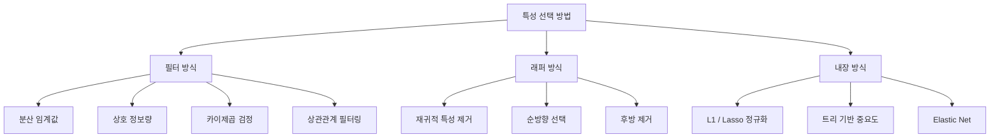
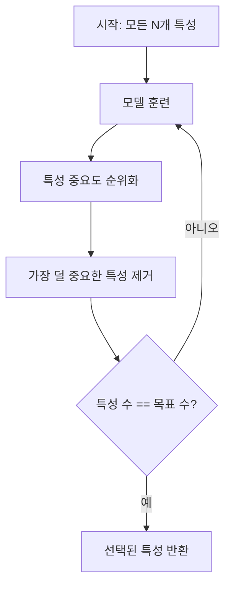
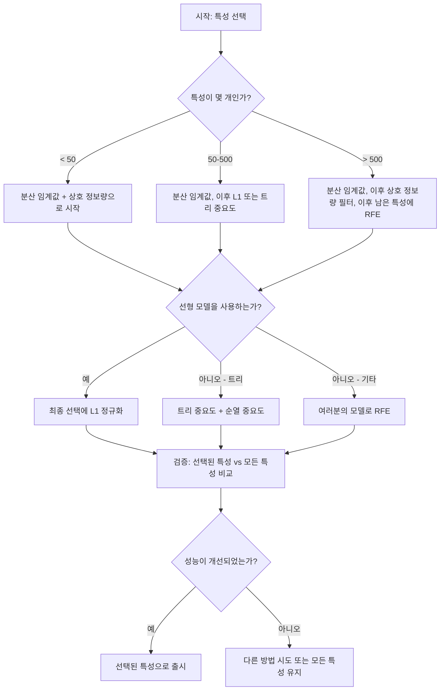

# 특성 선택

> 특성이 많다고 더 좋은 것은 아닙니다. 올바른 특성이 더 좋습니다.

**Type:** Build
**Languages:** Python
**Prerequisites:** Phase 2, Lessons 01-09, 08(특성 엔지니어링)
**Time:** ~75 minutes

## 학습 목표

- 필터 방식(분산 임계값, 상호 정보량, 카이제곱)과 래퍼 방식(RFE, 순방향 선택)을 처음부터 구현한다
- 상호 정보량이 상관관계가 놓치는 비선형 특성-타깃 관계를 포착하는 이유를 설명한다
- L1 정규화(내장 선택)와 RFE(래퍼 선택)를 비교하고 계산 비용의 트레이드오프를 평가한다
- 여러 방법을 결합하는 특성 선택 파이프라인을 만들고 홀드아웃 데이터에서 일반화가 개선됨을 보인다

## 문제

특성이 500개 있습니다. 모델은 느리게 훈련되고, 계속 과적합하며, 아무도 모델이 무엇을 배웠는지 설명하지 못합니다. 성능을 높이려고 특성을 더 추가합니다. 더 나빠집니다.

이것이 차원의 저주가 실제로 작동하는 모습입니다. 특성 수가 늘어날수록 특성 공간의 부피는 폭발합니다. 데이터 포인트는 희소해집니다. 점 사이의 거리는 서로 비슷해집니다. 모델은 실제 패턴을 찾기 위해 지수적으로 더 많은 데이터를 필요로 합니다. 노이즈 특성은 신호 특성을 덮어 버립니다. 과적합이 기본값이 됩니다.

특성 선택은 해독제입니다. 노이즈를 걷어냅니다. 중복을 제거합니다. 타깃에 대한 실제 정보를 담은 특성만 남깁니다. 결과는 더 빠른 훈련, 더 나은 일반화, 실제로 설명할 수 있는 모델입니다.

목표는 사용 가능한 모든 정보를 쓰는 것이 아닙니다. 올바른 정보를 쓰는 것입니다.

## 개념

### 특성 선택의 세 가지 범주

모든 특성 선택 방법은 세 범주 중 하나에 속합니다.



**필터 방식**은 통계적 척도로 각 특성을 독립적으로 점수화합니다. 모델을 사용하지 않습니다. 빠르지만 특성 상호작용을 놓칩니다.

**래퍼 방식**은 특성 부분집합을 평가하기 위해 모델을 훈련합니다. 모델 성능을 점수로 사용합니다. 결과는 더 좋을 수 있지만 모델을 여러 번 다시 훈련하므로 비쌉니다.

**내장 방식**은 모델 훈련의 일부로 특성을 선택합니다. L1 정규화는 가중치를 0으로 밀어냅니다. 결정 트리는 가장 유용한 특성으로 분할합니다. 선택은 별도 단계가 아니라 적합 중에 일어납니다.

### 분산 임계값

가장 단순한 필터입니다. 어떤 특성이 샘플 전반에서 거의 변하지 않는다면 정보가 거의 없습니다.

1000개 샘플 중 999개에서 0.0인 특성을 생각해 봅시다. 그 분산은 거의 0입니다. 어떤 모델도 이 특성으로 클래스를 구분할 수 없습니다. 제거하세요.

```text
variance(x) = mean((x - mean(x))^2)
```

임계값(예: 0.01)을 설정합니다. 그보다 분산이 낮은 모든 특성을 버립니다. 이는 타깃 변수를 전혀 보지 않고 상수 또는 거의 상수인 특성을 제거합니다.

사용 시점: 다른 방법을 적용하기 전 전처리 단계로 사용합니다. 거의 비용 없이 명백히 쓸모없는 특성을 잡아냅니다.

한계: 특성의 분산이 높아도 순수한 노이즈일 수 있습니다. 분산 임계값은 필요하지만 충분하지 않습니다.

### 상호 정보량

상호 정보량은 특성 X의 값을 아는 것이 타깃 Y에 대한 불확실성을 얼마나 줄이는지 측정합니다.

```text
I(X; Y) = sum_x sum_y p(x, y) * log(p(x, y) / (p(x) * p(y)))
```

X와 Y가 독립이면 p(x, y) = p(x) * p(y)이므로 로그 항은 0이고 I(X; Y) = 0입니다. X가 Y에 대해 더 많은 것을 말해 줄수록 상호 정보량은 높아집니다.

상관관계 대비 핵심 장점: 상호 정보량은 비선형 관계를 포착합니다. 어떤 특성은 타깃과 상관관계가 0이지만 관계가 이차 또는 주기적이어서 상호 정보량은 높을 수 있습니다.

연속 특성의 경우 먼저 구간으로 이산화합니다(히스토그램 기반 추정). 구간 수는 추정값에 영향을 줍니다 -- 구간이 너무 적으면 정보를 잃고, 너무 많으면 노이즈가 늘어납니다. 흔한 선택은 sqrt(n)개 구간 또는 Sturges' rule(1 + log2(n))입니다.


### Recursive feature elimination (RFE)

RFE는 래퍼 방식입니다. 모델 자체의 특성 중요도를 사용해 반복적으로 가지치기합니다.

1. 모든 특성으로 모델을 훈련한다
2. 특성 중요도로 순위를 매긴다(선형 모델은 계수, 트리는 불순도 감소)
3. 가장 덜 중요한 특성을 제거한다
4. 원하는 특성 수가 남을 때까지 반복한다



RFE는 모델이 남은 모든 특성을 함께 보기 때문에 특성 상호작용을 고려합니다. 한 특성을 제거하면 다른 특성의 중요도가 바뀝니다. 그래서 필터 방식보다 더 철저합니다.

비용: 모델을 N - target번 훈련합니다. 특성이 500개이고 목표가 10개라면 490번의 훈련 실행입니다. 비싼 모델에서는 느립니다. 각 단계에서 여러 특성을 제거하면 속도를 높일 수 있습니다(예: 매 라운드 하위 10% 제거).

### L1 (Lasso) 정규화

L1 정규화는 손실 함수에 가중치의 절댓값을 더합니다.

```text
loss = prediction_error + alpha * sum(|w_i|)
```

alpha 매개변수는 특성을 얼마나 공격적으로 가지치기할지 제어합니다. alpha가 높을수록 더 많은 가중치가 정확히 0이 됩니다.

왜 정확히 0일까요? L1 페널티는 가중치 공간에 마름모 모양의 제약 영역을 만듭니다. 최적해는 이 마름모의 꼭짓점에 놓이는 경향이 있고, 그곳에서는 하나 이상의 가중치가 0입니다. L2 정규화(ridge)는 원형 제약을 만들어 가중치를 줄이지만 0에 정확히 닿는 경우는 드뭅니다.

이것이 내장 특성 선택입니다. 모델은 훈련 중 어떤 특성을 무시할지 배웁니다. 가중치가 0인 특성은 사실상 제거됩니다.

장점: 한 번의 훈련 실행, 상관된 특성 처리(하나를 고르고 나머지를 0으로 만듦), 대부분의 선형 모델 구현에 내장됨.

한계: 선형 모델에서만 작동합니다. 비선형 특성 중요도는 포착할 수 없습니다.

### 트리 기반 특성 중요도

결정 트리와 그 앙상블(랜덤 포레스트, 그래디언트 부스팅)은 자연스럽게 특성의 순위를 매깁니다. 모든 분할은 불순도(분류의 경우 Gini 또는 entropy, 회귀의 경우 분산)를 줄입니다. 더 큰 불순도 감소를 만드는 특성이 더 중요합니다.

T개의 트리가 있는 랜덤 포레스트라면:

```text
importance(feature_j) = (1/T) * sum over all trees of
    sum over all nodes splitting on feature_j of
        (n_samples * impurity_decrease)
```

이는 각 특성에 대해 정규화된 중요도 점수를 줍니다. 비선형 관계와 특성 상호작용을 자동으로 처리합니다.

주의: 트리 기반 중요도는 고유값이 많은 특성(높은 카디널리티)에 편향됩니다. 무작위 ID 열은 모든 샘플을 완벽히 나눌 수 있기 때문에 중요해 보일 것입니다. 순열 중요도를 sanity check로 사용하세요.

### 순열 중요도

모델 독립적인 방법입니다.

1. 모델을 훈련하고 검증 데이터에서 기준 성능을 기록한다
2. 각 특성에 대해 값을 무작위로 섞고 성능 하락을 측정한다
3. 하락이 클수록 그 특성이 더 중요하다

어떤 특성을 섞어도 성능이 나빠지지 않는다면 모델은 그 특성에 의존하지 않습니다. 성능이 무너지면 그 특성은 핵심입니다.

순열 중요도는 트리 기반 중요도의 카디널리티 편향을 피합니다. 하지만 느립니다. 안정성을 위해 여러 번 반복하며 특성마다 전체 평가가 한 번 필요합니다.

### 비교 표

| 방법 | 유형 | 속도 | 비선형 | 특성 상호작용 |
|--------|------|-------|-----------|---------------------|
| 분산 임계값 | 필터 | 매우 빠름 | 아니오 | 아니오 |
| 상호 정보량 | 필터 | 빠름 | 예 | 아니오 |
| 상관관계 필터 | 필터 | 빠름 | 아니오 | 아니오 |
| RFE | 래퍼 | 느림 | 모델에 따라 다름 | 예 |
| L1 / Lasso | 내장 | 빠름 | 아니오(선형) | 아니오 |
| 트리 중요도 | 내장 | 중간 | 예 | 예 |
| 순열 중요도 | 모델 독립 | 느림 | 예 | 예 |

### 의사결정 흐름도



## 직접 만들기

### 1단계: 알려진 특성 구조를 가진 합성 데이터 생성하기

```python
import numpy as np


def make_feature_selection_data(n_samples=500, seed=42):
    rng = np.random.RandomState(seed)

    x1 = rng.randn(n_samples)
    x2 = rng.randn(n_samples)
    x3 = rng.randn(n_samples)
    x4 = x1 + 0.1 * rng.randn(n_samples)
    x5 = x2 + 0.1 * rng.randn(n_samples)

    informative = np.column_stack([x1, x2, x3, x4, x5])

    correlated = np.column_stack([
        x1 * 0.9 + 0.1 * rng.randn(n_samples),
        x2 * 0.8 + 0.2 * rng.randn(n_samples),
        x3 * 0.7 + 0.3 * rng.randn(n_samples),
        x1 * 0.5 + x2 * 0.5 + 0.1 * rng.randn(n_samples),
        x2 * 0.6 + x3 * 0.4 + 0.1 * rng.randn(n_samples),
    ])

    noise = rng.randn(n_samples, 10) * 0.5

    X = np.hstack([informative, correlated, noise])
    y = (2 * x1 - 1.5 * x2 + x3 + 0.5 * rng.randn(n_samples) > 0).astype(int)

    feature_names = (
        [f"info_{i}" for i in range(5)]
        + [f"corr_{i}" for i in range(5)]
        + [f"noise_{i}" for i in range(10)]
    )

    return X, y, feature_names
```

우리는 정답 구조를 알고 있습니다. 특성 0-4는 유익하고(또한 3과 4는 0과 1의 상관된 복사본입니다), 특성 5-9는 유익한 특성과 상관되어 있으며, 특성 10-19는 순수한 노이즈입니다. 좋은 선택 방법은 0-4를 가장 높게, 10-19를 가장 낮게 순위화해야 합니다.

### 2단계: 분산 임계값

```python
def variance_threshold(X, threshold=0.01):
    variances = np.var(X, axis=0)
    mask = variances > threshold
    return mask, variances
```

### 3단계: 상호 정보량(이산)

```python
def discretize(x, n_bins=10):
    min_val, max_val = x.min(), x.max()
    if max_val == min_val:
        return np.zeros_like(x, dtype=int)
    bin_edges = np.linspace(min_val, max_val, n_bins + 1)
    binned = np.digitize(x, bin_edges[1:-1])
    return binned


def mutual_information(X, y, n_bins=10):
    n_samples, n_features = X.shape
    mi_scores = np.zeros(n_features)

    y_vals, y_counts = np.unique(y, return_counts=True)
    p_y = y_counts / n_samples

    for f in range(n_features):
        x_binned = discretize(X[:, f], n_bins)
        x_vals, x_counts = np.unique(x_binned, return_counts=True)
        p_x = dict(zip(x_vals, x_counts / n_samples))

        mi = 0.0
        for xv in x_vals:
            for yi, yv in enumerate(y_vals):
                joint_mask = (x_binned == xv) & (y == yv)
                p_xy = np.sum(joint_mask) / n_samples
                if p_xy > 0:
                    mi += p_xy * np.log(p_xy / (p_x[xv] * p_y[yi]))
        mi_scores[f] = mi

    return mi_scores
```

### 4단계: 재귀적 특성 제거

```python
def simple_logistic_importance(X, y, lr=0.1, epochs=100):
    n_samples, n_features = X.shape
    w = np.zeros(n_features)
    b = 0.0

    for _ in range(epochs):
        z = X @ w + b
        pred = 1.0 / (1.0 + np.exp(-np.clip(z, -500, 500)))
        error = pred - y
        w -= lr * (X.T @ error) / n_samples
        b -= lr * np.mean(error)

    return w, b


def rfe(X, y, n_features_to_select=5, lr=0.1, epochs=100):
    n_total = X.shape[1]
    remaining = list(range(n_total))
    rankings = np.ones(n_total, dtype=int)
    rank = n_total

    while len(remaining) > n_features_to_select:
        X_subset = X[:, remaining]
        w, _ = simple_logistic_importance(X_subset, y, lr, epochs)
        importances = np.abs(w)

        least_idx = np.argmin(importances)
        original_idx = remaining[least_idx]
        rankings[original_idx] = rank
        rank -= 1
        remaining.pop(least_idx)

    for idx in remaining:
        rankings[idx] = 1

    selected_mask = rankings == 1
    return selected_mask, rankings
```

### 5단계: L1 특성 선택

```python
def soft_threshold(w, alpha):
    return np.sign(w) * np.maximum(np.abs(w) - alpha, 0)


def l1_feature_selection(X, y, alpha=0.1, lr=0.01, epochs=500):
    n_samples, n_features = X.shape
    w = np.zeros(n_features)
    b = 0.0

    for _ in range(epochs):
        z = X @ w + b
        pred = 1.0 / (1.0 + np.exp(-np.clip(z, -500, 500)))
        error = pred - y

        gradient_w = (X.T @ error) / n_samples
        gradient_b = np.mean(error)

        w -= lr * gradient_w
        w = soft_threshold(w, lr * alpha)
        b -= lr * gradient_b

    selected_mask = np.abs(w) > 1e-6
    return selected_mask, w
```

### 6단계: 트리 기반 중요도(간단한 결정 트리)

```python
def gini_impurity(y):
    if len(y) == 0:
        return 0.0
    classes, counts = np.unique(y, return_counts=True)
    probs = counts / len(y)
    return 1.0 - np.sum(probs ** 2)


def best_split(X, y, feature_idx):
    values = np.unique(X[:, feature_idx])
    if len(values) <= 1:
        return None, -1.0

    best_threshold = None
    best_gain = -1.0
    parent_gini = gini_impurity(y)
    n = len(y)

    for i in range(len(values) - 1):
        threshold = (values[i] + values[i + 1]) / 2.0
        left_mask = X[:, feature_idx] <= threshold
        right_mask = ~left_mask

        n_left = np.sum(left_mask)
        n_right = np.sum(right_mask)

        if n_left == 0 or n_right == 0:
            continue

        gain = parent_gini - (n_left / n) * gini_impurity(y[left_mask]) - (n_right / n) * gini_impurity(y[right_mask])

        if gain > best_gain:
            best_gain = gain
            best_threshold = threshold

    return best_threshold, best_gain


def tree_importance(X, y, n_trees=50, max_depth=5, seed=42):
    rng = np.random.RandomState(seed)
    n_samples, n_features = X.shape
    importances = np.zeros(n_features)

    for _ in range(n_trees):
        sample_idx = rng.choice(n_samples, size=n_samples, replace=True)
        feature_subset = rng.choice(n_features, size=max(1, int(np.sqrt(n_features))), replace=False)

        X_boot = X[sample_idx]
        y_boot = y[sample_idx]

        tree_imp = _build_tree_importance(X_boot, y_boot, feature_subset, max_depth)
        importances += tree_imp

    total = importances.sum()
    if total > 0:
        importances /= total

    return importances


def _build_tree_importance(X, y, feature_subset, max_depth, depth=0):
    n_features = X.shape[1]
    importances = np.zeros(n_features)

    if depth >= max_depth or len(np.unique(y)) <= 1 or len(y) < 4:
        return importances

    best_feature = None
    best_threshold = None
    best_gain = -1.0

    for f in feature_subset:
        threshold, gain = best_split(X, y, f)
        if gain > best_gain:
            best_gain = gain
            best_feature = f
            best_threshold = threshold

    if best_feature is None or best_gain <= 0:
        return importances

    importances[best_feature] += best_gain * len(y)

    left_mask = X[:, best_feature] <= best_threshold
    right_mask = ~left_mask

    importances += _build_tree_importance(X[left_mask], y[left_mask], feature_subset, max_depth, depth + 1)
    importances += _build_tree_importance(X[right_mask], y[right_mask], feature_subset, max_depth, depth + 1)

    return importances
```

### 7단계: 모든 방법 실행하고 비교하기

코드 파일은 같은 합성 데이터셋에서 다섯 가지 방법을 모두 실행하고 각 방법이 어떤 특성을 선택하는지 보여 주는 비교 표를 출력합니다.

## 사용하기

scikit-learn에서는 특성 선택이 파이프라인에 내장되어 있습니다.

```python
from sklearn.feature_selection import (
    VarianceThreshold,
    mutual_info_classif,
    RFE,
    SelectFromModel,
)
from sklearn.linear_model import Lasso, LogisticRegression
from sklearn.ensemble import RandomForestClassifier

vt = VarianceThreshold(threshold=0.01)
X_filtered = vt.fit_transform(X)

mi_scores = mutual_info_classif(X, y)
top_k = np.argsort(mi_scores)[-10:]

rfe_selector = RFE(LogisticRegression(), n_features_to_select=10)
rfe_selector.fit(X, y)
X_rfe = rfe_selector.transform(X)

lasso_selector = SelectFromModel(Lasso(alpha=0.01))
lasso_selector.fit(X, y)
X_lasso = lasso_selector.transform(X)

rf = RandomForestClassifier(n_estimators=100)
rf.fit(X, y)
importances = rf.feature_importances_
```

처음부터 구현한 버전은 각 방법 내부에서 정확히 무슨 일이 일어나는지 보여 줍니다. 분산 임계값은 단지 `var(X, axis=0)`을 계산하고 마스크를 적용하는 것입니다. 상호 정보량은 분할표에서 결합 빈도와 주변 빈도를 세는 것입니다. RFE는 훈련, 순위화, 가지치기를 반복하는 루프입니다. L1은 soft-thresholding 단계가 있는 경사하강법입니다. 트리 중요도는 분할 전반에서 불순도 감소를 누적합니다. 마법은 없습니다 -- 통계와 루프뿐입니다.

sklearn 버전은 견고성(예: mutual_info_classif는 구간화 대신 k-NN 밀도 추정을 사용), 속도(C 구현), 파이프라인 통합을 더합니다.

## 출시하기

이 수업의 산출물:
- `outputs/skill-feature-selector.md` -- 올바른 특성 선택 방법을 고르기 위한 빠른 참조 의사결정 트리

## 연습 문제

1. **순방향 선택**: RFE의 반대를 구현하세요. 특성 0개에서 시작합니다. 각 단계에서 모델 성능을 가장 많이 개선하는 특성을 추가합니다. 특성을 추가해도 더 이상 도움이 되지 않으면 멈춥니다. 선택된 특성을 RFE 결과와 비교하세요. 어느 쪽이 더 빠른가요? 어느 쪽이 더 좋은 결과를 주나요?

2. **안정성 선택**: L1 특성 선택을 50번 실행하되, 매번 데이터의 무작위 80% 부분샘플과 약간 다른 alpha 값으로 실행하세요. 각 특성이 선택된 횟수를 세세요. 실행의 > 80%에서 선택된 특성은 "안정적"입니다. 안정적인 특성을 단일 실행 L1 선택과 비교하세요. 어느 쪽이 더 신뢰할 만한가요?

3. **다중공선성 탐지**: 모든 특성의 상관 행렬을 계산하세요. 상관 임계값(예: 0.9)이 주어졌을 때, 강하게 상관된 각 쌍에서 하나의 특성을 제거하는 함수를 구현하세요(타깃과의 상호 정보량이 더 높은 특성을 유지). 합성 데이터셋에서 테스트하고 중복된 상관 특성이 제거되는지 확인하세요.

4. **특성 선택 파이프라인**: 분산 임계값, 상호 정보량 필터, RFE를 하나의 파이프라인으로 연결하세요. 먼저 거의 0에 가까운 분산의 특성을 제거하고, 그다음 상호 정보량 기준 상위 50%를 유지한 뒤, 남은 특성에 RFE를 실행합니다. 이 파이프라인을 모든 특성에 RFE만 실행하는 것과 비교하세요. 파이프라인이 더 빠른가요? 정확도는 같은가요?

5. **순열 중요도를 처음부터 구현하기**: 순열 중요도를 구현하세요. 각 특성에 대해 값을 10번 섞고 F1 점수의 평균 하락을 측정합니다. 순위를 트리 기반 중요도와 비교하세요. 둘이 불일치하는 경우를 찾고 그 이유를 설명하세요(힌트: 상관된 특성).

## 핵심 용어

| 용어 | 사람들이 말하는 것 | 실제 의미 |
|------|----------------|----------------------|
| 필터 방식 | "특성을 독립적으로 점수화" | 모델을 훈련하지 않고 통계적 척도로 특성을 순위화하며, 각 특성을 고립해서 평가하는 특성 선택 접근법 |
| 래퍼 방식 | "모델을 사용해 특성을 고른다" | 모델을 훈련하고 그 성능을 선택 기준으로 사용해 특성 부분집합을 평가하는 특성 선택 접근법 |
| 내장 방식 | "모델이 훈련 중 특성을 선택한다" | L1 정규화가 가중치를 0으로 밀어내는 것처럼, 모델 적합의 일부로 일어나는 특성 선택 |
| 상호 정보량 | "한 변수가 다른 변수에 대해 얼마나 알려 주는가" | X를 알 때 Y에 대한 불확실성이 얼마나 줄어드는지 측정하며, 선형과 비선형 의존성을 모두 포착한다 |
| 재귀적 특성 제거 | "훈련, 순위화, 가지치기, 반복" | 모델을 훈련하고 가장 덜 중요한 특성을 제거하는 과정을 목표 개수에 도달할 때까지 반복하는 래퍼 방식 |
| L1 / Lasso 정규화 | "특성을 죽이는 페널티" | 손실 함수에 가중치 절댓값의 합을 더해 중요하지 않은 특성 가중치를 정확히 0으로 밀어낸다 |
| 분산 임계값 | "상수 특성 제거" | 샘플 전반의 분산이 지정한 임계값보다 낮은 특성을 버려 정보가 없는 특성을 걸러낸다 |
| 특성 중요도 | "어떤 특성이 가장 중요한가" | 각 특성이 모델 예측에 얼마나 기여하는지 나타내는 점수로, 분할 이득(트리) 또는 계수 크기(선형)에서 계산된다 |
| 순열 중요도 | "섞고 피해를 측정" | 각 특성의 값을 무작위로 섞고 그 결과 모델 성능이 얼마나 떨어지는지 측정해 특성 중요도를 평가한다 |
| 차원의 저주 | "특성이 너무 많고 데이터는 부족하다" | 특성을 추가하면 특성 공간의 부피가 지수적으로 증가해 데이터가 희소해지고 거리가 의미 없어지는 현상 |

## 더 읽을거리

- [An Introduction to Variable and Feature Selection (Guyon & Elisseeff, 2003)](https://jmlr.org/papers/v3/guyon03a.html) -- 특성 선택 방법에 대한 기초 서베이로, 지금도 널리 인용됨
- [scikit-learn Feature Selection Guide](https://scikit-learn.org/stable/modules/feature_selection.html) -- 필터, 래퍼, 내장 방식에 대한 코드 예제 중심의 실용 참조
- [Stability Selection (Meinshausen & Buhlmann, 2010)](https://arxiv.org/abs/0809.2932) -- 견고하고 재현 가능한 결과를 위해 부분샘플링과 특성 선택을 결합
- [Beware Default Random Forest Importances (Strobl et al., 2007)](https://bmcbioinformatics.biomedcentral.com/articles/10.1186/1471-2105-8-25) -- 트리 기반 중요도의 카디널리티 편향을 보여 주고 대안으로 조건부 중요도를 제안
