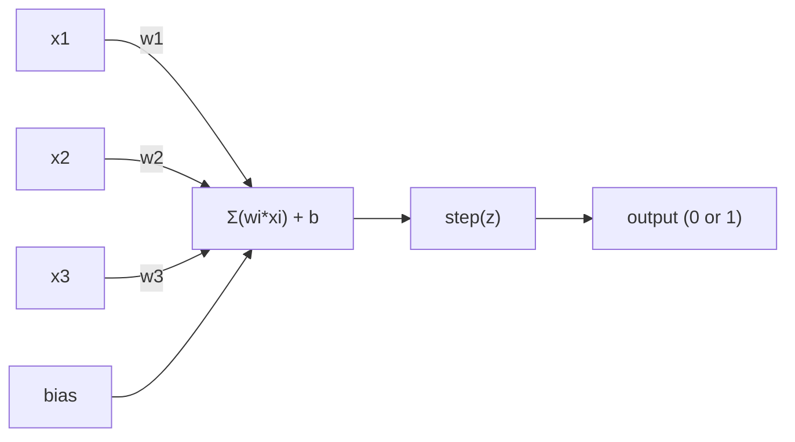
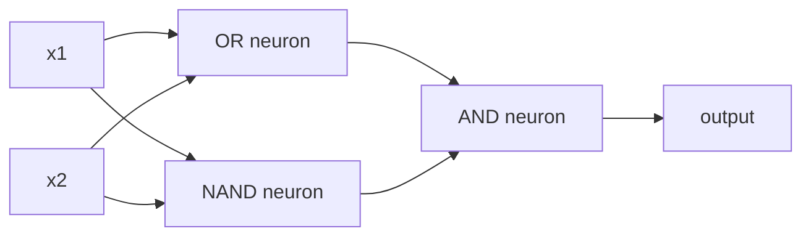

# 퍼셉트론

> 퍼셉트론은 신경망의 원자입니다. 쪼개 보면 가중치, 편향, 그리고 결정이 들어 있습니다.

**Type:** Build
**Languages:** Python
**Prerequisites:** Phase 1 (Linear Algebra Intuition)
**Time:** ~60 minutes

## 학습 목표

- 가중치 업데이트 규칙과 계단 활성화 함수를 포함해 Python으로 퍼셉트론을 처음부터 구현합니다
- 단일 퍼셉트론이 선형 분리 가능한 문제만 풀 수 있는 이유를 설명하고 XOR 실패 사례를 시연합니다
- OR, NAND, AND 게이트를 조합해 XOR을 푸는 다층 퍼셉트론을 구성합니다
- sigmoid 활성화와 역전파를 사용하는 2층 네트워크를 훈련해 XOR을 자동으로 학습합니다

## 문제

여러분은 벡터와 내적을 알고 있습니다. 행렬이 입력을 출력으로 변환한다는 것도 알고 있습니다. 하지만 기계는 어떤 변환을 써야 하는지 어떻게 *학습*할까요?

퍼셉트론이 이 질문에 답합니다. 퍼셉트론은 가능한 가장 단순한 학습 기계입니다. 입력을 받고, 가중치를 곱하고, 편향을 더한 뒤, 이진 결정을 내립니다. 그리고 조정합니다. 그게 전부입니다. 지금까지 만들어진 모든 신경망은 이 아이디어를 층층이 쌓은 것입니다.

퍼셉트론을 이해한다는 것은 코드에서 "학습"이 실제로 무엇을 뜻하는지 이해한다는 뜻입니다. 출력이 현실과 맞을 때까지 숫자를 조정하는 것입니다.

## 개념

### 하나의 뉴런, 하나의 결정

퍼셉트론은 n개의 입력을 받아 각각에 가중치를 곱하고, 모두 더한 뒤, 편향을 더하고, 그 결과를 활성화 함수에 통과시킵니다.



계단 함수는 가차 없습니다. 가중합에 편향을 더한 값이 >= 0이면 1을 출력합니다. 그렇지 않으면 0을 출력합니다.

```text
step(z) = 1  if z >= 0
           0  if z < 0
```

이것은 선형 분류기입니다. 가중치와 편향은 입력 공간을 두 영역으로 나누는 직선, 또는 더 높은 차원에서는 초평면을 정의합니다.

### 결정 경계

입력이 두 개라면 퍼셉트론은 2D 공간에 직선을 그립니다.

```text
  x2
  ┤
  │  Class 1        /
  │    (0)          /
  │                /
  │               / w1·x1 + w2·x2 + b = 0
  │              /
  │             /     Class 2
  │            /        (1)
  ┼───────────/──────────── x1
```

직선 한쪽의 모든 것은 0을 출력합니다. 다른 쪽의 모든 것은 1을 출력합니다. 훈련은 이 직선이 클래스를 올바르게 나눌 때까지 이동시키는 과정입니다.

### 학습 규칙

퍼셉트론 학습 규칙은 단순합니다.

```text
For each training example (x, y_true):
    y_pred = predict(x)
    error = y_true - y_pred

    For each weight:
        w_i = w_i + learning_rate * error * x_i
    bias = bias + learning_rate * error
```

예측이 맞으면 error = 0이므로 아무것도 바뀌지 않습니다. 0으로 예측했지만 1이어야 했다면 가중치가 증가합니다. 1로 예측했지만 0이어야 했다면 가중치가 감소합니다. 학습률은 각 조정의 크기를 제어합니다.

### XOR 문제

여기서 문제가 드러납니다. 다음 논리 게이트를 보세요.

```text
AND gate:           OR gate:            XOR gate:
x1  x2  out         x1  x2  out         x1  x2  out
0   0   0           0   0   0           0   0   0
0   1   0           0   1   1           0   1   1
1   0   0           1   0   1           1   0   1
1   1   1           1   1   1           1   1   0
```

AND와 OR은 선형 분리 가능합니다. 0과 1을 나누는 직선 하나를 그릴 수 있습니다. XOR은 그렇지 않습니다. [0,1]과 [1,0]을 [0,0]과 [1,1]에서 분리하는 직선 하나는 존재하지 않습니다.

```text
AND (separable):        XOR (not separable):

  x2                      x2
  1 ┤  0     1            1 ┤  1     0
    │     /                 │
  0 ┤  0 / 0              0 ┤  0     1
    ┼──/──────── x1         ┼──────────── x1
       line works!          no single line works!
```

이것은 근본적인 한계입니다. 단일 퍼셉트론은 선형 분리 가능한 문제만 풀 수 있습니다. Minsky와 Papert는 1969년에 이를 증명했고, 이 결과는 거의 10년 동안 신경망 연구를 멈춰 세웠습니다.

해결책은 퍼셉트론을 층으로 쌓는 것입니다. 다층 퍼셉트론은 두 개의 선형 결정을 비선형 결정으로 결합해 XOR을 풀 수 있습니다.

```figure
perceptron-boundary
```

## 직접 만들기

### Step 1: Perceptron 클래스

```python
class Perceptron:
    def __init__(self, n_inputs, learning_rate=0.1):
        self.weights = [0.0] * n_inputs
        self.bias = 0.0
        self.lr = learning_rate

    def predict(self, inputs):
        total = sum(w * x for w, x in zip(self.weights, inputs))
        total += self.bias
        return 1 if total >= 0 else 0

    def train(self, training_data, epochs=100):
        for epoch in range(epochs):
            errors = 0
            for inputs, target in training_data:
                prediction = self.predict(inputs)
                error = target - prediction
                if error != 0:
                    errors += 1
                    for i in range(len(self.weights)):
                        self.weights[i] += self.lr * error * inputs[i]
                    self.bias += self.lr * error
            if errors == 0:
                print(f"Converged at epoch {epoch + 1}")
                return
        print(f"Did not converge after {epochs} epochs")
```

### Step 2: 논리 게이트로 훈련하기

```python
and_data = [
    ([0, 0], 0),
    ([0, 1], 0),
    ([1, 0], 0),
    ([1, 1], 1),
]

or_data = [
    ([0, 0], 0),
    ([0, 1], 1),
    ([1, 0], 1),
    ([1, 1], 1),
]

not_data = [
    ([0], 1),
    ([1], 0),
]

print("=== AND Gate ===")
p_and = Perceptron(2)
p_and.train(and_data)
for inputs, _ in and_data:
    print(f"  {inputs} -> {p_and.predict(inputs)}")

print("\n=== OR Gate ===")
p_or = Perceptron(2)
p_or.train(or_data)
for inputs, _ in or_data:
    print(f"  {inputs} -> {p_or.predict(inputs)}")

print("\n=== NOT Gate ===")
p_not = Perceptron(1)
p_not.train(not_data)
for inputs, _ in not_data:
    print(f"  {inputs} -> {p_not.predict(inputs)}")
```

### Step 3: XOR 실패 관찰하기

```python
xor_data = [
    ([0, 0], 0),
    ([0, 1], 1),
    ([1, 0], 1),
    ([1, 1], 0),
]

print("\n=== XOR Gate (single perceptron) ===")
p_xor = Perceptron(2)
p_xor.train(xor_data, epochs=1000)
for inputs, expected in xor_data:
    result = p_xor.predict(inputs)
    status = "OK" if result == expected else "WRONG"
    print(f"  {inputs} -> {result} (expected {expected}) {status}")
```

절대 수렴하지 않을 것입니다. 이것이 단일 퍼셉트론이 XOR을 학습할 수 없다는 확실한 증거입니다.

### Step 4: 두 층으로 XOR 풀기

요령은 XOR = (x1 OR x2) AND NOT (x1 AND x2)입니다. 세 개의 퍼셉트론을 결합합니다.



```python
def xor_network(x1, x2):
    or_neuron = Perceptron(2)
    or_neuron.weights = [1.0, 1.0]
    or_neuron.bias = -0.5

    nand_neuron = Perceptron(2)
    nand_neuron.weights = [-1.0, -1.0]
    nand_neuron.bias = 1.5

    and_neuron = Perceptron(2)
    and_neuron.weights = [1.0, 1.0]
    and_neuron.bias = -1.5

    hidden1 = or_neuron.predict([x1, x2])
    hidden2 = nand_neuron.predict([x1, x2])
    output = and_neuron.predict([hidden1, hidden2])
    return output


print("\n=== XOR Gate (multi-layer network) ===")
for inputs, expected in xor_data:
    result = xor_network(inputs[0], inputs[1])
    print(f"  {inputs} -> {result} (expected {expected})")
```

네 가지 경우가 모두 맞습니다. 퍼셉트론을 층으로 쌓으면 단일 퍼셉트론으로는 만들 수 없는 결정 경계가 생깁니다.

### Step 5: 2층 네트워크 훈련하기

Step 4에서는 가중치를 손으로 연결했습니다. XOR에는 통하지만, 올바른 가중치를 미리 알 수 없는 실제 문제에는 통하지 않습니다. 해결책은 계단 함수를 sigmoid로 바꾸고 역전파로 가중치를 자동 학습하는 것입니다.

```python
class TwoLayerNetwork:
    def __init__(self, learning_rate=0.5):
        import random
        random.seed(0)
        self.w_hidden = [[random.uniform(-1, 1), random.uniform(-1, 1)] for _ in range(2)]
        self.b_hidden = [random.uniform(-1, 1), random.uniform(-1, 1)]
        self.w_output = [random.uniform(-1, 1), random.uniform(-1, 1)]
        self.b_output = random.uniform(-1, 1)
        self.lr = learning_rate

    def sigmoid(self, x):
        import math
        x = max(-500, min(500, x))
        return 1.0 / (1.0 + math.exp(-x))

    def forward(self, inputs):
        self.inputs = inputs
        self.hidden_outputs = []
        for i in range(2):
            z = sum(w * x for w, x in zip(self.w_hidden[i], inputs)) + self.b_hidden[i]
            self.hidden_outputs.append(self.sigmoid(z))
        z_out = sum(w * h for w, h in zip(self.w_output, self.hidden_outputs)) + self.b_output
        self.output = self.sigmoid(z_out)
        return self.output

    def train(self, training_data, epochs=10000):
        for epoch in range(epochs):
            total_error = 0
            for inputs, target in training_data:
                output = self.forward(inputs)
                error = target - output
                total_error += error ** 2

                d_output = error * output * (1 - output)

                saved_w_output = self.w_output[:]
                hidden_deltas = []
                for i in range(2):
                    h = self.hidden_outputs[i]
                    hd = d_output * saved_w_output[i] * h * (1 - h)
                    hidden_deltas.append(hd)

                for i in range(2):
                    self.w_output[i] += self.lr * d_output * self.hidden_outputs[i]
                self.b_output += self.lr * d_output

                for i in range(2):
                    for j in range(len(inputs)):
                        self.w_hidden[i][j] += self.lr * hidden_deltas[i] * inputs[j]
                    self.b_hidden[i] += self.lr * hidden_deltas[i]
```

```python
net = TwoLayerNetwork(learning_rate=2.0)
net.train(xor_data, epochs=10000)
for inputs, expected in xor_data:
    result = net.forward(inputs)
    predicted = 1 if result >= 0.5 else 0
    print(f"  {inputs} -> {result:.4f} (rounded: {predicted}, expected {expected})")
```

Step 4와 다른 핵심 차이는 두 가지입니다. 첫째, 계단 함수가 sigmoid로 바뀝니다. sigmoid는 매끄럽기 때문에 gradient가 존재합니다. 둘째, `train` 메서드는 오차를 출력층에서 은닉층으로 뒤로 전파하며, 오차에 대한 기여도에 비례해 모든 가중치를 조정합니다. 이것이 20줄짜리 역전파입니다.

이것은 Lesson 03으로 가는 다리입니다. `d_output`과 `hidden_deltas` 뒤의 수학은 네트워크 그래프에 적용한 연쇄 법칙입니다. 다음 lesson에서 제대로 유도하겠습니다.

## 사용하기

방금 처음부터 만든 모든 것은 import 하나에 들어 있습니다.

```python
from sklearn.linear_model import Perceptron as SkPerceptron
import numpy as np

X = np.array([[0,0],[0,1],[1,0],[1,1]])
y = np.array([0, 0, 0, 1])

clf = SkPerceptron(max_iter=100, tol=1e-3)
clf.fit(X, y)
print([clf.predict([x])[0] for x in X])
```

다섯 줄입니다. 여러분의 30줄짜리 `Perceptron` 클래스도 같은 일을 합니다. sklearn 버전은 수렴 검사, 여러 손실 함수, sparse input 지원을 추가하지만, 핵심 루프는 동일합니다. 가중합, 계단 함수, 오차가 있을 때의 가중치 업데이트입니다.

진짜 차이는 규모가 커질 때 나타납니다. 프로덕션 네트워크에서 달라지는 점은 다음과 같습니다.

- 계단 함수가 sigmoid, ReLU, 또는 다른 매끄러운 활성화로 바뀝니다
- 가중치는 역전파로 자동 학습됩니다(Lesson 03)
- 층이 더 깊어집니다. 3층, 10층, 100층 이상
- 같은 원리는 유지됩니다. 각 층은 이전 층 출력에서 새 특징을 만듭니다

단일 퍼셉트론은 직선만 그릴 수 있습니다. 쌓으면 어떤 모양이든 그릴 수 있습니다.

## 내보내기

이 lesson의 산출물은 다음과 같습니다.

- `outputs/skill-perceptron.md` - 단층 아키텍처와 다층 아키텍처가 각각 언제 필요한지 다루는 skill

## 연습 문제

1. NAND 게이트에서 퍼셉트론을 훈련하세요. NAND는 universal gate로, 어떤 논리 회로도 NAND로 만들 수 있습니다. 그 가중치와 편향이 유효한 결정 경계를 이루는지 확인하세요.
2. Perceptron 클래스를 수정해 각 epoch의 결정 경계(w1*x1 + w2*x2 + b = 0)를 추적하게 하세요. AND 게이트 훈련 중 직선이 어떻게 이동하는지 출력하세요.
3. 3개 입력 중 적어도 2개가 1일 때만 1을 출력하는 3입력 퍼셉트론을 만드세요. 이것은 선형 분리 가능할까요? 왜 그런가요?

## 핵심 용어

| 용어 | 사람들이 흔히 말하는 것 | 실제 의미 |
|------|----------------|----------------------|
| Perceptron | "가짜 뉴런" | 입력과 가중치의 내적에 편향을 더하고 계단 함수를 통과시키는 선형 분류기 |
| Weight | "입력이 얼마나 중요한지" | 결정에 대한 각 입력의 기여도를 스케일하는 multiplier |
| Bias | "threshold" | 결정 경계를 이동시키는 상수로, 입력이 모두 0이어도 퍼셉트론이 발화할 수 있게 합니다 |
| Activation function | "값을 찌그러뜨리는 것" | 가중합 뒤에 적용되는 함수입니다. 퍼셉트론에서는 계단 함수, 현대 네트워크에서는 sigmoid/ReLU를 씁니다 |
| Linearly separable | "그 사이에 선을 그을 수 있다" | 단일 초평면이 클래스를 완벽하게 분리할 수 있는 dataset |
| XOR problem | "퍼셉트론이 못 하는 것" | 단층 네트워크가 비선형 분리 함수를 학습할 수 없다는 증거 |
| Decision boundary | "분류기가 전환되는 지점" | 입력 공간을 두 클래스로 나누는 초평면 w*x + b = 0 |
| Multi-layer perceptron | "진짜 신경망" | 퍼셉트론을 층으로 쌓은 구조로, 각 층의 출력이 다음 층의 입력으로 들어갑니다 |

## 더 읽을거리

- Frank Rosenblatt, "The Perceptron: A Probabilistic Model for Information Storage and Organization in the Brain" (1958) -- 모든 것을 시작한 원 논문
- Minsky & Papert, "Perceptrons" (1969) -- XOR이 단층 네트워크로 풀 수 없음을 증명해 퍼셉트론 연구를 10년 동안 멈춰 세운 책
- Michael Nielsen, "Neural Networks and Deep Learning", Chapter 1 (http://neuralnetworksanddeeplearning.com/) -- 무료 온라인 자료이며, 퍼셉트론이 어떻게 네트워크로 합성되는지에 대한 가장 좋은 시각적 설명입니다
