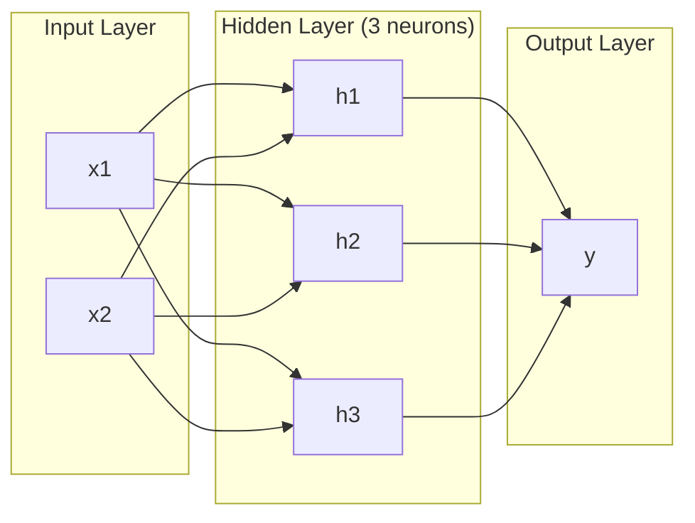
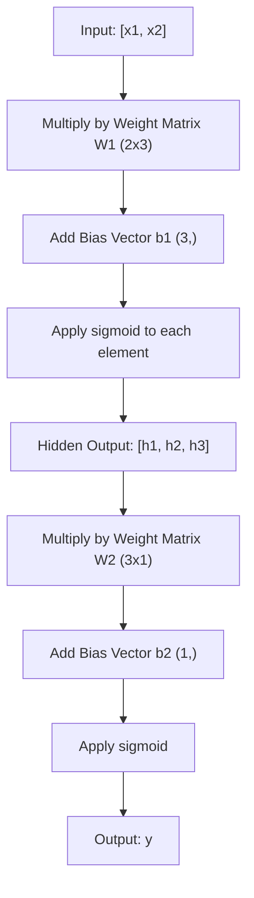
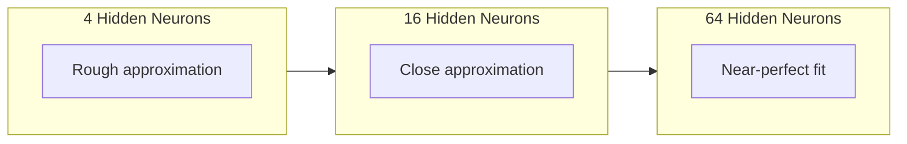

# 다층 네트워크와 순전파

> 하나의 뉴런은 직선을 그립니다. 그것들을 쌓으면 무엇이든 그릴 수 있습니다.

**Type:** Build
**Languages:** Python
**Prerequisites:** Phase 01 (Math Foundations), Lesson 03.01 (The Perceptron)
**Time:** ~90 minutes

## 학습 목표

- 완전한 forward pass를 수행하는 Layer와 Network 클래스로 다층 네트워크를 처음부터 만듭니다
- 네트워크의 각 층을 통과하는 행렬 차원을 추적하고 shape mismatch를 찾아냅니다
- 비선형 활성화를 쌓으면 네트워크가 곡선 결정 경계를 학습할 수 있는 이유를 설명합니다
- 손으로 조정한 sigmoid 가중치를 사용하는 2-2-1 architecture로 XOR 문제를 풉니다

## 문제

단일 뉴런은 직선 그리기 도구입니다. 그게 전부입니다. 데이터 위에 직선 하나를 긋습니다. 이미지 인식, 언어 이해, Go 플레이 같은 AI의 모든 실제 문제에는 곡선이 필요합니다. 뉴런을 층으로 쌓는 것이 곡선을 얻는 방법입니다.

1969년에 Minsky와 Papert는 이 한계가 치명적임을 증명했습니다. 단층 네트워크는 XOR을 학습할 수 없습니다. "학습하기 어렵다"가 아니라, 수학적으로 불가능합니다. XOR truth table은 [0,1]과 [1,0]을 한쪽에, [0,0]과 [1,1]을 다른 쪽에 놓습니다. 어떤 직선 하나도 이들을 분리하지 못합니다.

이 결과는 10년 넘게 신경망 funding을 멈춰 세웠습니다. 해결책은 돌이켜 보면 분명했습니다. 한 층만 쓰지 않는 것입니다. 뉴런을 층으로 쌓습니다. 첫 번째 층이 입력 공간을 새 특징으로 깎아 내고, 두 번째 층이 그 특징들을 결합해 직선 하나로는 만들 수 없는 결정을 내리게 합니다.

그 stack이 다층 네트워크입니다. 이것은 오늘날 프로덕션의 모든 딥러닝 모델의 기반입니다. 입력에서 은닉층을 거쳐 출력으로 데이터가 흐르는 forward pass는 다른 무엇보다 먼저 만들어야 하는 것입니다.

## 개념

### 층: 입력, 은닉, 출력

다층 네트워크에는 세 종류의 층이 있습니다.

**입력층** -- 사실 층이라고 하기 어렵습니다. 원시 데이터를 담습니다. 특징이 두 개라면 입력 노드도 두 개입니다. 여기서는 계산이 일어나지 않습니다.

**은닉층** -- 일이 일어나는 곳입니다. 각 뉴런은 이전 층의 모든 출력을 받아 가중치와 편향을 적용한 뒤, 그 결과를 활성화 함수에 통과시킵니다. 훈련 데이터에서 이 값들을 직접 볼 수 없기 때문에 "hidden"이라고 부릅니다.

**출력층** -- 최종 답입니다. 이진 분류에서는 sigmoid를 쓰는 뉴런 하나입니다. 다중 클래스에서는 클래스마다 뉴런 하나입니다.



이것은 2-3-1 네트워크입니다. 입력 두 개, 은닉 뉴런 세 개, 출력 하나입니다. 모든 연결에는 가중치가 있습니다. 입력을 제외한 모든 뉴런에는 편향이 있습니다.

각 층은 hidden state라고 부르는 숫자 벡터를 만듭니다. 텍스트에서는 hidden state가 차원을 늘립니다. 단어를 768개 숫자로 인코딩해 의미를 포착합니다. 이미지에서는 차원을 줄입니다. 수백만 픽셀을 다룰 수 있는 표현으로 압축합니다. hidden state는 학습이 머무는 곳입니다.

### 뉴런과 활성화

각 뉴런은 세 가지 일을 합니다.

1. 모든 입력에 대응하는 가중치를 곱합니다
2. 모든 곱을 더하고 편향을 더합니다
3. 그 합을 활성화 함수에 통과시킵니다

지금은 활성화로 sigmoid를 사용합니다.

```text
sigmoid(z) = 1 / (1 + e^(-z))
```

Sigmoid는 어떤 숫자든 (0, 1) 범위로 눌러 넣습니다. 큰 양수 입력은 1에 가까워집니다. 큰 음수 입력은 0에 가까워집니다. 0은 0.5로 매핑됩니다. 이 매끄러운 곡선이 학습을 가능하게 합니다. 퍼셉트론의 딱딱한 계단 함수와 달리 sigmoid는 모든 곳에 gradient가 있습니다.

### Forward Pass: 데이터가 흐르는 방식

Forward pass는 입력 데이터를 네트워크에 밀어 넣고, 층마다 통과시켜 출력에 도달하게 합니다. forward pass 중에는 학습이 일어나지 않습니다. 순수 계산입니다. 곱하고, 더하고, 활성화하고, 반복합니다.



각 층에서는 세 연산이 순서대로 일어납니다.

```text
z = W * input + b       (linear transformation)
a = sigmoid(z)           (activation)
```

한 층의 출력은 다음 층의 입력이 됩니다. 이것이 전체 forward pass입니다.

### 행렬 차원

차원 추적은 딥러닝에서 가장 중요한 디버깅 기술입니다. 다음은 2-3-1 네트워크입니다.

| 단계 | 연산 | 차원 | 결과 shape |
|------|-----------|------------|-------------|
| 입력 | x | -- | (2,) |
| 은닉 linear | W1 * x + b1 | W1: (3, 2), b1: (3,) | (3,) |
| 은닉 activation | sigmoid(z1) | -- | (3,) |
| 출력 linear | W2 * h + b2 | W2: (1, 3), b2: (1,) | (1,) |
| 출력 activation | sigmoid(z2) | -- | (1,) |

규칙은 이렇습니다. layer k의 weight matrix W는 shape (neurons_in_layer_k, neurons_in_layer_k_minus_1)를 가집니다. 행은 현재 층과 맞습니다. 열은 이전 층과 맞습니다. shape이 맞지 않으면 bug가 있는 것입니다.

### Universal Approximation Theorem

1989년에 George Cybenko는 놀라운 사실을 증명했습니다. 하나의 은닉층과 충분한 수의 뉴런을 가진 신경망은 어떤 연속 함수든 원하는 정확도까지 근사할 수 있습니다.

이 말은 은닉층 하나가 항상 최선이라는 뜻이 아닙니다. architecture가 이론적으로 가능하다는 뜻입니다. 실제로는 더 깊은 네트워크, 즉 층은 더 많고 층당 뉴런은 더 적은 네트워크가 shallow-wide 네트워크보다 훨씬 적은 총 parameter로 같은 함수를 학습합니다. 그래서 딥러닝이 작동합니다.

직관은 이렇습니다. 은닉층의 각 뉴런은 하나의 "bump" 또는 feature를 학습합니다. 충분한 bump를 올바른 위치에 놓으면 어떤 매끄러운 곡선이든 근사할 수 있습니다. 뉴런이 많을수록 bump가 많아지고, 근사도 좋아집니다.



### 조합 가능성

신경망은 조합 가능합니다. 쌓고, 이어 붙이고, 병렬로 실행할 수 있습니다. Whisper 모델은 encoder network로 오디오를 처리하고 별도의 decoder network로 텍스트를 생성합니다. 현대 LLM은 decoder-only입니다. BERT는 encoder-only입니다. T5는 encoder-decoder입니다. architecture 선택이 모델이 할 수 있는 일을 정의합니다.

```figure
mlp-forward
```

## 직접 만들기

순수 Python입니다. numpy는 쓰지 않습니다. 모든 행렬 연산을 처음부터 작성합니다.

### Step 1: Sigmoid 활성화

```python
import math

def sigmoid(x):
    x = max(-500.0, min(500.0, x))
    return 1.0 / (1.0 + math.exp(-x))
```

[-500, 500]으로 clamp하면 overflow를 막을 수 있습니다. `math.exp(500)`은 크지만 finite입니다. `math.exp(1000)`은 infinity입니다.

### Step 2: Layer 클래스

딥러닝 전체에서 가장 중요한 연산은 행렬 곱셈입니다. 모든 layer, 모든 attention head, 모든 forward pass는 결국 matmul입니다. linear layer는 input vector를 받아 weight matrix를 곱하고 bias vector를 더합니다. y = Wx + b. 이 하나의 식이 신경망 compute의 90%입니다.

Layer는 weight matrix와 bias vector를 보유합니다. forward method는 input vector를 받아 활성화된 output을 반환합니다.

```python
class Layer:
    def __init__(self, n_inputs, n_neurons, weights=None, biases=None):
        if weights is not None:
            self.weights = weights
        else:
            import random
            self.weights = [
                [random.uniform(-1, 1) for _ in range(n_inputs)]
                for _ in range(n_neurons)
            ]
        if biases is not None:
            self.biases = biases
        else:
            self.biases = [0.0] * n_neurons

    def forward(self, inputs):
        self.last_input = inputs
        self.last_output = []
        for neuron_idx in range(len(self.weights)):
            z = sum(
                w * x for w, x in zip(self.weights[neuron_idx], inputs)
            )
            z += self.biases[neuron_idx]
            self.last_output.append(sigmoid(z))
        return self.last_output
```

weight matrix는 shape (n_neurons, n_inputs)를 가집니다. 각 row는 모든 input에 대한 한 neuron의 weights입니다. forward method는 neuron을 순회하며 weighted sum plus bias를 계산하고, sigmoid를 적용하고, 결과를 모읍니다.

### Step 3: Network 클래스

Network는 layer의 list입니다. forward pass는 그것들을 연결합니다. layer k의 output이 layer k+1로 들어갑니다.

```python
class Network:
    def __init__(self, layers):
        self.layers = layers

    def forward(self, inputs):
        current = inputs
        for layer in self.layers:
            current = layer.forward(current)
        return current
```

이것이 전체 forward pass입니다. 네 줄의 logic입니다. 데이터가 들어가고, 모든 layer를 흐른 뒤, 반대편으로 나옵니다.

### Step 4: 손으로 조정한 가중치로 XOR 풀기

Lesson 01에서는 OR, NAND, AND 퍼셉트론을 결합해 XOR을 풀었습니다. 이제 Layer와 Network 클래스로 같은 일을 합니다. 2-2-1 architecture는 입력 두 개, 은닉 뉴런 두 개, 출력 하나입니다.

```python
hidden = Layer(
    n_inputs=2,
    n_neurons=2,
    weights=[[20.0, 20.0], [-20.0, -20.0]],
    biases=[-10.0, 30.0],
)

output = Layer(
    n_inputs=2,
    n_neurons=1,
    weights=[[20.0, 20.0]],
    biases=[-30.0],
)

xor_net = Network([hidden, output])

xor_data = [
    ([0, 0], 0),
    ([0, 1], 1),
    ([1, 0], 1),
    ([1, 1], 0),
]

for inputs, expected in xor_data:
    result = xor_net.forward(inputs)
    predicted = 1 if result[0] >= 0.5 else 0
    print(f"  {inputs} -> {result[0]:.6f} (rounded: {predicted}, expected: {expected})")
```

큰 가중치(20, -20)는 sigmoid가 계단 함수처럼 작동하게 만듭니다. 첫 번째 은닉 뉴런은 OR을 근사합니다. 두 번째는 NAND를 근사합니다. 출력 뉴런은 그것들을 AND로 결합하고, 이것이 XOR입니다.

### Step 5: Circle Classification

더 어려운 문제입니다. 원점을 중심으로 반지름 0.5인 원의 안쪽인지 바깥쪽인지에 따라 2D 점을 분류합니다. 여기에는 곡선 결정 경계가 필요하며, 단일 퍼셉트론으로는 불가능합니다.

```python
import random
import math

random.seed(42)

data = []
for _ in range(200):
    x = random.uniform(-1, 1)
    y = random.uniform(-1, 1)
    label = 1 if (x * x + y * y) < 0.25 else 0
    data.append(([x, y], label))

circle_net = Network([
    Layer(n_inputs=2, n_neurons=8),
    Layer(n_inputs=8, n_neurons=1),
])
```

random weights로는 네트워크가 잘 분류하지 못합니다. 하지만 forward pass는 여전히 실행됩니다. 이것이 핵심입니다. forward pass는 그저 계산입니다. 올바른 weights를 학습하는 것은 Lesson 03에서 다룰 backpropagation입니다.

```python
correct = 0
for inputs, expected in data:
    result = circle_net.forward(inputs)
    predicted = 1 if result[0] >= 0.5 else 0
    if predicted == expected:
        correct += 1

print(f"Accuracy with random weights: {correct}/{len(data)} ({100*correct/len(data):.1f}%)")
```

random weights는 낮은 정확도를 냅니다. 종종 majority class를 찍는 것보다도 나쁩니다. 훈련 후에는(Lesson 03) 8개의 은닉 뉴런을 가진 같은 architecture가 안쪽과 바깥쪽을 나누는 곡선 경계를 그릴 것입니다.

## 사용하기

PyTorch는 위의 모든 일을 네 줄로 수행합니다.

```python
import torch
import torch.nn as nn

model = nn.Sequential(
    nn.Linear(2, 8),
    nn.Sigmoid(),
    nn.Linear(8, 1),
    nn.Sigmoid(),
)

x = torch.tensor([[0.0, 0.0], [0.0, 1.0], [1.0, 0.0], [1.0, 1.0]])
output = model(x)
print(output)
```

`nn.Linear(2, 8)`은 여러분의 Layer class입니다. shape (8, 2)의 weight matrix와 shape (8,)의 bias vector입니다. `nn.Sigmoid()`는 element-wise로 적용되는 여러분의 sigmoid function입니다. `nn.Sequential`은 여러분의 Network class입니다. layer들을 순서대로 연결합니다.

차이는 속도와 규모입니다. PyTorch는 GPU에서 실행되고, 수백만 sample의 batch를 처리하며, backpropagation을 위한 gradient를 자동 계산합니다. 하지만 forward pass logic은 방금 처음부터 만든 것과 동일합니다.

## 내보내기

이 lesson은 network architecture 설계를 위한 재사용 가능한 prompt를 만듭니다.

- `outputs/prompt-network-architect.md`

주어진 문제에 몇 개의 layer를 쓸지, layer마다 몇 개의 neuron을 둘지, 어떤 activation function을 사용할지 결정해야 할 때 사용하세요.

## 연습 문제

1. 2-4-2-1 network, 즉 은닉층 두 개를 만들고 random weights로 XOR data에 forward pass를 실행하세요. 각 layer에서 representation이 어떻게 변하는지 볼 수 있도록 중간 hidden layer output을 출력하세요.

2. circle classifier의 hidden layer size를 8에서 2로, 그다음 32로 바꿔 보세요. 매번 random weights로 forward pass를 실행하세요. hidden neuron의 수가 output range나 distribution을 바꾸나요? 왜 그런가요?

3. trainable weights와 biases의 총수를 반환하는 `count_parameters` method를 Network class에 구현하세요. 고전적인 MNIST architecture인 784-256-128-10 network에서 테스트하세요. parameter는 몇 개인가요?

4. 3-4-4-2 network의 forward pass를 만드세요. RGB color values를 0-1로 normalize해 넣고 두 output을 관찰하세요. 이것은 두 class를 가진 단순 color classifier의 architecture입니다.

5. sigmoid를 "leaky step" function으로 바꿔 보세요. z < 0이면 0.01 * z를 반환하고, 그렇지 않으면 1.0을 반환합니다. Step 4의 같은 hand-tuned weights로 XOR에 forward pass를 실행하세요. 여전히 작동하나요? 왜 hard cutoff보다 smooth sigmoid가 선호되나요?

## 핵심 용어

| 용어 | 사람들이 흔히 말하는 것 | 실제 의미 |
|------|----------------|----------------------|
| Forward pass | "모델을 실행하는 것" | input을 모든 layer에 통과시켜 output을 만드는 과정입니다. weights를 곱하고, bias를 더하고, activate합니다 |
| Hidden layer | "가운데 부분" | input과 output 사이에 있으며, 값이 data에서 직접 관찰되지 않는 모든 layer |
| Multi-layer network | "deep neural network" | neuron layer를 순차적으로 쌓은 구조로, 각 layer의 output이 다음 layer의 input으로 들어갑니다 |
| Activation function | "nonlinearity" | linear transformation 뒤에 적용되어 decision boundary에 곡선을 도입하는 function |
| Sigmoid | "S-curve" | sigma(z) = 1/(1+e^(-z))로, 어떤 real number든 (0,1)로 눌러 넣으며 모든 곳에서 smooth하고 differentiable합니다 |
| Weight matrix | "parameters" | shape (current_layer_neurons, previous_layer_neurons)의 matrix W로, 학습 가능한 connection strength를 담습니다 |
| Bias vector | "offset" | matrix multiply 뒤에 더해지는 vector로, 모든 input이 zero여도 neuron이 activate될 수 있게 합니다 |
| Universal approximation | "neural net은 무엇이든 학습할 수 있다" | 충분한 neuron이 있는 단일 hidden layer가 어떤 continuous function이든 approximate할 수 있다는 뜻입니다. 하지만 "충분한"이 billions를 뜻할 수도 있습니다 |
| Linear transformation | "matrix multiply step" | activation 전의 계산인 z = W * x + b로, input을 새로운 space로 mapping합니다 |
| Decision boundary | "classifier가 전환되는 곳" | network output이 classification threshold를 넘는 input space의 surface |

## 더 읽을거리

- Michael Nielsen, "Neural Networks and Deep Learning", Chapter 1-2 (http://neuralnetworksanddeeplearning.com/) -- forward pass와 network structure를 가장 명확하게 설명하는 무료 자료이며 interactive visualization이 있습니다
- Cybenko, "Approximation by Superpositions of a Sigmoidal Function" (1989) -- original universal approximation theorem paper이며, 놀랄 만큼 읽기 쉽습니다
- 3Blue1Brown, "But what is a neural network?" (https://www.youtube.com/watch?v=aircAruvnKk) -- layer, weight, forward pass를 시각적으로 안내하며 올바른 mental model을 만들어 주는 20분 영상
- Goodfellow, Bengio, Courville, "Deep Learning", Chapter 6 (https://www.deeplearningbook.org/) -- multi-layer network의 표준 reference이며 무료 온라인 자료입니다
