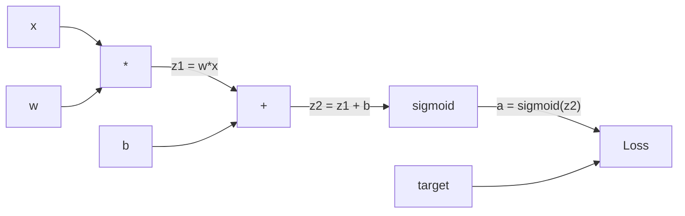
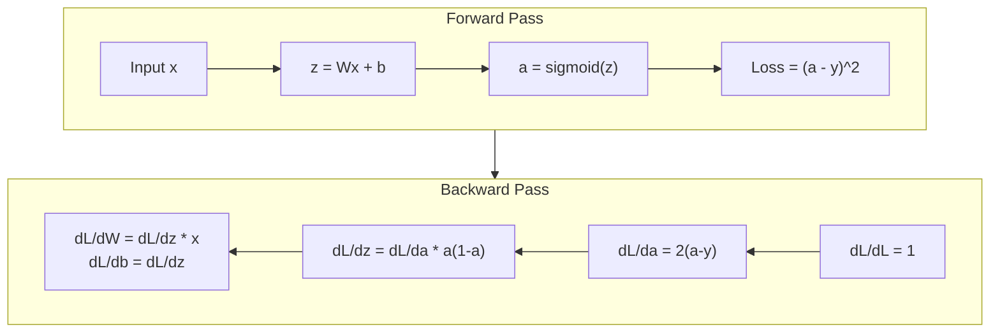
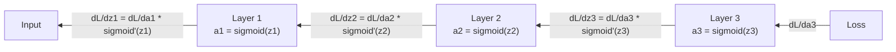

# 백프로퍼게이션 직접 구현하기

> 백프로퍼게이션은 학습을 가능하게 만드는 알고리즘입니다. 이것이 없으면 신경망은 값비싼 난수 생성기에 불과합니다.

**Type:** Build
**Languages:** Python
**Prerequisites:** Lesson 03.02 (다층 네트워크)
**Time:** ~120 minutes

## 학습 목표

- 계산 그래프를 만들고 위상 정렬로 그래디언트를 계산하는 Value 기반 autograd 엔진을 구현합니다
- 연쇄 법칙을 사용해 덧셈, 곱셈, sigmoid의 역방향 패스를 유도합니다
- 직접 만든 백프로퍼게이션 엔진만 사용해 XOR와 원 분류 문제에서 다층 네트워크를 훈련합니다
- 깊은 sigmoid 네트워크에서 그래디언트 소실 문제를 식별하고 그래디언트가 왜 지수적으로 작아지는지 설명합니다

## 문제

네트워크에 768개 입력과 3072개 출력을 가진 단일 은닉층이 있다고 합시다. 가중치는 2,359,296개입니다. 이 네트워크가 잘못 예측했습니다. 어떤 가중치가 오류를 만들었을까요? 각 가중치를 하나씩 시험하려면 230만 번의 순전파가 필요합니다. 백프로퍼게이션은 단 한 번의 역방향 패스로 230만 개 그래디언트를 모두 계산합니다. 이것은 단순한 최적화가 아닙니다. 훈련 가능한 것과 불가능한 것의 차이입니다.

순진한 접근은 이렇습니다. 가중치 하나를 잡고 아주 조금 움직인 뒤 순전파를 다시 실행하고 손실이 올라갔는지 내려갔는지 측정합니다. 그러면 그 가중치의 그래디언트를 얻습니다. 이제 네트워크의 모든 가중치에 대해 같은 일을 합니다. 여기에 수천 번의 훈련 스텝과 수백만 개 데이터 포인트를 곱해 보세요. 쓸 만한 것을 훈련하려면 지질학적 시간이 필요할 것입니다.

백프로퍼게이션은 이 문제를 해결합니다. 한 번의 순전파, 한 번의 역방향 패스, 그리고 모든 그래디언트 계산. 핵심은 미적분의 연쇄 법칙을 계산 그래프에 체계적으로 적용하는 것입니다. 이것이 딥러닝을 실용적으로 만든 알고리즘입니다. 이것이 없었다면 우리는 여전히 장난감 문제에 머물러 있었을 것입니다.

## 개념

### 네트워크에 적용한 연쇄 법칙

Phase 01, Lesson 05에서 연쇄 법칙을 봤습니다. 빠르게 되짚어 봅시다. y = f(g(x))라면 dy/dx = f'(g(x)) * g'(x)입니다. 사슬을 따라 미분값을 곱합니다.

신경망에서 "사슬"은 입력에서 손실까지 이어지는 연산의 순서입니다. 각 층은 가중치를 적용하고, 편향을 더하고, 활성화 함수를 통과시킵니다. 손실 함수는 최종 출력을 타깃과 비교합니다. 백프로퍼게이션은 이 사슬을 거꾸로 따라가며 각 연산이 오류에 얼마나 기여했는지 계산합니다.

### 계산 그래프

모든 순전파는 그래프를 만듭니다. 각 노드는 연산입니다(곱셈, 덧셈, sigmoid). 각 간선은 값을 앞으로 전달하고 그래디언트를 뒤로 전달합니다.



순전파에서는 값이 왼쪽에서 오른쪽으로 흐릅니다. x와 w가 z1 = w*x를 만듭니다. b를 더해 z2를 얻습니다. Sigmoid가 활성화값 a를 줍니다. 손실 함수를 사용해 a를 타깃 y와 비교합니다.

역방향 패스에서는 그래디언트가 오른쪽에서 왼쪽으로 흐릅니다. dL/da(활성화값이 바뀔 때 손실이 어떻게 변하는지)에서 시작합니다. 여기에 da/dz2(sigmoid 미분)를 곱합니다. 그러면 dL/dz2를 얻습니다. 이를 dL/db(z2 = z1 + b이므로 dL/dz2와 같음)와 dL/dz1로 나눕니다. 그다음 dL/dw = dL/dz1 * x, dL/dx = dL/dz1 * w입니다.

그래프의 모든 노드는 역방향 패스 동안 한 가지 일을 합니다. 위에서 들어온 그래디언트를 받아 자신의 로컬 미분값을 곱하고 아래로 전달합니다.

### 순전파와 역방향 패스



순전파는 z, a, 각 층의 입력 같은 모든 중간값을 저장합니다. 역방향 패스는 그래디언트를 계산하기 위해 이 저장된 값들이 필요합니다. 이것이 백프로퍼게이션의 핵심에 있는 메모리-계산 트레이드오프입니다. 메모리(활성화값 저장)를 써서 속도(수백만 번 대신 한 번의 패스)를 얻습니다.

### 네트워크를 통과하는 그래디언트 흐름

3층 네트워크에서는 그래디언트가 모든 층을 통해 사슬처럼 이어집니다.



각 층에서 그래디언트는 sigmoid 미분값과 곱해집니다. sigmoid 미분은 a * (1 - a)이고 최댓값은 0.25입니다(a = 0.5일 때). 3층 깊이에서는 그래디언트가 최대 0.25^3 = 0.0156만큼 곱해진 상태입니다. 10층 깊이에서는 0.25^10 = 0.000001입니다.

### 그래디언트 소실

이것이 그래디언트 소실 문제입니다. Sigmoid는 출력을 0과 1 사이로 눌러 넣습니다. 미분값은 항상 0.25보다 작습니다. sigmoid 층을 충분히 많이 쌓으면 그래디언트가 거의 사라집니다. 앞쪽 층은 거의 0에 가까운 그래디언트를 받기 때문에 거의 학습하지 못합니다.

```text
sigmoid(z):     Output range [0, 1]
sigmoid'(z):    Max value 0.25 (at z = 0)

After 5 layers:   gradient * 0.25^5 = 0.001x original
After 10 layers:  gradient * 0.25^10 = 0.000001x original
```

이것이 깊은 sigmoid 네트워크를 훈련하기가 거의 불가능한 이유입니다. 해결책인 ReLU와 그 변형들은 Lesson 04의 주제입니다. 지금은 백프로퍼게이션 자체는 완벽하게 동작한다는 점을 이해하세요. 문제는 백프로퍼게이션이 통과해야 하는 함수에 있습니다.

### 2층 네트워크의 그래디언트 유도

입력 x, sigmoid 은닉층, sigmoid 출력층, MSE 손실을 가진 네트워크의 구체적인 수식입니다.

순전파:
```text
z1 = W1 * x + b1
a1 = sigmoid(z1)
z2 = W2 * a1 + b2
a2 = sigmoid(z2)
L = (a2 - y)^2
```

역방향 패스(연쇄 법칙을 단계별로 적용):
```text
dL/da2 = 2(a2 - y)
da2/dz2 = a2 * (1 - a2)
dL/dz2 = dL/da2 * da2/dz2 = 2(a2 - y) * a2 * (1 - a2)

dL/dW2 = dL/dz2 * a1
dL/db2 = dL/dz2

dL/da1 = dL/dz2 * W2
da1/dz1 = a1 * (1 - a1)
dL/dz1 = dL/da1 * da1/dz1

dL/dW1 = dL/dz1 * x
dL/db1 = dL/dz1
```

모든 그래디언트는 손실에서 거슬러 올라가며 추적한 로컬 미분값들의 곱입니다. 백프로퍼게이션은 결국 이것이 전부입니다.

```figure
backprop-vanishing
```

## 직접 만들기

### Step 1: Value 노드

계산에 등장하는 모든 숫자는 Value가 됩니다. Value는 자신의 데이터, 그래디언트, 그리고 어떻게 생성되었는지를 저장합니다(그래야 뒤로 그래디언트를 계산하는 방법을 압니다).

```python
class Value:
    def __init__(self, data, children=(), op=''):
        self.data = data
        self.grad = 0.0
        self._backward = lambda: None
        self._children = set(children)
        self._op = op

    def __repr__(self):
        return f"Value(data={self.data:.4f}, grad={self.grad:.4f})"
```

아직 그래디언트는 없습니다(0.0). 아직 역방향 함수도 없습니다(no-op). `_children`은 어떤 Values가 이 값을 만들었는지 추적하므로 나중에 그래프를 위상 정렬할 수 있습니다.

### Step 2: 역방향 함수를 가진 연산

각 연산은 새 Value를 만들고 그래디언트가 그 연산을 통해 뒤로 어떻게 흐르는지 정의합니다.

```python
def __add__(self, other):
    other = other if isinstance(other, Value) else Value(other)
    out = Value(self.data + other.data, (self, other), '+')

    def _backward():
        self.grad += out.grad
        other.grad += out.grad

    out._backward = _backward
    return out

def __mul__(self, other):
    other = other if isinstance(other, Value) else Value(other)
    out = Value(self.data * other.data, (self, other), '*')

    def _backward():
        self.grad += other.data * out.grad
        other.grad += self.data * out.grad

    out._backward = _backward
    return out
```

덧셈에서는 d(a+b)/da = 1, d(a+b)/db = 1입니다. 따라서 두 입력 모두 출력의 그래디언트를 그대로 받습니다.

곱셈에서는 d(a*b)/da = b, d(a*b)/db = a입니다. 각 입력은 다른 입력의 값에 출력 그래디언트를 곱한 값을 받습니다.

`+=`가 중요합니다. 하나의 Value가 여러 연산에 사용될 수 있습니다. 그 그래디언트는 모든 경로에서 흘러온 그래디언트의 합입니다.

### Step 3: Sigmoid와 손실

```python
import math

def sigmoid(self):
    x = self.data
    x = max(-500, min(500, x))
    s = 1.0 / (1.0 + math.exp(-x))
    out = Value(s, (self,), 'sigmoid')

    def _backward():
        self.grad += (s * (1 - s)) * out.grad

    out._backward = _backward
    return out
```

Sigmoid 미분은 sigmoid(x) * (1 - sigmoid(x))입니다. 순전파 중 sigmoid(x) = s를 이미 계산했습니다. 그것을 재사용하면 됩니다. 추가 작업은 없습니다.

```python
def mse_loss(predicted, target):
    diff = predicted + Value(-target)
    return diff * diff
```

단일 출력의 MSE는 (predicted - target)^2입니다. 뺄셈은 음수 Value를 더하는 방식으로 표현합니다.

### Step 4: 역방향 패스

위상 정렬은 노드를 올바른 순서로 처리하게 해 줍니다. 어떤 노드를 통해 그래디언트를 전파하기 전에 그 노드의 그래디언트가 완전히 누적되어야 합니다.

```python
def backward(self):
    topo = []
    visited = set()

    def build_topo(v):
        if v not in visited:
            visited.add(v)
            for child in v._children:
                build_topo(child)
            topo.append(v)

    build_topo(self)
    self.grad = 1.0
    for v in reversed(topo):
        v._backward()
```

손실에서 시작합니다(gradient = 1.0, dL/dL = 1이기 때문). 정렬된 그래프를 거꾸로 걸어갑니다. 각 노드의 `_backward`가 그래디언트를 자식 노드로 밀어 넣습니다.

### Step 5: 층과 네트워크

```python
import random

class Neuron:
    def __init__(self, n_inputs):
        scale = (2.0 / n_inputs) ** 0.5
        self.weights = [Value(random.uniform(-scale, scale)) for _ in range(n_inputs)]
        self.bias = Value(0.0)

    def __call__(self, x):
        act = sum((wi * xi for wi, xi in zip(self.weights, x)), self.bias)
        return act.sigmoid()

    def parameters(self):
        return self.weights + [self.bias]


class Layer:
    def __init__(self, n_inputs, n_outputs):
        self.neurons = [Neuron(n_inputs) for _ in range(n_outputs)]

    def __call__(self, x):
        out = [n(x) for n in self.neurons]
        return out[0] if len(out) == 1 else out

    def parameters(self):
        params = []
        for n in self.neurons:
            params.extend(n.parameters())
        return params


class Network:
    def __init__(self, sizes):
        self.layers = []
        for i in range(len(sizes) - 1):
            self.layers.append(Layer(sizes[i], sizes[i + 1]))

    def __call__(self, x):
        for layer in self.layers:
            x = layer(x)
            if not isinstance(x, list):
                x = [x]
        return x[0] if len(x) == 1 else x

    def parameters(self):
        params = []
        for layer in self.layers:
            params.extend(layer.parameters())
        return params

    def zero_grad(self):
        for p in self.parameters():
            p.grad = 0.0
```

Neuron은 입력을 받아 가중합 + 편향을 계산하고 sigmoid를 적용합니다. 가중치 초기화는 더 깊은 네트워크에서 sigmoid 포화를 막기 위해 sqrt(2/n_inputs)로 스케일합니다. Layer는 Neuron의 리스트입니다. Network는 Layer의 리스트입니다. `parameters()` 메서드는 업데이트할 수 있도록 학습 가능한 모든 Values를 모읍니다.

### Step 6: XOR에서 훈련하기

```python
random.seed(42)
net = Network([2, 4, 1])

xor_data = [
    ([0.0, 0.0], 0.0),
    ([0.0, 1.0], 1.0),
    ([1.0, 0.0], 1.0),
    ([1.0, 1.0], 0.0),
]

learning_rate = 1.0

for epoch in range(1000):
    total_loss = Value(0.0)
    for inputs, target in xor_data:
        x = [Value(i) for i in inputs]
        pred = net(x)
        loss = mse_loss(pred, target)
        total_loss = total_loss + loss

    net.zero_grad()
    total_loss.backward()

    for p in net.parameters():
        p.data -= learning_rate * p.grad

    if epoch % 100 == 0:
        print(f"Epoch {epoch:4d} | Loss: {total_loss.data:.6f}")

print("\nXOR Results:")
for inputs, target in xor_data:
    x = [Value(i) for i in inputs]
    pred = net(x)
    print(f"  {inputs} -> {pred.data:.4f} (expected {target})")
```

손실이 줄어드는 것을 관찰하세요. 무작위 예측에서 올바른 XOR 출력으로 이동하는 과정은 전적으로 백프로퍼게이션이 그래디언트를 계산하고 가중치를 올바른 방향으로 조금씩 움직이기 때문에 일어납니다.

### Step 7: 원 분류

Lesson 02에서는 원 분류를 위해 가중치를 손으로 조정했습니다. 이제 네트워크가 그 가중치를 학습하게 해 봅시다.

```python
random.seed(7)

def generate_circle_data(n=100):
    data = []
    for _ in range(n):
        x1 = random.uniform(-1.5, 1.5)
        x2 = random.uniform(-1.5, 1.5)
        label = 1.0 if x1 * x1 + x2 * x2 < 1.0 else 0.0
        data.append(([x1, x2], label))
    return data

circle_data = generate_circle_data(80)

circle_net = Network([2, 8, 1])
learning_rate = 0.5

for epoch in range(2000):
    random.shuffle(circle_data)
    total_loss_val = 0.0
    for inputs, target in circle_data:
        x = [Value(i) for i in inputs]
        pred = circle_net(x)
        loss = mse_loss(pred, target)
        circle_net.zero_grad()
        loss.backward()
        for p in circle_net.parameters():
            p.data -= learning_rate * p.grad
        total_loss_val += loss.data

    if epoch % 200 == 0:
        correct = 0
        for inputs, target in circle_data:
            x = [Value(i) for i in inputs]
            pred = circle_net(x)
            predicted_class = 1.0 if pred.data > 0.5 else 0.0
            if predicted_class == target:
                correct += 1
        accuracy = correct / len(circle_data) * 100
        print(f"Epoch {epoch:4d} | Loss: {total_loss_val:.4f} | Accuracy: {accuracy:.1f}%")
```

여기서는 온라인 SGD를 사용합니다. 전체 배치를 누적하는 대신 각 샘플 뒤에 가중치를 업데이트합니다. 이렇게 하면 대칭이 더 빠르게 깨지고 전체 손실 지형에서 sigmoid가 포화되는 일을 피할 수 있습니다. 매 epoch마다 데이터를 섞으면 네트워크가 순서를 암기하지 못합니다.

손 조정은 없습니다. 네트워크가 스스로 원형 결정 경계를 발견합니다. 이것이 백프로퍼게이션의 힘입니다. 여러분은 아키텍처, 손실 함수, 데이터를 정의합니다. 알고리즘이 가중치를 찾아냅니다.

## 사용하기

PyTorch는 위의 모든 일을 몇 줄로 처리합니다. 핵심 아이디어는 동일합니다. autograd는 순전파 중 계산 그래프를 만들고, 그래디언트를 계산하기 위해 그것을 거꾸로 추적합니다.

```python
import torch
import torch.nn as nn

model = nn.Sequential(
    nn.Linear(2, 4),
    nn.Sigmoid(),
    nn.Linear(4, 1),
    nn.Sigmoid(),
)
optimizer = torch.optim.SGD(model.parameters(), lr=1.0)
criterion = nn.MSELoss()

X = torch.tensor([[0,0],[0,1],[1,0],[1,1]], dtype=torch.float32)
y = torch.tensor([[0],[1],[1],[0]], dtype=torch.float32)

for epoch in range(1000):
    pred = model(X)
    loss = criterion(pred, y)
    optimizer.zero_grad()
    loss.backward()
    optimizer.step()

print("PyTorch XOR Results:")
with torch.no_grad():
    for i in range(4):
        pred = model(X[i])
        print(f"  {X[i].tolist()} -> {pred.item():.4f} (expected {y[i].item()})")
```

`loss.backward()`는 여러분의 `total_loss.backward()`입니다. `optimizer.step()`은 손으로 쓴 `p.data -= lr * p.grad`입니다. `optimizer.zero_grad()`는 `net.zero_grad()`입니다. 같은 알고리즘이지만 산업용 수준의 구현입니다. PyTorch는 GPU 가속, 혼합 정밀도, 그래디언트 체크포인팅, 수백 가지 층 타입을 처리합니다. 하지만 역방향 패스는 같은 계산 그래프에 같은 연쇄 법칙을 적용하는 것입니다.

훈련은 순전파를 실행한 뒤 역방향 패스를 실행하고, 그다음 가중치를 업데이트합니다. 추론은 순전파만 실행합니다. 그래디언트도 없고 업데이트도 없습니다. 이 구분이 중요한 이유는 운영 환경에서 일어나는 일이 추론이기 때문입니다. Claude나 GPT 같은 API를 호출할 때 여러분은 추론을 실행하는 것입니다. 프롬프트가 네트워크를 앞으로 통과하고, 반대쪽 끝에서 토큰이 나옵니다. 어떤 가중치도 바뀌지 않습니다. 백프로퍼게이션을 이해하는 것이 중요한 이유는 그 네트워크의 모든 가중치를 만든 과정이 바로 이것이기 때문입니다.

## 결과물

이 레슨의 결과물:
- `outputs/prompt-gradient-debugger.md` -- 어떤 신경망에서든 그래디언트 문제(소실, 폭주, NaN)를 진단하기 위한 재사용 가능한 프롬프트

## 연습 문제

1. Value 클래스에 `__sub__` 메서드를 추가하세요(a - b = a + (-1 * b)). 그런 다음 `__neg__` 메서드를 구현하세요. (a - b)^2 같은 간단한 식에 대해 손계산과 비교해 그래디언트가 올바른지 검증하세요.

2. Value에 `relu` 메서드를 추가하세요(출력은 max(0, x), 미분값은 x > 0이면 1, 아니면 0). 은닉층의 sigmoid를 relu로 바꾸고 XOR에서 다시 훈련하세요. 수렴 속도를 비교하세요. 더 빠른 훈련을 보게 될 것입니다. 이는 Lesson 04의 예고편입니다.

3. 정수 거듭제곱을 위한 `__pow__` 메서드를 Value에 구현하세요. 이를 사용해 `mse_loss`를 올바른 `(predicted - target) ** 2` 식으로 바꾸세요. 그래디언트가 원래 구현과 일치하는지 검증하세요.

4. 훈련 루프에 그래디언트 클리핑을 추가하세요. `backward()`를 호출한 뒤 모든 그래디언트를 [-1, 1]로 클리핑합니다. 더 깊은 네트워크(sigmoid를 쓰는 4층 이상)를 훈련하고 클리핑 유무에 따른 손실 곡선을 비교하세요. 이것이 그래디언트 폭주에 대한 첫 번째 방어선입니다.

5. 시각화를 만들어 보세요. XOR 훈련 뒤 네트워크의 모든 파라미터 그래디언트를 출력합니다. 어느 층의 그래디언트가 가장 작은지 식별하세요. 이는 개념 섹션에서 읽은 그래디언트 소실 문제를 보여 줍니다.

## 핵심 용어

| 용어 | 사람들이 흔히 말하는 것 | 실제 의미 |
|------|----------------|----------------------|
| Backpropagation | "네트워크가 학습한다" | 계산 그래프를 거꾸로 따라 연쇄 법칙을 적용해 모든 가중치의 dL/dw를 계산하는 알고리즘 |
| Computational graph | "네트워크 구조" | 노드는 연산이고 간선은 값(순방향)과 그래디언트(역방향)를 전달하는 방향성 비순환 그래프 |
| Chain rule | "미분값을 곱한다" | y = f(g(x))라면 dy/dx = f'(g(x)) * g'(x)라는 규칙으로, 백프로퍼게이션의 수학적 기반 |
| Gradient | "가장 가파른 상승 방향" | 파라미터에 대한 손실의 편미분으로, 손실을 줄이려면 그 파라미터를 어떻게 바꿔야 하는지 알려 줌 |
| Vanishing gradient | "깊은 네트워크가 학습하지 않는다" | sigmoid 같은 포화 활성화를 가진 층을 통과하며 그래디언트가 지수적으로 작아지는 현상 |
| Forward pass | "네트워크 실행" | 각 층의 연산을 순서대로 적용해 입력에서 출력을 계산하고 중간값을 저장하는 과정 |
| Backward pass | "그래디언트 계산" | 계산 그래프를 역순으로 순회하며 연쇄 법칙으로 각 노드의 그래디언트를 누적하는 과정 |
| Learning rate | "얼마나 빨리 학습하는가" | 가중치를 업데이트할 때 스텝 크기를 제어하는 스칼라: w_new = w_old - lr * gradient |
| Topological sort | "올바른 순서" | 각 노드가 의존하는 모든 노드 뒤에 나타나도록 그래프 노드를 정렬한 순서로, 전파 전에 그래디언트가 완전히 누적되게 함 |
| Autograd | "자동 미분" | 순방향 계산 중 계산 그래프를 만들고 그래디언트를 자동으로 계산하는 시스템으로, PyTorch 엔진이 하는 일 |

## 더 읽을거리

- Rumelhart, Hinton & Williams, "Learning representations by back-propagating errors" (1986) -- 백프로퍼게이션을 주류로 만들고 다층 네트워크 훈련을 열어 준 논문
- 3Blue1Brown, "Neural Networks" series (https://www.youtube.com/playlist?list=PLZHQObOWTQDNU6R1_67000Dx_ZCJB-3pi) -- 백프로퍼게이션과 네트워크를 통과하는 그래디언트 흐름에 대한 최고의 시각적 설명
