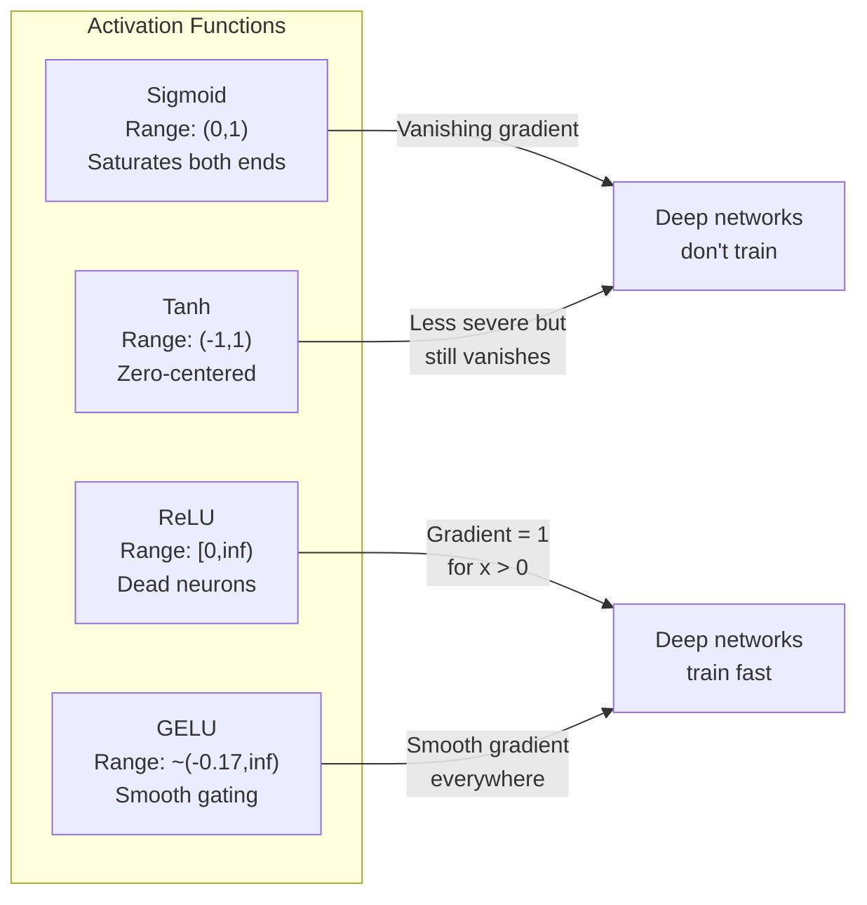
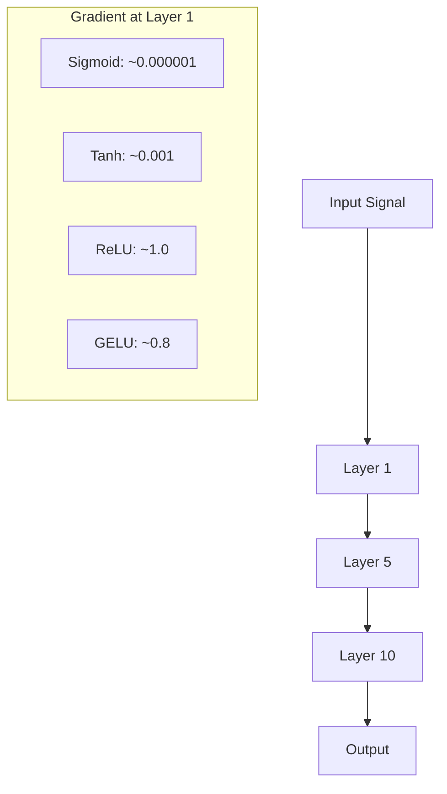
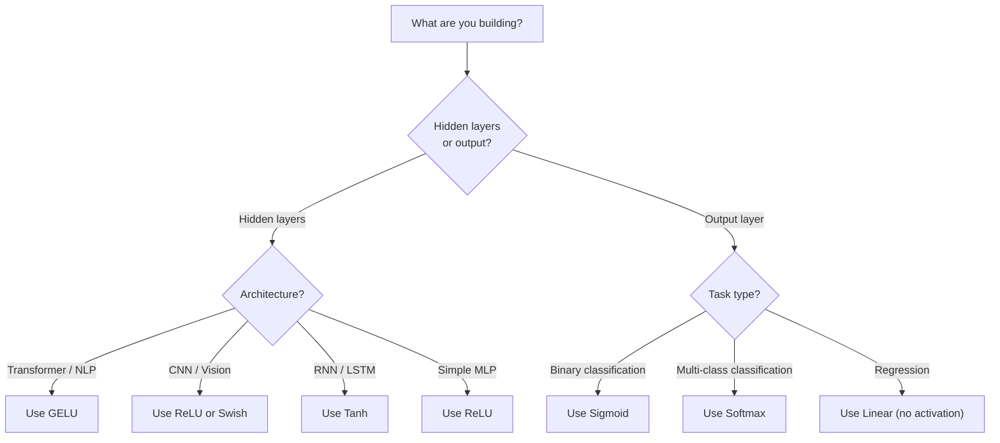

# 활성화 함수

> 비선형성이 없으면 100층 네트워크도 그럴듯한 행렬 곱셈에 불과합니다. 활성화 함수는 신경망이 곡선으로 생각하게 해 주는 문입니다.

**Type:** Build
**Languages:** Python
**Prerequisites:** Lesson 03.03 (백프로퍼게이션)
**Time:** ~75 minutes

## 학습 목표

- sigmoid, tanh, ReLU, Leaky ReLU, GELU, Swish, softmax와 그 미분을 직접 구현합니다
- 서로 다른 활성화 함수로 10개 이상의 층을 통과할 때 활성화값 크기를 측정해 그래디언트 소실 문제를 진단합니다
- ReLU 네트워크에서 죽은 뉴런을 감지하고 GELU가 왜 이 실패 모드를 피하는지 설명합니다
- 주어진 아키텍처(transformer, CNN, RNN, 출력층)에 맞는 활성화 함수를 선택합니다

## 문제

선형 변환 두 개를 쌓아 봅시다. y = W2(W1x + b1) + b2입니다. 전개하면 y = W2W1x + W2b1 + b2입니다. 이것은 결국 y = Ax + c, 즉 하나의 선형 변환입니다. 선형층을 아무리 많이 쌓아도 결과는 하나의 행렬 곱셈으로 접힙니다. 100층 네트워크가 단일 층과 같은 표현력을 갖게 됩니다.

이것은 이론적 호기심에 그치지 않습니다. 깊은 선형 네트워크는 문자 그대로 XOR를 학습할 수 없고, 나선형 데이터셋을 분류할 수 없고, 얼굴을 인식할 수 없다는 뜻입니다. 활성화 함수가 없으면 깊이는 착시입니다.

활성화 함수는 선형성을 깨뜨립니다. 각 층의 출력을 비선형 함수로 휘게 만들어 네트워크가 결정 경계를 굽히고, 임의의 함수를 근사하고, 실제로 학습할 수 있게 합니다. 하지만 잘못된 활성화 함수를 고르면 그래디언트가 0으로 사라지거나(깊은 네트워크의 sigmoid), 무한대로 폭주하거나(주의 깊은 초기화가 없는 비제한 활성화), 뉴런이 영구히 죽습니다(큰 음수 편향을 가진 ReLU). 활성화 함수 선택은 네트워크가 애초에 학습할 수 있는지를 직접 결정합니다.

## 개념

### 비선형성이 필요한 이유

행렬 곱셈은 합성 가능합니다. 벡터에 행렬 A를 곱한 뒤 행렬 B를 곱하는 것은 AB를 한 번 곱하는 것과 같습니다. 이는 선형층 열 개를 쌓는 것이 수학적으로 큰 행렬 하나를 가진 선형층 하나와 같다는 뜻입니다. 그 많은 파라미터와 깊이가 모두 낭비됩니다. 이 사슬을 끊을 무언가가 필요합니다. 활성화 함수가 바로 그 일을 합니다.

증명은 다음과 같습니다. 선형층은 f(x) = Wx + b를 계산합니다. 두 개를 쌓으면:

```text
Layer 1: h = W1 * x + b1
Layer 2: y = W2 * h + b2
```

대입하면:

```text
y = W2 * (W1 * x + b1) + b2
y = (W2 * W1) * x + (W2 * b1 + b2)
y = A * x + c
```

하나의 층입니다. 층 사이에 비선형 활성화 g()를 넣어 봅시다.

```text
h = g(W1 * x + b1)
y = W2 * h + b2
```

이제 대입이 깨집니다. W2 * g(W1 * x + b1) + b2는 하나의 선형 변환으로 줄일 수 없습니다. 네트워크가 비선형 함수를 표현할 수 있습니다. 활성화 함수가 있는 층을 하나 더할 때마다 표현 용량이 늘어납니다.

### Sigmoid

신경망의 원래 활성화 함수입니다.

```text
sigmoid(x) = 1 / (1 + e^(-x))
```

출력 범위는 (0, 1)입니다. 매끄럽고 미분 가능하며, 어떤 실수든 확률처럼 보이는 값으로 매핑합니다.

미분은 다음과 같습니다.

```text
sigmoid'(x) = sigmoid(x) * (1 - sigmoid(x))
```

이 미분의 최댓값은 x = 0에서 0.25입니다. 백프로퍼게이션에서는 그래디언트가 층을 통과하며 곱해집니다. sigmoid 10층은 그래디언트가 최대 0.25를 10번 곱한다는 뜻입니다.

```text
0.25^10 = 0.000000953674
```

원래 신호의 백만분의 일보다 작습니다. 이것이 그래디언트 소실 문제입니다. 앞쪽 층의 그래디언트가 너무 작아져 가중치가 거의 업데이트되지 않습니다. 네트워크가 학습하는 것처럼 보일 수는 있습니다. 뒤쪽 층에서는 손실이 줄어들기 때문입니다. 하지만 첫 층들은 얼어붙어 있습니다. 깊은 sigmoid 네트워크는 단순히 훈련되지 않습니다.

추가 문제도 있습니다. sigmoid 출력은 항상 양수(0부터 1까지)이므로 가중치에 대한 그래디언트가 항상 같은 부호를 갖습니다. 이는 그래디언트 하강 중 지그재그 움직임을 일으킵니다.

### Tanh

sigmoid의 중심화된 버전입니다.

```text
tanh(x) = (e^x - e^(-x)) / (e^x + e^(-x))
```

출력 범위는 (-1, 1)입니다. 0을 중심으로 하므로 지그재그 문제를 제거합니다.

미분은 다음과 같습니다.

```text
tanh'(x) = 1 - tanh(x)^2
```

최대 미분값은 x = 0에서 1.0입니다. sigmoid보다 네 배 낫습니다. 하지만 그래디언트 소실 문제는 여전히 존재합니다. 큰 양수나 음수 입력에서는 미분값이 0에 가까워집니다. 10층을 통과하면 그래디언트는 여전히 눌려 작아지며, 다만 그 정도가 덜할 뿐입니다.

### ReLU: 돌파구

Rectified Linear Unit입니다. 2010년에 Nair와 Hinton이 딥러닝에서 널리 알렸고(함수 자체는 Fukushima의 1969년 작업까지 거슬러 올라갑니다), 모든 것을 바꿨습니다.

```text
relu(x) = max(0, x)
```

출력 범위는 [0, infinity)입니다. 미분은 아주 단순합니다.

```text
relu'(x) = 1  if x > 0
            0  if x <= 0
```

양수 입력에서는 그래디언트가 소실되지 않습니다. 그래디언트가 정확히 1이고 그대로 통과합니다. 이것이 깊은 네트워크가 훈련 가능해진 이유입니다. ReLU는 층을 가로질러 그래디언트 크기를 보존합니다.

하지만 실패 모드가 있습니다. 죽은 뉴런 문제입니다. 어떤 뉴런의 가중 입력이 항상 음수라면(큰 음수 편향이나 좋지 않은 가중치 초기화 때문에), 출력은 항상 0이고 그래디언트도 항상 0이며 절대 업데이트되지 않습니다. 영구히 죽은 상태가 됩니다. 실제로 ReLU 네트워크의 뉴런 10-40%가 훈련 중 죽을 수 있습니다.

### Leaky ReLU

죽은 뉴런에 대한 가장 단순한 해결책입니다.

```text
leaky_relu(x) = x        if x > 0
                alpha * x if x <= 0
```

여기서 alpha는 보통 0.01인 작은 상수입니다. 음수 쪽이 0 대신 작은 기울기를 가지므로 죽은 뉴런도 그래디언트 신호를 받고 회복할 수 있습니다.

### GELU: 현대적 기본값

Gaussian Error Linear Unit입니다. 2016년에 Hendrycks와 Gimpel이 소개했습니다. BERT, GPT, 그리고 대부분의 현대 transformer에서 기본 활성화 함수입니다.

```text
gelu(x) = x * Phi(x)
```

여기서 Phi(x)는 표준 정규분포의 누적분포함수입니다. 실제로 쓰이는 근사는 다음과 같습니다.

```text
gelu(x) ~= 0.5 * x * (1 + tanh(sqrt(2/pi) * (x + 0.044715 * x^3)))
```

GELU는 모든 곳에서 매끄럽고, 0으로 딱 잘라내는 ReLU와 달리 작은 음수 값을 허용하며, 확률적 해석을 갖습니다. 가우시안 분포 아래에서 입력이 양수일 가능성에 따라 각 입력에 가중치를 줍니다. 이 매끄러운 게이팅은 transformer 아키텍처에서 ReLU보다 더 좋은 성능을 냅니다. 그래디언트 흐름이 더 좋고 죽은 뉴런 문제를 완전히 피하기 때문입니다.

### Swish / SiLU

Ramachandran 등이 2017년에 자동 탐색으로 발견한 자기 게이트 활성화 함수입니다.

```text
swish(x) = x * sigmoid(x)
```

Swish는 형식적으로 x * sigmoid(x)입니다. Google은 활성화 함수 공간을 자동 탐색해 이를 발견했습니다. 신경망이 신경망의 일부를 설계한 셈입니다.

GELU처럼 매끄럽고, 단조적이지 않으며, 작은 음수 값을 허용합니다. 차이는 미묘합니다. Swish는 게이팅에 sigmoid를 쓰고 GELU는 Gaussian CDF를 씁니다. 실제 성능은 거의 같습니다. Swish는 EfficientNet과 일부 비전 모델에서 쓰입니다. 언어 모델에서는 GELU가 지배적입니다.

### Softmax: 출력 활성화

은닉층에는 사용하지 않습니다. Softmax는 원시 점수(logits) 벡터를 확률분포로 변환합니다.

```text
softmax(x_i) = e^(x_i) / sum(e^(x_j) for all j)
```

모든 출력은 0과 1 사이입니다. 모든 출력의 합은 1입니다. 그래서 다중 클래스 분류의 표준 최종 활성화 함수가 됩니다. 가장 큰 logit이 가장 높은 확률을 얻지만, argmax와 달리 softmax는 미분 가능하고 상대적 확신도에 대한 정보를 보존합니다.

### 형태 비교



### 그래디언트 흐름 비교



### 언제 어떤 활성화 함수를 쓸까



```figure
softmax-temperature
```

## 직접 만들기

### Step 1: 모든 활성화 함수와 미분 구현하기

각 함수는 단일 float를 받아 float를 반환합니다. 각 미분 함수는 같은 입력을 받아 그래디언트를 반환합니다.

```python
import math

def sigmoid(x):
    x = max(-500, min(500, x))
    return 1.0 / (1.0 + math.exp(-x))

def sigmoid_derivative(x):
    s = sigmoid(x)
    return s * (1 - s)

def tanh_act(x):
    return math.tanh(x)

def tanh_derivative(x):
    t = math.tanh(x)
    return 1 - t * t

def relu(x):
    return max(0.0, x)

def relu_derivative(x):
    return 1.0 if x > 0 else 0.0

def leaky_relu(x, alpha=0.01):
    return x if x > 0 else alpha * x

def leaky_relu_derivative(x, alpha=0.01):
    return 1.0 if x > 0 else alpha

def gelu(x):
    return 0.5 * x * (1 + math.tanh(math.sqrt(2 / math.pi) * (x + 0.044715 * x ** 3)))

def gelu_derivative(x):
    phi = 0.5 * (1 + math.erf(x / math.sqrt(2)))
    pdf = math.exp(-0.5 * x * x) / math.sqrt(2 * math.pi)
    return phi + x * pdf

def swish(x):
    return x * sigmoid(x)

def swish_derivative(x):
    s = sigmoid(x)
    return s + x * s * (1 - s)

def softmax(xs):
    max_x = max(xs)
    exps = [math.exp(x - max_x) for x in xs]
    total = sum(exps)
    return [e / total for e in exps]
```

### Step 2: 그래디언트가 죽는 위치 시각화하기

-5부터 5까지 균등하게 떨어진 100개 지점에서 그래디언트를 계산합니다. 각 활성화 함수의 그래디언트가 거의 0인 위치를 보여 주는 텍스트 히스토그램을 출력합니다.

```python
def gradient_scan(name, derivative_fn, start=-5, end=5, n=100):
    step = (end - start) / n
    near_zero = 0
    healthy = 0
    for i in range(n):
        x = start + i * step
        g = derivative_fn(x)
        if abs(g) < 0.01:
            near_zero += 1
        else:
            healthy += 1
    pct_dead = near_zero / n * 100
    print(f"{name:15s}: {healthy:3d} healthy, {near_zero:3d} near-zero ({pct_dead:.0f}% dead zone)")

gradient_scan("Sigmoid", sigmoid_derivative)
gradient_scan("Tanh", tanh_derivative)
gradient_scan("ReLU", relu_derivative)
gradient_scan("Leaky ReLU", leaky_relu_derivative)
gradient_scan("GELU", gelu_derivative)
gradient_scan("Swish", swish_derivative)
```

### Step 3: 그래디언트 소실 실험

sigmoid와 ReLU를 사용해 신호를 N개 층으로 순전파시킵니다. 활성화값 크기가 어떻게 변하는지 측정합니다.

```python
import random

def vanishing_gradient_experiment(activation_fn, name, n_layers=10, n_inputs=5):
    random.seed(42)
    values = [random.gauss(0, 1) for _ in range(n_inputs)]

    print(f"\n{name} through {n_layers} layers:")
    for layer in range(n_layers):
        weights = [random.gauss(0, 1) for _ in range(n_inputs)]
        z = sum(w * v for w, v in zip(weights, values))
        activated = activation_fn(z)
        magnitude = abs(activated)
        bar = "#" * int(magnitude * 20)
        print(f"  Layer {layer+1:2d}: magnitude = {magnitude:.6f} {bar}")
        values = [activated] * n_inputs

vanishing_gradient_experiment(sigmoid, "Sigmoid")
vanishing_gradient_experiment(relu, "ReLU")
vanishing_gradient_experiment(gelu, "GELU")
```

### Step 4: 죽은 뉴런 감지기

ReLU 네트워크를 만들고 무작위 입력을 통과시킨 뒤, 한 번도 발화하지 않는 뉴런이 몇 개인지 셉니다.

```python
def dead_neuron_detector(n_inputs=5, hidden_size=20, n_samples=1000):
    random.seed(0)
    weights = [[random.gauss(0, 1) for _ in range(n_inputs)] for _ in range(hidden_size)]
    biases = [random.gauss(0, 1) for _ in range(hidden_size)]

    fire_counts = [0] * hidden_size

    for _ in range(n_samples):
        inputs = [random.gauss(0, 1) for _ in range(n_inputs)]
        for neuron_idx in range(hidden_size):
            z = sum(w * x for w, x in zip(weights[neuron_idx], inputs)) + biases[neuron_idx]
            if relu(z) > 0:
                fire_counts[neuron_idx] += 1

    dead = sum(1 for c in fire_counts if c == 0)
    rarely_fire = sum(1 for c in fire_counts if 0 < c < n_samples * 0.05)
    healthy = hidden_size - dead - rarely_fire

    print(f"\nDead Neuron Report ({hidden_size} neurons, {n_samples} samples):")
    print(f"  Dead (never fired):     {dead}")
    print(f"  Barely alive (<5%):     {rarely_fire}")
    print(f"  Healthy:                {healthy}")
    print(f"  Dead neuron rate:       {dead/hidden_size*100:.1f}%")

    for i, c in enumerate(fire_counts):
        status = "DEAD" if c == 0 else "WEAK" if c < n_samples * 0.05 else "OK"
        bar = "#" * (c * 40 // n_samples)
        print(f"  Neuron {i:2d}: {c:4d}/{n_samples} fires [{status:4s}] {bar}")

dead_neuron_detector()
```

### Step 5: 훈련 비교 -- Sigmoid vs ReLU vs GELU

같은 2층 네트워크를 원 데이터셋(원 안의 점 = class 1, 바깥 = class 0)에서 세 가지 다른 활성화 함수로 훈련합니다. 수렴 속도를 비교합니다.

```python
def make_circle_data(n=200, seed=42):
    random.seed(seed)
    data = []
    for _ in range(n):
        x = random.uniform(-2, 2)
        y = random.uniform(-2, 2)
        label = 1.0 if x * x + y * y < 1.5 else 0.0
        data.append(([x, y], label))
    return data


class ActivationNetwork:
    def __init__(self, activation_fn, activation_deriv, hidden_size=8, lr=0.1):
        random.seed(0)
        self.act = activation_fn
        self.act_d = activation_deriv
        self.lr = lr
        self.hidden_size = hidden_size

        self.w1 = [[random.gauss(0, 0.5) for _ in range(2)] for _ in range(hidden_size)]
        self.b1 = [0.0] * hidden_size
        self.w2 = [random.gauss(0, 0.5) for _ in range(hidden_size)]
        self.b2 = 0.0

    def forward(self, x):
        self.x = x
        self.z1 = []
        self.h = []
        for i in range(self.hidden_size):
            z = self.w1[i][0] * x[0] + self.w1[i][1] * x[1] + self.b1[i]
            self.z1.append(z)
            self.h.append(self.act(z))

        self.z2 = sum(self.w2[i] * self.h[i] for i in range(self.hidden_size)) + self.b2
        self.out = sigmoid(self.z2)
        return self.out

    def backward(self, target):
        error = self.out - target
        d_out = error * self.out * (1 - self.out)

        for i in range(self.hidden_size):
            d_h = d_out * self.w2[i] * self.act_d(self.z1[i])
            self.w2[i] -= self.lr * d_out * self.h[i]
            for j in range(2):
                self.w1[i][j] -= self.lr * d_h * self.x[j]
            self.b1[i] -= self.lr * d_h
        self.b2 -= self.lr * d_out

    def train(self, data, epochs=200):
        losses = []
        for epoch in range(epochs):
            total_loss = 0
            correct = 0
            for x, y in data:
                pred = self.forward(x)
                self.backward(y)
                total_loss += (pred - y) ** 2
                if (pred >= 0.5) == (y >= 0.5):
                    correct += 1
            avg_loss = total_loss / len(data)
            accuracy = correct / len(data) * 100
            losses.append(avg_loss)
            if epoch % 50 == 0 or epoch == epochs - 1:
                print(f"    Epoch {epoch:3d}: loss={avg_loss:.4f}, accuracy={accuracy:.1f}%")
        return losses


data = make_circle_data()

configs = [
    ("Sigmoid", sigmoid, sigmoid_derivative),
    ("ReLU", relu, relu_derivative),
    ("GELU", gelu, gelu_derivative),
]

results = {}
for name, act_fn, act_d_fn in configs:
    print(f"\n=== Training with {name} ===")
    net = ActivationNetwork(act_fn, act_d_fn, hidden_size=8, lr=0.1)
    losses = net.train(data, epochs=200)
    results[name] = losses

print("\n=== Final Loss Comparison ===")
for name, losses in results.items():
    print(f"  {name:10s}: start={losses[0]:.4f} -> end={losses[-1]:.4f} (improvement: {(1 - losses[-1]/losses[0])*100:.1f}%)")
```

## 사용하기

PyTorch는 이 모든 것을 함수형과 모듈 형태로 모두 제공합니다.

```python
import torch
import torch.nn as nn
import torch.nn.functional as F

x = torch.randn(4, 10)

relu_out = F.relu(x)
gelu_out = F.gelu(x)
sigmoid_out = torch.sigmoid(x)
swish_out = F.silu(x)

logits = torch.randn(4, 5)
probs = F.softmax(logits, dim=1)

model = nn.Sequential(
    nn.Linear(10, 64),
    nn.GELU(),
    nn.Linear(64, 32),
    nn.GELU(),
    nn.Linear(32, 5),
)
```

Transformer의 은닉층은 GELU입니다. CNN의 은닉층은 ReLU입니다. 분류의 출력층은 softmax입니다. 회귀의 출력층은 없음(linear)입니다. 확률을 내는 출력층은 sigmoid입니다. 기본값은 이 정도입니다. 증거가 있을 때만 바꾸세요.

RNN과 LSTM은 은닉 상태에 tanh를, 게이트에 sigmoid를 사용합니다. 하지만 오늘 처음부터 만든다면 아마 RNN을 쓰지는 않을 것입니다. ReLU 네트워크에서 뉴런이 죽고 있다면 GELU로 바꾸세요. 구체적인 이유가 없다면 Leaky ReLU부터 집어 들지 마세요. GELU는 죽은 뉴런 문제를 해결하고 더 나은 그래디언트 흐름을 제공합니다.

## 결과물

이 레슨의 결과물:
- `outputs/prompt-activation-selector.md` -- 어떤 아키텍처에서든 올바른 활성화 함수를 고르는 데 도움을 주는 재사용 가능한 프롬프트

## 연습 문제

1. 음수 기울기 alpha가 학습 가능한 파라미터인 Parametric ReLU(PReLU)를 구현하세요. 원 데이터셋에서 훈련하고 고정된 Leaky ReLU와 비교하세요.

2. 그래디언트 소실 실험을 10층 대신 50층으로 실행하세요. sigmoid, tanh, ReLU, GELU에 대해 각 층의 크기를 그리세요. 각 활성화 함수의 신호는 어느 층에서 사실상 0에 도달하나요?

3. ELU(Exponential Linear Unit)를 구현하세요. elu(x) = x if x > 0, alpha * (e^x - 1) if x <= 0입니다. 같은 네트워크에서 죽은 뉴런 비율을 ReLU와 비교하세요.

4. 훈련 중 실행되는 "gradient health monitor"를 만드세요. 각 epoch마다 각 층의 평균 그래디언트 크기를 계산합니다. 어떤 층의 그래디언트가 0.001 아래로 떨어지거나 100을 넘으면 경고를 출력하세요.

5. 훈련 비교를 수정해 원 대신 Lesson 01의 XOR 데이터셋을 사용하세요. XOR에서는 어떤 활성화 함수가 가장 빨리 수렴하나요? 왜 원 결과와 다를까요?

## 핵심 용어

| 용어 | 사람들이 흔히 말하는 것 | 실제 의미 |
|------|----------------|----------------------|
| Activation function | "비선형 부분" | 선형성을 깨뜨려 네트워크가 비선형 매핑을 학습하게 하는, 각 뉴런의 출력에 적용되는 함수 |
| Vanishing gradient | "깊은 네트워크에서 그래디언트가 사라진다" | 활성화 함수의 미분값이 1보다 작을 때 그래디언트가 층을 통과하며 지수적으로 작아져 앞쪽 층을 훈련 불가능하게 만드는 현상 |
| Exploding gradient | "그래디언트가 터진다" | 유효 배율이 1을 넘을 때 그래디언트가 층을 통과하며 지수적으로 커져 불안정한 훈련을 일으키는 현상 |
| Dead neuron | "학습을 멈춘 뉴런" | 입력이 영구히 음수여서 출력과 그래디언트가 0인 ReLU 뉴런 |
| Sigmoid | "값을 0-1로 눌러 넣는다" | 1/(1+e^-x)인 로지스틱 함수로, 역사적으로 중요하지만 깊은 네트워크에서 그래디언트 소실을 일으킴 |
| ReLU | "음수를 0으로 자른다" | max(0, x)로, 그래디언트 크기를 보존해 딥러닝을 실용적으로 만든 활성화 함수 |
| GELU | "transformer 활성화" | Gaussian Error Linear Unit으로, 입력이 양수일 확률에 따라 가중하는 매끄러운 활성화 함수 |
| Swish/SiLU | "자기 게이트 ReLU" | x * sigmoid(x)로, 자동 탐색을 통해 발견되었고 EfficientNet에서 사용됨 |
| Softmax | "점수를 확률로 바꾼다" | logits 벡터를 모든 값이 (0,1)에 있고 합이 1인 확률분포로 정규화함 |
| Leaky ReLU | "죽지 않는 ReLU" | alpha가 작은 값(0.01)일 때 max(alpha*x, x)로, 작은 음수 그래디언트를 허용해 죽은 뉴런을 방지함 |
| Saturation | "sigmoid의 평평한 부분" | 활성화 함수의 미분값이 0에 가까워져 그래디언트 흐름을 막는 영역 |
| Logit | "softmax 전의 원시 점수" | softmax나 sigmoid를 적용하기 전 최종 층의 정규화되지 않은 출력 |

## 더 읽을거리

- Nair & Hinton, "Rectified Linear Units Improve Restricted Boltzmann Machines" (2010) -- ReLU를 소개하고 깊은 네트워크 훈련을 가능하게 한 논문
- Hendrycks & Gimpel, "Gaussian Error Linear Units (GELUs)" (2016) -- transformer의 기본값이 된 활성화 함수를 소개한 논문
- Ramachandran et al., "Searching for Activation Functions" (2017) -- 자동 탐색으로 Swish를 발견해 활성화 설계도 자동화될 수 있음을 보인 논문
- Glorot & Bengio, "Understanding the difficulty of training deep feedforward neural networks" (2010) -- 그래디언트 소실/폭주를 진단하고 Xavier 초기화를 제안한 논문
- Goodfellow, Bengio, Courville, "Deep Learning" Chapter 6.3 (https://www.deeplearningbook.org/) -- 은닉 유닛과 활성화 함수에 대한 엄밀한 설명
