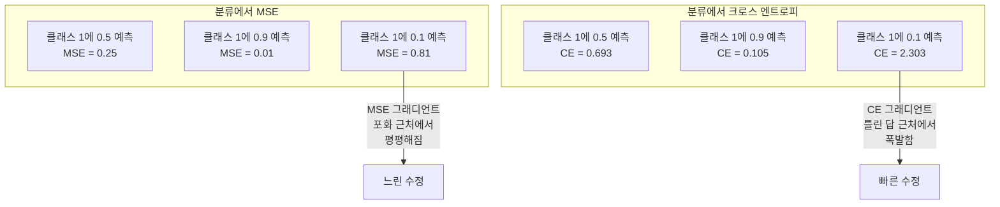
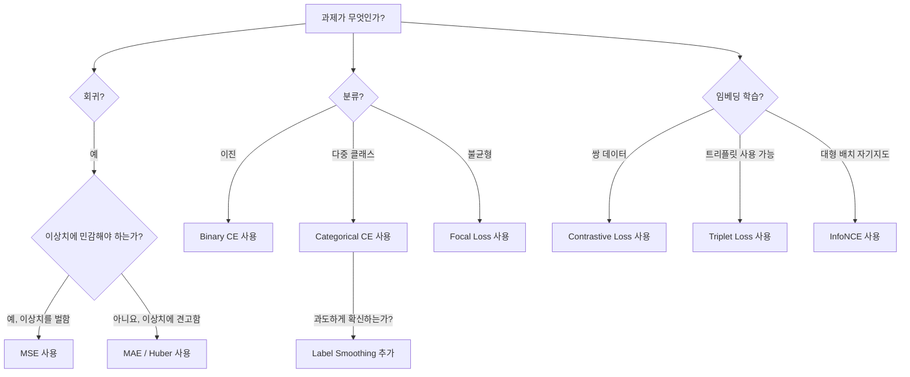
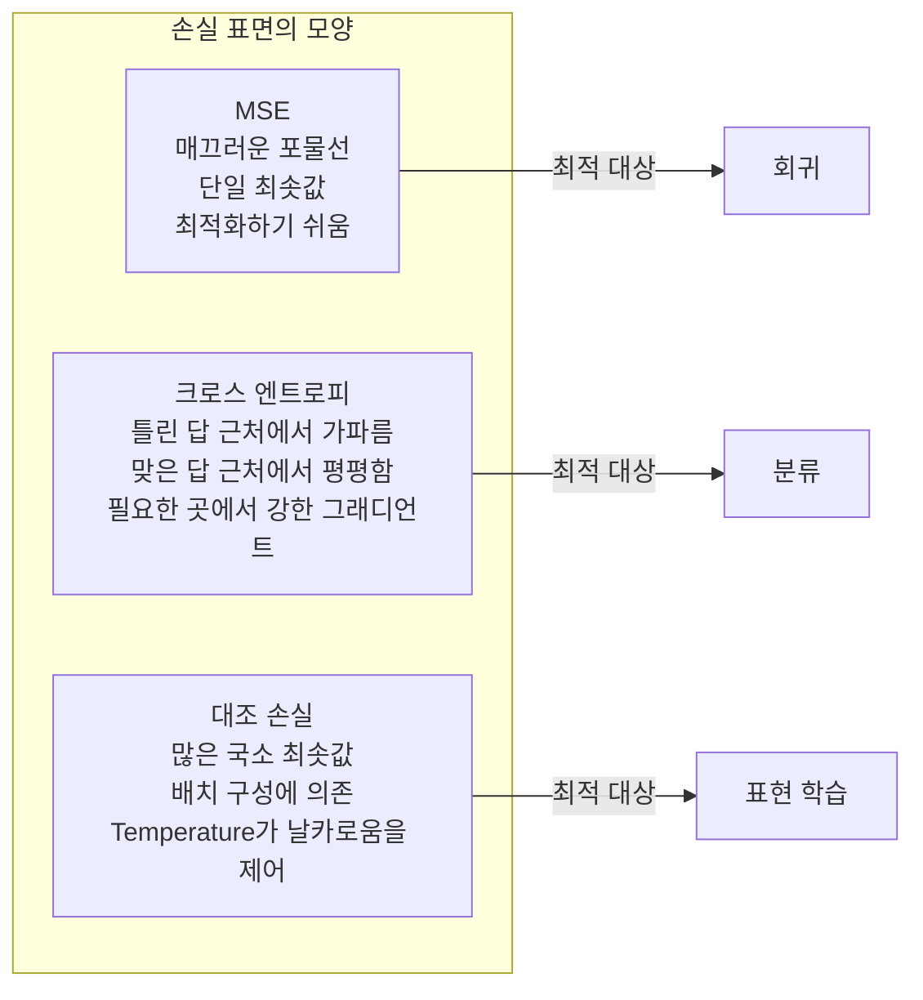

# 손실 함수

> 네트워크가 예측을 내놓습니다. 정답은 다르다고 말합니다. 얼마나 틀렸을까요? 그 숫자가 손실입니다. 손실 함수를 잘못 고르면 모델은 완전히 엉뚱한 목표를 최적화합니다.

**Type:** Build
**Languages:** Python
**Prerequisites:** Lesson 03.04 (Activation Functions)
**Time:** ~75 minutes

## 학습 목표

- MSE, 이진 크로스 엔트로피, 범주형 크로스 엔트로피, 대조 손실(InfoNCE)을 그래디언트와 함께 처음부터 구현한다
- "모든 것에 0.5를 예측하는" 실패 모드를 직접 보여 주며 MSE가 분류에서 실패하는 이유를 설명한다
- 크로스 엔트로피에 레이블 스무딩을 적용하고, 그것이 과도하게 확신하는 예측을 어떻게 막는지 설명한다
- 회귀, 이진 분류, 다중 클래스 분류, 임베딩 학습 과제에 맞는 올바른 손실 함수를 선택한다

## 문제

분류 문제에서 MSE를 최소화하는 모델은 모든 것에 0.5를 자신 있게 예측할 수 있습니다. 손실은 최소화하고 있습니다. 동시에 아무 쓸모도 없습니다.

손실 함수는 모델이 실제로 최적화하는 유일한 대상입니다. 정확도가 아닙니다. F1 점수도 아닙니다. 관리자에게 보고하는 어떤 지표도 아닙니다. 옵티마이저는 손실 함수의 그래디언트를 받아 그 숫자를 더 작게 만들도록 가중치를 조정합니다. 손실 함수가 당신이 신경 쓰는 것을 포착하지 못하면, 모델은 그것을 만족시키는 수학적으로 가장 저렴한 방법을 찾아냅니다. 그리고 그 방법은 거의 절대로 당신이 원하던 것이 아닙니다.

구체적인 예를 봅시다. 이진 분류 과제가 있습니다. 두 클래스가 있고, 비율은 50/50입니다. 손실로 MSE를 사용합니다. 모델은 모든 입력에 0.5를 예측합니다. 평균 MSE는 0.25이고, 실제로 아무것도 배우지 않고 도달할 수 있는 최솟값입니다. 모델은 구분 능력이 0이지만 기술적으로는 손실 함수를 최소화했습니다. 크로스 엔트로피로 바꾸면 같은 모델은 예측을 0 또는 1 쪽으로 밀어야 합니다. -log(0.5) = 0.693은 나쁜 손실이고, -log(0.99) = 0.01은 확신 있는 정답 예측에 보상을 주기 때문입니다. 손실 함수의 선택은 학습하는 모델과 지표를 악용하는 모델을 가르는 차이입니다.

더 나빠질 수도 있습니다. 자기지도 학습에는 레이블조차 없습니다. 대조 손실은 무엇이 비슷한지, 무엇이 다른지, 모델이 그것들을 얼마나 강하게 떼어 놓아야 하는지까지 학습 신호 전체를 정의합니다. 대조 손실을 잘못 만들면 임베딩이 한 점으로 붕괴합니다. 모든 입력이 같은 벡터로 매핑됩니다. 기술적으로는 손실이 0입니다. 완전히 가치가 없습니다.

## 개념

### 평균 제곱 오차(MSE)

회귀의 기본값입니다. 예측과 타깃의 차이를 제곱하고, 모든 샘플에 대해 평균을 냅니다.

```text
MSE = (1/n) * sum((y_pred - y_true)^2)
```

제곱이 중요한 이유는 큰 오차를 이차적으로 벌하기 때문입니다. 오차가 2이면 오차 1보다 비용이 4배 큽니다. 오차가 10이면 비용은 100배입니다. 그래서 MSE는 이상치에 민감합니다. 크게 틀린 예측 하나가 손실을 지배합니다.

실제 숫자로 보면, 모델이 주택 가격을 예측할 때 대부분의 집에서는 $10,000 정도 틀리지만 어떤 대저택 하나에서 $200,000 틀린다면, MSE는 그 대저택 하나를 고치려고 공격적으로 움직입니다. 그 과정에서 나머지 99채의 성능을 해칠 수 있습니다.

예측에 대한 MSE의 그래디언트는 다음과 같습니다.

```text
dMSE/dy_pred = (2/n) * (y_pred - y_true)
```

오차에 선형입니다. 더 큰 오차는 더 큰 그래디언트를 만듭니다. 회귀에서는 장점입니다. 큰 오차에는 큰 수정이 필요합니다. 분류에서는 단점입니다. 확신 있게 틀린 답은 선형이 아니라 지수적으로 벌하고 싶기 때문입니다.

### 크로스 엔트로피 손실

분류를 위한 손실 함수입니다. 정보 이론에 뿌리를 두고 있으며, 예측 확률 분포와 참 분포 사이의 차이를 측정합니다.

**이진 크로스 엔트로피(BCE):**

```text
BCE = -(y * log(p) + (1 - y) * log(1 - p))
```

여기서 y는 참 레이블(0 또는 1)이고 p는 예측 확률입니다.

-log(p)가 작동하는 이유는 이렇습니다. 참 레이블이 1이고 p = 0.99를 예측하면 손실은 -log(0.99) = 0.01입니다. p = 0.01을 예측하면 손실은 -log(0.01) = 4.6입니다. 이 460배 차이 때문에 크로스 엔트로피가 작동합니다. 확신 있게 틀린 예측은 가혹하게 벌하고, 확신 있게 맞힌 예측은 거의 벌하지 않습니다.

그래디언트도 같은 이야기를 합니다.

```text
dBCE/dp = -(y/p) + (1-y)/(1-p)
```

y = 1이고 p가 0에 가까우면 그래디언트는 -1/p이며 음의 무한대에 가까워집니다. 모델은 실수를 고치라는 거대한 신호를 받습니다. p가 1에 가까우면 그래디언트는 작습니다. 이미 맞았으니 고칠 것이 없습니다.

**범주형 크로스 엔트로피:**

원-핫 인코딩 타깃을 쓰는 다중 클래스 분류에 사용합니다.

```text
CCE = -sum(y_i * log(p_i))
```

참 클래스만 손실에 기여합니다. 다른 모든 y_i는 0이기 때문입니다. 클래스가 10개이고 정답 클래스 확률이 0.1이면(무작위 추측) 손실은 -log(0.1) = 2.3입니다. 정답 클래스 확률이 0.9이면 손실은 -log(0.9) = 0.105입니다. 모델은 올바른 답에 확률 질량을 집중하도록 학습합니다.

### MSE가 분류에서 실패하는 이유



예측이 0이나 1에 가까우면 MSE 그래디언트는 평평해집니다(시그모이드 포화 때문입니다). 크로스 엔트로피 그래디언트는 이를 보상합니다. -log가 시그모이드의 평평한 영역을 상쇄해서, 가장 필요한 곳에서 강한 그래디언트를 줍니다.

### 레이블 스무딩

표준 원-핫 레이블은 "이것은 100% 클래스 3이고 나머지는 0%"라고 말합니다. 아주 강한 주장입니다. 레이블 스무딩은 이를 부드럽게 만듭니다.

```text
smooth_label = (1 - alpha) * one_hot + alpha / num_classes
```

alpha = 0.1이고 클래스가 10개라면 [0, 0, 1, 0, ...] 대신 타깃이 [0.01, 0.01, 0.91, 0.01, ...]가 됩니다. 모델은 1.0이 아니라 0.91을 목표로 합니다.

이것이 작동하는 이유는, 소프트맥스를 통해 정확히 1.0을 출력하려는 모델은 로짓을 무한대로 밀어야 하기 때문입니다. 이는 과도한 확신을 만들고, 일반화를 해치며, 분포 변화에 취약한 모델을 만듭니다. 레이블 스무딩은 타깃을 0.9로 제한해서(alpha=0.1일 때) 로짓을 합리적인 범위에 유지합니다. GPT와 대부분의 현대 모델은 레이블 스무딩 또는 그에 해당하는 기법을 사용합니다.

### 대조 손실

레이블이 없습니다. 클래스도 없습니다. 입력 쌍과 하나의 질문만 있습니다. 이것들은 비슷한가, 다른가?

**SimCLR 스타일 대조 손실(NT-Xent / InfoNCE):**

이미지 하나를 가져옵니다. 그 이미지의 증강 뷰 두 개를 만듭니다(자르기, 회전, 색상 흔들기). 이것들이 "양성 쌍"입니다. 임베딩이 비슷해야 합니다. 배치 안의 다른 모든 이미지는 "음성 쌍"을 이룹니다. 임베딩이 달라야 합니다.

```text
L = -log(exp(sim(z_i, z_j) / tau) / sum(exp(sim(z_i, z_k) / tau)))
```

여기서 sim()은 코사인 유사도이고, z_i와 z_j는 양성 쌍이며, 합은 모든 음성 샘플에 대해 계산합니다. tau(temperature)는 분포가 얼마나 날카로운지 제어합니다. 낮은 temperature = 더 어려운 음성 샘플 = 더 공격적인 분리입니다.

실제 숫자로 보면, 배치 크기 256은 양성 쌍 하나마다 255개의 음성 샘플이 있다는 뜻입니다. Temperature tau = 0.07(SimCLR 기본값)입니다. 손실은 유사도에 대한 소프트맥스처럼 보입니다. 모든 256개 선택지 중 양성 쌍의 유사도가 가장 높아지기를 원합니다.

**트리플릿 손실:**

세 입력을 받습니다. 앵커, 양성(같은 클래스), 음성(다른 클래스)입니다.

```text
L = max(0, d(anchor, positive) - d(anchor, negative) + margin)
```

마진(보통 0.2-1.0)은 양성 거리와 음성 거리 사이에 최소 간격을 강제합니다. 음성이 이미 충분히 멀리 있으면 손실은 0입니다. 그래디언트도 없고 업데이트도 없습니다. 그래서 학습은 효율적이지만, 신중한 트리플릿 마이닝(앵커에 가까운 어려운 음성 선택)이 필요합니다.

### 포컬 손실

불균형 데이터셋을 위한 손실입니다. 표준 크로스 엔트로피는 올바르게 분류된 모든 예제를 똑같이 취급합니다. 포컬 손실은 쉬운 예제의 가중치를 낮춥니다.

```text
FL = -alpha * (1 - p_t)^gamma * log(p_t)
```

여기서 p_t는 참 클래스의 예측 확률이고 gamma는 집중 정도를 제어합니다. gamma = 0이면 표준 크로스 엔트로피입니다. gamma = 2(기본값)이면 다음과 같습니다.

- 쉬운 예제(p_t = 0.9): weight = (0.1)^2 = 0.01. 사실상 무시됩니다.
- 어려운 예제(p_t = 0.1): weight = (0.9)^2 = 0.81. 온전한 그래디언트 신호를 받습니다.

포컬 손실은 Lin et al.이 객체 탐지를 위해 도입했습니다. 후보 영역의 99%가 배경(쉬운 음성)이기 때문입니다. 포컬 손실이 없으면 모델은 쉬운 배경 예제에 파묻혀 객체를 탐지하는 법을 배우지 못합니다. 포컬 손실을 쓰면 모델은 중요한 어렵고 모호한 사례에 용량을 집중합니다.

### 손실 함수 결정 트리



### 손실 지형



```figure
cross-entropy-loss
```

## 직접 만들기

### 1단계: MSE와 그래디언트

```python
def mse(predictions, targets):
    n = len(predictions)
    total = 0.0
    for p, t in zip(predictions, targets):
        total += (p - t) ** 2
    return total / n

def mse_gradient(predictions, targets):
    n = len(predictions)
    grads = []
    for p, t in zip(predictions, targets):
        grads.append(2.0 * (p - t) / n)
    return grads
```

### 2단계: 이진 크로스 엔트로피

log(0) 문제는 실제로 발생합니다. 모델이 양성 예제에 정확히 0을 예측하면 log(0) = 음의 무한대입니다. 클리핑은 이를 막습니다.

```python
import math

def binary_cross_entropy(predictions, targets, eps=1e-15):
    n = len(predictions)
    total = 0.0
    for p, t in zip(predictions, targets):
        p_clipped = max(eps, min(1 - eps, p))
        total += -(t * math.log(p_clipped) + (1 - t) * math.log(1 - p_clipped))
    return total / n

def bce_gradient(predictions, targets, eps=1e-15):
    grads = []
    for p, t in zip(predictions, targets):
        p_clipped = max(eps, min(1 - eps, p))
        grads.append(-(t / p_clipped) + (1 - t) / (1 - p_clipped))
    return grads
```

### 3단계: 소프트맥스를 포함한 범주형 크로스 엔트로피

소프트맥스는 원시 로짓을 확률로 바꿉니다. 그런 다음 원-핫 타깃에 대해 크로스 엔트로피를 계산합니다.

```python
def softmax(logits):
    max_val = max(logits)
    exps = [math.exp(x - max_val) for x in logits]
    total = sum(exps)
    return [e / total for e in exps]

def categorical_cross_entropy(logits, target_index, eps=1e-15):
    probs = softmax(logits)
    p = max(eps, probs[target_index])
    return -math.log(p)

def cce_gradient(logits, target_index):
    probs = softmax(logits)
    grads = list(probs)
    grads[target_index] -= 1.0
    return grads
```

소프트맥스 + 크로스 엔트로피의 그래디언트는 아름답게 단순해집니다. 참 클래스에는 (예측 확률 - 1)이고, 다른 모든 클래스에는 (예측 확률)입니다. 이 우아한 단순화는 우연이 아닙니다. 그래서 소프트맥스와 크로스 엔트로피가 짝을 이룹니다.

### 4단계: 레이블 스무딩

```python
def label_smoothed_cce(logits, target_index, num_classes, alpha=0.1, eps=1e-15):
    probs = softmax(logits)
    loss = 0.0
    for i in range(num_classes):
        if i == target_index:
            smooth_target = 1.0 - alpha + alpha / num_classes
        else:
            smooth_target = alpha / num_classes
        p = max(eps, probs[i])
        loss += -smooth_target * math.log(p)
    return loss
```

### 5단계: 대조 손실(단순화한 InfoNCE)

```python
def cosine_similarity(a, b):
    dot = sum(x * y for x, y in zip(a, b))
    norm_a = math.sqrt(sum(x * x for x in a))
    norm_b = math.sqrt(sum(x * x for x in b))
    if norm_a < 1e-10 or norm_b < 1e-10:
        return 0.0
    return dot / (norm_a * norm_b)

def contrastive_loss(anchor, positive, negatives, temperature=0.07):
    sim_pos = cosine_similarity(anchor, positive) / temperature
    sim_negs = [cosine_similarity(anchor, neg) / temperature for neg in negatives]

    max_sim = max(sim_pos, max(sim_negs)) if sim_negs else sim_pos
    exp_pos = math.exp(sim_pos - max_sim)
    exp_negs = [math.exp(s - max_sim) for s in sim_negs]
    total_exp = exp_pos + sum(exp_negs)

    return -math.log(max(1e-15, exp_pos / total_exp))
```

### 6단계: 분류에서 MSE와 크로스 엔트로피 비교

lesson 04의 같은 네트워크(circle dataset)를 두 손실 함수로 학습합니다. 크로스 엔트로피가 더 빠르게 수렴하는 모습을 확인하세요.

```python
import random

def sigmoid(x):
    x = max(-500, min(500, x))
    return 1.0 / (1.0 + math.exp(-x))

def make_circle_data(n=200, seed=42):
    random.seed(seed)
    data = []
    for _ in range(n):
        x = random.uniform(-2, 2)
        y = random.uniform(-2, 2)
        label = 1.0 if x * x + y * y < 1.5 else 0.0
        data.append(([x, y], label))
    return data


class LossComparisonNetwork:
    def __init__(self, loss_type="bce", hidden_size=8, lr=0.1):
        random.seed(0)
        self.loss_type = loss_type
        self.lr = lr
        self.hidden_size = hidden_size

        self.w1 = [[random.gauss(0, 0.5) for _ in range(2)] for _ in range(hidden_size)]
        self.b1 = [0.0] * hidden_size
        self.w2 = [random.gauss(0, 0.5) for _ in range(hidden_size)]
        self.b2 = 0.0

    def forward(self, x):
        self.x = x
        self.z1 = []
        self.h = []
        for i in range(self.hidden_size):
            z = self.w1[i][0] * x[0] + self.w1[i][1] * x[1] + self.b1[i]
            self.z1.append(z)
            self.h.append(max(0.0, z))

        self.z2 = sum(self.w2[i] * self.h[i] for i in range(self.hidden_size)) + self.b2
        self.out = sigmoid(self.z2)
        return self.out

    def backward(self, target):
        if self.loss_type == "mse":
            d_loss = 2.0 * (self.out - target)
        else:
            eps = 1e-15
            p = max(eps, min(1 - eps, self.out))
            d_loss = -(target / p) + (1 - target) / (1 - p)

        d_sigmoid = self.out * (1 - self.out)
        d_out = d_loss * d_sigmoid

        for i in range(self.hidden_size):
            d_relu = 1.0 if self.z1[i] > 0 else 0.0
            d_h = d_out * self.w2[i] * d_relu
            self.w2[i] -= self.lr * d_out * self.h[i]
            for j in range(2):
                self.w1[i][j] -= self.lr * d_h * self.x[j]
            self.b1[i] -= self.lr * d_h
        self.b2 -= self.lr * d_out

    def compute_loss(self, pred, target):
        if self.loss_type == "mse":
            return (pred - target) ** 2
        else:
            eps = 1e-15
            p = max(eps, min(1 - eps, pred))
            return -(target * math.log(p) + (1 - target) * math.log(1 - p))

    def train(self, data, epochs=200):
        losses = []
        for epoch in range(epochs):
            total_loss = 0.0
            correct = 0
            for x, y in data:
                pred = self.forward(x)
                self.backward(y)
                total_loss += self.compute_loss(pred, y)
                if (pred >= 0.5) == (y >= 0.5):
                    correct += 1
            avg_loss = total_loss / len(data)
            accuracy = correct / len(data) * 100
            losses.append((avg_loss, accuracy))
            if epoch % 50 == 0 or epoch == epochs - 1:
                print(f"    Epoch {epoch:3d}: loss={avg_loss:.4f}, accuracy={accuracy:.1f}%")
        return losses
```

## 사용하기

PyTorch는 수치 안정성이 내장된 모든 표준 손실 함수를 제공합니다.

```python
import torch
import torch.nn as nn
import torch.nn.functional as F

predictions = torch.tensor([0.9, 0.1, 0.7], requires_grad=True)
targets = torch.tensor([1.0, 0.0, 1.0])

mse_loss = F.mse_loss(predictions, targets)
bce_loss = F.binary_cross_entropy(predictions, targets)

logits = torch.randn(4, 10)
labels = torch.tensor([3, 7, 1, 9])
ce_loss = F.cross_entropy(logits, labels)
ce_smooth = F.cross_entropy(logits, labels, label_smoothing=0.1)
```

`F.cross_entropy`를 사용하세요(`F.nll_loss`에 수동 softmax를 더하는 방식이 아닙니다). 이것은 log-softmax와 negative log-likelihood를 수치적으로 안정적인 하나의 연산으로 결합합니다. softmax를 따로 적용한 뒤 log를 취하면 안정성이 떨어집니다. 큰 지수값을 뺄 때 정밀도를 잃기 때문입니다.

대조 학습에서는 대부분의 팀이 직접 구현하거나 `lightly`, `pytorch-metric-learning` 같은 라이브러리를 사용합니다. 핵심 루프는 항상 같습니다. 쌍별 유사도를 계산하고, 양성과 음성에 대한 소프트맥스를 만들고, 역전파합니다.

## 결과물

이 lesson은 다음을 만듭니다.
- `outputs/prompt-loss-function-selector.md` -- 올바른 손실 함수를 고르기 위한 재사용 가능한 프롬프트
- `outputs/prompt-loss-debugger.md` -- 손실 곡선이 이상해 보일 때 쓰는 진단 프롬프트

## 연습 문제

1. Huber loss(smooth L1 loss)를 구현하세요. 작은 오차에는 MSE이고 큰 오차에는 MAE입니다. 학습 타깃의 5%에 무작위 노이즈(이상치)를 추가했을 때, y = sin(x)를 예측하는 회귀 네트워크를 MSE와 Huber로 각각 학습하세요. 최종 테스트 오차를 비교하세요.

2. 이진 분류 학습 루프에 focal loss를 추가하세요. 불균형 데이터셋(90% class 0, 10% class 1)을 만드세요. 200 epochs 후 소수 클래스 recall에서 표준 BCE와 focal loss(gamma=2)를 비교하세요.

3. semi-hard negative mining을 포함한 triplet loss를 구현하세요. 5개 클래스에 대한 2D 임베딩 데이터를 생성하세요. 각 앵커에 대해 양성보다 멀지만 가장 어려운 음성(semi-hard)을 찾으세요. 무작위 triplet 선택과 수렴을 비교하세요.

4. MSE와 크로스 엔트로피 비교를 실행하되, 학습 중 각 층의 그래디언트 크기를 추적하세요. epoch별 평균 그래디언트 노름을 그리세요. 모델이 가장 불확실한 초기 epoch에서 크로스 엔트로피가 더 큰 그래디언트를 만든다는 것을 확인하세요.

5. KL divergence loss를 구현하고, 참 분포가 원-핫일 때 KL(true || predicted)을 최소화하면 크로스 엔트로피와 같은 그래디언트를 얻는지 확인하세요. 그런 다음 "참" 분포가 teacher model의 softmax 출력에서 오는 soft targets(knowledge distillation 같은 경우)를 시도하세요.

## 핵심 용어

| 용어 | 사람들이 하는 말 | 실제 의미 |
|------|----------------|----------------------|
| Loss function | "모델이 얼마나 틀렸는가" | 예측과 타깃을 옵티마이저가 최소화하는 스칼라로 매핑하는 미분 가능한 함수 |
| MSE | "평균 제곱 오차" | 예측과 타깃 차이의 제곱 평균이며, 큰 오차를 이차적으로 벌한다 |
| Cross-entropy | "분류 손실" | -log(p)를 사용해 예측 확률 분포와 참 분포 사이의 차이를 측정한다 |
| Binary cross-entropy | "BCE" | 두 클래스용 크로스 엔트로피: -(y*log(p) + (1-y)*log(1-p)) |
| Label smoothing | "타깃을 부드럽게 만들기" | 과도한 확신을 막고 일반화를 개선하기 위해 딱딱한 0/1 타깃을 부드러운 값(예: 0.1/0.9)으로 바꾼다 |
| Contrastive loss | "가까이 당기고 멀리 밀기" | 비슷한 쌍은 가깝게, 다른 쌍은 임베딩 공간에서 멀게 만들어 표현을 학습하는 손실 |
| InfoNCE | "CLIP/SimCLR 손실" | 유사도 점수에 대한 정규화된 temperature-scaled 크로스 엔트로피이며, 대조 학습을 분류로 취급한다 |
| Focal loss | "불균형 데이터 해결책" | (1-p_t)^gamma로 가중한 크로스 엔트로피로 쉬운 예제의 가중치를 낮추고 어려운 예제에 집중한다 |
| Triplet loss | "앵커-양성-음성" | 앵커가 음성보다 양성에 적어도 margin만큼 더 가깝도록 밀어 준다 |
| Temperature | "날카로움 조절 노브" | 로짓/유사도를 나누는 스칼라로 결과 분포의 뾰족함을 제어한다. 낮을수록 더 날카롭다 |

## 더 읽을거리

- Lin et al., "Focal Loss for Dense Object Detection" (2017) -- 객체 탐지(RetinaNet)의 극단적인 클래스 불균형을 다루기 위해 focal loss를 도입한 논문
- Chen et al., "A Simple Framework for Contrastive Learning of Visual Representations" (SimCLR, 2020) -- NT-Xent loss를 포함한 현대적인 대조 학습 파이프라인을 정의한 논문
- Szegedy et al., "Rethinking the Inception Architecture" (2016) -- 지금은 대부분의 대형 모델에서 표준이 된 정규화 기법으로 label smoothing을 도입한 논문
- Hinton et al., "Distilling the Knowledge in a Neural Network" (2015) -- soft targets와 KL divergence를 사용하는 knowledge distillation으로, 모델 압축의 기초가 된 논문
