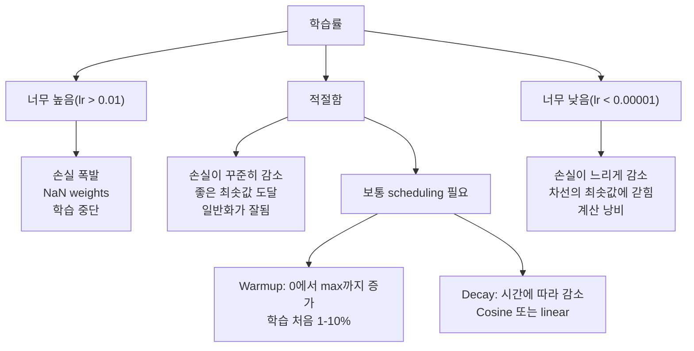
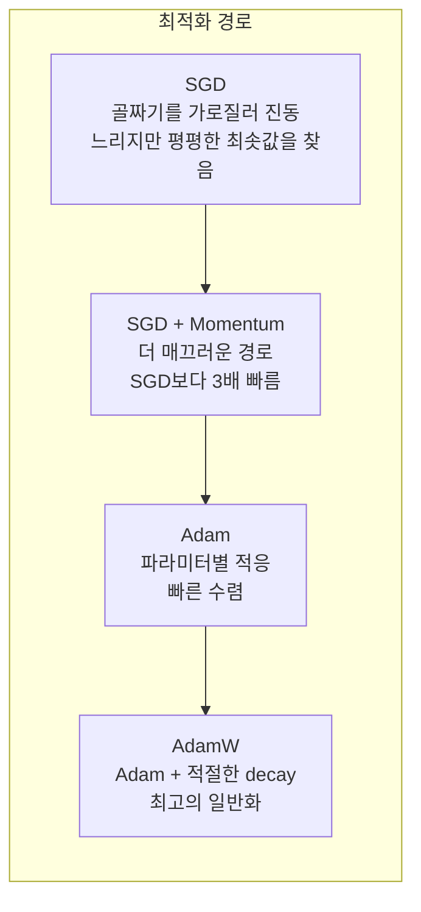
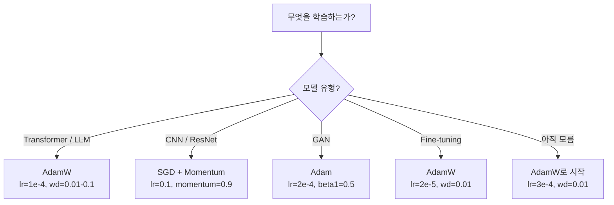

# 옵티마이저

> 그래디언트 하강은 어느 방향으로 움직일지 알려 줍니다. 얼마나 멀리, 얼마나 빠르게 움직일지는 말해 주지 않습니다. SGD는 나침반입니다. Adam은 교통 정보를 가진 GPS입니다.

**Type:** Build
**Languages:** Python
**Prerequisites:** Lesson 03.05 (Loss Functions)
**Time:** ~75 minutes

## 학습 목표

- SGD, momentum을 포함한 SGD, Adam, AdamW 옵티마이저를 Python으로 처음부터 구현한다
- Adam의 bias correction이 학습 초기 step에서 0으로 초기화된 moment 추정치를 어떻게 보정하는지 설명한다
- 같은 과제에서 AdamW가 L2 regularization을 포함한 Adam보다 더 나은 일반화를 만드는 이유를 보여 준다
- transformer, CNN, GAN, fine-tuning에 맞는 옵티마이저와 기본 하이퍼파라미터를 선택한다

## 문제

그래디언트를 계산했습니다. 손실을 줄이려면 weight #4,721을 0.003 줄여야 한다는 것도 압니다. 하지만 0.003은 어떤 단위일까요? 무엇으로 스케일해야 할까요? 그리고 step 1에서와 step 1,000에서 같은 크기로 움직여야 할까요?

기본 그래디언트 하강은 모든 step에서 모든 파라미터에 같은 학습률을 적용합니다. w = w - lr * gradient입니다. 이것은 실제 신경망 학습을 고통스럽게 만드는 세 가지 문제를 만듭니다.

첫째, 진동입니다. 손실 지형은 매끄러운 그릇 모양인 경우가 드뭅니다. 길고 좁은 골짜기에 더 가깝습니다. 그래디언트는 골짜기를 따라가는 방향(완만한 방향)이 아니라 골짜기를 가로지르는 방향(가파른 방향)을 가리킵니다. 그래디언트 하강은 좁은 축을 왔다 갔다 튀면서, 유용한 방향으로는 아주 조금씩만 전진합니다. 이런 현상을 본 적이 있을 것입니다. 손실이 빠르게 떨어진 뒤 정체됩니다. 모델이 수렴해서가 아니라 진동하고 있기 때문입니다.

둘째, 모든 파라미터에 하나의 학습률을 쓰는 것은 틀렸습니다. 어떤 가중치는 큰 업데이트가 필요합니다(초기 underfitting 단계에 있습니다). 다른 가중치는 아주 작은 업데이트가 필요합니다(최적값 근처에 있습니다). 전자에 맞는 학습률은 후자를 망가뜨리고, 후자에 맞는 학습률은 전자를 움직이지 못하게 합니다.

셋째, saddle point입니다. 고차원 손실 지형에는 그래디언트가 거의 0인 넓고 평평한 영역이 많습니다. 기본 SGD는 그래디언트 속도로 그 영역을 기어갑니다. 사실상 0의 속도입니다. 모델이 막힌 것처럼 보입니다. 실제로는 막힌 것이 아닙니다. 반대편에 유용한 하강 방향이 있는 평평한 영역에 있을 뿐입니다. 하지만 SGD에는 밀고 지나갈 메커니즘이 없습니다.

Adam은 세 문제를 모두 해결합니다. 각 파라미터마다 두 개의 이동 평균을 유지합니다. 평균 그래디언트(momentum, 진동 처리)와 제곱 그래디언트의 평균(adaptive rate, 서로 다른 스케일 처리)입니다. 처음 몇 step을 위한 bias correction과 결합하면, 기본 하이퍼파라미터만으로 문제의 80%에서 작동하는 단일 옵티마이저가 됩니다. 이 lesson에서는 이를 처음부터 만들어 나머지 20%에서 언제, 왜 실패하는지 정확히 이해합니다.

## 개념

### 확률적 그래디언트 하강(SGD)

가장 단순한 옵티마이저입니다. 미니배치에서 그래디언트를 계산하고 반대 방향으로 한 step 이동합니다.

```text
w = w - lr * gradient
```

"확률적"이라는 말은 전체 데이터셋이 아니라 무작위 부분집합(미니배치)을 사용해 그래디언트를 추정한다는 뜻입니다. 이 노이즈는 실제로 유용합니다. 날카로운 국소 최솟값에서 빠져나오는 데 도움이 됩니다. 하지만 노이즈는 진동도 일으킵니다.

학습률은 유일한 조절 노브입니다. 너무 높으면 손실이 발산합니다. 너무 낮으면 학습이 끝없이 오래 걸립니다. 최적값은 아키텍처, 데이터, 배치 크기, 현재 학습 단계에 따라 달라집니다. 현대 네트워크에서 기본 SGD의 일반적인 값은 0.01에서 0.1 사이입니다. 하지만 단일 학습 실행 안에서도 이상적인 학습률은 계속 변합니다.

### 모멘텀

공이 언덕 아래로 굴러가는 비유는 남용되지만 정확합니다. 그래디언트만으로 이동하는 대신, 과거 그래디언트를 누적하는 velocity를 유지합니다.

```text
m_t = beta * m_{t-1} + gradient
w = w - lr * m_t
```

Beta(보통 0.9)는 얼마나 많은 이력을 유지할지 제어합니다. beta = 0.9이면 momentum은 대략 최근 10개 그래디언트의 평균입니다(1 / (1 - 0.9) = 10).

이것이 진동을 고치는 이유는, 같은 방향을 가리키는 그래디언트는 누적되고 방향이 뒤집히는 그래디언트는 서로 상쇄되기 때문입니다. 좁은 골짜기에서 "가로" 성분은 step마다 부호가 바뀌며 감쇠됩니다. "따라가는" 성분은 일관되게 유지되어 증폭됩니다. 결과는 유용한 방향으로의 매끄러운 가속입니다.

실제 숫자로 보면, 상태가 나쁜 손실 지형에서 SGD만으로는 10,000 step이 걸릴 수 있습니다. momentum을 포함한 SGD(beta=0.9)는 같은 문제에서 보통 3,000-5,000 step이 걸립니다. 이 속도 향상은 사소하지 않습니다.

### RMSProp

실제로 잘 작동한 첫 번째 파라미터별 adaptive learning rate 방법입니다. Hinton이 Coursera 강의에서 제안했으며 정식 논문으로 출판되지는 않았습니다.

```text
s_t = beta * s_{t-1} + (1 - beta) * gradient^2
w = w - lr * gradient / (sqrt(s_t) + epsilon)
```

s_t는 제곱 그래디언트의 이동 평균을 추적합니다. 일관되게 큰 그래디언트를 갖는 파라미터는 큰 수로 나뉩니다(더 작은 유효 학습률). 작은 그래디언트를 갖는 파라미터는 작은 수로 나뉩니다(더 큰 유효 학습률).

이것은 "모든 파라미터에 하나의 학습률" 문제를 해결합니다. 이미 큰 업데이트를 계속 받던 가중치는 목표 근처에 있을 가능성이 높습니다. 속도를 늦춥니다. 아주 작은 업데이트만 받던 가중치는 덜 학습되었을 수 있습니다. 속도를 높입니다.

Epsilon(보통 1e-8)은 어떤 파라미터가 업데이트되지 않았을 때 0으로 나누는 일을 막습니다.

### Adam: Momentum + RMSProp

Adam은 두 아이디어를 결합합니다. 각 파라미터마다 두 개의 지수 이동 평균을 유지합니다.

```text
m_t = beta1 * m_{t-1} + (1 - beta1) * gradient        (first moment: mean)
v_t = beta2 * v_{t-1} + (1 - beta2) * gradient^2       (second moment: variance)
```

**Bias correction**은 대부분의 설명이 건너뛰는 핵심 디테일입니다. step 1에서 m_1 = (1 - beta1) * gradient입니다. beta1 = 0.9이면 0.1 * gradient입니다. 열 배나 작습니다. 이동 평균이 아직 예열되지 않았기 때문입니다. Bias correction은 이를 보정합니다.

```text
m_hat = m_t / (1 - beta1^t)
v_hat = v_t / (1 - beta2^t)
```

step 1에서 beta1 = 0.9이면 m_hat = m_1 / (1 - 0.9) = m_1 / 0.1 = 실제 그래디언트입니다. step 100에서는 (1 - 0.9^100)이 거의 1.0이므로 보정이 사라집니다. Bias correction은 처음 약 10 step에서 중요하고, 약 50 step 이후에는 거의 무관합니다.

업데이트는 다음과 같습니다.

```text
w = w - lr * m_hat / (sqrt(v_hat) + epsilon)
```

Adam 기본값은 lr = 0.001, beta1 = 0.9, beta2 = 0.999, epsilon = 1e-8입니다. 이 기본값은 문제의 80%에서 작동합니다. 작동하지 않으면 먼저 lr을 바꾸세요. 그다음 beta2입니다. beta1이나 epsilon은 거의 바꾸지 않습니다.

### AdamW: 올바른 Weight Decay

L2 regularization은 손실에 lambda * w^2를 더합니다. 기본 SGD에서는 이것이 weight decay(각 step에서 weight에서 lambda * w를 빼는 것)와 같습니다. Adam에서는 이 등가성이 깨집니다.

Loshchilov & Hutter의 통찰은 이렇습니다. L2를 손실에 더한 뒤 Adam이 그래디언트를 처리하면, adaptive learning rate가 regularization 항까지 스케일합니다. 그래디언트 분산이 큰 파라미터는 regularization을 덜 받습니다. 분산이 작은 파라미터는 더 많이 받습니다. 이것은 원하는 것이 아닙니다. 그래디언트 통계와 무관하게 균일한 regularization을 원합니다.

AdamW는 Adam 업데이트 후 weight decay를 가중치에 직접 적용해 이를 고칩니다.

```text
w = w - lr * m_hat / (sqrt(v_hat) + epsilon) - lr * lambda * w
```

weight decay 항(lr * lambda * w)은 Adam의 adaptive factor로 스케일되지 않습니다. 모든 파라미터가 같은 비율로 줄어듭니다.

작은 디테일처럼 보입니다. 그렇지 않습니다. AdamW는 거의 모든 과제에서 Adam + L2 regularization보다 더 좋은 해로 수렴합니다. transformer, diffusion model, 대부분의 현대 아키텍처를 학습할 때 PyTorch의 기본 옵티마이저입니다. BERT, GPT, LLaMA, Stable Diffusion은 모두 AdamW로 학습되었습니다.

### 학습률: 가장 중요한 하이퍼파라미터



하이퍼파라미터 하나만 튜닝한다면 학습률을 튜닝하세요. 학습률의 10배 변화는 당신이 내릴 어떤 아키텍처 결정들보다 더 큰 영향을 줍니다. 흔한 기본값은 다음과 같습니다.

- SGD: lr = 0.01 to 0.1
- Adam/AdamW: lr = 1e-4 to 3e-4
- 사전 학습된 모델 파인튜닝: lr = 1e-5 to 5e-5
- Learning rate warmup: 처음 1-10% step 동안 선형 증가

### 옵티마이저 비교



### 각 옵티마이저가 이기는 경우



```figure
optimizer-trajectory
```

## 직접 만들기

### 1단계: 기본 SGD

```python
class SGD:
    def __init__(self, lr=0.01):
        self.lr = lr

    def step(self, params, grads):
        for i in range(len(params)):
            params[i] -= self.lr * grads[i]
```

### 2단계: Momentum을 포함한 SGD

```python
class SGDMomentum:
    def __init__(self, lr=0.01, beta=0.9):
        self.lr = lr
        self.beta = beta
        self.velocities = None

    def step(self, params, grads):
        if self.velocities is None:
            self.velocities = [0.0] * len(params)
        for i in range(len(params)):
            self.velocities[i] = self.beta * self.velocities[i] + grads[i]
            params[i] -= self.lr * self.velocities[i]
```

### 3단계: Adam

```python
import math

class Adam:
    def __init__(self, lr=0.001, beta1=0.9, beta2=0.999, epsilon=1e-8):
        self.lr = lr
        self.beta1 = beta1
        self.beta2 = beta2
        self.epsilon = epsilon
        self.m = None
        self.v = None
        self.t = 0

    def step(self, params, grads):
        if self.m is None:
            self.m = [0.0] * len(params)
            self.v = [0.0] * len(params)

        self.t += 1

        for i in range(len(params)):
            self.m[i] = self.beta1 * self.m[i] + (1 - self.beta1) * grads[i]
            self.v[i] = self.beta2 * self.v[i] + (1 - self.beta2) * grads[i] ** 2

            m_hat = self.m[i] / (1 - self.beta1 ** self.t)
            v_hat = self.v[i] / (1 - self.beta2 ** self.t)

            params[i] -= self.lr * m_hat / (math.sqrt(v_hat) + self.epsilon)
```

### 4단계: AdamW

```python
class AdamW:
    def __init__(self, lr=0.001, beta1=0.9, beta2=0.999, epsilon=1e-8, weight_decay=0.01):
        self.lr = lr
        self.beta1 = beta1
        self.beta2 = beta2
        self.epsilon = epsilon
        self.weight_decay = weight_decay
        self.m = None
        self.v = None
        self.t = 0

    def step(self, params, grads):
        if self.m is None:
            self.m = [0.0] * len(params)
            self.v = [0.0] * len(params)

        self.t += 1

        for i in range(len(params)):
            self.m[i] = self.beta1 * self.m[i] + (1 - self.beta1) * grads[i]
            self.v[i] = self.beta2 * self.v[i] + (1 - self.beta2) * grads[i] ** 2

            m_hat = self.m[i] / (1 - self.beta1 ** self.t)
            v_hat = self.v[i] / (1 - self.beta2 ** self.t)

            params[i] -= self.lr * m_hat / (math.sqrt(v_hat) + self.epsilon)
            params[i] -= self.lr * self.weight_decay * params[i]
```

### 5단계: 학습 비교

lesson 05의 circle dataset에서 같은 2층 네트워크를 네 옵티마이저로 모두 학습합니다. 수렴을 비교하세요.

```python
import random

def sigmoid(x):
    x = max(-500, min(500, x))
    return 1.0 / (1.0 + math.exp(-x))

def make_circle_data(n=200, seed=42):
    random.seed(seed)
    data = []
    for _ in range(n):
        x = random.uniform(-2, 2)
        y = random.uniform(-2, 2)
        label = 1.0 if x * x + y * y < 1.5 else 0.0
        data.append(([x, y], label))
    return data


class OptimizerTestNetwork:
    def __init__(self, optimizer, hidden_size=8):
        random.seed(0)
        self.hidden_size = hidden_size
        self.optimizer = optimizer

        self.w1 = [[random.gauss(0, 0.5) for _ in range(2)] for _ in range(hidden_size)]
        self.b1 = [0.0] * hidden_size
        self.w2 = [random.gauss(0, 0.5) for _ in range(hidden_size)]
        self.b2 = 0.0

    def get_params(self):
        params = []
        for row in self.w1:
            params.extend(row)
        params.extend(self.b1)
        params.extend(self.w2)
        params.append(self.b2)
        return params

    def set_params(self, params):
        idx = 0
        for i in range(self.hidden_size):
            for j in range(2):
                self.w1[i][j] = params[idx]
                idx += 1
        for i in range(self.hidden_size):
            self.b1[i] = params[idx]
            idx += 1
        for i in range(self.hidden_size):
            self.w2[i] = params[idx]
            idx += 1
        self.b2 = params[idx]

    def forward(self, x):
        self.x = x
        self.z1 = []
        self.h = []
        for i in range(self.hidden_size):
            z = self.w1[i][0] * x[0] + self.w1[i][1] * x[1] + self.b1[i]
            self.z1.append(z)
            self.h.append(max(0.0, z))

        self.z2 = sum(self.w2[i] * self.h[i] for i in range(self.hidden_size)) + self.b2
        self.out = sigmoid(self.z2)
        return self.out

    def compute_grads(self, target):
        eps = 1e-15
        p = max(eps, min(1 - eps, self.out))
        d_loss = -(target / p) + (1 - target) / (1 - p)
        d_sigmoid = self.out * (1 - self.out)
        d_out = d_loss * d_sigmoid

        grads = [0.0] * (self.hidden_size * 2 + self.hidden_size + self.hidden_size + 1)
        idx = 0
        for i in range(self.hidden_size):
            d_relu = 1.0 if self.z1[i] > 0 else 0.0
            d_h = d_out * self.w2[i] * d_relu
            grads[idx] = d_h * self.x[0]
            grads[idx + 1] = d_h * self.x[1]
            idx += 2

        for i in range(self.hidden_size):
            d_relu = 1.0 if self.z1[i] > 0 else 0.0
            grads[idx] = d_out * self.w2[i] * d_relu
            idx += 1

        for i in range(self.hidden_size):
            grads[idx] = d_out * self.h[i]
            idx += 1

        grads[idx] = d_out
        return grads

    def train(self, data, epochs=300):
        losses = []
        for epoch in range(epochs):
            total_loss = 0.0
            correct = 0
            for x, y in data:
                pred = self.forward(x)
                grads = self.compute_grads(y)
                params = self.get_params()
                self.optimizer.step(params, grads)
                self.set_params(params)

                eps = 1e-15
                p = max(eps, min(1 - eps, pred))
                total_loss += -(y * math.log(p) + (1 - y) * math.log(1 - p))
                if (pred >= 0.5) == (y >= 0.5):
                    correct += 1
            avg_loss = total_loss / len(data)
            accuracy = correct / len(data) * 100
            losses.append((avg_loss, accuracy))
            if epoch % 75 == 0 or epoch == epochs - 1:
                print(f"    Epoch {epoch:3d}: loss={avg_loss:.4f}, accuracy={accuracy:.1f}%")
        return losses
```

## 사용하기

PyTorch 옵티마이저는 parameter groups, gradient clipping, learning rate scheduling을 처리합니다.

```python
import torch
import torch.optim as optim

model = torch.nn.Sequential(
    torch.nn.Linear(784, 256),
    torch.nn.ReLU(),
    torch.nn.Linear(256, 10),
)

optimizer = optim.AdamW(model.parameters(), lr=3e-4, weight_decay=0.01)

scheduler = optim.lr_scheduler.CosineAnnealingLR(optimizer, T_max=100)

for epoch in range(100):
    optimizer.zero_grad()
    output = model(torch.randn(32, 784))
    loss = torch.nn.functional.cross_entropy(output, torch.randint(0, 10, (32,)))
    loss.backward()
    torch.nn.utils.clip_grad_norm_(model.parameters(), max_norm=1.0)
    optimizer.step()
    scheduler.step()
```

패턴은 항상 zero_grad, forward, loss, backward, (clip), step, (schedule)입니다. 이 순서를 외우세요. 순서를 틀리게 쓰는 것(예: optimizer.step() 전에 scheduler.step() 호출)은 미묘한 버그의 흔한 원인입니다.

CNN에서는 많은 실무자가 여전히 step 또는 cosine schedule과 함께 SGD + momentum(lr=0.1, momentum=0.9, weight_decay=1e-4)을 선호합니다. SGD는 더 평평한 최솟값을 찾고, 이는 종종 더 잘 일반화됩니다. transformer와 LLM에서는 warmup + cosine decay를 포함한 AdamW가 보편적 기본값입니다. 측정된 이유 없이 합의에 맞서지 마세요.

## 결과물

이 lesson은 다음을 만듭니다.
- `outputs/prompt-optimizer-selector.md` -- 어떤 아키텍처에 대해서도 올바른 옵티마이저와 학습률을 고르기 위한 결정 프롬프트

## 연습 문제

1. Nesterov momentum을 구현하세요. 현재 위치가 아니라 "lookahead" 위치(w - lr * beta * v)에서 그래디언트를 계산합니다. circle dataset에서 표준 momentum과 수렴을 비교하세요.

2. learning rate warmup schedule을 구현하세요. 학습 step의 처음 10% 동안 0에서 max_lr까지 선형으로 증가시킨 뒤, 0까지 cosine decay합니다. warmup을 포함한 Adam과 warmup 없는 Adam을 학습하세요. circle dataset에서 90% 정확도에 도달하는 데 필요한 epoch 수를 측정하세요.

3. Adam 학습 중 각 파라미터의 유효 학습률을 추적하세요. 유효 학습률은 lr * m_hat / (sqrt(v_hat) + eps)입니다. 10, 50, 200 step 후 유효 학습률의 분포를 그리세요. 모든 파라미터가 같은 속도로 업데이트되고 있나요?

4. gradient clipping(global norm 기준 clipping)을 구현하세요. 최대 gradient norm을 1.0으로 설정하세요. 높은 학습률(Adam에서 lr=0.01)을 사용해 clipping을 적용한 경우와 적용하지 않은 경우를 학습하세요. 10개 random seed에서 clipping 유무에 따라 몇 번 발산하는지(loss가 NaN이 되는지) 세어 보세요.

5. 큰 가중치를 가진 네트워크에서 Adam과 AdamW를 비교하세요. 모든 가중치를 [-5, 5]의 무작위 값으로 초기화합니다(일반적인 초기화보다 훨씬 큼). weight_decay=0.1로 200 epochs 동안 학습하세요. 두 옵티마이저의 학습 중 weight L2 norm을 그리세요. AdamW가 더 빠른 weight shrinkage를 보여야 합니다.

## 핵심 용어

| 용어 | 사람들이 하는 말 | 실제 의미 |
|------|----------------|----------------------|
| Learning rate | "Step size" | 그래디언트 업데이트에 곱하는 스칼라로, 학습에서 가장 영향력 있는 단일 하이퍼파라미터 |
| SGD | "기본 그래디언트 하강" | 확률적 그래디언트 하강: 미니배치에서 계산한 lr * gradient를 빼서 가중치를 업데이트한다 |
| Momentum | "굴러가는 공 비유" | 과거 그래디언트의 지수 이동 평균이며, 진동을 감쇠하고 일관된 방향을 가속한다 |
| RMSProp | "Adaptive learning rate" | 각 파라미터의 그래디언트를 최근 그래디언트의 running RMS로 나누어 학습률을 균등하게 만든다 |
| Adam | "기본 옵티마이저" | 초기 step을 위한 bias correction과 함께 momentum(first moment)과 RMSProp(second moment)을 결합한다 |
| AdamW | "올바르게 만든 Adam" | decoupled weight decay를 포함한 Adam이며, regularization을 그래디언트가 아니라 가중치에 직접 적용한다 |
| Bias correction | "이동 평균을 위한 warmup" | Adam의 moment 추정치가 0으로 초기화된 데 따른 편향을 보정하기 위해 (1 - beta^t)로 나누는 것 |
| Weight decay | "가중치 줄이기" | 각 step에서 weight 값의 일부를 빼는 것으로, 큰 가중치를 벌하는 regularizer |
| Learning rate schedule | "시간에 따라 lr 바꾸기" | 학습 중 학습률을 조정하는 함수이며, warmup + cosine decay가 현대적 기본값이다 |
| Gradient clipping | "그래디언트 노름 상한 두기" | 그래디언트 벡터의 노름이 임계값을 넘으면 스케일을 낮추는 것으로, 그래디언트 폭발 업데이트를 막는다 |

## 더 읽을거리

- Kingma & Ba, "Adam: A Method for Stochastic Optimization" (2014) -- 수렴 분석과 bias correction 유도를 포함한 원래 Adam 논문
- Loshchilov & Hutter, "Decoupled Weight Decay Regularization" (2017) -- Adam에서 L2 regularization과 weight decay가 동등하지 않음을 증명하고 AdamW를 제안한 논문
- Smith, "Cyclical Learning Rates for Training Neural Networks" (2017) -- 고정 학습률을 튜닝할 필요를 줄이는 LR range test와 cyclical schedule을 도입한 논문
- Ruder, "An Overview of Gradient Descent Optimization Algorithms" (2016) -- 모든 옵티마이저 변형을 명확한 비교와 직관으로 정리한 최고의 단일 survey
